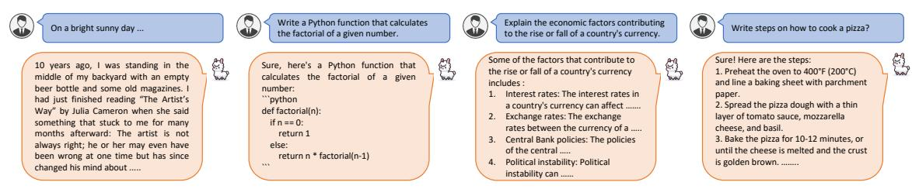

# 4 Results

Baseline Comparison: We first present a comparison with the two baselines in Tab. [5\)](#page-5-1) for 0.5B model series. For the baseline evaluation, we pretrain all the models on the same 100B tokens from the Amber dataset and report the results on four benchmarks: HellaSwag, TruthfulQA, MMLU, and Arc\_C. Our *MobiLlama* achieves favourable performance compared to the two baselines by achieving an average score of 34.4 over the four benchmarks. We note that this performance improvement is achieved without any significant increase in the training cost (see Tab. [1\)](#page-2-0), highlighting the merits of the proposed SLM design.

State-of-the-art Comparison: We compare our *MobiLlama* 0.5B and 0.8B with existing SLMs having comparable (less than 1B) parameters: gpt-

1 [https://huggingface.co/spaces/HuggingFaceH4/open\\_llm\\_leaderboard](https://huggingface.co/spaces/HuggingFaceH4/open_llm_leaderboard)

| Platform       | Model      | #Params (↓) | Precision | Avg Tokens/Sec (†) | Avg Memory Consumption (↓) | Avg Battery Consumption /1k Tokens (\( \psi \)) | CPU Utilization (↓) |
|----------------|------------|-------------|-----------|--------------------|-------------------------------|-------------------------------------------------|------------------------|
|                | Llama2     | 7B          | bf16      | 14.85              | 27793 MB                      | 135.51 mAH                                      | 31.62%                 |
| RTX2080Ti      | Phi2       | 2.7B        | bf16      | 32.19              | 12071 MB                      | 59.13 mAH                                       | 24.73%                 |
| K1 A208011     | large-base | 1.2B        | bf16      | 50.61              | 6254 MB                       | 18.91 mAH                                       | 18.25%                 |
|                | MobiLlama  | 0.5B        | bf16      | 63.38              | <b>3046</b> MB                | <b>8.19</b> mAH                                 | 14.79%                 |
|                | Llama2     | 7B          | 4bit      | 5.96               | 4188 MB                       | 73.5 mAH                                        | 49.16%                 |
| CPU-i7         | Phi2       | 2.7B        | 4bit      | 22.14              | 1972 MB                       | 27.36 mAH                                       | 34.92%                 |
| CPU-1/         | large-base | 1.2B        | 4bit      | 29.23              | 1163 MB                       | 10.81 mAH                                       | 30.84%                 |
|                | MobiLlama  | 0.5B        | 4bit      | 36.32              | <b>799</b> MB                 | <b>4.86</b> mAH                                 | 24.64%                 |
|                | Llama2     | 7B          | 4bit      | 1.193              | 4287 MB                       | 10.07 mAH                                       | 77.41%                 |
| Constant COF   | Phi2       | 2.7B        | 4bit      | 2.882              | 1893 MB                       | 14.61 mAH                                       | 56.82%                 |
| Snapdragon-685 | large-base | 1.2B        | 4bit      | 6.687              | 780 MB                        | 6.00 mAH                                        | 17.15%                 |
|                | MobiLlama  | 0.5B        | 4bit      | 7.021              | <b>770</b> MB                 | <b>5.32</b> mAH                                 | 13.02%                 |

Table 6: Comparison in terms of efficiency and resource consumption on different low-end hardware devices. We show the comparison on: a PC with RTX-2080Ti GPU, a laptop with i7 CPU and a smartphone with Snapdragon-685 processor. In addition to our *large-base* model, we also present the comparison with Llama2 7B and Phi2 2.7B. In case of CPU and smartphone, we use 4-bit GGUF format of the corresponding models, whereas the original models are deployed and tested on PC with RTX-2080Ti GPU. The different metrics measure the model's operational efficiency, model's footprint in the device's RAM and the energy efficiency of processing 1,000 tokens. Our *MobiLlama* performs favorably in terms of efficiency on these low-end hardware devices. We note that both Phi2 and Llama2 are not fully transparent in that the complete data pipeline for pre-training is not publicly available.

| Model      | #Slice | #Params | HellaS | Arc_C | piqa  | wino  | Average |
|------------|--------|---------|--------|-------|-------|-------|---------|
| OPT-1.3B   | 30%    | 0.91B   | 39.81  | 25.77 | 60.77 | 54.7  | 45.26   |
| OPT-6.7B   | 30%    | 4.69B   | 54.56  | 29.01 | 68.61 | 60.69 | 53.21   |
| Llama-2-7B | 30%    | 4.9B    | 49.62  | 31.23 | 63.55 | 61.33 | 51.43   |
| Phi2-2.7B  | 30%    | 1.89B   | 47.56  | 30.29 | 65.94 | 63.14 | 51.73   |
| MobiLlama  | Dense  | 0.5B    | 52.52  | 29.52 | 72.03 | 57.53 | 52.90   |
| MobiLiama  | Dense  | 0.8B    | 54.09  | 30.20 | 73.17 | 57.45 | 53.72   |

Table 7: Comparison on 4 open LLM benchmarks when parameters are sliced down to 30% using Wiki2Text dataset, following (Ashkboos et al., 2024).

neo (Black et al., 2021), tiny-starcoder (Li et al., 2023a), cerebras-gpt (Dey et al., 2023), opt (Zhang et al., 2022), megatron-gpt-2 (Shoeybi et al., 2019), LiteLlama, gpt-sw3, pythia (Biderman et al., 2023), xglm (Lin et al., 2021b), Lamini-LM (Wu et al., 2023). Among existing methods falling around 0.5B model series category, pythia-410m achieves an average score of 43.57. Our MobiLlama 0.5B model achieves superior performance with an average score of 46.0, outperforming pythia-410m by 2.4% in terms of average performance on nine benchmarks. Notably, MobiLlama achieves superior performance on the HellaSwag benchmark which is designed to evaluate the model's capabilities in the NLP text completion task. Further, MobiLlama also performs favorably on commonsense reasoning tasks with superior results on piqa and winogrande benchmarks. Further, our MobiLlama 0.8B model achieves an average score of 49.06.

**Efficiency Comparison:** We present the comparison of our model in terms of efficiency and re-

| Model       | GQA  | SQA  | TextQA | MME    |
|-------------|------|------|--------|--------|
| MobiLlama-V | 58.5 | 53.1 | 41.4   | 1191.9 |

Table 8: Quantitative performance of our multimodal design, *MobiLlama-V* 0.8B, on different benchmarks.

source consumption on various low-end hardware platforms: a PC with RTX-2080Ti GPU, a laptop with i7 CPU, and a smartphone with Snapdragon-685 processor. Tab. 6 shows the comparison of our *MobiLlama* 0.5B with *large-base* 1.2B, Llama2-7B (Touvron et al., 2023) and Phi2-2.7B (Li et al., 2023b) model, in terms of the average processing speed in tokens per second (Average Tokens/Sec), average memory consumption (Avg Memory Consumption) in megabytes (MB), and the average battery consumption (Average Battery Consumption/1000 Tokens) in milliampere-hours (mAH). Our *MobiLlama* performs favorably in terms of efficiency across different hardware platforms.

We further perform an efficiency comparison to a recent post-training sparsification scheme (Ashkboos et al., 2024), where each weight matrix is substituted with a smaller (dense) matrix, thereby reducing dimensions of the embeddings in the model. In such a scheme, the parameters of the original LLM are reduced significantly up to 70% followed by post-slicing fine-tuning using a dataset such as WikiText-2 (Merity et al., 2016). Tab. 7 shows the comparison of our *MobiLlama* with existing LLMs (e.g., Llama-2-7B, OPT-6.7B) on four benchmarks following (Ashkboos et al., 2024). Our *MobiL*-

| Model          |      | #Params HellaSwag Truthfulqa MMLU Arc_C CrowsPairs |       |       |       |       | piqa | race              | siqa | winogrande Average |       |
|----------------|------|----------------------------------------------------|-------|-------|-------|-------|------|-------------------|------|--------------------|-------|
| Boomer         | 1B   | 31.62                                              | 39.42 | 25.42 | 22.26 | 61.26 |      | 57.99 28.99 40.32 |      | 50.98              | 39.80 |
| Pythia-Dedup   | 1B   | 49.63                                              | 38.92 | 24.29 | 29.09 | 67.11 |      | 70.23 32.44 42.63 |      | 53.98              | 45.36 |
| Falcon-RW      | 1B   | 63.12                                              | 35.96 | 25.36 | 35.06 | 69.04 |      | 74.10 36.07 40.23 |      | 61.88              | 48.98 |
| TinyLlama      | 1.1B | 60.22                                              | 37.59 | 26.11 | 33.61 | 70.60 |      | 73.28 36.45 41.65 |      | 59.18              | 48.74 |
| OLMo           | 1.2B | 62.50                                              | 32.94 | 25.86 | 34.45 | 69.59 |      | 73.70 36.74 41.14 |      | 58.90              | 48.42 |
| Cerebras-GPT   | 1.3B | 38.51                                              | 42.70 | 26.66 | 26.10 | 63.67 |      | 66.75 30.33 42.42 |      | 53.59              | 43.41 |
| Lamini         | 1.3B | 38.05                                              | 36.43 | 28.47 | 26.62 | 64.62 |      | 67.89 33.39 43.19 |      | 50.59              | 43.25 |
| OPT            | 1.3B | 54.50                                              | 38.67 | 24.63 | 29.6  | 70.70 |      | 72.47 34.16 42.47 |      | 59.74              | 47.43 |
| GPT-NEO        | 1.3B | 48.49                                              | 39.61 | 24.82 | 31.31 | 65.67 |      | 71.05 34.06 41.81 |      | 57.06              | 45.98 |
| Pythia-Deduped | 1.4B | 55.00                                              | 38.63 | 25.45 | 32.59 | 67.33 |      | 72.68 34.64 42.68 |      | 56.90              | 47.32 |
| large-base     | 1.2B | 62.99                                              | 35.90 | 24.79 | 34.55 | 68.49 |      | 75.57 35.31 41.96 |      | 62.03              | 49.06 |

Table 9: Comprehensive comparisons with existing *< 2B params fully open-source LLM models* on *9* benchmarks. Our 1.2B *large-base* model pre-trained on 1.2T tokens achieves superior performance compared to both the recent OLMo 1.17B model [\(Groeneveld et al.,](#page-9-1) [2024\)](#page-9-1) and TinyLlama 1.1B model [\(Zhang et al.,](#page-10-1) [2024\)](#page-10-1), which are pre-trained on a substantially larger data of 3T tokens.

Figure 3: Example responses from our *MobiLlama* across a variety of tasks, including creative storytelling, coding exercises, economic analysis, and cooking instructions. The responses highlight the models' ability to engage with both abstract concepts and practical, step-by-step processes, demonstrating its broad applicability.

Figure 4: Example responses of *MobiLlama*-V in responding to visual stimuli across a range of scenarios.

*lama* 0.5B and 0.8B models perform favorably against representative LLMs, with an average score of 53.72 computed over four benchmarks. These results highlight the potential of designing new fully transparent SLMs that can achieve comparable capabilities of their larger sliced model counterparts.

Multimodal MobiLlama: We further build a multimodal model on top of our *MobiLlama* by combining it with a vision encoder to develop a generalpurpose visual assistant having visual reasoning capabilities. Our multimodal model, *MobiLlama*-V , is trained by bridging the visual encoder of CLIP [\(Radford et al.,](#page-10-13) [2021\)](#page-10-13) with the language decoder of our *MobiLlama*, and fine-tuning it in an end-to-end fashion on a 665k vision-language instruction set [\(Liu et al.,](#page-9-15) [2023a\)](#page-9-15). We conduct

evaluation on GQA [\(Hudson and Manning,](#page-9-16) [2019\)](#page-9-16), SQA [\(Lu et al.,](#page-9-17) [2022\)](#page-9-17), TextQA [\(Singh et al.,](#page-10-14) [2019\)](#page-10-14), and MME [\(Fu et al.,](#page-8-12) [2023\)](#page-8-12). Tab. [8](#page-6-2) shows the performance of *MobiLlama*-V 0.8B model.

Qualitative Analysis: Fig. [3](#page-7-0) shows example responses obtained when interacting with *MobiLlama* 0.5B with conversation capabilities. We show examples covering different tasks such as, text completion, code generation and conversation capabilities. Our model generates faithful responses to these diverse interactions. Fig. [4](#page-7-1) shows examples demonstrating visual reasoning capabilities of our multimodal *MobiLlama*-V . For instance, *MobiLlama*-V accurately describes the atypical aspects of the image when asked to describe the given image.

Evaluating Large-base Model: As discussed ear-

lier, we strive to develop fully transparent models for democratization of SLMs and fostering future research. To this end, we compare our *large-base* 1.2B with existing fully transparent SLMs falling within the less than 2B category. Tab. [9](#page-7-2) shows that compared to recent OLMo and TinyLlama that are pre-trained on a larger dataset of 3T tokens, our *large-base* 1.2B model pre-trained on 1.2T tokens achieves favourable results with an average score of 49.06 over nine benchmarks. We hope that our *large-base* model will serve as a solid baseline and help ease future research in SLM development.

## 5 Conclusion

We present a fully transparent SLM, *MobiLlama*, that alleviates redundancy in the transformer block. Within *MobiLlama*, we propose to utilize a shared FFN design for all the blocks within the SLM. We evaluate *MobiLlama* on nine benchmarks, achieving favourable results compared to existing methods falling under less than 1B category. We also build a multimodal model on top of *MobiLlama* SLM to demonstrate visual reasoning capabilities. Limitation and Future Direction: A potential direction is to further improve *MobiLlama* for enhanced context comprehension. While *MobiLlama* offers a fully transparent SLM framework, a followup study to understand any misrepresentations and biases is desired to improve model's robustness.

## 6 Acknowledgement

The computations were enabled by the Berzelius resource provided by the Knut and Alice Wallenberg Foundation at the National Supercomputer Centre. We thank Sahal Shaji Mullappilly and Muhammad Maaz for their support in the evaluations on mobile platform and VLM training.

## References

- Ebtesam Almazrouei, Hamza Alobeidli, Abdulaziz Alshamsi, Alessandro Cappelli, Ruxandra Cojocaru, Mérouane Debbah, Étienne Goffinet, Daniel Hesslow, Julien Launay, Quentin Malartic, Daniele Mazzotta, Badreddine Noune, Baptiste Pannier, and Guilherme Penedo. 2023. [The falcon series of open language](http://arxiv.org/abs/2311.16867) [models.](http://arxiv.org/abs/2311.16867)
- Saleh Ashkboos, Maximilian L Croci, Marcelo Gennari do Nascimento, Torsten Hoefler, and James Hensman. 2024. Slicegpt: Compress large language models by deleting rows and columns. *arXiv preprint arXiv:2401.15024*.

- Srinadh Bhojanapalli, Ayan Chakrabarti, Andreas Veit, Michal Lukasik, Himanshu Jain, Frederick Liu, Yin-Wen Chang, and Sanjiv Kumar. 2021. Leveraging redundancy in attention with reuse transformers. *arXiv preprint arXiv:2110.06821*.
- Stella Biderman, Hailey Schoelkopf, Quentin Gregory Anthony, Herbie Bradley, Kyle O'Brien, Eric Hallahan, Mohammad Aflah Khan, Shivanshu Purohit, USVSN Sai Prashanth, Edward Raff, et al. 2023. Pythia: A suite for analyzing large language models across training and scaling. In *International Conference on Machine Learning*, pages 2397–2430. PMLR.
- Yonatan Bisk, Rowan Zellers, Jianfeng Gao, Yejin Choi, et al. 2020. Piqa: Reasoning about physical commonsense in natural language. In *Proceedings of the AAAI conference on artificial intelligence*, volume 34, pages 7432–7439.
- Sid Black, Gao Leo, Phil Wang, Connor Leahy, and Stella Biderman. 2021. [GPT-Neo: Large](https://doi.org/10.5281/zenodo.5297715) [Scale Autoregressive Language Modeling with Mesh-](https://doi.org/10.5281/zenodo.5297715)[Tensorflow.](https://doi.org/10.5281/zenodo.5297715) If you use this software, please cite it using these metadata.
- Peter Clark, Isaac Cowhey, Oren Etzioni, Tushar Khot, Ashish Sabharwal, Carissa Schoenick, and Oyvind Tafjord. 2018. Think you have solved question answering? try arc, the ai2 reasoning challenge. *arXiv preprint arXiv:1803.05457*.
- Together Computer. 2023. [Redpajama: An open source](https://github.com/togethercomputer/RedPajama-Data) [recipe to reproduce llama training dataset.](https://github.com/togethercomputer/RedPajama-Data)
- Tri Dao. 2023. Flashattention-2: Faster attention with better parallelism and work partitioning. *arXiv preprint arXiv:2307.08691*.
- Nolan Dey, Gurpreet Gosal, Hemant Khachane, William Marshall, Ribhu Pathria, Marvin Tom, Joel Hestness, et al. 2023. Cerebras-gpt: Open compute-optimal language models trained on the cerebras wafer-scale cluster. *arXiv preprint arXiv:2304.03208*.
- Elias Frantar, Saleh Ashkboos, Torsten Hoefler, and Dan Alistarh. 2022. Gptq: Accurate post-training quantization for generative pre-trained transformers. *arXiv preprint arXiv:2210.17323*.
- Chaoyou Fu, Peixian Chen, Yunhang Shen, Yulei Qin, Mengdan Zhang, Xu Lin, Jinrui Yang, Xiawu Zheng, Ke Li, Xing Sun, et al. 2023. Mme: A comprehensive evaluation benchmark for multimodal large language models. *arXiv preprint arXiv:2306.13394*.
- Leo Gao, Jonathan Tow, Baber Abbasi, Stella Biderman, Sid Black, Anthony DiPofi, Charles Foster, Laurence Golding, Jeffrey Hsu, Alain Le Noac'h, Haonan Li, Kyle McDonell, Niklas Muennighoff, Chris Ociepa, Jason Phang, Laria Reynolds, Hailey Schoelkopf, Aviya Skowron, Lintang Sutawika, Eric Tang, Anish Thite, Ben Wang, Kevin Wang, and Andy Zou. 2023. [A framework for few-shot language model](https://doi.org/10.5281/zenodo.10256836) [evaluation.](https://doi.org/10.5281/zenodo.10256836)

- Amir Gholami, Sehoon Kim, Zhen Dong, Zhewei Yao, Michael W Mahoney, and Kurt Keutzer. 2022. A survey of quantization methods for efficient neural network inference. In *Low-Power Computer Vision*, pages 291–326. Chapman and Hall/CRC.
- Dirk Groeneveld, Iz Beltagy, Pete Walsh, Akshita Bhagia, Rodney Kinney, Oyvind Tafjord, A. Jha, Hamish Ivison, Ian Magnusson, Yizhong Wang, Shane Arora, David Atkinson, Russell Authur, Khyathi Raghavi Chandu, Arman Cohan, Jennifer Dumas, Yanai Elazar, Yuling Gu, Jack Hessel, Tushar Khot, William Merrill, Jacob Daniel Morrison, Niklas Muennighoff, Aakanksha Naik, Crystal Nam, Matthew E. Peters, Valentina Pyatkin, Abhilasha Ravichander, Dustin Schwenk, Saurabh Shah, Will Smith, Emma Strubell, Nishant Subramani, Mitchell Wortsman, Pradeep Dasigi, Nathan Lambert, Kyle Richardson, Luke Zettlemoyer, Jesse Dodge, Kyle Lo, Luca Soldaini, Noah A. Smith, and Hanna Hajishirzi. 2024. [Olmo:](https://api.semanticscholar.org/CorpusID:267365485) [Accelerating the science of language models.](https://api.semanticscholar.org/CorpusID:267365485) *arXiv preprint*.
- Dan Hendrycks, Collin Burns, Steven Basart, Andy Zou, Mantas Mazeika, Dawn Song, and Jacob Steinhardt. 2020. Measuring massive multitask language understanding. *arXiv preprint arXiv:2009.03300*.
- Torsten Hoefler, Dan Alistarh, Tal Ben-Nun, Nikoli Dryden, and Alexandra Peste. 2021. Sparsity in deep learning: Pruning and growth for efficient inference and training in neural networks. *The Journal of Machine Learning Research*, 22(1):10882–11005.
- Drew A Hudson and Christopher D Manning. 2019. Gqa: A new dataset for real-world visual reasoning and compositional question answering. In *Proceedings of the IEEE/CVF conference on computer vision and pattern recognition*, pages 6700–6709.
- Guokun Lai, Qizhe Xie, Hanxiao Liu, Yiming Yang, and Eduard Hovy. 2017. Race: Large-scale reading comprehension dataset from examinations. *arXiv preprint arXiv:1704.04683*.
- Raymond Li, Loubna Ben Allal, Yangtian Zi, Niklas Muennighoff, Denis Kocetkov, Chenghao Mou, Marc Marone, Christopher Akiki, Jia Li, Jenny Chim, Qian Liu, Evgenii Zheltonozhskii, Terry Yue Zhuo, Thomas Wang, Olivier Dehaene, Mishig Davaadorj, Joel Lamy-Poirier, João Monteiro, Oleh Shliazhko, Nicolas Gontier, Nicholas Meade, Armel Zebaze, Ming-Ho Yee, Logesh Kumar Umapathi, Jian Zhu, Benjamin Lipkin, Muhtasham Oblokulov, Zhiruo Wang, Rudra Murthy, Jason Stillerman, Siva Sankalp Patel, Dmitry Abulkhanov, Marco Zocca, Manan Dey, Zhihan Zhang, Nour Fahmy, Urvashi Bhattacharyya, Wenhao Yu, Swayam Singh, Sasha Luccioni, Paulo Villegas, Maxim Kunakov, Fedor Zhdanov, Manuel Romero, Tony Lee, Nadav Timor, Jennifer Ding, Claire Schlesinger, Hailey Schoelkopf, Jan Ebert, Tri Dao, Mayank Mishra, Alex Gu, Jennifer Robinson, Carolyn Jane Anderson, Brendan Dolan-Gavitt, Danish Contractor, Siva Reddy, Daniel Fried, Dzmitry Bahdanau, Yacine Jernite, Carlos Muñoz Ferrandis,

- Sean Hughes, Thomas Wolf, Arjun Guha, Leandro von Werra, and Harm de Vries. 2023a. [Starcoder:](http://arxiv.org/abs/2305.06161) [may the source be with you!](http://arxiv.org/abs/2305.06161)
- Yuanzhi Li, Sébastien Bubeck, Ronen Eldan, Allie Del Giorno, Suriya Gunasekar, and Yin Tat Lee. 2023b. Textbooks are all you need ii: phi-1.5 technical report. *arXiv preprint arXiv:2309.05463*.
- Stephanie Lin, Jacob Hilton, and Owain Evans. 2021a. Truthfulqa: Measuring how models mimic human falsehoods. *arXiv preprint arXiv:2109.07958*.
- Xi Victoria Lin, Todor Mihaylov, Mikel Artetxe, Tianlu Wang, Shuohui Chen, Daniel Simig, Myle Ott, Naman Goyal, Shruti Bhosale, Jingfei Du, Ramakanth Pasunuru, Sam Shleifer, Punit Singh Koura, Vishrav Chaudhary, Brian O'Horo, Jeff Wang, Luke Zettlemoyer, Zornitsa Kozareva, Mona T. Diab, Veselin Stoyanov, and Xian Li. 2021b. [Few-shot learn](http://arxiv.org/abs/2112.10668)[ing with multilingual language models.](http://arxiv.org/abs/2112.10668) *CoRR*, abs/2112.10668.
- Haotian Liu, Chunyuan Li, Qingyang Wu, and Yong Jae Lee. 2023a. Visual instruction tuning.
- Zhengzhong Liu, Aurick Qiao, Willie Neiswanger, Hongyi Wang, Bowen Tan, Tianhua Tao, Junbo Li, Yuqi Wang, Suqi Sun, Omkar Pangarkar, Richard Fan, Yi Gu, Victor Miller, Yonghao Zhuang, Guowei He, Haonan Li, Fajri Koto, Liping Tang, Nikhil Ranjan, Zhiqiang Shen, Xuguang Ren, Roberto Iriondo, Cun Mu, Zhiting Hu, Mark Schulze, Preslav Nakov, Tim Baldwin, and Eric P. Xing. 2023b. [Llm360: Towards](http://arxiv.org/abs/2312.06550) [fully transparent open-source llms.](http://arxiv.org/abs/2312.06550)
- Ilya Loshchilov and Frank Hutter. 2017. Decoupled weight decay regularization. *arXiv preprint arXiv:1711.05101*.
- Pan Lu, Swaroop Mishra, Tanglin Xia, Liang Qiu, Kai-Wei Chang, Song-Chun Zhu, Oyvind Tafjord, Peter Clark, and Ashwin Kalyan. 2022. Learn to explain: Multimodal reasoning via thought chains for science question answering. *Advances in Neural Information Processing Systems*, 35:2507–2521.
- Stephen Merity, Caiming Xiong, James Bradbury, and Richard Socher. 2016. Pointer sentinel mixture models. *arXiv preprint arXiv:1609.07843*.
- Nikita Nangia, Clara Vania, Rasika Bhalerao, and Samuel R Bowman. 2020. Crows-pairs: A challenge dataset for measuring social biases in masked language models. *arXiv preprint arXiv:2010.00133*.
- Bowen Pan, Rameswar Panda, Rogerio Schmidt Feris, and Aude Jeanne Oliva. 2023. Interpretability-aware redundancy reduction for vision transformers. US Patent App. 17/559,053.
- Guilherme Penedo, Quentin Malartic, Daniel Hesslow, Ruxandra Cojocaru, Alessandro Cappelli, Hamza Alobeidli, Baptiste Pannier, Ebtesam Almazrouei, and Julien Launay. 2023. [The RefinedWeb dataset](http://arxiv.org/abs/2306.01116) [for Falcon LLM: outperforming curated corpora](http://arxiv.org/abs/2306.01116)

- [with web data, and web data only.](http://arxiv.org/abs/2306.01116) *arXiv preprint arXiv:2306.01116*.
- Telmo Pessoa Pires, António V Lopes, Yannick Assogba, and Hendra Setiawan. 2023. One wide feedforward is all you need. *arXiv preprint arXiv:2309.01826*.
- Alec Radford, Jong Wook Kim, Chris Hallacy, Aditya Ramesh, Gabriel Goh, Sandhini Agarwal, Girish Sastry, Amanda Askell, Pamela Mishkin, Jack Clark, et al. 2021. Learning transferable visual models from natural language supervision. In *International conference on machine learning*, pages 8748–8763. PMLR.
- Keisuke Sakaguchi, Ronan Le Bras, Chandra Bhagavatula, and Yejin Choi. 2021. Winogrande: An adversarial winograd schema challenge at scale. *Communications of the ACM*, 64(9):99–106.
- Maarten Sap, Hannah Rashkin, Derek Chen, Ronan LeBras, and Yejin Choi. 2019. Socialiqa: Commonsense reasoning about social interactions. *arXiv preprint arXiv:1904.09728*.
- Mohammad Shoeybi, Mostofa Patwary, Raul Puri, Patrick LeGresley, Jared Casper, and Bryan Catanzaro. 2019. Megatron-lm: Training multi-billion parameter language models using model parallelism. *arXiv preprint arXiv:1909.08053*.
- Amanpreet Singh, Vivek Natarajan, Meet Shah, Yu Jiang, Xinlei Chen, Dhruv Batra, Devi Parikh, and Marcus Rohrbach. 2019. Towards vqa models that can read. In *Proceedings of the IEEE/CVF conference on computer vision and pattern recognition*, pages 8317–8326.
- Jianlin Su, Murtadha Ahmed, Yu Lu, Shengfeng Pan, Wen Bo, and Yunfeng Liu. 2024. Roformer: Enhanced transformer with rotary position embedding. *Neurocomputing*, 568:127063.
- Hugo Touvron, Louis Martin, Kevin Stone, Peter Albert, Amjad Almahairi, Yasmine Babaei, Nikolay Bashlykov, Soumya Batra, Prajjwal Bhargava, Shruti Bhosale, et al. 2023. Llama 2: Open foundation and fine-tuned chat models. *arXiv preprint arXiv:2307.09288*.
- Minghao Wu, Abdul Waheed, Chiyu Zhang, Muhammad Abdul-Mageed, and Alham Fikri Aji. 2023. [Lamini-lm: A diverse herd of distilled models from](http://arxiv.org/abs/2304.14402) [large-scale instructions.](http://arxiv.org/abs/2304.14402) *CoRR*, abs/2304.14402.
- Guangxuan Xiao, Ji Lin, Mickael Seznec, Hao Wu, Julien Demouth, and Song Han. 2023. Smoothquant: Accurate and efficient post-training quantization for large language models. In *International Conference on Machine Learning*, pages 38087–38099. PMLR.
- Can Xu, Qingfeng Sun, Kai Zheng, Xiubo Geng, Pu Zhao, Jiazhan Feng, Chongyang Tao, and Daxin Jiang. 2023. Wizardlm: Empowering large language models to follow complex instructions. *arXiv preprint arXiv:2304.12244*.

- Rowan Zellers, Ari Holtzman, Yonatan Bisk, Ali Farhadi, and Yejin Choi. 2019. Hellaswag: Can a machine really finish your sentence? *arXiv preprint arXiv:1905.07830*.
- Peiyuan Zhang, Guangtao Zeng, Tianduo Wang, and Wei Lu. 2024. Tinyllama: An open-source small language model. *arXiv preprint arXiv:2401.02385*.
- Susan Zhang, Stephen Roller, Naman Goyal, Mikel Artetxe, Moya Chen, Shuohui Chen, Christopher Dewan, Mona Diab, Xian Li, Xi Victoria Lin, Todor Mihaylov, Myle Ott, Sam Shleifer, Kurt Shuster, Daniel Simig, Punit Singh Koura, Anjali Sridhar, Tianlu Wang, and Luke Zettlemoyer. 2022. [Opt: Open pre](http://arxiv.org/abs/2205.01068)[trained transformer language models.](http://arxiv.org/abs/2205.01068)
- Wayne Xin Zhao, Kun Zhou, Junyi Li, Tianyi Tang, Xiaolei Wang, Yupeng Hou, Yingqian Min, Beichen Zhang, Junjie Zhang, Zican Dong, et al. 2023. A survey of large language models. *arXiv preprint arXiv:2303.18223*.
- Lianmin Zheng, Wei-Lin Chiang, Ying Sheng, Siyuan Zhuang, Zhanghao Wu, Yonghao Zhuang, Zi Lin, Zhuohan Li, Dacheng Li, Eric Xing, et al. 2024. Judging llm-as-a-judge with mt-bench and chatbot arena. *Advances in Neural Information Processing Systems*, 36.
- Xunyu Zhu, Jian Li, Yong Liu, Can Ma, and Weiping Wang. 2023. A survey on model compression for large language models. *arXiv preprint arXiv:2308.07633*.

## A Appendix

## A.1 MobiLlama-Chat

We also developed the fine-tuned versions of MobiLlama-0.5B and MobiLlama-1.2B, namely MobiLlama-0.5B-Chat and MobiLlama-1.2B-Chat. We used the similar fine-tuning dataset and hyperparameters as AmberChat [\(Liu et al.,](#page-9-8) [2023b\)](#page-9-8) to train our models. We use FastChat [\(Zheng et al.,](#page-10-15) [2024\)](#page-10-15) to fine-tune our models on [WizzardLM-](https://huggingface.co/datasets/WizardLM/WizardLM_evol_instruct_V2_196k)[196K](https://huggingface.co/datasets/WizardLM/WizardLM_evol_instruct_V2_196k) as used by WizardLM [\(Xu et al.,](#page-10-16) [2023\)](#page-10-16). We trained our base models for 3 epochs on 8 A100s (80G), keeping the learning rate as 2 × 10−5 , gradient accumulation steps as 16, and warmup ratio as 0.04.

### A.2 Qualitative Examples

## Reasoning:

Human: What are the key benefits of practicing mindfulness meditation?

## MobiLlama-0.5B:

Practicing mindfulness meditation can have several benefits, including:

- 1. Reduced stress and anxiety: Mindfulness meditation can help reduce stress and anxiety by focusing on the present moment and letting go of distractions.
- 2. Improved focus and concentration: Mindfulness meditation can help improve focus and concentration by focusing on the present moment and letting go of distractions.
- 3. Better sleep: Mindfulness meditation can help improve sleep by reducing stress and anxiety and promoting relaxation.
- 4. Better mood: Mindfulness meditation can help improve mood by reducing stress and anxiety and promoting relaxation.
- 5. Better relationships: Mindfulness meditation can help improve relationships by reducing stress and anxiety and promoting relaxation.

#### Knowledge:

Human: What are some ways to reduce the carbon footprint of your home?

## MobiLlama-0.5B:

Reducing the carbon footprint of your home can be achieved through several ways. Here are some tips:

- 1. Use energy-efficient lighting and appliances.
- 2. Install energy-efficient windows and doors.
- 3. Use energy-efficient appliances and lighting.
- 4. Reduce the use of paper and other non-biodegradable materials.
- 5. Use energy-efficient appliances and lighting.
- 6. Reduce the use of plastic and other single-use materials.
- 7. Use energy-efficient appliances and lighting.
- 8. Reduce the use of paper and other single-use materials.

## Reasoning:

Human: How do diverse ecosystems contribute to the overall health of the planet?

