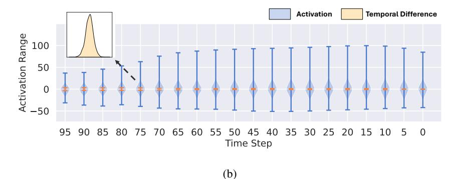

# 2. Related Work

Diffusion Models. Diffusion models have become a cornerstone of generative modeling, achieving remarkable success across diverse domains such as image synthesis, data distillation, and molecular modeling [\(Ho et al.,](#page-9-0) [2020;](#page-9-0) [Hoogeboom](#page-9-4) [et al.,](#page-9-4) [2022;](#page-9-4) [Su et al.,](#page-10-6) [2024\)](#page-10-6). These models operate on an iterative framework that involves adding noise in the forward process and learning to remove it during the reverse process [\(Dhariwal & Nichol,](#page-9-5) [2021\)](#page-9-5). However, the iterative nature of the sampling process makes generation computationally expensive [\(Song et al.,](#page-10-1) [2021b;](#page-10-1) [Ho et al.,](#page-9-0) [2020\)](#page-9-0). To address this efficiency bottleneck, a line of research has focused on improving the sampling process by optimizing the variance schedule or employing more advanced ODE solvers [\(Song et al.,](#page-10-0) [2021a;](#page-10-0) [Nichol & Dhariwal,](#page-10-7) [2021;](#page-10-7) [Liu](#page-9-1) [et al.,](#page-9-1) [2022\)](#page-9-1). For example, Denoising Diffusion Implicit Models (DDIMs) introduce a non-Markovian formulation for the diffusion process, significantly reducing the number of sampling steps required [\(Song et al.,](#page-10-0) [2021a\)](#page-10-0).

Caching Methods. Caching methods for accelerating diffusion models aim to reduce redundant computations during the generative process by reusing intermediate results, thereby improving efficiency [\(Ma et al.,](#page-10-2) [2024b;](#page-10-2) [Wimbauer](#page-10-3) [et al.,](#page-10-3) [2024;](#page-10-3) [Ma et al.,](#page-9-6) [2024a\)](#page-9-6). These strategies address the high computational cost by selectively storing intermediate states from the reverse diffusion process for reuse in subsequent steps. For example, DeepCache reuses cached upsampled features every N time steps [\(Ma et al.,](#page-10-2) [2024b\)](#page-10-2). However, it can accumulate errors in the generation process with the reusing technique. Existing works rely on heuristic approaches to determine N, which limits its generalizability. Some methods also attempt to preserve model performance by fine-tuning diffusion models, but this approach can be computationally expensive [\(Wimbauer et al.,](#page-10-3) [2024;](#page-10-3) [Ma et al.,](#page-9-6) [2024a;](#page-9-6) [Chen et al.,](#page-9-7) [2024\)](#page-9-7). In contrast to caching methods, our proposed MoDiff introduces a novel and principled framework to leverage the computation redundancy between sampling steps through modulated computing.

Post-Training Quantization. Quantization aims to reduce inference costs by converting floating-point numbers into low-bit integers [\(Nagel et al.,](#page-10-4) [2021;](#page-10-4) [Yang et al.,](#page-10-5) [2019\)](#page-10-5) using scaling factors. Post-training quantization (PTQ) has emerged as a powerful approach due to its training-free nature, making it suitable for pre-trained models [\(Li et al.,](#page-9-3) [2021\)](#page-9-3). Several studies have explored the application of PTQ techniques to diffusion models [\(Li et al.,](#page-9-2) [2023;](#page-9-2) [Wang](#page-10-8) [et al.,](#page-10-8) [2024;](#page-10-8) [Huang et al.,](#page-9-8) [2024;](#page-9-8) [Shang et al.,](#page-10-9) [2023;](#page-10-9) [He et al.,](#page-9-9) [2023b;](#page-9-9) [Zhao et al.,](#page-10-10) [2025\)](#page-10-10). For example, Q-Diffusion introduces a time-step-aware calibration data sampling mechanism tailored for diffusion models, achieving strong performance with 8-bit activations. However, a common issue is that existing methods struggle to quantize activations to

Figure 1. A preliminary study using DDIM on CIFAR-10 with 100 generation steps. (a) The relative  $\ell_2$  distance between the cached and standard diffusion features in *middle block*, initialized from the same noise. As the reuse frequency increases, error accumulation becomes more significant. (b) The distribution of activations and their temporal differences across different diffusion time steps. The blue violin plots show that activation ranges fluctuate over time and exhibit outliers with long-tailed distributions. In contrast, the orange violin plots demonstrate more consistent ranges and concentrated distributions.

low bitwidths due to the presence of outlier values with large dynamic ranges (Xiao et al., 2023; Feng et al., 2024). One related method is PTQD (He et al., 2023b), which post processes quantized models to reduce the quantization error. We pose the detailed comparison to PTQD in Appendix E.

Another line of research focuses on quantization-aware training (QAT), which integrates the quantization process into the training phase, enabling model parameters to adapt to quantization (Nagel et al., 2022). These methods effectively address the challenges of low-bit quantization in diffusion models (Feng et al., 2024; He et al., 2023a). However, QAT approaches require costly retraining of diffusion models, which is **orthogonal to but not the focus of this work**. In contrast, the proposed MoDiff framework can be seamlessly integrated to state-of-the-art PTQ methods to reduce activation bit-widths without additional training.

#### 3. Preliminary Study

In this section, we introduce the fundamental concepts of diffusion models and quantization. Additionally, we examine the challenges associated with existing caching and quantization methods with preliminary experiments.

#### 3.1. Diffusion Models and Cache Reusing

Diffusion models consist of two processes: a forward process and a backward process, operating over T steps. Using Denoising Diffusion Probabilistic Models (DDPMs) as an example (Ho et al., 2020), the forward process incrementally adds noise to the image at each step, gradually transforming the data distribution into a standard Gaussian distribution:

$$q(\mathbf{x}_t|\mathbf{x}_{t-1}) = N(\mathbf{x}_t; \sqrt{1-\beta_t}\mathbf{x}_{t-1}, \beta_t I).$$
 (1)

Meanwhile, the reverse process progressively denoises the Gaussian distribution, reconstructing the original image dis-

tribution step by step with a denoising network:

$$p_{\theta}(\mathbf{x}_{t-1}|\mathbf{x}_t) = N(\mathbf{x}_{t-1}; \mu_{\theta}(\mathbf{x}_t, t), \sigma_t^2 I), \tag{2}$$

where  $\mu_{\theta}(\mathbf{x}_t, t)$  is predicted by a neural network, while  $\sigma_t$  is typically set to  $\beta_t$ . With this parametrization, the sampling process can be expressed as:

$$\mathbf{x}_{t-1} = \frac{1}{\sqrt{1-\beta_t}} \left( \mathbf{x}_t - \frac{\beta_t}{\sqrt{1-\bar{\alpha}_t}} \epsilon_{\theta}(\mathbf{x}_t, t) \right) + \sigma_t \mathbf{z}, \quad (3)$$

where  $\bar{\alpha}_t = \prod_{t=1}^t (1 - \beta_t)$ , and  $\epsilon_{\theta}(\mathbf{x}_t, t)$  represents a U-Net that predicts the noise. However, since generating samples requires predicting noise across T steps, the diffusion process is computationally expensive for practical applications.

Existing approaches reuse historical computations to accelerate the sampling process by exploiting the similarities between features at adjacent time steps in diffusion models (Ma et al., 2024b; Wimbauer et al., 2024; Ma et al., 2024a). However, these caching methods directly reuse past information, which often cause approximation errors and deviate from the standard generation path of diffusion models. This discrepancy introduces errors at each reuse step, which accumulate over multiple iterations. As a result, these techniques require careful design of reuse schedules and even rely on retraining to tune models, necessitating expensive hyperparameter search.

To illustrate the impact of reuse schedules, we conduct a preliminary study, where we apply caching to the residual connections of the U-Net in DDIM on CIFAR-10 without tuning following Ma et al. (2024b). Specifically, we reuse the activations from the previous time step for N-1 steps and update them at every N-th step. We compare the relative  $\ell_2$  distance between standard diffusion models and the variant with reused caching in *middle block*. As shown in Figure 1a, the relative error increases significantly as the number of reuse steps and the time steps grows.

Figure 2. (a) Standard PTQ methods: The computations at different time steps are independent, with the raw activation  $\mathbf{a}_t^{(l)}$  serving directly as the input to the quantizer. (b) Quantization with our MoDiff: For each linear operator, such as linear layers and convolutional layers, we cache the output from the previous time step,  $\hat{\mathbf{a}}_t^{(l)}$ , and input the temporal difference  $\mathbf{a}_{t-1}^{(l)} - \hat{\mathbf{a}}_t^{(l)}$  into the quantizer. The final output is obtained by aggregating the current computation results of  $\mathcal{A}^l$  with the cached output from the previous step  $\hat{\mathbf{o}}_t^{(l)}$ .

