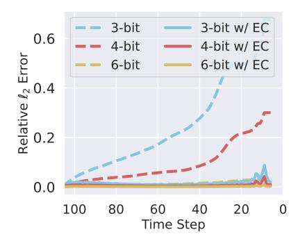

# 3.2. Post-Training Quantization

Quantization is an effective technique to reduce the inference cost of deep learning models by utilizing low-precision integers (Nagel et al., 2021). Given  $\mathbf{x}$ , we denote the integer representation as  $\mathbf{x}_{\text{int}}$  and the dequantization vector as  $Q(\mathbf{x})$ :

$$\mathbf{x}_{\text{int}} = \text{clamp}(\left\lfloor \frac{\mathbf{x}}{s} \right\rfloor + \mathbf{z}; 0, 2^b - 1), \tag{4}$$

$$Q(\mathbf{x}) = s(\mathbf{x}_{\text{int}} - \mathbf{z}),\tag{5}$$

where b represents the quantization bandwidth, and clamp(·) enforces value cut-offs between two integer bounds. The parameters s and z correspond to the scale factor and zero point, respectively. PTQ (Shang et al., 2023) dynamically estimates the parameters s and z or derives them using calibration datasets with a pre-trained model. Due to its simplicity and efficiency, PTQ is widely adopted.

The major challenge for PTQ methods in diffusion models is to use low-bit quantization. First, the activation tensor ranges vary significantly across different time steps, as illustrated by the height of the blue violin plot in Figure 1b. This variation makes it difficult for a shared scaling parameter s to handle all ranges. Second, significant outlier values exist within the activations at each time step. In Figure 1b, the width of the violin plot represents the distribution of activation values for a specific time step. These outliers make it challenging to select a scaling parameter s that minimizes both clipping error and rounding error simultaneously.

In a nutshell, both caching and PTQ methods face their own inherent challenges, highlighting the need for a more effective strategy that can incorporate historical information while also mitigating the effects of activation distributions.

## 4. Modulated Diffusion

In this section, we propose Modulated Diffusion (MoDiff), a novel framework to accelerate all diffusion models with low-bit activation quantization, as shown in Figure 2. We introduce a high-level motivation in Section 4.1. To ease the understanding, we first present an equivalent reformulation of the diffusion process to reduce the quantization error in Section 4.2. Then, we propose novel error-compensated modulation to address accumulated error across the diffusion steps in Section 4.3. Computation and memory costs are discussed in Section 4.4, followed by theoretical error analyses of our MoDiff in Section 4.5.

#### 4.1. High-Level Motivation

While the heuristic design of caching methods exhibit significant and accumulated computation errors, the motivation to leverage computation in previous time steps to reduce computation in future time steps is still of great interest. Inspired by the similarity of activation patterns across adjacent time steps, we measure the temporal differences between activation values over the diffusion process as  $\mathbf{a}_{t}^{(l)} - \mathbf{a}_{t+1}^{(l)}$ , where  $\mathbf{a}_{t}^{(l)}$  represents the activation at time step t for the l-th layer of the denoising network. The distribution of these differences is visualized in Figure 1b in orange color. Compared to the activations, their temporal differences exhibit a much smaller and more consistent range across time steps. Moreover, their distribution is more concentrated, effectively reducing the presence of outliers. These interesting observation and analyses suggest that a strong motivation to leverage this temporal stability with quantized computing to alleviate the computation errors in existing approaches.

## 4.2. Modulated Quantization

**Notation.** Let  $\mathcal{A}^{(l)}(\cdot)$  denote the l-th linear operator in the denoising network, such as the linear and convolutional layers, where  $l \in \{1,2,\ldots,L\}$ . We denote the input and output activations for  $\mathcal{A}^{(l)}(\cdot)$  at time step t as  $\mathbf{a}_t^{(l)}$  and  $\mathbf{o}_t^{(l)} = \mathcal{A}^{(l)}(\mathbf{a}_t^{(l)})$ , respectively. Note that we focus on accel-

erating the computation of linear operators, such as linear and convolutional layers, since they are the most costly operations in neural networks and account for the majority of computation during data generation (Zhao et al., 2024).

Motivated by the insights from Section 4.1, we propose a novel modulated computation to reformulate the computation of each l-th linear layer in the denoising network in diffusion models as follows:

$$\begin{cases}
\mathbf{o}_{T}^{(l)} &= \mathcal{A}^{(l)}(\mathbf{a}_{T}^{(l)}) \\
\mathbf{o}_{T-1}^{(l)} &= \mathcal{A}^{(l)}(\mathbf{a}_{T-1}^{(l)}) = \mathcal{A}^{(l)}(\mathbf{a}_{T-1}^{(l)} - \mathbf{a}_{T}^{(l)}) + \mathbf{o}_{T}^{(l)} \\
& \cdots \\
\mathbf{o}_{t}^{(l)} &= \mathcal{A}^{(l)}(\mathbf{a}_{t}^{(l)}) &= \mathcal{A}^{(l)}(\mathbf{a}_{t}^{(l)} - \mathbf{a}_{t+1}^{(l)}) + \mathbf{o}_{t+1}^{(l)} \\
& \cdots \\
\mathbf{o}_{1}^{(l)} &= \mathcal{A}^{(l)}(\mathbf{a}_{1}^{(l)}) &= \mathcal{A}^{(l)}(\mathbf{a}_{1}^{(l)} - \mathbf{a}_{2}^{(l)}) + \mathbf{o}_{2}^{(l)}
\end{cases}$$

where the output  $\mathbf{o}_{t}^{(l)}$  in time step t can be equivalently computed by incrementally refining the output  $\mathbf{o}_{t+1}^{(l)}$  computed in previous time step t+1 with the modulated computation  $\mathcal{A}^{(l)}(\mathbf{a}_t^{(l)} - \mathbf{a}_{t+1}^{(l)})$ . Specifically, the second equality in each equation holds because of the linearity of the operator  $\mathcal{A}^{(l)}$ :

$$\begin{split} \mathcal{A}^{(l)}(\mathbf{a}_{t}^{(l)}) &= \mathcal{A}^{(l)}(\mathbf{a}_{t}^{(l)}) - \mathcal{A}^{(l)}(\mathbf{a}_{t+1}^{(l)}) + \mathcal{A}^{(l)}(\mathbf{a}_{t+1}^{(l)}) \\ &= \mathcal{A}^{(l)}(\mathbf{a}_{t}^{(l)} - \mathbf{a}_{t+1}^{(l)}) + \mathbf{o}_{t+1}^{(l)}. \end{split}$$

We further propose to apply a quantizer Q to approximate the temporal difference before quantized computation1:

$$\begin{cases}
\hat{\mathbf{o}}_{T} &= \mathcal{A}\Big(Q(\mathbf{a}_{T})\Big) &\approx \mathcal{A}(\mathbf{a}_{T}) \\
\hat{\mathbf{o}}_{T-1} &= \mathcal{A}\Big(Q(\mathbf{a}_{T-1} - \mathbf{a}_{T})\Big) + \hat{\mathbf{o}}_{T} &\approx \mathcal{A}(\mathbf{a}_{T-1}) \\
& \cdots \\
\hat{\mathbf{o}}_{t} &= \mathcal{A}\Big(Q(\mathbf{a}_{t} - \mathbf{a}_{t+1})\Big) + \hat{\mathbf{o}}_{t+1} &\approx \mathcal{A}(\mathbf{a}_{t}) \\
& \cdots \\
\hat{\mathbf{o}}_{1} &= \mathcal{A}\Big(Q(\mathbf{a}_{1} - \mathbf{a}_{2})\Big) + \hat{\mathbf{o}}_{2} &\approx \mathcal{A}(\mathbf{a}_{1})
\end{cases}$$
(7)

Since the temporal difference  $\mathbf{a}_t^{(l)} - \mathbf{a}_{t+1}^{(l)}$  has a much smaller and concentrated range as discussed in Section 4.1, its quantization will incur much smaller quantization errors.

Remark 4.1. When the input range falls bellow a tolerable threshold due to significant computation redundancy, MoDiff allows assigning a 0-bit representation in the quantizer, which skips the computation. This behavior subsumes existing heuristic caching strategies (Ma et al., 2024b) as special cases within a generalizable and principled framework, allowing more flexible control over caching.

## 4.3. Error-Compensated Modulation

While the modulated computation and quantization in Eq. (7) can reduce the activation quantization errors, comparing with the full-precision computation in Eq. (6), the computation error  $\mathbf{o}_t - \hat{\mathbf{o}}_t$  will be carried over across the diffusion time steps and cause large accumulated errors. In this section, we introduce a novel error-compensated modulation to address the error accumulation, which leads to the complete MoDiff framework as follows:

$$\hat{\mathbf{a}}_T = Q(\mathbf{a}_T) \tag{8}$$

$$\hat{\mathbf{o}}_T = \mathcal{A}(\hat{\mathbf{a}}_T) \tag{9}$$

$$\hat{\mathbf{a}}_{T-1} = Q(\mathbf{a}_{T-1} - \hat{\mathbf{a}}_T) + \hat{\mathbf{a}}_T \tag{10}$$

$$\hat{\mathbf{o}}_{T} = \mathcal{A}(\hat{\mathbf{a}}_{T}) \tag{9}$$

$$\hat{\mathbf{a}}_{T-1} = Q(\mathbf{a}_{T-1} - \hat{\mathbf{a}}_{T}) + \hat{\mathbf{a}}_{T} \tag{10}$$

$$\hat{\mathbf{o}}_{T-1} = \mathcal{A}(\hat{\mathbf{a}}_{T-1}) = \mathcal{A}(Q(\mathbf{a}_{T-1} - \hat{\mathbf{a}}_{T})) + \hat{\mathbf{o}}_{T} \tag{11}$$
... (12)

$$\cdots$$
 (12)

$$\hat{\mathbf{a}}_t = Q(\mathbf{a}_t - \hat{\mathbf{a}}_{t+1}) + \hat{\mathbf{a}}_{t+1} \tag{13}$$

$$\hat{\mathbf{a}}_{t} = Q(\mathbf{a}_{t} - \hat{\mathbf{a}}_{t+1}) + \hat{\mathbf{a}}_{t+1}$$

$$\hat{\mathbf{o}}_{t} = \mathcal{A}(\hat{\mathbf{a}}_{t}) = \mathcal{A}\left(Q(\mathbf{a}_{t} - \hat{\mathbf{a}}_{t+1})\right) + \hat{\mathbf{o}}_{t+1}$$
(12)
$$(13)$$

$$\cdots$$
 (15)

$$\hat{\mathbf{a}}_1 = Q(\mathbf{a}_1 - \hat{\mathbf{a}}_2) + \hat{\mathbf{a}}_2 \tag{16}$$

$$\hat{\mathbf{o}}_1 = \mathcal{A}(\hat{\mathbf{a}}_1) = \mathcal{A}(Q(\mathbf{a}_1 - \hat{\mathbf{a}}_2)) + \hat{\mathbf{o}}_2$$
 (17)

Specifically, we construct an intermediate variable  $\hat{\mathbf{a}}_t$  to store the activation that is actually computed through quantization, which keeps track of the quantization errors:

$$\mathbf{e}_{t} = (\mathbf{a}_{t} - \hat{\mathbf{a}}_{t+1}) - Q(\mathbf{a}_{t} - \hat{\mathbf{a}}_{t+1})$$

$$= (\mathbf{a}_{t} - \hat{\mathbf{a}}_{t+1}) - (\hat{\mathbf{a}}_{t} - \hat{\mathbf{a}}_{t+1}) = \mathbf{a}_{t} - \hat{\mathbf{a}}_{t},$$
(18)

where the second equation comes from Eq. (13). Since we do not have access to the accurate  $o_t$  but only its approximation  $\hat{\mathbf{o}}_t$ , the incremental refinement will be on top of  $\hat{\mathbf{o}}_t$ . Given that  $\hat{\mathbf{o}}_t = \mathcal{A}(\hat{\mathbf{a}}_t)$  is a feature tranformation of  $\hat{\mathbf{a}}_t$ , the residual should be computed based on  $\hat{\mathbf{a}}_t$  instead of  $\mathbf{a}_t$ , which will compensate the errors and avoid error accumulation. Note that as shown in Eq. (14),  $\hat{\mathbf{o}}_t = \mathcal{A}(\hat{\mathbf{a}}_t)$  only represents their relation, but the actual quantized computation is the following:  $\hat{\mathbf{o}}_t = \mathcal{A}\Big(Q(\mathbf{a}_t - \hat{\mathbf{a}}_{t+1})\Big) + \hat{\mathbf{o}}_{t+1}$ . A slight rewrite of this update clearly illustrates how quantization error is compensated across the diffusion time steps:

$$\hat{\mathbf{o}}_t = \mathcal{A}(Q(\mathbf{a}_t - \mathbf{a}_{t+1} + \mathbf{e}_{t+1})) + \mathbf{o}_{t+1} - \mathcal{A}(\mathbf{e}_{t+1}),$$

where the previous time step misses the computation of  $\mathcal{A}(\mathbf{e}_{t+1})$  but will be compensated in the next time step by adding  $e_{t+1}$  into the input activations.

Remark 4.2. The proposed MoDiff framework is agnostic to quantization methods and can be applied to existing PTQ methods. Therefore, it is orthogonal to the contributions of prior works in this area. Moreover, we argue that MoDiff is not limited to quantization. It can be extended to other techniques, such as sparse techniques (Han et al., 2015), further demonstrating its generality and versatility.

Note that the proposed modulated computation will be independently applied to every costly linear neural layer, so we omit the superscript index (l) in the rest of the paper for simplicity.

## 4.4. Computation and Memory Costs

Computation Cost. We categorize the computing operations into three main types: matrix multiplication, matrix addition, and quantization/dequantization. For matrix multiplication, our method maintains integer-only operations, identical to standard quantization techniques. Additionally, by reducing quantization errors, our approach enables the use of a lower bandwidth for activations, potentially reducing the computation cost. For matrix addition, our approach introduces two additional operations in  $\mathbf{a}_t - \hat{\mathbf{a}}_{t+1}$  and  $\hat{\mathbf{o}}_{t+1}$ . For Quantization and Dequantization, only dequantization on  $Q(\mathbf{a}_t - \hat{\mathbf{a}}_{t+1})$  is an additional step introduced by our approach. Modern quantization techniques (Nagel et al., 2021) indicate that matrix multiplication is the dominant computational cost during inference. Since our method introduces only a minimal number of additional additions and quantization/dequantization operations, their overhead is negligible in comparison to matrix multiplication. Consequently, our approach do not increase or even decrease the computation cost compared to existing PTQ methods.

**Memory Consumption.** One limitation of our method is that it requires additional memory to store the intermediate variable  $\mathbf{a}_t$  and outputs  $\mathbf{o}_t$  for each layer. However, as demonstrated in Section 5.3, this memory overhead remains negligible compared to the model size when using small batch sizes and low-bit activation quantization. Furthermore, we can locally select the layers that use MoDiff, allowing for a trade-off between performance and memory efficiency.

## 4.5. Theoretical Error Analysis

The proposed MoDiff framework enables quantization with low quantization error while mitigating error accumulation through error compensation. In this section, we provide theoretical analyses to formally justify these advantages. The following theorem establishes the relationship between input magnitude and quantization error. For simplicity, we use dynamic quantizers, which determine the scaling parameter based on the input values to avoid clipping errors, and we consider vector inputs instead of assuming a specific distribution for the input data.

**Theorem 4.3** (Quantization Error). Let  $\mathbf{x} \in \mathbb{R}^d$  be a vector, and let the quantization bandwidth be  $b \in \mathbb{N}$ . Define the max-min dynamic quantizer as follows:

$$s = \frac{\max(\mathbf{x}) - \min(\mathbf{x})}{2^b - 1},\tag{19}$$

$$\mathbf{z} = \left| -\frac{\min(\mathbf{x})}{s} \right|,\tag{20}$$

$$\mathbf{x}_{int} = clamp(\left\lfloor \frac{\mathbf{x}}{s} \right\rfloor + \mathbf{z}, 0, 2^b - 1).$$
 (21)

The corresponding dequantization is given by:

$$Q(\mathbf{x}) = s(\mathbf{x}_{int} - \mathbf{z}). \tag{22}$$

The quantization error is bounded in terms of the quantization scaling factor s, which depends on the range of  $\mathbf{x}$  and the bandwidth b. Specifically, we have:

$$\|\mathbf{x} - Q(\mathbf{x})\|_2^2 \le s^2 d = \frac{(\max(\mathbf{x}) - \min(\mathbf{x}))^2 d}{(2^b - 1)^2}.$$
 (23)

The proof is provided in Appendix A.1. Theorem 4.3 establishes that quantization error is directly influenced by the input range and quantization bandwidth. Specifically, for a smaller input range, lower-bit quantization can achieve the same error bound. Our preliminary results show that the residuals exhibit a significantly reduced activation range, more than  $10\times$  smaller, which suggests that activation bit precision can be lowered by at least 3 bits while maintaining comparable quantization error.

To illustrate how error-compensated modulation eliminates error accumulation, we assume that the inputs are independent for simplicity. The following theorem demonstrates that it reduces error accumulation at an exponential rate:

**Theorem 4.4.** Let  $A(\cdot)$  be a linear operator and consider a sequence of inputs  $\mathbf{a}_T, \mathbf{a}_{T-1}, \dots, \mathbf{a}_1$ , with corresponding outputs  $\mathbf{o}_T, \mathbf{o}_{T-1}, \dots, \mathbf{o}_1$ . Given a quantization operator Q, we estimate the outputs using standard modulation:

$$\tilde{\mathbf{o}}_t = \mathcal{A}(Q(\mathbf{a}_t - \mathbf{a}_{t+1})) + \tilde{\mathbf{o}}_{t+1},\tag{24}$$

$$\tilde{\mathbf{o}}_T = \mathcal{A}(\mathbf{a}_T),\tag{25}$$

where t = T-1, ..., 2, 1. Similarly, we estimate the outputs using error-compensated modulation:

$$\hat{\mathbf{o}}_t = \mathcal{A}(Q(\mathbf{a}_t - \hat{\mathbf{a}}_{t+1})) + \hat{\mathbf{o}}_{t+1},\tag{26}$$

$$\hat{\mathbf{a}}_t = Q(\mathbf{a}_t - \hat{\mathbf{a}}_{t+1}) + \hat{\mathbf{a}}_{t+1},\tag{27}$$

$$\hat{\mathbf{o}}_T = \mathcal{A}(\mathbf{a}_T), \quad \hat{\mathbf{a}}_T = \mathbf{a}_T, \tag{28}$$

where t = T - 1, ..., 2, 1. Suppose the quantization operator Q satisfies the following error bound:

$$\|\mathbf{x} - Q(\mathbf{x})\|_{2}^{2} \le c \|\mathbf{x}\|_{2}^{2}, \quad 0 < c < 1.$$
 (29)

Then, the estimation errors are bounded as follows:

$$\|\mathbf{o}_t - \tilde{\mathbf{o}}_t\|_2^2 \le \sum_{k=t}^{T-1} 2^{T-k-1} c \|\mathcal{A}\|_2^2 \|\mathbf{a}_k - \mathbf{a}_{k+1}\|_2^2,$$
 (30)

$$\|\mathbf{o}_t - \hat{\mathbf{o}}_t\|_2^2 \le \sum_{k=t}^{T-1} (2c)^{T-k-1} \|\mathcal{A}\|_2^2 \|\mathbf{a}_k - \mathbf{a}_{k+1}\|_2^2.$$
 (31)

The proof is provided in Appendix A.2. Here, we assume that the quantization error is bounded by the input magnitude with a coefficient smaller than 1/2, which is a direct corollary of Theorem 4.3 with appropriate b as shown in Appendix A.3. Theorem 4.4 provides two key insights. First,

| Methods                                                    | Bits (W/A) | GBops | IS ↑                                 | FID ↓                                    | sFID↓                                    | Bits (W/A) | GBops | IS↑                                 | FID ↓                                    | sFID↓                                   |
|------------------------------------------------------------|------------|-------|--------------------------------------|------------------------------------------|------------------------------------------|------------|-------|-------------------------------------|------------------------------------------|-----------------------------------------|
| Full Prec. (Act)                                           | 8/32       | 1636  | 9.00                                 | 4.24                                     | 4.41                                     | 4/32       | 818   | 8.78                                | 5.09                                     | 5.19                                    |
| Q-Diff Q-Diff+MoDiff (Ours) LCQ LCQ+MoDiff (Ours) | 8/8        | 409   | 9.48 9.10 9.01 9.10         | 3.75 4.10 4.21 4.10             | 4.49 4.39 4.41 <b>4.39</b>      | 4/8        | 204   | 9.12 9.08 8.80 9.08        | <b>4.93</b> 5.13 4.96 4.95               | 5.03 5.18 <b>4.94</b> 4.95     |
| Q-Diff Q-Diff+MoDiff (Ours) LCQ LCQ+MoDiff (Ours) | 8/6        | 307   | 8.76 <b>9.38</b> 9.24 9.01  | 29.16 4.19 <b>4.15</b> 4.21     | 13.81 <b>4.32</b> 4.61 4.40     | 4/6        | 153   | 8.51 8.85 <b>9.01</b> 8.80 | 28.60 5.62 <b>4.49</b> 5.01     | 15.09 4.93 4.94 <b>4.92</b>    |
| Q-Diff Q-Diff+MoDiff(Ours) LCQ LCQ+MoDiff (Ours)  | 8/4        | 205   | 2.19 9.71 <b>10.01</b> 9.08 | 332.75 13.41 24.09 <b>4.31</b>  | 100.37 11.25 13.07 <b>4.38</b>  | 4/4        | 102   | 2.47 9.60 <b>9.72</b> 8.82 | 325.76 13.62 22.50 <b>5.10</b>  | 92.84 11.94 12.95 <b>4.94</b>  |
| Q-Diff Q-Diff+MoDiff (Ours) LCQ LCQ+MoDiff (Ours) | 8/3        | 153   | 1.19 5.19 4.06 <b>9.02</b>  | 457.35 90.34 143.39 <b>4.14</b> | 165.79 41.26 33.97 <b>4.38</b>  | 4/3        | 77    | 1.19 7.34 3.86 <b>8.79</b> | 457.35 47.35 146.29 <b>4.98</b> | 165.79 13.87 33.56 <b>4.95</b> |
| Q-Diff Q-Diff+MoDiff (Ours) LCQ LCO+MoDiff (Ours)          | 8/2        | 102   | 1.19 1.82 1.20 8 94         | 457.34 266.68 429.59               | 165.79 75.88 146.46 <b>8 42</b> | 4/2        | 51    | 1.19 1.36 1.20 8.63        | 457.34 387.75 430.26               | 165.79 168.38 146.91              |

Table 1. The IS, FID, sFID, and GBOPs for CIFAR-10 with DDIM under different precisions. The best performance is **bolded**.

MoDiff without error compensation accumulates error more than linearly over the generation steps, making its performance highly dependent on the quantization parameter c. Second, error-compensation modulation in MoDiff ensures that errors from previous time steps are reduced exponentially, preventing error accumulation.

Finally, we note that Theorem 4.4 assumes independent inputs. However, in diffusion models,  $\mathbf{a}_t$  is computed layer by layer using  $\mathbf{o}_t$ , which can further accumulate errors. As a result, error compensation has greater meaning in the application of diffusion models compared to standard modulation, as counteracting error propagation is more indispensable.

#### 5. Experiments

In this section, we first introduce the experimental setup. We then evaluate our method across different quantization precisions, demonstrating its ability to significantly reduce activation bit requirements compared to existing methods across multiple datasets. Additionally, we conduct comprehensive ablation studies and present visualizations of generated images to assess the effectiveness of MoDiff.

#### **5.1. Experiment Settings**

**Datasets, Models, and Evaluation.** We majorly evaluate the effectiveness of our MoDiff on the CIFAR-10 ( $32 \times 32$ ), LSUN-Bedrooms ( $256 \times 256$ ), and LSUN-Church-Outdoor ( $256 \times 256$ ) datasets (Krizhevsky et al., 2009; Yu et al., 2015). For CIFAR-10, we use DDIM models with 100 denoising steps (Song et al., 2021a). For the LSUN datasets, we use Latent Diffusion Models with downsampling factors

of 4 and 8, referred to as LDM-4 (Bedrooms) and LDM-8 (Churches), respectively (Rombach et al., 2022). We use 500 sampling steps for LDM-4 and 200 steps for LDM-8. To demonstrate the generalization capability of MoDiff across datasets and architecture, we also conduct experiments on Stable Diffusion and Transformer-based models (Peebles & Xie, 2023) on MS-COCO (Lin et al., 2014) and ImageNet (Russakovsky et al., 2015), respectively. Additional details and results are provided in Appendix C.1 and C.2.

We assess generation quality using Inception Score (IS) (Salimans et al., 2016), Fréchet Inception Distance (FID) (Heusel et al., 2017), and Sliced Fréchet Inception Distance (sFID) (Salimans et al., 2016) for CIFAR-10, and FID and sFID for the LSUN, as IS is not a reliable metric for datasets that significantly deviate from ImageNet categories. All metrics are computed based on 50,000 generated images. Additionally, we provide precision and recall measurements (Sajjadi et al., 2018) in Appendix C.3.

Quantization Methods. We use dynamic channel-wise quantization and Q-Diffusion as the base quantization methods and apply MoDiff to both (Dettmers et al., 2022; Li et al., 2023). We also present results using dynamic tensor-wise quantization in Appendix D.2. Additionally, we include results with full-precision activation (32 bits), for comparison. For weight quantization, we adopt the MSE reconstruction method, following the Q-Diffusion checkpoints. For activation quantization, dynamic channel-wise quantization determines the scaling factor based on the channel-wise min-max range of the input. Due to its dynamic nature, we directly apply MoDiff to this method. In contrast, Q-Diffusion optimizes the scaling factor by minimizing the

*Table 2.* The IS, FID, sFID, and GBOPs for LSUN-Church with LDM-8 under different precisions.

| Methods                                                    | Bits (W/A) | GBops | FID↓                                     | sFID ↓                                    |
|------------------------------------------------------------|------------|-------|------------------------------------------|-------------------------------------------|
| Full Prec. (Act)                                           | 8/32       | 5015  | 4.03                                     | 10.89                                     |
| Q-Diff Q-Diff+MoDiff (Ours) LCQ LCQ+MoDiff (Ours) | 8/8        | 1254  | 4.24 <b>3.85</b> 4.02 3.99      | 10.57 10.82 11.53 <b>10.06</b>   |
| Q-Diff Q-Diff+MoDiff (Ours) LCQ LCQ+MoDiff (Ours) | 8/6        | 1254  | 55.13 5.43 4.50 <b>3.89</b>     | 30.98 13.41 12.90 <b>10.12</b>   |
| Q-Diff Q-Diff+MoDiff (Ours) LCQ LCQ+MoDiff (Ours) | 8/4        | 1254  | 355.85 3.97 198.37 34.02        | 187.56 11.16 161.03 <b>10.59</b> |
| Q-Diff Q-Diff+MoDiff (Ours) LCQ LCQ+MoDiff (Ours) | 8/3        | 1254  | 367.51 <b>5.40</b> 341.62 12.05 | 354.59 13.81 407.68 35.29        |

MSE reconstruction loss using calibration datasets across different time steps. To apply MoDiff to Q-Diffusion, we calibrate the activation quantizers by inputting the calibration datasets into our MoDiff and learn the scaling factors with the residual. Additional implementation details can be found in Appendix B. We also perform few-step generation experiments using MixDQ (Zhao et al., 2024) as the baseline, with results provided in Appendix D.4.

For quantization hyperparameters, we select weight bit widths from  $\{4,8\}$  and activation bit widths from  $\{2,3,4,6,8\}$ . For notation simplicity, we use the format "W/A", where "W" represents the weight precision and "A" represents the activation precision. We refer to Q-Diffusion and dynamic channel-wise quantization as LCQ and Q-Diff, respectively. Our implementations based on them are denoted as LCQ+MoDiff and Q-Diff+MoDiff. We denote full-precision activation models as Full Prec. (Act).

Remark 5.1. The primary objective of this paper is to demonstrate the effectiveness of our method. We do not report the real acceleration metrics, such as running time. Following existing works (Li et al., 2023; Wang et al., 2024), we evaluate efficiency by measuring the number of binary operations (Bops) per denoising step for a single image with the help of DeepSpeed (Song et al., 2023). Implementing acceleration on specialized hardware is beyond the scope of this work, but will be a promising future direction, which is plausible given the increasing hardware support for low-precision formats such as 4-bit integers (Dave et al., 2019).

#### 5.2. Main Results on CIFAR10 and LSUN

We conducted experiments to generate images using quantized diffusion models and measure their quality. The IS, FID, and sFID scores for CIFAR-10, Churches, and Bedrooms are presented in Tables 1, 2, and 3, respectively. Due

*Table 3.* The IS, FID, sFID, and GBOPs for LSUN-Bedrooms with LDM-4 under different precisions.

| Methods                  | Bits (W/A) | GBops | FID↓                   | sFID↓                  |
|--------------------------|------------|-------|------------------------|------------------------|
| Full Prec.               | 8/32       | 25560 | 3.45                   | 8.45                   |
| LCQ LCQ+MoDiff (Ours) | 8/8        | 6390  | 3.61 3.57           | 8.65 <b>8.44</b>    |
| LCQ LCQ+MoDiff (Ours) | 8/6        | 4609  | 64.17 <b>3.57</b>   | 63.18 <b>6.53</b>   |
| LCQ LCQ+MoDiff (Ours) | 8/4        | 3195  | 372.30 <b>27.88</b> | 262.11 <b>77.85</b> |

to page limitations, we only present results for 8-bit weight quantization on the LSUN datasets here. For results with 4-bit weight quantization, please refer to Appendix D.1. We highlight the best performance in bold. Based on these results, we draw the following conclusions.

Generation Quality. Our method preserves high generation quality and significantly outperforms the base quantization approach when using lower activation precision across different quantization methods and datasets. Specifically, with LCQ+MoDiff, activation precision in dynamic quantization can be reduced to 3 bits for CIFAR-10 without sacrificing generation quality. In contrast, the base quantization method experiences a significant performance drop even at 6-bit activation precision. For example, the sFID score of Q-Diff on CIFAR-10 degrades from 4.49 to 13.81. Furthermore, even at 2-bit activation precision, our method maintains an sFID of 8.42 on CIFAR-10.

Generality. Our method is generalizable across different datasets and various quantization methods. For both Q-Diff and LCQ, our approach consistently improves their performance. However, we observe that quantizing activations to extremely low-bit precision becomes increasingly challenging for higher-resolution datasets, even with our method. As shown in Tables 2 and 3, the FID and sFID scores increase significantly at 3-bit precision for the Churches dataset and become notably high at 4-bit precision for the Bedrooms dataset. This challenge arises because LDMs are deeper and contain higher-dimensional hidden embeddings, making it more difficult to minimize quantization error.

**Efficiency.** As shown in Tables 1, 2, and 3, our method consistently reduces binary operations (Bops) for generation. For a full-precision activation model, one denoising step in CIFAR-10 requires 1636 GBops. In contrast, LCQ+MoDiff completes inference with only 154 GBops without any performance degradation, achieving over 10× computational savings. However, the generation quality (sFID) begins to degrade at 8/6-bit precision, which requires 307 GBops.

## 5.3. Ablation Study

In this section, we conduct ablation studies to analyze the effectiveness of MoDiff. First, we evaluate the impact of

Table 4. FID on CIFAR-10 using the DDIM sampler in the ablation study of error compensation. "EC" denotes error compensation and the best performance is **bolded**.

| Bits (W/A) | LCQ   | LCQ+N w/o EC | MoDiff w/ EC |
|------------|-------|-----------------|-----------------|
| 8/8        | 4.61  | 4.41            | 4.40            |
| 8/6        | 13.07 | 10.21           | 4.38            |
| 8/4        | 33.97 | 25.42           | 4.38            |

error-compensation modulation. Next, we demonstrate the compatibility of MoDiff with different samplers. Additionally, we examine how our method balances the trade-off between memory and computational efficiency. Finally, we present visualization results to further illustrate the effectiveness of MoDiff in Appendix F. To further demonstrate the generalization of MoDiff, we also include results on fewstep diffusion models, as presented in the Appendix D.4.

Figure 3. The relative  $\ell_2$  distance between the features in the standard diffusion model and the quantized model in *middle block*. "w/ EC" denotes the use of the error-compensation technique.

Effects of error compensation We demonstrate how the error compensation technique mitigates error accumulation by comparing both generation quality and the quantization error, using DDIM on CIFAR-10 with LCQ. FIDs are shown in Table 4. To quantify quantization error, we compute the relative  $\ell_2$  distance between the features of *middle block* in the standard diffusion model and the quantized model, both initialized from the same noise. As shown in Figure 3, the dashed line represents the relative error without error compensation, while the solid line represents the error with compensation. Without error compensation, error accumulation becomes significant below 6-bit precision. In contrast, with error compensation, the error remains minimal, even at 3-bit precision. In summary, our technique effectively avoids error accumulation in modulated computing.

**Different Samplers** We demonstrate that MoDiff is compatible with different samplers in diffusion models. While DDIM is used as the sampler in our main experiments, we also evaluate our method with DDPM on LCQ using the LSUN-Bedroom dataset, as shown in Table 5. Our results

*Table 5.* FID and sFID on LSUN-Bedrooms using the DDPM sampler under different quantization precisions with LCQ. The best performance is **bolded**.

| Methods           | Bits (W/A) | FID $\downarrow$ | $\text{sFID}\downarrow$ |
|-------------------|------------|------------------|-------------------------|
| LCQ (DDPM)        | 8/8        | 3.61             | 8.65                    |
| LCQ+MoDiff (DDPM) |            | <b>3.39</b>      | <b>8.02</b>             |
| LCQ (DDPM)        | 8/6        | 50.17            | 52.18                   |
| LCQ+MoDiff (DDPM) |            | <b>12.60</b>     | <b>13.71</b>            |
| LCQ (DDPM)        | 8/4        | 102.16           | 104.18                  |
| LCQ+MoDiff (DDPM) |            | <b>34.25</b>     | <b>30.12</b>            |

indicate that MoDiff enhances the generation quality of DDPM, particularly at lower activation bit widths. However, the improvement is less pronounced compared to DDIM. This is because the DDPM sampler introduces random noise at each step, increasing the difference between adjacent features. Consequently, this leads to larger residual magnitudes, which in turn amplify quantization errors. We provide additional experiments on PLMS (Liu et al., 2022) and DPM solver (Lu et al., 2022) in Appendix D.3.

**Memory Consumption.** As discussed in Section 4, our method reduces quantization error at the cost of slightly increased memory usage. In Table 6, we demonstrate that MoDiff significantly reduces Bops at lower bit precision while maintaining manageable memory overhead. The results show that the memory overhead is minimal—no more than 4 MB. For more details, we refer to Appendix D.6.

Table 6. The relationship between BOPs and memory usage of our method using DDIM on CIFAR-10 for generating a single image.

| Measurement | W8A2  | W8A4 | W8A8  | W8A32 |
|-------------|-------|------|-------|-------|
| sFID        | 8.42  | 4.38 | 4.39  | 4.41  |
| GBops       | 102   | 205  | 409   | 1636  |
| Memory (Mb) | 35.28 | 36.4 | 38.89 | 35.09 |

