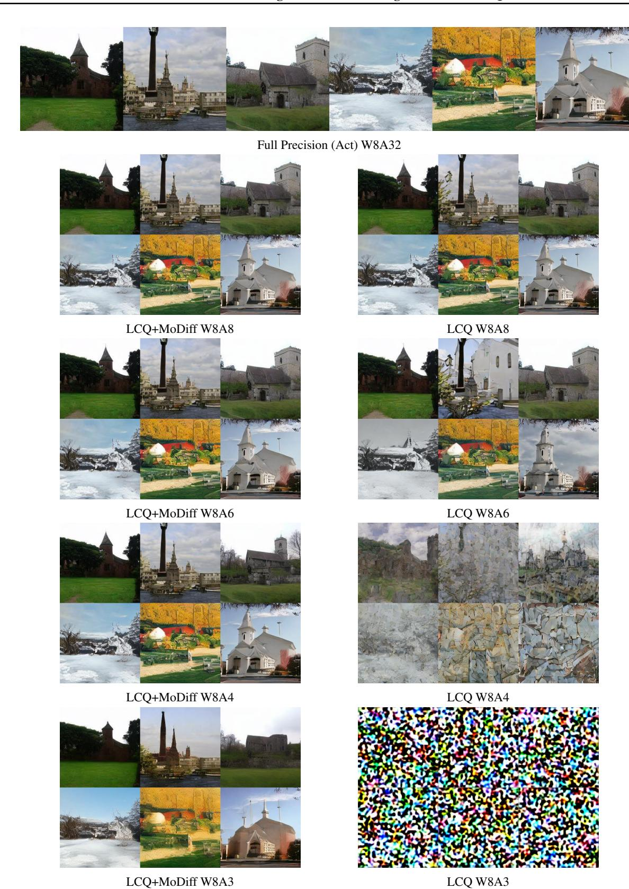
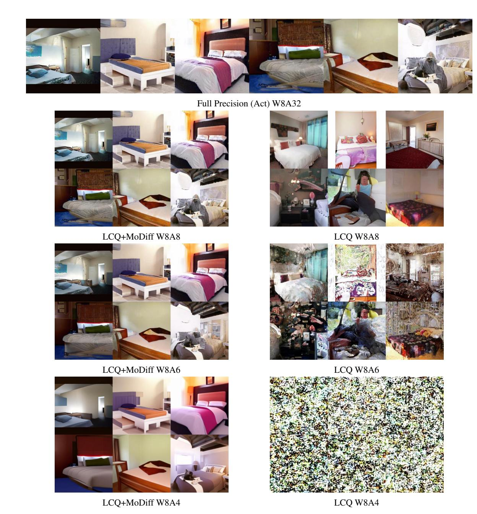
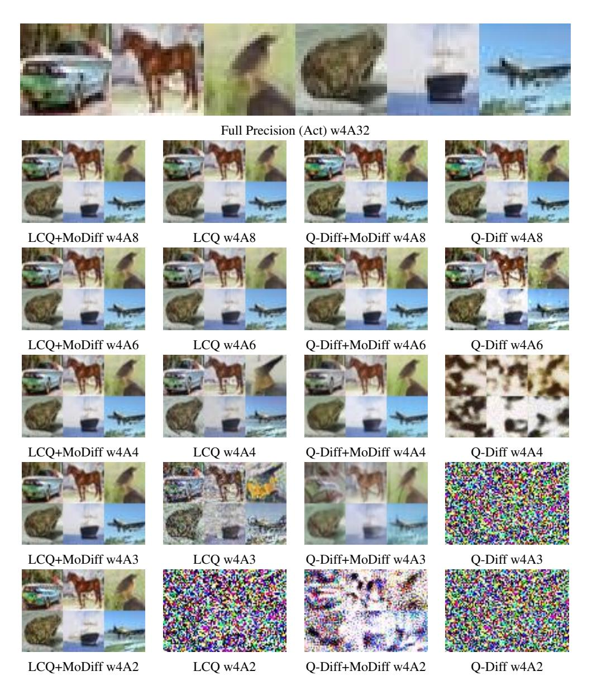

# F. Comprehensive Visualization Results

In this section, we present visualization results for CIFAR-10, LSUN-Churches, LSUN-Bedroom, and MS-COCO-2014. These results illustrate the performance that MoDiff can achieve. For instance, as shown in Figure [5,](#page-20-0) LCQ+MoDiff closely aligns with full-precision generation at W8A4, whereas LCQ only captures the image textures. Additionally, LCQ+MoDiff can still generate recognizable images at W8A3, albeit with some loss of detail.

Figure 4. Visualization of MS-COCO-2014 generated using LTQ and LTQ+MoDiff under 8-bit weight quantization precisions on Stable Diffusion v1.4.

Figure 5. Visualization of LSUN-Churches 256 × 256 generated using LCQ and LCQ+MoDiff under 8-bit weight quantization precisions.

Figure 6. Visualization of LSUN-Churches 256 × 256 generated using LCQ and LCQ+MoDiff under 4-bit weight quantization precisions.

Figure 7. Visualization of LSUN-bedrooms 256 × 256 generated using LCQ and LCQ+MoDiff under 8-bit weight quantization precisions.

Figure 8. Visualization of LSUN-bedrooms 256 × 256 generated using LCQ and LCQ+MoDiff under 4-bit weight quantization precisions.

Figure 9. Visualization of LSUN-bedrooms 256 × 256 generated using LCQ, LCQ+MoDiff, Q-Diff, and Q-Diff+MoDiff under 8-bit weight quantization precisions.

Figure 10. Visualization of LSUN-bedrooms 256 × 256 generated using LCQ, LCQ+MoDiff, Q-Diff, and Q-Diff+MoDiff under 4-bit weight quantization precisions.