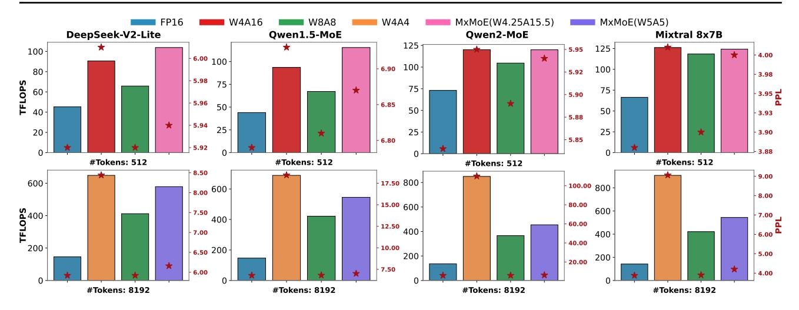

# 5. Experiments

#### 5.1. Experimental Setup

**Model Configurations.** We evaluate MxMoE on three open-source MoE architectures: DeepSeek (Liu et al., 2024a),

Table 1. We evaluate on the following datasets: Arc-Challenge (AC), Arc-Easy (AE), HellaSwag (HS), LAMBADA-openai (LO), LAMBADA-standard (LS), PIQA (PQ), and WinoGrande (WG). GPTQ\* denotes GPTQ with random Hadamard transformation preprocessing. #Bits indicates the quantization bitwidth for GPTQ and Quarot (uniform bitwidth), and the average bitwidth for MxMoE.

| Model                  | Method   | #Bits (W-ACT) | AC↑   | AE↑   | HS↑   | LO↑   | LS↑   | PQ↑   | WG↑   | Avg.↑ | PPL↓   |
|------------------------|----------|---------------|-------|-------|-------|-------|-------|-------|-------|-------|--------|
|                        | Baseline | 16-16         | 48.98 | 76.22 | 77.91 | 72.33 | 67.90 | 80.20 | 71.19 | 70.68 | 5.92   |
|                        | GPTQ*    | 3.25-16       | 47.35 | 75.04 | 76.44 | 70.41 | 65.65 | 79.05 | 71.27 | 69.32 | 6.18   |
|                        | GPTQ*    | 2.25-16       | 37.63 | 63.47 | 65.45 | 52.53 | 48.55 | 74.59 | 64.09 | 58.04 | 8.49   |
| DeepSeekV2-Lite        | QuaRot   | 4-4           | 41.81 | 67.51 | 74.12 | 50.01 | 45.86 | 75.52 | 63.38 | 59.74 | 8.44   |
|                        | MxMoE    | 3.25-16       | 47.87 | 74.58 | 76.85 | 71.10 | 65.85 | 79.27 | 70.09 | 69.37 | 6.08   |
|                        | MxMoE    | 2.25-16       | 40.36 | 68.86 | 68.63 | 59.56 | 54.01 | 75.08 | 67.80 | 62.04 | 7.01   |
|                        | MxMoE    | 5-5           | 46.76 | 74.37 | 77.38 | 68.41 | 64.99 | 79.38 | 69.22 | 68.64 | 6.16   |
|                        | Baseline | 16-16         | 44.03 | 69.53 | 77.26 | 71.28 | 64.62 | 80.47 | 69.30 | 68.07 | 6.79   |
|                        | GPTQ*    | 3.25-16       | 43.34 | 68.60 | 75.35 | 68.68 | 62.80 | 79.22 | 66.54 | 66.36 | 7.15   |
|                        | $GPTQ^*$ | 2.25-16       | 30.89 | 47.14 | 60.77 | 43.72 | 34.81 | 69.97 | 56.20 | 49.07 | 11.19  |
| Qwen1.5-MoE            | QuaRot   | 4-4           | 27.13 | 40.74 | 57.10 | 35.61 | 25.33 | 66.43 | 51.93 | 43.47 | 18.44  |
|                        | MxMoE    | 3.25-16       | 43.77 | 66.04 | 75.92 | 69.71 | 62.82 | 79.11 | 68.03 | 66.49 | 7.02   |
|                        | MxMoE    | 2.25-16       | 31.66 | 53.28 | 62.80 | 56.43 | 51.00 | 71.33 | 61.25 | 55.39 | 8.79   |
|                        | MxMoE    | 5-5           | 42.92 | 66.04 | 76.27 | 70.06 | 63.40 | 80.58 | 67.80 | 66.72 | 7.01   |
|                        | Baseline | 16-16         | 55.20 | 77.19 | 84.09 | 74.35 | 62.62 | 82.32 | 72.14 | 72.56 | 5.84   |
|                        | GPTQ*    | 3.25-16       | 53.67 | 75.88 | 82.90 | 73.36 | 63.24 | 81.01 | 70.96 | 71.57 | 6.11   |
|                        | GPTQ*    | 2.25-16       | 38.82 | 57.66 | 71.27 | 58.99 | 49.72 | 73.29 | 60.30 | 58.58 | 7.98   |
| Qwen2-MoE              | QuaRot   | 4-4           | 33.19 | 42.72 | 54.34 | 23.02 | 9.53  | 63.87 | 50.12 | 39.54 | 110.66 |
|                        | MxMoE    | 3.25-16       | 53.84 | 76.30 | 82.81 | 72.39 | 60.95 | 81.34 | 69.69 | 71.05 | 6.18   |
|                        | MxMoE    | 2.25-16       | 45.05 | 68.86 | 77.13 | 66.00 | 56.61 | 75.41 | 62.90 | 64.57 | 7.57   |
|                        | MxMoE    | 5-5           | 54.86 | 75.55 | 82.69 | 72.87 | 62.68 | 79.49 | 70.96 | 71.30 | 6.25   |
|                        | Baseline | 16-16         | 66.38 | 85.39 | 85.95 | 77.28 | 73.06 | 85.20 | 76.72 | 78.57 | 3.88   |
|                        | GPTQ*    | 3.25-16       | 64.42 | 84.01 | 85.12 | 76.77 | 71.76 | 83.79 | 76.16 | 77.43 | 4.17   |
|                        | GPTQ*    | 2.25-16       | 48.89 | 72.35 | 76.95 | 68.39 | 61.44 | 77.15 | 67.72 | 67.56 | 5.69   |
| Mixtral- $8 \times 7B$ | QuaRot   | 4-4           | 50.60 | 68.69 | 75.65 | 40.95 | 38.83 | 76.88 | 61.01 | 58.94 | 9.06   |
|                        | MxMoE    | 3.25-16       | 64.25 | 84.22 | 85.04 | 76.98 | 71.86 | 84.17 | 75.93 | 77.49 | 4.15   |
|                        | MxMoE    | 2.25-16       | 48.98 | 72.77 | 77.44 | 68.68 | 62.18 | 76.28 | 68.90 | 67.89 | 5.63   |
|                        | MxMoE    | 5-5           | 64.08 | 83.71 | 85.10 | 76.21 | 71.78 | 83.79 | 73.80 | 76.92 | 4.20   |

Mixtral (Jiang et al., 2024), and Qwen (Yang et al., 2024) as detailed in Table 2. DeepSeek-V2-Lite employs a hybrid architecture: the first layer employs dense MLP instead of MoE blocks in other layers which are quantized with GPTQ 4-bit per-channel asymmetric quantization in our experiments. We focus on the quantization of MoE blocks, retaining full precision for the attention modules. Experiments conducted on Nvidia RTX-4090.

Table 2. Architectural Specifications of Evaluated MoE Models

| Model Variant              | Params (GB) | Experts | TopK |
|----------------------------|-------------|---------|------|
| Mixtral-8×7B-Instruct-v0.1 | 92.9        | 8       | 2    |
| Qwen1.5-MoE                | 26.7        | 60+4    | 4    |
| Qwen2-MoE-Instruct         | 106.9       | 64+8    | 8    |
| DeepSeek-V2-Lite           | 29.3        | 64+2    | 6    |

Calibration. MxMoE requires offline calibration to determine the sensitivity of linear-block and expert activation frequencies for bitwidth allocation. For all experiments, we use 128 sequences, each of length 4096, drawn from the Wikitext2 training set (Merity et al., 2016). This calibration process typically takes from several minutes to a few hours depending on the model size. To enhance quantiza-

tion accuracy, we apply a random hadamard transformation. We disabled online rotations because they failed on some models like DeepSeek-V2-Lite due to the shape constrain. For weight quantization, MxMoE employs GPTQ, using the same calibration set with that of bitwidth allocation.

#### 5.2. Accuracy Results

For weight-only quantization we test 3-bit and 2-bit quantization, comparing with GPTQ, configured with group size 128, asymmetric min-max quantization, where the scale and zero-point are stored in 16-bit format, resulting in an average bitwidth of 3.25 and 2.25, respectively. To ensure fairness, we apply the same random Hadamard transformation for GPTQ. MxMoE use r = 1 as extremely low-bitwidth implies resource-constrained environment, where model accuracy is more important. The results in Tab. 1 show that GPTQ suffers significant performance degradation at 2.25bit, while MxMoE consistently outperforms GPTQ across all models. At 3.25-bit, MxMoE outperforms GPTQ in most models except Qwen2-MoE. This exception may stem from inaccuracies in the sensitivity statistics, amplified by inter-layer dependencies (Yue et al., 2024). Using a crosslayer loss as sensitivity metric instead layer loss in Eq. 6

Figure 5. Computational throughput of MoE blocks across models and precision settings. W4A16 denotes 4-bit weight-only per-channel asymmetric quantization; W8A8 and W4A4 denote 8/4-bit weight-activation per-channel symmetric quantization. Number followed MxMoE represents the average bitwidth for weight and activation. The \*symbols indicate corresponding perplexity values on WikiText2.

may mitigate this issue, and we leave this to future work. Improvement of MxMoE on Mixtral is relative margin. This is due to Mixtral's fewer experts (Tab. 2), resulting in a more limited mixed-precision design space.

For weight-activation quantization, we compare MxMoE with Quarot (Ashkboos et al., 2024). MxMoE use r=0.75. We focus on 4-bit as 8-bit is almost lossless. Quarot experiences a significant accuracy drop at 4-bit across all models, while MxMoE achieves substantial improvements with just 1 additional bit (i.e. average 5-bit). These gains are attributed to the higher sensitivity of certain activations to bitwidth, as shown in prior studies (Dettmers et al., 2022; Sun et al., 2024). By allocating higher bitwidth for the sensitive activation, MxMoE delivers notable performance improvements. The sources of accuracy gains under this configuration are rigorously dissected in App. A.1.

## **5.3. Performance Analysis**

Due to the lack of established low-precision Group-GEMM baselines, we evaluate both uniform-bitwidth and mixed-precision kernels generated by MxMoE. MxMoE use r=0.75 for all the mixed-precision scheme. 16-bit Group-GEMM kernel is from CUTLASS. we assess the computational throughput of MoE blocks across different models, only expert computation is counted as other operations (gating, topk, sort etc.) is negligible. We randomly sample sequences from WikiText-2 with lengths of 512 and 8192 tokens, respectively representing memory-bound and compute-bound workloads. As shown in Fig. 5, mixed-precision scheme achieve substantial performance improvements:  $1.6-2.7\times$  throughput increase for memory-bound workloads and  $3-3.4\times$  for compute-bound workloads compared to full-preicision.

Table 3. Comparison of different allocation granularities. Test with 5-bits weight-activation quantization. Evaluation metrics are the same as described in settings.

| Model                           | PP           | PL↓          | <b>Avg-Acc</b> ↑ |                |  |
|---------------------------------|--------------|--------------|------------------|----------------|--|
| 1/10401                         | Linear       | Expert       | Linear           | Expert         |  |
| DeepSeek-V2-Lite Qwen1.5-MoE | 6.11 6.95 | 6.32 6.98 | 69.01 67.35   | 67.88 67.11 |  |

For the memory-bound scenario (512 tokens), W8A8 consistently underperforms both W4A16 and W4.25A15.5, as the limited tokens per expert make MoE block computations memory-bound. MxMoE (W4.25A15.5) not only achieves better accuracy than W4A16 but also delivers up to 25% higher throughput on Qwen1.5-MoE. This improvement stems from our hardware-aware bitwidth allocation strategy, which assigns lower-precision activations to frequently activated experts that form compute-bound operations (as discussed in Section 3.2). In the compute-bound scenario (8192 tokens), we compare against W4A4 and W8A8. While W4A4 offers significant speedup at the cost of substantially increased perplexity, and W8A8 maintains accuracy with minimal acceleration, MxMoE (W5A5) achieves up to 29.4% performance improvement over W8A8 while maintaining comparable perplexity to full-precision models.

