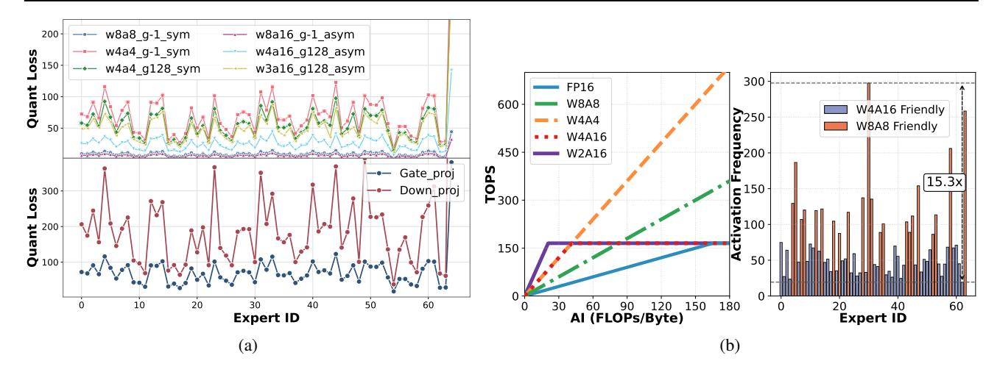

# 3. Motivation

## 3.1. Heterogeneous Quantization Sensitivity

Recent studies have demonstrated that neural network components exhibit heterogeneous sensitivity to bitwidth, with quantization affecting different parameters to varying extents (Wang et al., 2019; Dong et al., 2019). This heterogeneous sensitivity can be leveraged through mixed-precision, where different bitwidths are allocated to parameters based on their sensitivity. Such schemes typically outperform uniform-precision quantization in terms of accuracy.

In the context of MoE models, several works have investigated the behavioral differences among experts. These studies show that, due to the influence of training dynamics, not all experts are equal. Some experts specialize in specific tokens, contributing less to the overall generation (Liu et al., 2024b; Xue et al., 2024). Building on this idea, we extend the concept of heterogeneity to the quantization of MoE models. Specifically, we systematically investigate quantization sensitivity across different architectural dimensions of MoE models by analyzing the sensitivity of various experts and their corresponding linear blocks.

As illustrated in Fig. 1a, our analysis reveals two key struc-

Figure 1. (a) Quantization loss across experts in DeepSeekV2-Lite's 11th layer under various quantization schemes (top), and across linear components (Gate\_proj/Down\_proj) under the w4a4\_g-1\_sym configuration (bottom). The quantization notation wxay\_gz\_b denotes x-bit weights, y-bit activations, group size z (-1 indicates per-channel/token) with symmetric (sym) or asymmetric (asym) quantization. The quantization loss metric is formally defined in Section 4.2.1. (b) Roofline performance analysis for RTX 4090 GPU (left) and expert activation frequency distribution in DeepSeekV2-Lite's 11th layer (right).

tural patterns. First, experts exhibit divergent sensitivity profiles: for example, Expert 40 suffers significantly greater performance degradation under quantization compared to Expert 37. Second, sensitivity varies considerably across the components within a single expert: the Down\_proj block in Expert 40 requires higher precision than the Gate\_proj block within the same expert.

These observations motivate our linear-block granularity strategy: assigning different bitwidth to linear-blocks in MoE blocks to preserve model accuracy. Unlike recent studies that adopt expert-level mixed-precision schemes (Li et al., 2024; Huang et al., 2024), our approach focuses on allocating bitwidths at the linear block level. In Section 5.4, we demonstrate the superiority of this linear-block-level allocation strategy. Another line of recent research explores fine-grained mixed-precision approaches at the channel or element level (Kim et al., 2023; Zhao et al., 2024). However, these approaches incur significant computational overhead due to irregular memory access patterns and the need for bitwidth lookup operations (Dettmers et al., 2022).

