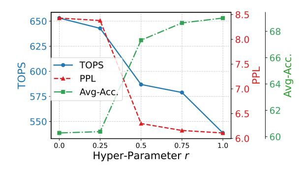

# 5.4. Ablation Studies

**Effect of bitwidth allocation granularity.** MxMoE employ linear-block level allocation instead of expert-level allocation in previous studies. We also perform bitwidth allocation at expert level as shown in table 3. The results demonstrate that linear-block allocation consistently outperforms expert-level allocation.

Figure 6. Impact of the hyperparameter r on the trade-off between model accuracy and performance. Model: DeepSeek-V2-Lite.

Impact of the hyperparameter. MxMoE introduces the hyperparameter r to balance efficiency and accuracy. We employ r=0.75 in all experiments except extremely low-bitwidth weight-only quantization in Tab. 1, where r=1. Intuitively, r=1 prioritizes maximizing accuracy, while r=0 focuses solely on efficiency. Now we quantitatively investigate the impact of the tradeoff parameter. As shown in Fig. 6, performance improves as r decreases, at the cost of reduced accuracy. Notably, when optimizing for both objectives, such as at r=0.75, we observe significant performance gains with minimal accuracy drop. This highlights the effectiveness of hardware-aware bitwidth allocation.

