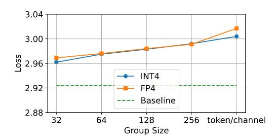
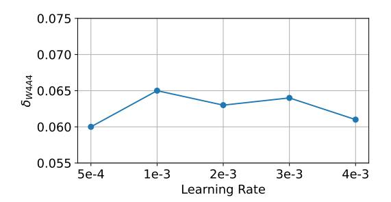
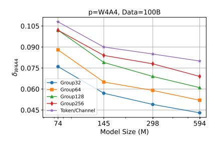
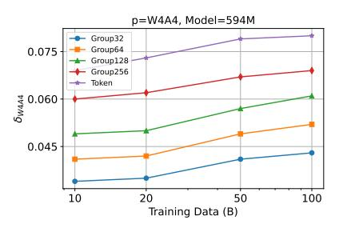
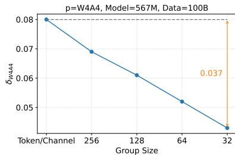
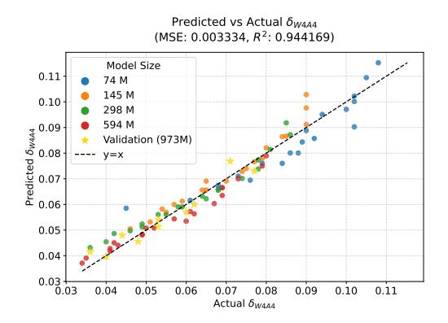
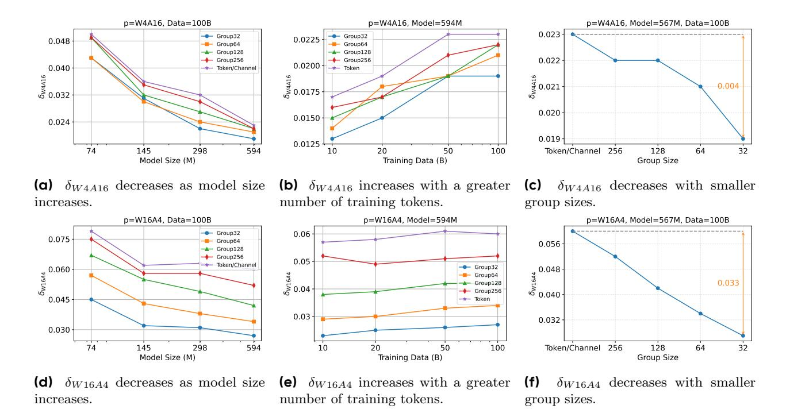
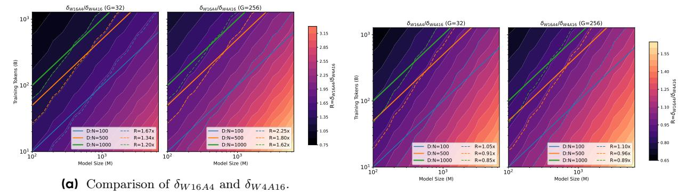
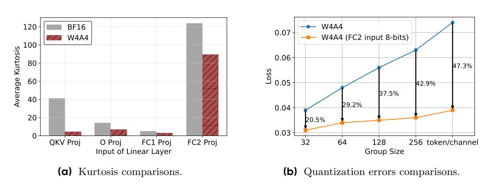

# **3 Preliminaries**

**Classical scaling law.** The Chinchilla scaling law [\[16\]](#page-10-3) models the final loss (L) using model size (N) and number of training tokens(D):

$$L(N,D) = \frac{A}{N^{\alpha}} + \frac{B}{D^{\beta}} + E, \tag{1}$$

where A, α, B, β, and E are fitted constants, listed in Table [1.](#page-5-0) Section [C](#page-13-0) in the Appendix explains the fitting process.

**Existing QAT scaling law.** Previous studies [\[12,](#page-10-5) [20\]](#page-10-6) modify Eq.[\(1\)](#page-2-0) by introducing an effective parameter multiplier (EPM) on N, resulting in:

$$L(N,D) = \frac{A}{(N \cdot \mathbf{eff}(\mathbf{C}))^{\alpha}} + \frac{B}{D^{\beta}} + E,$$
(2)

where eff(C) ∈ [0, 1] denotes the EPM, which depends on the model architecture and compression method. A higher value of EPM indicates better preservation of the original (BFloat16 [\[18\]](#page-10-10)) model performance.

**Proposed QAT Scaling Law.** Unlike existing QAT scaling laws that modify the N capacity term in the Chinchilla scaling law, we directly model the final loss gap (i.e., the quantization error) between QAT models and their BFloat16 counterparts . For instance, the quantization error in the EPM scaling law can be calculated through Eq. [\(2\)](#page-2-1) − Eq. [\(1\)](#page-2-0):

$$\delta_p(N) = \frac{A}{(N \cdot \mathbf{eff}(\mathbf{C}))^{\alpha}} - \frac{A}{N^{\alpha}},\tag{3}$$

δp represents the quantization error with p-bit QAT. Eq. [\(3\)](#page-2-2) shows that previous QAT scaling laws assume the quantization error depends only on N and is independent of the data size D. However, our experiments (Figure [4b\)](#page-4-0) show that the quantization error between W4A4 QAT and BF16 models increases as the data size grows. To address this, we introduce a new quantization error term that depends on both N and D. Furthermore, since fine-grained quantization is essential for 4-bit QAT performance [\[8,](#page-10-11) [34\]](#page-11-12), we also include the quantization granularity G to capture its effect on performance degradation. Thus, our proposed QAT scaling law is:

$$L(N, D, G) = \underbrace{\frac{A}{N^{\alpha}} + \frac{B}{D^{\beta}} + E}_{\text{Chinchilla loss}} + \underbrace{\delta_p(N, D, G)}_{\text{low-bit QAT effect}},$$
(4)

**Figure 2** Integer (INT4) vs. floating-point (FP4) in W4A4, 297M model, 50B tokens.

**Figure 3**  $\delta_{W4A4}$  at different learning rates, W4A4 (G=128) 145M model, 20B tokens.

where  $\delta_p(N, D, G)$  denotes the quantization error for p-bit QAT, as a function of N, D, and G.

## 4 QAT Scaling Law

This section introduces a unified scaling law for QAT that incorporates model size N, training tokens D, and quantization granularity G. Section 4.1 outlines the training setups. Section 4.2 presents the main scaling law and reveals an insightful finding distinct from previous studies [12, 20] that the number of training tokens D significantly affects QAT error. Section 4.3 analyzes quantization errors from weights and activations separately, identifying activation quantization—especially for the FC2 layer's input—as the main performance bottleneck. This finding supports a mixed-precision strategy discussed in Section 4.4. Finally, Section 4.5 compares our scaling law with previous approaches.

## 4.1 Training Setup

Models and dataset. We train a series of Llama3-style [15] models on the OLMo2-Mix-1124 [30] pretraining dataset. Our experiments systematically explore LLM pretraining across parameter sizes  $N \in \{74, 145, 297, 595\}$  million and training token numbers  $D \in \{10, 20, 50, 100\}$  billion tokens. For validation purpose, we also train models with 973M parameters on 100 and 200 billion tokens to verify the extrapolation reliability of our scaling law when increasing both model and dataset size. These 268 QAT experiments on A100 GPUs consumed 276K GPU-hours in total. Detailed architectural settings for each model are provided in Sec F.

**Evaluation metric.** Following the Chinchilla scaling law [21], we use the smoothed training loss as an unbiased estimate of validation loss for simplicity and consistency.

**Quantization precision.** Considering that 8-bit can achieve nearly lossless performance [42, 45] This work focuses on 4-bit quantization. We train models under three quantization settings: W4A4, W4A16 (only weights quantized to 4-bit), and W16A4 (only activations quantized to 4-bit). The latter two settings help decouple the error sources in W4A4.

**Quantization granularity.** Quantization granularity G refers to the number of elements in each quantization group and is crucial for low-bit quantization [8, 24]. For each model, we experiment with group sizes  $G \in \{32, 64, 128, 256, \text{per-token/channel}\}$ . "Per-token/channel" means per-token quantization for activations and per-channel quantization for weights. We exclude per-tensor quantization due to its significant performance degradation compared to other granularities in 4-bit scenario, as shown in Figure 14a and Figure 14b.

Quantizer. We evaluate AbsMax, LSQ [9] and LWC [36] for weight quantization, and AbsMax and LAC [5] for activation quantization. We select AbsMax for weight quantization because it offers similar performance to other methods, yet is more straightforward in implementation. For activation quantization, LAC outperforms AbsMax when the group size is greater than 256. Therefore, we use AbsMax for fine group sizes (G < 256) and LAC for coarse group sizes ( $G \ge 256$ ). We provide detailed descriptions of each quantizer and present ablation studies in Sec. E.2.

(a)  $\delta_{W4A4}$  decreases as model size N increases.

**(b)**  $\delta_{W4A4}$  increases with a greater number of training tokens D.

(c)  $\delta_{W4A4}$  decreases with smaller group sizes G.

Figure 4 Trend of  $\delta_{W4A4}$  with varying N, D, and G. (a)  $\delta_{W4A4}$  decreases as model size increases. (b)  $\delta_{W4A4}$  increases with more training tokens. (c)  $\delta_{W4A4}$  decreases with smaller group sizes. Note that these trends of  $\delta_{W4A4}$  are consistent across different N, D, and G. For simplicity, we merely plot the model trained with 100B tokens in (a), a model size of 594M in (b), and the 594M model trained with 100B tokens in (c).

**Low-precision formats.** Low-bit quantization employs either integer (INT) or floating-point (FP) types. Figure 2 shows that INT4 matches FP4 performance in group-wise quantization and surpasses FP4 by 0.015 in loss for per-channel/token quantization. This advantage stems from INT4's 16 representable values compared to FP4's 15 [41], with greater impact in coarse-grained quantization. We adopt the integer format for our scaling law due to its equivalent or superior performance. We hypothesize that INT and FP exhibit similar scaling behavior. Figure 13 verifies that the scaling law fitted to INT4 data also accurately predicts QAT error trend for FP4.

**Training hyper-parameters.** We follow Olmo2 [30] for training hyper-parameters, detailed in Table 3. One key hyper-parameter is the learning rate. For example, BitNet [28] shows ternary models benefit from higher learning rates than uncompressed models. In contrast, our focus on 4-bit quantization, which is less aggressive than ternary, leads to less sensitivity to learning rate. We compare uncompressed and W4A4 QAT models, as shown in Figure 3, observe that the quantization error remains nearly constant (within [0.6, 0.65]) across learning rates from  $5 \times 10^{-4}$  to  $4 \times 10^{-3}$ . This indicates that 4-bit QAT does not benefit from higher learning rates compared to uncompressed models. Therefore, we use the same hyper-parameters for both uncompressed and QAT training.

### 4.2 Unified Scaling Law for QAT

**Observation.** The ground truth for  $\delta_{W4A4}$  is defined as  $loss_{bf16} - loss_{W4A4}$ , where  $loss_{bf16}$  and  $loss_{W4A4}$  denote the final model losses obtained from training with original BFloat16 precision and W4A4 QAT, respectively. To better understand  $\delta_{W4A4}$ , we plot its relationship with N, D, and G in Figure 4. We observe three primary trends:

- Quantization error decrease with increasing model size: Figure 4a shows that  $\delta_{W4A4}$  consistently decreases as model size increases, across different quantization granularities. For example, when model size grows from 74M to 594M,  $\delta_{W4A4}$  decreases by an average of 34% across all granularities.
- Quantization error increase with more training tokens: Figure 4b indicates that  $\delta_{W4A4}$  increases as the number of training tokens grows. Specifically, increasing the training tokens from 10B to 100B results in an average increase of 22% in  $\delta_{W4A4}$  across different granularities.
- Quantization error decrease with finer quantization granularity: As illustrated in Figure 4c,  $\delta_{W4A4}$  decreases as quantization granularity becomes finer. The difference in  $\delta_{W4A4}$  between the coarsest and finest quantization granularities is 0.037, which is nearly half the quantization error of the coarsest quantization granularity.

Proposed scaling law for QAT quantization error. Existing QAT scaling laws [12, 20] account only for model size N, overlooking the effects of training data volume D and quantization granularity G. To enhance the

0.12 Group32 Group64
 Group128 Group256
 Token/Channel --- y=0.906x

0.04 0.06 0.08 0.10 0.12

0.04 0.06 0.08 0.10 0.12

Figure 5 Fitting performance of  $\delta_{W4A4}$  scaling laws.

Figure 6 Quantization error decomposition.  $\delta_{W4A4} = k(\delta_{W16A4} + \delta_{W4A16}).$ 

0.4491

 $\gamma_G$ 

prediction of QAT quantization error, we propose a comprehensive formula based on our observations:

$$\delta_p(N, D, G) = \frac{k \cdot D^{\gamma_D} \cdot (\log_2(G))^{\gamma_G}}{N^{\gamma_N}},\tag{5}$$

where  $k, \gamma_N, \gamma_D$  and  $\gamma_G > 0$  are fitted parameters. We incorporate a logarithmic term for G, as G = 1 (no quantization) yields  $\delta_p = 0$ . The magnitudes of  $\gamma_N, \gamma_D$  and  $\gamma_G$  reflect the sensitivity of the quantization error  $\delta_p$  to N, D and G, respectively. The formula indicates that  $\delta_p$  increases with D and G but decreases with N.

| Type              | Constant   | Value    | Type              | Constant   | Value  |
|-------------------|------------|----------|-------------------|------------|--------|
| туре              | Constant   | varue    | туре              | Constant   | varue  |
|                   | E          | 1.9279   |                   | k          | 0.1582 |
|                   | A          | 237.7042 | 2                 | $\gamma_N$ | 0.2186 |
| Chinchilla        | $\alpha$   | 0.3022   | $\delta_{W4A4}$   | $\gamma_D$ | 0.0745 |
|                   | B          | 596.2490 |                   | $\gamma_G$ | 0.7779 |
|                   | $\beta$    | 0.3022   |                   |            |        |
|                   | k          | 0.2522   |                   | k          | 0.1004 |
| 2                 | $\gamma_N$ | 0.3589   | 2                 | $\gamma_N$ | 0.1816 |
| $\delta_{W4A16}$  | $\gamma_D$ | 0.1610   | $\delta_{W16A4}$  | $\gamma_D$ | 0.0331 |
|                   | $\gamma_G$ | 0.3533   |                   | $\gamma_G$ | 0.9812 |
|                   | k          | 0.3519   |                   | k          | 0.1273 |
| $\delta_{W4A4}$   | $\gamma_N$ | 0.2637   | $\delta_{W16A4}$  | $\gamma_N$ | 0.2347 |
| (FC2 input 8-bit) | $\gamma_D$ | 0.0964   | (FC2 input 8-bit) | $\gamma_D$ | 0.0827 |

Table 1 Fitted hyperparameters and their values in our proposed QAT error scaling law.

Fitting and validation. We fit Eq.(5) to the ground truth W4A4 quantization error ( $\delta_{W4A4}$ ) obtained from 80 W4A4 QAT runs. Table 1 lists the fitted parameters, and Figure 5 compares the actual and predicted  $\delta_{W4A4}$ . As shown in Figure 5, Eq. (5) accurately models the observed W4A4 QAT quantization errors. We further validate the fitted scaling law by predicting the QAT losses of 973M-parameter models trained with  $\{100B, 200B\}$  tokens. The consistently accurate predictions indicate that our proposed QAT scaling law generalizes well to larger models and more training data.

0.3407

### 4.3 Decomposition of Quantization Error: Weight vs. Activation

 $\gamma_G$ 

Although the unified QAT scaling law in Eq. (5) predicts the overall quantization error for W4A4, it remains unclear whether this error mainly arises from weights or activations. Understanding this distinction is essential for targeted optimization. In practice, for a model trained with W4A4 QAT, we cannot directly measure the individual contributions of weight and activation quantization errors. For example, simply disabling

**Figure 7** (a)-(c)  $\delta_{W4A16}$  and (d)-(f)  $\delta_{W16A4}$  trend with varying N, D and G.

quantization in a W4A4 QAT model does not restore the performance of the original unquantized model and may even decrease accuracy further. This occurs because quantization is integrated into the QAT training process, and model parameters adapt to quantization errors during training. To analyze the sources of quantization error in a W4A4 QAT model, we train two additional QAT models: one with W4A16 and another with W16A4.

Rationale for error decomposition. As shown in Figure 6, the final quantization error of W4A4 ( $\delta_{W4A4}$ ) can be closely approximated by summing the quantization errors from W4A16 and W16A4 ( $\delta_{W4A16} + \delta_{W16A4}$ ). The observed coefficient between  $\delta_{W4A4}$  and  $\delta_{W4A16} + \delta_{W16A4}$  is 0.906. This strong correlation suggests that we can effectively analyze  $\delta_{W4A4}$  by separately examining the  $\delta_{W4A16}$  and  $\delta_{W4A4}$ .

How do  $\delta_{W4A16}$  and  $\delta_{W16A4}$  change with N, D and G? Section 4.2 examines how  $\delta_{W4A4}$  varies with model size N, number of training tokens D, and quantization granularity G. It is important to see if  $\delta_{W4A16}$  and  $\delta_{W16A4}$  follow similar patterns. To investigate this, we plot  $\delta_{W4A16}$  and  $\delta_{W16A4}$  against N, D and G in Figure 7, and report the fitted QAT scaling law parameters in Table 1. The results show that both  $\delta_{W4A16}$  and  $\delta_{W16A4}$  follow trends consistent with  $\delta_{W4A4}$ , but the degree of sensitivity differs between them:

- $\delta_{W4A16}$  decreases faster than  $\delta_{W16A4}$  as model size increases: The parameter  $\gamma_N$  measures sensitivity to model size. For  $\delta_{W4A16}$ ,  $\gamma_N$  is 0.3589, higher than 0.1816 for  $\delta_{W16A4}$ . This means weight quantization error decreases more rapidly with larger model size than activation quantization error. As shown in Figure 7 (a) and (d), when model size increases from 74M to 594M,  $\delta_{W4A16}$  drops by 51% on average, while  $\delta_{W16A4}$  decreases by 34%.
- $\delta_{W4A16}$  increases faster than  $\delta_{W16A4}$  as the number of training tokens increases: The parameter  $\gamma_D$  measures sensitivity to training tokens. For  $\delta_{W4A16}$ ,  $\gamma_D$  is 0.1610, much larger than 0.0331 for  $\delta_{W16A4}$ . Thus, weight quantization error increases more sharply with more training tokens than activation quantization error. As shown in Figure 7 (b) and (e), increasing training tokens from 10B to 100B raises  $\delta_{W4A16}$  by 43% on average, but only increases  $\delta_{W16A4}$  by 12%.
- $\delta_{W16A4}$  is more sensitive to quantization granularity than  $\delta_{W4A16}$ : The parameter  $\gamma_G$  measures sensitivity to quantization granularity. For  $\delta_{W16A4}$ ,  $\gamma_G$  is 0.9821, much higher than 0.3533 for  $\delta_{W4A16}$ . This shows

**(b)** Comparison of  $\delta_{W16A4}$  (*FC2* input 8-bit) and  $\delta_{W4A16}$ .

Figure 8 Weight and activation quantization errors comparisons. We report heatmaps of  $R = \frac{\delta_{W16A4}}{\delta_{W4A16}}$  across D and N, with group sizes 32 and 256. Larger R indicates greater activation quantization error compared to weights.

**Figure 9 Comparison of kurtosis and quantization errors.** (a) Kurtosis of input activations across different linear layers. (b) Quantization error comparison with 8-bit *FC2* input. The model size is 595M, the number of training tokens is 100B, and the group size in (a) is 128.

that activation quantization error is much more sensitive to granularity, likely due to outliers. As shown in Figure 7 (c) and (f), the gap in  $\delta_{W16A4}$  between the coarsest and finest granularity is 0.031, nearly eight times larger than the corresponding gap for  $\delta_{W4A16}$ .

Which contributes more to quantization error,  $\delta_{W4A16}$  or  $\delta_{W16A4}$ ? Both weight and activation quantization errors depend on D, N and G. To compare their contributions, we examine  $\delta_{W4A16}$  and  $\delta_{W16A4}$  across different parameter values, including fixed data-to-parameter ratios  $\frac{D}{N}$ , as models with similar  $\frac{D}{N}$  often show comparable convergence levels [16]. Figure 8a shows heatmaps of  $R = \frac{\delta_{W16A4}}{\delta_{W4A16}}$ . Across all tested  $\frac{D}{N}$  ratios and group sizes G, R is consistently greater than 1, indicating that activation quantization error generally exceeds weight quantization error. However, the value of R varies with different settings:

- R decreases as  $\frac{D}{N}$  increases, because  $\delta_{W4A16}$  grows faster with D than  $\delta_{W16A4}$ . For example, with G=32, R drops from 1.67 at  $\frac{D}{N}=100$  to 1.20 at  $\frac{D}{N}=1000$ .
- R increases as group size G increases, since  $\delta_{W16A4}$  is more sensitive to quantization granularity. For instance, at  $\frac{D}{N}=1000$ , R rises from 1.20 when G=32 to 1.62 when G=256.

**Practical implications.** These results show that as  $\frac{D}{N}$  increases, the main source of quantization error shifts from activations to weights. However,  $\delta_{W16A4}$  remains larger than  $\delta_{W4A16}$  even at high  $\frac{D}{N}$  and fine granularity (G=32), and the gap widens with coarser quantization. Therefore, activation quantization error is usually the dominant factor in W4A4 quantization (as R>1), highlighting the importance of optimizing activation quantization to improve W4A4 QAT performance.

### 4.4 Mitigating Activation Quantization Error in FC2 Proj Input

Since activation quantization error is the main bottleneck in W4A4 QAT, as shown in the previous section, it is important to understand why activations are harder to quantize than weights and how to address this issue. A major reason is the presence of outliers in large language models, which make activation quantization more difficult [42]. This problem is well known in post-training quantization (PTQ), where outliers can cause significant performance drops. Although QAT applies quantization during the entire training process and acts as a regularizer to suppress activation outliers [29], some challenges remain, especially in certain layers.

Persistent outliers in FC2 Proj input with QAT. Kurtosis [7, 26, 29] measures the "tailedness" of a distribution, with higher values indicating more outliers. Figure 9a shows that QAT effectively reduces outliers in the input activations of the QKV Proj, O Proj, and FC1 Proj layers, so further outlier suppression is not needed for these layers. However, even though QAT lowers the kurtosis of the FC2 Proj input from 123 to 89, this value is still significantly higher than in other layers. The high kurtosis means that the FC2 Proj input remains prone to large quantization errors, making it a key contributor to the activation quantization bottleneck described in Sec. 4.3. The main reason for this high kurtosis is that the FC2 Proj input comes from the output of the SwiGLU [37] module. The gating mechanism and non-linear transformations in SwiGLU create a complex activation distribution that amplifies outliers [44]. As a result, even with QAT regularization, the FC2 Proj input remains sensitive to outliers and is the main source of activation quantization error in W4A4 QAT models.

**Mixed-precision approach.** To study the W4A4 scaling law without the activation bottleneck, it is necessary to reduce quantization error in the FC2 Proj input. This can be achieved by using higher quantization precision or outlier suppression strategies [3, 42]. Since 8-bit quantization achieves near-lossless training [24], we use a simple approach: quantizing the FC2 Proj input to 8-bit (denoted as "FC2 input 8-bit"). While other outlier suppression methods [3, 5, 42] could also be considered, 8-bit quantization provides an upper bound on the improvements possible. This approach offers a general and robust baseline for understanding the potential of the W4A4 QAT scaling law without the activation bottleneck.

Impact on quantization error. Figure 9b shows that using 8-bit FC2 inputs significantly reduces quantization error, especially for coarse-grained quantization, which is more sensitive to outliers. For example, with W4A4 QAT, 8-bit FC2 lowers quantization error by 20.5% for G=32 and by 42.9% for G=256. This demonstrates that 8-bit FC2 Proj inputs effectively reduce both the overall activation quantization error and its sensitivity to granularity. Table 1 further supports this, showing that the parameter  $\gamma_G$  for  $\delta_{W16A4}$  decreases from 0.9812 to 0.4471 when using 8-bit FC2 Proj inputs. Figure 8b illustrates that, under 8-bit FC2 inputs,  $\delta_{W16A4}$  and  $\delta_{W4A16}$  become similar in magnitude, with their ratio R ranging from 0.85 to 1.10 for  $\frac{D}{N}$  ratios between 100 and 1000, and for group sizes G=32 and G=256.

**Practical implications.** For practitioners, the main takeaway is that special treatment of the FC2 Proj input—through mixed-precision quantization or targeted outlier suppression—is crucial for maximizing low-bit QAT performance. Once the FC2 Proj input bottleneck is removed, further improvements to W4A4 QAT should focus on jointly optimizing both weight and activation quantization errors, as their effects become similar. This suggests a shift in QAT development from mainly activation-focused methods [32, 42] to approaches that balance both error sources.

#### 4.5 Comparisons with Other QAT Scaling Laws

We compare our proposed QAT scaling law (Eq. (5)) with existing scaling laws [12, 20]. Previous methods [12, 20] do not account for quantization granularity G, so they require separate curves for each  $G \in \{32, 64, 128, 256, \text{per-channel/token}\}$  for fair comparison. In contrast, our scaling law models different granularities with a single curve. As shown in Table 2, our approach reduces the relative error from 19.3% to 5.2% for W4A16 QAT and from 8.5% to 4.7% for W4A4 QAT. The larger improvement for W4A16 is due to  $\delta_{W4A16}$  increasing more rapidly with D than  $\delta_{W16A4}$ . Overall, including D in  $\delta_p$  improves prediction

**Table 2 Comparison with other scaling laws.** "Num" indicates the number of scaling laws fitted. "Relative Error" represents the difference between the predicted and actual quantization errors.

| Method    | N | D | G | δp      | Precision     | Num. of δp | Relative Error |
|-----------|---|---|---|---------|---------------|------------|----------------|
| [12] [20] | ✓ | × | × | Eq. (3) | W4A16 W4A4 | 5 5     | 19.3% 8.5%  |
| Ours      | ✓ | ✓ | ✓ | Eq. (5) | W4A16 W4A4 | 1 1     | 5.2% 4.7%   |

accuracy, and modeling G increases adaptability to different quantization granularities.

## **5 Conclusions**

This paper proposes a comprehensive scaling law for 4-bit QAT of LLMs, integrating model size, training dataset size, and quantization granularity. The new QAT scaling law is more practical, as it jointly models N, G, and D, and achieves more accurate predictions than previous approaches. We also show that processing the FC2 input with 8-bit in W4A4 QAT significantly reduces both quantization error and sensitivity to quantization granularity. Furthermore, our analysis shows that, after applying 8-bit quantization to the FC2 input in W4A4 QAT, weight and activation quantization errors contribute almost equally to the total error. This result suggests that future QAT algorithms should also investigate weight quantization error, rather than focusing solely on activation outliers as previous methods do.

## **References**

- [1] Joshua Ainslie, James Lee-Thorp, Michiel De Jong, Yury Zemlyanskiy, Federico Lebrón, and Sumit Sanghai. Gqa: Training generalized multi-query transformer models from multi-head checkpoints. arXiv preprint arXiv:2305.13245, 2023.
- [2] Yongqi An, Xu Zhao, Tao Yu, Ming Tang, and Jinqiao Wang. Systematic outliers in large language models. arXiv preprint arXiv:2502.06415, 2025.
- [3] Saleh Ashkboos, Amirkeivan Mohtashami, Maximilian L Croci, Bo Li, Martin Jaggi, Dan Alistarh, Torsten Hoefler, and James Hensman. Quarot: Outlier-free 4-bit inference in rotated llms. arXiv preprint arXiv:2404.00456, 2024.
- [4] Weilin Cai, Juyong Jiang, Fan Wang, Jing Tang, Sunghun Kim, and Jiayi Huang. A survey on mixture of experts in large language models. IEEE Transactions on Knowledge and Data Engineering, 2025.
- [5] Mengzhao Chen, Yi Liu, Jiahao Wang, Yi Bin, Wenqi Shao, and Ping Luo. Prefixquant: Eliminating outliers by prefixed tokens for large language models quantization. arXiv preprint arXiv:2410.05265, 2024.
- [6] Mengzhao Chen, Wenqi Shao, Peng Xu, Jiahao Wang, Peng Gao, Kaipeng Zhang, and Ping Luo. Efficientqat: Efficient quantization-aware training for large language models. arXiv preprint arXiv:2407.11062, 2024.
- [7] Lawrence T DeCarlo. On the meaning and use of kurtosis. Psychological methods, 2(3):292, 1997.
- [8] Tim Dettmers and Luke Zettlemoyer. The case for 4-bit precision: k-bit inference scaling laws. In International Conference on Machine Learning, pages 7750–7774. PMLR, 2023.
- [9] Steven K Esser, Jeffrey L McKinstry, Deepika Bablani, Rathinakumar Appuswamy, and Dharmendra S Modha. Learned step size quantization. arXiv preprint arXiv:1902.08153, 2019.
- [10] Maxim Fishman, Brian Chmiel, Ron Banner, and Daniel Soudry. Scaling fp8 training to trillion-token llms. arXiv preprint arXiv:2409.12517, 2024.
- [11] Elias Frantar, Saleh Ashkboos, Torsten Hoefler, and Dan Alistarh. Gptq: Accurate post-training quantization for generative pre-trained transformers. arXiv preprint arXiv:2210.17323, 2022.
- [12] Elias Frantar, Utku Evci, Wonpyo Park, Neil Houlsby, and Dan Alistarh. Compression scaling laws: Unifying sparsity and quantization. arXiv preprint arXiv:2502.16440, 2025.
- [13] Samir Yitzhak Gadre, Georgios Smyrnis, Vaishaal Shankar, Suchin Gururangan, Mitchell Wortsman, Rulin Shao, Jean Mercat, Alex Fang, Jeffrey Li, Sedrick Keh, et al. Language models scale reliably with over-training and on downstream tasks. arXiv preprint arXiv:2403.08540, 2024.
- [14] Donald Goldfarb. Mathematics of computation. American Mathematical Society, 24:23, 1970.
- [15] Aaron Grattafiori, Abhimanyu Dubey, Abhinav Jauhri, Abhinav Pandey, Abhishek Kadian, Ahmad Al-Dahle, Aiesha Letman, Akhil Mathur, Alan Schelten, Alex Vaughan, et al. The llama 3 herd of models. arXiv preprint arXiv:2407.21783, 2024.
- [16] Jordan Hoffmann, Sebastian Borgeaud, Arthur Mensch, Elena Buchatskaya, Trevor Cai, Eliza Rutherford, Diego de Las Casas, Lisa Anne Hendricks, Johannes Welbl, Aidan Clark, et al. Training compute-optimal large language models. arXiv preprint arXiv:2203.15556, 2022.
- [17] Peter J. Huber. Robust Estimation of a Location Parameter. The Annals of Mathematical Statistics, 35(1):73 – 101, 1964. doi: 10.1214/aoms/1177703732. URL <https://doi.org/10.1214/aoms/1177703732>.
- [18] Dhiraj Kalamkar, Dheevatsa Mudigere, Naveen Mellempudi, Dipankar Das, Kunal Banerjee, Sasikanth Avancha, Dharma Teja Vooturi, Nataraj Jammalamadaka, Jianyu Huang, Hector Yuen, et al. A study of bfloat16 for deep learning training. arXiv preprint arXiv:1905.12322, 2019.
- [19] Jared Kaplan, Sam McCandlish, T. J. Henighan, Tom B. Brown, Benjamin Chess, Rewon Child, Scott Gray, Alec Radford, Jeff Wu, and Dario Amodei. Scaling laws for neural language models. ArXiv, abs/2001.08361, 2020. URL <https://api.semanticscholar.org/CorpusID:210861095>.
- [20] Tanishq Kumar, Zachary Ankner, Benjamin F Spector, Blake Bordelon, Niklas Muennighoff, Mansheej Paul, Cengiz Pehlevan, Christopher Ré, and Aditi Raghunathan. Scaling laws for precision. arXiv preprint arXiv:2411.04330, 2024.

- [21] Houyi Li, Wenzheng Zheng, Jingcheng Hu, Qiufeng Wang, Hanshan Zhang, Zili Wang, Yangshijie Xu, Shuigeng Zhou, Xiangyu Zhang, and Daxin Jiang. Predictable scale: Part i–optimal hyperparameter scaling law in large language model pretraining. arXiv preprint arXiv:2503.04715, 2025.
- [22] Muyang Li, Yujun Lin, Zhekai Zhang, Tianle Cai, Xiuyu Li, Junxian Guo, Enze Xie, Chenlin Meng, Jun-Yan Zhu, and Song Han. Svdqunat: Absorbing outliers by low-rank components for 4-bit diffusion models. arXiv preprint arXiv:2411.05007, 2024.
- [23] Ji Lin, Jiaming Tang, Haotian Tang, Shang Yang, Xingyu Dang, and Song Han. Awq: Activation-aware weight quantization for llm compression and acceleration. arXiv preprint arXiv:2306.00978, 2023.
- [24] Aixin Liu, Bei Feng, Bing Xue, Bingxuan Wang, Bochao Wu, Chengda Lu, Chenggang Zhao, Chengqi Deng, Chenyu Zhang, Chong Ruan, et al. Deepseek-v3 technical report. arXiv preprint arXiv:2412.19437, 2024.
- [25] Ruikang Liu, Yuxuan Sun, Manyi Zhang, Haoli Bai, Xianzhi Yu, Tiezheng Yu, Chun Yuan, and Lu Hou. Quantization hurts reasoning? an empirical study on quantized reasoning models. arXiv preprint arXiv:2504.04823, 2025.
- [26] Zechun Liu, Changsheng Zhao, Igor Fedorov, Bilge Soran, Dhruv Choudhary, Raghuraman Krishnamoorthi, Vikas Chandra, Yuandong Tian, and Tijmen Blankevoort. Spinquant: Llm quantization with learned rotations. arXiv preprint arXiv:2405.16406, 2024.
- [27] Zechun Liu, Changsheng Zhao, Hanxian Huang, Sijia Chen, Jing Zhang, Jiawei Zhao, Scott Roy, Lisa Jin, Yunyang Xiong, Yangyang Shi, et al. Paretoq: Scaling laws in extremely low-bit llm quantization. arXiv preprint arXiv:2502.02631, 2025.
- [28] Shuming Ma, Hongyu Wang, Lingxiao Ma, Lei Wang, Wenhui Wang, Shaohan Huang, Li Dong, Ruiping Wang, Jilong Xue, and Furu Wei. The era of 1-bit llms: All large language models are in 1.58 bits. arXiv preprint arXiv:2402.17764, 2024.
- [29] Aniruddha Nrusimha, Mayank Mishra, Naigang Wang, Dan Alistarh, Rameswar Panda, and Yoon Kim. Mitigating the impact of outlier channels for language model quantization with activation regularization. arXiv preprint arXiv:2404.03605, 2024.
- [30] Team OLMo, Pete Walsh, Luca Soldaini, Dirk Groeneveld, Kyle Lo, Shane Arora, Akshita Bhagia, Yuling Gu, Shengyi Huang, Matt Jordan, et al. 2 olmo 2 furious. arXiv preprint arXiv:2501.00656, 2024.
- [31] Xu Ouyang, Tao Ge, Thomas Hartvigsen, Zhisong Zhang, Haitao Mi, and Dong Yu. Low-bit quantization favors undertrained llms: Scaling laws for quantized llms with 100t training tokens. arXiv preprint arXiv:2411.17691, 2024.
- [32] Andrei Panferov, Jiale Chen, Soroush Tabesh, Roberto L Castro, Mahdi Nikdan, and Dan Alistarh. Quest: Stable training of llms with 1-bit weights and activations. arXiv preprint arXiv:2502.05003, 2025.
- [33] Houwen Peng, Kan Wu, Yixuan Wei, Guoshuai Zhao, Yuxiang Yang, Ze Liu, Yifan Xiong, Ziyue Yang, Bolin Ni, Jingcheng Hu, et al. Fp8-lm: Training fp8 large language models. arXiv preprint arXiv:2310.18313, 2023.
- [34] Bita Darvish Rouhani, Ritchie Zhao, Ankit More, Mathew Hall, Alireza Khodamoradi, Summer Deng, Dhruv Choudhary, Marius Cornea, Eric Dellinger, Kristof Denolf, et al. Microscaling data formats for deep learning. arXiv preprint arXiv:2310.10537, 2023.
- [35] ByteDance Seed. Seed1.5-thinking: Advancing superb reasoning models with reinforcement learning. arXiv preprint arXiv:2504.13914, 2025.
- [36] Wenqi Shao, Mengzhao Chen, Zhaoyang Zhang, Peng Xu, Lirui Zhao, Zhiqian Li, Kaipeng Zhang, Peng Gao, Yu Qiao, and Ping Luo. Omniquant: Omnidirectionally calibrated quantization for large language models. arXiv preprint arXiv:2308.13137, 2023.
- [37] Noam Shazeer. Glu variants improve transformer. arXiv preprint arXiv:2002.05202, 2020.
- [38] Xingwu Sun, Shuaipeng Li, Ruobing Xie, Weidong Han, Kan Wu, Zhen Yang, Yixing Li, An Wang, Shuai Li, Jinbao Xue, et al. Scaling laws for floating point quantization training. arXiv preprint arXiv:2501.02423, 2025.
- [39] Albert Tseng, Tao Yu, and Youngsuk Park. Training llms with mxfp4. arXiv preprint arXiv:2502.20586, 2025.
- [40] Hongyu Wang, Shuming Ma, and Furu Wei. Bitnet a4. 8: 4-bit activations for 1-bit llms. arXiv preprint arXiv:2411.04965, 2024.

- [41] Ruizhe Wang, Yeyun Gong, Xiao Liu, Guoshuai Zhao, Ziyue Yang, Baining Guo, Zhengjun Zha, and Peng Cheng. Optimizing large language model training using fp4 quantization. arXiv preprint arXiv:2501.17116, 2025.
- [42] Guangxuan Xiao, Ji Lin, Mickael Seznec, Hao Wu, Julien Demouth, and Song Han. Smoothquant: Accurate and efficient post-training quantization for large language models. In International Conference on Machine Learning, pages 38087–38099. PMLR, 2023.
- [43] Zhihang Yuan, Yuzhang Shang, Yang Zhou, Zhen Dong, Zhe Zhou, Chenhao Xue, Bingzhe Wu, Zhikai Li, Qingyi Gu, Yong Jae Lee, et al. Llm inference unveiled: Survey and roofline model insights. arXiv preprint arXiv:2402.16363, 2024.
- [44] Pengle Zhang, Jia Wei, Jintao Zhang, Jun Zhu, and Jianfei Chen. Accurate int8 training through dynamic block-level fallback. arXiv preprint arXiv:2503.08040, 2025.
- [45] Xingyu Zheng, Yuye Li, Haoran Chu, Yue Feng, Xudong Ma, Jie Luo, Jinyang Guo, Haotong Qin, Michele Magno, and Xianglong Liu. An empirical study of qwen3 quantization. arXiv preprint arXiv:2505.02214, 2025. URL <https://arxiv.org/abs/2505.02214>.
- [46] Zixuan Zhou, Xuefei Ning, Ke Hong, Tianyu Fu, Jiaming Xu, Shiyao Li, Yuming Lou, Luning Wang, Zhihang Yuan, Xiuhong Li, et al. A survey on efficient inference for large language models. arXiv preprint arXiv:2404.14294, 2024.

