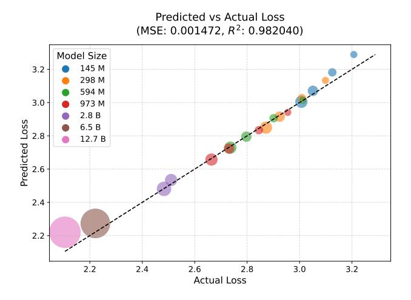
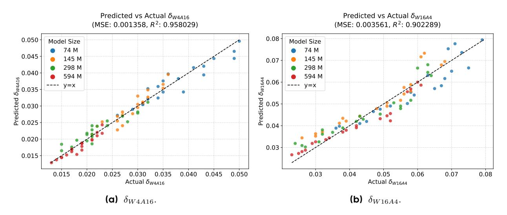
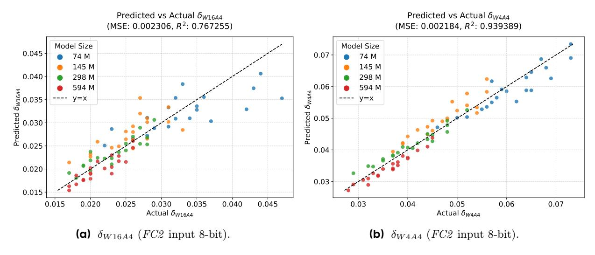

# **Appendix**

### **A Limitations**

This paper proposes a unified QAT scaling law and primarily focuses on experiments with 4-bit dense models. One limitation is that we do not conduct experiments on the MoE [4] architecture. Since MoE models contain more weight parameters but similar activation sizes, they may exhibit a different ratio of weight to activation quantization error compared to dense models. Additionally, our analysis mainly centers on W4A4 quantization. While some recent works explore extremely low-bit QAT, such as ternary quantization [28, 32], investigating unified scaling laws for these settings is also valuable. Finally, the largest training compute consumed for our proposed QAT scaling law in this study is to train a 595M parameter model trained over 100B tokens. Intuitively, the accuracy of scaling law extrapolation would be further improved by increasing both the model size and the number of training tokens.

### B Broader Impact

This paper presents work whose goal is to advance the compression and acceleration of large language models. There are many potential societal consequences of our work, none of which we feel must be specifically highlighted here.

## C Chinchilla Scaling Law

Figure 10 Fitting performance of chinchilla scaling laws. The size of the data point is proportional to training data size D.

Our QAT scaling law builds on the classical Chinchilla scaling law [16], as defined in Eq. (1). Following the original methodology [16], we estimate the parameters  $(E, A, \alpha, B, \beta)$  by minimizing the Huber loss [17] between the predicted and observed log losses, using the L-BFGS algorithm [14]. Chinchilla scaling law [16] observes that the scaling exponents  $\alpha$  and  $\beta$  are approximately equal, which suggests that one should scale N and D equally as compute increases. Therefore, we also set  $\alpha = \beta$ , in line with previous studies [13, 20]. For our experiments, we train models with sizes ranging from 145M to 2.8B parameters. To improve the extrapolation of the scaling law fit, we include 6.5B and 12.7B parameter models, which we obtain from the official OLMO-2-7B1 and OLMO-2-13B2 releases. As shown in Figure 10, the empirical training losses closely match the predicted losses, achieving a mean squared error (MSE) of 0.0014 and an  $R^2$  of 0.982, which indicates a highly accurate fit. It is important to note that our proposed QAT scaling law (Eq. (5))

&lt;sup>1https://huggingface.co/allenai/OLMo-2-1124-7B

 $^2 https://hugging face.co/allenai/OLMo-2-1124-13B$ 

directly models the quantization error. As a result, it is compatible with any scaling law related to the final loss [13, 16, 19]. In this paper, we choose to use the Chinchilla scaling law for consistency with previous QAT scaling law studies [12, 20].

## D Fitting Performance of the Proposed Scaling Law Across Different Precisions

Figure 5 in the main paper illustrates the fitting performance of the proposed scaling law (Eq.(5)) in the W4A4 precision setting. In this section, we further present the fitting results for W4A16 and W16A4 precisions in Figure 11, which achieve mean squared errors (MSE) of 0.001 and 0.003, respectively. These results demonstrate the effectiveness of the proposed unified QAT scaling law across different precision configurations. Additionally, we show the fitting performance for W16A4 and W4A4 precisions with the FC2 input quantized to 8-bit in Figure 12.

**Figure 11** Fitting performance of proposed scaling law on  $\delta_{W4A16}$  and  $\delta_{W16A4}$ .

Figure 12 Fitting performance of proposed scaling laws on  $\delta_{W16A4}$  and  $\delta_{W4A4}$  scaling laws with FC2 Proj inputs as 8-bit.

