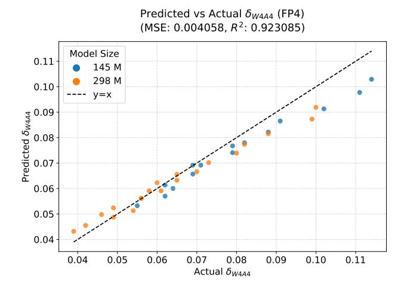
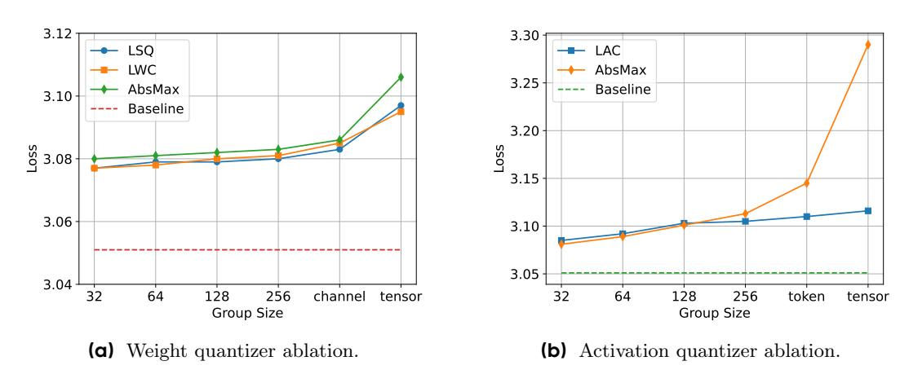
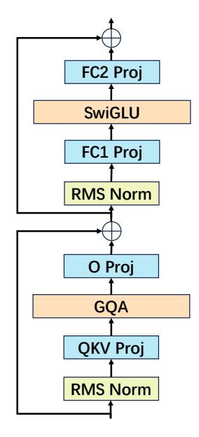
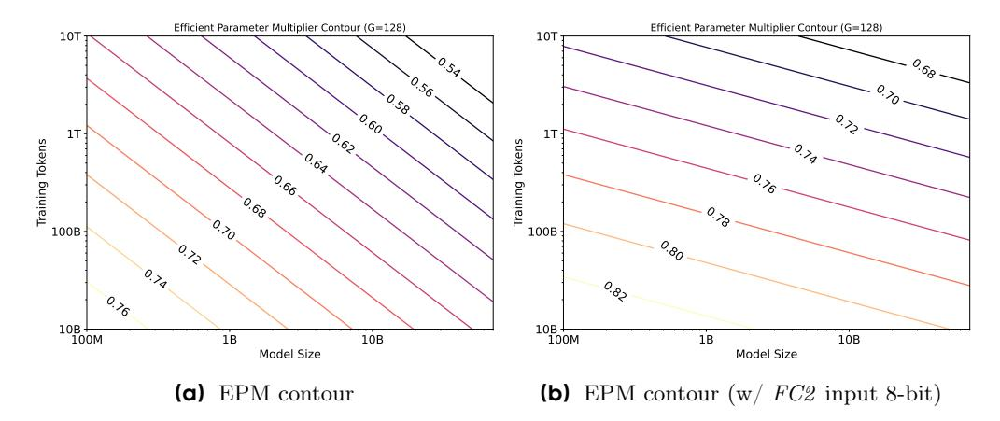

# **E Quantization Implementation Details and Types**

### **E.1 Quantization Types**

There are two main types of model quantization: integer (INT) and floating-point (FP) quantization.

**Integer Quantization.** In integer quantization, continuous values are uniformly mapped to discrete integer values. Mathematically, for a given matrix X, the quantization process is defined as:

$$\mathbf{X}_{\text{INT}} = \text{clamp}\left(\lfloor \frac{\mathbf{X}}{s} \rceil, Q_{min}, Q_{max}\right) \tag{6}$$

where ⌊·⌉ denotes the rounding operation, and s is the scaling factor. Here, XINT represents the quantized integer tensor, and X denotes the original full-precision tensor. After rounding, a clipping operation ensures that the quantized values remain within the range [Qmin, Qmax], where Qmin = −2 b−1 and Qmax = 2b−1 − 1, with b being the number of quantization bits. To recover an approximate real value, the quantized tensor can be dequantized by multiplying by the scaling factor s:

$$\hat{\mathbf{X}} = \mathbf{X}_{\text{INT}} \times s,\tag{7}$$

**Floating-Point Quantization.** Floating-point representation is more complex than the integer format. Each floating-point number consists of three components: the sign bit (S), the exponent (E), and the mantissa (M). This format is typically denoted as ExMy, where x and y indicate the number of bits allocated to the exponent and mantissa, respectively. The sign bit determines whether the number is positive or negative. The exponent defines the range of representable values, while the mantissa determines the precision. A floating-point number is decoded as:

$$Value = (-1)^S \times (1.M) \times 2^{E-bias}$$
(8)

In this paper, we focus on 4-bit quantization and adopt the E2M1 FP4 format, following previous works [\[38,](#page-11-17) [41\]](#page-12-4). For a given matrix X, the quantization process is:

$$\mathbf{X}_{\mathrm{FP}} = \mathrm{MAP}\left(\frac{\mathbf{X}}{s}\right),\tag{9}$$

where s is the scaling factor for normalization, and MAP() denotes mapping the normalized values to the nearest floating-point values defined by Eq. [\(8\)](#page-15-1). Similar to integer quantization, the values can be dequantized to approximate real values by multiplying by s:

$$\hat{\mathbf{X}} = \mathbf{X}_{FP} \times s,\tag{10}$$

**Scaling Behavior.** Consistent with previous work [\[20\]](#page-10-6), we hypothesize that the scaling behavior for INT and FP formats can be described by the same functional form. There are two pieces of evidence supporting this assumption. First, Figure [2](#page-3-1) shows that the performance gap between FP4 and INT4 is negligible in the 4-bit setting. Second, Figure [13](#page-16-2) demonstrates that the scaling law fitted on INT4 data also accurately predicts QAT error for FP4.

### **E.2 Quantizer**

The quantization format defines the representation space for discrete values. Both integer (INT) and floatingpoint (FP) formats require a scaling factor to normalize continuous values into a discrete range. Different quantizers employ distinct methods to compute the scaling factor s, which is shared within a quantization group. For simplicity, we consider X as a quantization group here.

**AbsMax.** The AbsMax quantizer computes the scaling factor using the absolute maximum value, given by M max(|X|) , where M represents the maximum discrete value (e.g., M = 8 for INT4, M = 6 for E2M1 FP4).

**LWC and LAC.** The LWC [\[36\]](#page-11-2) and LAC [\[5\]](#page-10-9) quantizers extend AbsMax by introducing learnable clipping factors for weight and activation quantization, respectively. Their scaling factor is computed as M max(|X|)·γ , where γ is

**Figure 13** The QAT scaling law, fitted for INT4 quantization, also accurately models the quantization error of FP4 quantization.

Figure 14 Quantizer ablation studies for 145M model with 50B tokens.

a learnable clipping factor. LWC assigns a unique  $\gamma$  per weight group, while LAC shares  $\gamma$  across the same group index for different tokens to enhance deployability.

**LSQ.** The LSQ [9] quantizer treats the scaling factor as a directly learnable parameter.

Ablation of different quantizer. As shown in Figure 14, activation quantization is more sensitive to quantizer choice than weight quantization, primarily due to outliers in activation distributions [2]. For example, all three weight quantizers achieve similar final loss, with differences less than 0.003 across most granularities except per-tensor. Thus, we set the weight quantizer to AbsMax, as we do not use per-tensor quantization. However, for activations, LAC significantly outperforms AbsMax when group size exceeds 256. Therefore, we use AbsMax for activation quantization with fine group sizes (< 256), and LAC for activations with coarse group sizes (> 256).

#### F Model Architecture

We select the Llama-3 [15] style model for our experiments due to its wide adoption. As shown in Figure 15, each transformer block in the Llama-3 style model contains four linear layers: QKV Proj, O Proj, FC1 Proj, and FC2 Proj. Additionally, the Llama-3 style model employs Group Query Attention (GQA)[1] for the self-attention module and SwiGLU[37] for the feed-forward module. Table 3 presents the detailed architectural settings of the models used.

**Figure 15** Illustration of Llama-3-style [\[15\]](#page-10-0) transformer block. Note that QKV Proj can be divided into three separate layers, and FC1 Proj can be split into two layers.

**Table 3** Model architecture and training hyper-parameters.

| Model Size              | 74M                               | 145M   | 297M | 595M | 973M | 2.8B |  |
|-------------------------|-----------------------------------|--------|------|------|------|------|--|
| Layers                  | 12                                | 12     | 12   | 24   | 16   | 28   |  |
| Hidden Size             | 768                               | 1024   | 1536 | 1536 | 2048 | 3072 |  |
| FFN Hidden Size         | 2048                              | 3072   | 4096 | 4096 | 8192 | 8192 |  |
| Attention Heads         | 16                                | 16     | 24   | 24   | 32   | 24   |  |
| KV Heads                | 4                                 | 4      | 6    | 6    | 8    | 8    |  |
| Batch Size (# Sequence) | 256                               | 256    | 512  | 512  | 512  | 512  |  |
| Max LR                  | 1.5e-3                            | 1.0e-3 | 8e-4 | 6e-4 | 6e-4 | 6e-4 |  |
| Min LR                  | 0.1 × Max LR                      |        |      |      |      |      |  |
| Optimizer               | AdamW (β1 = 0.9, β2 = 0.95) |        |      |      |      |      |  |
| Weight Decay            | 0.1                               |        |      |      |      |      |  |
| Clip Grad Norm          | 1.0                               |        |      |      |      |      |  |
| LR Schedule             | Cosine                            |        |      |      |      |      |  |
| Warmup Steps            | 500                               |        |      |      |      |      |  |
| Sequence Length         | 2048                              |        |      |      |      |      |  |

## **G Quantization Error Contour**

Figure [1](#page-1-0) shows the contour plot of W4A4 QAT quantization using the proposed QAT scaling law in Eq. [\(5\)](#page-5-2). For clarity, we restate Eq. [\(5\)](#page-5-2):

$$\delta_p(N, D, G) = \frac{k \cdot D^{\gamma_D} \cdot (\log_2(G))^{\gamma_G}}{N^{\gamma_N}}.$$

We plot the contour by fixing G. Let C = k · (log2 (G))γG , so Eq. [\(5\)](#page-5-2) simplifies to:

$$\delta_p(N, D, G) = C \cdot D^{\gamma_D} \cdot N^{-\gamma_N}.$$

Each contour line represents a constant quantization error, i.e., δp(N, D) = z0:

$$C \cdot D^{\gamma_D} \cdot N^{-\gamma_N} = z_0.$$

Taking the base-10 logarithm of both sides, we have:

$$\begin{split} \log_{10}(C) + \gamma_D \log_{10}(D) - \gamma_N \log_{10}(N) &= \log_{10}(z_0) \\ \gamma_D \log_{10}(D) - \gamma_N \log_{10}(N) &= \log_{10}(z_0) - \log_{10}(C) \\ \gamma_D \log_{10}(D) + (-\gamma_N) \log_{10}(N) &= \text{const} \end{split}$$

Let x = log10(N) and y = log10(D). The contour equation becomes:

$$\gamma_D y - \gamma_N x = \text{const}$$

or equivalently,

$$y = \frac{\gamma_N}{\gamma_D} x + \text{const'}$$

Thus, in the (log10 N, log10 D) space, the contours are straight lines. The slope of each contour line is γN γD .

## **H Scaling with Efficient Parameter Multiplier**

To improve the practicality of the proposed QAT scaling law, we extend it to the efficient parameter multiplier (EPM) (Eq. [\(2\)](#page-2-1)) [\[12,](#page-10-5) [20\]](#page-10-6), which quantifies the impact of quantization on the model's effective parameter count. Previous studies [\[12,](#page-10-5) [20\]](#page-10-6) treat eff(C) as a constant determined by the model architecture and quantization type, independent of model size and the number of training tokens. In contrast, we model the quantization error δp instead of directly modeling eff(C). However, we can derive the value of eff(C) by solving the following equation:

$$\underbrace{\frac{A}{N^{\alpha}} + \frac{B}{D^{\beta}} + E + \delta_{p}(N, D, G)}_{\text{Loss with QAT (Eq. (4))}} = \underbrace{\frac{A}{(N \cdot \text{eff}(\mathbf{C}))^{\alpha}} + \frac{B}{D^{\beta}} + E}_{\text{Loss without QAT (Eq. (2))}}.$$
(11)

From this, we obtain:

$$\mathbf{eff}(\mathbf{C}) = \left(\frac{A}{A + \delta_p(N, D, G) \cdot N^{\alpha}}\right)^{\frac{1}{\alpha}}.$$
 (12)

By substituting δp with Eq. [\(5\)](#page-5-2), the final expression for eff(C) is:

$$\mathbf{eff}(\mathbf{C}) = \left(\frac{A}{A + k \cdot D^{\gamma_D} \cdot (\log_2(G))^{\gamma_G} \cdot N^{\alpha - \gamma_N}}\right)^{\frac{1}{\alpha}},\tag{13}$$

where N, D, and G are variables, and A, k, α, γD, γG, and γN are constants. Eq. [\(13\)](#page-18-0) shows that eff(C) decreases as D and G increase. Furthermore, the relationship between eff(C) and N depends on the difference α − γN . Although the quantization error decreases as the model size increases, with γN indicating the rate of this decrease, the speed at which the loss decreases also slows down with larger model sizes, as represented by α. This explains why the relationship between EPM and N depends on α − γN . Since α > γN in the W4A4 scenario (as shown in Table [1\)](#page-5-0), eff(C) also decreases as N increases. As shown in Figure [16a,](#page-19-0) the EPM for W4A4 exceeds 0.5 in most cases, indicating that W4A4 QAT achieves a better trade-off than even lossless W8A8. Additionally, Figure [16b](#page-19-0) demonstrates that setting the FC2 input to 8 bits significantly improves EPM, increasing it by 0.06 to 0.14 across different values of N and D.

**Practical implications.** Our results show that EPM is sensitive to model size, training data, and quantization granularity. EPM serves as a practical metric for evaluating the effective capacity of quantized models under

Figure 16 Efficient parameter multiplier (EPM) contour for W4A4 QAT. EPM of W4W4 QAT consistently outperform 0.5, and setting FC2 inputs as 8bit significantly improve the EPM with

different settings. It also helps predict when resource-intensive quantization methods, such as fine-grained or mixed-precision quantization, are worthwhile. While these methods can improve EPM, they also increase inference overhead. EPM therefore helps balance the trade-off between higher effective capacity and additional computational cost.

## I More Analysis and Discussions

Difference with existing PTQ scaling law. Previous PTQ scaling laws [20, 31] and the proposed QAT scaling law in this study confirm that quantization error increases with more training data, but differences exist. In PTQ, quantization occurs only post-training, causing a rapid increase in error as training data grows, resulting in higher loss for models with more data compared to those with less. In contrast, QAT integrates quantization throughout the training process, leading to a slower error increase rate. Consequently, in QAT, as the number of training tokens increases, the final loss decreases, but the loss gap with full-precision training widens.

Optimal QAT bit-width. The Kumar QAT scaling law [20] identifies 8-bit precision as Pareto-optimal for QAT on LLMs. However, later studies [12, 32] show that 4-bit QAT can be optimal. We find that this difference is mainly due to the quantization granularity used in Kumar [20], where activation quantization is set to per-tensor. As shown in Figure 14b, using an AbsMax quantizer with per-tensor granularity causes significant performance loss—0.24 degradation compared to the Bfloat16 baseline—due to activation outliers. Figure 14b also shows that fine-grained quantization or clipping-based quantizers (such as LAC) can reduce the negative impact of outliers, making 4-bit quantization more competitive. This paper focuses on how quantization error changes with model size, training tokens, and quantization granularity, rather than finding the optimal QAT bit-width. However, our results also support that 4-bit QAT can provide a better trade-off. Following previous works [12, 20], we assume the computational cost of 8-bit QAT is twice that of 4-bit QAT, and that 8-bit QAT achieves lossless performance compared to Bfloat16. Therefore, 4-bit QAT is preferable when EPM > 0.5, and 8-bit QAT is preferable otherwise. As shown in Figure 16a, the EPM for W4A4 is consistently above 0.5, indicating that 4-bit QAT achieves a better trade-off than 8-bit QAT.

Connection with FQT. QAT focuses on accelerating inference by quantizing only the forward pass during training, without improving training efficiency itself. Fully Quantized Training (FQT) extends this by quantizing both forward and backward passes, speeding up both training and inference. Recent work shows that FQT at 8-bit precision achieves nearly lossless accuracy [10, 24, 33], and some studies report promising results at 4 bits [38, 39, 41]. However, since 4-bit QAT already causes accuracy loss even without quantized backward propagation, 4-bit FQT remains a challenge. Our work also lays the groundwork for future research on 4-bit FQT.

**Ablation studies about** D. The main difference between our scaling law and existing methods [12, 20] is that

**Table 4** Ablation study of incorporating D in Eq. [\(5\)](#page-5-2) across various precisions.

| Precision | Ablation      | Relative Error |
|-----------|---------------|----------------|
| W4A4      | w/o D w/ D | 8.6% 4.7%   |
| W4A16     | w/o D w/ D | 13.8% 5.2%  |

we recognize δp increases with D and explicitly include D in the scaling law. Table [4](#page-20-0) shows ablation results for removing D from Eq. [\(5\)](#page-5-2). Excluding D reduces prediction accuracy for both W4A4 and W4A16: the relative error for W4A4 rises from 4.7% to 8.6%, and for W4A16 from 5.2% to 13.8%. These results highlight the necessity of including D in the QAT scaling law.