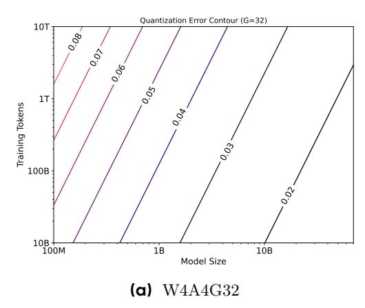
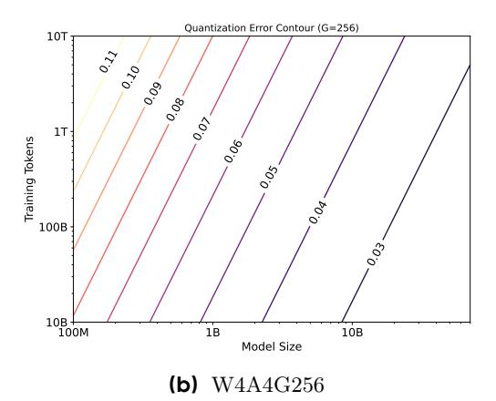

# **Scaling Law for Quantization-Aware Training**

**Mengzhao Chen**1,2 , **Chaoyi Zhang**2 , **Jing Liu**2 , **Yutao Zeng**2 , **Zeyue Xue**1 , **Zhiheng Liu**1 , **Yunshui Li**2 , **Jin Ma**2 , **Jie Huang**2 , **Xun Zhou**2,† , **Ping Luo**1,†

> 1The University of Hong Kong, 2ByteDance Seed

> > †Corresponding authors

## **Abstract**

Large language models (LLMs) demand substantial computational and memory resources, creating deployment challenges. Quantization-aware training (QAT) addresses these challenges by reducing model precision while maintaining performance. However, the scaling behavior of QAT, especially at 4-bit precision (W4A4), is not well understood. Existing QAT scaling laws often ignore key factors such as the number of training tokens and quantization granularity, which limits their applicability. This paper proposes a unified scaling law for QAT that models quantization error as a function of model size, training data volume, and quantization group size. Through **268** QAT experiments, we show that quantization error decreases as model size increases, but rises with more training tokens and coarser quantization granularity. To identify the sources of W4A4 quantization error, we decompose it into weight and activation components. Both components follow the overall trend of W4A4 quantization error, but with different sensitivities. Specifically, weight quantization error increases more rapidly with more training tokens. Further analysis shows that the activation quantization error in the FC2 layer, caused by outliers, is the primary bottleneck of W4A4 QAT quantization error. By applying mixed-precision quantization to address this bottleneck, we demonstrate that weight and activation quantization errors can converge to similar levels. Additionally, with more training data, weight quantization error eventually exceeds activation quantization error, suggesting that reducing weight quantization error is also important in such scenarios. These findings offer key insights for improving QAT research and development.

**Date:** May 21, 2025

## **1 Introduction**

The emergence of large language models (LLMs)[\[15,](#page-10-0) [24,](#page-11-0) [35\]](#page-11-1) revolutionizes natural language processing (NLP), enabling advances in tasks from text generation to complex reasoning. However, their large parameter sizes make them computationally intensive and memory-demanding[\[43,](#page-12-0) [46\]](#page-12-1), creating challenges for deployment. Quantization [\[36,](#page-11-2) [42\]](#page-12-2), which reduces the precision of model weights and activations, addresses these challenges by lowering memory usage and computational cost. Post-training quantization (PTQ)[\[3,](#page-10-1) [26,](#page-11-3) [42\]](#page-12-2) achieves nearlossless accuracy at moderate precision, such as W8A8 (8-bit weights and activations), but struggles to maintain accuracy at lower precisions like W4A4[\[25\]](#page-11-4). In contrast, quantization-aware training (QAT) [\[6,](#page-10-2) [27,](#page-11-5) [28,](#page-11-6) [32\]](#page-11-7) incorporates quantization during training, allowing models to adapt to reduced precision and supporting more aggressive compression. However, the scaling behavior of QAT at ultra-low bit-widths (e.g., W4A4) remains underexplored, limiting the design of efficient quantized LLMs.

Figure 1 Quantization error contour based on the proposed unified QAT scaling law. The quantization error decreases as the model size increases, but increases with both the number of training tokens and with coarser quantization granularity.

Scaling laws [16, 19] have proven instrumental in understanding LLMs performance as a function of model size, dataset size, and computational resources. Foundational works, such as the Kaplan scaling law [19] and the refined Chinchilla scaling law [16], provide predictive models for optimizing LLM training strategies in full-precision settings. Recent efforts have extended these frameworks to account for model quantization [12, 20, 31], with some studies examining PTQ [20, 31] and others proposing QAT-specific scaling laws [12, 20]. However, existing QAT scaling laws [12, 20] typically focused on either parameters count or fixed quantization settings, often neglecting critical factors such as number of training tokens or the granularity of quantization. Empirical observations (see Figure 4) indicate that quantization error can increase dramatically with larger training datasets and coarser quantization groups. Yet, prior works [12, 20] have not provided a unified framework that accounts for the interplay between all these factors, reducing their practical utility for real-world model design and training.

In this paper, we address these limitations by presenting a unified scaling law for QAT. Our model explicitly describes how quantization error depends on model size, the number of training tokens, and quantization granularity. Given that W8A8 quantization achieves nearly lossless performance [10, 24, 36], we focus our analysis on W4A4 QAT. We conduct 268 QAT experiments and show that quantization error decreases as model size increases, but increases with larger training datasets and coarser quantization granularity. Figure 1 shows the contours of quantization error in loss according to our proposed QAT scaling law. Our main contributions are as follows:

- Unified QAT scaling law: We propose a mathematical model for QAT quantization error, capturing its dependence on model size, dataset size, and quantization group size.
- **Empirical validation**: Through systematic experiments, we show that quantization error decreases with larger models but increases with more training tokens and coarser quantization.
- Quantization error decomposition: We decompose quantization error into weight and activation components, and find that weight quantization error is more sensitive to number of training tokens. We also identify activation quantization—especially in the FC2 layer of the feed-forward network—as the main bottleneck for W4A4 QAT.
- Bottleneck layer analysis: We show that activation quantization error in FC2 mainly arises from outlier values that 4-bit quantization cannot capture. By keeping the bottleneck layer at 8-bit precision during W4A4 QAT, we demonstrate that weight and activation quantization errors contribute almost equally to the total error at a data-to-parameter ratio of 100. With larger data-to-parameter ratios, weight quantization error surpasses activation error. This highlights the importance of considering both weight and activation components in future QAT algorithm design.

## **2 Related Works**

**Scaling Law of LLMs.** Scaling laws provide a general framework for understanding how model performance changes with resources, guiding both architecture and training strategy design. The Kaplan scaling law [\[19\]](#page-10-4) first described how model size, dataset size, and compute relate to performance. Later, the Chinchilla scaling law [\[16\]](#page-10-3) refined this by emphasizing the balance between model parameters (N) and training data tokens (D) for optimal performance under a fixed compute budget. Recent research extends scaling laws to model compression, including quantization [\[11,](#page-10-8) [23\]](#page-11-9). Studies on PTQ scaling laws [\[20,](#page-10-6) [31,](#page-11-8) [32\]](#page-11-7) find that PTQ error decreases as model size increases, but increases with larger training datasets, implying that models trained on more data may need higher precision. Other works on QAT scaling laws [\[12,](#page-10-5) [20\]](#page-10-6) show that quantization error mainly depends on model size. Building on these studies, our work explores QAT in greater depth and proposes a unified scaling law that considers model size, training data size, and quantization granularity.

**Quantization of LLMs.** Quantization reduces the computational and memory costs of serving LLMs. Current PTQ methods [\[42\]](#page-12-2) perform well at 8-bit precision, often achieving near-lossless results (e.g., W8A8 quantization). However, lowering the bit-width to 4-bit (e.g., W4A4) with PTQ usually leads to significant performance drops [\[5,](#page-10-9) [25,](#page-11-4) [36\]](#page-11-2). This accuracy loss limits the adoption of efficient 4-bit matrix multiplication (GEMM) kernels [\[22\]](#page-11-10) for LLM inference. QAT [\[6,](#page-10-2) [27\]](#page-11-5) addresses this by training models with quantization applied, which helps recover accuracy at low bit-widths. The BitNet series [\[28,](#page-11-6) [40\]](#page-11-11) shows that QAT outperforms PTQ, especially at very low bit-widths, though a gap remains compared to full-precision models. Understanding scaling behavior under QAT is therefore important for designing better QAT strategies.

