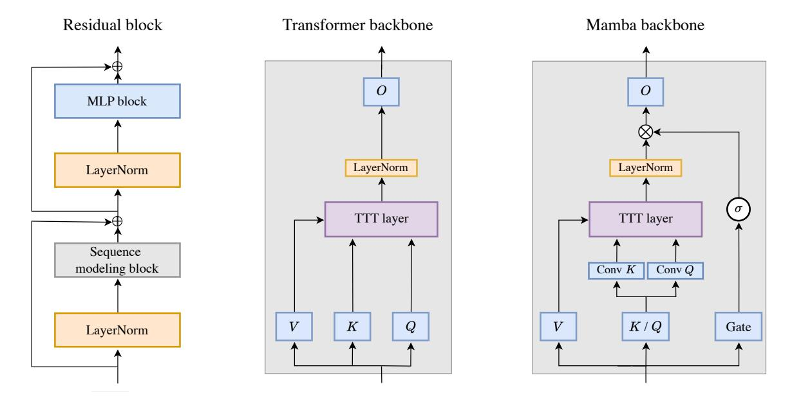

# Acknowledgements

Part of the compute for this project is generously supported by the Google TPU Research Cloud program and Hyperbolic Labs. XW is supported, in part, by the Amazon Research Award, the Cisco Faculty Award and the Qualcomm Innovation Fellowship. SK acknowledges support by NSF 2046795 and 2205329, NIFA award 2020-67021-32799, the Alfred P. Sloan Foundation, and Google Inc. TH is supported by a Sony Faculty Innovation Award and a gift from Panasonic. CG acknowledges support by the Air Force Office of Scientific Research (AFOSR), FA9550-20-1-0427, Stanford Human-Centered Artificial Intelligence (HAI) Institute, and gifts from Google and IBM.

We would like to thank Rohan Taori, Xuechen Li, Allan Zhou, Ke Chen, and Guandao Yang for many helpful discussions, Menghao Guo for help with code release, Xinyang Geng for help with EasyLM, Hao Liu for help with the LWM codebase, David Hall for help with Levanter, Yossi Gandelsman and Yutong Bai for help at an early stage of the project, Mert Yuksekgonul for help with figures in the paper, Horace He, Ben Spector, and Azalia Mirhoseini for help with systems, Sharad Vikram and Roy Frostig for answering our questions about JAX and Pallas, Albert Gu and Tri Dao for helping us reproduce experiments in the Mamba paper, and Kilian Weinberger and Percy Liang for advice on presentation. Yu Sun is grateful to his PhD advisors, Alexei A. Efros and Moritz Hardt, for their many insights from years ago that eventually became part of this paper.

## References

- [1] Josh Achiam, Steven Adler, Sandhini Agarwal, Lama Ahmad, Ilge Akkaya, Florencia Leoni Aleman, Diogo Almeida, Janko Altenschmidt, Sam Altman, Shyamal Anadkat, et al. Gpt-4 technical report. *arXiv preprint arXiv:2303.08774*, 2023.
- [2] Marcin Andrychowicz, Misha Denil, Sergio Gomez, Matthew W Hoffman, David Pfau, Tom Schaul, Brendan Shillingford, and Nando De Freitas. Learning to learn by gradient descent by gradient descent. *Advances in neural information processing systems*, 29, 2016.
- [3] Authors Guild. You just found out your book was used to train ai. now what?, 2023. Accessed: 2024-06-24.
- [4] Maximilian Beck, Korbinian Pöppel, Markus Spanring, Andreas Auer, Oleksandra Prudnikova, Michael Kopp, Günter Klambauer, Johannes Brandstetter, and Sepp Hochreiter. xlstm: Extended long short-term memory. *arXiv preprint arXiv:2405.04517*, 2024.
- [5] Yoshua Bengio, Samy Bengio, and Jocelyn Cloutier. *Learning a synaptic learning rule*. Citeseer, 1990.
- [6] Hermanus Josephus Bierens. The nadaraya-watson kernel regression function estimator. *(Serie Research Memoranda; No. 1988-58). Faculty of Economics and Business Administration, Vrije Universiteit Amsterdam.*, 1988.
- [7] Christopher M Bishop and Nasser M Nasrabadi. *Pattern recognition and machine learning*, volume 4. Springer, 2006.
- [8] Sid Black, Stella Biderman, Eric Hallahan, Quentin Anthony, Leo Gao, Laurence Golding, Horace He, Connor Leahy, Kyle McDonell, Jason Phang, et al. Gpt-neox-20b: An open-source autoregressive language model. *arXiv preprint arXiv:2204.06745*, 2022.
- [9] Léon Bottou and Vladimir Vapnik. Local learning algorithms. *Neural computation*, 4(6):888–900, 1992.
- [10] Leo Breiman, William Meisel, and Edward Purcell. Variable kernel estimates of multivariate densities. *Technometrics*, 19(2):135–144, 1977.
- [11] Zongwu Cai. Weighted nadaraya–watson regression estimation. *Statistics & probability letters*, 51(3):307–318, 2001.
- [12] Tianqi Chen, Bing Xu, Chiyuan Zhang, and Carlos Guestrin. Training deep nets with sublinear memory cost, 2016.
- [13] Xinlei Chen, Haoqi Fan, Ross Girshick, and Kaiming He. Improved baselines with momentum contrastive learning. *arXiv preprint arXiv:2003.04297*, 2020.
- [14] Yen-Chi Chen. A tutorial on kernel density estimation and recent advances. *Biostatistics & Epidemiology*, 1(1):161–187, 2017.
- [15] Kevin Clark, Kelvin Guu, Ming-Wei Chang, Panupong Pasupat, Geoffrey Hinton, and Mohammad Norouzi. Meta-learning fast weight language models. *arXiv preprint arXiv:2212.02475*, 2022.
- [16] Ronan Collobert, Fabian Sinz, Jason Weston, Léon Bottou, and Thorsten Joachims. Large scale transductive svms. *Journal of Machine Learning Research*, 7(8), 2006.
- [17] Tri Dao and Albert Gu. Transformers are ssms: Generalized models and efficient algorithms through structured state space duality. *arXiv preprint arXiv:2405.21060*, 2024.

- [18] Soham De, Samuel L Smith, Anushan Fernando, Aleksandar Botev, George Cristian-Muraru, Albert Gu, Ruba Haroun, Leonard Berrada, Yutian Chen, Srivatsan Srinivasan, et al. Griffin: Mixing gated linear recurrences with local attention for efficient language models. *arXiv preprint arXiv:2402.19427*, 2024.
- [19] Harm de Vries. In the long (context) run, 2023. Accessed: 2024-06-24.
- [20] Jerome A Feldman. Dynamic connections in neural networks. *Biological cybernetics*, 46(1):27–39, 1982.
- [21] Chelsea Finn, Pieter Abbeel, and Sergey Levine. Model-agnostic meta-learning for fast adaptation of deep networks. In *International conference on machine learning*, pages 1126–1135. PMLR, 2017.
- [22] A. Gammerman, V. Vovk, and V. Vapnik. Learning by transduction. In *In Uncertainty in Artificial Intelligence*, pages 148–155. Morgan Kaufmann, 1998.
- [23] Yossi Gandelsman, Yu Sun, Xinlei Chen, and Alexei A. Efros. Test-time training with masked autoencoders. *Advances in Neural Information Processing Systems*, 2022.
- [24] Leo Gao, Stella Biderman, Sid Black, Laurence Golding, Travis Hoppe, Charles Foster, Jason Phang, Horace He, Anish Thite, Noa Nabeshima, Shawn Presser, and Connor Leahy. The pile: An 800gb dataset of diverse text for language modeling, 2020.
- [25] Xinyang Geng. EasyLM: A Simple And Scalable Training Framework for Large Language Models. <https://github.com/young-geng/EasyLM>, mar 2023. [https://github.com/](https://github.com/young-geng/EasyLM) [young-geng/EasyLM](https://github.com/young-geng/EasyLM).
- [26] Riccardo Grazzi, Julien Siems, Arber Zela, Jörg KH Franke, Frank Hutter, and Massimiliano Pontil. Unlocking state-tracking in linear rnns through negative eigenvalues. *International Conference on Learning Representations (ICLR)*, 2024.
- [27] Albert Gu and Tri Dao. Mamba: Linear-time sequence modeling with selective state spaces. *arXiv preprint arXiv:2312.00752*, 2023.
- [28] Nicklas Hansen, Rishabh Jangir, Yu Sun, Guillem Alenyà, Pieter Abbeel, Alexei A Efros, Lerrel Pinto, and Xiaolong Wang. Self-supervised policy adaptation during deployment. *arXiv preprint arXiv:2007.04309*, 2020.
- [29] Moritz Hardt and Yu Sun. Test-time training on nearest neighbors for large language models. *arXiv preprint arXiv:2305.18466*, 2023.
- [30] Horace He. Strangely, matrix multiplications on gpus run faster when given "predictable" data! [short], 2024. Accessed: 2024-06-30.
- [31] Dan Hendrycks and Kevin Gimpel. Gaussian error linear units (gelus). *arXiv preprint arXiv:1606.08415*, 2016.
- [32] Geoffrey E Hinton and David C Plaut. Using fast weights to deblur old memories. In *Proceedings of the ninth annual conference of the Cognitive Science Society*, pages 177–186, 1987.
- [33] Sepp Hochreiter and Jürgen Schmidhuber. Long short-term memory. *Neural computation*, 9(8):1735–1780, 1997.
- [34] Jordan Hoffmann, Sebastian Borgeaud, Arthur Mensch, Elena Buchatskaya, Trevor Cai, Eliza Rutherford, Diego de Las Casas, Lisa Anne Hendricks, Johannes Welbl, Aidan Clark, Tom Hennigan, Eric Noland, Katie Millican, George van den Driessche, Bogdan Damoc, Aurelia Guy, Simon Osindero, Karen Simonyan, Erich Elsen, Jack W. Rae, Oriol Vinyals, and Laurent Sifre. Training compute-optimal large language models, 2022.

- [35] Kazuki Irie, Róbert Csordás, and Jürgen Schmidhuber. The dual form of neural networks revisited: Connecting test time predictions to training patterns via spotlights of attention. In *International Conference on Machine Learning*, pages 9639–9659. PMLR, 2022.
- [36] Kazuki Irie, Róbert Csordás, and Jürgen Schmidhuber. Practical computational power of linear transformers and their recurrent and self-referential extensions. *Conference on Empirical Methods in Natural Language Processing (EMNLP)*, 2023.
- [37] Kazuki Irie, Francesco Faccio, and Jürgen Schmidhuber. Neural differential equations for learning to program neural nets through continuous learning rules. *Advances in Neural Information Processing Systems*, 35:38614–38628, 2022.
- [38] Kazuki Irie, Imanol Schlag, Róbert Csordás, and Jürgen Schmidhuber. Going beyond linear transformers with recurrent fast weight programmers. *Advances in Neural Information Processing Systems*, 34:7703–7717, 2021.
- [39] Kazuki Irie, Imanol Schlag, Róbert Csordás, and Jürgen Schmidhuber. A modern self-referential weight matrix that learns to modify itself. In *International Conference on Machine Learning*, pages 9660–9677. PMLR, 2022.
- [40] Kazuki Irie and Jürgen Schmidhuber. Images as weight matrices: Sequential image generation through synaptic learning rules. *International Conference on Learning Representations (ICLR)*, 2022.
- [41] Vidit Jain and Erik Learned-Miller. Online domain adaptation of a pre-trained cascade of classifiers. In *CVPR 2011*, pages 577–584. IEEE, 2011.
- [42] Thorsten Joachims. *Learning to classify text using support vector machines*, volume 668. Springer Science & Business Media, 2002.
- [43] Jared Kaplan, Sam McCandlish, Tom Henighan, Tom B Brown, Benjamin Chess, Rewon Child, Scott Gray, Alec Radford, Jeffrey Wu, and Dario Amodei. Scaling laws for neural language models. *arXiv preprint arXiv:2001.08361*, 2020.
- [44] Angelos Katharopoulos, Apoorv Vyas, Nikolaos Pappas, and François Fleuret. Transformers are rnns: Fast autoregressive transformers with linear attention. In *International conference on machine learning*, pages 5156–5165. PMLR, 2020.
- [45] Diederik P Kingma and Jimmy Ba. Adam: A method for stochastic optimization. *arXiv preprint arXiv:1412.6980*, 2014.
- [46] Louis Kirsch and Jürgen Schmidhuber. Meta learning backpropagation and improving it. *Advances in Neural Information Processing Systems*, 34:14122–14134, 2021.
- [47] Ben Krause, Emmanuel Kahembwe, Iain Murray, and Steve Renals. Dynamic evaluation of neural sequence models. In *International Conference on Machine Learning*, pages 2766–2775. PMLR, 2018.
- [48] Ben Krause, Emmanuel Kahembwe, Iain Murray, and Steve Renals. Dynamic evaluation of transformer language models. *arXiv preprint arXiv:1904.08378*, 2019.
- [49] Woosuk Kwon, Zhuohan Li, Siyuan Zhuang, Ying Sheng, Lianmin Zheng, Cody Hao Yu, Joseph Gonzalez, Hao Zhang, and Ion Stoica. Efficient memory management for large language model serving with pagedattention. In *Proceedings of the 29th Symposium on Operating Systems Principles*, pages 611–626, 2023.
- [50] Brenden M Lake, Tomer D Ullman, Joshua B Tenenbaum, and Samuel J Gershman. Building machines that learn and think like people. *Behavioral and brain sciences*, 40:e253, 2017.

- [51] Quoc V Le. Building high-level features using large scale unsupervised learning. In *2013 IEEE international conference on acoustics, speech and signal processing*, pages 8595–8598. IEEE, 2013.
- [52] Hao Liu, Wilson Yan, Matei Zaharia, and Pieter Abbeel. World model on million-length video and language with blockwise ringattention. *arXiv preprint arXiv:2402.08268*, 2024.
- [53] Xuan Luo, Jia-Bin Huang, Richard Szeliski, Kevin Matzen, and Johannes Kopf. Consistent video depth estimation. *ACM Transactions on Graphics (ToG)*, 39(4):71–1, 2020.
- [54] Dougal Maclaurin, David Duvenaud, and Ryan Adams. Gradient-based hyperparameter optimization through reversible learning. In *International conference on machine learning*, pages 2113–2122. PMLR, 2015.
- [55] Luke Metz, Niru Maheswaranathan, Brian Cheung, and Jascha Sohl-Dickstein. Meta-learning update rules for unsupervised representation learning. *arXiv preprint arXiv:1804.00222*, 2018.
- [56] Ravi Teja Mullapudi, Steven Chen, Keyi Zhang, Deva Ramanan, and Kayvon Fatahalian. Online model distillation for efficient video inference. *arXiv preprint arXiv:1812.02699*, 2018.
- [57] F. Pedregosa, G. Varoquaux, A. Gramfort, V. Michel, B. Thirion, O. Grisel, M. Blondel, P. Prettenhofer, R. Weiss, V. Dubourg, J. Vanderplas, A. Passos, D. Cournapeau, M. Brucher, M. Perrot, and E. Duchesnay. Scikit-learn: Machine learning in Python. *Journal of Machine Learning Research*, 12:2825–2830, 2011.
- [58] Bo Peng, Eric Alcaide, Quentin Anthony, Alon Albalak, Samuel Arcadinho, Stella Biderman, Huanqi Cao, Xin Cheng, Michael Chung, Matteo Grella, et al. Rwkv: Reinventing rnns for the transformer era. *arXiv preprint arXiv:2305.13048*, 2023.
- [59] Bo Peng, Daniel Goldstein, Quentin Anthony, Alon Albalak, Eric Alcaide, Stella Biderman, Eugene Cheah, Teddy Ferdinan, Haowen Hou, Przemysław Kazienko, et al. Eagle and finch: Rwkv with matrix-valued states and dynamic recurrence. *arXiv preprint arXiv:2404.05892*, 2024.
- [60] Zhen Qin, Xiaodong Han, Weixuan Sun, Dongxu Li, Lingpeng Kong, Nick Barnes, and Yiran Zhong. The devil in linear transformer. *arXiv preprint arXiv:2210.10340*, 2022.
- [61] Frank Rosenblatt. The perceptron: a probabilistic model for information storage and organization in the brain. *Psychological review*, 65(6):386, 1958.
- [62] Imanol Schlag, Kazuki Irie, and Jürgen Schmidhuber. Linear transformers are secretly fast weight programmers. In *International Conference on Machine Learning*, pages 9355–9366. PMLR, 2021.
- [63] Imanol Schlag, Tsendsuren Munkhdalai, and Jürgen Schmidhuber. Learning associative inference using fast weight memory. *arXiv preprint arXiv:2011.07831*, 2020.
- [64] Jürgen Schmidhuber. *Evolutionary principles in self-referential learning, or on learning how to learn: the meta-meta-... hook*. PhD thesis, Technische Universität München, 1987.
- [65] Jürgen Schmidhuber. Learning to control fast-weight memories: An alternative to dynamic recurrent networks. *Neural Computation*, 4(1):131–139, 1992.
- [66] Noam Shazeer. Glu variants improve transformer, 2020.
- [67] Sam Shleifer, Jason Weston, and Myle Ott. Normformer: Improved transformer pretraining with extra normalization. *arXiv preprint arXiv:2110.09456*, 2021.

- [68] Assaf Shocher, Nadav Cohen, and Michal Irani. "zero-shot" super-resolution using deep internal learning. In *Proceedings of the IEEE Conference on Computer Vision and Pattern Recognition*, pages 3118–3126, 2018.
- [69] Jianlin Su, Yu Lu, Shengfeng Pan, Ahmed Murtadha, Bo Wen, and Yunfeng Liu. Roformer: Enhanced transformer with rotary position embedding, 2023.
- [70] Yu Sun, Xinhao Li, Karan Dalal, Chloe Hsu, Sanmi Koyejo, Carlos Guestrin, Xiaolong Wang, Tatsunori Hashimoto, and Xinlei Chen. Learning to (learn at test time). *arXiv preprint arXiv:2310.13807*, 2023.
- [71] Yu Sun, Wyatt L Ubellacker, Wen-Loong Ma, Xiang Zhang, Changhao Wang, Noel V Csomay-Shanklin, Masayoshi Tomizuka, Koushil Sreenath, and Aaron D Ames. Online learning of unknown dynamics for model-based controllers in legged locomotion. *IEEE Robotics and Automation Letters*, 6(4):8442–8449, 2021.
- [72] Yu Sun, Xiaolong Wang, Zhuang Liu, John Miller, Alexei Efros, and Moritz Hardt. Test-time training with self-supervision for generalization under distribution shifts. In *International Conference on Machine Learning*, pages 9229–9248. PMLR, 2020.
- [73] Sebastian Thrun and Lorien Pratt. Learning to learn: Introduction and overview. In *Learning to learn*, pages 3–17. Springer, 1998.
- [74] Tijmen Tieleman and Geoffrey Hinton. Using fast weights to improve persistent contrastive divergence. In *Proceedings of the 26th annual international conference on machine learning*, pages 1033–1040, 2009.
- [75] Hugo Touvron, Louis Martin, Kevin Stone, Peter Albert, Amjad Almahairi, Yasmine Babaei, Nikolay Bashlykov, Soumya Batra, Prajjwal Bhargava, Shruti Bhosale, Dan Bikel, Lukas Blecher, Cristian Canton Ferrer, Moya Chen, Guillem Cucurull, David Esiobu, Jude Fernandes, Jeremy Fu, Wenyin Fu, Brian Fuller, Cynthia Gao, Vedanuj Goswami, Naman Goyal, Anthony Hartshorn, Saghar Hosseini, Rui Hou, Hakan Inan, Marcin Kardas, Viktor Kerkez, Madian Khabsa, Isabel Kloumann, Artem Korenev, Punit Singh Koura, Marie-Anne Lachaux, Thibaut Lavril, Jenya Lee, Diana Liskovich, Yinghai Lu, Yuning Mao, Xavier Martinet, Todor Mihaylov, Pushkar Mishra, Igor Molybog, Yixin Nie, Andrew Poulton, Jeremy Reizenstein, Rashi Rungta, Kalyan Saladi, Alan Schelten, Ruan Silva, Eric Michael Smith, Ranjan Subramanian, Xiaoqing Ellen Tan, Binh Tang, Ross Taylor, Adina Williams, Jian Xiang Kuan, Puxin Xu, Zheng Yan, Iliyan Zarov, Yuchen Zhang, Angela Fan, Melanie Kambadur, Sharan Narang, Aurelien Rodriguez, Robert Stojnic, Sergey Edunov, and Thomas Scialom. Llama 2: Open foundation and fine-tuned chat models, 2023.
- [76] Vladimir Vapnik. *The nature of statistical learning theory*. Springer science & business media, 2013.
- [77] Pascal Vincent, Hugo Larochelle, Yoshua Bengio, and Pierre-Antoine Manzagol. Extracting and composing robust features with denoising autoencoders. In *ICML*, page 1096–1103, 2008.
- [78] Christoph Von Der Malsburg. The correlation theory of brain function. In *Models of neural networks: Temporal aspects of coding and information processing in biological systems*, pages 95–119. Springer, 1994.
- [79] Renhao Wang, Yu Sun, Yossi Gandelsman, Xinlei Chen, Alexei A Efros, and Xiaolong Wang. Test-time training on video streams. *arXiv preprint arXiv:2307.05014*, 2023.
- [80] Thomas Wolf, Lysandre Debut, Victor Sanh, Julien Chaumond, Clement Delangue, Anthony Moi, Pierric Cistac, Tim Rault, Rémi Louf, Morgan Funtowicz, et al. Huggingface's transformers: State-of-the-art natural language processing. *arXiv preprint arXiv:1910.03771*, 2019.

- [81] Wenhan Xiong, Jingyu Liu, Igor Molybog, Hejia Zhang, Prajjwal Bhargava, Rui Hou, Louis Martin, Rashi Rungta, Karthik Abinav Sankararaman, Barlas Oguz, Madian Khabsa, Han Fang, Yashar Mehdad, Sharan Narang, Kshitiz Malik, Angela Fan, Shruti Bhosale, Sergey Edunov, Mike Lewis, Sinong Wang, and Hao Ma. Effective long-context scaling of foundation models, 2023.
- [82] Songlin Yang, Bailin Wang, Yikang Shen, Rameswar Panda, and Yoon Kim. Gated linear attention transformers with hardware-efficient training. *arXiv preprint arXiv:2312.06635*, 2023.
- [83] Songlin Yang, Bailin Wang, Yu Zhang, Yikang Shen, and Yoon Kim. Parallelizing linear transformers with the delta rule over sequence length. *arXiv preprint arXiv:2406.06484*, 2024.
- [84] Biao Zhang and Rico Sennrich. Root mean square layer normalization, 2019.
- [85] Hao Zhang, Alexander C Berg, Michael Maire, and Jitendra Malik. Svm-knn: Discriminative nearest neighbor classification for visual category recognition. In *2006 IEEE Computer Society Conference on Computer Vision and Pattern Recognition (CVPR'06)*, volume 2, pages 2126–2136. IEEE, 2006.

### A Dual Form

Here we derive the dual form for general MLPs of arbitrary depth, with nonlinear activations.

Without loss of generality, consider  $\eta = 1$  for convenience, and consider only the first mini-batch, where t = 1,...,b. Denote:

$$\hat{x}_t = \theta_K x_t, \quad y_t = \theta_V x_t, \quad \bar{x}_t = \theta_O x_t.$$

Also denote  $\hat{X} = [\hat{x}_1, ..., \hat{x}_b]$ , and Y and  $\bar{X}$  analogously. In general, uppercase letters denote matrices whose columns are vectors denoted by the corresponding lowercase letter.

For a network with K layers, denote the initial parameters in layer k by  $W_0^k$ . Our convention is to use superscripts for the layer and subscripts for time.

### A.1 Forward pass

During the initial forward pass of TTT, we denote the input to layer k by  $\hat{X}^k = [\hat{x}_1^k, ..., \hat{x}_b^k]$ , with  $\hat{X}^1 = \hat{X}$ . Now we write the forward pass of TTT using these notations.

For k = 1, ..., K:

- $Z^k = W_0^k \hat{X}^k$
- $\hat{X}^{k+1} = \sigma_k(Z^k)$

where  $\sigma_k$  for k = 1, ..., K can be any element-wise operation  $(\mathbb{R} \mapsto \mathbb{R})$  with derivative  $\sigma'$ .

Given  $\hat{X}^{K+1}$ , we compute the loss:

$$l = \frac{1}{2} \ell \left( W_0^1, \dots, W_0^K; X \right) = \frac{1}{2} \| \hat{X}^{K+1} - Y \|_F^2 = \sum_{t=1}^b l_t,$$

where  $l_t = \frac{1}{2} ||\hat{x}_t^K - y_t||^2$  is the same as defined in Equation 4, except scaled by 1/2 for convenience.

All the operations above (except  $\sigma$ ) are matmuls and sums, therefore are hardware efficient. Both the primal form and the dual form share these initial operations.

#### A.2 Primal form

The primal form first computes  $G_t^k = \nabla_{W_0^k} l_t$  for t = 1, ..., b, then updates  $W_t^k = W_0^k - \sum_{s=1}^t G_s^k$ . Finally, given  $\bar{X}^1 = [\bar{x}_1^1, ..., \bar{x}_h^1] = \bar{X}$ , the primal form repeats the forward pass with the updated  $W_s$ .

For k = 1, ..., K:

- $\bar{z}_t^k = W_t^k \bar{x}_t^k$ , for t = 1, ..., T
- $\bar{x}_t^{k+1} = \sigma_k(\bar{z}_t^k)$ , for t = 1, ..., T

where  $\bar{X}^{K+1} = [\bar{x}_1^{k+1}, \dots, \bar{x}_b^{k+1}]$  contains the output tokens.

Note that a standard backward pass only computes the sum of the gradients:

$$\nabla_{W_0^k} l = \sum_{t=1}^b \nabla_{W_0^k} l_t = \sum_{t=1}^b G_t^k,$$

so the computation of the individual terms in the sum  $G_t^k$  for t = 1, ..., b cannot be batched together into matmuls. Similarly, the forward pass in primal form uses a different  $W_t$  for each  $\bar{x}_t$ , therefore also cannot be batched in the same way as a standard forward pass. These non-standard passes have poor hardware efficiency.

#### A.3 Dual form

As discussed in Subsection 2.5, the goal of the dual form is to compute  $\bar{X}^{K+1}$  and  $W_b^1, \ldots, W_b^K$  with only matmuls and light-weight operations such as sums,  $\sigma$ , and  $\sigma'$ . To achieve this goal, we avoid explicitly computing the intermediate variables:  $G_t^k$  and  $W_t^k$  for  $t = 1, \ldots, b$ .

The dual form first computes  $\nabla_{\hat{X}^{K+1}}l = \hat{X}^{K+1} - Y$ , then takes a standard backward pass.

For k = K, ..., 1:

- $\nabla_{Z^k} l = \sigma'_k(Z^k) \odot \nabla_{\hat{X}^{k+1}} l$
- $\nabla_{\hat{X}^k} l = \left(W_0^k\right)^T \nabla_{Z^k} l$
- $\nabla_{W_0^k} l = \nabla_{Z^k} l \left( \hat{X}^k \right)^T$

where  $\sigma'$  is applied element-wise, and  $\odot$  is element-wise multiplication.

Now we can already compute  $W_b^k = W_0^k - \nabla_{W_0^k} l$ . To compute the output tokens, we do another forward pass.

For k = 1, ..., K:

- $\bar{Z}^k = W_0^k \bar{X}^k \nabla_{Z^k} l \cdot \mathsf{mask} \left( \left( \hat{X}^k \right)^T \bar{X}^k \right)$
- $\bar{X}^{k+1} = \sigma(\bar{Z}^k)$

By the end of the forward pass, we have computed  $\bar{X}^{K+1}$ .

While this forward pass is non-standard, it only contains matmuls, sums,  $\sigma$ , and mask, therefore is efficient like the standard forward pass.

#### A.4 Derivation

To derive the dual form, we show that:

$$\bar{Z}^k = W_0^k \bar{X}^k - \nabla_{Z^k} l \cdot \mathsf{mask} \left( \left( \hat{X}^k \right)^T \bar{X}^k \right)$$

is the same as what would be computed in the primal form. Specifically, we show that each column  $\bar{z}_t^k$  of  $\bar{Z}^k$  in the second forward pass of the dual equals to  $W_t^k \bar{x}_t^k$  in the forward pass of the primal. We invoke a simple fact.

**Fact 1.** Define matrices  $A = [a_1, ..., a_b]$ ,  $Q = [q_1, ..., q_b]$ , and  $V = [v_1, ..., v_b]$ . 14 Define  $\hat{v}_t = \sum_{s=1}^t a_s^T q_t v_s$ , and  $\hat{V} = [\hat{v}_1, ..., \hat{v}_b]$ , then  $\hat{V} = V \cdot \mathsf{mask}(A^T Q)$ .

Now plug  $A = \hat{X}^k$ ,  $Q = \bar{X}^k$ ,  $V = \nabla_{Z^k} l$ , and  $\hat{V} = W^k \bar{X}^k - \bar{Z}^k$  into the fact above, we have shown the desired equality.

Note that the  $\sigma_k$  and  $\sigma_k'$  used above can be extended to arbitrary functions that are not necessarily element-wise operations, including normalization layers. This extension can be achieved through, for example, vjp (vector-Jacobian product) in standard libraries for automatic differentiation such as JAX and PyTorch. However, the dual form cannot accelerate operations inside  $\sigma$  or its vjp.

 $^{14}$ Our matrix A would usually be denoted by K in another context. We use A to avoid confusion with the layer number K.

## **B** Nadaraya-Watson estimator

**Derivation for the Nadaraya-Watson estimator.** Throughout this section, we use  $\mathbf{x}$  to denote the input token x as a random variable. Our desired output is the corresponding output token, another random variable  $\mathbf{z}$ . This is formulated as estimating the conditional expectation of  $\mathbf{z}$ :

$$\mathbb{E}[\mathbf{z}|\mathbf{x}=x] = \int p(z|x) \ z \ dz = \int \frac{p(x,z)}{p(x)} \ z \ dz.$$

Since the true probability distributions p(x) and p(x,z) are unknown, we replace them with their kernel density estimations. Specifically, the kernel density estimation for p(x) is:

$$\hat{p}(x) = \frac{1}{n} \sum_{i=1}^{n} \kappa(x, x_i),$$

where each  $x_i$  is a piece of training data in general. (Recall that for our paper,  $x_i$  is specifically training data for the inner loop, *i.e.* a token, which matches our notation in the main text.)

For estimating p(x, y), we use the product kernel:

$$\hat{p}(x,z) = \frac{1}{n} \sum_{i=1}^{n} \kappa(x,x_i) \kappa'(z,z_i).$$

At first sight, it seems absurd to factor the joint probability into two seemingly independent kernels. But in this case,  $\kappa'$  can actually be any  $\kappa'_i$  dependent on  $x_i$ , since it will be integrated out. So the two kernels do not need to be independent.

Plugging in those estimations, we obtain the Nadaraya-Watson estimator:

$$\hat{\mathbb{E}}[\mathbf{z}|\mathbf{x}=x] = \int \frac{\hat{p}(x,z)}{\hat{p}(x)} z \, dz$$

$$= \frac{1}{\hat{p}(x)} \int \hat{p}(x,z) z \, dz$$

$$= \frac{1}{\sum_{i=1}^{n} \kappa(x,x_i)} \int \sum_{i=1}^{n} \kappa(x,x_i) \kappa'(z,z_i) z \, dz$$

$$= \frac{1}{\sum_{i=1}^{n} \kappa(x,x_i)} \sum_{i=1}^{n} \kappa(x,x_i) \int \kappa'(z,z_i) z \, dz$$

$$= \frac{1}{\sum_{i=1}^{n} \kappa(x,x_i)} \sum_{i=1}^{n} \kappa(x,x_i) z_i.$$

**Asymmetric kernels.** In modern days, people think of kernels as positive semi-definite, which might not be guaranteed for  $\kappa$  unless  $\theta_K = \theta_Q$ . However, people working on kernels decades ago, around the time when the Nadaraya-Watson estimator was popular, have been very lenient with the choice of kernels, and asymmetric kernels such as our  $\kappa$  in Equation 10 have enjoyed a long tradition: When a kernel estimator uses  $\theta_K \neq \theta_Q$ , it is known as a balloon estimator [14]. Papers such as Breiman et al. [10] have even used  $\theta_Q$  as a function of x', known as sample-adaptive smoothing.

Figure 13. Left: A residual block, the basic building block for Transformers. The sequence modeling block is instantiated into two variants: the Transformer backbone and Mamba backbone. Middle: TTT layer in the Transformer backbone. The LN before *O* comes from NormFormer [\[67\]](#page-22-15). Right: TTT layer in the backbone inspired by Mamba [\[27\]](#page-20-0) and Griffin [\[18\]](#page-20-3). Following these two architectures, *σ* here is GELU [\[31\]](#page-20-2). To accommodate the extra parameters of the gate without changing the embedding dimension, we simply combine *θK* and *θQ* into a single projection.

