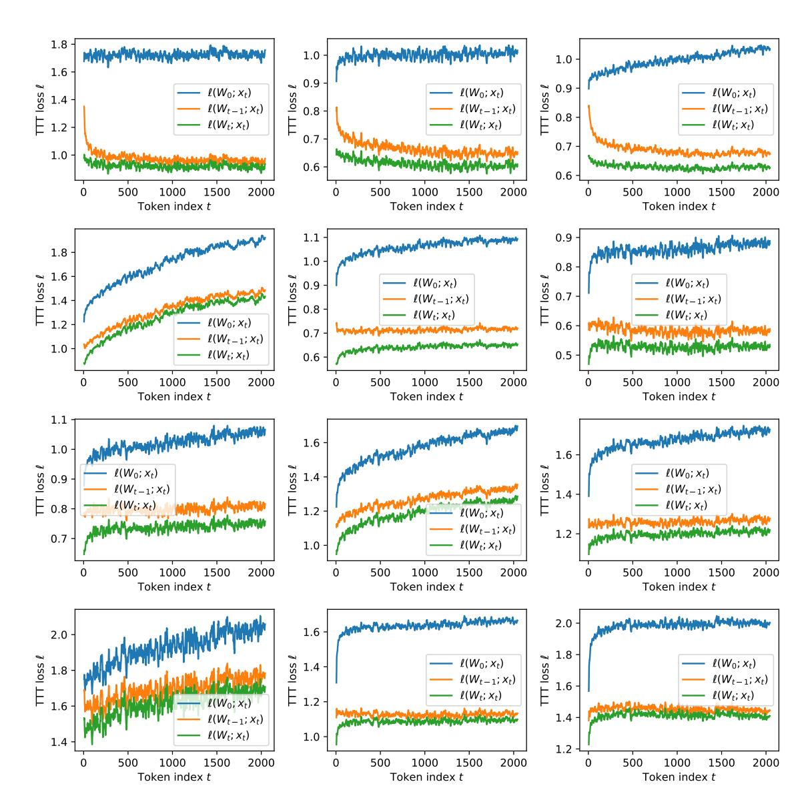
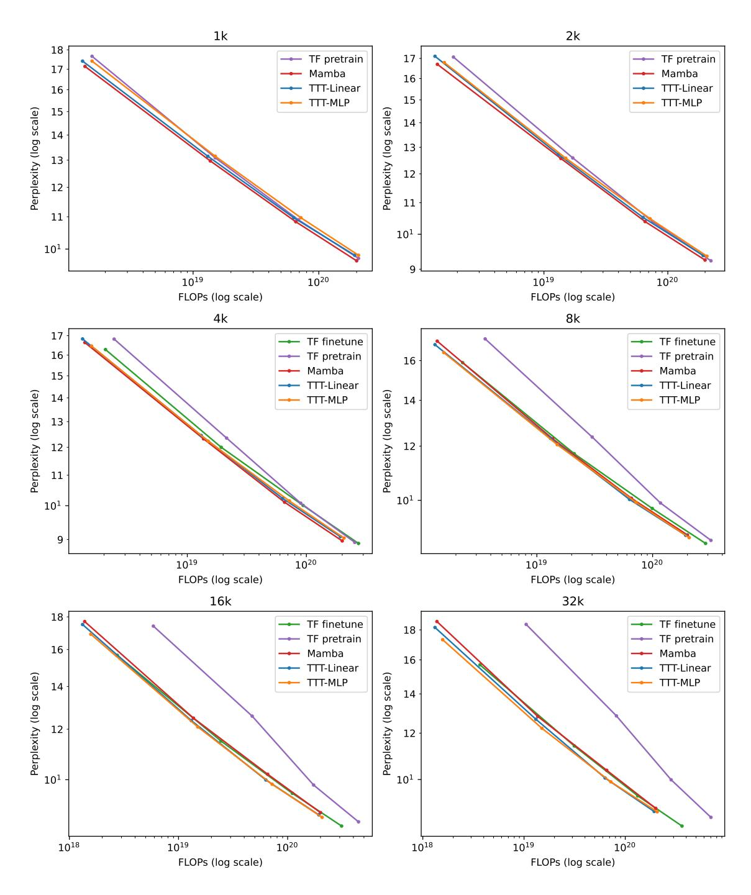
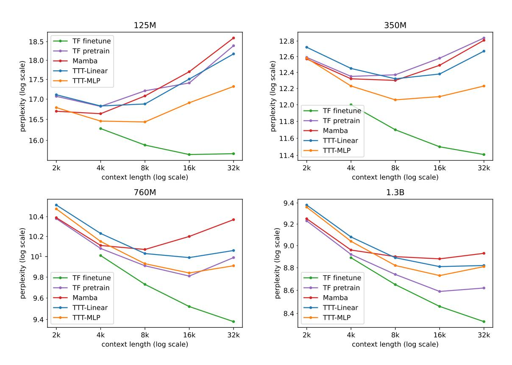

# C Experiment details

Architectures. Our Transformer strictly follows the construction in the Mamba paper, where *Transformer* is called *Transformer++*. Specifically, the Transformer architecture is based on Llama [\[75\]](#page-23-1), with rotary positional encodings (RoPE) [\[69\]](#page-23-12), SwiGLU MLP blocks [\[66\]](#page-22-16), and RMSNorm [\[84\]](#page-24-4) instead of LayerNorm. Our Mamba baseline uses the public code provided by the authors. We have verified that our baselines can reproduce the numbers reported in [\[27\]](#page-20-0).

Training configurations. Our training configurations are in Table [3,](#page-29-0) which simply reproduces Table 12 in the Mamba paper. As discussed in Footnote [12,](#page-13-0) all models are trained with a batch size of 0.5M tokens regardless of context length. All of our optimization hyper-parameters follow the "improved recipe" in Appendix E.2 of the Mamba paper, reproduced below:

- AdamW optimizer: *β* = (0*.*9*,*0*.*95)
- Cosine schedule: decay to end learning rate 1*e* − 5
- Linear learning rate warmup over 10% of the training steps
- Weight decay: 0.1
- Gradient clipping: 1.0
- No Dropout
- Mixed Precision

| Params. | Blocks | Embed. dim. | Heads | Train steps | Peak LR | Tokens |
|---------|--------|-------------|-------|-------------|---------|--------|
| 125M    | 12     | 768         | 12    | 4800        | 3e-3    | 2.5B   |
| 350M    | 24     | 1024        | 16    | 13500       | 1.5e-3  | 7B     |
| 760M    | 24     | 1536        | 16    | 29000       | 1.25e-3 | 15B    |
| 1.3B    | 24     | 2048        | 32    | 50000       | 1e-3    | 26B    |

Table 3. Training configurations for all experiments. This table reproduces Table 12 in the Mamba paper. The only difference is that the learning rate they use for Mamba and Transformer is 5× the values in their Table 12, and we report the actual values (5×). Note that this table only applies to TTT-Linear, TTT-MLP, and Transformers, as Mamba does not follow the multi-head residual block structure inherited from Transformers.

As discussed in Footnote 10, all models are trained using the Llama tokenizer [75]. For experiments on the Pile, this is the only difference with the recipe in the Mamba paper, which uses two other tokenizers. For experiments on Books, we find that the original angle of the RoPE encoding [69]  $\theta = 10,000$  is sub-optimal for our Transformer baseline in long context. Starting at context length 4k, we try  $\theta = 500,000$  following the Llama Long paper [81], and use the better perplexity for Transformer (both pretrain and finetune).

**Transformer finetuning.** Finetuning starts a new cosine schedule with the same optimization hyper-parameter as training from scratch, except the peak learning rate. We try three peak learning rates for finetuning: 1e-5, 1e-4, and 1e-3, and select for the best perplexity. We observe that 1e-4 works the best for the 125M models, while 1e-5 works the best for 350M and larger. This observation is reasonable considering that the end learning rate for the Chinchilla recipe is 1e-5.

**Learning rate for TTT.** As mentioned in Subsection 2.7, the inner-loop base learning rate  $\eta_{\text{base}}$  is set to 1 for TTT-Linear and 0.1 for TTT-MLP. Our heuristic for setting  $\eta_{\text{base}}$  is similar to how people set the outer-loop learning rate for regular training: We tried  $\eta_{\text{base}} \in \{0.01, 0.1, 1, 10\}$  and used the largest value that does not cause instabilities. For TTT-MLP, we use linear warmup for  $\eta_{\text{base}}$  over 10% of the training steps, similar to regular training. The number of training steps in the inner loop is T/b (assume divisible). For TTT-Linear, we tried linear warmup in the inner loop but did not observe a difference.

**Experiments in Figure 2 (right).** To ensure fairness to Mamba, all methods in these experiments have matched training FLOPs and are trained with the same recipe (last row of Table 3) as Mamba 1.4B. For TTT-Linear and TTT-MLP, matched training FLOPs also imply matched inference FLOPs. Transformer (TF finetune) has 2.8× the inference FLOPs, giving it an advantage as our baseline. To match training FLOPs with Mamba, Transformer has 19 blocks instead of 24. For TTT-Linear and TTT-MLP, their training FLOPs are already close to those of Mamba, so we only need to change the hidden dimension of the MLP blocks from 5504 to 5808 for TTT-Linear and 5248 for TTT-MLP.

**Gradient checkpointing through time.** By default, libraries such as JAX and PyTorch save the intermediate activations during a forward pass so they can be reused during the backward pass. However, for a TTT layer with W as hidden state, this default saves  $W_1, \ldots, W_T$ , which uses too much memory. With TTT mini-batch and the dual form, we still need to save (assume divisible)  $\kappa = T/b$  Ws at the end of the mini-batches. A standard technique to save memory in this scenario is gradient checkpointing [12], which is usually applied through layers, but we apply it through time.

Figure 14. The self-supervised TTT loss  $\ell$  averaged over all test sequences of the form  $x_1, \ldots, x_T$  where T=2048, for all 12 TTT layers in a network with 125M parameters train on the Pile. The same network is also used for b=1 (online GD) in the left panel of Figure 7. For layers in the middle, we observe that  $\|x_t\|$  rises steadily, causing all three losses to rise with it. Even for these layers, the gap between  $\ell(W_0; x_t)$  and  $\ell(W_t; x_t)$  still increases with t. For visual clarity, loss values have been averaged over a sliding window of 10 timesteps.

Figure 15. Complete results on Books, presented by context lengths. Figure 11 in Subsection 3.2 presents the subset of results for context lengths 2k and 32k.

Figure 16. An alternative view of our complete results on Books, presented by model sizes, with context length as the x-axis. For all methods trained from scratch, perplexity becomes worse once the context length becomes too large. This trend is not observed with TF finetune, except for one case at the 125M scale. The best context length increases for larger models (trained from scratch).