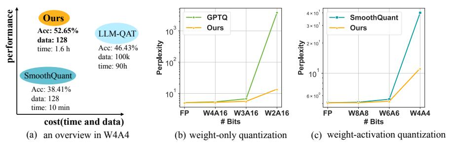

# OMNIQUANT: OMNIDIRECTIONALLY CALIBRATED QUANTIZATION FOR LARGE LANGUAGE MODELS

Wenqi Shao†1, Mengzhao Chen†1, Zhaoyang Zhang3, Peng Xu1,2, Lirui Zhao1, Zhiqian Li2, Kaipeng Zhang1, Peng Gao1, Yu Qiao1, Ping Luo\*1,2
1OpenGVLab, Shanghai AI Laboratory 2The University of Hong Kong
3The Chinese University of Hong Kong

#### **ABSTRACT**

Large language models (LLMs) have revolutionized natural language processing tasks. However, their practical deployment is hindered by their immense memory and computation requirements. Although recent post-training quantization (PTQ) methods are effective in reducing memory footprint and improving the computational efficiency of LLM, they hand-craft quantization parameters, leading to low performance, especially in extremely low-bit quantization. To tackle this issue, we introduce an Omnidirectionally calibrated Quantization (OmniQuant) technique for LLMs, which achieves good performance in diverse quantization settings while maintaining the computational efficiency of PTQ by efficiently optimizing various quantization parameters. OmniQuant comprises two innovative components including Learnable Weight Clipping (LWC) and Learnable Equivalent Transformation (LET). LWC modulates the extreme values of weights by optimizing the clipping threshold. Meanwhile, LET tackles activation outliers by shifting the challenge of quantization from activations to weights. Operating within a differentiable framework using block-wise error minimization, Omni-Quant can optimize the quantization process efficiently for both weight-only and weight-activation quantization. For instance, the LLaMA-2 model family size 7-70B can be processed with OmniQuant on a single A100-40G GPU within 1-16 hours using 128 samples. Extensive experiments validate OmniQuant's superior performance across diverse quantization configurations such as W4A4 (4-bit weight, 4-bit activation), W6A6, W4A16, W3A16, and W2A16. Additionally, OmniQuant demonstrates effectiveness in instruction-tuned models and delivers notable improvements in inference speed and memory reduction on real devices. Codes are available at https://github.com/OpenGVLab/OmniQuant.

## 1 Introduction

Large language models (LLMs) such as GPT-4 (Bubeck et al., 2023) and LLaMA (Touvron et al., 2023a), have demonstrated impressive performance across various natural language benchmarks (Hendrycks et al., 2020; Zellers et al., 2019). Furthermore, the language understanding capabilities inherent in LLMs can be successfully transferred into multimodal models (Mu et al., 2023; Xu et al., 2023; Zhang et al., 2023a; Huang et al., 2024; 2023). Thereby, LLMs can be regarded as precursors to artificial general intelligence (Bubeck et al., 2023). However, the considerable computational and memory requirements of LLMs pose substantial challenges (Zhang et al., 2023b; Hu et al., 2023). For instance, the GPT-3 model (Brown et al., 2020) requires 350G of memory to load its parameters in FP16 format, which corresponds to the requirement of at least five A100-80G GPUs for inference. This significant demand for computational resources and associated communication overheads impedes the practical deployment of LLMs in real-world applications.

Quantization has shown to be promising to mitigate both computational and memory overhead in LLMs. In general, it comes in two types including post-training quantization (PTQ) and quantization-aware training (QAT). Although QAT can lead to more competitive accuracy than PTQ,

\*Corresponding author: Ping Luo, pluo@cs.hku.hk

† Equal Contribution

Figure 1: (a) provides an overview of LLaMA-7B with W4A4 quantization, highlighting Omni-Quant's ability to achieve quantization-aware training (QAT) performance with post-training quantization (PTQ) time and data efficiency. (b) and (c) showcase the perplexity (low is better) of quantized LLaMA-13B across different bit-widths on WikiText2.

it is not practical due to the high training cost because the whole model is trained with the awareness of the quantization process. As a result, PTQ is commonly utilized in existing quantization methods on LLMs. For example, lots of PTQ methods [\(Frantar et al.,](#page-9-2) [2022;](#page-9-2) [Lin et al.,](#page-10-4) [2023;](#page-10-4) [Dettmers et al.,](#page-9-3) [2023b\)](#page-9-3) reduce memory consumption by weight-only quantization which quantizes the weights while maintaining full-precision activation. To further reduce the computational overhead, another line of work [\(Xiao et al.,](#page-11-6) [2023;](#page-11-6) [Wei et al.,](#page-11-7) [2022;](#page-11-7) [Yuan et al.,](#page-11-8) [2023;](#page-11-8) [Wei et al.,](#page-11-9) [2023;](#page-11-9) [Liu et al.,](#page-10-5) [2023a\)](#page-10-5) employs weight-activation quantization which quantizes both weight and activation into low-bit values for the execution of low-bit matrix multiplication.

Existing quantization methods have demonstrated significant achievements in various scenarios, including W4A16 (*i.e.* 4-bit weight and 16-bit activation) weight-only quantization such as [\(Lin et al.,](#page-10-4) [2023;](#page-10-4) [Dettmers et al.,](#page-9-3) [2023b;](#page-9-3) [Lee et al.,](#page-10-6) [2023\)](#page-10-6), as well as W8A8 weight-activation quantization [\(Wei](#page-11-9) [et al.,](#page-11-9) [2023\)](#page-11-9). However, they usually exhibit significant performance degradation when confronted with low-bit quantization, such as W2A16 and W4A4, as illustrated in Figure [1](#page-1-0) (b & c). This performance shortfall in low-bit quantization can be attributed to the fact that these methods [\(Frantar et al.,](#page-9-2) [2022;](#page-9-2) [Lin et al.,](#page-10-4) [2023;](#page-10-4) [Wei et al.,](#page-11-9) [2023\)](#page-11-9) primarily rely on handcrafted quantization parameters such as migration strength [\(Xiao et al.,](#page-11-6) [2023\)](#page-11-6) and scaling parameters [\(Wei et al.,](#page-11-9) [2023\)](#page-11-9), which often leads to lower performance. Although Quantization-Aware Training (QAT) [\(Liu et al.,](#page-10-7) [2023b\)](#page-10-7) is effective in determining the optimal quantization configurations, it introduces substantial training overhead in both training and data efficiency. It is thus hard to quantize LLMs with QAT-based techniques efficiently such as LLMQAT [\(Liu et al.,](#page-10-7) [2023b\)](#page-10-7). For instance, GPTQ [\(Frantar et al.,](#page-9-2) [2022\)](#page-9-2), a PTQ approach, can complete the quantization of LLaMA-13B in an hour using 128 samples on a single A100 GPU, while LLM-QAT [\(Liu et al.,](#page-10-7) [2023b\)](#page-10-7) requires 100k samples and hundreds of GPU hours. This leads us to a central question: *can we attain the performance of QAT, while maintaining the time and data efficiency of PTQ?*

This paper introduces a novel quantization technique, OmniQuant, which effectively addresses the above question. OmniQuant achieves state-of-the-art performance across various quantization scenarios, particularly in low-bit settings, while preserving the time and data efficiency of PTQ, as illustrated in Figure [1.](#page-1-0) Unlike Quantization-Aware Training (QAT) [\(Liu et al.,](#page-10-7) [2023b\)](#page-10-7) which involves cumbersome weight optimization, OmniQuant freezes the original full-precision weight and only incorporates a few learnable quantization parameters. As shown in Figure [2,](#page-2-0) OmniQuant consists of two key components that incorporate different types of learnable quantization parameters, including Learnable Weight Clipping (LWC) and Learnable Equivalent Transformation (LET). Specifically, LWC modulates the extreme values of weights by optimizing the clipping threshold. In the meanwhile, LET tackles activation outliers by learning mathematically equivalent transformations in a transformer encoder.

Instead of jointly optimizing all parameters across the LLM, OmniQuant sequentially quantizes the parameters of one layer before moving on to the next under a block-wise quantization error minimization framework. In this way, OminiQuant can be optimized efficiently using a simple Stochastic Gradient Descent (SGD) algorithm. Thanks to the differentiable optimization, LWC and LET can be seamlessly integrated into the quantization. We find that LWC can mitigate the difficulty in quantizing weights and LET further shifts the challenge of quantization from activations to weights, facilitating OmniQuant a versatile quantization framework for both weight-only and weight-activation quantization. Notably, OmniQuant introduces no extra computation or parameters for the quantized model because the clipping threshold in LWC and equivalent factors in LET can be fused into quantized weights.

As depicted in Figure [2,](#page-2-0) OmniQuant is easy to implement even with limited resources. Especially, taking the LLaMA-2 model family (7B-70B) as an example, all models can be quantized on a single A100-40G GPU utilizing only 128 training samples. The training time ranges from 1 to 16 hours, depending on the size of the quantized model, which ranges from 7B to 70B. Owing to the seamless integration of LWC and LET achieved by differentiable optimization, OmniQuant exhibits superior performance compared to prior PTQ-based methods in various quantization settings. For example, when

Figure 2: Characteristics of OmniQuant on LLaMA family.

LLaMA-13B is quantized into W2A16, OmniQuant achieves a perplexity of 13.21, while GPTQ incurs a significant increase in perplexity to 3832, as demonstrated in Figure [1.](#page-1-0) A similar performance advancement is also observed in the W4A4 quantization.

The contributions of OmniQuant are summarized as follows. 1) We formulate a novel quantization pipeline for LLM, OmniQuant, which freezes original full-precision weights while incorporating a restrained set of learnable parameters. OmniQuant imbues quantization with gradient updates while preserving the time and data efficiency of PTQ methods. 2) OmniQuant consists of Learnable Weight Clipping (LWC) and Learnable Equivalent Transformation (LET). These strategies make full-precision weights and activations more amenable to quantization. 3) Through extensive experiments, we demonstrate that OmniQuant outperforms previous methods across a spectrum of quantization settings (W416, W3A16, W2A16, W6A6, W4A4), various model families (OPT, LLaMA, LLaMA-2, LLaMA-2-chat, Falcon), and a range of model sizes (125M-180B). The computation speedup and memory reduction of OmniQuant are also demonstrated on real devices.

