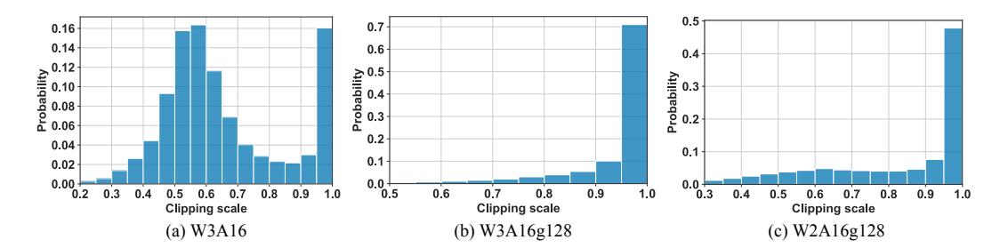
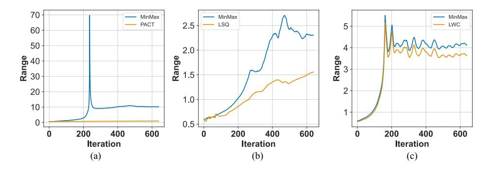

# A5 PERFORMANCE ANALYSIS

In this section, we investigate the internal mechanism of learnable weight clipping and learnable equivalent transformation respectively. Further, we show that with OmniQuant, 3-bit and 4-bit achieve similar trade-off between model bits and perplexity.

Learnable weight clipping. In addition to perplexity and accuracy, the quality of a quantization method can intuitively be evaluated by calculating the distance between quantized models and their

Table A13: l1 distance between quantized model and full-precision model. ||W−Wq|| indicates the average l1 distance between quantized weight and full-precision weight. ||X − Xq|| denotes the l1 distance between the output of last transformer block.

| LLaMA-7B / l1 ↓ | W − Wq  |        | X − Xq  |        |  |  |
|--------------------|---------|--------|---------|--------|--|--|
| quantization       | w/o LWC | w/ LWC | w/o LWC | w/ LWC |  |  |
| W2A16g128          | 0.0089  | 0.0082 | 3.24    | 1.36   |  |  |
| W2A16g64           | 0.0098  | 0.0086 | 3.51    | 1.44   |  |  |
| W3A16              | 0.0062  | 0.0044 | 2.80    | 1.05   |  |  |
| W3A16g128          | 0.0042  | 0.0040 | 1.37    | 0.79   |  |  |
| W4A16              | 0.0028  | 0.0024 | 0.98    | 0.61   |  |  |
| W4A16g128          | 0.0020  | 0.0019 | 0.68    | 0.47   |  |  |

Figure A1: Visualization of learned clipping scale in different quantization settings in LLaMA-7B.

full-precision counterparts. This is demonstrated in Table [A13,](#page-17-0) where we detail the l1 distance of weights and activations for LLaMA-7B's weight-only quantization. We can observe that the proposed Learned Weight Clipping (LWC) substantially decreases the l1 distance for both weights and activations. It's noteworthy that, in certain instances, the l1 distance for quantized models without LWC is similar to that of those utilizing LWC. However, models incorporating LWC exhibit markedly lower activation l1 distances. This observation underpins the argument that LWC can effectively balance quantization precision between outlier and regular values.

Additionally, we illustrate the distribution of the learned clipping scale (γ and β) as delineated in Eq. [\(2\)](#page-4-3) in Figure [A1.](#page-1-0) It is apparent that LWC can learn different clippings for diverse quantization configurations. For instance, with per-channel weight quantization W3A16 as depicted in Figure [A1\(](#page-1-0)a), the learned clipping scale showcases a normal distribution. This suggests that approximately half of the outliers are being clipped. In the case of group-wise quantization, the learned clipping scale exhibits a long-tailed distribution, implying that most quantized groups are associated with minimal clipping. Note that lower bits exhibit more pronounced clipping. For example, W2A16g128 possesses a 50% clipping scale larger than 0.95, whereas, in W3A16g128, this percentage rises to 70%.

Learnable equivalent transformation. Figure [A2](#page-2-0) provides visualizations of the intermediate activation in the linear layer. It is apparent that several outlier channels in the original activation (Figure [A2\(](#page-2-0)a)) possess significantly larger magnitudes compared to the regular channels, thereby creating an incompatibility with activation quantization. Although SmoothQuant mitigates this issue to some degree, such as reducing the outlier magnitude from 70 to 2, Figure [A2\(](#page-2-0)b) reveals that the magnitude of outlier channels still remains notably larger than that of other regular channels after SmoothQuant. This phenomenon can be attributed to SmoothQuant's heuristic approach in deriving channel-wise scaling, which inevitably makes it challenging to discover an optimal solution. The impact of the proposed LET is depicted in Figure [A2\(](#page-2-0)c). It is noteworthy that the magnitude disparity between the outlier and regular channels is markedly diminished. This homogenization of the activation distribution, facilitated by the LET, empowers OmniQuant to efficiently steer the weight-activation quantization towards a low-bit scheme.

Quantization error. OmniQuant is the first differentiable post-training quantization algorithm for large language models. To demonstrate the advantage of gradient-based optimization, we also com-

Figure A2: Visualization of activation of a linear layer in OPT-13B. (a) Original activation. (b) Activation after SmoothQuant. (c) Activation after proposed learnable equivalent transformation. Similar phenomena can be observed in different layer and different models.

Figure A3: Block-wise quantization error. Grid-searched methods such as AWQ [\(Lin et al.,](#page-10-4) [2023\)](#page-10-4) and Outlier Suppression + [\(Wei et al.,](#page-11-9) [2023\)](#page-11-9) produce a more significant error than our gradient-based optimization method.

pare the quantization error of each block in Figure [A3.](#page-3-1) We can find that OmniQuant significantly reduces the quantization loss compared with the grid-searching based method such as AWQ [Lin](#page-10-4) [et al.](#page-10-4) [\(2023\)](#page-10-4) and Outlier Suppression + [\(Wei et al.,](#page-11-9) [2023\)](#page-11-9).

Figure A4: Bit-level scaling laws for perplexity.

Scaling laws. Quantization serves as a potent strategy to curtail the total model bits, thereby facilitating the deployment of LLMs on edge or consumer devices with restricted memory. However, the total model bits are contingent on both the number of parameters within the original model and the quantization bits. Therefore, given a model bits constraint, the challenge arises: how does one optimally determine the number of parameters for the full-precision model and the quantization bits? Tim Dettmers [\(Dettmers & Zettlemoyer](#page-9-14) [\(2023\)](#page-9-14)) demonstrated that 4-bit quantization establishes a universally optimal balance between the total model bits and zero-shot accuracy. Nonetheless, in this study, as shown in Figure [A4,](#page-8-1)we would like to claim that OmniQuant can make 3-bit quantization achieve comparable performance like 4-bit quantization in the trade off between model bits and perplexity.

Table A14: WikiText2 perplexity of clipping-based quantization methods. For fair comparison, we reproduce LSQ and PACT by replace LWC in our pipeline with them.

| LLaMA-7B/PPL↓             | Perplexity |       |  |  |  |
|---------------------------|------------|-------|--|--|--|
| Method                    | W3A16      | W4A4  |  |  |  |
| FP                        | 5.68       |       |  |  |  |
| MinMax                    | 25.73      | 14.49 |  |  |  |
| PACT (Choi et al. (2018)) | 6.95       | 18.25 |  |  |  |
| LSQ (Esser et al. (2019)) | 6.63       | 15.03 |  |  |  |
| LWC (Ours)                | 6.47       | 11.26 |  |  |  |

Figure A5: Weights range changing of different clipping-based methods during training. We plot the changing of weights range (maximum minus minimum) of the 3049-th output channel of the q-proj linear layer in the first LLaMa-1-7B block with W4A4 quantization. MinMax is the baseline which indicate withoud clipping. Similar phenomena can also be observed in other channels and other layers.

