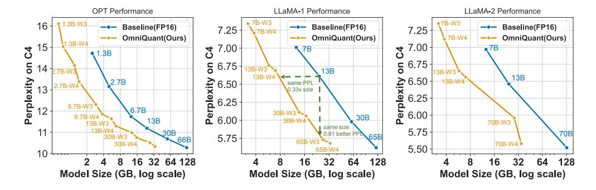

# A8 FULL RESULTS

In this section, we provide a comprehensive presentation of our results across various datasets to complement the main paper. Specifically, the results include:

- The perform overview (Figure [A6\)](#page-21-0).
- Experiments results on extreme large model Falcon-180B (Table [A18\)](#page-22-1).
- MMLU results on LLaMa-1-7B (Table [A16\)](#page-21-1).
- Asymmetric bits quantization, including W4A8 on LLaMa-1-7B, W4A6, and W8A4. (Table [A17\)](#page-21-2).
- C4 perplexity with weight-only quantization in the LLaMA families (Table [A19\)](#page-22-0).

- PTB perplexity with weight-only quantization in OPT families (Table [A21\)](#page-23-0).
- C4 perplexity with weight-only quantization in OPT families (Table [A22\)](#page-24-3).
- WikiText2 perplexity for weight-activation quantization in the LLaMA families (Table [A23\)](#page-24-0).
- C4 perplexity for weight-activation quantization in the LLaMA families (Table [A24\)](#page-24-1).
- WikiText2/PTB/C4 perplexity for weight-activation quantization in the LLaMA families (Table [A25\)](#page-24-2).

Figure A6: Performance overview. We display the trade-off curves for three model families. Each model showcases two quantization variants: W4A16g128 and W3A16g128. It is evident that Omni-Quant markedly enhances the trade-off between perplexity and model size. Specifically, OmniQuant delivers a reduction of 0.81 in perplexity for an equivalent model size and achieves the same perplexity with only 0.33x of the model size.

Table A16: Average MMLU accuracy of LLaMa-7B.

| LLaMa-1-7B (FP: 38.41%) | W4A16g128 | W3A16g128 | W2A16g128 | W4A4  |
|-------------------------|-----------|-----------|-----------|-------|
| RTN                     | 37.37%    | 33.43%    | 22.55%    | 23.31 |
| GPTQ                    | 35.39%    | 30.53%    | 23.83%    | -     |
| AWQ                     | 37.71%    | 35.43%    | 22.58%    | -     |
| OP+                     | -         | -         | -         | 25.72 |
| OmniQuant               | 37.50%    | 35.60%    | 26.03%    | 26.93 |

Table A17: Performance of weights and activations quantization on LLaMA-1-7B model with asymmetric bits.

| #Bits | Method    |           | PPL ↓ |       |       |       |       | Accuracy (%) ↑ |           |            |       |
|-------|-----------|-----------|-------|-------|-------|-------|-------|----------------|-----------|------------|-------|
|       |           | WikiText2 | C4    | Avg.  | PIQA  | ARC-e | ARC-c | BoolQ          | HellaSwag | Winogrande | Avg.  |
| FP16  | -         | 5.68      | 7.08  | 6.38  | 77.47 | 52.48 | 41.46 | 73.08          | 73.00     | 67.07      | 64.09 |
| W4A8  | OmniQuant | 5.87      | 7.34  | 6.60  | 77.36 | 51.85 | 38.65 | 70.67          | 71.20     | 64.71      | 62.40 |
| W4A6  | OmniQuant | 6.09      | 7.63  | 6.85  | 75.73 | 51.51 | 38.31 | 68.28          | 70.79     | 65.27      | 61.64 |
| W8A4  | OmniQuant | 10.27     | 12.77 | 11.52 | 69.47 | 45.87 | 32.84 | 59.08          | 58.66     | 54.85      | 53.46 |

Table A18: Weight-only quantization on Falcon-180B.

|          | PPL         | ļ      |             |           |       | Acc   | <b>†</b> |       |       |           |            |
|----------|-------------|--------|-------------|-----------|-------|-------|----------|-------|-------|-----------|------------|
| Method   | Bit#        | Memory | Devices     | Wiki PTI  | 3 C4  | PIQA  | ARC-e    | Arc-c | BoolQ | HellaSwag | Winogrande |
| -        | BF16/FP16   | 335GB  | 5xA100 80GB | 3.29 6.64 | 16.31 | 84.82 | 84.20    | 60.83 | 86.85 | 85.91     | 80.58      |
| RTN      | W3A16g512   | 65GB   | 1xA100 80GB | 5.33 8.08 | 8.34  | 83.48 | 80.85    | 55.46 | 78.37 | 81.05     | 77.97      |
| OmniQuan | t W3A16g512 | 65GB   | 1xA100 80GB | 3.71 6.95 | 6.71  | 84.71 | 82.91    | 60.92 | 84.03 | 84.96     | 79.40      |

Table A19: C4 perplexity of Weight-only quantization results in LLaMA-1 and LLaMA-2 mod-

els Continue of Table LLaMA1&2 / PPL 1-7B 1-13B 1-30B 1-65B 2-7B 2-13B 2-70B FP16 7.08 5.52 6.61 5.98 5.62 6.46 RTN 1.3e5 5.6e4 2.7e4 2.2e4 4.8e4 7.2e4 2.4e4 W2A16 **GPTQ** 689.13 2.5e3 169.80 40.58 NAN 323.12 48.82 90.64 **OmniQuant** 24.89 18.31 13.89 10.77 26.76 12.28 RTN 1.0e3 447.64 99.45 17.15 4.9e3 139.65 42.13 W2A16 **GPTQ** 27.71 15.29 11.99 33.70 11.93 20.97 NAN g128 AWQ 1.9e5 2.3e5 2.4e5 7.5e4 1.7e5 9.4e4 **OmniQuant** 12.97 10.36 9.36 8.00 15.02 11.05 8.52 30.07 11.34 RTN 151.43 76.00 475.35 28.69 13.43 W2A16 9.92 12.48 **GPTQ** 17.71 11.70 10.07 19.40 NAN g64 **AWQ** 2.8e5 2.2e5 7.4e4 9.5e4 2.3e5 1.6e5 **OmniQuant** 7.88 11.78 9.75 8.65 7.60 12.72 10.05 RTN 28.26 13.22 28.66 12.79 402.35 12.51 10.02 **GPTQ** 9.49 7.29 9.81 6.57 8.16 6.71 8.02 W3A16 AWO 13.26 9.13 12.67 7.11 23.85 13.07 **OmniQuant** 6.57 6.07 7.44 6.06 8.19 7.32 8.65 RTN 8.62 7.49 6.58 6.10 8.40 7.18 6.02 W3A16 **GPTQ** 7.85 7.10 6.47 6.00 7.89 7.00 5.85 g128 AWQ 7.92 6.37 5.94 6.94 7.07 7.84 7.75 **OmniQuant** 7.05 6.37 5.93 7.75 6.98 5.85 RTN 7.93 6.98 6.34 5.85 7.71 6.83 5.79 **GPTO** 7.43 6.84 6.20 5.80 7.37 6.70 5.67 W4A16 **AWQ** 7.52 6.86 6.17 5.77 7.68 6.74 **OmniQuant** 7.34 6.76 6.11 5.73 7.35 6.65 5.65 7.37 7.24 5.63 RTN 5.69 6.58 6.69 6.06 W4A16 **GPTQ** 7.21 6.69 6.06 5.69 7.12 6.56 5.58 g128 AWO 7.21 6.70 6.05 5.68 7.13 6.56 **OmniQuant** 7.21 6.69 6.06 5.68 7.12 6.56 5.58

Table A20: WikiText2 perplexity of Weight-only quantization results in OPT models.

| OPT / PPL↓ |           | 125M   | 1.3B   | 2.7B   | 6.7B  | 13B   | 30B   | 66B     |
|------------|-----------|--------|--------|--------|-------|-------|-------|---------|
| FP16       | -         | 27.65  | 14.63  | 12.47  | 10.86 | 10.12 | 9.56  | 9.34    |
|            | RTN       | 7.2e3  | 1.3e4  | 5.7e4  | 7.8e3 | 7.6e4 | 1.3e4 | 3.6e5   |
| W2A16      | GPTQ      | 597.66 | 115.16 | 61.59  | 20.18 | 21.36 | 12.71 | 82.10   |
| g128       | AWQ       | 251.84 | 47.97  | 28.50  | 16.20 | 14.32 | 12.31 | 14.54   |
|            | OmniQuant | 75.43  | 23.95  | 18.13  | 14.43 | 12.94 | 11.39 | 30.84   |
|            | RTN       | 7.0e3  | 1.0e4  | 19.3e4 | 7.6e3 | 1.8e4 | 8.2e3 | 1.1e4   |
| W2A16      | GPTQ      | 204.40 | 49.58  | 29.37  | 16.81 | 16.65 | 11.87 | 356.01  |
| g64        | AWQ       | 124.18 | 29.78  | 20.64  | 14.63 | 13.28 | 11.59 | 12.74   |
|            | OmniQuant | 62.56  | 21.40  | 16.76  | 13.57 | 12.33 | 11.00 | 10.59   |
|            | RTN       | 1.2e3  | 1.3e4  | 1.6e4  | 6.5e3 | 4.6e3 | 1.5e3 | 6.1 e3  |
|            | GPTQ      | 53.05  | 21.17  | 16.83  | 15.09 | 11.73 | 10.30 | 14.42   |
| W3A16      | AWQ       | 69.43  | 28.01  | 263.10 | 15.13 | 20.09 | 35.74 | 4.5e3   |
|            | OmniQuant | 35.66  | 16.68  | 13.80  | 11.65 | 10.87 | 10.00 | 9.83    |
|            | RTN       | 51.22  | 119.00 | 297.98 | 23.54 | 46.03 | 18.80 | 136.89w |
| W3A16      | GPTQ      | 39.24  | 16.47  | 13.69  | 11.65 | 10.35 | 9.73  | 10.96   |
| g128       | AWQ       | 36.74  | 16.32  | 13.58  | 11.41 | 10.68 | 9.85  | 9.60    |
|            | OmniQuant | 32.25  | 15.72  | 13.18  | 11.27 | 10.47 | 9.79  | 9.53    |
|            | RTN       | 37.28  | 48.17  | 16.92  | 12.10 | 11.32 | 10.97 | 110     |
|            | GPTQ      | 31.43  | 15.56  | 12.82  | 11.41 | 10.31 | 9.63  | 9.55    |
| W4A16      | AWQ       | 32.28  | 15.49  | 12.93  | 11.30 | 10.39 | 9.77  | 9.61    |
|            | OmniQuant | 29.45  | 15.04  | 12.76  | 11.03 | 10.30 | 9.65  | 9.65    |
|            | RTN       | 30.47  | 15.29  | 13.02  | 11.15 | 10.30 | 9.94  | 9.65    |
| W4A16      | GPTQ      | 29.81  | 14.89  | 12.52  | 10.93 | 10.17 | 9.58  | 9.34    |
| g128       | AWQ       | 29.15  | 14.94  | 12.74  | 10.93 | 10.21 | 9.59  | 9.40    |
|            | OmniQuant | 28.86  | 14.88  | 12.65  | 10.96 | 10.20 | 9.62  | 9.37    |

Table A21: PTB perplexity of Weight-only quantization results in OPT models.

| OPT / PPL↓ |                  | 125M           | 1.3B           | 2.7B           | 6.7B           | 13B            | 30B            | 66B            |
|------------|------------------|----------------|----------------|----------------|----------------|----------------|----------------|----------------|
| FP16       | -                | 32.54          | 16.96          | 15.11          | 13.08          | 12.33          | 11.84          | 11.36          |
|            | RTN              | 4.6e3          | 7.1e3          | 2.5e4          | 5.7e3          | 3.0e4          | 6.2e3          | 1.4e5          |
| W2A16      | GPTQ             | 655.17         | 130.88         | 61.36          | 25.24          | 20.46          | 15.15          | 323.23         |
| g128       | AWQ              | 263.88         | 71.87          | 43.15          | 19.49          | 17.61          | 14.92          | 19.33          |
|            | OmniQuant        | 126.49         | 34.33          | 25.28          | 18.92          | 16.74          | 14.51          | 139.17         |
|            | RTN              | 5.1e3          | 9.4e3          | 7.7e4          | 6.1e3          | 8.2e3          | 4.1e3          | 6.2e3          |
| W2A16      | GPTQ             | 245.28         | 55.61          | 36.12          | 19.45          | 17.02          | 14.05          | 88.92          |
| g64        | AWQ              | 143.18         | 41.19          | 25.08          | 18.00          | 15.83          | 14.92          | 15.72          |
|            | OmniQuant        | 112.10         | 30.36          | 22.63          | 17.58          | 15.70          | 13.98          | 13.51          |
|            | RTN              | 1.2e3          | 1.1e4          | 1.0e4          | 5.2e3          | 3.6e3          | 1.4e3          | 3.6e3          |
|            | GPTQ             | 34.05          | 27.39          | 15.94          | 13.75          | 13.71          | 12.54          | 21.16          |
| W3A16      | AWQ              | 80.73          | 33.20          | 224.11         | 18.46          | 35.45          | 66.68          | 3.4e3          |
|            | OmniQuant        | 45.29          | 20.42          | 17.08          | 14.23          | 13.49          | 12.54          | 12.06          |
|            | RTN              | 64.67          | 222.13         | 337.75         | 39.90          | 65.33          | 34.27          | 309.69         |
| W3A16      | GPTQ             | 45.17          | 19.90          | 17.06          | 14.24          | 12.84          | 12.54          | 13.27          |
|            |                  |                |                |                |                |                |                |                |
| g128       |                  |                |                |                |                |                |                |                |
|            | AWQ OmniQuant | 44.07 40.76 | 19.59 19.06 | 16.52 16.29 | 13.98 13.77 | 12.87 12.96 | 66.68 12.19 | 3.4e3 11.71 |
|            |                  |                |                |                |                |                |                |                |
|            | RTN              | 44.98          | 33.63          | 22.23          | 16.05          | 15.40          | 14.17          | 274.23         |
| W4A16      | GPTQ             | 37.75          | 18.23          | 15.94          | 13.75          | 12.58          | 11.98          | 11.58          |
|            | AWQ OmniQuant | 38.74 34.94 | 18.35 17.80 | 15.70 15.52 | 13.59 13.41 | 12.72 12.62 | 12.06 11.95 | 11.58 11.86 |
|            | RTN              | 36.50          | 33.63          | 22.23          | 16.05          | 15.40          | 14.17          | 11.79          |
| W4A16      | GPTQ             | 35.48          | 17.41          | 15.42          | 13.21          | 12.42          | 11.89          | 11.51          |
| g128       | AWQ              | 34.95          | 17.46          | 15.33          | 13.28          | 12.46          | 11.90          | 11.43          |

| Table A22: <b>C4</b> | nernlevity o  | of Weight-anly | auantization | results in OP | T models    |
|----------------------|---------------|----------------|--------------|---------------|-------------|
| 1401C A22. CT        | pei pienity u | n vveight-umy  | quantization | results in Or | i ilioucis. |

|         | <b>OPT / PPL</b> ↓ 125M 1.3B 2.7B 6.7B 13B 30B 660 |        |        |        |       |       |       |        |
|---------|----------------------------------------------------|--------|--------|--------|-------|-------|-------|--------|
|         |                                                    | 125M   |        |        |       |       |       | 66B    |
| FP16    | -                                                  | 24.60  | 14.72  | 13.16  | 11.74 | 11.19 | 10.69 | 10.28  |
|         | RTN                                                | 5.0e3  | 7.7e3  | 3.8e4  | 5.2e3 | 2.8e4 | 6.5e3 | 2.6e5  |
| W2A16   | GPTQ                                               | 597.66 | 60.88  | 33.83  | 18.55 | 16.34 | 12.89 | 598.81 |
| g128    | AWQ                                                | 168.35 | 38.38  | 26.41  | 16.48 | 14.73 | 12.98 | 15.42  |
|         | OmniQuant                                          | 80.10  | 27.33  | 21.11  | 16.67 | 14.92 | 13.12 | 73.83  |
|         | RTN                                                | 3.9e3  | 7.3e3  | 1.2e5  | 6.3e3 | 7.5e3 | 4.0e3 | 8.4e3  |
| W2A16   | GPTQ                                               | 133.51 | 31.31  | 23.23  | 16.24 | 14.48 | 12.24 | 58.60  |
| g64     | AWQ                                                | 90.19  | 27.34  | 20.01  | 15.20 | 13.90 | 12.43 | 13.31  |
|         | OmniQuant                                          | 64.01  | 23.71  | 19.16  | 15.44 | 14.16 | 12.80 | 12.13  |
|         | RTN                                                | 722.83 | 6.1e3  | 1.2e4  | 5.8e3 | 3.3e3 | 1.4e3 | 3.6e3  |
| W2 4 16 | GPTQ                                               | 37.75  | 19.45  | 13.75  | 15.67 | 12.28 | 11.34 | 13.68  |
| W3A16   | AWQ                                                | 55.73  | 24.56  | 154.49 | 15.84 | 23.71 | 55.01 | 3.8e3  |
|         | OmniQuant                                          | 32.17  | 17.10  | 14.93  | 12.78 | 12.13 | 11.37 | 10.82  |
|         | RTN                                                | 40.13  | 126.47 | 372.23 | 32.56 | 44.12 | 25.70 | 286.87 |
| W3A16   | GPTQ                                               | 30.08  | 16.47  | 14.54  | 12.48 | 11.58 | 10.91 | 11.35  |
| g128    | AWQ                                                | 30.39  | 16.27  | 14.19  | 12.30 | 11.61 | 10.96 | 10.53  |
|         | OmniQuant                                          | 29.34  | 16.11  | 14.15  | 12.31 | 11.63 | 10.98 | 10.51  |
|         | RTN                                                | 31.58  | 24.68  | 17.61  | 13.38 | 12.35 | 11.90 | 249.54 |
| W4A16   | GPTQ                                               | 27.12  | 15.57  | 13.75  | 12.15 | 11.36 | 10.80 | 10.50  |
|         | AWQ                                                | 27.64  | 15.65  | 13.71  | 12.04 | 11.42 | 10.83 | 10.41  |
|         | OmniQuant                                          | 26.36  | 15.28  | 13.58  | 11.97 | 11.41 | 10.80 | 10.63  |
|         | RTN                                                | 26.79  | 15.71  | 13.79  | 12.31 | 11.51 | 10.94 | 10.54  |
| W4A16   | GPTQ                                               | 25.96  | 15.05  | 13.40  | 11.87 | 11.26 | 10.74 | 10.37  |
| g128    | AWQ                                                | 25.90  | 15.04  | 13.39  | 11.87 | 11.28 | 10.75 | 10.34  |
|         | OmniQuant                                          | 25.63  | 15.03  | 13.38  | 11.85 | 11.29 | 10.75 | 10.33  |

Table A23: WikiText2 perplexity of weight-activation quantization results in LLaMA-1 and

LLaMA-2 models Continue of Table 2.

| LLaMA  | LLaMA1&2 / PPL↓ |       | 1-13B | 1-30B  | 1-65B  | 2-7B  | 2-13B |
|--------|-----------------|-------|-------|--------|--------|-------|-------|
| FP16   | -               | 5.68  | 5.09  | 4.10   | 3.53   | 5.47  | 4.88  |
| W6A6   | SmoothQuant     | 6.03  | 5.42  | 4.55   | 3.88   | 6.20  | 5.18  |
| WOAO   | OmniQuant       | 5.96  | 5.28  | 4.38   | 3.75   | 5.87  | 5.14  |
| W4A4   | SmoothQuant     | 25.25 | 40.05 | 192.40 | 275.53 | 83.12 | 35.88 |
| vv +A4 | OmniQuant       | 11.26 | 10.87 | 10.33  | 9.17   | 14.26 | 12.30 |

Table A24: C4 perplexity of weight-activation quantization results in LLaMA-1 and LLaMA-2 models. Continue of Table 2.

| LLaMA1&2 / PPL↓ |             | 1-7B  | 1-13B | 1-30B  | 1-65B  | 2-7B  | 2-13B |
|-----------------|-------------|-------|-------|--------|--------|-------|-------|
| FP16            | -           | 7.08  | 6.61  | 5.98   | 5.62   | 6.97  | 6.46  |
| W6A6            | SmoothQuant | 7.47  | 6.97  | 6.34   | 5.99   | 7.76  | 6,76  |
| WOAO            | OmniQuant   | 7.43  | 6.84  | 6.22   | 5.82   | 7.48  | 6.74  |
| W4A4            | SmoothQuant | 32.32 | 47.18 | 122.38 | 244.35 | 77.27 | 43.19 |
|                 | OmniQuant   | 14.51 | 13.78 | 12.49  | 11.28  | 18.02 | 14.55 |

Table A25: **Weight-activation quantization results of OPT Models.** We report perplexity on three datasets: WikiText2 (WIKI), Pen Treebank (PT), and C4. RPTQ indicates the data from RPTQ (Yuan et al. (2023)) paper, which keeps the output of LN and SoftMax as 8-bit. RPTQ\* represents reproducing RPTQ with our setting that quantizes all activation into low-bit except keeping the softmax output at full precision.

| OPT / PPL↓ |             | (     | OPT-6.7b |       | OPT-13b |       |       | OPT-30b |       |       | OPT-66b |       |       |
|------------|-------------|-------|----------|-------|---------|-------|-------|---------|-------|-------|---------|-------|-------|
| Task       |             | WIKI  | PT       | C4    | WIKI    | PT    | C4    | WIKI    | PT    | C4    | WIKI    | PT    | C4    |
| FP16       | -           | 10.86 | 13.09    | 11.74 | 10.13   | 12.34 | 11.20 | 9.56    | 11.84 | 10.69 | 9.34    | 11.36 | 10.28 |
| W6A6       | SmoothQuant | 11.34 | 13.82    | 12.14 | 10.56   | 12.76 | 11.40 | 9.67    | 12.01 | 10.81 | 10.72   | 13.25 | 11.60 |
|            | RPTQ        | 11.19 | 13.98    | 12.08 | 11.00   | 15.23 | 11.68 | 10.22   | 14.95 | 11.73 | 9.45    | 13.03 | 10.62 |
|            | RPTQ*       | 10.96 | 13.24    | 11.86 | 10.25   | 12.60 | 11.31 | 9.60    | 12.23 | 10.83 | 9.48    | 12.61 | 10.39 |
|            | OmniQuant   | 10.96 | 13.20    | 11.81 | 10.21   | 12.47 | 11.27 | 9.62    | 11.92 | 10.76 | 9.42    | 11.42 | 10.32 |
| W4A4       | SmoothQuant | 1.8e4 | 1.4e4    | 1.5e4 | 7.4e3   | 6.5e3 | 5.6e3 | 1.2e4   | 7.8e3 | 8.3e3 | 2.2e5   | 1.0e5 | 1.8e5 |
|            | RPTQ        | 12.00 | 15.17    | 12.85 | 12.74   | 15.76 | 14.71 | 11.15   | 14.11 | 13.48 | 12.23   | 18.87 | 15.93 |
|            | RPTQ*       | 17.83 | 25.10    | 19.91 | 16.45   | 23.01 | 16.80 | 11.50   | 14.87 | 12.81 | 11.16   | 13.73 | 11.78 |
|            | OmniQuant   | 12.24 | 15.54    | 13.56 | 11.65   | 15.89 | 13.46 | 10.60   | 13.75 | 11.89 | 10.29   | 13.19 | 11.35 |