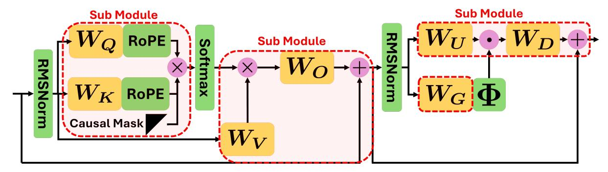

# 4.3 QEP as a Single LPCD Update

This section shows that a single iteration of LPCD corresponds to both QEP and LoaQ. For brevity, we explicitly demonstrate that QEP corresponds to one LPCD iteration; an analogous argument can be used to prove the LoaQ case. To relate to QEP, we consider a two-block instance of the general formulation with the block variables  $M_1 = \widehat{W} \in \mathbb{R}^{N \times M}$  and  $M_2 = \widehat{X} \in \mathbb{R}^{T \times N}$ . The global objective is given by

$$L(\widehat{W}, \widehat{X}) = \|\widehat{X}\widehat{W} - XW\|_F^2. \tag{7}$$

In this case, the following proposition holds:

**Proposition 4.1.** Consider the objective defined in Eq. (7) with blocks  $M_1 = \widehat{W}$  and  $M_2 = \widehat{X}$ . Fix the activation block  $\widehat{X}$  and perform a single LPCD update on the weight block  $\widehat{W}$ . Let  $\widehat{W}^{(1)}$  denote the value of the weight block following this single LPCD update. Then  $\widehat{W}^{\text{QEP}} = \widehat{W}^{(1)}$ .

*Proof.* The LPCD update of the weight block  $M_1 = \widehat{W}$  consists of two steps:

**Relaxation Step.** Fix  $\widehat{X}$ . In the first outer iteration, the objective for  $\widehat{W}$  takes the following form:

$$L_1^{(1)}(U) = \|\widehat{X}^{(0)}U - XW\|_F^2,$$

where  $\widehat{X}^{(0)} = \widehat{X}$ . Assume that  $\widehat{H}$  is invertible. The optimality condition leads to the following minimizer:

$$\overline{W}^{(1)} = \operatorname*{argmin}_{U} L_1^{(1)}(U) = (I_N + \widehat{H}^{-1}C)W.$$

**Projection Step.** For a weight block, LPCD employs a layer-wise PTQ projection using either the direct or activation-aware projection,  $\Pi^{(d)}_{\mathbb{Q}}$  or  $\Pi^{(a)}_{\mathbb{Q}}$ , as defined in Section 3. In the QEP setting, the activation-aware projector  $\Pi^{(a)}_{\mathbb{Q}}$  is employed. The projection step, therefore, reads

$$\widehat{W}^{(1)} = \Pi_{\mathbb{Q}}^{(a)} \left( \overline{W}^{(1)} \right) = \Pi_{\mathbb{Q}}^{(a)} \left( (I_N + \widehat{H}^{-1}C)W \right). \tag{8}$$

Figure 2: Conceptual diagram of the submodules considered in this work using LPCD; the regions enclosed by the red dashed boxes correspond to submodules.

Finally, note that the QEP solution  $\widehat{W}^{\text{QEP}}$  from Eq. (3) satisfies

$$\begin{split} \widehat{W}^{\text{QEP}} &= \underset{\widehat{W}}{\operatorname{argmin}} \, \| \widehat{X} \widehat{W} - XW \|_F^2 \\ &= \underset{\widehat{W}}{\operatorname{argmin}} \, \| \widehat{X} \big( \widehat{W} - \overline{W}^{(1)} \big) \|_F^2. \end{split}$$

By definition of  $\Pi^{(a)}_{\mathbb{Q}}$ , the right-hand side coincides with the projection in Eq. (8). Therefore,  $\widehat{W}^{\text{QEP}} = \widehat{W}^{(1)}$  as stated.

**Remark 4.2.** An analogous argument demonstrates that LoaQ can also be interpreted as a single LPCD update for a suitably extended objective. For example, by considering

$$L(\widehat{W}, \widehat{X}, \widehat{R}) = \|(\widehat{R} + \widehat{X}\widehat{W}) - (R + XW)\|_F^2,$$

the same relaxation-projection decomposition yields  $\widehat{W}^{LoaQ} = \widehat{W}^{(1)}$ , with  $\widehat{W}^{(1)}$  computed by LPCD on this augmented submodule.

Moreover, LPCD allows us to extend single-step algorithms that compensate for quantization error, such as QEP, to various settings. Specifically, the extension of QEP to activation quantization is described in Appendix B.1; its extension to KV-cache quantization is outlined in Appendix B.2; and its extension to preprocessing using rotation matrices is detailed in Appendix B.3. All these algorithms can be implemented within a layer-wise PTQ framework, significantly reducing memory costs during quantization while minimizing quantization error. Furthermore, both the QEP, viewed as a single-step method, and its extensions are expected to achieve higher performance by increasing the number of iterations in the alternating optimization process.

## 4.4 Submodule PTQ

In this study, we apply LPCD to several submodules for which the relaxation step provides a closed-form solution. Although closed-form expressions exist, some of these problems are memory-inefficient to solve exactly; therefore, so we approximate the relaxation step in practice; see Appendix A.1. A conceptual diagram of this procedure is presented in Figure 2. In the following, we briefly describe how the proposed method is applied to each submodule. Note that the proposed method can also be applied to submodules with nonlinear transformations by approximating the minimization; a more exhaustive study of such applications is left for future work.

**QK Module.** We consider a setting in which grouped-query attention is quantized at the level of its QK submodule. Specifically, a single key and value are shared within each group of *G* heads. The objective of the QK module is expressed as

$$L(\hat{W}_{Q}, \hat{W}_{K}) = \sum_{h \in [H]} \|M \odot (\widehat{S}^{(h)} - S^{(h)})\|_{F}^{2}$$
$$\widehat{S}^{(h)} = \mathcal{R}(\widehat{X}\widehat{W}_{Q}^{(h)})\mathcal{R}(\widehat{X}\widehat{W}_{K}^{(g)})^{\top},$$
$$S^{(h)} = R(XW_{Q}^{(h)})R(XW_{K}^{(g)})^{\top}.$$

where  $g=\lfloor h-1/G\rfloor$  and  $M\in\{0,1\}^{T\times T}$  are binary upper-triangular matrices that represent the causal mask. The operator  $\mathcal{R}(\cdot)$  denotes rotary positional encoding (RoPE). When either  $\widehat{W}_Q$  or  $\widehat{W}_K$  is fixed, the objective reduces to a linear least-squares formulation, analogous to QEP. The detailed update rule for the relaxation step is provided in Appendix A.1.1

**VO Module.** Next, we consider the submodule that aggregates the attention scores  $S^{(h)} = \operatorname{Softmax}(S^{(h)})$  obtained by applying the softmax function after the KV module, and we quantize this component. Specifically, the objective can be

| Table 1: Perplexity (↓) on WikiText-2 for LLaMA and Qwen models across different bit-widths and quantization |
|--------------------------------------------------------------------------------------------------------------|
| methods.                                                                                                     |

| Bits | Method |      | LLaMA2-7B | LLaMA2-13B | LLaMA3-8B | Qwen3-8B | Qwen3-14B |
|------|--------|------|-----------|------------|-----------|----------|-----------|
| FP16 | -      | -    | 4.8653    | 4.3560     | 5.4971    | 8.5980   | 7.5960    |
| 4bit | RTN    | QEP  | 5.2303    | 4.5432     | 6.9551    | 11.0644  | 12.7807   |
|      |        | LoaQ | 5.3286    | 4.4831     | 6.1800    | 10.7548  | 8.5981    |
|      |        | Ours | 5.2961    | 4.5237     | 7.4465    | 9.3566   | 8.1412    |
|      | GPTQ   | QEP  | 5.0954    | 4.4875     | 6.3459    | 10.9824  | 12.2558   |
|      |        | LoaQ | 5.1399    | 4.4630     | 6.2109    | 9.9321   | 8.2968    |
|      |        | Ours | 5.0495    | 4.4900     | 6.3818    | 9.1233   | 7.9668    |
| 3bit | RTN    | QEP  | 21.0619   | 6.3838     | 25.3924   | 22.5769  | 18.1640   |
|      |        | LoaQ | 8.9140    | 5.4920     | 14.1467   | >1e3     | 12.1034   |
|      |        | Ours | 6.5760    | 5.3979     | 9.8112    | 12.7110  | 10.8723   |
|      | GPTQ   | QEP  | 6.3966    | 5.1518     | 11.0124   | 15.0779  | 14.2997   |
|      |        | LoaQ | 6.8494    | 4.9777     | 9.0706    | 11.7249  | 10.8154   |
|      |        | Ours | 5.8990    | 5.0785     | 8.7971    | 11.3805  | 9.5815    |
| 2bit | RTN    | QEP  | >1e3      | >1e3       | >1e3      | >1e3     | >1e3      |
|      |        | LoaQ | >1e3      | >1e3       | >1e3      | 375.1837 | 831.7296  |
|      |        | Ours | >1e3      | 552.2888   | >1e3      | 312.4608 | 352.2354  |
|      | GPTQ   | QEP  | 101.1521  | 84.3543    | >1e3      | 165.7484 | 199.1968  |
|      |        | LoaQ | 590.9850  | 24.2423    | 217.8416  | 550.3343 | 43.2624   |
|      |        | Ours | 341.3434  | 26.3311    | 87.5296   | 58.8030  | 46.4656   |

expressed as follows:

$$L(\widehat{W}_V, \widehat{W}_O) = \|\widehat{\Omega} + \widehat{R} - (\Omega + R)\|_F^2,$$
  

$$\widehat{\Omega} = \operatorname{Concat}_{h \in [H]} (\widehat{S}^{(h)}(\widehat{X}\widehat{W}_V^{(g)})) \widehat{W}_O,$$
  

$$\Omega = \operatorname{Concat}_{h \in [H]} (S^{(h)}(XW_V^{(g)})) W_O,$$

where Concath∈[H] denotes concatenation along the head dimension. As in the previous case, the minimization becomes straightforward once either WcV or WcO is fixed. Further details are provided in Appendix [A.1.3.](#page-13-0)

Up-Down Module. After the self-attention block, most Transformer architectures process the representations through an MLP layer. We quantize the Up–Down projection in this MLP as a submodule. The objective function is expressed as

$$L(\widehat{W}_U, \widehat{W}_D) = \|\widehat{F} + \widehat{R} - (F + R)\|_F^2,$$
$$\widehat{F} = \left(\Phi(\widehat{X}\widehat{W}_G) \odot \widehat{X}\widehat{W}_U\right)\widehat{W}_D,$$
$$F = (\Phi(XW_G) \odot XW_U)W_D,$$

where Φ(·) denotes the activation function, and LLaMA employs the SiLU function [\(Touvron et al.,](#page-10-11)

[2023\)](#page-10-11). This work restricts the optimization variables to WU and WD to simplify the minimization process in the relaxation Step. However, LPCD can also be applied by approximately solving the minimization problem concerning WG; investigating the effect of this approach is left for future work. The detailed update rules for this Up-Down submodule are provided in Appendix [A.1.3.](#page-13-0)

