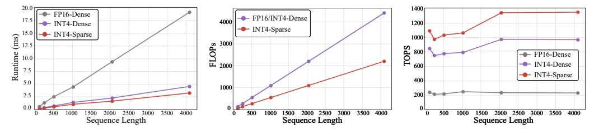
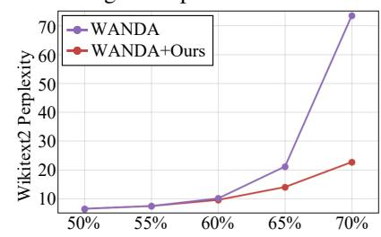
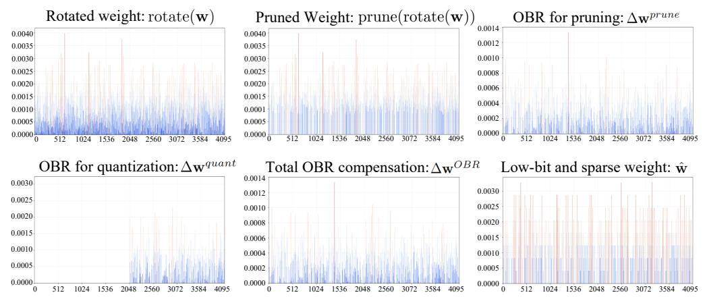

# 5 EXPERIMENTS

Datasets and Models. We evaluate the proposed OBR framework on various open-source LLM families, including Llama2 (7B/13B/70B) (Touvron et al., 2023), Llama3 (8B/70B) (Dubey et al., 2024), and Qwen2.5-Instruct(7B/32B) (QwenTeam, 2024). To comprehensively assess the effectiveness of our method, we conduct experiments on both zero-shot classification and language modeling tasks. For zero-shot evaluation, we report accuracy on commonly used benchmarks including PIQA (Bisk et al., 2020), BoolQ (Clark et al., 2019), HellaSwag (Zellers et al., 2019), ARC-easy (Clark et al., 2018), ARC-challenge (Clark et al., 2018), and WinoGrande (Sakaguchi et al., 2021). In addition, we also follow prior LLM compression works (Sun et al., 2023) and evaluate the perplexity on the WikiText2 test set (Merity et al., 2016).

**Baselines.** We compare our method against a range of competitive baselines under sub-4-bit compression settings. Specifically, the full-precision model is included as an upper bound for reference. We also evaluate against quantization-only baselines (Ashkboos et al., 2024; Liu et al., 2024) under equivalent bit-widths, *e.g.*, a W4A4 model with 50% sparsity is compared to a W3A4 quantized model. In addition, we include a simple baseline that directly combines existing quantization and pruning techniques without any specially designed compensation. Furthermore, following the extension described in (Frantar & Alistarh, 2023), we adopt SparseGPT combined with GPTQ as a strong joint sparsity-quantization baseline for comparison.

https://github.com/NVIDIA/cutlass

Table 1: Comparison of perplexity score on WikiText2 and accuracy on zero-shot common sense reasoning tasks with Llama2(7B/13B/70B) and Llama3(8B/70B) model families. †Since the Llama3-70B is sensitive to quantization as demonstrated in (Ashkboos et al., 2024), we keep the KV cache being 16-bit for acceptable performance. The best and the second best results are in red and blue.

| Model         | Method             | #Bits W-A-KV | Sparsity ratio | PIQA (†) | BoolQ (†) | HellaS. | Arc-e | Arc-c | WinoG. | <b>Avg.</b> (↑) | Wiki2    |
|---------------|--------------------|-----------------|----------------|-------------|--------------|---------|-------|-------|--------|-----------------|----------|
|               | Floating-point     | 16-16-16        | 0%             | 79.11       | 77.71        | 76.02   | 74.49 | 46.33 | 69.14  | 70.47           | 5.47     |
|               | QuaRot(quant-only) | 3-4-4           | 0%             | 51.96       | 39.72        | 29.25   | 31.36 | 23.46 | 52.33  | 38.01           | 132.97   |
| 2-7B          | QuaRot+WANDA       | 4-4-4           | 50%            | 50.27       | 37.83        | 25.81   | 25.00 | 27.73 | 49.25  | 35.98           | 5868.24  |
|               | SparseGPT+GPTO     | 4-4-4           | 50%            | 63.38       | 63.27        | 47.71   | 50.93 | 29.44 | 54.70  | 51.57           | 12.94    |
|               | OBR_RTN            | 4-4-4           | 50%            | 68.77       | 66.39        | 55.46   | 55.98 | 32.17 | 60.22  | 56.49           | 9.23     |
|               | OBR_GPTQ           | 4-4-4           | 50%            | 68.93       | 67.31        | 58.22   | 55.93 | 34.22 | 61.48  | 53.45           | 8.40     |
|               | Floating-point     | 16-16-16        | 0%             | 80.52       | 80.55        | 79.37   | 77.48 | 49.15 | 72.14  | 73.20           | 4.88     |
|               | QuaRot(quant-only) | 3-4-4           | 0%             | 55.01       | 62.26        | 30.00   | 31.10 | 22.44 | 51.07  | 41.98           | 72.53    |
| 2-13B         | QuaRot+WANDA       | 4-4-4           | 50%            | 51.36       | 38.29        | 26.40   | 26.18 | 27.56 | 49.49  | 36.54           | 2289.41  |
| 2-13B         | SparseGPT+GPTQ     | 4-4-4           | 50%            | 71.27       | 70.83        | 60.99   | 61.87 | 36.60 | 62.90  | 60.74           | 7.89     |
|               | OBR_RTN            | 4-4-4           | 50%            | 72.74       | 69.17        | 63.85   | 65.95 | 38.31 | 64.17  | 62.37           | 7.29     |
|               | OBR_GPTQ           | 4-4-4           | 50%            | 72.91       | 71.25        | 64.74   | 65.57 | 37.88 | 63.22  | 62.60           | 7.06     |
| 2-70B         | Floating-point     | 16-16-16        | 0%             | 82.70       | 83.76        | 83.81   | 81.06 | 57.25 | 77.98  | 77.76           | 3.32     |
|               | QuaRot(quant-only) | 3-4-4           | 0%             | 67.74       | 66.27        | 56.55   | 50.67 | 30.63 | 62.43  | 55.72           | 8.19     |
|               | QuaRot+WANDA       | 4-4-4           | 50%            | 51.52       | 38.56        | 27.67   | 27.06 | 23.21 | 50.04  | 36.34           | 169.67   |
| 2-70 <b>D</b> | SparseGPT+GPTQ     | 4-4-4           | 50%            | 79.11       | 76.79        | 77.20   | 77.61 | 51.19 | 73.95  | 72.64           | 4.78     |
|               | OBR_RTN            | 4-4-4           | 50%            | 78.67       | 75.93        | 76.09   | 77.57 | 51.96 | 74.51  | 72.45           | 4.84     |
|               | OBR_GPTQ           | 4-4-4           | 50%            | 79.22       | 76.91        | 77.23   | 77.53 | 50.68 | 74.11  | 72.61           | 4.69     |
|               | Floating-point     | 16-16-16        | 0%             | 80.85       | 80.98        | 79.17   | 77.74 | 53.24 | 73.40  | 74.23           | 6.13     |
|               | QuaRot(quant-only) | 3-4-4           | 0%             | 55.28       | 39.72        | 30.78   | 30.72 | 21.76 | 50.36  | 38.10           | 196.23   |
| 3-8B          | QuaRot+WANDA       | 4-4-4           | 50%            | 49.62       | 37.95        | 26.42   | 27.02 | 23.98 | 47.83  | 35.47           | 1927.29  |
| 3-6 <b>D</b>  | SparseGPT+GPTQ     | 4-4-4           | 50%            | 66.21       | 65.41        | 53.58   | 50.67 | 29.52 | 57.22  | 53.77           | 16.40    |
|               | OBR_RTN            | 4-4-4           | 50%            | 67.95       | 64.98        | 54.06   | 52.57 | 30.89 | 55.96  | 54.40           | 14.47    |
|               | OBR_GPTQ           | 4-4-4           | 50%            | 66.87       | 65.23        | 55.41   | 54.63 | 30.03 | 58.80  | 55.16           | 13.92    |
|               | Floating-point     | 16-16-16        | 0%             | 84.49       | 85.38        | 84.96   | 86.11 | 64.16 | 80.51  | 80.93           | 2.85     |
|               | QuaRot(quant-only) | 3-4-16          | 0%             | 52.77       | 51.99        | 30.65   | 31.23 | 23.12 | 50.51  | 40.05           | 80.25    |
| 3-70B†        | QuaRot+WANDA       | 4-4-16          | 50%            | 50.82       | 37.83        | 26.25   | 25.38 | 26.96 | 45.70  | 35.49           | 23245.17 |
| 3-70 <b>D</b> | SparseGPT+GPTQ     | 4-4-16          | 50%            | 60.12       | 52.81        | 35.02   | 38.30 | 23.29 | 53.51  | 43.84           | 41.39    |
|               | OBR_RTN            | 4-4-16          | 50%            | 61.92       | 56.54        | 37.81   | 43.77 | 25.17 | 52.01  | 46.20           | 33.38    |
|               | OBR_GPTQ           | 4-4-16          | 50%            | 67.36       | 64.40        | 55.26   | 55.64 | 33.11 | 50.59  | 55.96           | 16.69    |

Implementation Details. Since our OBR framework, as well as most other pruning and quantization methods (Frantar et al., 2022; Frantar & Alistarh, 2023; Sun et al., 2023), requires calibration data to estimate input statistics, we follow standard practice and use 128 samples from WikiText2 with a sequence length of 2048 as the calibration set. For the Hadamard transformation, we test our OBR on rotation matrices from various existing works, including QuaRot (Ashkboos et al., 2024), SpinQuant (Liu et al., 2024), and FlatQuant (Sun et al., 2024). In addition, as our OBR treats pruning mask and quantizer as givens, it is potentially compatible with different pruning and quantization methods. Therefore, for pruning, we adopt the 0-1 mask generated by WANDA (Sun et al., 2023) as the default setting due to its strong performance and training-free nature. We will further discuss OBR's generality across other pruning algorithms in Sec. 5.2. For the grouping ratio  $\alpha$  in OBR quantization, we simply use  $\alpha = 50\%$  as the default setting for all setups. For quantization, we include both the simple Round-To-Nearest (RTN) quantizer to obtain OBR\_RTN, and the more advanced GPTQ (Achiam et al., 2023) quantizer for OBR\_GPTQ as an extension.

#### 5.1 EXPERIMENT RESULTS

Main Results. As shown in Tab. 1, the QuaRot (quant-only), which relies solely on quantization for compression, suffers from severe performance degradation under 4-bit, *e.g.*, 132.97 perplexity for W3A4KV4 quantized Llama2-7B model. Furthermore, effectively combining quantization and sparsity is non-trivial. For example, directly combining the existing quantization method Quarot (Ashkboos et al., 2024) with the pruning method WANDA (Sun et al., 2023) leads to unacceptable performance. For joint quantization and sparsification comparison, our OBR with a simple RTN quantizer can achieve even better performance than SparseGPT+GPTQ in most cases. For example, our OBR\_RTN achieves even 3.71 better perplexity compared to SparseGPT+GPTQ on the Llama2-7B model. When using the more advanced quantizer GPTQ, our OBR\_GPTQ can achieve a further 0.83 perplexity improvement. These experimental results demonstrate the effectiveness of the proposed OBR framework across different LLMs and tasks.

Figure 4: Comparison on runtime, FLOPs, and TOPS across different sequence lengths. We evaluate the performance of FP16-Dense, INT4-Dense, and INT4 2:4 Sparse GEMM on a single NVIDIA A100-SXM4-80GB GPU. The GEMM computation follows a typical LLM inference setting, where the weight matrix is  $\mathbf{W} \in \mathbb{R}^{4096 \times 4096}$  and the input activation is  $\mathbf{X} \in \mathbb{R}^{32 \times seq\_len \times 4096}$ .

Table 2: Comparison under other quantization bit-widths on WikiText2 perplexity (wiki2) and average zero-shot accuracy (0-shot) using the Llama2-7B model.

| Method             | anonistra | W4A8    | 8KV8    | W4A16   | KV16    |
|--------------------|-----------|---------|---------|---------|---------|
| Method             | sparisty  | wiki2↓  | 0-shot↑ | wiki2↓  | 0-shot↑ |
| Quarot(quant-only) | 0%        | 80.525  | 39.98   | 80.25   | 40.04   |
| Quarot+WANDA       | 50%       | 5278.13 | 35.95   | 5272.07 | 35.92   |
| SparseGPT+GPTQ     | 50%       | 8.53    | 59.41   | 8.53    | 59.47   |
| OBR_RTN            | 50%       | 7.24    | 62.16   | 7.24    | 62.27   |
| OBR_GPTQ           | 50%       | 6.87    | 63.39   | 6.86    | 63.33   |

**Practical Speedups.** Given that recent GPU architectures such as Ampere and Hopper have naively supported INT4-sparse GEMM kernels, we compare the efficiency on batched matrix multiplication with other two baselines, *i.e.*, INT4-dense and FP16-dense GEMM, in terms of latency, FLOPs, and TOPS. In Fig. 4, as input token length increases, the latency advantage of INT4+2:4 sparse GEMM becomes more pronounced. For example, at a sequence length of 4096, the INT4+2:4 sparse GEMM achieves a 5.9× speedup over FP16-dense and a 1.4× speedup over INT4-dense GEMM. Furthermore, thanks to the 50% sparsity, INT4+2:4 sparse GEMM reduces theoretical FLOPs by 2× compared to its dense counterpart. Finally, when the GPU compute resources are fully saturated, *i.e.*, with sequence length> 2048, the INT4+2:4 GEMM also achieves higher throughput in terms of TOPS. These results highlight the efficiency potential of low-bit sparse GEMM in real-world deployment compared to classic dense low-bit matrix multiplication.

Comparison on other Bits. We further evaluate the OBR framework under more bit-width configurations. Given that LLMs are known to be memory-bound, we keep the weights quantized to low precision, *i.e.*, 4-bit, while varying the activation and KV cache bit-width. Tab. 2 presents the results for W4A8KV8 and W4A16KV16 (weight-only quantization) settings. One can see that our OBR consistently outperforms all competitive baselines. Notably, OBR\_RTN with W4A8KV8+50% sparsity even surpasses weight-only quantization of SparseGPT+GPTQ by 1.29 perplexity. These results demonstrate the generality and effectiveness of OBR across different quantization bit-widths.

Results with SpinQuant. To further validate the generality of other rotation schemes, we apply OBR to SpinQuant (Liu et al., 2024), which introduces learnable rotation matrices for improved performance. Similar to the setup of QuaRot, we treat the rotation matrix as given and do not learn a dedicated rotation matrix for the joint quantization-sparsification setting. As shown in Tab. 3, our method achieves notable improvements over other competitive baselines *e.g.*, OBR\_RTN achieves 7.69% average accuracy improvement against SparseGPT+GPTQ on zero-shot evaluation with Llama2-7B. Since the quantization-only W3A4KV4 baseline employs the rotation matrices specifically trained for quantization, our method is slightly inferior due to the task gap. We believe learning rotation matrices specifically for low-bit and sparse setups holds potential for further improvement.

**Other Sparsity Patterns.** Semi-structured pruning, such as 2:4 sparsity, is now well-supported by modern hardware to achieve practical acceleration. To this end, we further include comparisons under semi-structured pruning settings in Tab. 4. One can see that the advantages of our OBR become more apparent as the compression becomes more challenging. In detail, both OBR\_RTN and OBR\_GPTQ consistently outperform other baselines under given setups. For example, under the challenging W4A4KV4+2:4 sparse setup, our OBR\_RTN reduces perplexity by 18.8 and improves the average accuracy on zero-shot evaluation by 5.86% over the SparseGPT+GPTQ. These promising results demonstrate the effectiveness of OBR in joint low-bit quantization and semi-structured sparsity.

Table 3: Comparison of perplexity on WikiText2 and average accuracy on 0-shot commonsense reasoning tasks under SpinQuant (Liu et al., 2024) rotated weights.

| Method                | bits  | anaraitu | Llama   | a2-7B                    | Llama  | a2-13B               | Llama  | a2-70B  | Llam   | a3-8B                | Llama3       | 3-70B   |
|-----------------------|-------|----------|---------|--------------------------|--------|----------------------|--------|---------|--------|----------------------|--------------|---------|
| Method                | bits  | sparsity | wiki2↓  | $0\text{-shot} \uparrow$ | wiki2↓ | $0$ -shot $\uparrow$ | wiki2↓ | 0-shot↑ | wiki2↓ | $0$ -shot $\uparrow$ | wiki2↓ 0-sho | 0-shot↑ |
| SpinQuant(quant-only) | 3-4-4 | 0%       | 8.24    | 58.95                    | 6.39   | 66.78                | 4.21   | 74.09   | 10.50  | 60.29                | 9.64         | 63.64   |
| SpinQuant+WANDA       | 4-4-4 | 50%      | 1589.54 | 36.17                    | 648.59 | 35.94                | 26.99  | 43.77   | 703.05 | 39.05                | 18565.64     | 36.27   |
| SparseGPT+GPTQ        | 4-4-4 | 50%      | 22.57   | 45.42                    | 8.47   | 57.39                | 4.75   | 72.75   | 16.37  | 53.67                | 21.74        | 51.14   |
| OBR_RTN               | 4-4-4 | 50%      | 10.40   | 53.11                    | 7.57   | 60.72                | 4.71   | 72.85   | 13.10  | 55.22                | 18.18        | 49.30   |
| OBR_GPTQ              | 4-4-4 | 50%      | 10.70   | 53.45                    | 7.17   | 61.50                | 4.60   | 72.88   | 13.34  | 55.28                | 11.60        | 60.64   |

Table 4: Comparison on 4:8 and 2:4 sparsity with Llama2-7B models. The included baselines have all been quantized using QuaRot W4A4KV4 configuration.

| Method                          | sparsity | wiki2↓ | 0-shot↑ |
|---------------------------------|----------|--------|---------|
| Floating-point                  | -        | 5.47   | 70.46   |
| SparseGPT+GPTQ OBR_RTN OBR_GPTQ | 4:8      | 20.29  | 44.99   |
|                                 | 4:8      | 11.45  | 51.60   |
|                                 | 4:8      | 10.61  | 52.02   |
| SparseGPT+GPTQ OBR_RTN OBR_GPTQ | 2:4      | 34.76  | 40.52   |
|                                 | 2:4      | 15.96  | 46.38   |
|                                 | 2:4      | 13.32  | 48.67   |

Table 5: Ablation on different pruning masks under W4A4KV4+50% sparsity using Llama2-7B and QuaRot rotation.

| pruning metirc                                                                                                                                                                  | wiki2↓               | 0-shot↑                 |
|---------------------------------------------------------------------------------------------------------------------------------------------------------------------------------|----------------------|-------------------------|
| $\label{eq:magnitude: weights} \begin{split} & \overline{\mathbf{Magnitude:  W }} \\ & \mathbf{SparseGPT: [ W ^2/diag(H^{-1})]} \\ & \mathbf{WANDA:  W  \cdot  X } \end{split}$ | 8.92 9.28 8.40 | 56.51 55.45 53.45 |

Figure 5: Applying the proposed OBR to WANDA (Sun et al., 2023) pruning algorithm in single compression tasks.

Table 6: Ablation on partition ratio  $\alpha$ .

| 01       | 1 .        |        | a2-7B   | Llama2-13B |         |  |  |  |
|----------|------------|--------|---------|------------|---------|--|--|--|
| $\alpha$ | $1-\alpha$ | wiki2↓ | 0-shot↑ | wiki2↓     | 0-shot↑ |  |  |  |
| 75%      | 25%        | 9.96   | 53.56   | 7.70       | 60.22   |  |  |  |
| 50%      | 50%        | 9.23   | 56.49   | 7.29       | 62.37   |  |  |  |
| 25%      | 75%        | 9.07   | 57.06   | 7.09       | 63.20   |  |  |  |
| 20%      | 80%        | 8.89   | 56.79   | 7.43       | 61.53   |  |  |  |

#### 5.2 ABLATION STUDIES

**Different Pruning Masks.** In the proposed OBR framework, the pruning mask is treated as a given, making our method compatible with various existing pruning algorithms. In the above main experiments, we primarily adopt masks generated from WANDA (Sun et al., 2023) pruning. To further evaluate the effectiveness of other pruning metrics, we report in Tab. 5 the results using magnitude-based, SparseGPT-based (Frantar & Alistarh, 2023), and even Random pruning masks. Thanks to the error compensation from OBR, even the naive magnitude metric can achieve satisfactory performance. These results demonstrate the robustness of the proposed method across different pruning metrics.

**Partition Ratios for OBR Quantization.** For quantization error compensation in OBR, we adopt a simple strategy that splits weights into two groups with the first  $\alpha$  proportion as the eviction set  $E_2$  and the remaining as the retain set  $R_2$ , followed by the OBR error transfer. To further understand how the partitioning ratio affects error compensation, we conduct an ablation study with different  $\alpha$ . As shown in Tab. 6, transferring the error from 20% elements to the remaining 80% leads to a performance drop due to an insufficient compensating number. Conversely, migrating 75% of the error to only 25% of the elements also yields suboptimal results due to low-quality compensation. As a trade-off, we adopt a 50% partitioning ratio for constructing  $E_2$  and  $R_2$  as our final design.

#### 5.3 DISCUSSION

**OBR for Pruning Only.** As shown in Sec. 4.3, the proposed OBR can be potentially applied to a single compression task to compensate for errors produced by a given compression algorithm. To this end, we first extend our OBR framework to the pruning-only task. Specifically, we apply the proposed OBR to WANDA (Sun et al., 2023) by compensating for post-pruning weight distortions. The perplexity results on WikiText2 under different sparsity ratios are reported in Fig. 5. Equipped with our OBR, WANDA consistently achieves lower perplexity under given sparsity levels. For instance, at 60% sparsity, WANDA+OBR improves perplexity by 0.53 compared to the original WANDA, and this performance gain becomes more pronounced when sparsity increases. These

Figure 6: Distribution visualization of different stages in the OBR framework. The weight matrix is taken from the layer.0.q-proj layer from the Llama2-7B model. Due to the row-wise decoupling design in OBR, we visualize the distribution of the first row here and give full matrix visualization in Sec. D. The x-axis represents the  $C_{in}$  channel index, and the y-axis denotes the absolute value of weight elements.

results suggest that OBR can potentially serve as a generic post-processing enhancement for existing pruning algorithms to improve performance without retraining.

**OBR for Quantization Only.** We further apply the proposed OBR to a pure quantization-based compression scenario. Specifically, similar to the process described in Sec. 4.3, we first redistribute the rotated weights using OBR compensation to prepare weights more suitable for subsequent quantization. Then, we use the RTN quantizer to obtain low-bit weights. We compare this variant with the baseline that directly applies RTN quantization to the

Table 7: Results of OBR for RTN quantizer in quantization-only tasks.

| Methods        | W-A-KV   | wiki2↓ | 0-shot↑ |
|----------------|----------|--------|---------|
| Floating-point | 16-16-16 | 5.47   | 70.47   |
| GPTQ           | 4-4-4    | 6.33   | 66.09   |
| RTN            | 4-4-4    | 9.04   | 60.10   |
| OBR+RTN        | 4-4-4    | 6.87   | 63.98   |

rotated weights without OBR. The results are shown in Tab. 7. As can be seen, the compensation from OBR significantly improves RTN quantization, *e.g.*, 2.17 reduction in perplexity and a 3.88% gain in zero-shot accuracy. Although OBR is not specifically designed for quantization, OBR+RTN still achieves comparable results to GPTQ with a 0.54 perplexity gap. These results demonstrate the potential of our proposed method in quantization-only tasks.

Illustrative Visualization of OBR. In Fig. 6, we visualize the weight distribution at different stages of the proposed OBR pipeline. The  $\Delta \mathbf{w}^{prune}$  can effectively recover the information loss caused by pruning while preserving the original sparsity. Moreover, the compensation  $\Delta \mathbf{w}^{OBR}$  does not introduce additional outliers, and this flat distribution facilitates the subsequent quantization process. At last, the magnitude of the compensation introduced by OBR is comparable to that of the original weights, indicating that our OBR compensation is not noise but structured information capable of restoring the knowledge lost during compression.

### 6 Conclusion

In this work, we propose Optimal Brain Restoration (OBR), a unified framework that jointly performs pruning and quantization by computing an optimal compensation to reconcile the conflicting requirements of different compression methods. We begin by formulating a second-order Hessian-based objective that minimizes downstream task degradation. To make the optimization tractable, we introduce a row-wise decoupling approximation. Furthermore, we develop group error compensation, which redistributes compression-induced errors through a closed-form solution. By aligning the weight distribution with the distinct demands of each compression technique, OBR is among the first methods to support INT4 quantization combined with 50% sparsity for LLMs. Experimental results demonstrate that our approach significantly outperforms existing methods and achieves up to  $4.72\times$  practical speedup over the FP16-dense baseline.

