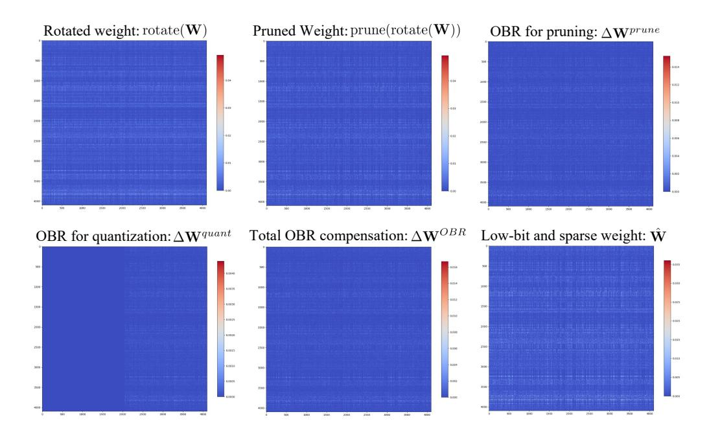

# <span id="page-13-1"></span>Algorithm 1 Optimal Brain Restoration (OBR)

```
Input: Hadamard rotated weight matrix \mathbf{W} \in \mathbb{R}^{C_{out} \times C_{in}}, Hessian approximation \mathbf{H} \in \mathbb{R}^{C_{in} \times C_{in}},
partitioning ratio \alpha.
Output: Low-bit and sparse weight \hat{\mathbf{W}} \in \mathbb{Z}^{C_{out} \times C_{in}}.
// Step1 Pruning
\mathbf{M} \in \{0,1\} = \text{prune}(\mathbf{W})
\mathbf{W}^{prune} \leftarrow \mathbf{W} \odot \mathbf{M}
// Step2 OBR compensation
Initialize \Delta \mathbf{W}^{OBR} as zero matrices in \mathbb{R}^{C_{out} \times C_{in}}
for c = 1 \dots C_{out} do
     // OBR for pruning R_1 \leftarrow \{i \mid \mathbf{M}_{c,i} = 1\}, \quad E_1 \leftarrow \{j \mid \mathbf{M}_{c,j} = 0\}
     \mathbf{b}_1 \leftarrow \mathbf{H}_{R_1 E_1} \cdot \mathbf{W}_{c, E_1}^{\top}
     \begin{array}{l} \Delta \mathbf{w}_{R_1}^{prune} \leftarrow -\mathbf{H}_{R_1R_1}^{-1} \mathbf{b}_1 \\ \bar{\mathbf{w}} \leftarrow \mathbf{W}_{c,R_1}^{prune} + \Delta \mathbf{w}_{R_1}^{prune} \\ // \text{ OBR for quantization} \end{array}
     \mathbf{e}^{quant} \leftarrow \bar{\mathbf{w}} - \text{quantize}(\bar{\mathbf{w}})
     t \leftarrow |\alpha \cdot |R_1|
     E_2 \leftarrow \{r_1, \dots, r_t\}, \quad R_2 \leftarrow \{r_{t+1}, \dots, r_{|R|}\}
\mathbf{b}_2 \leftarrow \mathbf{H}_{R_2 E_2} \cdot \mathbf{e}_{E_2}^{quant}
     \Delta \mathbf{w}_{R_2}^{quant} \leftarrow -\mathbf{H}_{R_2R_2}^{-1}\mathbf{b}_2 // Compensation Gathering
     \Delta \mathbf{W}_{c,R_1}^{OBR} + = \Delta \mathbf{w}_{R_1}^{prune}
     \Delta \mathbf{W}_{c,R_2}^{OBR} + = \Delta \mathbf{w}_{R_2}^{R_1}
end for
\mathbf{W}^{quant} \leftarrow \mathbf{W}^{prune} + \Delta \mathbf{W}^{OBR}
    / Step3 Ouantization
\hat{\mathbf{W}} \leftarrow \textsf{quant}ize(\mathbf{W}^{quant})
```

## <span id="page-13-0"></span>B COEXISTENCE OF QUANTIZATION AND PRUNING.

A key motivation behind the proposed OBR is the compatibility of low-bit quantization and sparsity in the Hadamard-rotated LLMs. In this section, we provide empirical evidence to justify this motivation. Specifically, we visualize the sparsity distribution of Llama2-7B and Qwen2.5-7B models quantized by different rotation frameworks, *i.e.*, QuaRot (Ashkboos et al., 2024), SpinQuant (Liu et al., 2024), and FlatQuant (Sun et al., 2024). Fig. 7 offers the results. Interestingly, even without any explicit pruning operations, the quantized LLMs inherently exhibit non-trivial sparsity. For instance, Llama2-7B with QuaRot reaches an average sparsity of 14.28%. Based on the observation of this coexistence, we design our OBR to achieve more aggressive LLM compression.

#### C MORE EXPERIMENTS

**Comparison with BitNet.** BitNet-2B-4T (Ma et al., 2025) is a recently proposed 1.58-bit LLM that is trained from scratch to achieve aggressive compression with strong performance. In this section, we give a brief comparison between the BitNet-2B-4T model and Qwen2.5 compressed

<span id="page-14-0"></span>

Figure 7: Distribution of layer-wise sparsity across LLMs under different rotation methods. All models are quantized with W4A4KV4 RTN quantizer.

<span id="page-14-1"></span>Table 8: Comparison between BitNet-2B-4T and our OBR compressed Qwen2.5-Instruct models.

| methods            | quantization | sparisty | PIQA  | BoolQ | HellaSwag | ARC-E | ARC-C | WinoGrande | Avg.  | Wiki2 |
|--------------------|--------------|----------|-------|-------|-----------|-------|-------|------------|-------|-------|
| BitNet-2B-4T       | W1.58A8KV16  | 0%       | 76.55 | 80.43 | 68.39     | 74.66 | 49.40 | 72.22      | 70.27 | 13.67 |
| Qwen2.5-1.5B + OBR | W4A8KV16     | 50%      | 68.99 | 66.88 | 52.68     | 62.50 | 35.24 | 60.77      | 57.84 | 15.06 |
| Qwen2.5-1.5B + OBR | W4A4KV4      | 50%      | 67.25 | 68.01 | 51.18     | 56.99 | 32.94 | 55.96      | 55.38 | 14.92 |
| Qwen2.5-3B + OBR   | W4A8KV16     | 50%      | 74.05 | 77.19 | 62.86     | 60.06 | 41.30 | 62.90      | 63.06 | 11.07 |
| Qwen2.5-3B + OBR   | W4A4KV4      | 50%      | 72.14 | 76.67 | 60.43     | 60.69 | 41.13 | 65.59      | 62.77 | 11.79 |

<span id="page-14-2"></span>Table 9: Ablation experiments on other calibration dataset. We change the calibration set to the C4 (Raffel et al., 2020) dataset for the generation of activation statistics and keep other setups the same.

| dataset   | method         | Llama2      | 2-7B    | Llama2      | -13B    | Llama3      | -8B     |
|-----------|----------------|-------------|---------|-------------|---------|-------------|---------|
| dataset   | method         | perplexity↓ | 0-shot↑ | perplexity↓ | 0-shot↑ | perplexity↓ | 0-shot↑ |
|           | SparseGPT+GPTQ | 12.94       | 51.57   | 7.89        | 60.74   | 16.40       | 53.77   |
| wikitext2 | Ours_RTN       | 9.23        | 56.49   | 7.29        | 62.37   | 14.47       | 54.40   |
|           | Ours_GPTQ      | 8.40        | 53.45   | 7.06        | 62.60   | 13.92       | 55.16   |
|           | SparseGPT+GPTQ | 18.36       | 51.18   | 9.69        | 60.48   | 23.02       | 53.87   |
| c4        | Ours_RTN       | 10.74       | 58.00   | 8.74        | 62.88   | 18.23       | 56.02   |
|           | Ours_GPTQ      | 10.40       | 57.95   | 8.22        | 63.16   | 17.90       | 57.12   |

using our OBR. As shown in Tab. 8, our post-training method achieves comparable performance. To be specific, Qwen2.5-3B+OBR (W4A4KV4+50%Sparsity) achieves better perplexity on WikiText2 and comparative performance on zero-shot accuracy. It should be noted that the performance of OBR can be further boosted when future, more advanced base LLMs are proposed. Moreover, the resulting W4A4KV4+50% sparse LLMs can be seamlessly deployed, such as in NVIDIA Ampere and Hopper, whereas BitNet requires specially designed kernels and customized implementations. At last, our method provides stronger generalization and flexibility. BitNet currently offers only one model size and typically requires training from scratch, which is computationally expensive and impractical for users with domain-specific or confidential data. In contrast, our OBR framework is a general post-training compression approach that can be directly applied to existing models of different sizes, enabling users to efficiently adapt their own LLMs without re-training.

**Ablation on other Calibration Set.** In the proposed OBR, we use the WikiText-2 (Merity et al., 2016) dataset to obtain activation statistics. To further verify the robustness across different calibration sets, we additionally experiment with the C4 (Raffel et al., 2020) dataset for calibration. The results are shown in Tab. 9. As can be seen, when switching to the C4 dataset, all compared methods suffer a slight performance degradation on WikiText perplexity due to the train-test shift. However, models calibrated with C4 achieve better results on zero-shot tasks, and this advantage is more pronounced with our OBR. For example, in the Llama3-8B experiment with C4, SparseGPT+GPTQ achieves only a 0.1% accuracy improvement, whereas the proposed OBR\_GPTQ delivers a 1.96% gain. Moreover, both OBR\_RTN and OBR\_GPTQ consistently outperform the SparseGPT+GPTQ baseline across all calibration sets and base models under the same compression settings. The above results demonstrate the generalization of our method under other calibration sets.

<span id="page-15-0"></span>Table 10: Comparison of perplexity score on WikiText2 and accuracy on zero-shot common sense reasoning tasks using the rotation matrix from FlatQuant (Sun et al., 2024).

| Model       | Method                | #Bits<br>(W-A-KV) | Sparsity ratio | PIQA<br>(†) | BoolQ<br>(†) | HellaS. | Arc-e | Arc-c | WinoG. | Avg.  | Wiki2 |
|-------------|-----------------------|-------------------|----------------|-------------|--------------|---------|-------|-------|--------|-------|-------|
|             | <u> </u>              |                   |                |             |              |         |       |       |        |       |       |
|             | Floating-point        | 16-16-16          | 0%             | 79.11       | 77.71        | 76.02   | 74.49 | 46.33 | 69.14  | 70.47 | 5.47  |
|             | FlatQuant(quant-only) | 4-4-4             | 0%             | 77.48       | 74.62        | 73.64   | 72.56 |       | 68.27  | 68.26 | 5.79  |
| Llama2-7B   | FlatQuant(quant-only) | 3-4-4             | 0%             | 75.68       | 73.94        | 69.44   | 67.85 | 40.96 | 64.17  | 65.34 | 6.74  |
|             | SparseGPT+GPTQ        | 4-4-4             | 50%            | 73.56       | 50.40        | 65.36   | 61.11 | 34.73 | 62.75  | 57.99 | 7.75  |
|             | Ours_RTN              | 4-4-4             | 50%            | 74.32       | 72.91        | 65.88   | 64.94 |       | 65.82  | 63.62 | 6.88  |
|             | Ours_GPTQ             | 4-4-4             | 50%            | 74.37       | 71.41        | 65.92   | 64.06 | 38.82 | 66.38  | 63.49 | 6.87  |
|             | Floating-point        | 16-16-16          | 0%             | 80.52       | 80.55        | 79.37   | 77.48 | 49.15 | 72.14  | 73.20 | 4.88  |
| Llama2-13B  | FlatQuant(quant-only) | 4-4-4             | 0%             | 79.00       | 79.39        | 77.44   | 76.47 | 48.72 | 70.17  | 71.86 | 5.11  |
|             | FlatQuant(quant-only) | 3-4-4             | 0%             | 78.56       | 78.04        | 75.35   | 70.66 | 44.97 | 70.09  | 69.61 | 5.70  |
|             | SparseGPT+GPTQ        | 4-4-4             | 50%            | 75.90       | 74.53        | 69.81   | 68.86 | 40.19 | 67.09  | 66.06 | 6.13  |
|             | Ours_RTN              | 4-4-4             | 50%            | 76.66       | 73.94        | 71.44   | 71.30 | 42.06 | 68.27  | 67.27 | 5.84  |
|             | Ours_GPTQ             | 4-4-4             | 50%            | 76.61       | 73.27        | 71.39   | 72.10 | 42.49 | 68.43  | 67.38 | 5.84  |
|             | Floating-point        | 16-16-16          | 0%             | 80.85       | 80.98        | 79.17   | 77.74 | 53.24 | 73.40  | 74.23 | 6.13  |
|             | FlatQuant(quant-only) | 4-4-4             | 0%             | 79.33       | 79.36        | 76.64   | 75.21 | 48.46 | 72.06  | 71.84 | 6.97  |
| Llama3-8B   | FlatQuant(quant-only) | 3-4-4             | 0%             | 75.68       | 69.42        | 71.21   | 67.47 | 39.85 | 67.40  | 65.17 | 9.14  |
|             | SparseGPT+GPTQ        | 4-4-4             | 50%            | 69.97       | 74.95        | 63.59   | 57.03 | 34.64 | 65.19  | 60.89 | 13.32 |
|             | Ours_RTN              | 4-4-4             | 50%            | 74.16       | 77.61        | 66.86   | 68.81 | 40.78 | 0.6661 | 65.80 | 9.12  |
|             | Ours_GPTQ             | 4-4-4             | 50%            | 73.99       | 77.16        | 66.74   | 69.11 | 41.30 | 68.19  | 66.08 | 9.10  |
|             | Floating-point        | 16-16-16          | 0%             | 80.14       | 85.96        | 79.57   | 76.47 | 51.19 | 69.46  | 73.78 | 8.35  |
|             | FlatQuant(quant-only) | 4-4-4             | 0%             | 78.13       | 85.87        | 78.48   | 77.23 | 51.02 | 68.82  | 73.25 | 8.40  |
| Owen2.5-7B  | FlatQuant(quant-only) | 3-4-4             | 0%             | 73.23       | 82.20        | 74.51   | 69.78 | 48.29 | 63.06  | 68.51 | 10.08 |
|             | SparseGPT+GPTQ        | 4-4-4             | 50%            | 73.56       | 83.70        | 68.50   | 68.10 | 42.49 | 64.01  | 66.72 | 14.53 |
|             | Ours_RTN              | 4-4-4             | 50%            | 74.70       | 85.41        | 71.22   | 74.49 | 49.83 | 66.30  | 70.32 | 9.55  |
|             | Ours_GPTQ             | 4-4-4             | 50%            | 76.66       | 85.08        | 70.68   | 74.12 | 50.85 | 67.56  | 70.82 | 9.51  |
|             | Floating-point        | 16-16-16          | 0%             | 81.39       | 90.54        | 85.25   | 77.02 | 58.62 | 73.16  | 77.66 | 5.32  |
|             | FlatQuant(quant-only) | 4-4-4             | 0%             | 80.96       | 89.39        | 83.86   | 79.17 | 57.94 | 73.95  | 77.54 | 5.82  |
| Owen2.5-32B | FlatQuant(quant-only) | 3-4-4             | 0%             | 78.94       | 87.83        | 81.45   | 74.87 | 54.69 | 67.64  | 74.23 | 6.79  |
|             | SparseGPT+GPTQ        | 4-4-4             | 50%            | 80.20       | 89.94        | 0.7986  | 73.78 | 52.65 | 72.14  | 74.76 | 8.06  |
|             | Ours_RTN              | 4-4-4             | 50%            | 77.86       | 90.00        | 80.00   | 78.45 | 57.17 | 72.77  | 76.04 | 6.81  |
|             | Ours_GPTQ             | 4-4-4             | 50%            | 79.11       | 89.45        | 80.00   | 77.31 | 59.22 | 72.61  | 76.28 | 6.79  |

**Performance on FlatQuant.** In the main paper, we present the application of our OBR on the LLMs rotated by QuaRot (Ashkboos et al., 2024) or SpinQuant (Liu et al., 2024). To further evaluate the generalization ability of our method on other Hadamard rotation frameworks, we additionally include the comparison results with the FlatQuant (Sun et al., 2024) method. The experimental results are shown in Tab. 10. As can be observed, OBR continues to deliver strong performance compared to the SparseGPT+GPTQ baseline across various base models. Interestingly, comparing with QuaRot and SpinQuant, when using a stronger rotation matrix from FlatQuant, the W4A4KV4 + 50% sparsity LLMs using our OBR can achieve performance on par with their FP16 counterparts. For example, the perplexity gap on Llama2-7B is merely 1.4, compared with the gap of 2.93 in QuaRot. This result further indicates the potential that our OBR can scale in parallel with a more advanced rotation framework.

**Results on Qwen Families.** In this section, we take Qwen2.5-Instruct (7B/32B) as a representative to demonstrate the generalization capability of the proposed OBR on other LLMs. The experimental results are presented in Tab. 10. Given Qwen as the base models, OBR consistently outperforms other strong baselines across different scales. For instance, OBR\_RTN surpasses SparseGPT+GPTQ by 4.98 perplexity on the Qwen2.5-7B model. In addition, OBR\_RTN also outperforms the quantization-only W3A4KV4 baseline by 0.53 perplexity. These results demonstrate the strong generalization ability of the proposed OBR across different LLM families.

Calibration Time Cost of OBR. Tab. 11 reports the time cost for compressing models of different scales using OBR. As one can see, for smaller models such as the 7B model, OBR can produce a W4A4KV4 + 50% LLMs in about 2 hours. For even larger models, such as the 70B, the proposed OBR completes in roughly 36 hours. Since our OBR adopts a row-wise decoupling strategy, it requires solving a linear equation for each row, making it slower than SparseGPT+GPTQ. Nevertheless, we emphasize that post-training compression needs to be performed only once per model. As a result, this cost has only minimal impact on large-scale deployment. Moreover, the promising performance of OBR against other baselines under aggressive compression further justifies its advantages.

<span id="page-16-1"></span>Table 11: Calibration time results for Llama model family. The reported times correspond to QuaRot (Ashkboos et al., 2024) rotation on a single A100 GPU.

| Llama family           | 2-7B             | 2-13B            | 2-70B               | 3-8B             | 3-70B              |
|------------------------|------------------|------------------|---------------------|------------------|--------------------|
| SparseGPT+GPTQ OBR_RTN | 45min<br>2h10min | 54min<br>4h12min | 1h53min<br>35h30min | 48min<br>2h30min | 2h9min<br>35h28min |
| OBR_GPTQ               | 2h18min          | 4h30min          | 35h45min            | 2h40min          | 35h47min           |

<span id="page-16-2"></span>

Figure 8: Visualization of the full weight matrix at different stages in the proposed OBR pipeline. The x-axis corresponds to the  $C_{in}$  dimension, and the y-axis is the  $C_{out}$  dimension. The weight matrix is taken from the <code>layer.O.q-proj</code> layer from the Llama2-7B model, and absolute values are used to enhance visual clarity.

#### <span id="page-16-0"></span>D MORE VISUALIZATION

In Fig. 8, we present visualizations of the full weight matrices at different stages of OBR processing. It can be observed that the rotated weight matrix inherently exhibits strong row-wise independence, as indicated by the similarity patterns across rows in  $\mathrm{rotate}(\mathbf{W})$ . Moreover, the compensation terms  $\Delta \mathbf{W}^{prune}$  and  $\Delta \mathbf{W}^{quant}$  produced by OBR clearly contain useful information, since they share a similar magnitude with the  $\mathrm{prune}(\mathrm{rotate}(\mathbf{W}))$ . Therefore, if the OBR compensation were merely noise, perturbations of this magnitude would lead to significant errors. In addition, the overall compensation  $\Delta \mathbf{W}^{OBR}$  also demonstrates row-wise independence, where some rows have large magnitudes while others have small ones, yet column dimensions instead exhibit similar patterns. This observation further justifies our proposed row-wise decoupling strategy.

### E Limitation and Future Work

While the proposed OBR can effectively redistribute weights to reconcile the differing distributional requirements of quantization and pruning, there are several avenues for further improvement. First, OBR relies on a row-wise decoupling strategy to estimate the full Hessian. This approximation renders the original objective tractable, but it requires solving a linear system for each row of the weight matrix. Although this overhead is acceptable in model compression tasks, where the compression algorithm needs to run only once, further accelerating the compression process for large-scale LLMs remains meaningful. Second, the current implementation of OBR treats the pruning

mask and quantization rotation matrix as fixed given inputs. However, recent quantization studies [\(Liu](#page-11-2) [et al.,](#page-11-2) [2024;](#page-11-2) [Sun et al.,](#page-11-3) [2024\)](#page-11-3) suggest that introducing gradient-based optimization can further boost performance. Thus, designing learnable pruning masks and rotation matrices compatible with our OBR framework could lead to additional gains. Third, although OBR significantly outperforms individual compression methods under equivalent sub-4-bit settings, its advantage narrows at higher bit-widths, where standalone methods have not yet reached their performance limits. Developing more advanced algorithms to maintain superior performance across various bit-widths is also a promising direction, and we leave it for future work.