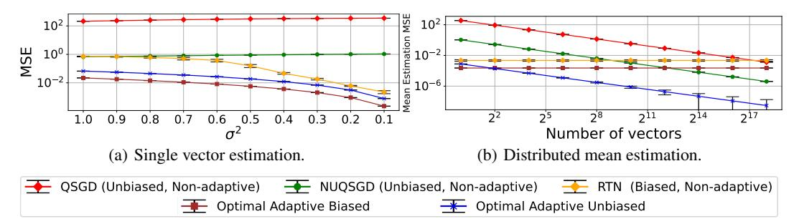

# 1 Introduction

Quantization is central to optimizing a large range of machine learning (ML) applications. It is often used for compressing gradients to reduce network requirements in distributed and federated learning (e.g., [1, 2, 3, 4, 5, 6]); for quantization of datasets for faster training and inference (e.g., [7]); and for reducing the memory footprint while accelerating the computation for large models' inference via post-training quantization (e.g., [8, 9]) and quantization-aware training (e.g., [10, 11]) of model weights, activations and key-value (KV) caches [12].

A fundamental quantization method is *stochastic quantization*, where one quantizes an input vector  $X \in \mathbb{R}^d$  to  $\widehat{X} \in Q^d$  using a set  $Q \subset \mathbb{R}$  of |Q| = s quantization values so that each entry is unbiased [13]. That is, each  $x \in X$  is (randomly) quantized to a value  $\widehat{x} \in Q$  such that  $\mathbb{E}[\widehat{x}] = x$ .

Previous unbiased quantization works considered different approaches. Some are distribution-agnostic, i.e., design the quantization without optimizing it for the specific input. For example, [1, 14, 15] set quantization values with respect to global properties such as the vector's norm, or minimum and maximum values.

Other works, e.g., [1, 3, 4, 16, 17, 18, 19], optimize for the worst case X by applying a reversible transformation (e.g., the randomized Hadamard transform) before quantization that converts it into a vector X' with a controlled distribution (e.g., with  $\max(X') - \min(X') = \tilde{O}(\|X\|_2 / \sqrt{d})$ ). The decoder then applies the inverse transformation on the quantized X' to obtain an estimate of X.

In contrast, some solutions use the fact that, in many cases, the inputs to be quantized have a significant structure that can be leveraged to reduce the quantization error. For example, DNN gradients (which are often compressed in distributed and federated learning applications to reduce bandwidth [20, 21]) were observed to follow LogNormal-like [22] or Normal-like [23, 24] distributions. As another example, the distribution of deep activation layers appears to follow a sub-Weibull distribution [25].

To alleviate the need to assume an input distribution, the Adaptive Stochastic Quantization (ASQ) problem (e.g., [26, 27, 28]) considers selecting Q adaptively, i.e., with respect to the specific input X, that minimizes the mean squared error (MSE, also known as the sum of variances) given by

$$\mathbb{E}\left[\left\|\widehat{X} - X\right\|_{2}^{2}\right] = \sum_{x \in X} \operatorname{Var}[\widehat{x}],$$

where  $\widehat{X} = \{\widehat{x} \mid x \in X\}$  is the vector of quantized values.

Unfortunately, known ASQ solutions are not practical for the large-size vectors that commonly appear in ML applications. One aspect of the problem's difficulty is that it is known to be non-convex even for s=4 (two-bit quantization) [28], which excludes many natural solution methods such as gradient descent. ZipML [26] approaches the challenge using a dynamic programming approach that allows one to optimize Q in polynomial time. However, this solution has a significant overhead and solving the problem optimally is often considered to be impractical; for example, [28] states

"To find the optimal sequence of quantization values, a dynamic program is solved whose computational and memory cost is quadratic ... For this reason, ZipML is impractical for quantizing on the fly".

As another evidence of the problem's hardness, previous work [27] solves the problem only for a given (Weibull) distribution, writing that

"The empirical distribution is usually non-differentiable, making the searching of Q infeasible".

Nevertheless, there is significant interest in advancing ASQ solutions towards wider adoption as even approximate adaptive solutions like ALQ [28] have been shown to have lower MSE than advanced distribution-agnostic methods such Non-Uniform QSGD (NUQSGD) [29]. ASQ methods can also improve more complex schemes (e.g., including the aforementioned that utilize worst-case to average-case transformations) by replacing distribution-agnostic quantization with an adaptive one.

In this paper, we show that one can, in fact, solve the ASQ problem optimally and efficiently. To this end, we introduce QUIVER, an algorithm that features novel acceleration methods and leverages the structure of the underlying problem to reduce the runtime complexity from  $O(s \cdot d^2)$  to  $O(s \cdot d)$  and the space complexity from  $O(d^2)$  to  $O(s \cdot d)$ .

This improvement arises from the observation that the optimal solution, for given input parameters s,d, can be efficiently derived from the solutions for  $\{s-1,d'\mid d'\in\{2,3,\ldots,d\}\}$  by a reduction to the problem of finding the row maximas in an *implicitly* defined totally monotone matrix. This problem is known to have fast algorithms assuming that, for any  $1\leq k\leq j\leq d$ , the sum of variances of points  $\{x_k,\ldots,x_j\}$  can be computed in constant time when quantized to  $\{x_k,x_j\}$ , a property that is achieved by our new preprocessing method.

We then further accelerate QUIVER by deriving a closed-form solution for s=3. In turn, this yields a faster solution for any s, by a variant of QUIVER that places two quantization values at a time instead of one. Finally, by discretizing the search space for Q, we show a fast approximation variant of QUIVER. This variant introduces an appealing tradeoff between accuracy and speed, making it suitable for quantizing large vectors on the fly.

We implement our algorithms in C++ and demonstrate their efficiency. For example, on a commodity PC, QUIVER can compute the *optimal* 4-bit quantization values (s=16) for a vector with d=1M entries in under a second and compute an accurate approximation in just six milliseconds. We evaluate our solutions compared to state-of-the-art ASQ methods on a variety of distributions considering different vector sizes and number of quantization values and demonstrate a speedup of up to four orders of magnitude. We open source the code of the paper [30].

We note that there are many works that investigate different forms of compression, including non-adaptive quantization (e.g., QSGD [14]), biased quantization (e.g., top-k [31]), sparsification (e.g., [32]), sparse coding (e.g., [33]), low-rank decomposition (e.g., PowerSGD [34]), variable-length coding (e.g., EDEN [4]) and more. Many of these are orthogonal to our work and can be used in conjunction with it. For example, one can use ASQ to quantize a sparsified or transformed vector or apply variable-length encoding to further reduce the size of the quantized vector.

Figure 1: An experiment with dimension d=10M and s=10 quantization values. Figure 1(a) shows the empirical MSE of quantizing a single vector with i.i.d. LogNormal $(0,\sigma^2)$  entries. It shows that adaptive methods are more accurate than non-adaptive and that the optimal biased method is more accurate than the optimal unbiased one. However, as shown in Figure 1(b), for distributed mean estimation, the bias may not cancel out when averaging quantized inputs (here, we used a standard setup where all vectors are identical, e.g., see [17], with i.i.d. LogNormal(0,1/2) distributed entries) and the advantage of unbiased methods accordingly increases with the number of inputs. Each data point is averaged over ten runs with the standard deviation reported.

