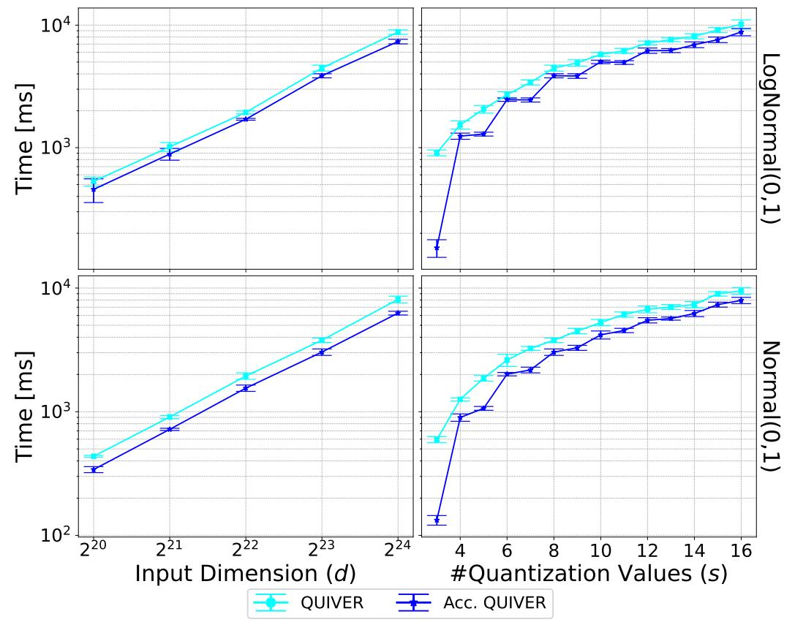
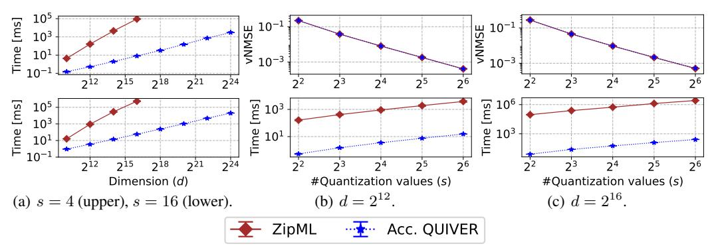
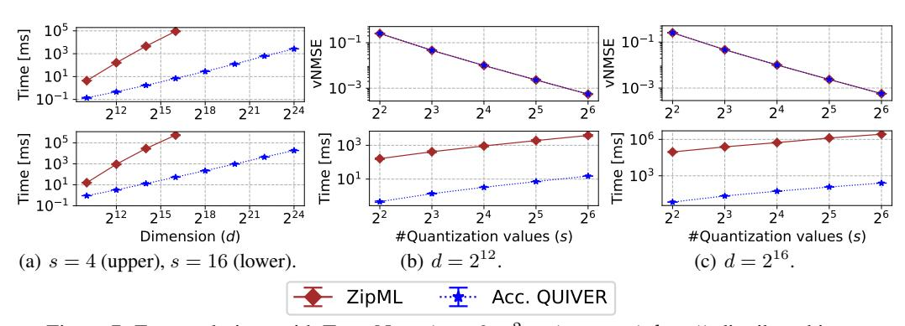
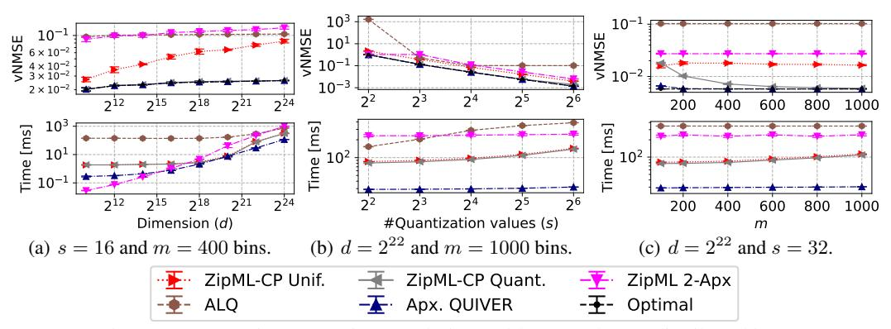

# E Preprosessing for Apx. QUIVER

Recall that, for  $S = \left\{ x_1 + \ell \cdot \frac{x_d - x_1}{m} \mid \ell \in \{0, \dots, m\} \right\}$  and  $s_\ell = x_1 + \ell \cdot \frac{x_d - x_1}{m}$ , our goal is to compute the following arrays in O(d) time:

$$\alpha_{\ell} = \sum_{x \in [s_0, s_{\ell}]} 1$$
 ,  $\beta_{\ell} = \sum_{x \in [s_0, s_{\ell}]} x$  ,  $\gamma_{\ell} = \sum_{x \in [s_0, s_{\ell}]} x^2$   $\forall \ell \in \{1, \dots, m\}$  .

Denoting  $\delta = \frac{x_d - x_1}{m}$ , the first step is to make a pass over the input and for each  $x \in X$  calculate  $\ell_x = \left\lfloor \frac{x - x_1}{\delta} \right\rfloor$  and set

$$A_{\ell} = \sum_{x \mid \ell_x = \ell} 1$$
 ,  $B_{\ell} = \sum_{x \mid \ell_x = \ell} x$  ,  $\Gamma_{\ell} = \sum_{x \mid \ell_x = \ell} x^2$   $\forall \ell \in \{1, \dots, m\}$  .

Next, we make an O(m) time pass to compute the cumulative sums:

$$\alpha_{\ell} = \sum_{i=1}^{\ell} A_i$$
 ,  $\beta_{\ell} = \sum_{i=1}^{\ell} B_i$  ,  $\gamma_{\ell} = \sum_{i=1}^{\ell} \Gamma_i$   $\forall \ell \in \{1, \dots, m\}$  .

We note that an optimization that proved useful for improving the runtime in practice is to remove empty intervals after the first step. That is, we retain only intervals for which  $A_{\ell} > 0$ , thus reducing the number of intervals from m to  $m' \leq m$ , which can be markedly smaller in practice.

## F Apx. OUIVER Pseudo-code

We describe the pseudo-code of Apx. QUIVER, which is given by Algorithm 4. We start by preprocessing the input to obtain the  $\alpha, \beta, \gamma$  arrays (Line 3). Next, we initialize the first row of the matrix, which only has m columns, using  $C_m$  (Line 4). Follows are s-2 invocations of the SMAWK algorithm, each yielding the next row in MSE and its minimizers  $K[i,\cdot]$  (Line 6). Finally, we compute the resulting quantization value set Q from K and S (Line 11).

## **G QUIVER Acceleration Evaluation**

Here, we evaluate by how much Accelerated QUIVER is faster than QUIVER. The results, depicted in Figure 4, show that Accelerated QUIVER is up to  $5.4\times$  faster for s=3 and is consistently faster throughout. Interestingly, the speedup is more significant in odd values of s. This is because the number of SMAWK invocations is  $\lfloor s/2 \rfloor - 1$  in Accelerated QUIVER (e.g., it does not invoke SMAWK at all for s=3, only once for s=5, etc.), compared to s=3 invocations in QUIVER.

## **H** Additional evaluation results

**Additional evaluation results of exact solutions.** We provide results for additional input vectors distributions: Normal (Figure 5), Exponential (Figure 6), Truncated Normal (Figure 7), and Weibull (Figure 8). As shown, all follow the same trends in terms of vNMSE, while the runtime is largely independent of the input distribution.

## I ASQ Approximation Baselines

In the ZipML paper [26], the authors propose two heuristic methods for improving the runtime. The first heuristic includes calculating the optimal solution on a subset of X called *candidate points* (CP); they further present an analysis that bounds the error with respect to the maximal difference between consecutive CPs and the maximal number of entries in X between consecutive CPs; however, as they do not provide a way to select the CPs, we consider two natural choices: using Uniform CPs, i.e.,  $\left\{x_1 + \ell \cdot \frac{x_d - x_1}{m} \mid \ell \in \{0, \dots, m\}\right\}$ . This variant is termed 'ZipML-CP Unif.' in our evaluation. The second choice of CP is Quantiles, which uses the set  $\left\{x_{\lfloor 1 + \ell \cdot (d-1)/m \rfloor} \mid \ell \in \{0, \dots, m\}\right\}$ . This variant is termed 'ZipML-CP Quant.' in our evaluation.

The second heuristic has a bicretira MSE guarantee: using 2s quantization values, it ensures that the MSE is at most twice that of the optimal solution with s quantization values. This variant is termed 'ZipML 2-Apx' in our evaluation.

 $^2$ We note that this is different our histogram approach in two aspects: (i) we stochastically quantize X into the set S and (ii) we use weights to consider the number of entries in each histogram bin.

Figure 4: The speedup attainable by Accelerated QUIVER, as a function of s (for fixed  $d=2^{23}$ ) and d (for fixed s=8), on the Normal and LogNormal distributions.

Figure 5: Comparing exact solutions with Normal(0, 1) distributed input.

Figure 6: Comparing exact solutions with Exponential(1) distributed input.

We also compare against ALQ [28], which fits the parameters of a truncated normal distribution to approximate the distribution of the input vector after normalizing it by its norm. It then uses an iterative solution to approximate the optimal quantization values of the fitted distribution up to the desired precision. As suggested by the authors, we use ten iterations, which were shown to converge to the optimal quantization values for the resulting (truncated normal) distribution.

Additional evaluation results of approximate solutions. Similarly, we show the approximation algorithms evaluation results for the various distributions and s values: Normal (Figure 9), Exponential (Figure 10), Truncated Normal (Figure 11), and Weibull (Figure 12). Again, the runtime of all algorithms is weakly affected by the input distribution. Apx. QUIVER is always the most accurate for increasing d values and has a near-optimal vNMSE when using a sufficient value for m (e.g.,  $m \geq 400$ ) while being markedly faster than all alternatives.

Figure 7: Exact solutions with TruncNorm( $\mu = 0, \sigma^2 = 1, a = -1, b = 1$ ) distributed input.

Figure 8: Comparing exact solutions with Weibull(1, 1) distributed input.

Figure 9: Comparing approximate solutions with Normal(0, 1) distributed input.

## J Additional Overheads

We measure the sort and quantize operations using the same EC2 server that is also equipped with an NVIDIA T4 GPU, PyTorch v2.1.2, and CUDA tool kit v12.3. As shown in Figure 13, both operations are fast even for large vectors, despite the usage of a somewhat weak GPU. This specific measurement was done over the LogNormal(0,1) distribution, but the sorting and quantization times are largely independent of the specific distribution and were similar to other tested distributions as well.

