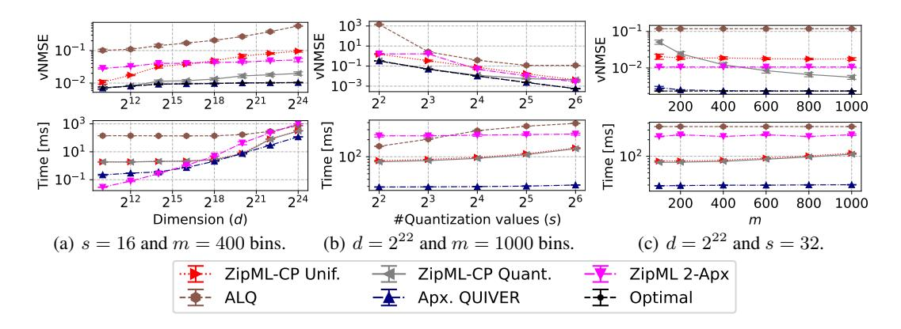

# **K** Generalizing Our Algorithms to Weighted Inputs

We generalize our algorithms for processing sorted weighted inputs  $X, W \in \mathbb{R}^d$  (where each entry has value  $y_\ell$  and weight  $w_\ell$  and  $x_1 \leq x_2 \leq \dots, x_d$ ).

Most of the algorithmic parts only require a revised method for computing C in constant time, which is achieved through the modified pre-processing procedure below.

For simplicity, we only discuss the basic QUIVER variant and leave the acceleration as future work.

**Pre-processing.** To allow constant time computation of weighted C, denoted  $C_w$ , for weighted inputs we need another auxiliary array. Namely, we define the following:

&lt;sup>3Similarly to the unweighted case, the sorted vector requirement is only needed for the exact solutions.

Figure 10: Comparing approximate solutions with Exponential(1) distributed input.

Figure 11: Approx. solutions with TruncNorm( $\mu = 0, \sigma^2 = 1, a = -1, b = 1$ ) distributed input.

$$\alpha_{j} = \sum_{(x,w)\in X_{j}} w \quad , \quad j \in \{1,\dots,d\} ,$$

$$\beta_{j} = \sum_{(x,w)\in X_{j}} w \cdot x \quad , \quad j \in \{1,\dots,d\} ,$$

$$\gamma_{j} = \sum_{(x,w)\in X_{j}} w \cdot x^{2} \quad , \quad j \in \{1,\dots,d\} .$$

Then, we can then write:

$$C_{w}[k,j] = \sum_{x_{\ell} \in [x_{k},x_{j}]} w \cdot (x_{j} - x_{\ell})(x_{\ell} - x_{k})$$

$$= \sum_{x_{\ell} \in (x_{k},x_{j}]} w \cdot (x_{j} - x_{\ell})(x_{\ell} - x_{k})$$

$$= x_{j} \cdot x_{k} \cdot \sum_{x_{\ell} \in (x_{k},x_{j}]} w_{\ell} + (x_{j} - x_{k}) \cdot \sum_{x_{\ell} \in (x_{k},x_{j}]} w_{\ell} \cdot x_{\ell} - \sum_{x_{\ell} \in (x_{k},x_{j}]} w_{\ell} \cdot x_{\ell}^{2}$$

$$= x_{j} \cdot x_{k} \cdot (\alpha_{j} - \alpha_{k}) + (x_{j} - x_{k}) \cdot (\beta_{j} - \beta_{k}) - (\gamma_{j} - \gamma_{k}).$$

Observe that  $C_w$  clearly satisfies the quadrangle inequality, and thus, the correctness follows. The approximation variant also follows similarly.

Figure 12: Comparing approximate solutions with Weibull(1, 1) distributed input.

Figure 13: Sort and quantization times (s=16) vs. d on a T4 GPU.