# PARQ: Piecewise-Affine Regularized Quantization§

Lisa Jin<sup>∗</sup> Jianhao Ma† Zechun Liu‡ Andrey Gromov<sup>∗</sup> Aaron Defazio<sup>∗</sup> Lin Xiao<sup>∗</sup>

#### Abstract

We develop a principled method for quantization-aware training (QAT) of large-scale machine learning models. Specifically, we show that convex, piecewise-affine regularization (PAR) can effectively induce the model parameters to cluster towards discrete values. We minimize PAR-regularized loss functions using an aggregate proximal stochastic gradient method (AProx) and prove that it has last-iterate convergence. Our approach provides an interpretation of the straight-through estimator (STE), a widely used heuristic for QAT, as the asymptotic form of PARQ. We conduct experiments to demonstrate that PARQ obtains competitive performance on convolution- and transformer-based vision tasks.

## 1 Introduction

Modern deep learning models exhibit exceptional vision and language processing capabilities, but come with excessive sizes and demands on memory and computing. Quantization is an effective approach for model compression, which can significantly reduce their memory footprint, computing cost, as well as latency for inference (e.g., [Han et al., 2016;](#page-22-0) [Sze et al., 2017\)](#page-23-0). There are two main classes of quantization methods: post-training quantization (PTQ) and quantization-aware training (QAT). Both are widely adopted and receive extensive research—see the recent survey papers [\(Gholami et al., 2022;](#page-22-1) [Fournarakis et al., 2022\)](#page-22-2) and references therein.

PTQ converts the weights of a pre-trained model directly into lower precision without repeating the training pipeline; it thus has less overhead and is relatively easy to apply [Nagel et al.](#page-23-1) [\(2020\)](#page-23-1); [Cai](#page-21-0) [et al.](#page-21-0) [\(2020\)](#page-21-0); [Chee et al.](#page-21-1) [\(2024\)](#page-21-1). However, it is mainly limited to 4 or more bit regimes and can suffer steep performance drops with fewer bits [Yao et al.](#page-23-2) [\(2022\)](#page-23-2); [Dettmers & Zettlemoyer](#page-21-2) [\(2023\)](#page-21-2). This is especially the case for transformer-based models, which prove harder to quantize [Bai et al.](#page-21-3) [\(2021\)](#page-21-3); [Qin et al.](#page-23-3) [\(2022\)](#page-23-3) compared to convolutional architectures [Martinez et al.](#page-23-4) [\(2019\)](#page-23-4); [Qin et al.](#page-23-5) [\(2020\)](#page-23-5). On the other hand, QAT integrates quantization into pre-training and/or fine-tuning processes and can produce low-bit (especially binary) models with mild performance degradation (e.g. [Fan et al.,](#page-22-3) [2021;](#page-22-3) [Liu et al., 2022\)](#page-22-4).

A key ingredient of QAT is the so-called straight-through estimator (STE), which was invented as a heuristic [Bengio et al.](#page-21-4) [\(2013\)](#page-21-4); [Courbariaux et al.](#page-21-5) [\(2015\)](#page-21-5) and has been extremely successful in

<sup>∗</sup>Meta FAIR, United States. Emails: {lvj, gromovand, adefazio, linx}@meta.com.

<sup>†</sup>University of Michigan, Ann Arbor, MI, United States. Email: jianhao@umich.edu.

<sup>‡</sup>Meta Reality Labs, United States. Email: zechunliu@meta.com

<sup>§</sup>Open-source PyTorch package: <https://github.com/facebookresearch/parq>

<span id="page-1-0"></span>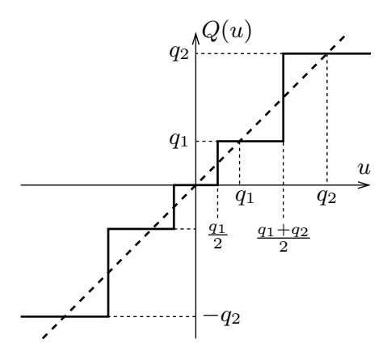

Figure 1: A quantization map with Q = {0, ±q1, ±q2}.

practice [Rastegari et al.](#page-23-6) [\(2016\)](#page-23-6); [Hubara et al.](#page-22-5) [\(2018\)](#page-22-5); [Esser et al.](#page-22-6) [\(2019\)](#page-22-6). There have been many efforts trying to demystify the effectiveness of STE, especially through the lens of optimization algorithms (e.g., [Li et al., 2017;](#page-22-7) [Yin et al., 2018,](#page-23-7) [2019a;](#page-24-0) [Bai et al., 2019;](#page-21-6) [Ajanthan et al., 2021;](#page-21-7) [Dockhorn et al., 2021;](#page-22-8) [Lu et al., 2023\)](#page-22-9). However, significant gaps between theory and practice remain.

In this paper, we develop a principled method for QAT based on convex regularization and interpret STE as the asymptotic form of an aggregate proximal (stochastic) gradient method. The convex regularization framework admits stronger convergence guarantees than previous work and allows us to prove the last-iterate convergence of the method.

### <span id="page-1-3"></span>1.1 The Straight-Through Estimator (STE)

We consider training a machine learning model with parameters w ∈ R<sup>d</sup> and let f(w, z) denote the loss of the model on a training example z. Our goal is to minimize the population loss f(w) = Ez[f(w, z)] where z follows some unknown probability distribution. Here we focus on the classical stochastic gradient descent (SGD) method. During each iteration of SGD, we draw a random training example (mini-batch) z <sup>t</sup> and update the model parameter as

<span id="page-1-2"></span>
$$w^{t+1} = w^t - \eta_t \nabla f(w^t, z^t), \tag{1}$$

where ∇f(·, z<sup>t</sup> ) denotes the stochastic gradient with respect to the first argument (here being w t ) and η<sup>t</sup> is the step size.

QAT methods modify SGD by adding a quantization step. In particular, the BinaryConnect method [Courbariaux et al.](#page-21-5) [\(2015\)](#page-21-5) can be written as

<span id="page-1-1"></span>
$$u^{t+1} = u^t - \eta_t \nabla f(Q(u^t), z^t), \tag{2}$$

where Q(·) is the (coordinate-wise) projection onto the set {±1} d . It readily generalizes to projection onto Q<sup>d</sup> where Q is a finite set of arbitrary quantization values. Figure [1](#page-1-0) shows an example with Q = {0, ±q1, ±q2}.

Notice that in Equation [\(2\)](#page-1-1) we switched notation from w t to u t , because we would like to define w <sup>t</sup> = Q(u t ) as the quantized model parameters. This reveals a key feature of QAT: the stochastic gradient in [\(2\)](#page-1-1) is computed at w t instead of u t itself (which would be equivalent to [\(1\)](#page-1-2)). Here we regard u <sup>t</sup> as a full-precision (floating-point) latent variable that is used to accumulate the gradient computed at w t , and the quantization map Q(·) is applied to the latent variable u <sup>t</sup>+1 to generate the next quantized variable w t+1 .

The notion of STE rises from the intent of computing an approximate gradient of the loss function with respect to u t . Let's define the function ˜f(u, z) := f(Q(u), z) = f(w, z) in light of w = Q(u). Then we have for each i = 1, . . . , d,

$$\frac{\partial \tilde{f}}{\partial u_i} = \frac{\partial f}{\partial w_i} \frac{dw_i}{du_i} = \frac{\partial f}{\partial w_i} \frac{dQ(u_i)}{du_i}.$$

However, due to the staircase shape of the quantization map, we have dQ(ui)/du<sup>i</sup> = 0 and thus ∇ ˜f(u, z) = 0 almost everywhere. STE aims to "construct" a nontrivial gradient with respect to u, by simply treating Q(·) as the identity map ("straight-through") during backpropagation, i.e., replacing dQ(ui)/du<sup>i</sup> with 1. This leads to the approximation

$$\nabla \tilde{f}(u,z) \stackrel{\text{STE}}{\approx} \nabla f(w,z) = \nabla f(Q(u),z),$$

so one can interpret Equation [\(2\)](#page-1-1) as an approximate SGD update for minimizing the loss ˜f(u).

There are several issues with the above argument. First, we know exactly that dQ(ui)/du<sup>i</sup> = 0 almost everywhere, so there is no need for "approximation." Second, any approximation that replaces 0 with 1 in this context warrants scrutiny of the resulting bias and consequences on stability. Existing works on this are restricted to special cases and weak convergence results [\(Li](#page-22-7) [et al., 2017;](#page-22-7) [Yin et al., 2019a\)](#page-24-0).

Alternatively, we can view [\(2\)](#page-1-1) as an implicit algorithm for updating w <sup>t</sup> and analyze its convergence. More explicitly

<span id="page-2-0"></span>
$$u^{t+1} = u^t - \eta_t \nabla f(w^t, z^t),$$
  

$$w^{t+1} = Q(u^{t+1}).$$
(3)

Here u t serves as an auxiliary variable that accumulates past gradients evaluated at w 0 , . . . , w<sup>t</sup> (similar to momentum). This formalism is enabled through regularization and proximal gradient methods [\(Bai et al., 2019;](#page-21-6) [Dockhorn et al., 2021\)](#page-22-8). And it is the path we take in this paper.

### 1.2 Outline and contributions

In Section [2,](#page-3-0) we review the framework of regularization and introduce a family of convex, piecewiseaffine regularizers (PAR). In addition, we derive the first-order optimality conditions for minimizing PAR-regularized functions.

In Section [3,](#page-6-0) we derive an aggregate proximal gradient method (AProx) for solving PARregularized minimization problems and provide its convergence analysis for convex losses. AProx applies a soft-quantization map that evolves over the iterations and asymptotically converges to hard quantization, thus giving a principled interpretation of STE.

In Section [4,](#page-9-0) we present PARQ (Piecewise-Affine Regularized Quantization), a practical implementation of AProx that does not need to pre-determine the quantization values and regularization strength.

In Section [5,](#page-10-0) we conduct QAT experiments on low-bit quantization of convolution- and transformerbased vision models and demonstrate that PARQ obtains competitive performance compared with STE/BinaryConnect and other methods based on nonconvex regularization.

<span id="page-3-1"></span>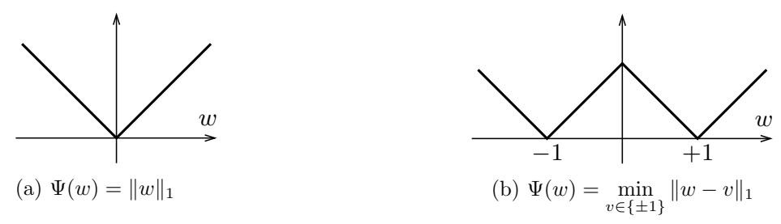

Figure 2: Illustration of two nonsmooth regularizers.

We note that Dockhorn et al. (2021) used the regularization framework and proximal optimization to demystify the BinaryConnect algorithm (3) and developed a generalization called Prox-Connect. In fact, AProx is equivalent to ProxConnect albeit following quite different derivations. Nevertheless, we make the following novel contributions:

- We propose *convex* PAR for inducing quantization. Dockhorn et al. (2021) focus on monotone (non-decreasing) proximal maps, which can correspond to arbitrary regularization. Even though they present convergence results for convex regularization, no such example is given to demonstrate its relevance. Beyond closing this gap between theory and practice, our construction of convex PAR is rather surprising it actually encourages clustering around discrete values.
- We derive first-order optimality conditions for minimizing PAR-regularized functions. They reveal the *critical role of nonsmoothness in inducing quantization*.
- We prove *last-iterate convergence* of AProx. The convergence results of Dockhorn et al. (2021) concern the averaged iterates generated by ProxConnect/AProx. While such results are conventional in the stochastic optimization literature, they are far from satisfactory for QAT, because the averaged iterate may not be quantized even if every iterate is quantized. Last-iterate convergence gives a much stronger guarantee.
- We propose a practical implementation called PARQ that can adaptively choose the quantization values and regularization strength in an online fashion.

## <span id="page-3-0"></span>2 Piecewise affine regularization (PAR)

Regularization is a common approach for inducing desired properties of machine learning models, by minimizing a weighted sum of the loss function f and a regularizer  $\Psi$ :

<span id="page-3-2"></span>
$$\underset{w \in \mathbf{R}^d}{\text{minimize}} \quad f(w) + \lambda \Psi(w), \tag{4}$$

where  $\lambda \in \mathbf{R}_+$  is a parameter to balance the relative strength of regularization. It is well known that  $L_2$ -regularization helps generalization by preferring smaller model parameters, and  $L_1$ -regularization (Figure 2(a)) induces sparsity.

There have been many attempts of using regularization to induce quantization (e.g., Carreira-Perpiñán & Idelbayev, 2017; Yin et al., 2018; Bai et al., 2019). An obvious choice is to let  $\Psi$  be the indicator function of  $\mathcal{Q}^d$ ; in other words,  $\Psi(w) = \sum_{i=1}^d \delta_{\mathcal{Q}}(w_i)$  where

<span id="page-3-3"></span>
$$\delta_{\mathcal{Q}}(w_i) = \begin{cases} 0 & \text{if } w_i \in \mathcal{Q}, \\ +\infty & \text{otherwise.} \end{cases}$$
 (5)

<span id="page-4-0"></span>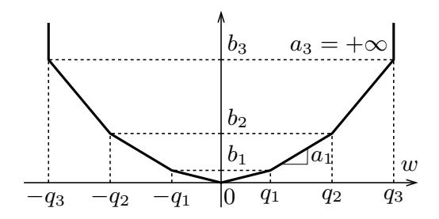

Figure 3: Convex PAR:  $\Psi(w) = \max_k \{a_k(|w| - q_k) + b_k\}$ .

Then minimizing  $f(w) + \lambda \Psi(w)$  is equivalent to the constrained optimization problem of minimizing f(w) subject to  $w \in \mathcal{Q}^d$ , which is combinatorial in nature and very hard to solve in general. Yin et al. (2018) propose to use the Moreau envelope of the indicator function, which under the Euclidean metric gives  $\Psi(w) = \min_{v \in \mathcal{Q}^d} \|v - w\|_2^2$ . A nonsmooth version is proposed by Bai et al. (2019) under the  $L_1$ -metric, resulting in  $\Psi(w) = \min_{v \in \mathcal{Q}^d} \|v - w\|_1$ ; Figure 2(b) shows a W-shaped example in one dimension.

The effectiveness of a regularizer largely relies on two properties: nonsmoothness and convexity. Smooth regularizers such as  $\operatorname{dist}(w, \mathcal{Q}^d)$  behave like  $\|w\|_2^2$  locally, and do not induce zero or any discrete structure like hard quantization. Nonsmooth regularizers locally behave like  $\|w\|_1$  near zero; they thus tend to cluster weights towards the set of nondifferentiable points—more suitable for quantization.

Convexity concerns the global behavior of regularization. For example, the popularity of  $L_1$ -regularization for sparse optimization is largely attributed to its convexity besides being nonsmooth. On the other hand, it is hard for a gradient-based algorithm to cross the middle hill in the nonconvex W-shaped regularizer shown in Figure 2(b), if the initial weights are trapped in the wrong valley from the optimal ones. Therefore, ideally we would like to construct a regularizer that is both nonsmooth and convex.

To simplify presentation, we assume  $\Psi(w) = \sum_{i=1}^{d} \Psi(w_i)$  and use the same notation  $\Psi$  for the function of a vector or one of its coordinates (it should be self-evident from the context). For most of the discussion, we focus on the scalar case and omit the subscript i or simply assume d = 1.

Suppose the set of target quantization values is given as  $Q = \{0, \pm q_1, \dots, \pm q_m\}$  and assume  $0 = q_0 < q_1 < \dots < q_m$ . We define a piecewise-affine regularizer (PAR) as

<span id="page-4-1"></span>
$$\Psi(w) = \max_{k \in \{0, \dots, m\}} \{ a_k(|w| - q_k) + b_k \}, \tag{6}$$

where the slopes  $\{a_k\}_{k=0}^m$  are free parameters that satisfy  $0 \le a_0 < a_1 < \dots < a_m = +\infty$ , and  $\{b_k\}_{k=0}^m$  are determined by setting  $b_0 = 0$ ,  $q_0 = 0$ , and

$$b_k = b_{k-1} + a_{k-1}(q_k - q_{k-1}), \qquad k = 1, \dots, m.$$

As shown in Figure 3,  $(\pm q_k, b_k)$  are the reflection points of the piecewise-affine graph. The function  $\Psi(w)$  is convex because the maximum of finite linear functions is convex (Boyd & Vandenberghe, 2004, Section 3.2.3).

We note that setting  $a_0 = 0$  effectively removes  $q_0 = 0$  from the quantization set  $\mathcal{Q}$  because it is no longer a reflection point of  $\Psi$ . Figure 4 illustrates three special cases of PAR for low-bit quantization, where both Figures 4(a) and 4(b) have  $a_0 = 0$ . Finally, the above definition of PAR

<span id="page-5-0"></span>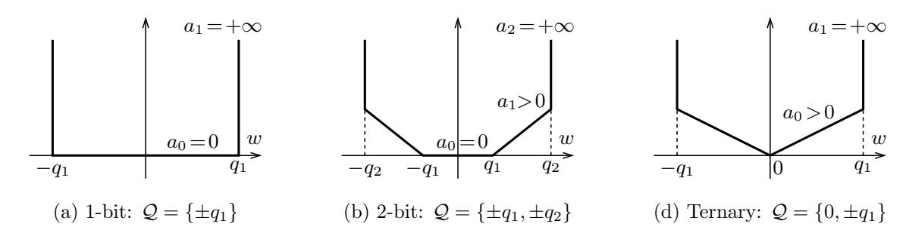

Figure 4: Three special cases of PAR for low-bit quantization.

is symmetric around zero for the convenience of presentation. It is straightforward to extend to the asymmetric case.

#### 2.1 Optimality conditions

In order to understand how PAR can induce quantization, we examine the optimality conditions of minimizing PAR-regularized functions. Suppose f is differentiable and  $w^*$  is a solution to the optimization problem (4). The first-order optimality condition for this problem is (see, e.g., Wright & Recht, 2022, Theorem 8.18)

$$0 \in \nabla f(w^*) + \lambda \partial \Psi(w^*),$$

where  $\partial \Psi(w^*)$  denotes the subdifferential of  $\Psi$  at  $w^*$ . For convenience, we rewrite it as  $\nabla f(w^*) \in -\lambda \, \partial \Psi(w^*)$ , which breaks down into the following cases:

$$w_i^* = -q_k, \qquad \Longleftrightarrow \qquad \nabla_i f(w^*) \in \lambda (a_{k-1}, a_k)$$

$$w_i^* \in (-q_k, -q_{k-1}) \implies \qquad \nabla_i f(w^*) = \lambda a_{k-1}$$

$$w_i^* = 0 \qquad \Longleftrightarrow \qquad -\nabla_i f(w^*) \in \lambda (-a_0, a_0)$$

$$w_i^* \in (q_{k-1}, q_k) \qquad \Longrightarrow \qquad \nabla_i f(w^*) = -\lambda a_{k-1}$$

$$w_i^* = q_k, \qquad \Longleftrightarrow \qquad \nabla_i f(w^*) \in \lambda (-a_k, -a_{k-1}).$$

Here the subscript i runs from 1 through d and k runs from 1 through m. The symbol  $\iff$  means that the left-hand side expression is a necessary (sufficient) condition for the right-hand side expression.

We immediately recognize that the sufficient condition for  $w_i^* = 0$  is the same as for the  $L_1$ -regularization  $\Psi(w) = \lambda \cdot a_0 ||w||_1$ . Further examination reveals that for any weight not clustered at a discrete value in  $\mathcal{Q}$ , i.e., if  $w_i^* \in (q_{k-1}, q_k)$ , the corresponding partial derivative of f must equal to one of the 2m discrete values  $\{\pm \lambda a_{k-1}\}_{k=1}^m$ . Conversely, almost all values of the partial derivatives of f, except for these 2m discrete values, can be balanced by assigning the model parameters at the 2m+1 discrete values in  $\mathcal{Q}$ . Intuitively, this implies that the model parameters at optimality are more likely to be clustered at these discrete values.

### 2.2 Proximal mapping of PAR

A fundamental tool for solving problem (4) is the proximal map of the regularizer  $\Psi$ , defined as

$$\mathbf{prox}_{\Psi}(u) = \mathop{\arg\min}_{w} \left\{ \Psi(w) + \frac{1}{2} \|w - u\|_2^2 \right\}.$$

<span id="page-6-1"></span>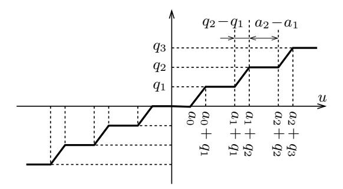

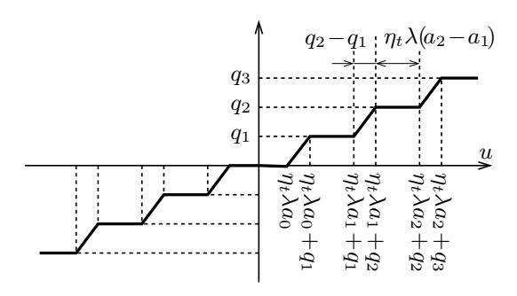

Figure 5: Graph of  $\mathbf{prox}_{\Psi}(u)$ .

Figure 6: Graph of  $\mathbf{prox}_{\eta_t \lambda \Psi}(u)$ .

See, e.g., Wright & Recht (2022, §8.6) for further details. For the PAR function defined in (6), its proximal map has the following closed-form solution (let  $a_{-1} = 0$ )

<span id="page-6-2"></span>
$$\mathbf{prox}_{\Psi}(u) = \begin{cases} \operatorname{sgn}(u)q_k & \text{if } |u| \in [a_{k-1} + q_k, \ a_k + q_k], \\ u - \operatorname{sgn}(u)a_k & \text{if } |u| \in [a_k + q_k, \ a_k + q_{k+1}]. \end{cases}$$
(7)

where  $sgn(\cdot)$  denote the sign or signum function.

Figure 5 shows the graph of  $\mathbf{prox}_{\Psi}(u)$ , which is clearly monotone non-decreasing in u. According to Yu et al. (2015, Proposition 3), a (possibly multivalued) map is a proximal map of some function if and only if it is compact-valued, monotone and has a closed graph. For example, the hard-quantization map in Figure 1 is the proximal map of the (nonconvex) indicator function  $\delta_{\mathcal{Q}}$  in (5). Dockhorn et al. (2021) work with monotone proximal maps directly without specifying the regularizer itself. In contrast, we construct a convex regularizer, and show that (somewhat surprisingly) it can effectively induce quantization and obtain competitive performance, with stronger convergence guarantees.

## <span id="page-6-0"></span>3 The Aggregate Prox (AProx) Algorithm

The regularization structure of problem (4) can be well exploited by the proximal gradient method

$$w^{t+1} = \mathbf{prox}_{\eta_t \lambda \Psi} \left( w^t - \eta_t \nabla f(w^t) \right), \tag{8}$$

where  $\mathbf{prox}_{\eta_t\lambda\Psi}$  is the proximal map of the scaled function  $\eta_t\lambda\Psi$ . Since  $\eta_t\lambda$  effectively scales the slopes  $\{a_k\}_{k=1}^m$  (with  $\mathcal{Q}$  fixed), we obtain  $\mathbf{prox}_{\eta_t\lambda\Psi}$  by simply replacing  $a_k$  in (7) with  $\eta_t\lambda a_k$ , and the proximal map is shown in Figure 6.

If f is convex and  $\nabla f$  is L-Lipschitz continuous, then using the constant step size  $\eta_t = 1/L$  leads to a convergence rate of O(1/k) (e.g., Wright & Recht, 2022, Theorem 9.6).

In machine learning context, we have  $f(w) = \mathbf{E}_z[f(w,z)]$  (see Section 1.1). The Prox-SGD method replaces  $\nabla f(w^t)$  with the stochastic gradient  $g^t := \nabla_w f(w^t, z^t)$ :

<span id="page-6-4"></span>
$$w^{t+1} = \mathbf{prox}_{\eta_t \lambda \Psi} \left( w^t - \eta_t g^t \right), \tag{9}$$

We assume that the step size  $\eta_t$  satisfies the following classical condition to ensure convergence (with bounded  $g^t$ ):

<span id="page-6-3"></span>
$$\eta_t \to 0 \quad \text{and} \quad \sum_{t=1}^{\infty} \eta_t = +\infty.$$
(10)

<span id="page-7-0"></span>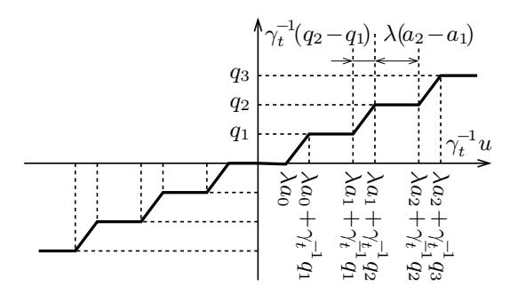

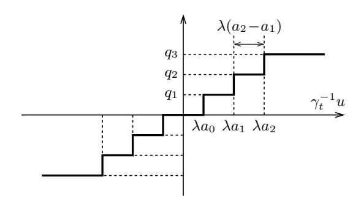

Figure 7:  $\mathbf{prox}_{\gamma_t \lambda \Psi}(u)$  with scaled input.

Figure 8: Asymptotic scaled map as  $\gamma_t \to 0$ .

In this case, the flat segments on the graph of  $\mathbf{prox}_{\eta_t \lambda \Psi}$ , as shown in Figure 6, with lengths  $\eta_t \lambda(a_k - a_{k-1})$ , will all shrink to zero when  $\eta_t \to 0$  (except at the two ends because  $a_m = +\infty$ ). Therefore, the graph converges to the identity map clipped flat outside of  $[-q_m, +q_m]$  and we lose the action of quantization. This issue parallels that of using Prox-SGD with  $L_1$ -regularization, which does not produce sparse solutions because of the shrinking deadzone in the soft-thresholding operator as  $\eta_t \to 0$  (Xiao, 2010).

To overcome the problem of diminishing regularization, we derive an Aggregate Proximal gradient (AProx) method. Aprox shares a similar form with BinaryConnect as presented in (3). Specifically, it replaces the hard-quantization map  $Q(\cdot)$  in (3) with an aggregate proximal map:

<span id="page-7-1"></span>
$$u^{t+1} = u^t - \eta_t g^t,$$
  

$$w^{t+1} = \mathbf{prox}_{\gamma_t \lambda \Psi}(u^{t+1}),$$
(11)

where  $\gamma_t = \sum_{s=1}^t \eta_s$ . Here  $\mathbf{prox}_{\gamma_t \lambda \Psi}$  is called an aggregate map because  $\lambda \Psi$  is scaled by the aggregate step size  $\gamma_t$ . In fact, BinaryConnect is a special case of AProx with  $\Psi$  being the indicator function of  $\mathcal{Q}^d$  given in (5). The indicator function and its proximal map (Figure 1) is invariant under arbitrary scaling, thus hiding the subtlety of aggregation.

The graph of  $\mathbf{prox}_{\gamma_t \lambda \Psi}$  can be obtained by replacing  $\eta_t$  in Figure 6 with  $\gamma_t$ . However, according to (10), we have

$$\gamma_t = \sum_{s=1}^t \eta_s \to +\infty,$$

which implies that the flat segments in the graph, now with lengths  $\gamma_t \lambda(a_k - a_{k-1})$ , grow larger and larger, which is *opposite* to the Prox-SGD method.

For the ease of visualization, we rescale the input u by  $\gamma_t^{-1}$  and obtain the graph in Figure 7. In this scaled graph, the lengths of the flat segments  $\lambda(a_k - a_{k-1})$  stay constant but the sloped segments, with lengths  $\gamma_t^{-1}(q_k - q_{k-1})$ , shrink as  $\gamma_t$  increases. Asymptotically, as  $\gamma_t \to \infty$ , the graph converges to hard quantization, as shown in Figure 8.

### 3.1 AProx versus Prox-SGD and ProxQuant

To better understand the difference between AProx and Prox-SGD, we rewrite Prox-SGD in (9) as

$$u^{t+1} = w^t - \eta_t g^t,$$
  

$$w^{t+1} = \mathbf{prox}_{\eta_t \lambda \Psi}(u^{t+1}),$$
(12)

which differ from AProx in (11) in two places (highlighted in blue). Here we give an intuitive interpretation of these differences. First notice that the objective in (4) is the sum of f and  $\lambda\Psi$ ,

and both methods make progress by using the stochastic gradient of f (forward step) and the proximal map of  $\lambda\Psi$  (backward step) — in a balanced manner.

- In Prox-SGD,  $u^{t+1}$  is a combination of  $w^t$  and  $-\eta_t g^t$ . But  $w^t$  already contains contributions from both f and  $\lambda\Psi$ , through  $\{-\eta_s g^s\}_{s=1}^{t-1}$  and  $\{\mathbf{prox}_{\eta_s\lambda\Psi}\}_{s=1}^{t-1}$  respectively. Therefore, from  $u^{t+1}$  to obtain  $w^{t+1}$ , we should use  $\mathbf{prox}_{\eta_t\lambda\Psi}$  to balance  $-\eta_t g^t$ .
- For AProx,  $u^{t+1}$  is used to accumulate  $\sum_{s=1}^{t} \eta_s g^s$ , solely contributed from f. Thus in computing  $w^{t+1}$ , we need to strike a balance with the contribution from  $\lambda \Psi$  with the aggregated strength  $\gamma_t = \sum_{s=1}^{t} \eta_s$ .

While the total contributions from the forward steps  $(-\eta_t g^t)$  and backward steps  $(\mathbf{prox}_{\lambda\Psi})$  are balanced in both cases, Prox-SGD spreads the backward steps on every iterate  $w_t$  so the quantization effect on the last iterate eventually diminishes. In contrast, AProx always applies an aggregate proximal map to generate the last iterate, in order to balance the accumulation of pure forward steps in  $u^{t+1}$ .

Dockhorn et al. (2021) used the regularization framework and proximal maps to demystify BinaryConnect/STE and developed a generalization called ProxConnect. It is derived from the generalized conditional gradient method (Yu et al., 2017), through the machinery of Fenchel-Rockafellar duality. We derived AProx as an direct extension of RDA (Xiao, 2010), but realized that it is indeed equivalent to ProxConnect, with some minor differences in setting  $\gamma_t$ . Nevertheless, our construction through balancing forward and backward steps provides a more intuitive understanding of the algorithm and may shed light on further development of structure-inducing optimization algorithms.

### 3.2 Convergence Analysis

To simplify the presentation, we define

$$F_{\lambda}(w) := \mathbf{E}_{z}[f(w,z)] + \lambda \Psi(w).$$

The following theorem concerns the convergence of AProx in terms of the weighted average  $\bar{w}^t = \frac{1}{\sum_{s=1}^{t} \eta_s} \sum_{s=1}^{t} \eta_s w^s$ . This result has appeared in Dockhorn et al. (2021, Cor. 5.2.). We include it here as a basis for proving last-iterate convergence and its proof in Appendix A.1 for completeness.

<span id="page-8-0"></span>**Theorem 3.1.** Assume that f(w, z) is convex in w for any z,  $\Psi$  is convex, and  $F_{\lambda}$  is continuous with Lipschitz constant G. Also, let  $W^{\star}$  be the set minimizers of  $F_{\lambda}(w)$ . Then,

- (a) If the stepsize  $\eta_t$  satisfies (10) and  $\{w_s\}_{s=1}^t$  are generated by algorithm (11), then the weighted average  $\bar{w}^t$  converges in expectation to a point in  $W^*$ .
- (b) Let  $w^0$  be an initial point,  $R = \min_{w^* \in \mathcal{W}^*} ||w^0 w^*||_2$  and the step size  $\eta_t = \frac{R}{2G} \sqrt{\frac{1}{t}}$ , then

$$\mathbf{E}\big[F_{\lambda}(\bar{w}^t)\big] - F_{\lambda}(w^{\star}) \leq GR \frac{2 + 1.5 \ln(t)}{\sqrt{t}},$$

where the expectation  $\mathbf{E}[\cdot]$  is taken with respect to the sequence of random variables  $\{w^1, \dots, w^t\}$ .

While convergence results on averaged iterates are conventional in the stochastic optimization literature, they are far from satisfactory for QAT. In particular, the averaged iterates  $\bar{w}^t$  are mostly not quantized even if every  $w^t$  is quantized.

<span id="page-9-2"></span>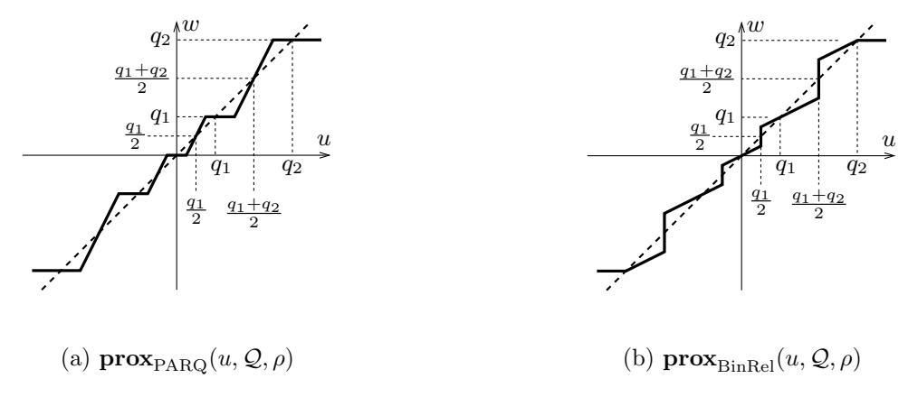

Figure 9: Proximal maps of PARQ and BinaryRelax.

In general, last-iterate convergence of stochastic/online algorithms is crucial for regularized optimization problems aiming for a structured solution (such as sparsity and quantization). Here we provide such a result for AProx.

<span id="page-9-1"></span>**Theorem 3.2** (Last-iterate convergence of AProx for convex optimization). Under the same assumptions as in Theorem 3.1, the last iterate  $w^t$  of AProx satisfies

$$\mathbf{E}\left[F_{\lambda}(w^{t})\right] - F_{\lambda}(w^{*}) \leq GR \frac{2 + 1.5\ln(t)}{\sqrt{t}}.$$

The proof of Theorem 3.2 is provided in Appendix A.2. We note that this convergence rate matches the average-iterate convergence rate established in Theorem 3.1.

## <span id="page-9-0"></span>4 PARQ: A Practical Implementation

A practical issue for implementing AProx is how to choose the PAR parameters  $\{q_k\}_{k=1}^m$  and  $\{a_k\}_{k=0}^{m-1}$ , as well as the regularization strength  $\lambda$ ; see their roles in the proximal map in Figure 7. In particular,  $\{q_k\}$  are the target quantization values for  $w^t$  and  $\lambda$  and  $\{a_k\}$  determine the quantization thresholds on the scaled input  $\gamma_t^{-1}u^t$ . In practice, it is very hard to choose these parameters a priori for different models and datasets. Therefore, we propose a heuristic approach to estimate the target values  $\{q_k\}$  online and at the same time avoid setting  $\lambda$  and  $\{a_k\}$  explicitly.

Given a vector  $u^t \in \mathbf{R}^d$ , we need to quantize it (element-wise) to a vector  $w^t \in \mathcal{Q}^d$  where  $w_i^t \in \mathcal{Q}$  for  $i = 1, \ldots, d$ . We use the least-squares binary quantization (LSBQ) approach Pouransari et al. (2020) to estimate the target quantization values in  $\mathcal{Q}$ . LSBQ employs a form of n-bit scaled binary quantization, i.e., let  $w_i = \sum_{j=1}^n v_j s_j(u_i)$  where each  $v_j \in \mathbf{R}_+$  satisfies  $v_1 \geq \cdots \geq v_n \geq 0$  and each  $s_j : \mathbf{R} \to \{-1, 1\}$  is a binary function. The optimal  $\{v_j, s_j(\cdot)\}_{j=1}^n$  for approximating  $u \in \mathbf{R}^d$  in the least-squares sense can be found by solving the problem:

minimize<sub>{
$$v_j, s_j(\cdot)$$
}</sub> 
$$\sum_{i=1}^d (u_i - \sum_{j=1}^n v_j s_j(u_i))^2$$
subject to 
$$v_1 \ge v_2 \ge \cdots \ge v_n \ge 0,$$
$$s_j : \mathbf{R} \to \{-1, 1\}, \ j = 1, \dots, n.$$

For n = 1 (1-bit quantization), the solution is well-known:  $v_1 = ||u||_1/d$  and  $s_1(u_i) = \operatorname{sgn}(u_i)$  (e.g., Rastegari et al., 2016). Pouransari et al. (2020) derived the solutions for the n = 2 case and the

#### <span id="page-10-1"></span>Algorithm 1 PARQ

```
\begin{aligned} &\textbf{input:}\ w^1 \in \mathbf{R}^d, \, \text{number of quantization bits } n, \\ &\text{step sizes } \{\eta_t\}_{t=1}^T, \, \text{slope schedule } \{\rho_t^{-1}\}_{t=1}^T \\ &\textbf{initialize:}\ u^1 = w^1 \\ &\textbf{for } t = 1, 2, \dots, T-1 \ \textbf{do} \\ &u^{t+1} = u^t - \eta_t \, \nabla f(w^t, z^t) \\ &\mathcal{Q}^{t+1} = \mathrm{LSBQ}(u^{t+1}, n) \\ &w^{t+1} = \mathbf{prox}_{\mathrm{PARQ}}(u^{t+1}, \mathcal{Q}^{t+1}, \rho_t) \\ &\textbf{end for} \\ &\textbf{output:}\ w^T \end{aligned}
```

ternary case  $(n=2 \text{ with } v_1=v_2)$ ; see also Yin et al. (2019b). For n>2, there is no closed-form solution, but Pouransari et al. (2020) gives a simple greedy algorithm for foldable representations, which satisfy  $s_j(u_i) = \operatorname{sgn}(u_i - \sum_{\ell=1}^{j-1} v_\ell s_\ell(u_i))$  for all  $j=1,\ldots,n$ .

Once a set of (exact or approximate) solution  $\{v_j\}_{j=1}^n$  is obtained, the resulting quantization values can be written in the form  $\pm v_1 \pm \cdots \pm v_n$  by choosing either + or - between the adjacent operands. For example, the largest and smallest values in  $\mathcal{Q} = \{\pm q_1, \ldots, \pm q_m\}$  are  $q_m = v_1 + \cdots + v_n$  and  $-q_m = -v_1 - \cdots - v_n$ . Since there are n binary bits, the total number of target values is  $|\mathcal{Q}| = 2^n$ .

The selection of  $\{a_k\}$  and  $\lambda$  is somewhat arbitrary and not consequential. We can choose them so that the asymptotic graph in Figure 8 matches the hard-quantization map depicted in Figure 1. That is, we can let  $\lambda a_k = (q_k + q_{k+1})/2$ , but never really use them once  $\mathcal{Q}$  is found by LSBQ.

While in theory we require  $\gamma_t = \sum_{s=1}^t \eta_s \to +\infty$ , in practice it can only reach a not-very-large constant due to a finite number of iterations we run with diminishing step sizes. Therefore its effect on scaling the horizontal axis in Figures 7 and 8 is limited and can be absorbed by tuning the step size. On the other hand, we would like the proximal map to be able to converge to hard-quantization by the end of training (so we have fully quantized solutions). For this purpose, we use an independent schedule for growing the slope of the slanted segments. Specifically, we emulate the proximal map in Figure 7 with the one in Figure 9(a), where  $\mathcal{Q}$  is calculated from LSBQ, and  $\rho$  is the slope of the slanted segments. For convenience, we specify a schedule for the *inverse slope*  $\rho_t^{-1}$  to vary monotonically from 1 to 0 during T steps of training (so the slope  $\rho_t$  go to infinity). For example,  $\rho_t^{-1}$  can follow a cosine decay schedule, or one in the sigmoid family as shown at the bottom of Figure 10.

Putting everything together, we have PARQ in Algorithm 1.

## <span id="page-10-0"></span>5 Experiments

We train convolutional and vision-transformer models on image classification tasks across five bitwidths: ternary (T) and 1–4 bits. For each model and bit-width pair, we compare PARQ to two QAT methods: STE/BinaryConnect (Courbariaux et al., 2015) and BinaryRelax (Yin et al., 2018).

Specifically, STE/BinaryConnect uses the hard-quantization map in Figure 1, PARQ applies the proximal map in Figure 9(a) with slope annealing, and BinaryRelax effectively uses the one in Figure 9(b) where the slope of slanted segments gradually decreases to 0. We note that  $\mathbf{prox}_{PARQ}$  is the proximal map of a convex PAR, but STE and  $\mathbf{prox}_{BinRel}$  do not correspond to convex regularization.

<span id="page-11-0"></span>

| Depth         | # bits | STE         | BinaryRelax | PARQ        |
|---------------|--------|-------------|-------------|-------------|
| 20<br>(91.82) | 1      | 89.56 ±0.18 | 89.98 ±0.13 | 90.48 ±0.26 |
|               | T      | 90.94 ±0.15 | 91.25 ±0.07 | 91.45 ±0.11 |
|               | 2      | 91.22 ±0.15 | 91.57 ±0.06 | 91.71 ±0.03 |
|               | 3      | 91.84 ±0.22 | 91.77 ±0.05 | 91.97 ±0.04 |
|               | 4      | 91.93 ±0.04 | 91.92 ±0.16 | 91.84 ±0.02 |
| 56<br>(93.08) | 1      | 91.55 ±0.33 | 91.75 ±0.37 | 91.34 ±0.37 |
|               | T      | 92.42 ±0.09 | 92.34 ±0.23 | 92.97 ±0.15 |
|               | 2      | 92.72 ±0.27 | 92.30 ±0.40 | 92.77 ±0.10 |
|               | 3      | 92.73 ±0.44 | 92.86 ±0.40 | 92.45 ±0.44 |
|               | 4      | 92.34 ±0.23 | 92.59 ±0.10 | 92.49 ±0.16 |

Table 1: ResNet test accuracy on CIFAR-10.

Each entry in Tables [1–](#page-11-0)[3](#page-12-0) shows the mean and standard dev-iation of test accuracies over three randomly seeded runs. Full-precision (FP) accuracy is shown in parentheses under each model depth/size.

We provide an open-source PyTorch package <https://github.com/facebookresearch/parq>, which implements PARQ and several other popular QAT methods and can reproduce the results presented in this section.

### 5.1 ResNet on CIFAR-10

We first evaluate quantized ResNet-20 and ResNet-56 [He et al.](#page-22-10) [\(2016\)](#page-22-10) on CIFAR-10. All weights, including those in the final projection layer, are quantized. We train for 200 epochs using SGD with 0.9 momentum and 2e−4 weight decay. Following [Zhu et al.](#page-24-4) [\(2022\)](#page-24-4), the 0.1 learning rate decays by a factor of 10 at epochs 80, 120, and 150.

As shown in Table [1,](#page-11-0) PARQ performs competitively to STE and BinaryRelax across all bitwidths. For 1-bit ResNet-20, it outperforms STE by nearly one accuracy point. It is the only QAT method for ternary ResNet-56 reaching within ∼0.1 points of full-precision accuracy.

## <span id="page-11-2"></span>5.2 ResNet on ImageNet

<span id="page-11-1"></span>For QAT of ResNet-50 [He et al.](#page-22-10) [\(2016\)](#page-22-10) on ImageNet, we quantize all residual block weights per channel by computing Q row-wise over tensors. We use SGD with 0.1 learning rate, 0.9 momentum, and 1e−4 weight decay. The learning rate decays by a factor of 10 every 30 epochs.

| Depth         | # bits | STE         | BinaryRelax | PARQ        |
|---------------|--------|-------------|-------------|-------------|
| 50<br>(75.60) | 1      | 66.17 ±0.04 | 66.14 ±0.28 | 66.71 ±0.13 |
|               | T      | 70.94 ±0.19 | 71.59 ±0.11 | 71.35 ±0.21 |
|               | 2      | 72.38 ±0.10 | 72.64 ±0.17 | 72.43 ±0.03 |
|               | 3      | 73.58 ±0.09 | 74.02 ±0.09 | 73.91 ±0.13 |
|               | 4      | 74.52 ±0.04 | 74.58 ±0.04 | 74.52 ±0.01 |

Table 2: Quantized ResNet-50 test accuracy on ImageNet.

<span id="page-12-0"></span>

| Size          | # bits | STE         | BinaryRelax | PARQ        |
|---------------|--------|-------------|-------------|-------------|
| Ti<br>(71.91) | 1      | 51.62 ±0.18 | 52.62 ±0.03 | 52.51 ±0.19 |
|               | T      | 61.43 ±0.08 | 62.18 ±0.11 | 60.99 ±0.07 |
|               | 2      | 64.81 ±0.15 | 65.20 ±0.04 | 65.32 ±0.06 |
|               | 3      | 69.02 ±0.11 | 69.26 ±0.03 | 69.47 ±0.04 |
|               | 4      | 70.95 ±0.11 | 71.06 ±0.09 | 71.21 ±0.11 |
| S<br>(79.80)  | 1      | 70.07 ±0.03 | 70.69 ±0.07 | 71.06 ±0.02 |
|               | T      | 75.83 ±0.06 | 76.02 ±0.03 | 76.30 ±0.06 |
|               | 2      | 77.40 ±0.01 | 77.43 ±0.04 | 77.63 ±0.04 |
|               | 3      | 79.02 ±0.14 | 79.11 ±0.07 | 79.04 ±0.04 |
|               | 4      | 79.57 ±0.04 | 79.55 ±0.12 | 79.61 ±0.04 |
| B<br>(81.73)  | 1      | 78.79 ±0.03 | 79.02 ±0.03 | 79.35 ±0.04 |
|               | T      | 80.50 ±0.01 | 80.61 ±0.08 | 80.62 ±0.01 |
|               | 2      | 80.73 ±0.17 | 80.81 ±0.14 | 80.84 ±0.06 |
|               | 3      | 80.54 ±0.20 | 80.94 ±0.05 | 80.59 ±0.12 |
|               | 4      | 80.45 ±0.10 | 80.76 ±0.12 | 80.35 ±0.19 |

Table 3: Quantized DeiT test accuracy on ImageNet.

Similar to the experiments on CIFAR-10, PARQ performs capably against STE and BinaryRelax in Table [2.](#page-11-1) It shows a slight advantage in the most restrictive 1-bit case, achieving a half-point margin over the other two methods.

### 5.3 DeiT on ImageNet

Applying QAT to a different architecture, we experiment with Data-efficient image Transformers [\(Touvron et al., 2021,](#page-23-11) DeiT). Our DeiT experiments include the Ti, S, and B model sizes with 5M, 22M, and 86M parameters, respectively. Attention block weights are quantized channel-wise as in Section [5.2.](#page-11-2) Embeddings, layer normalization parameters, and the final projection weights are left at full precision, following the setting of [Rastegari et al.](#page-23-6) [\(2016\)](#page-23-6).

We use AdamW [Loshchilov & Hutter](#page-22-11) [\(2018\)](#page-22-11) to train for 300 epochs with a 5e−4 learning rate and 0.05 weight decay. We hold the learning rate at 1e−8 for the final 20 epochs (after PARQ and BinaryRelax converge to hard-quantization); this boosts performance relative to the default 1e−5 minimum. We apply RandAugment [Cubuk et al.](#page-21-10) [\(2020\)](#page-21-10) and all prior regularization strategies [Zhang et al.](#page-24-5) [\(2018\)](#page-24-5); [Yun et al.](#page-24-6) [\(2019\)](#page-24-6) except repeated augmentation [Berman et al.](#page-21-11) [\(2019\)](#page-21-11).

We observe in Table [3](#page-12-0) that PARQ's performance trends stay true across model sizes. For 1 bit DeiT-S, PARQ improves upon STE accuracy by a full point. Figure [10](#page-13-0) shows the training loss curves of three different QAT methods along with full precision (FP) training on the DeiT-Ti model. We observe that in the initial phase, PARQ closely follows the FP curve because the slope of the slanted segments in its proximal map (Figure [9\(a\)\)](#page-9-2) is close to 1. Then the training loss of PARQ increases due to the relatively sharp transition of the slope, and it follows the STE curve closely as its proximal map converges to hard quantization. Figure [11](#page-13-1) gives snapshots of how PAR gradually induces quantization in model parameters: compare the middle stage plot with Figure [9\(a\)\)](#page-9-2) and the late stage plot with Figure [1.](#page-1-0)

<span id="page-13-0"></span>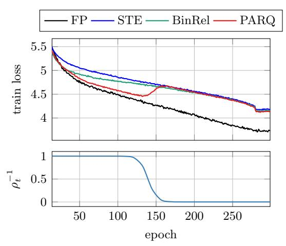

<span id="page-13-1"></span>Figure 10: Training loss curves for 2-bit DeiT-Ti model (top) and the inverse-slope schedule ρ −1 t used by PARQ (bottom).

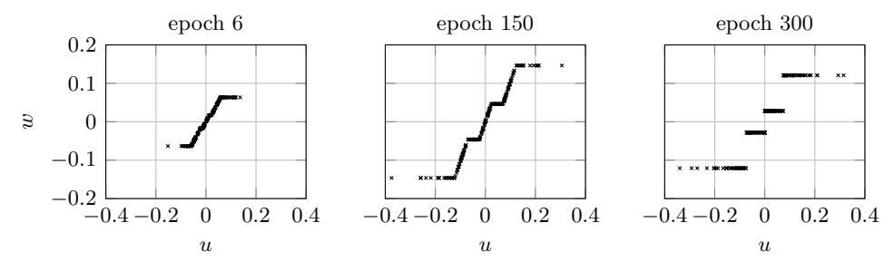

Figure 11: PARQ proximal maps during early, middle, and late stages of training 2-bit DeiT-Ti (value weights from an attention layer).

## 6 Conclusion

We developed a principled approach for quantization-aware training (QAT) based on a framework of convex, piecewise-affine regularization (PAR). In order to avoid the diminishing regularization effect of the standard proximal SGD method, we derive an aggregate proximal (AProx) algorithm and prove its last-iterate convergence.

Our experiments demonstrate that PARQ achieves competitive performance compared with QAT methods that correspond to using nonconvex regularization. Compared with using hardquantization (STE) throughout the training process, the gradual evolution of PARQ from piecewiseaffine soft quantization to hard quantization helps the training process to be more stable, and often converges to better local minima. This is more evident in the most demanding cases of low-bit quantization of smaller models.

## A Convergence analysis

#### <span id="page-14-0"></span>A.1 Proof of Theorem 3.1

We consider the framework of online convex optimization, which is more general than stochastic optimization. In particular, let  $f_t = f(\cdot, z^t)$  be a function presented to us at each iteration t = 1, 2, ..., and  $\Psi$  be a regularization function that we use throughout the whole process. The two-step presentation of AProx in (11) can be written in one-step as

$$w^{t+1} = \underset{w \in \mathcal{W}}{\operatorname{arg\,min}} \left\{ \sum_{s=1}^{t} \eta_s \left( \langle g^s, w \rangle + \lambda \Psi(w) \right) + \frac{1}{2} \|w - w^0\|_2^2 \right\}, \tag{13}$$

where  $w^0$  is the initial weight vector and  $g^t = \nabla f_t(w^t)$ . Moreover, we use a more general distance generating function h to replace  $(1/2)\|\cdot\|_2^2$ , and define the Bregman divergence as

$$D_h(u, w) = h(u) - h(w) - \langle \nabla h(w), u - w \rangle.$$

With Bregman divergence, a more general form of AProx can be written as

<span id="page-14-3"></span>
$$w^{t+1} = \underset{w \in \mathcal{W}}{\operatorname{arg\,min}} \left\{ \sum_{s=1}^{t} \left( \eta_s \langle g^s, w \rangle + \lambda \Psi(w) \right) + D_h(w, w^0) \right\}. \tag{14}$$

<span id="page-14-1"></span>**Assumption A.1.** We make the following assumptions:

- <span id="page-14-4"></span>(a) Each loss function  $f_t$  is convex and Lipschitz continuous with Lipschitz constant  $G_f$ .
- <span id="page-14-5"></span>(b) The regularizer  $\Psi$  is convex and Lipschitz continuous with Lipschitz constant  $G_{\Psi}$ .
- <span id="page-14-2"></span>(c) The function h is differentiable and strongly convex with convexity parameter  $\rho$ .

It follows from Assumption A.1(c) that  $D_h(u, w)$  is strongly convex in w with convexity parameter  $\rho$ .

<span id="page-14-6"></span>**Theorem A.2** (Regret bound for AProx). Under Assumption A.1, for any  $w \in \mathbf{R}^d$ , it holds that

<span id="page-14-7"></span>
$$\sum_{s=1}^{t} \eta_s \left( f_s(w^s) + \lambda \Psi(w^s) - f_s(w) - \lambda \Psi(w) \right) \le \frac{(G_f + \lambda G_{\Psi})^2}{\rho} \sum_{s=1}^{t} 2\eta_s^2 + D_h(w, w^0). \tag{15}$$

*Proof.* We adapt the proof of Bubeck (2015, Theorem 4.3) by adding the regularizer  $\Psi$  and replacing the term  $h(w) - h(w^0)$  with  $D_h(w, w^0)$ . An advantage of this replacement is that we can use any initial point  $w^0$  while the proof in Xiao (2010); Bubeck (2015) requires  $w^0 = \arg \min h(w)$ .

Let  $w^0 \in \mathbf{R}^d$  be an arbitrary initial point and define  $\psi_0(w) = D_h(w, w^0)$ . For  $t \ge 1$ , define

$$\psi_t(w) := \sum_{s=1}^t \eta_s (\langle g^s, w \rangle + \lambda \Psi(w)) + D_h(w, w^0).$$

The AProx algorithm (14) can be expressed as, for  $t \geq 0$ ,

$$w^{t+1} = \underset{w}{\operatorname{arg\,min}} \ \psi_t(w).$$

Since Dh(w, w<sup>0</sup> ) is strongly convex in w with convexity parameter ρ, the same property holds for ψ<sup>t</sup> for all t ≥ 0. According to a basic result on minimizing strongly convex functions (e.g., [Chen &](#page-21-13) [Teboulle, 1993,](#page-21-13) Lemma 3.2) and the fact that w <sup>t</sup>+1 minimizes ψ<sup>t</sup> , we have

<span id="page-15-1"></span>
$$\psi_t(w^{t+1}) \le \psi_t(w) - \frac{\rho}{2} \|w - w^{t+1}\|^2, \qquad t = 0, 1, 2, \dots$$
(16)

From the definition of ψ<sup>t</sup> and ψt−1, we have

<span id="page-15-0"></span>
$$\psi_t(w^t) - \psi_t(w^{t+1}) = \psi_{t-1}(w^t) - \psi_{t-1}(w^{t+1}) + \eta_t(\langle g^t, w^t - w^{t+1} \rangle + \lambda \Psi(w^t) - \lambda \Psi(w^{t+1})).$$
 (17)

For the left-hand side of [\(17\)](#page-15-0), we apply [\(16\)](#page-15-1) to obtain

$$\frac{\rho}{2} \| w^{t+1} - w^t \|^2 \le \psi_t(w^t) - \psi_t(w^{t+1}).$$

For the first term on the right-hand side of [\(17\)](#page-15-0), we apply [\(16\)](#page-15-1) again for ψt−<sup>1</sup> to obtain

$$\psi_{t-1}(w^t) - \psi_{t-1}(w^{t+1}) \le -\frac{\rho}{2} \|w^{t+1} - w^t\|^2.$$

For the second term on the right-hand side of [\(17\)](#page-15-0), we have

$$\langle g^{t}, w^{t} - w^{t+1} \rangle + \lambda \Psi(w^{t}) - \lambda \Psi(w^{t+1}) \leq \|g^{t}\|_{*} \|w^{t+1} - w^{t}\| + \lambda \Psi(w^{t}) - \lambda \Psi(w^{t+1})$$

$$\leq G_{f} \|w^{t+1} - w^{t}\| + \lambda G_{\Psi} \|w^{t+1} - w^{t}\|$$

$$= (G_{f} + \lambda G_{\Psi}) \|w^{t+1} - w^{t}\|, \tag{18}$$

where in the first inequality we used H¨older's inequality, and in the second inequality we used Assumptions [A.1](#page-14-1)[\(a\)](#page-14-4) and [A.1](#page-14-1)[\(b\)](#page-14-5) respectively. Combining the above three inequalities with [\(17\)](#page-15-0), we get

$$\rho \|w^{t+1} - w^t\|^2 \le \eta_t (G_f + \lambda G_{\Psi}) \|w^{t+1} - w^t\|,$$

which further implies

<span id="page-15-2"></span>
$$||w^{t+1} - w^t|| \le \eta_t (G_f + \lambda G_{\Psi})/\rho.$$

Combining this with [\(18\)](#page-15-2) yields

<span id="page-15-4"></span>
$$\langle g^t, w^t - w^{t+1} \rangle + \lambda \Psi(w^t) - \lambda \Psi(w^{t+1}) \le \eta_t (G_f + \lambda G_\Psi)^2 / \rho. \tag{19}$$

Next we prove that the following inequality holds for all w ∈ R<sup>d</sup> and all t ≥ 0:

<span id="page-15-3"></span>
$$\sum_{s=1}^{t} \eta_s (\langle g^s, w^{s+1} \rangle + \lambda \Psi(w^{s+1})) \le \sum_{s=1}^{t} \eta_s (\langle g^s, w \rangle + \lambda \Psi(w)) + D_h(w, w^0).$$
 (20)

We proceed by induction. For the base case t = 0, the desired inequality becomes Dh(w, w<sup>0</sup> ) ≥ 0, which is always true by the definition of Dh. Now we suppose [\(20\)](#page-15-3) holds for t−1 and apply it with  $w = w^{t+1}$  in the first inequality below:

$$\sum_{s=1}^{t} \eta_{s} (\langle g^{s}, w^{s+1} \rangle + \lambda \Psi(w^{s+1}))$$

$$= \sum_{s=1}^{t-1} \eta_{s} (\langle g^{s}, w^{s+1} \rangle + \lambda \Psi(w^{s+1})) + \eta_{t} (\langle g^{t}, w^{t+1} \rangle + \lambda \Psi(w^{t+1}))$$

$$\leq \sum_{s=1}^{t-1} \eta_{s} (\langle g^{s}, w^{t+1} \rangle + \lambda \Psi(w^{t+1})) + D_{h}(w^{t+1}, w^{0}) + \eta_{t} (\langle g^{t}, w^{t+1} \rangle + \lambda \Psi(w^{t+1}))$$

$$= \sum_{s=1}^{t} \eta_{s} (\langle g^{s}, w^{t+1} \rangle + \lambda \Psi(w^{t+1})) + D_{h}(w^{t+1}, w^{0})$$

$$\leq \sum_{s=1}^{t} \eta_{s} (\langle g^{s}, w \rangle + \lambda \Psi(w)) + D_{h}(w, w^{0}), \quad \forall w \in \mathcal{W}.$$

In the last inequality above, we recognized the definition of  $\psi_t$  and used the fact that  $w^{t+1}$  is the minimizer of  $\psi_t$ . This finishes the proof of (20).

Finally we add  $\sum_{s=1}^{t} \eta_s (\langle g^s, w^s \rangle + \Psi(w^s))$  to both sides of (20) and rearrange terms to obtain

$$\sum_{s=1}^{t} \eta_s \left( \langle g^s, w^s - w \rangle + \lambda \Psi(w^s) - \lambda \Psi(w) \right) \le \sum_{s=1}^{t} \eta_s \left( \langle g^s, w^s - w^{s+1} \rangle + \lambda \Psi(w^s) - \lambda \Psi(w^{s+1}) \right) + D_h(w, w^0). \tag{21}$$

For the left-hand side of (21), we use convexity of  $f_s$  to obtain

$$f_s(w^s) - f_s(w) \le \langle g^s, w^s - w \rangle.$$

For the right-hand side of (21), we apply (19) to obtain

$$\sum_{s=1}^{t} \eta_s (\langle g^s, w^s - w^{s+1} \rangle + \lambda \Psi(w^s) - \lambda \Psi(w^{s+1})) \le \frac{(G_f + \lambda G_{\Psi})^2}{\rho} \sum_{s=1}^{t} \eta_s^2.$$

Combining the above three inequalities together, we have

$$\sum_{s=1}^{t} \eta_s (f_s(w^s) + \Psi(w^s) - f_s(w) - \lambda \Psi(w)) \le \frac{(G_f + \lambda G_{\Psi})^2}{\rho} \sum_{s=1}^{t} \eta_s^2 + D_h(w, w^0).$$

<span id="page-16-0"></span>

This finishes the proof of Theorem A.2.

Now we consider the stochastic optimization problem of minimizing  $f(w) + \lambda \Psi(w)$  where the loss function  $f(w) := \mathbf{E}_z[f(w,z)]$ . We can regard the sequence of loss functions  $f_t$  in the online optimization setting as  $f(\cdot,z^t)$  and compare with  $w^* = \arg\min f(w) + \lambda \Psi(w)$ . In this case, the regret bound (15) becomes

$$\sum_{s=1}^{t} \eta_s (f(w^s, z^s) + \lambda \Psi(w^s) - f(w^*, z^s) - \lambda \Psi(w^*)) \le \frac{(G_f + \lambda G_{\Psi})^2}{\rho} \sum_{s=1}^{t} \eta_s^2 + D_h(w^*, w^0).$$

Using a standard online-to-stochastic conversion argument (e.g., Xiao, 2010, Theorem 3), we can derive

<span id="page-17-1"></span>
$$\sum_{s=1}^{t} \eta_s \left( \mathbf{E} \left[ f(w^s) + \lambda \Psi(w^s) \right] - f(w^*) - \lambda \Psi(w^*) \right) \le \frac{(G_f + \lambda G_{\Psi})^2}{\rho} \sum_{s=1}^{t} \eta_s^2 + D_h(w^*, w^0), \tag{22}$$

where the expectation  $\mathbf{E}[\cdot]$  is taken with respect to the random variables  $\{w^1, \dots, w^t\}$ , which in turn depends on  $\{z^1, \dots, z^t\}$ .

For the ease of presentation, we denote  $R^2 = \min_{w \in \mathcal{W}} D_h(w, w^0)$ . Moreover, we define a weighted average of all iterates up to iteration t:

$$\bar{w}^t = \frac{1}{\sum_{s=1}^t \eta_s} \sum_{s=1}^t \eta_s w^s.$$

Then by convexity of f and  $\Psi$ , we obtain

<span id="page-17-0"></span>
$$\mathbf{E}[f(\bar{w}^t) + \lambda \Psi(\bar{w}^t)] - f(w^*) - \lambda \Psi(w^*) \le \frac{\frac{(G_f + \lambda G_\Psi)^2}{\rho} \sum_{s=1}^t \eta_s^2 + R^2}{\sum_{s=1}^t \eta_s}.$$
 (23)

Constant stepsize. If the total number of iterations T is known ahead of time, then we can choose an optimal constant stepsize. Let  $\eta_s = \eta$  for all s = 1, ..., T, then the bound in (23) becomes

$$\frac{\frac{(G_f + \lambda G_{\Psi})^2}{\rho} T \eta^2 + R^2}{T \eta} = \frac{(G_f + \lambda G_{\Psi})^2}{\rho} \eta + \frac{R^2}{T \eta}.$$

In order to minimize the above bound, we take  $\eta = \frac{R}{G_f + \lambda G_\Psi} \sqrt{\frac{\rho}{T}}$  and obtain

$$\mathbf{E}[f(\bar{w}^T) + \lambda \Psi(\bar{w}^T)] - f(w^*) - \lambda \Psi(w^*) \leq 2(G_f + \lambda G_{\Psi})R\sqrt{\frac{1}{\rho T}}.$$

**Diminishing stepsize.** The right-hand side of (23) has the same form as the convergence rate bound for the classical stochastic gradient or subgradient method (e.g., Nesterov, 2004, Section 3.2.3). A classical sufficient condition for convergence is

$$\sum_{s=1}^{\infty} \eta_s = +\infty, \qquad \sum_{s=1}^{\infty} \eta_s^2 < +\infty.$$

In particular, if we take  $\eta_t = \frac{R}{2(G_f + \lambda G_{\Psi})} \sqrt{\frac{\rho}{t}}$ , we have

$$\mathbf{E}\big[f(\bar{w}^t) + \lambda \Psi(\bar{w}^t)\big] - f(w^\star) - \lambda \Psi(w^\star) \leq (G_f + \lambda G_\Psi) R \frac{(2 + 1.5 \ln(t))}{\sqrt{\rho t}}.$$

Finally, Theorem 3.1 is obtained with some simplification. In particular, if we choose the Bregman divergence as the Euclidean distance  $\frac{1}{2}\|\cdot\|_2^2$ , then we have  $\rho=1$ . This leads to

$$\mathbf{E}\big[f(\bar{w}^t) + \lambda \Psi(\bar{w}^t)\big] - f(w^\star) - \lambda \Psi(w^\star) \leq GR \frac{(2 + 1.5 \ln(t))}{\sqrt{t}},$$

where  $G := G_f + \lambda G_{\Psi}$ . This completes the proof.

### <span id="page-18-0"></span>A.2 Proof of Theorem [3.2](#page-9-1)

For simplicity, we denote Fλ(w) = f(w) + λΨ(w) and G = G<sup>f</sup> + λG<sup>Ψ</sup> where G<sup>f</sup> and G<sup>Ψ</sup> are the Lipschitz constants of f and Ψ, respectively.

To establish the last-iterate convergence of AProx, we first introduce the following lemma, which connects the convergence of the last iteration to the convergence of the average iteration.

<span id="page-18-1"></span>Lemma A.3 (Lemma 1 in [Orabona](#page-23-13) [\(2020\)](#page-23-13)). Given that {ηt} T <sup>t</sup>=1 is a non-increasing positive sequence and {qt} T <sup>t</sup>=1 is a nonnegative sequence, the following inequality holds

$$\eta_T q_T \leqslant \frac{1}{T} \sum_{t=1}^T \eta_t q_t + \sum_{k=1}^{T-1} \frac{1}{k(k+1)} \sum_{t=T-k+1}^T \eta_t \left( q_t - q_{T-k} \right).$$
(24)

Upon setting q<sup>t</sup> = E -Fλ(w t ) − Fλ(w ∗ ) in Lemma [A.3,](#page-18-1) we derive that

$$\eta_{T}\left(\mathbf{E}\left[F_{\lambda}(w^{T})\right] - F_{\lambda}(w^{*})\right) \leq \frac{1}{T} \sum_{t=1}^{T} \eta_{t}\left(\mathbf{E}\left[F_{\lambda}(w^{t})\right] - F_{\lambda}(w^{*})\right) + \sum_{k=1}^{T-1} \frac{1}{k(k+1)} \sum_{t=T-k+1}^{T} \eta_{t} \mathbf{E}\left[F_{\lambda}(w^{t}) - F_{\lambda}(w^{T-k})\right].$$
(25)

For the first term on the right-hand side, we apply Equation [22,](#page-17-1) which yields

$$\frac{1}{T} \sum_{t=1}^{T} \eta_t \left( \mathbf{E} \left[ F_{\lambda}(w^t) \right] - F_{\lambda}(w^*) \right) \le \frac{G^2}{\rho T} \sum_{t=1}^{T} \eta_t^2 + \frac{D_h(w^*, w^0)}{T}.$$
 (26)

To control the second term, we note that for any 1 ≤ k ≤ T − 1

$$\sum_{t=T-k+1}^{T} \eta_t \mathbf{E} \left[ F_{\lambda}(w^t) - F_{\lambda}(w^{T-k}) \right] = \sum_{t=T-k}^{T} \eta_t \mathbf{E} \left[ F_{\lambda}(w^t) - F_{\lambda}(w^{T-k}) \right] \le \frac{G^2}{\rho} \sum_{t=T-k}^{T} \eta_t^2.$$
 (27)

Here we apply Equation [22](#page-17-1) again for the last inequality upon setting w <sup>⋆</sup> = w <sup>T</sup> <sup>−</sup><sup>k</sup> and use the fact that Dh(w, w) = 0 for all w ∈ W.

Combining the above two components together, we have

<span id="page-18-2"></span>
$$\mathbf{E}\left[F_{\lambda}(w^{T})\right] - F_{\lambda}(w^{*}) \leq \frac{G^{2}}{\eta_{T}\rho} \left(\frac{1}{T} \sum_{t=1}^{T} \eta_{t}^{2} + \sum_{k=1}^{T-1} \frac{1}{k(k+1)} \sum_{t=T-k}^{T} \eta_{t}^{2}\right) + \frac{D_{h}(w^{*}, w^{0})}{\eta_{T}T}.$$
 (28)

Constant stepsize. If the total number of iterations T is known ahead of time, then we can choose an optimal constant stepsize. Let η<sup>t</sup> = η for all s = 1, . . . , T, then the bound in [\(28\)](#page-18-2) becomes

$$\mathbf{E}\left[F_{\lambda}(w^{T})\right] - F_{\lambda}(w^{*}) \le \frac{G^{2}}{\rho} \left(1 + \sum_{k=1}^{T-1} \frac{1}{k}\right) \eta + \frac{D_{h}(w^{*}, w^{0})}{\eta T} \le \frac{G^{2}}{\rho} \left(2 + \ln(T)\right) \eta + \frac{D_{h}(w^{*}, w^{0})}{\eta T}. \tag{29}$$

Here we use the fact that P<sup>n</sup> k=1 1 <sup>k</sup> ≤ 1 + ln(n) for all n ≥ 1. In order to minimize the above bound, we take η = 1 G qDh(w∗,w0)ρ (2+ln(T))T and obtain

$$\mathbf{E}\left[F_{\lambda}(w^{T})\right] - F_{\lambda}(w^{*}) \le 2G\sqrt{\frac{D_{h}(w^{*}, w^{0})(2 + \ln(T))}{\rho T}}.$$
(30)

**Diminishing stepsize.** Suppose we set the stepsize  $\eta_t = \frac{\eta}{\sqrt{t}}$ . Then, Equation 28 reduces to

<span id="page-19-0"></span>
$$\mathbf{E}\left[F_{\lambda}(w^{T})\right] - F_{\lambda}(w^{*}) \leq \frac{\eta\sqrt{T}G^{2}}{\rho} \left(\frac{1}{T}\sum_{t=1}^{T}\frac{1}{t} + \sum_{k=1}^{T-1}\frac{1}{k(k+1)}\sum_{t=T-k}^{T}\frac{1}{t}\right) + \frac{D_{h}(w^{*}, w^{0})}{\eta\sqrt{T}}$$

$$\leq \frac{\eta\sqrt{T}G^{2}}{\rho} \left(\frac{1 + \ln(T)}{T} + \sum_{k=1}^{T-1}\frac{1}{k(k+1)}\sum_{t=T-k}^{T}\frac{1}{t}\right) + \frac{D_{h}(w^{*}, w^{0})}{\eta\sqrt{T}}.$$
(31)

To proceed, note that

$$\sum_{t=T-k+1}^{T} \frac{1}{t} \le \int_{T-k}^{T} \frac{1}{t} dt = \ln\left(\frac{T}{T-k}\right) = \ln\left(1 + \frac{k}{T-k}\right) \le \frac{k}{T-k}.$$
 (32)

Therefore, we have

$$\sum_{k=1}^{T-1} \frac{1}{k(k+1)} \sum_{t=T-k}^{T} \frac{1}{t} = \sum_{k=1}^{T-1} \frac{1}{k(k+1)} \left( \frac{1}{T-k} + \sum_{t=T-k+1}^{T} \frac{1}{t} \right)$$

$$\leq \sum_{k=1}^{T-1} \frac{1}{k(T-k)}$$

$$= \sum_{k=1}^{T-1} \frac{1}{kT} + \sum_{k=1}^{T-1} \frac{1}{T(T-k)}$$

$$= 2 \sum_{k=1}^{T-1} \frac{1}{kT}$$

$$\leq 2 \frac{1 + \ln(T)}{T}.$$

$$(33)$$

Invoking this result into Equation 31, we further have

$$\mathbf{E}\left[F_{\lambda}(w^{T})\right] - F_{\lambda}(w^{*}) \le \frac{3\eta G^{2}(1 + \ln(T))}{\rho\sqrt{T}} + \frac{D_{h}(w^{*}, w^{0})}{\eta\sqrt{T}}.$$
(34)

Hence, upon setting  $\eta = \frac{1}{G} \sqrt{\frac{D_h(w^*, w^0)\rho}{2}}$ , we derive that

$$\mathbf{E}\left[F_{\lambda}(w^{T})\right] - F_{\lambda}(w^{*}) \le G\left(2\sqrt{2} + \frac{3}{\sqrt{2}}\ln(T)\right)\sqrt{\frac{D_{h}(w^{*}, w^{0})}{\rho T}}.$$
(35)

Specifically, if we choose the Bregman divergence as the Euclidean distance  $\frac{1}{2}\|\cdot\|_2^2$ , then we have  $\rho = 1$ . Upon defining  $R = \min_{w^{\star} \in \mathcal{W}^{\star}} \|w^0 - w^{\star}\|_2$ , we have

$$\mathbf{E}\left[F_{\lambda}(w^{T})\right] - F_{\lambda}(w^{*}) \le GR \frac{\left(2 + \frac{3}{2}\ln(T)\right)}{\sqrt{T}}.$$
(36)

<span id="page-20-0"></span>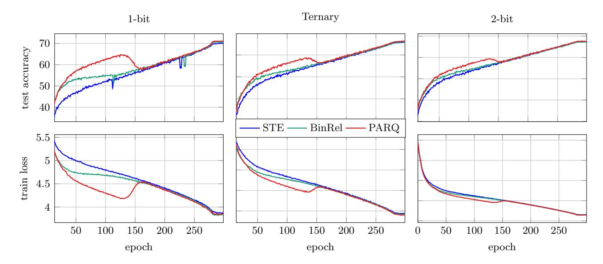

Figure 12: DeiT-S test accuracy (top row) and train loss (bottom row) across several bit-widths (columns).

<span id="page-20-1"></span>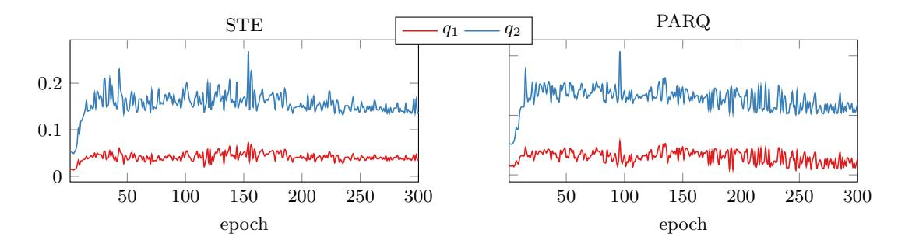

Figure 13: Evolution of {q1, q2} (estimated by LSBQ) during training of a 2-bit DeiT-Ti model.

## B Additional experiment results

Figure [12](#page-20-0) presents accuracy and training loss curves for QAT of DeiT-S. The top left plot reveals that PARQ often has stabler training dynamics. It does not suffer from the sudden accuracy drops seen in STE and BinaryRelax. This could be due to PARQ's more gradual annealing in the first half of training. It performs the most consistently on DeiT-S, suggesting the relative performance of QAT methods may vary by model size.

Figure [13](#page-20-1) shows the evolution of {q1, q2} (estimated by LSBQ) during training of a 2-bit DeiT-Ti model. They are from the same layer as the one used in Figure [11](#page-13-1) and with the same weight initialization. It is clear that magnitudes of Q start small from randomly initialized weights, expand rapidly in early stages of training, then slowly contract in later epochs.

## References

- <span id="page-21-7"></span>Ajanthan, T., Gupta, K., Torr, P., Hartley, R., and Dokania, P. Mirror descent view for neural network quantization. In International Conference on Artificial Intelligence and Statistics, pp. 2809–2817. PMLR, 2021.
- <span id="page-21-3"></span>Bai, H., Zhang, W., Hou, L., Shang, L., Jin, J., Jiang, X., Liu, Q., Lyu, M., and King, I. Binary-BERT: Pushing the limit of BERT quantization. In Proceedings of the 59th Annual Meeting of the Association for Computational Linguistics and the 11th International Joint Conference on Natural Language Processing (Volume 1: Long Papers), pp. 4334–4348, 2021.
- <span id="page-21-6"></span>Bai, Y., Wang, Y.-X., and Liberty, E. ProxQuant: Quantized neural networks via proximal operators. In Proceedings of the 7th International Conference on Learning Representations (ICLR), New Orleans, May 2019.
- <span id="page-21-4"></span>Bengio, Y., L´eonard, N., and Courville, A. Estimating or propagating gradients through stochastic neurons for conditional computation, August 2013. arXiv:1308.3432.
- <span id="page-21-11"></span>Berman, M., J´egou, H., Vedaldi, A., Kokkinos, I., and Douze, M. Multigrain: a unified image embedding for classes and instances. arXiv preprint arXiv:1902.05509, 2019.
- <span id="page-21-9"></span>Boyd, S. and Vandenberghe, L. Convex optimization. Cambridge University Press, 2004.
- <span id="page-21-12"></span>Bubeck, S. Convex optimization: Algorithms and complexity. Foundations and Trends® in Machine Learning, 8(3-4):231–357, 2015. ISSN 1935-8237. doi: 10.1561/2200000050. URL <https://doi.org/10.1561/9781601988614>.
- <span id="page-21-0"></span>Cai, Y., Yao, Z., Dong, Z., Gholami, A., Mahoney, M. W., and Keutzer, K. ZeroQ: A novel zero shot quantization framework. In Proceedings of the IEEE/CVF Conference on Computer Vision and Pattern Recognition, pp. 13169–13178, 2020.
- <span id="page-21-8"></span>Carreira-Perpi˜n´an, M. A. and Idelbayev, Y. Model compression as constrained optimization, with ´ application to neural nets. Part II: Quantization, 2017. arXiv:1707.04319.
- <span id="page-21-1"></span>Chee, J., Cai, Y., Kuleshov, V., and De Sa, C. M. QuIP: 2-bit quantization of large language models with guarantees. Advances in Neural Information Processing Systems, 36, 2024.
- <span id="page-21-13"></span>Chen, G. and Teboulle, M. Convergence analysis of a proximal-like minimization algorithm using Bregman functions. SIAM Journal on Optimization, 3(3):538–543, 1993. doi: 10.1137/0803026. URL <https://doi.org/10.1137/0803026>.
- <span id="page-21-5"></span>Courbariaux, M., Bengio, Y., and David, J.-P. BinaryConnect: Training deep neural networks with binary weights during propagations. In Advances in Neural Information Processing Systems, volume 28, Montr´eal, Canada, December 2015.
- <span id="page-21-10"></span>Cubuk, E. D., Zoph, B., Shlens, J., and Le, Q. V. RandAugment: Practical automated data augmentation with a reduced search space. In Proceedings of the IEEE/CVF Conference on Computer Vision and Pattern Recognition Workshops, pp. 702–703, 2020.
- <span id="page-21-2"></span>Dettmers, T. and Zettlemoyer, L. The case for 4-bit precision: k-bit inference scaling laws. In International Conference on Machine Learning, pp. 7750–7774. PMLR, 2023.

- <span id="page-22-8"></span>Dockhorn, T., Yu, Y., Sari, E., Zolnouri, M., and Partovi Nia, V. Demystifying and generalizing binaryconnect. Advances in Neural Information Processing Systems, 34:13202–13216, 2021.
- <span id="page-22-6"></span>Esser, S. K., McKinstry, J. L., Bablani, D., Appuswamy, R., and Modha, D. S. Learned step size quantization. In International Conference on Learning Representations (ICLR), 2019.
- <span id="page-22-3"></span>Fan, A., Stock, P., Graham, B., Grave, E., Gribonval, R., Jegou, H., and Joulin, A. Training with quantization noise for extreme model compression. In International Conference on Learning Representations (ICLR), 2021.
- <span id="page-22-2"></span>Fournarakis, M., Nagel, M., Amjad, R. A., Bondarenko, Y., van Baalen, M., and Blankevoort, T. Quantizing neural networks. In Thiruvathukal, G. K., Lu, Y.-H., Kim, J., Chen, Y., and Chen, B. (eds.), Low-Power Computer Vision: Improve the Efficiency of Artificial Intelligence, chapter 11, pp. 235–272. CRC Press, 2022.
- <span id="page-22-1"></span>Gholami, A., Kim, S., Dong, Z., Yao, Z., Mahoney, M. W., and Keutzer, K. A survey of quantization methods for efficient neural network inference. In Thiruvathukal, G. K., Lu, Y.-H., Kim, J., Chen, Y., and Chen, B. (eds.), Low-Power Computer Vision: Improve the Efficiency of Artificial Intelligence, chapter 13, pp. 291–326. CRC Press, 2022.
- <span id="page-22-0"></span>Han, S., Mao, H., and Dally, W. J. Deep compression: Compressing deep neural network with pruning, trained quantization and Huffman coding. In Proceedings of the 4th International Conference on Learning Representations (ICLR), San Juan, Puerto Rico, 2016. URL <http://arxiv.org/abs/1510.00149>.
- <span id="page-22-10"></span>He, K., Zhang, X., Ren, S., and Sun, J. Deep residual learning for image recognition. In Proceedings of the IEEE conference on computer vision and pattern recognition, pp. 770–778, 2016.
- <span id="page-22-5"></span>Hubara, I., Courbariaux, M., Soudry, D., El-Yaniv, R., and Bengio, Y. Quantized neural networks: Training neural networks with low precision weights and activations. Journal of Machine Learning Research, 18(187):1–30, 2018.
- <span id="page-22-7"></span>Li, H., De, S., Xu, Z., Studer, C., Samet, H., and Goldstein, T. Training quantized nets: A deeper understanding. In Advances in Neural Information Processing Systems, volume 31, pp. 5813–5823, 2017.
- <span id="page-22-4"></span>Liu, Z., Oguz, B., Pappu, A., Xiao, L., Yih, S., Li, M., Krishnamoorthi, R., and Mehdad, Y. BiT: Robustly binarized multi-distilled transformer. In Koyejo, S., Mohamed, S., Agarwal, A., Belgrave, D., Cho, K., and Oh, A. (eds.), Advances in Neural Information Processing Systems, volume 35, pp. 14303–14316. Curran Associates, Inc., 2022. URL [https://dl.acm.org/doi/a](https://dl.acm.org/doi/abs/10.5555/3600270.3601310) [bs/10.5555/3600270.3601310](https://dl.acm.org/doi/abs/10.5555/3600270.3601310).
- <span id="page-22-11"></span>Loshchilov, I. and Hutter, F. Decoupled weight decay regularization. In International Conference on Learning Representations (ICLR), 2018.
- <span id="page-22-9"></span>Lu, Y., Yu, Y., Li, X., and Partovi Nia, V. Understanding neural network binarization with forward and backward proximal quantizers. In Oh, A., Naumann, T., Globerson, A., Saenko, K., Hardt, M., and Levine, S. (eds.), Advances in Neural Information Processing Systems, volume 36, pp. 40468–40486. Curran Associates, Inc., 2023.

- <span id="page-23-4"></span>Martinez, B., Yang, J., Bulat, A., and Tzimiropoulos, G. Training binary neural networks with real-to-binary convolutions. In International Conference on Learning Representations, 2019.
- <span id="page-23-1"></span>Nagel, M., Amjad, R. A., Van Baalen, M., Louizos, C., and Blankevoort, T. Up or down? Adaptive rounding for post-training quantization. In International Conference on Machine Learning, pp. 7197–7206. PMLR, 2020.
- <span id="page-23-12"></span>Nesterov, Y. Introductory Lectures on Convex Optimization: A Basic Course. Kluwer Academic Publishers, 2004.
- <span id="page-23-13"></span>Orabona, F. Last iterate of SGD converges (even in unbounded domains), 2020. URL [https:](https://parameterfree.com/2020/08/07/last-iterate-of-sgd-converges-even-in-unbounded-domains/) [//parameterfree.com/2020/08/07/last-iterate-of-sgd-converges-even-in-unbounded](https://parameterfree.com/2020/08/07/last-iterate-of-sgd-converges-even-in-unbounded-domains/) [-domains/](https://parameterfree.com/2020/08/07/last-iterate-of-sgd-converges-even-in-unbounded-domains/).
- <span id="page-23-10"></span>Pouransari, H., Tu, Z., and Tuzel, O. Least squares binary quantization of neural networks. In Proceedings of the IEEE/CVF Conference on Computer Vision and Pattern Recognition Workshops, pp. 698–699, 2020. URL <https://doi.org/10.1109/cvprw50498.2020.00357>.
- <span id="page-23-5"></span>Qin, H., Gong, R., Liu, X., Shen, M., Wei, Z., Yu, F., and Song, J. Forward and backward information retention for accurate binary neural networks. In Proceedings of the IEEE/CVF Conference on Computer Vision and Pattern Recognition, pp. 2250–2259, 2020.
- <span id="page-23-3"></span>Qin, H., Ding, Y., Zhang, M., Yan, Q., Liu, A., Dang, Q., Liu, Z., and Liu, X. BiBERT: Accurate fully binarized BERT. In Proceedings of International Conference on Learning Representations (ICLR), 2022.
- <span id="page-23-6"></span>Rastegari, M., Ordonez, V., Redmon, J., and Farhadi, A. XNor-net: ImageNet classification using binary convolutional neural networks. In European Conference on Computer Vision, pp. 525–542. Springer, 2016.
- <span id="page-23-0"></span>Sze, V., Chen, Y.-H., Yang, T.-J., and Emer, J. S. Efficient processing of deep neural networks: A tutorial and survey. Proceedings of the IEEE, 105(12):2295–2329, 2017.
- <span id="page-23-11"></span>Touvron, H., Cord, M., Douze, M., Massa, F., Sablayrolles, A., and J´egou, H. Training dataefficient image transformers & distillation through attention. In International Conference on Machine Learning, pp. 10347–10357. PMLR, 2021.
- <span id="page-23-8"></span>Wright, S. J. and Recht, B. Optimization for Data Analysis. Cambridge University Press, Cambridge, 2022.
- <span id="page-23-9"></span>Xiao, L. Dual averaging methods for regularized stochastic learning and online optimization. Journal of Machine Learning Research, 11(88):2543–2596, 2010. URL [http://jmlr.org/paper](http://jmlr.org/papers/v11/xiao10a.html) [s/v11/xiao10a.html](http://jmlr.org/papers/v11/xiao10a.html).
- <span id="page-23-2"></span>Yao, Z., Yazdani Aminabadi, R., Zhang, M., Wu, X., Li, C., and He, Y. ZeroQuant: Efficient and affordable post-training quantization for large-scale transformers. Advances in Neural Information Processing Systems, 35:27168–27183, 2022.
- <span id="page-23-7"></span>Yin, P., Zhang, S., Lyu, J., Osher, S., Qi, Y., and Xin, J. BinaryRelax: A relaxation approach for training deep neural networks with quantized weights. SIAM Journal on Imaging Sciences, 11 (4):2205–2223, 2018. https://doi.org/10.1137/18M1166134.

- <span id="page-24-0"></span>Yin, P., Lyu, J., Zhang, S., Osher, S. J., Qi, Y., and Xin, J. Understanding straight-through estimator in training activation quantized neural nets. In Proceedings of International Conference on Learning Representations (ICLR), 2019a. URL [https://openreview.net/forum?id=Skh4](https://openreview.net/forum?id=Skh4jRcKQ) [jRcKQ](https://openreview.net/forum?id=Skh4jRcKQ).
- <span id="page-24-3"></span>Yin, P., Zhang, S., Qi, Y., and Xin, J. Quantization and training of low bit-width convolutional neural networks for object detection. Journal of Computational Mathematics, 37:349–359, 2019b.
- <span id="page-24-1"></span>Yu, Y., Zheng, X., Marchetti-Bowick, M., and Xing, E. Minimizing Nonconvex Non-Separable Functions. In Lebanon, G. and Vishwanathan, S. V. N. (eds.), Proceedings of the Eighteenth International Conference on Artificial Intelligence and Statistics, volume 38 of Proceedings of Machine Learning Research, pp. 1107–1115, San Diego, California, USA, 09–12 May 2015. PMLR. URL <https://proceedings.mlr.press/v38/yu15.html>.
- <span id="page-24-2"></span>Yu, Y., Zhang, X., and Schuurmans, D. Generalized conditional gradient for sparse estimation. Journal of Machine Learning Research, 18(144):1–46, 2017. URL [http://jmlr.org/papers/v1](http://jmlr.org/papers/v18/14-348.html) [8/14-348.html](http://jmlr.org/papers/v18/14-348.html).
- <span id="page-24-6"></span>Yun, S., Han, D., Oh, S. J., Chun, S., Choe, J., and Yoo, Y. Cutmix: Regularization strategy to train strong classifiers with localizable features. In Proceedings of the IEEE/CVF International Conference on Computer Vision, pp. 6023–6032, 2019.
- <span id="page-24-5"></span>Zhang, H., Cisse, M., Dauphin, Y. N., and Lopez-Paz, D. mixup: Beyond empirical risk minimization. In Proceedings of International Conference on Learning Representations (ICLR), 2018.
- <span id="page-24-4"></span>Zhu, C., Han, S., Mao, H., and Dally, W. J. Trained ternary quantization. In International Conference on Learning Representations, 2022.