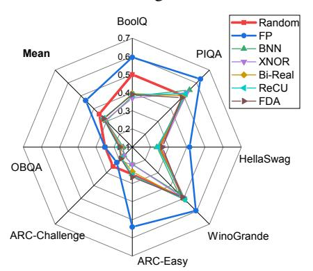
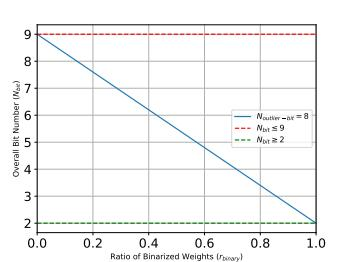
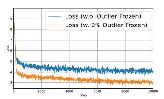
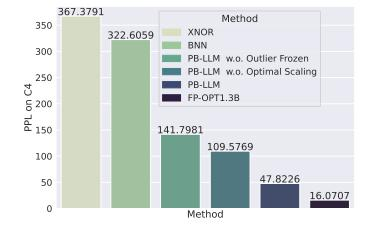
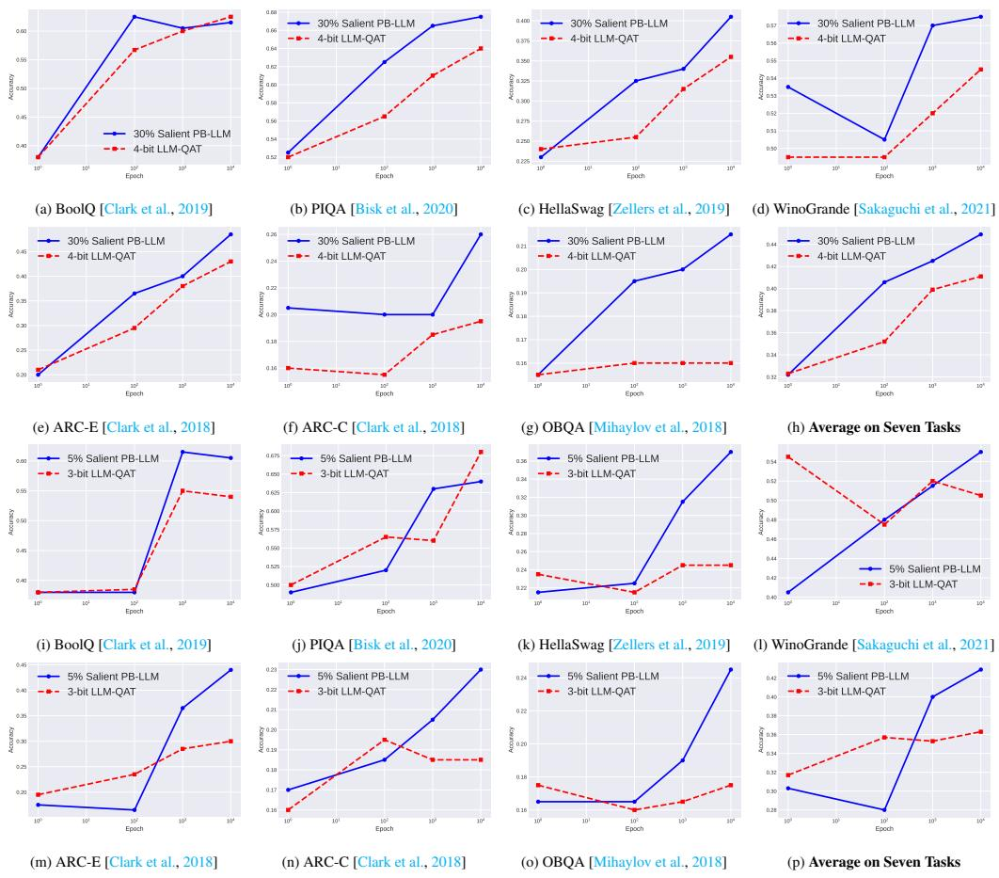

# 3 PARTIALLY BINARIZING LARGE LANGUAGE MODELS (PB-LLM)

In this section, we elaborate on the methodology of Partially Binarizing Large Language Models, named PB-LLM. To begin, a review of the foundational framework of binarized neural networks is presented, showcasing its applicability and limitation to LLM quantization. Subsequently, a novel format for the quantized matrix is formulated, specifically tailored for the binarization of LLMs. Taking advantage of the proposed partially-binarized weight matrix, we delve into its potential in the realms of post-training quantization and training-aware training for LLMs, to break the trade-off between bit-width and performance. It is crucial to note that, due to constraints in computational resources, the methodology exploration predominantly utilizes OPT-1.3B [\[Zhang et al.,](#page-9-2) [2022\]](#page-9-2) to perform the majority of experiments. Given the space constraints, this section primarily focuses on key

aspects of the methodology. For detailed discussions, exact result values, and specific implementation details in codes, readers are referred to the supplemental materials.

#### 3.1 PRELIMINARY: NETWORK BINARIZATION

To begin with, we briefly review the general concept of network binarization and binarized neural networks (BNNs) in [Courbariaux et al., 2016, Hubara et al., 2016]. As most optimizable quantized structures of LLMs are linear layers (see Fig. 1a) in LLMs, we use a one-layer Perceptron to show the training and inference processes of the BNN. The one-layer neural network is defined as  $f(\mathbf{x}) = (\mathbf{W})(\mathbf{a})$ , where  $\mathbf{a} \in \mathbb{R}^{d_i}$  is the input activation and  $\mathbf{W} : \mathbb{R}^{d_i} \longmapsto \mathbb{R}^{d_o}$  stands for the weight matrix, with  $d_i$  and  $d_o$  representing the sizes of the input and output of the layer, respectively.

The goal of network binarization is to represent floating-point (FP) weights, denoted as  $W_F$ , and/or FP activations  $a_F$  as 1-bit (*i.e.*, .,  $\pm 1$ ) values [Qin et al., 2020b]. Networks utilizing this representation are referred to as BNNs. BNNs diverge from FP neural networks in their forward operations and in the approximation of backward gradients. In the forward propagation, the sign function is used for binarizing FP values of weights:

Forward: 
$$\operatorname{sign}(x) = \begin{cases} +1 & x \ge 0 \\ -1 & x < 0. \end{cases} \tag{1}$$

Specifically, in the training process of binarized network, the BNN maintains FP latent weights  $\mathbf{W}_F$  for gradient updates, and the updated weight matrix  $\mathbf{W}_F$  is binarized into the binary weight matrix  $\mathbf{W}_B$  via the binarize function  $\mathtt{sign}(\cdot)$ , i.e.  $\mathbf{W}_B = \mathtt{sign}(\mathbf{W}_F)$ . Then the intermediate activation map (full-precision) of this layer is produced by  $\mathbf{A}_{F,o} = \mathbf{W}_B \mathbf{A}_{F,i}$ . For inference efficiency, BNNs with 1-bit weights significantly reduce the memory cost of inference. Theoretically, BNNs can binarize both weights and activations to 1-bit, providing a 32x compression in memory cost and a 64x acceleration in inference speed, by replacing FP multiplications in conventional floating-point networks with Xnor-Bitcount operations. However, recent studies highlight that the weights of LLMs as the main contributor to memory overhead [Kim et al., 2023], and thus we primarily aim to curtail memory costs. Therefore, in this pivotal exploration of binarized LLMs, our attention is specifically centered on weight binarization, foregoing the simultaneous binarization of weights and activations.

In the backward propagation, the main challenge is that the pervasive sign functions are theoretically non-differentiable, and thus extremely destroy the gradient chain in the backward propagation. To address this problem, researchers widely exploit the straight-through estimator (STE) [Bengio et al., 2013] to numerically approximate the derivative of the whole BNN [Qin et al., 2020b], *i.e.*,

$$\text{Backward:} \quad \frac{\partial \mathcal{L}}{\partial x} = \left\{ \begin{array}{ll} \frac{\partial \mathcal{L}}{\partial \text{sign}(x)} & \quad |x| \leq 1 \\ 0 & \quad |x| > 1, \end{array} \right.$$

which makes the optimization of BNN accessible.

We first investigate the **possibility of implementing binarization to LLM quantization**. Specifically, following the binarization benchmark in BiBench [Qin et al., 2023], we generalize some representative binarization methods into LLM quantization scenarios. BNN [Hubara et al., 2016], XNOR [Rastegari et al., 2016], Bi-Real [Liu et al., 2020b], ReCU [Xu et al., 2021a] and FDA [Xu et al., 2021b] are re-implemented to quantize LLMs, particularly to OPT [Zhang et al., 2022]. Training details are illustrated in the Sec. 4. The results evaluated on seven zero-shot

Figure 2: We implement five renowned binarization methods on LLMs and assess the resultant binarized LLMs across seven zeroshot common sense reasoning tasks. Random represents the hypothetical worst baseline, indicating random guesses, while FP stands as the optimal baseline, representing full-precision OPT-1.3B. The exact values corresponding to this radar graph are detailed in the Appendix.

common sense reasoning tasks are shown in Fig. 2. We can see that the LLMs binarized via the existing popular binarization algorithms perform worse than random guesses, showing that the existing binarization methods are not suitable for LLM binarization.

#### 3.2 PARTIALLY BINARIZED WEIGHT MATRIX

In the low-bit quantization of Transformers, a significant challenge is managing the salient weights, as they can unnecessarily extend the quantization range [Kovaleva et al., 2021]. Several outlier-aware quantization methods have been explored to tackle this issue [Dettmers et al., 2022, Wei et al., 2022, Kim et al., 2023, Lin et al., 2023]. Notably, SqueezeLLM [Kim et al., 2023] provides a generalized methodology for handling outliers in weight values during 4-bit LLM post-training quantization. Concurrently, AWQ [Lin et al., 2023] demonstrates that preserving only 1% of significant weights can benefit 4-bit LLM quantization. Motivated by existing research, this study also seeks to optimize the treatment of salient weights while binarizing most of weights. We present Partially-Binarized LLMs (PB-LLM), a method involving the selective binarization of the LLMs' weight matrix, wherein a minor fraction of weights is kept in high bits for enhanced language capacity.

#### 3.2.1 SALIENT WEIGHT: CRITERIA, GRANULARITY, AND COST

Beyond the most straightforward method of choosing salient weights—selecting based on magnitude element-wise—we conduct a thorough investigation into salient weight detection from two perspectives: criteria and granularity. For criteria, we compare Magnitude- and Hessian-based methods, and for granularity, we explore both element-wise and column-wise approaches. In addition, we discuss the cost of storing matrix weights in a mixed-precision manner.

Criteria: Magnitude vs. Hessian. Beyond the identification of salient weights through magnitude, alternative criteria have also been examined. The Hessian metric emerges as a crucial factor in LLM quantization, as elucidated in [Dong et al., 2019, Frantar et al., 2022, Frantar and Alistarh, 2023], particularly in relation to post-training quantization for LLMs (details regarding the Hessian criteria for PTQ can be found in Sec. 3.3). However, we observe that the selection of salient weights, whether by magnitude or Hessian, does not significantly impact the efficacy of PTQ. Consequently, magnitude is elected as the preferred criterion for the identification of salient weights in both PTQ and QAT, primarily due to its simplicity and efficacy in distinguishing critical weight components.

**Granularity: Element-wise vs. Column-wise.** Our investigations reveal that adopting a column-wise approach for selecting salient weights has the potential to impair the performance of binarization. Visualization of the salient weights' distribution within the matrix, as depicted in Fig. 3 (where the white dots represent the filtered salient weights), disclosed a random and uniform scattering of these weights. Given the absence of any discernable column-wise pattern in the distribution of salient weights, a column-wise filtration method is deemed unsuitable. This scattered and uniform distribution necessitates an element-wise approach for effective filtration in the binarization process.

Figure 3: Distribution of 5% salient weight.

Salient Weight Storing Cost. The additional overhead for storing the salient weights is acceptable. The overall bit number,  $N_{bit}$  must adhere to the following condition:

$$N_{bit} \leq \underbrace{1 * r_{binary}}_{\text{for binary weights}} + \underbrace{N_{salient-bit} * (1 - r_{binary})}_{\text{for index storing, could be optimized}}, \qquad (3)$$

Here,  $r_{binary}$  denotes the ratio of the binarized weights,  $N_{salient-bit}$  represents the number of bits allocated for storing salient weights (e.g., 8 bits), and the additional 1 bit is allocated for using the bitmap mechanism [Chan and Ioannidis, 1998] for index saving. It's important to note that employing bitmap for index storage is not the most efficient method and can be optimized further using sparse matrix storage methods such as Compressed Sparse Row (CSR) or Compressed Sparse Column (CSC) [Borštnik et al., 2014]; hence the use of  $\leq$  instead of = in Eq. 3. Given this research's emphasis on the theoretical aspects of binarization for LLM quantization, we do not delve into saving the cost of storing the index. The relationship between the ratio of salient weights and the overall bit number is illustrated in Fig. 4, depicting that a lower ratio corresponds to a

Figure 4: Variation in overall bit number  $N_{bit}$  with the ratio of the salient weights  $r_{binary}$ , where salient weights are stored in 8-bit.

reduced overall bit number. For example, retaining 10% of weights in 8 bits and binarizing the remaining 90% equates to, at most, a 2.7-bit quantization.

Table 1: Perplexity of C4 on OPT-1.3B quantized with RTN (without GPTQ) and PB-GPTQ. Magnitude criteria or Hessian criteria is used for detecting salient weights.

| Salient Fraction        | 50%     | 20%       | 10%       | 5%        |
|-------------------------|---------|-----------|-----------|-----------|
| RTN Magnitude           | 24.5675 | 5892.0898 | 4889.0385 | 8023.1132 |
| RTN Hessian             | 20.2512 | 2109.8522 | 7508.7788 | 6173.1611 |
| PB-GPTQ Magnitude       | 18.3674 | 46.4093   | 895.0322  | 2880.6157 |
| PB-GPTQ Hessian         | 17.7567 | 42.1157   | 165.6767  | 528.4877  |
| PB-GPTQ Magnitude g=128 | 18.0293 | 57.2164   | 1230.8537 | 2662.7114 |
| PB-GPTQ Hessian g=128   | 17.6000 | 45.9811   | 157.8825  | 646.3616  |

#### 3.3 POST-TRAINING QUANTIZATION FOR PB-LLMS

After defining the partially-binarized matrix format, the next step is to recover the performance (*i.e.*, the reasoning capacity in the literature of LLMs) of the quantized PB-LLM. In this section, we explore the weight binarization with post-training quantization (PTQ) methods. PTQ methods hold a prominent position in the realm of quantization techniques for LLMs due to their ease of implementation. They enable direct quantization of pre-trained LLMs without the need for a training dataset and additional training overhead. Therefore, we first explore the weight binarization within the PTQ framework.

GPTQ [Frantar et al., 2022] is the most efficient and effective method for weight quantization [Zhu et al., 2023], capable of quantizing LLMs to 4-bit or even 2-bit. Therefore, we generalize the idea of GPTQ to the partial-binarization setting. Specifically, GPTQ quantizes the weights in LLM layer-by-layer to minimize the layer-wise quantization error:

$$\underset{\hat{\mathbf{W}}}{\arg\min} ||\mathbf{W}\mathbf{X} - \hat{\mathbf{W}}\mathbf{X}||_2^2 \tag{4}$$

GPTQ quantizes a weight  $w_q$  to  $\hat{w}_q$ , calculates the compensation  $\delta_{-q}$  for remaining weights  $w_{-q}$ , and then applies the compensation factor to the remaining weights:

$$\delta_{-q} = \frac{w_q - \hat{w}_q}{[\mathbf{H}^{-1}]_{qq}} \cdot (\mathbf{H}^{-1})_{:,q}, \qquad w_{-q} := w_{-q} + \delta_{-q}, \tag{5}$$

where the  $\mathbf{H}$  is the Hessian matrix of the layer-wise quantization error with respect to the weights and  $w_q$  is the q-th value in flattened weight matrix  $\mathbf{W}$ . In GPTQ, weights are quantized iteratively and the remaining weights are updated until all weights have been quantized.

We propose to use GPTQ to iteratively bianrize the un-salient weights and quantize the salient weights to higher bit, and then apply the compensation to the remaining weights. Specifically, we first detect the salient weights  $\mathbf{W}^{sal}$  and un-salient (to-be-binarized) weights  $\mathbf{W}^{unsal}$  in the weight matrix  $\mathbf{W} = \mathbf{W}^{sal} + \mathbf{W}^{unsal}$ . Drawing inspiration from SparseGPT [Frantar and Alistarh, 2023], we calculate the saliency metric, represented as  $v_i = w_i^2/[\mathbf{H}^{-1}]_{ii}^2$ , for the purpose of detecting salient weights using Hessian criterion. The un-salient weights will be binarized to  $\hat{\mathbf{W}}^{unsal}$ , and the salient weights will be quantized to higher bit  $\hat{\mathbf{W}}^{sal}$ . We use asymmetric per-channel quantization for both salient and un-salient weights. For un-salient weight, we use the per-channel mean as zero point and calculate the optimal scaling factor  $\alpha$  for the un-salient weights using the method in Sec. 3.4.2. We use MinMax metric to calibrate the scaling factor and zero point for salient weights.

In the quantization process, we iteratively quantize the columns in the weight matrix W. For each column, we binarize the un-salient weights and quantize the salient weights, and then calculate the compensation for remaining weights, and then apply the compensation factor to the remaining columns of weights. This process is repeated until all the weights are quantized. The proposed method is denoted as PB-GPTQ. We also explore the fine-grained PB-GPTQ, which quantizes the weights in a group-wise manner. Specifically, the weight matrix is split into several groups, each group contains g columns. In each group, we detect the salient weights and un-salient weights, and then calibrate to set the scaling factor and zero point using the weights in this group.

The results are listed in Tab. 1. PB-GPTQ is significantly better than RTN. We note that the Hessian-based PB-GPTQ exhibits a superior performance compared to the Magnitude criterion PB-GPTQ. The group-wise PB-GPTQ performs better or worse than the non-group-wise PB-GPTQ, but the difference is not significant. Our analysis suggests that the disparity in scaling factors is not the primary determinant of binarization performance; hence, the introduction of group-wise methodology does not yield an enhancement in binarization performance. Subsequently, our next endeavor will involve the application of QAT to reduce the error introduced by weight binarization.

#### 3.4 QUANTIZATION-AWARE TRAINING FOR PB-LLMS

In order to further enhance the reasoning capacity of the Partially-Binarized Large Language Models (PB-LLM), we extend our exploration by employing Quantization-aware Training (QAT) to meticulously train the quantized models. Because LLM training is difficult, we desire that PB-LLM training could be as efficient as possible. To realize efficient training for PB-LLM, we propose the Salient Weights Frozen and Optimal Scaling Factor for Binary Weights, targeting the salient weights and binarized weights, respectively.

#### 3.4.1 SALIENT WEIGHTS FROZEN

To leverage the value of pre-trained weights, we propose freezing the salient weights, determined by weight magnitude, prior to the weight binarization process. As illustrated in Fig. 1a, we initially filter out a number of weights from a pre-trained weight matrix—*e.g.*, 2% by magnitude—at the beginning of quantization-aware training, maintaining their fixed state throughout the training process. Examination of training efficiency (refer to Fig.5) suggests that these salient weights play a crucial role in LLM capacity. Maintaining the high bit representation of certain weights, thereby freezing them, aids in the training of quantized LLMs and reduces their optimization difficulty.

Figure 5: **Training Loss Curves:** When only 2% of weights are retained in their un-binarized state, the training loss converges more swiftly.

#### 3.4.2 OPTIMAL SCALING FACTOR FOR BINARY WEIGHTS.

AWQ [Lin et al., 2023] enhances the weight-only quantization method for LLMs by optimizing scaling factors to mitigate the quantization error of quantized weights. Specifically, AWQ demonstrates that searching for empirically optimal scaling factors proves to be an effective strategy for reducing quantization errors and recovering the performance of the quantized models. Fortunately, in the context of LLM binarization, we have a better choice for scaling the binarized weights. There's no need to search for optimal scaling factors as they can be **analytically derived**. Specifically, we apply a column-wise scaling factor to binarized weights to **reduce the binarization error**, *i.e.*, enforcing  $\mathbf{w}_F = \alpha \bar{\mathbf{w}}_B$ . The optimal values of scaling factor  $\alpha$  for the  $\bar{\mathbf{w}}_B \in \{-1,1\}$  can be calculated by minimizing the L2 error:

$$\alpha^{\star} = \arg\min_{\alpha \in \mathbb{R}_{+}} \mathcal{J}(\alpha), \text{ in which } \mathcal{J}(\alpha) = \|\mathbf{w}_{F} - \alpha \bar{\mathbf{w}}_{B}\|_{2}^{2}$$
 (6)

Following XNOR-Net [Rastegari et al., 2016], by expanding the below equation, we have

$$\mathcal{J}(\alpha) = \alpha^2 \bar{\mathbf{w}}_B^T \bar{\mathbf{w}}_B - 2\alpha \mathbf{w}_F^T \bar{\mathbf{w}}_B + \mathbf{w}_F^T \mathbf{w}_F$$
 (7)

For the vector with  $\mathbf{w}_F \in \mathbb{R}^n$  we follow the traditional methods of binarizing weights [Hubara et al., 2016] by taking the sign of real-valued weights:

$$\bar{\mathbf{w}}_B^i = \text{sign}(\mathbf{w}_F^i) = \begin{cases} +1, & \mathbf{w}_F^i \ge 0; \\ -1, & \mathbf{w}_F^i < 0. \end{cases} \tag{8}$$

In that case,  $\bar{\mathbf{w}}_B^T \bar{\mathbf{w}}_B = n_{\mathbf{w}_F}$ , where  $n_{\mathbf{w}_F}$  is number of elements in  $\mathbf{w}_F$ , and  $\alpha^*$  can be solved as:

$$\alpha^* = \frac{\mathbf{w}_F^T \bar{\mathbf{w}}_B}{n_{\mathbf{w}_F}} = \frac{\|\mathbf{w}_F\|_1}{n_{\mathbf{w}_F}}.$$
 (9)

A counterintuitive outcome emerges from the incorporation of salient-frozen and optimal-scaling mechanisms: directly deploying those two mechanisms to pre-trained LLM even *without any retraining or fine-tuning*, still results in commendable perfor-

Figure 6: **Perplexity (PPL) on C4:** When 50% of the weights are maintained in their un-binarized state (equivalent to around 5-bit quantization), the untrained PB-LLM does not experience a total loss of reasoning capabilities.

mance. For instance, applying these techniques to OPT-1.3B with 50% salient weights (see Fig. 6) reveals that the partially-binarized OPT-1.3B retains a small amount of language capacity, corroborating the importance of a small number of salient weights in LLM quantization. Consequently,

Figure 7: QAT training results with 30% salient weights PB-LLM (upper two lines): As fine-tuning epochs increase, quantized models swiftly regain their reasoning capacities, demonstrating the resilience and adaptability of PB-LLMin sustaining cognitive functionalities within models, despite substantial quantization; QAT training results with 5% salient weights PB-LLM (bottom two lines): Existing LLM QAT methods exhibit an absolute failure when subjected to extremely-low bit conditions. In contrast, PB-LLMtriumphs in restoring the reasoning capacities of low-bit quantized LLMs. This underlines the efficacy of PB-LLM in balancing quantization and performance, preserving the essential reasoning abilities of LLMs even under rigorous bit reduction.

implementing just these two techniques—Outlier Frozen and Optimal Scaling Factor for Binary Weights—on pre-trained LLMs serves as an efficient starting point for training PB-LLM.

Both of the above-proposed mechanisms are very effective when used during quantization-aware training of PB-LLM. The consequential outcomes are delineated in Figs.7a-7p. Observations from the presented results elucidate that optimizing using the partially-binarized quantization format is notably more straightforward compared to single-bit quantization. This empirical evidence corroborates the discussion regarding the rapid convergence property found in Sec.3.4.1, highlighting the efficacy and adaptability of our proposed methodology in optimizing LLMs within the constraints of partial binarization. From the perspective of QAT, PB-LLM emerges as more efficient in training compared to existing LLM QAT methods. For instance, while models like LLM-QAT [Liu et al., 2023a] necessitate up to 100K iterations for adequate training, PB-LLM remarkably achieves recovery of the performance of quantized LLMs in merely around 1-10K iterations. This substantial reduction in required iterations represents a leap in training efficiency, streamlining the path to achieving optimal performance in quantized LLMs with significantly reduced computational effort.

#### 4 EXPERIMENTS

Besides the exploration with OPT-1.3B in Sec. 3, we assess the effectiveness of PB-LLM by conducting experiments on LLaMA-7B [Touvron et al., 2023] and presenting results on various tasks.

Table 2: Zero-shot performance on Common Sense Reasoning tasks within a 4-bit setting. Reported results of previous works are documented in their papers. PB-LLM 30% denotes the preservation of 30% salient weights, and PB-LLM 10% implies the preservation of 10% salient weights.

| Method        | BoolQ | PIQA                 | HellaSwag | WinoGrande | ARC-E | ARC-C | OBQA | Avg          |
|---------------|-------|----------------------|-----------|------------|-------|-------|------|--------------|
| FP LLaMA-7B   | 76.8  | 79.3                 | 76.1      | 70.0       | 73.0  | 48.0  | 57.6 | 68.7         |
| RTN           | 71.2  | 77.3                 | 72.7      | 66.9       | 68.8  | 46.4  | 52.8 | 65.2         |
| SmoothQuant   | 67.7  | 76.0                 | 69.4      | 66.7       | 66.9  | 43.0  | 50.6 | 63.0         |
| LLM-QAT       | 75.5  | 78.3                 | 74.0      | 69.0       | 70.0  | 45.0  | 55.4 | 66.6         |
| PB-GPTQ 10%   | 62.3  | - -55.9 - | 27.7      | 49.3       | 29.3  | 20.1  | 10.6 | $\bar{36.5}$ |
| PB-GPTQ 30%   | 73.5  | 74.9                 | 47.5      | 64.9       | 61.3  | 32.4  | 25.2 | 54.2         |
| PB-LLM $10\%$ | 68.9  | 67.8                 | 68.1      | 67.4       | 58.7  | 42.9  | 50.6 | 60.6         |
| PB-LLM $30\%$ | 75.7  | 78.0                 | 74.3      | 69.7       | 69.0  | 45.6  | 55.8 | 66.9         |

#### 4.1 EXPERIMENTAL SETUP

**Dataset.** In this study, the PB-LLM is trained using the RedPajama-simple-1B dataset, as the dataset for LLaMa training is not openly accessible. This dataset, RedPajama-1T, is structured to closely resemble the LLaMa paper and serves as a transparent, open-source alternative to LLM training dataset. It amalgamates data from diverse sources including Commoncrawl, C4, GitHub, Wikipedia, Gutenberg Books3, ArXiv, and Stackexchange. RedPajama-simple-1B, representing a 0.1% subset of RedPajama-1T, is substantially smaller than the typical datasets used for training other LLMs, making it a convenient choice for our experiments.

**Training Details.** In the training process of our quantized network, we commence with a pretrained model for initialization. The optimization of the model is facilitated through the AdamW optimizer [Loshchilov and Hutter, 2017], applied with zero weight decay. We assign a batch size of 1 to each GPU and implement a learning rate of 2e-5, adhering to a cosine learning rate decay strategy. We only fine-tune our PB-LLM for 10K iterations.

**Evaluated Tasks.** To eliminate the variance of evaluated performance, we evaluate the binarized LLMs on seven zero-shot common sense reasoning tasks, *i.e.*, BoolQ [Clark et al., 2019], PIQA [Bisk et al., 2020], HellaSwag [Zellers et al., 2019], WinoGrande [Sakaguchi et al., 2021], ARC-Easy, ARC-Challenge [Clark et al., 2018], OBQA [Mihaylov et al., 2018]. We also along eavulated the quantized moelds' perplexity scores on WikiText2 [Merity et al., 2016] and C4 [Raffel et al., 2020].

### 4.2 RESULTS ON LLAMA

Experiments were conducted on LLaMA-7B. The results of employing PB-GPTQ and PB-LLM are illustrated in Tabs. 2 and 3. When employing PTQ, PB-GPTQ exhibited commendable performance, particularly when the salient weight exceeded 30%. Nevertheless, a noteworthy decline in the performance of the quantized network was observed when the salient weight was reduced to 10%. On the other hand, employing QAT resulted in a notable improve-

Table 3: Perplexity of C4, wikitext2 and PTB on LLaMA-7b quantized with PTQ methods.

|                | C4       | WIKI      | PTB       |
|----------------|----------|-----------|-----------|
| FP             | 7.3435   | 5.6770    | 41.1509   |
| GPTQ 4b        | 8.6977   | 8.1368    | 57.9951   |
| SparseGPT 50%  | 15.5949  | 12.829483 | 505.1396  |
| PB-GPTQ 50%    | 8.1466   | 6.3089    | 54.8674   |
| PB-GPTQ $20\%$ | 20.6057  | 17.1929   | 280.4353  |
| PB-GPTQ 10%    | 72.1115  | 85.7838   | 708.4120  |
| PB-GPTQ 5%     | 401.6475 | 619.1054  | 1687.1815 |

ment in the performance. A comparison within a 4-bit quantization setting between PB-LLM 30% and LLM-QAT in Tab. 2 reveals superior performance by our method. It is notable that PB-LLM is only fine-tuned for 10K iterations, whereas LLM-QAT underwent 100K iterations of training, showing its fast convergence property (refer to Sec. 3.2). The results under PB-LLM 10% represent the outcomes of PB-LLM where 10% of salient weights are preserved. This demonstrates the potential for advancing LLM quantization towards a fully 1-bit state.

#### 5 CONCLUSION

In conclusion, this work is the first to implement network binarization for LLM quantification, introducing the novel Partially-binarized LLM (PB-LLM) methodology. This approach is meticulously designed to maintain linguistic reasoning capabilities of LLMs, even under extreme low-bit quantization. The research unearthed the significant role of salient weights in achieving extreme quantization and proposed innovative strategies like optimal scaling for effective binarization. This framework is extended to recover the capacities of quantized LMMs, by analyzing from the perspective of post-training quantization (PTQ) and quantization-aware training (QAT). The methodology is a significant stride in the realm of network binarization for LLMs.

