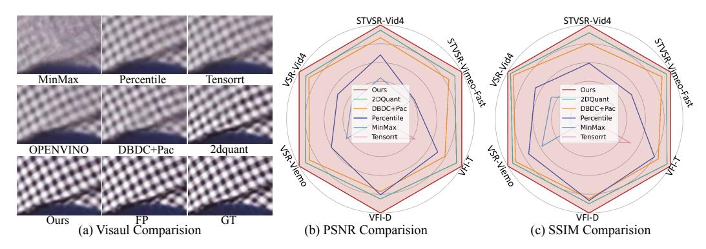

# 1 Introduction

Multi-frame video enhancement tasks aim to enhance the spatial and temporal resolution and quality of video sequences by exploiting temporal information from multiple frames. Among these, Video Frame Interpolation (VFI) [1, 18, 23, 35, 40, 42, 46, 47, 68–70, 74, 77], Video Super-Resolution (VSR) [3–6, 9, 20, 24, 52], and Spatio-Temporal Video Super-Resolution (STVSR) [12, 15, 34, 59, 63, 64, 66, 75] are the most representative video enhancement methods. They are widely employed as post-processing and pre-processing techniques in social media platforms, gaming environments, and various video perception and generation tasks [4, 11, 12, 51, 53]. Recent Transformer-based approaches for video enhancement exploit attention mechanisms to capture temporal dependencies across multiple frames, enabling substantial improvements in visual quality and structural fidelity. However, their high computational and memory demands remain a major

\*\* Renjing Pei and Yang Wang are the corresponding authors. † ZhanFeng Feng, Long Peng, and Xin Di contributed equally to this work. ‡ Long Peng is the project leader.

obstacle for real-world deployment. Therefore, numerous studies have proposed various model quantization methods to compress the bit-width of weights and activations from 32 bits (FP32) to 8, 4, or 2 bits [\[17,](#page-11-4) [26,](#page-11-5) [36–](#page-12-5)[38,](#page-12-6) [49,](#page-13-6) [50,](#page-13-7) [67\]](#page-14-7). This is a crucial step in practical deployment, reducing memory consumption and inference latency. For example, PAMS [\[26\]](#page-11-5), a classic method in Post-Training Quantization (PTQ), introduces trainable scale parameters to dynamically learn the maximum value of the quantization range. Liu *et al.* propose 2DQuant [\[36\]](#page-12-5), a dual-stage method for image superresolution which designs a differentiated search strategy and uses knowledge distillation [\[14\]](#page-10-8) to guide the learning of the quantization range. However, to the best of our knowledge, exploring model quantization in video enhancement remains largely uncharted. Directly applying existing quantization methods can lead to significant issues such as performance degradation and loss of fine details. Through observations and statistical experiments, we attribute these problems to two key limitations: (a) Video enhancement models need to aggregate texture and motion information from multiple frames, leading to inter-frame differential perception of information, manifesting as differentiated activation value distributions across frames as shown in Figure [2\(](#page-3-0)a). However, traditional quantization methods fails to allocate inconsistent representational capacity to different frames, resulting in discrepancies in dynamic range across frames, as shown in Figure [2\(](#page-3-0)b). This results in suboptimal utilization of sub-pixel spatial details, thereby limiting reconstruction performance. (b) Quantization inevitably reduces the representational capacity of the video model. Traditional methods overlook the capacity differences between the teacher (FP32) and student models (2bit, 4bit), relying solely on full-precision teachers for distillation. This makes it challenging for the student to learn high-quality mappings given its limited capacity, resulting in difficulty when directly quantizing a high-precision network into a low-precision one, as shown in Figure [1\(](#page-2-0)a). To address these limitations, we propose a novel quantization framework: Progressive Multi-Frame Quantization for multi-frame Video Enhancement, called PMQ-VE. Specifically, PMQ-VE introduces a coarse-to-fine two-stage process, which includes Backtracking-based Multi-Frame Quantization (BMFQ) and Progressive Multi-Teacher Distillation (PMTD).

Coarse Stage: Backtracking-based Multi-Frame Quantization. Existing methods [\[36,](#page-12-5) [57\]](#page-13-8) typically initialize quantization bounds using the global minimum and maximum values and symmetrically shrink them inward, ignoring inter-frame variations and the asymmetric nature of distributions. To address this, as illustrated in Figure [2\(](#page-3-0)c), BMFQ assigns frame-specific clipping bounds to better match the heterogeneous activation statistics across video frames. BMFQ employs a percentile-based initialization to suppress outliers and performs a backtracking-based search with pruning and backtracking to search the bounds efficiently. This strategy enables accurate, adaptive quantization with negligible overhead,

Fine Stage: Progressive Multi-Teacher Distillation. In the fine stage, we introduce a Progressive Multi-Teacher Distillation framework to restore the model's representational capacity under low-bit quantization. Specifically, a full-precision teacher provides fine-grained feature supervision, while an intermediate 8/4-bit teacher offers quantization-aware guidance, helping the 4/2-bit student model learn stable and informative representations under low-bit constraints, bridging the gap between the quantized and full-precision models.

Extensive experiments on three representative video enhancement tasks—STVSR, VSR, and VFI—demonstrate that our method achieves state-of-the-art performance across multiple benchmarks for various tasks. Our method consistently outperforms existing methods, achieving the best performance on PSNR, SSIM across various bit-width settings, as shown in Figure [1\(](#page-2-0)b-c). The contributions of this paper can be summarized as follows:

- To the best of our knowledge, we are the first to explore model quantization in multi-frame video enhancement tasks. We propose PMQ-VE, a novel per-frame coarse-to-fine quantization framework for multi-frame video enhancement models.
- In the coarse stage, we propose BMFQ to search quantization bounds via iterative backtracking with pruning, achieving efficient initialization. In the fine stage, we propose PMTD to leverage the knowledge of multi-level teachers to help a low-bit student model, enhancing its mapping quality and performance.
- Extensive experiments on three video enhancement tasks (STVSR, VSR, and VFI) demonstrate that our method achieves state-of-the-art results across various benchmarks under different low-bit quantization settings, highlighting the superiority and practicability of our approach.

Figure 1: (a) Qualitative comparison of reconstructed frames using different quantization methods. Quantitative comparison of PSNR(b) and SSIM(c) improvements across three video enhancement tasks (STVSR, VFI, VSR). Our method consistently outperforms existing quantization approaches in both visual quality and quantitative metrics.

