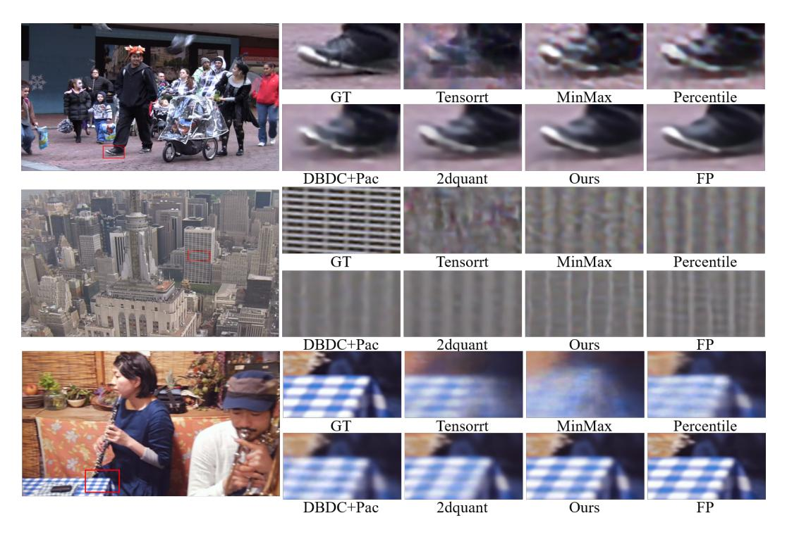

# 4.1 Experiment Setting

**Datasets and backbone.** We evaluate our method on three representative video enhancement tasks: Space-Time Video Super-Resolution (STVSR), Video Super-Resolution (VSR), and Video Frame Interpolation (VFI). For each task, we select state-of-the-art and popular methods as backbones: RSTT [12] for STVSR, MIA [76] for VSR, and EMA-VFI [74] for VFI. The Vimeo-90K [66] dataset is used for training across all tasks, with Vid4 [34] and the Vimeo-90K test set serving as evaluation benchmarks. More details of data preparation and setting are provided in the supplementary material. **Evaluation metrics.** We use PSNR and SSIM [61] as evaluation metrics, computed on the luminance (Y) channel of the YCbCr color space. To further evaluate perception-oriented metrics, LPIPS [71] and NIQE [44] are used to assess the perceptual quality of videos.

**Implementation details.** We adopt the Adam optimizer [25] with an initial learning rate of  $2 \times 10^{-4}$ 

Table 2: Quantitative comparison of different methods on two VFI EMA-VFI variants ([T] and [D]), evaluated on the Vimeo90K benchmark under 4-bit.

| Method          | Bit   | EMA-VFI [T] [68] |        |        |       | EMA-VFI [D] [74] |        |        |        |
|-----------------|-------|------------------|--------|--------|-------|------------------|--------|--------|--------|
|                 |       | PSNR↑            | SSIM↑  | LPIPS↓ | NIQE↓ | PSNR↑            | SSIM↑  | LPIPS↓ | NIQE↓  |
| Baseline        | 32/32 | 29.41            | 0.9279 | 0.086  | 6.736 | 30.29            | 0.9418 | 0.078  | 6.545  |
| OpenVINO [13]   | 4/4   | 26.03            | 0.8703 | 0.222  | 8.022 | 25.38            | 0.8579 | 0.257  | 8.2784 |
| TensorRT [58]   | 4/4   | 25.33            | 0.8551 | 0.268  | 8.582 | 25.21            | 0.8537 | 0.269  | 8.4035 |
| SNPE [19]       | 4/4   | 25.49            | 0.8581 | 0.259  | 8.500 | 25.83            | 0.8683 | 0.236  | 8.0399 |
| Percentile [27] | 4/4   | 26.82            | 0.8919 | 0.185  | 7.765 | 28.54            | 0.9198 | 0.132  | 7.0667 |
| MinMax [21]     | 4/4   | 23.03            | 0.7918 | 0.389  | 9.475 | 24.19            | 0.8309 | 0.313  | 8.5153 |
| DBDC+Pac[57]    | 4/4   | 27.30            | 0.8976 | 0.171  | 7.545 | 28.36            | 0.9179 | 0.134  | 7.1221 |
| 2DQuant [36]    | 4/4   | 28.06            | 0.9110 | 0.152  | 7.494 | 28.78            | 0.9233 | 0.120  | 6.9884 |
| Ours            | 4/4   | 28.41            | 0.9162 | 0.136  | 7.361 | 29.59            | 0.9335 | 0.101  | 6.7881 |

Table 3: Quantitative comparison of different methods on two VSR benchmarks under 4-bit.

| Benchmark Metric |       | Baseline: MIA [76] | TensorRT [58] | SNPE [19] | Percentile [27] | MinMax [21] | DBDC +Pac [57] | 2DQuant [36] | Ours   |
|------------------|-------|-----------------------|------------------|--------------|--------------------|----------------|-------------------|-----------------|--------|
| Vimeo90K         | PSNR↑ | 38.32                 | 31.81            | 32.42        | 35.15              | 34.13          | 36.64             | 36.92           | 37.34  |
|                  | SSIM↑ | 0.9532                | 0.8612           | 0.8805       | 0.9262             | 0.9119         | 0.9404            | 0.9434          | 0.9487 |
| Vid4             | PSNR↑ | 28.20                 | 24.48            | 24.22        | 26.14              | 25.60          | 27.26             | 27.38           | 27.64  |
|                  | SSIM↑ | 0.8507                | 0.6758           | 0.6877       | 0.7805             | 0.7494         | 0.8230            | 0.8287          | 0.8341 |

and apply Cosine Annealing [\[41\]](#page-12-15) over 20,000 iterations. The batch size is set to 8 and 2 per GPU during the initialization and distillation-based fine-tuning phases, respectively. Random cropping, rotations, and flipping are applied to enhance training robustness. All experiments are implemented in Python with PyTorch [\[48\]](#page-13-16) and conducted on 8 NVIDIA V100 GPUs.

## 4.2 Quantitative Results

Table [1](#page-6-0) presents quantitative comparisons of various methods under 2/2, 4/4, bit-width across four STVSR benchmarks. Traditional quantization approaches, such as OpenVINO [\[13\]](#page-10-14) and TensorRT [\[58\]](#page-13-14), face challenges in pixel-level video enhancement, resulting in model performance scores of only 18.24dB and 20.31dB on Vid4 at 2-bit quantization. Although DBDC+Pac [\[57\]](#page-13-8) and 2DQuant [\[36\]](#page-12-5) are tailored for low-level vision tasks with enhanced sharpness awareness, which somewhat mitigates the performance drop due to quantization, they still lag behind our proposed method. This is primarily due to their limitations in managing multi-frame distribution differences and detail enhancement. Our method achieves the best performance across all scenarios and benchmarks, notably surpassing existing methods by nearly 1 dB on the Vimeo benchmark, underscoring the effectiveness of our approach. In a similar manner, our method demonstrates superior performance across all benchmarks and bit-width configurations for both Video Super-Resolution (VSR) and Video Frame Interpolation (VFI) tasks. As detailed in Tables [2](#page-7-0) and [3,](#page-7-1) our approach exemplifies remarkable generalization capabilities, consistently outperforming existing methods in all benchmarks and bits. More results on additional bit-width settings and benchmarks can be found in Appendix.

#### 4.3 Qualitative Results

To verify the visual quality, we present the visual comparisons of different PTQ methods applied to STVSR, VSR and VFI tasks under 4-bit quantization, as shown in Figure [4.](#page-8-0) Traditional methods such as MinMax [\[21\]](#page-11-12) and Percentile [\[27\]](#page-11-11) exhibit noticeable artifacts, while other methods like DBDC+Pac [\[57\]](#page-13-8) and 2dquant [\[36\]](#page-12-5) suffer from detail blurring issues, particularly in complex scenes. However, our proposed method consistently produces sharper edges and more faithful textures that are visually closer to the full-precision outputs. In more challenging cases, such as the Vimeo-Fast dataset where motion and fine details coexist, our proposed method better preserves structural information

Figure 4: Visual comparisons under 4-bit quantization for three video enhancement tasks: from top to bottom are STVSR, VSR, and VFI tasks. More results are provided in the Appendix.

and avoids common artifacts. This highlights the visual superiority of our approach. More visual effects and comparisons with user studies will be presented in the Appendix.

#### 4.4 Ablation Studies

To validate the effectiveness of the proposed core idea, we design several ablation experiments to explore the multi-teacher distillation strategy the frame-wise quantization strategy.

Specifically, we conduct experiments on STVSR in a 2-bit compression setting, removing these core modules one by one, with results shown in Table 4. It is seen that the baseline without any core ideas achieves only 12.67dB. By introducing the frame-wise quantization strategy, the network perceives differences between frames, improving performance. Furthermore, the BMFQ helps the network adaptively learn clipping ranges for each frame, boosting

Table 4: Ablation studies.

| Per-Frame Quantizatio | PSNR↑        |              |       |  |
|--------------------------|--------------|--------------|-------|--|
| Х                        | Х            | X            | 12.67 |  |
| $\checkmark$             | X            | X            | 19.64 |  |
| $\checkmark$             | $\checkmark$ | X            | 27.56 |  |
| $\checkmark$             | $\checkmark$ | $\checkmark$ | 30.33 |  |
|                          |              |              |       |  |

model performance to 27.56dB. Finally, with the introduction of the multi-teacher distillation strategy, the low-bit network learns prior knowledge from different teachers, further improving model performance despite limited capacity. This validates the effectiveness of the proposed core modules. More ablation studies are presented in the Appendix.

#### 5 Conclusion

We introduced a novel coarse-to-fine PMQ-VE, addressing key challenges in quantizing multi-frame video enhancement models. BMFQ is proposed to establish robust quantization bounds through a percentile-based initialization and backtracking search, ensuring efficient quantization across frames. PMTD enhances the quality of low-bit models by utilizing a progressive distillation strategy with both full-precision and quantized teachers, bridging the gap between high-precision and low-bit models. Experiments on STVSR, VSR, and VFI tasks show that our PMQ-VE achieves state-of-the-art performance and visually pleasing results. Limitation and Future Work: Although our PMQ-VE has achieved promising results on Transformer-based video enhancement methods, more diffusion-based

Transformer (DiT) methods can be tested. In the future, we plan to extend our method to more video enhancement tasks and models to facilitate the deployment of video models in the community.

