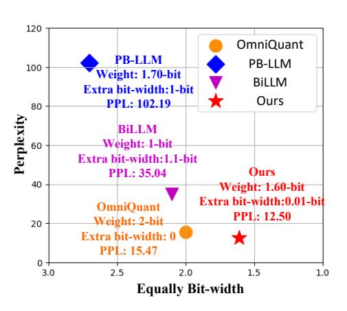
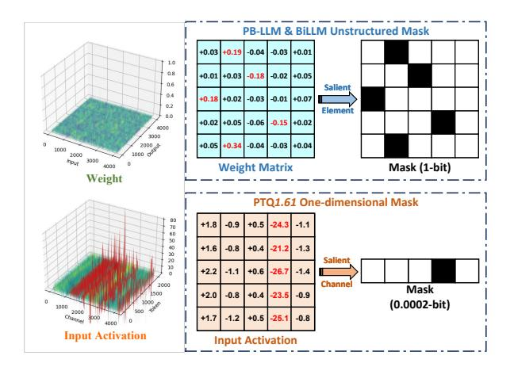

# 1 Introduction

Large Language Models (LLMs) such as LLaMA [\(Touvron et al.,](#page-10-0) [2023a,](#page-10-0)[b\)](#page-10-1) and GPT [\(Brown et al.,](#page-8-0) [2020;](#page-8-0) [Ouyang et al.,](#page-10-2) [2022\)](#page-10-2) have demonstrated remarkable success in various natural language processing tasks. However, their colossal numbers of parameters bring tremendous storage and inference

Figure 1: An overview of performance (Perplexity on WikiText2) and bit-width achieved by our PTQ*1.61* and other extremely low-bit PTQ methods on LLaMA-7B.

overheads. To alleviate the challenge, numerous model compression methods have been proposed such as quantization [\(Liu et al.,](#page-10-3) [2022;](#page-10-3) [Huang et al.,](#page-9-0) [2019\)](#page-9-0), pruning [\(Frantar and Alistarh,](#page-9-1) [2023;](#page-9-1) [Ma](#page-10-4) [et al.,](#page-10-4) [2023\)](#page-10-4) and knowledge-distillation [\(Gou et al.,](#page-9-2) [2021;](#page-9-2) [Tunstall et al.,](#page-11-0) [2023\)](#page-11-0). Among these works, post-training quantization (PTQ) methods [\(Yuan](#page-11-1) [et al.,](#page-11-1) [2023;](#page-11-1) [Wei et al.,](#page-11-2) [2022\)](#page-11-2) have garnered particular attention for LLMs due to their computational efficiency compared to quantization-aware training (QAT) [\(Liu et al.,](#page-10-5) [2023b;](#page-10-5) [Esser et al.,](#page-9-3) [2019\)](#page-9-3) and other compression methods. Although maintaining nearly lossless performance at 4-bit or 8-bit, most existing state-of-the-art PTQ approaches fail when attempting to quantize weights to extremely low bit-width, *i.e.*, 1-bit or sub 2-bit.

PB-LLM [\(Shang et al.,](#page-10-6) [2023\)](#page-10-6) and BiLLM [\(Huang et al.,](#page-9-4) [2024\)](#page-9-4) are two most recent sub 2-bit PTQ methods for LLMs. They selectively preserve a portion of salient weights at 8-bit or with fine processing while quantizing the remaining weights to 1-bit. Although they demonstrate promising results, they are plagued by two critical issues. *Firstly and the most importantly*, both methods introduce additional unstructured fine-grained masks to dis-

\*Corresponding Author

tinguish salient weights which requires additional 1-bit per weight to store the mask and leads the memory of the quantized model to exceeding 2 bit per weight, where PB-LLM with 2.7-bit and BiLLM with 2.1-bit respectively (see Appendix [A\)](#page-12-0). *Secondly*, they independently and analytically derive the row-wise scaling factors used for mitigating binarization magnitude errors [\(Rastegari](#page-10-7) [et al.,](#page-10-7) [2016\)](#page-10-7), violating the fact that weights exhibit implicit row-wise dependencies [\(Clark et al.,](#page-9-5) [2019;](#page-9-5) [Vig and Belinkov,](#page-11-3) [2019\)](#page-11-3) and angular biases [\(Lin](#page-10-8) [et al.,](#page-10-8) [2020\)](#page-10-8).

Motivated by issues above and to push the real limit of PTQ methods on extremely low-bit quantization, we propose an extremely low-bit (1.61-bit) PTQ method for LLMs called PTQ*1.61*. Specifically, to eliminate the significant additional memory consumption caused by unstructured finegrained masks, we dissect the quantization error through mathematical derivation to identify the structural influencing factors within it, and find that the upper bound of quantization error is significantly affected by input activation channels. Based on this discovery we propose a *one-dimensional structured mask* to preserve corresponding salient channels in the weight matrix at 4-bit, and successfully reduce the extra bit-width for each weight from over 1-bit to a negligible extent (0.0002-bit). Additionally, in order to capture the implicit rowwise correlations and directional biases jointly, we introduce a novel *efficient block-wise scaling factors optimization framework*.

In addition, unlike previous studies which always take the pretrained model with the best performance as the starting point for quantization, we find that the weights distribution also immensely affects the quantization performance. Specifically, existing per-channel PTQ methods usually consider a row-wise quantization pattern that assigns the same quantization parameter to all weights in a channel, while the distribution of salient weights in the pretrained model is scattered, which leads to significant quantization errors. Motivated by this row-wise nature, we propose a novel *preprocessing strategy* for LLMs quantization, which first transforms the weight distribution into a row-wise pattern through a lightweight restorative LoRA alignment, so that the preprocessed model is more suitable for per-channel PTQ than pretrained model. The proposed preprocessing strategy can be also applied to other extremely low-bit PTQ methods with notable performance enhancement, as shown

in Figure [5.](#page-7-0) We further discuss the differences and advantages of our preprocessing strategy from existing post-quantization parameter-efficient finetuning (PEFT) approaches [\(Dettmers et al.,](#page-9-6) [2023\)](#page-9-6) in Section [3.4](#page-4-0) and Appendix [D.](#page-14-0)

With these enhancements, PTQ*1.61* effectively quantizes the weights to extremely low-bit with outstanding performance, as illustrated in Figure [1.](#page-0-0) Our key contributions can be summarized as:

- To explore the real limitation of post-training quantization, we present an efficient extremely low-bit PTQ method for LLMs named PTQ*1.61* which is the *first* PTQ study to truly reduce the effective bit-width of LLMs weights to sub 2-bit (1.61-bit) with acceptable performance degradation.
- Different from leveraging memory-intolerable unstructured masks to preserve salient information, we propose a one-dimensional structured mask based on input activations to reduce the upper bound of quantization errors, which only introduces negligible 0.0002-bit for each weight.
- We further present a novel efficient block-wise optimization strategy to learn scaling factors to further consider the implicit row-wise dependencies and angular biases.
- We demonstrate that pretrained model is not amenable to per-channel PTQ and accordingly propose a quantization preprocessing paradigm based on restorative LoRA to transform salient weights as a row-wise pattern to further enhance the quantization performance.

## 2 Related Works

#### 2.1 Post-Training Quantization

Post-training quantization is an efficient and expeditious quantization approach which merely necessitates a limited amount of calibration data to statistically determine the quantization parameters that help to scale float values to low-bit. AdaRound [\(Nagel et al.,](#page-10-9) [2020\)](#page-10-9) analyzes the quantization errors and employs a layer-wise optimization approach to learn the optimal rounding mechanism. BrecQ [\(Li](#page-9-7) [et al.,](#page-9-7) [2021\)](#page-9-7) divides the model weights into multiple blocks and independently quantizes each block, allowing for finer control over quantization errors.

Figure 2: An overview of our **PTQ1.61**. Utilizing quantization preprocessing, the pretrained model is transformed into a row-wise pattern which is amenable to channel-wise quantization. Initially, structured masks are obtained to distinguish salient weights channels based on channel-wise magnitude of input activation. Salient weight channels undergo 4-bit quantization to retain crucial information, while non-salient weights are binarized with the aid of learnable scaling factors updated by novel block-wise optimization framework.

In recent years, there has been a growing research interest in PTQ methods for LLMs. GPTQ (Frantar et al., 2022) quantizes weights columnwise based on the Hessian matrix and dynamically updates the remaining weights to compensate for quantization errors. AWQ (Lin et al., 2023) retains 1% of salient weights and calculates quantization parameters based on output activations. ZeroQuant (Yao et al., 2022) performs group-wise quantization for weights and finer-grained per-channel quantization for activations. SmoothQuant (Xiao et al., 2023) considers that the cause of quantization errors in activations lies in the presence of channelwise outliers and proposes smoothing parameters to reduce their magnitude. OmniQuant (Shao et al., 2023) combines the advantages of previous works and learns the optimal smoothing and quantization parameters through back propagation, making it the current state-of-the-art PTQ method for LLMs.

Unfortunately, for extremely low-bit (sub 2-bit) quantization, which offers the highest compression ratio, the performance of such methods generally suffers significantly.

### 2.2 Extremely Low-Bit Quantization

Extremely low-bit quantization refers to approaches where the effective bit-width for weights is sub 2-bit. It has been widely welcomed due to significant compression ratio but suffers from severe performance degradation. BNN (Courbariaux et al., 2016) is the first model binarization method and XNOR-Net (Rastegari et al., 2016) presents scaling factors which reduce binarization errors with acceptable additional memory cost. RBNN (Lin et al., 2020) indicates that except for magni-

tude gaps, angular biases ought to be considered so that extra rotation matrices are introduced to overcome the drawback.

Several extremely low-bit QAT methods for LLMs (Xu et al., 2024; Wang et al., 2023; Ma et al., 2024) have been proposed recently. Regrettably, the immense computational resource consumption and the lack of open-source availability have hindered their widespread application so that there is a growing demand for more economical PTQ methods. PB-LLM (Shang et al., 2023) investigate the importance of salient weights and design extra 1-bit unstructured masks to retain them into 8-bit while binarizing the others. BiLLM (Huang et al., 2024) further presents finer-grained masks to divide into multi-groups for binarization using different scaling factors. However, the fine-grained masks that cannot be compressed in both methods results in the equivalent bitwidths exceeding 2 bits. To make contributions for truly extremely low-bit PTQ research, we propose **PTQ1.61** which addresses the issues above and obtains promising performance.

### 3 PTQ1.61

In this section, we provide a detailed introduction to our **PTQ1.61**, an extremely low-bit PTQ method for LLMs as demonstrated in Figure 2. We begin with briefly reviewing the basic concepts of model quantization and binarization in Section 3.1. Subsequently, to preserve salient information while avoiding insufferable memory overheads brought by unstructured masks in previous methods, we analyze the impact factors on quantization errors and then devise a one-dimensional mask based on

input activations with negligible bit-width in Section 3.2. In Section 3.3, a novel block-wise optimization strategy is introduced for binarization to obtain optimal scaling factors considering implicit dependencies and angular biases. In Section 3.4, we explain why the pretrained model is not suitable for per-channel PTQ and how our proposed quantization preprocessing strategy works.

## 3.1 Preliminaries

Model Quantization Model quantization aims to convert float weights into corresponding low-bit integer forms thereby reducing computational and memory overheads. The quantization function can be elaborated as:

$$\mathbf{W}_q = \operatorname{clamp}(\lfloor \frac{\mathbf{W}}{S_q} \rceil + Z_q, 0, 2^b - 1), \quad (1)$$

where W ∈ R n×m and Wq ∈ R n×m indicate fullprecision and quantized weights respectively. ⌊·⌉ denotes round-to-nearest operator. Sq is the quantization scalar and Zq represents zero-point.

Model Binarization Binarization represents the most extreme form of quantization (1-bit) where weights are assigned as ±1 determined by the sign function. In more details:

$$\operatorname{sign}(\mathbf{W}) = \begin{cases} +1, & \mathbf{W} \ge 0, \\ -1, & \mathbf{W} < 0. \end{cases}, \quad \mathbf{W}_b = \alpha \operatorname{sign}(\mathbf{W}),$$
(2)

where α denotes scaling factors commonly used in previous methods [\(Bulat and Tzimiropoulos,](#page-8-1) [2019;](#page-8-1) [Xu et al.,](#page-11-8) [2021;](#page-11-8) [Liu et al.,](#page-10-12) [2018;](#page-10-12) [Shang et al.,](#page-10-6) [2023;](#page-10-6) [Huang et al.,](#page-9-4) [2024\)](#page-9-4) to reduce binarization errors and Wb ∈ R n×m is binarized weights with scaling factor α. Assuming that weights in each row of W are independent, we define w as a row of weights with nw elements. The corresponding scaling factor αw can be derived analytically by αw = ∥w∥1 nw .

## 3.2 Structured Mask

Following [\(Shang et al.,](#page-10-6) [2023\)](#page-10-6) and [\(Huang et al.,](#page-9-4) [2024\)](#page-9-4), we recognize that partially preserving higher-bit salient information is crucial for reducing quantization errors. However, their unstructured masks cannot be compressed, resulting in additional memory overheads due to the scattered nature of salient weights within the weight matrix. Hence, our objective is to identify factors that significantly impact quantization errors while maintaining some degree of regularity.

Figure 3: (a) The magnitude and distribution comparison between input activations and weights; (b) Previous masks are unstructured and uncompressible. In contrast our mask is one-dimensional with only 0.0002-bit.

For each quantized layer, its quantization error is expressed as the gap relative to full-precision output. This can be restated as:

$$\mathcal{E} = |\mathbf{X}\mathbf{W}_q^T - \mathbf{X}\mathbf{W}^T| = |\mathbf{X}(\mathbf{W}_q^T - \mathbf{W}^T)|, \quad (3)$$

where E is the layer-wise quantization error and X ∈ R t×m indicates the input activation of the layer. To further explore hidden key factors, we give the visualization of X and W as Figure [3a](#page-3-0) from which we can observe that in contrast to the chaotic distribution of weights, input activations exhibit a clear channel-wise pattern, where the variance of each token within a channel is very small. Therefore, we re-define X as a column-wise set X = {x1, x1, ..., xm|x1 ∈ R n} so that Equation [\(3\)](#page-3-1) will be modified as:

$$\mathcal{E} = |\sum_{i=1}^{m} x_i (w_{i,j}^q - w_{i,j})_{j=1,\dots,n}|$$

$$\leq \sum_{i=1}^{m} (|x_i| \sum_{j=1}^{n} |w_{i,j}^q - w_{i,j}|),$$
(4)

where wi,j denotes the element in position (i, j) of WT . As demonstrated in Equation [\(4\)](#page-3-2), *the upper bound of quantization error is related to the magnitude of input activations for the* i*-th channel and weight matrix for the* i*-th row.* Figure [3a](#page-3-0) highlights that the magnitude of activations is about 1000 times larger than that of weights especially for top-20% channels. Therefore, we propose a one-dimensional mask to save the i-th row of W at 4-bit, maintaining salient information in channel i of input activations to reduce the upper bound

of quantization error as shown in Figure 3b. This improvement successfully reduces the additional bit-width introduced by masks to 0.0002-bit (see Appendix) and limit the equally weight bit-width at sub 2-bit (1.61-bit) for the first time among all existing PTQ methods. The light blue area of Figure 2 illustrates the role of our structured mask in the entire quantization process. Notably, OWQ (Lee et al., 2024) and AWQ (Lin et al., 2023) also take into account the relationship between input activation and weight, but our motivation and performance are entirely different. We have elaborated on this part in Appendix B.

#### 3.3 Block-wise Scaling Factors Optimization

For non-salient weights, we perform binarization following Equation (2). However, previous analytically derived scaling factors ignore implicit correlations among rows and directional shifts which cannot be accurately captured through mathematical derivation. To address this issue, we set scaling factors as learnable and propose a novel efficient block-wise optimization pipeline to learn them while considering implicit row-wise dependencies and angular biases, as demonstrated in the orange and green area of Figure 2.

In order to conduct an effective distance metric for optimization, we first consider MSE loss to reduce magnitude gaps. Then for angular biases described above, we take cosine similarity, a metric considering directional gaps, into account. We formulate the joint metric as follows:

$$\mathbb{E}(f_1, f_2) = ||f_1 - f_2||_2 + \mathcal{D}_{NLC}(f_1, f_2), \quad (5)$$

where  $\mathbb{E}(\cdot)$  is the distance metric for optimization.  $f_1$  and  $f_2$  are different features.  $D_{NLC}(\cdot)$  represents the negative logarithm of cosine similarity loss (Zhao et al., 2024), as given by:

$$\mathcal{D}_{NLC}(f_1, f_2) = -\log(\mathcal{C}(f_1, f_2)),$$
 (6)

where  $C(\cdot)$  denotes cosine similarity. Followed by CBQ (Ding et al., 2023), our block-wise pipeline consists of two branches: the first branch aims at mitigating quantization error propagation and the second branch is tailored for quantifying the outputs distinction for the same inputs. Our final optimization objective is formulated as:

Figure 4: Salient weights distribution of the pretrained and preprocessed OPT-2.7B and LLaMA-13B. The salient weights of the pretrained model exhibit a scattered distribution while after quantization preprocessing a visible row-wise concentrated pattern appears. Each row in the weight matrices corresponds to an input channel. More visualization results please refer to Figure 10.

where  $\alpha_s$  and  $\alpha_r$  are scaling factors for magnitude and angular biases, respectively.  $W_q'$  denotes the quantized weights (see Appendix C.2) and  $\mathcal{F}(\cdot)$  represents the embedding function of a block. X indicates the input activation of the full-precision block while  $X_q$  is that of the quantized block.

With novel optimization strategy, **PTQ1.61** outperforms previous low-bit PTQ methods significantly. The contribution is assessed in Table 3 and Appendix C.

#### 3.4 Quantization Preprocessing

It is well-known that the pretrained models exhibit the best performance so prior PTQ studies intuitively believe that quantizing the pretrained models should also yield optimal results. However, we discover that this notion is somewhat biased. As illustrated in Figure 4, we highlight the salient weights of a linear layer in LLMs based on magnitude-metric (Shang et al., 2023) where a scattered distribution pattern can be observed. The scattered pattern results in significant quantization errors when calculating row-wise scaling factors in per-channel quantization scheme. Therefore, we infer that under the premise of minimizing the bad impact on the pretrained model, transforming

| Dataset   | Methods   | Bits    | 1-7    | 1-13  | 1-30   | 1-65  | 2-7   | 2-13   | 2-70  | 3-8     |
|-----------|-----------|---------|--------|-------|--------|-------|-------|--------|-------|---------|
|           | FP        | 16      | 5.68   | 5.09  | 4.10   | 3.53  | 5.47  | 4.88   | 3.31  | 6.14    |
|           | AWQ       | 2       | 2.5e5  | 2.8e5 | 2.4e5  | 7.4e4 | 2.2e5 | 1.2e5  | -     | 8.2e5   |
|           | GPTQ      | 2       | 2.1e3  | 5.5e3 | 1.9e3  | 55.91 | 7.7e3 | 2.1e3  | 77.95 | 5.7e4   |
| WikiText2 | QuIP      | 2       | 42.19  | 12.18 | 9.36   | 7.19  | 55.00 | 13.75  | 6.96  | 119.23  |
|           | OmniQuant | 2       | 15.47  | 13.21 | 8.81   | 7.58  | 37.37 | 17.21  | 7.81  | 796.8 4 |
|           | PB-LLM    | 1.7(+1) | 102.19 | 48.11 | 26.37  | 12.91 | 66.30 | 462.84 | NAN   | 78.67   |
|           | BiLLM     | 1(+1.1) | 35.04  | 15.14 | 10.52  | 8.51  | 32.48 | 21.77  | 12.80 | 50.59   |
|           | PTQ1.61   | 1.61    | 12.50  | 9.67  | 7.95   | 7.02  | 12.70 | 9.74   | 6.94  | 22.90   |
|           | FP        | 16      | 7.08   | 6.61  | 5.98   | 5.62  | 6.97  | 6.46   | 5.52  | 8.88    |
|           | AWQ       | 2       | 1.9e5  | 2.3e5 | 2.4e5  | 7.5e4 | 1.7e5 | 9.4e4  | -     | 8.1e5   |
|           | GPTQ      | 2       | 689.13 | 2.5e3 | 234.95 | 40.58 | NAN   | 323.12 | 48.82 | 1.0e5   |
| C4        | OmniQuant | 2       | 24.89  | 18.31 | 13.67  | 10.77 | 90.64 | 26.76  | 12.28 | 2.4e3   |
|           | PB-LLM    | 1.7(+1) | 67.92  | 34.20 | 22.45  | 13.70 | 66.23 | 333.54 | NAN   | 78.98   |
|           | BiLLM     | 1(+1.1) | 33.64  | 14.75 | 10.97  | 9.92  | 33.72 | 23.14  | 13.84 | 48.26   |
|           | PTQ1.61   | 1.61    | 17.13  | 13.51 | 10.98  | 9.86  | 17.73 | 13.64  | 12.63 | 33.82   |

Table 1: Perplexities comparison of PTQ methods on LLaMA families. For PB-LLM and BiLLM, *1.7(+1)* and *1(+1.1)* under Bits means *Weight bits(+Mask bits).* OPT results can be found in Table [6.](#page-14-1)

weights with similar saliency in a row-wise distribution pattern can effectively enhance the quantization performance.

As claimed by LoRA [\(Hu et al.,](#page-9-13) [2021\)](#page-9-13), when fine-tuning a model on specific tasks, the weights compensation exhibits low-rank characteristics, indicating that fine-tuning may compensate for important information into specific dimensions of the weight matrices. Inspired by this proposition, we propose a novel quantization preprocessing paradigm. Specifically, we hope to perform a lightweight restorative LoRA on the pre-training dataset (*i.e.*, RedPajama [\(Computer,](#page-9-14) [2023\)](#page-9-14), the pretraining dataset of LLaMA families) to partially restore the performance of an initial quantized model to its pretrained version while transforming the distribution of salient weights into a concentrated row-wise pattern. As shown in Figure [4,](#page-4-1) it is evident that the salient weights in the preprocessed model indeed exhibit a concentrated row-wise pattern and the results in Table [3](#page-7-1) and [6](#page-14-1) demonstrate its effectiveness.

We emphasize that the goal of our preprocessing scheme is to produce a LLM that is more amenable to channel-wise quantization, rather than using the preprocessed model for inference directly. In Appendix [D.2,](#page-14-2) we further illustrate this point with example experiments. Additionally, it is crucial to clarify that our preprocessing scheme stands out significant advantages and differences from existing post-quantization PEFT methods, e.g., LoRA, QLoRA and QA-LoRA [\(Xu et al.,](#page-11-10) [2023\)](#page-11-10), please refer to Appendix [D.](#page-14-0)

