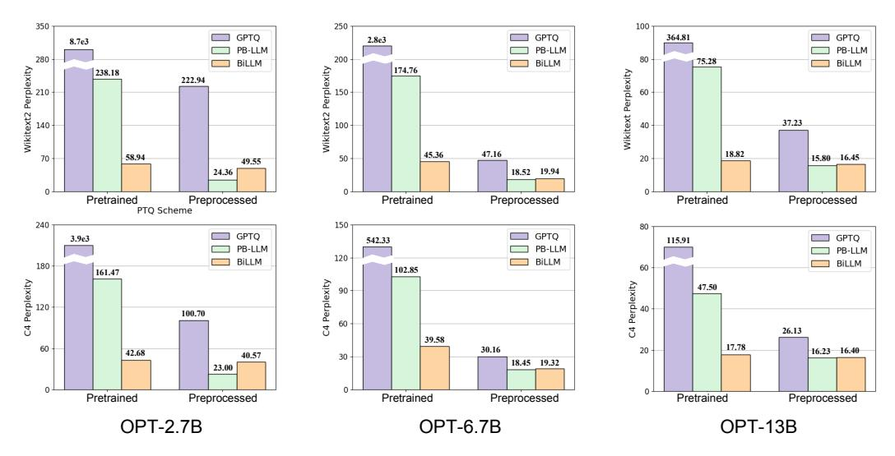

# References

Yushi Bai, Xin Lv, Jiajie Zhang, Hongchang Lyu, Jiankai Tang, Zhidian Huang, Zhengxiao Du, Xiao Liu, Aohan Zeng, Lei Hou, Yuxiao Dong, Jie Tang, and Juanzi Li. 2024. [LongBench: A bilingual, multi](https://doi.org/10.18653/v1/2024.acl-long.172)[task benchmark for long context understanding.](https://doi.org/10.18653/v1/2024.acl-long.172) In *Proceedings of the 62nd Annual Meeting of the Association for Computational Linguistics (Volume 1: Long Papers)*, pages 3119–3137, Bangkok, Thailand. Association for Computational Linguistics.

Yonatan Bisk, Rowan Zellers, Jianfeng Gao, Yejin Choi, et al. 2020. Piqa: Reasoning about physical commonsense in natural language. In *Proceedings of the AAAI conference on artificial intelligence*, volume 34, pages 7432–7439.

Tom Brown, Benjamin Mann, Nick Ryder, Melanie Subbiah, Jared D Kaplan, Prafulla Dhariwal, Arvind Neelakantan, Pranav Shyam, Girish Sastry, Amanda Askell, et al. 2020. Language models are few-shot learners. *Advances in neural information processing systems*, 33:1877–1901.

Adrian Bulat and Georgios Tzimiropoulos. 2019. Xnornet++: Improved binary neural networks. *arXiv preprint arXiv:1909.13863*.

Chee-Yong Chan and Yannis E Ioannidis. 1998. Bitmap index design and evaluation. In *Proceedings of the*

- *1998 ACM SIGMOD international conference on Management of data*, pages 355–366.
- Jerry Chee, Yaohui Cai, Volodymyr Kuleshov, and Christopher M De Sa. 2024. Quip: 2-bit quantization of large language models with guarantees. *Advances in Neural Information Processing Systems*, 36.
- Kevin Clark, Urvashi Khandelwal, Omer Levy, and Christopher D Manning. 2019. What does bert look at? an analysis of bert's attention. *arXiv preprint arXiv:1906.04341*.
- Peter Clark, Isaac Cowhey, Oren Etzioni, Tushar Khot, Ashish Sabharwal, Carissa Schoenick, and Oyvind Tafjord. 2018. Think you have solved question answering? try arc, the ai2 reasoning challenge. *arXiv preprint arXiv:1803.05457*.
- Karl Cobbe, Vineet Kosaraju, Mohammad Bavarian, Mark Chen, Heewoo Jun, Lukasz Kaiser, Matthias Plappert, Jerry Tworek, Jacob Hilton, Reiichiro Nakano, et al. 2021. Training verifiers to solve math word problems. *arXiv preprint arXiv:2110.14168*.
- Together Computer. 2023. [Redpajama: an open dataset](https://github.com/togethercomputer/RedPajama-Data) [for training large language models.](https://github.com/togethercomputer/RedPajama-Data)
- Matthieu Courbariaux, Itay Hubara, Daniel Soudry, Ran El-Yaniv, and Yoshua Bengio. 2016. Binarized neural networks: Training deep neural networks with weights and activations constrained to+ 1 or-1. *arXiv preprint arXiv:1602.02830*.
- Tim Dettmers, Artidoro Pagnoni, Ari Holtzman, and Luke Zettlemoyer. 2023. Qlora: Efficient finetuning of quantized llms. *arXiv preprint arXiv:2305.14314*.
- Xin Ding, Xiaoyu Liu, Yun Zhang, Zhijun Tu, Wei Li, Jie Hu, Hanting Chen, Yehui Tang, Zhiwei Xiong, Baoqun Yin, et al. 2023. Cbq: Cross-block quantization for large language models. *arXiv preprint arXiv:2312.07950*.
- Abhimanyu Dubey, Abhinav Jauhri, Abhinav Pandey, Abhishek Kadian, Ahmad Al-Dahle, Aiesha Letman, Akhil Mathur, Alan Schelten, Amy Yang, Angela Fan, et al. 2024. The llama 3 herd of models. *arXiv preprint arXiv:2407.21783*.
- Steven K Esser, Jeffrey L McKinstry, Deepika Bablani, Rathinakumar Appuswamy, and Dharmendra S Modha. 2019. Learned step size quantization. *arXiv preprint arXiv:1902.08153*.
- Elias Frantar and Dan Alistarh. 2023. Sparsegpt: Massive language models can be accurately pruned in one-shot. In *International Conference on Machine Learning*, pages 10323–10337. PMLR.
- Elias Frantar, Saleh Ashkboos, Torsten Hoefler, and Dan Alistarh. 2022. Gptq: Accurate post-training quantization for generative pre-trained transformers. *arXiv preprint arXiv:2210.17323*.

- Leo Gao, Jonathan Tow, Baber Abbasi, Stella Biderman, Sid Black, Anthony DiPofi, Charles Foster, Laurence Golding, Jeffrey Hsu, Alain Le Noac'h, Haonan Li, Kyle McDonell, Niklas Muennighoff, Chris Ociepa, Jason Phang, Laria Reynolds, Hailey Schoelkopf, Aviya Skowron, Lintang Sutawika, Eric Tang, Anish Thite, Ben Wang, Kevin Wang, and Andy Zou. 2023. [A framework for few-shot language model](https://doi.org/10.5281/zenodo.10256836) [evaluation.](https://doi.org/10.5281/zenodo.10256836)
- Jianping Gou, Baosheng Yu, Stephen J Maybank, and Dacheng Tao. 2021. Knowledge distillation: A survey. *International Journal of Computer Vision*, 129(6):1789–1819.
- Dan Hendrycks, Collin Burns, Steven Basart, Andy Zou, Mantas Mazeika, Dawn Song, and Jacob Steinhardt. 2021. Measuring massive multitask language understanding. *Proceedings of the International Conference on Learning Representations (ICLR)*.
- Edward J Hu, Yelong Shen, Phillip Wallis, Zeyuan Allen-Zhu, Yuanzhi Li, Shean Wang, Lu Wang, and Weizhu Chen. 2021. Lora: Low-rank adaptation of large language models. *arXiv preprint arXiv:2106.09685*.
- Kun Huang, Bingbing Ni, and Xiaokang Yang. 2019. Efficient quantization for neural networks with binary weights and low bitwidth activations. In *Proceedings of the AAAI Conference on Artificial Intelligence*, volume 33, pages 3854–3861.
- Wei Huang, Yangdong Liu, Haotong Qin, Ying Li, Shiming Zhang, Xianglong Liu, Michele Magno, and Xiaojuan Qi. 2024. Billm: Pushing the limit of post-training quantization for llms. *arXiv preprint arXiv:2402.04291*.
- Guokun Lai, Qizhe Xie, Hanxiao Liu, Yiming Yang, and Eduard Hovy. 2017. [RACE: Large-scale ReAd](https://doi.org/10.18653/v1/D17-1082)[ing comprehension dataset from examinations.](https://doi.org/10.18653/v1/D17-1082) In *Proceedings of the 2017 Conference on Empirical Methods in Natural Language Processing*, pages 785– 794, Copenhagen, Denmark. Association for Computational Linguistics.
- Changhun Lee, Jungyu Jin, Taesu Kim, Hyungjun Kim, and Eunhyeok Park. 2024. Owq: Outlier-aware weight quantization for efficient fine-tuning and inference of large language models. In *Proceedings of the AAAI Conference on Artificial Intelligence*, volume 38, pages 13355–13364.
- Yuhang Li, Ruihao Gong, Xu Tan, Yang Yang, Peng Hu, Qi Zhang, Fengwei Yu, Wei Wang, and Shi Gu. 2021. Brecq: Pushing the limit of post-training quantization by block reconstruction. *arXiv preprint arXiv:2102.05426*.
- Ji Lin, Jiaming Tang, Haotian Tang, Shang Yang, Xingyu Dang, and Song Han. 2023. Awq: Activationaware weight quantization for llm compression and acceleration. *arXiv preprint arXiv:2306.00978*.

- Mingbao Lin, Rongrong Ji, Zihan Xu, Baochang Zhang, Yan Wang, Yongjian Wu, Feiyue Huang, and Chia-Wen Lin. 2020. Rotated binary neural network. *Advances in neural information processing systems*, 33:7474–7485.
- Jiawei Liu, Lin Niu, Zhihang Yuan, Dawei Yang, Xinggang Wang, and Wenyu Liu. 2022. Pd-quant: Posttraining quantization based on prediction difference metric. *arXiv preprint arXiv:2212.07048*.
- Peiyu Liu, Zikang Liu, Ze-Feng Gao, Dawei Gao, Wayne Xin Zhao, Yaliang Li, Bolin Ding, and Ji-Rong Wen. 2023a. Do emergent abilities exist in quantized large language models: An empirical study. *arXiv preprint arXiv:2307.08072*.
- Zechun Liu, Barlas Oguz, Changsheng Zhao, Ernie Chang, Pierre Stock, Yashar Mehdad, Yangyang Shi, Raghuraman Krishnamoorthi, and Vikas Chandra. 2023b. Llm-qat: Data-free quantization aware training for large language models. *arXiv preprint arXiv:2305.17888*.
- Zechun Liu, Baoyuan Wu, Wenhan Luo, Xin Yang, Wei Liu, and Kwang-Ting Cheng. 2018. Bi-real net: Enhancing the performance of 1-bit cnns with improved representational capability and advanced training algorithm. In *Proceedings of the European conference on computer vision (ECCV)*, pages 722–737.
- Shayne Longpre, Le Hou, Tu Vu, Albert Webson, Hyung Won Chung, Yi Tay, Denny Zhou, Quoc V Le, Barret Zoph, Jason Wei, et al. 2023. The flan collection: Designing data and methods for effective instruction tuning. *arXiv preprint arXiv:2301.13688*.
- Ilya Loshchilov and Frank Hutter. 2017. Decoupled weight decay regularization. *arXiv preprint arXiv:1711.05101*.
- Shuming Ma, Hongyu Wang, Lingxiao Ma, Lei Wang, Wenhui Wang, Shaohan Huang, Li Dong, Ruiping Wang, Jilong Xue, and Furu Wei. 2024. The era of 1-bit llms: All large language models are in 1.58 bits. *arXiv preprint arXiv:2402.17764*.
- Xinyin Ma, Gongfan Fang, and Xinchao Wang. 2023. Llm-pruner: On the structural pruning of large language models. *Advances in neural information processing systems*, 36:21702–21720.
- Stephen Merity, Caiming Xiong, James Bradbury, and Richard Socher. 2016. Pointer sentinel mixture models. *arXiv preprint arXiv:1609.07843*.
- Markus Nagel, Rana Ali Amjad, Mart Van Baalen, Christos Louizos, and Tijmen Blankevoort. 2020. Up or down? adaptive rounding for post-training quantization. In *International Conference on Machine Learning*, pages 7197–7206. PMLR.
- Long Ouyang, Jeffrey Wu, Xu Jiang, Diogo Almeida, Carroll Wainwright, Pamela Mishkin, Chong Zhang, Sandhini Agarwal, Katarina Slama, Alex Ray, et al.

- 2022. Training language models to follow instructions with human feedback. *Advances in neural information processing systems*, 35:27730–27744.
- Denis Paperno, Germán Kruszewski, Angeliki Lazaridou, Quan Ngoc Pham, Raffaella Bernardi, Sandro Pezzelle, Marco Baroni, Gemma Boleda, and Raquel Fernández. 2016. The lambada dataset: Word prediction requiring a broad discourse context. *arXiv preprint arXiv:1606.06031*.
- Haotong Qin, Ruihao Gong, Xianglong Liu, Xiao Bai, Jingkuan Song, and Nicu Sebe. 2020. Binary neural networks: A survey. *Pattern Recognition*, 105:107281.
- Colin Raffel, Noam Shazeer, Adam Roberts, Katherine Lee, Sharan Narang, Michael Matena, Yanqi Zhou, Wei Li, and Peter J Liu. 2020. Exploring the limits of transfer learning with a unified text-to-text transformer. *Journal of machine learning research*, 21(140):1–67.
- Mohammad Rastegari, Vicente Ordonez, Joseph Redmon, and Ali Farhadi. 2016. Xnor-net: Imagenet classification using binary convolutional neural networks. In *European conference on computer vision*, pages 525–542. Springer.
- Keisuke Sakaguchi, Ronan Le Bras, Chandra Bhagavatula, and Yejin Choi. 2021. Winogrande: An adversarial winograd schema challenge at scale. *Communications of the ACM*, 64(9):99–106.
- Yuzhang Shang, Zhihang Yuan, Qiang Wu, and Zhen Dong. 2023. Pb-llm: Partially binarized large language models. *arXiv preprint arXiv:2310.00034*.
- Wenqi Shao, Mengzhao Chen, Zhaoyang Zhang, Peng Xu, Lirui Zhao, Zhiqian Li, Kaipeng Zhang, Peng Gao, Yu Qiao, and Ping Luo. 2023. Omniquant: Omnidirectionally calibrated quantization for large language models. *arXiv preprint arXiv:2308.13137*.
- Rohan Taori, Ishaan Gulrajani, Tianyi Zhang, Yann Dubois, Xuechen Li, Carlos Guestrin, Percy Liang, and Tatsunori B. Hashimoto. 2023. Stanford alpaca: An instruction-following llama model. [https://](https://github.com/tatsu-lab/stanford_alpaca) [github.com/tatsu-lab/stanford\\_alpaca](https://github.com/tatsu-lab/stanford_alpaca).
- Hugo Touvron, Thibaut Lavril, Gautier Izacard, Xavier Martinet, Marie-Anne Lachaux, Timothée Lacroix, Baptiste Rozière, Naman Goyal, Eric Hambro, Faisal Azhar, et al. 2023a. Llama: Open and efficient foundation language models. *arXiv preprint arXiv:2302.13971*.
- Hugo Touvron, Louis Martin, Kevin Stone, Peter Albert, Amjad Almahairi, Yasmine Babaei, Nikolay Bashlykov, Soumya Batra, Prajjwal Bhargava, Shruti Bhosale, et al. 2023b. Llama 2: Open foundation and fine-tuned chat models. *arXiv preprint arXiv:2307.09288*.

- Lewis Tunstall, Edward Beeching, Nathan Lambert, Nazneen Rajani, Kashif Rasul, Younes Belkada, Shengyi Huang, Leandro von Werra, Clémentine Fourrier, Nathan Habib, et al. 2023. Zephyr: Direct distillation of lm alignment. *arXiv preprint arXiv:2310.16944*.
- Jesse Vig and Yonatan Belinkov. 2019. Analyzing the structure of attention in a transformer language model. *arXiv preprint arXiv:1906.04284*.
- Hongyu Wang, Shuming Ma, Li Dong, Shaohan Huang, Huaijie Wang, Lingxiao Ma, Fan Yang, Ruiping Wang, Yi Wu, and Furu Wei. 2023. Bitnet: Scaling 1-bit transformers for large language models. *arXiv preprint arXiv:2310.11453*.
- Xiuying Wei, Yunchen Zhang, Xiangguo Zhang, Ruihao Gong, Shanghang Zhang, Qi Zhang, Fengwei Yu, and Xianglong Liu. 2022. Outlier suppression: Pushing the limit of low-bit transformer language models. *Advances in Neural Information Processing Systems*, 35:17402–17414.
- Guangxuan Xiao, Ji Lin, Mickael Seznec, Hao Wu, Julien Demouth, and Song Han. 2023. Smoothquant: Accurate and efficient post-training quantization for large language models. In *International Conference on Machine Learning*, pages 38087–38099. PMLR.
- Yuhui Xu, Lingxi Xie, Xiaotao Gu, Xin Chen, Heng Chang, Hengheng Zhang, Zhensu Chen, Xiaopeng Zhang, and Qi Tian. 2023. Qa-lora: Quantizationaware low-rank adaptation of large language models. *arXiv preprint arXiv:2309.14717*.
- Yuzhuang Xu, Xu Han, Zonghan Yang, Shuo Wang, Qingfu Zhu, Zhiyuan Liu, Weidong Liu, and Wanxiang Che. 2024. Onebit: Towards extremely low-bit large language models. *arXiv preprint arXiv:2402.11295*.
- Zihan Xu, Mingbao Lin, Jianzhuang Liu, Jie Chen, Ling Shao, Yue Gao, Yonghong Tian, and Rongrong Ji. 2021. Recu: Reviving the dead weights in binary neural networks. In *Proceedings of the IEEE/CVF international conference on computer vision*, pages 5198–5208.
- Zhewei Yao, Reza Yazdani Aminabadi, Minjia Zhang, Xiaoxia Wu, Conglong Li, and Yuxiong He. 2022. Zeroquant: Efficient and affordable post-training quantization for large-scale transformers. *Advances in Neural Information Processing Systems*, 35:27168– 27183.
- Zhihang Yuan, Lin Niu, Jiawei Liu, Wenyu Liu, Xinggang Wang, Yuzhang Shang, Guangyu Sun, Qiang Wu, Jiaxiang Wu, and Bingzhe Wu. 2023. Rptq: Reorder-based post-training quantization for large language models. *arXiv preprint arXiv:2304.01089*.
- Rowan Zellers, Ari Holtzman, Yonatan Bisk, Ali Farhadi, and Yejin Choi. 2019. Hellaswag: Can a machine really finish your sentence? *arXiv preprint arXiv:1905.07830*.

- Susan Zhang, Stephen Roller, Naman Goyal, Mikel Artetxe, Moya Chen, Shuohui Chen, Christopher Dewan, Mona Diab, Xian Li, Xi Victoria Lin, et al. 2022. Opt: Open pre-trained transformer language models. *arXiv preprint arXiv:2205.01068*.
- Jiaqi Zhao, Miao Zhang, Chao Zeng, Ming Wang, Xuebo Liu, and Liqiang Nie. 2024. Lrquant: Learnable and robust post-training quantization for large language models. In *Proceedings of the 62nd Annual Meeting of the Association for Computational Linguistics (Volume 1: Long Papers)*, pages 2240–2255.

## Appendix

## A Average Bit-width Per Weight of Linear Layer

For a weight in a mix-precision quantized linear layer, its average bit-width b is calculated by following formulation:

$$b = 1 * r_b + b_{salient} * (1 - r_b) + b_{index} + b_{additional},$$
(8)

where rb is the ratio of binarized weights in the layer and bsalient denotes the bit-width of salient weights. The first two item is also called weight bit-width. bindex represents the bit-width for index storing using the bitmap mechanism [\(Chan and](#page-8-4) [Ioannidis,](#page-8-4) [1998\)](#page-8-4) and badditional is used for saving quantization parameters, *i.e.*, scaling factors.

Assume the weight matrix is 4096 × 4096 in such layer. For our PTQ*1.61* which saves 20% salient weights to 4-bit and binaries the others, the weight bit-width can be effortlessly determined as 1.6-bit and the overall bits number is 4096 × 4096 × 0.8 + 4096 × 4096 × 0.8 × 4 = 26, 843, 545. In addition, the shape of our 1-bit one-dimensional structured mask is 4096 × 1, so its rb is 1 × 4096 ÷ 26, 843, 545 ≈ 0.0002. Moreover, quantization parameters in our method contains 3 low-dimensional scaling factors and a part of zero-points, so badditional will be (3 × 4096 × 1×16 + 0.2×4096×16)÷26, 843, 545 ≈ 0.008. Overall, the average bit-width per weight in a layer quantized by our PTQ*1.61* is b = 1.6 + 0.0002 + 0.008 ≈ 1.61.

For PB-LLM which selects 10% salient weights at 8-bit using a 1-bit fine-grained unstructured mask with the same shape as the weight matrix, the obtained average bit-width per weight is b = 0.1 × 8 + 0.9 × 1 + 1 = 2.7.

BiLLM devises a finer-grained binarization scheme which divides all weights into 3 groups and calculates group-wise scaling factors. Specifically, they propose a structured mask based on Hessian for salient weights and an unstructured mask based magnitude for unsalient weights. From their paper we get that their weight bit-width is 1-bit and badditonal is 0.1-bit then we have b = 1.0 + 0.1 + 1.0 = 2.1.

Figure 6: The impact of salient ratio in PTQ*1.61* on LLaMA-7B.

## B Structured Mask

## B.1 The Impact of Salient Channels Ratio in Proposed Structured Mask

Inspired by PB-LLM which declares the importance of salient weights, we devise a onedimensional structured mask to preserve top 20% salient channels of weight matrices at 4-bit based on input activations in our PTQ*1.61*. More comprehensively, we delve into the effects of the salient channels ratio on the quantized model. As illustrated in Figure [6,](#page-12-2) we compare the performance of PTQ*1.61* on pretrained LLaMA-7B with different ratios and the results indicate that higher salient ratios lead to better performance. The reason why we give up the optimal 30% is that the average bit-width per weight in the quantized model nearly approaches 2-bit (1.91-bit), which violates the conditions for extremely low-bit quantization. Therefore, we opt for the second-best performance 20% as our preserved ratio. However, it is crucial to note that the aforementioned experiments do not diminish the significance of our other innovations on non-salient weights binarization. As evident from the Table [3,](#page-7-1) simply maintaining the salient weights without incorporating block-wise optimization will results in inadequate performance.

### B.2 Distinctions with AWQ and OWQ

For AWQ, both their method and our PTQ*1.61* take into account the relationship between input activation and weight, and utilize this relationship for subsequent processing. But notably, there is no structured mask in AWQ. They leverage this discovery to perform a grid search based on MSE loss to select appropriate quantization scalars. These scalars are used to scale the corresponding weights

| LLaMA | Methods | Bits | WikiText2 | C4    |
|-------|---------|------|-----------|-------|
| 1-7   | OWQ     | 2    | 13.64     | 15.78 |
|       | PTQ1.61 | 1.61 | 12.50     | 17.13 |
| 1-13  | OWQ     | 2    | 10.69     | 12.45 |
|       | PTQ1.61 | 1.61 | 9.67      | 13.51 |
| 2-7   | OWQ     | 2    | 18.78     | 19.93 |
|       | PTQ1.61 | 1.61 | 12.70     | 17.73 |
| 2-13  | OWQ     | 2    | 30.28     | 36.78 |
|       | PTQ1.61 | 1.61 | 9.74      | 13.64 |

Table 4: PPL comparison between OWQ and PTQ*1.61* on LLaMA family.

| LLaMA | Methods | Mask        | WikiText2      | C4              |
|-------|---------|-------------|----------------|-----------------|
| 1-7   | PTQ1.61 | OWQ Ours | 22.11 12.50 | 33.77 17.13  |
| 1-13  | PTQ1.61 | OWQ Ours | 57.33 9.67  | 132.08 13.51 |
| 2-7   | PTQ1.61 | OWQ Ours | NAN 12.70   | NAN 17.73    |
| 2-13  | PTQ1.61 | OWQ Ours | 1.1e3 9.74  | 2.7e3 13.64  |

Table 5: PPL comparison between OWQ and our mask.

up or down. Weights corresponding to larger input activations are assigned larger scalars to increase their magnitude to reduce quantization error. Conversely, our structured mask is designed through rigorous mathematical derivation that input activation has a greater impact on the upper bound of quantization error. This allows us to assess the importance of corresponding weights and avoid unacceptable binarization errors. Furthermore, the results in Table 5 demonstrate that our method outperforms AWQ in extremely low-bit quantization scenarios without requiring additional innovations.

For OWQ, we need to clarify that the two method differ significantly in terms of innovations, motivation, and the tasks they target. In the process of formula derivation, OWQ use Hessian matrix (related to input activation) to decompose quantization errors to determine which weights columns to retain at full precision. However, it is important to emphasize that there are approximation processes in decomposing, such as ignoring the first-order and higher-order terms in Taylor expansion. Moreover, using Cholesky decomposition to simulate the Gaussian elimination of Hessian updating also involves approximations. In contrast, our structured mask does not involve approximation in its mathematical derivation. It directly derives two

key factors that affect the upper bound of quantization errors and combined with visualization, determines that input activation has the greatest impact on the upper bound of quantization errors. This avoids introducing additional errors due to mathematical calculations. Therefore, while there are similarities in form between the structured mask of our PTQ*1.61* and OWQ, the motivations are entirely different. Approximation in the Hessianbased structured mask is reasonable for high-bit quantization. However, in extremely low-bit PTQ, especially binarization, these approximations can be infinitely magnified. Thus, directly reducing the upper bound of quantization errors is a method with fewer errors. To prove this, we set up comparative experiments on several models as Table [4,](#page-13-2) where our PTQ*1.61* quantizes the model to 1.61-bit, while OWQ quantizes it to 2-bit. The results show that the models quantized by PTQ1.61 achieve better results under lower bit-width, especially on the LLaMA2. We also design structured masks based on Hessian as OWQ to preserve 20% salient channels, from Table [5](#page-13-3) it can be observed that compared with our PTQ*1.61* the performance of structured mask proposed by OWQ collapses, which also proves our structured mask has smaller errors and is more suitable for extremely low-bit quantization. Furthermore, it is noteworthy that OWQ needs to store certain weights in FP16 format. Due to the differences in storage methods between INT and FP formats, designing kernel functions is very difficult. In contrast, our weights are all in INT format, making kernel function design much simpler.

## C Block-wise Optimization

#### C.1 Hyperparameters

In addition to the preservation ratio of the structured mask, the remaining hyperparameters are only the learning rates. We conduct extensive experiments with various learning rates from 1e-4 to 1e-2 and finally select the optimal. The limited number of hyperparameters also demonstrate that our PTQ*1.61* is not complex and easy to deploy.

#### C.2 Angular Biases

Except for implict row-wise dependencies, our block-wise strategy also takes angular biases into account. Previous PTQ methods (OmniQuant, GPTQ or other quantization methods for CNN models such as BNN) only focuses on the magnitude gaps between FP models and their quantized

| Dataset   | Methods                                             | Bits                                    |                                           | LLaMA                                     |                                           |                                           |                                            | OPT                                        |                                            |                                           |
|-----------|-----------------------------------------------------|-----------------------------------------|-------------------------------------------|-------------------------------------------|-------------------------------------------|-------------------------------------------|--------------------------------------------|--------------------------------------------|--------------------------------------------|-------------------------------------------|
|           |                                                     |                                         | 1-7                                       | 1-13                                      | 1-30                                      | 2-7                                       | 2-13                                       | 2.7                                        | 6.7                                        | 13                                        |
|           | FP                                                  | 16                                      | 5.68                                      | 5.09                                      | 4.10                                      | 5.47                                      | 4.88                                       | 12.47                                      | 10.86                                      | 10.12                                     |
| WikiText2 | OmniQuant PB-LLM                                 | 2 1.7(+1)                            | 15.47 102.19                           | 13.21 48.11                            | 8.81 26.37                             | 37.37 66.30                            | 17.21 462.84                            | 1.1e6 238.18                            | 9.3e5 174.76                            | 4.6e4 75.28                            |
|           | BiLLM PTQ1.61* PTQ1.61                        | 1(+1.1) 1.61 1.61                 | 35.04 20.86 12.50                   | 15.14 14.22 9.67                    | 9.96 11.84 7.95                     | 32.48 22.58 12.70                   | 21.77 15.63 9.74                     | 49.55 44.10 28.56                    | 45.36 27.51 19.45                    | 18.22 22.94 15.55                   |
|           | FP                                                  | 16                                      | 7.08                                      | 6.61                                      | 5.98                                      | 6.97                                      | 6.46                                       | 13.16                                      | 11.74                                      | 11.19                                     |
| C4        | OmniQuant PB-LLM BiLLM PTQ1.61* PTQ1.61 | 2 1.7(+1) 1(+1.1) 1.61 1.61 | 24.89 67.92 33.64 31.74 17.13 | 18.31 34.20 14.75 20.78 13.51 | 13.67 22.45 10.95 15.53 10.98 | 90.64 66.23 33.72 36.07 17.73 | 26.76 333.54 23.14 22.77 13.64 | 9.4e5 161.47 40.57 72.64 33.45 | 4.4e6 102.85 39.58 38.37 22.78 | 1.2e5 47.50 17.78 29.97 18.31 |

Table 6: Perplexities comparison of our PTQ*1.61*, BiLLM and OmniQuant on pretrained and preprocessed LLaMA and OPT families. \* indicates PTQ*1.61* without preprocessed.

| LLaMA | Mask | WikiText2 | C4    |
|-------|------|-----------|-------|
| 1-7B  | w/o  | 13.56     | 18.13 |
|       | w    | 12.50     | 17.13 |
| 1-13B | w/o  | 9.98      | 13.85 |
|       | w    | 9.67      | 13.51 |
| 2-7B  | w/o  | 13.69     | 19.85 |
|       | w    | 12.70     | 17.73 |
| 2-13B | w/o  | 10.24     | 14.26 |
|       | w    | 9.74      | 13.64 |

Table 7: PPL comparison between whether considering angular biases (w) or not (w/o).

counterpart, while the inherent directional distinctions, which has been proved to exist by RBNN and LRQuant, cannot be ignored which will not be addressed by traditional scaling factors and MSE loss. Therefore, we introduce loss function considering cosine similarity into block-wise optimization. We provide the detailed formula of dequantized weights considering scaling factors:

$$\mathbf{W}_{q}^{'} = (\alpha_{r_{1}} \times \alpha_{r_{2}}) \circ (\alpha_{s} * \operatorname{sign}(\mathbf{W})).$$
 (9)

We conduct a comparison on whether this loss function is used or not in our PTQ*1.61* in Table [7](#page-14-4) and the results demonstrate that with this consideration, the block-wise optimization strategy used in our method becomes more robust and advanced than that in CBQ or OmniQuant.

## D More Details on Quantization Preprocessing

#### D.1 Enhancement on Our PTQ*1.61*

In addition to LLaMA-13B in Table [3,](#page-7-1) we evaluate the enhancements on our PTQ*1.61* brought

| LLaMA | Method  | GPU Memory | Runtime |
|-------|---------|------------|---------|
| 7B    | OmniQ   | 13GB       | 1.1h    |
|       | OneBit  | 360GB      | 24days  |
|       | PTQ1.61 | 15GB       | 2h      |
| 13B   | OmniQ   | 18GB       | 2.2h    |
|       | OneBit  | 360GB      | 32days  |
|       | PTQ1.61 | 19GB       | 4.2h    |

Table 8: Resource requirements comparison.

by novel quantization preprocessing paradigm on more LLMs and the results are listed in Table [6,](#page-14-1) from which we confirm that the preprocessing consistently enhances the performance of our PTQ*1.61* on each model. Crucially, our results reveal that, apart from preprocessing, our other innovations alone offer comparable performance advantages over existing methods, while attaining a lower weight compression ratio.

Furthermore, the quantization preprocessing also augments the common sense reasoning capabilites of our method as listed in Figure [7.](#page-15-0)

#### D.2 Preprocessed Model and FP Model

In Section [3.4,](#page-4-0) we introduce the rationale behind our quantization preprocessing scheme and emphasize its purpose is to reshape the weight distribution to be more suitable for quantization while not using the preprocessed model directly for inference. As shown in Table [9,](#page-15-1) it can be observed that after preprocessing the FP16 performance of LLaMA-13B degrades slightly, but after quantization it significantly outperforms the pretrained model, which further proves the effectiveness of our preprocessing method.

Figure 7: Zero-shot accuracies comparison between pretrained and preprocessed model quantized by our PTQ*1.61*.

Table 9: Full-precision perplexities comparison of the pretrained and preprocessed LLaMA-13B.

| Model        | Bits | Dataset   |       |  |
|--------------|------|-----------|-------|--|
|              |      | WikiText2 | C4    |  |
| Pretrained   | 16   | 5.09      | 6.61  |  |
| -Quant       | 1.61 | 14.22     | 20.78 |  |
| Preprocessed | 16   | 9.32      | 12.33 |  |
| -Quant       | 1.61 | 9.67      | 13.51 |  |

#### D.3 Resources Requirement

Due to quantization preprocessing, our PTQ*1.61* has higher resource cost compared to other PTQ methods. For example, compared to OmniQuant, as shown in Table [8,](#page-14-3) our method has slightly higher memory cost. Although this is a limitation of our method, it remains within an acceptable range (compared with OneBit which needs 5 A800 GPUs and over 24days to train a low-bit LLaMA-7B) considering we target the most challenging extremely low-bit scenario (it is really hard to ensure performance especially for PTQ), and the performance is better than OmniQuant which is current SOTA in extremely low-bit PTQ even without quantization preprocessing as indicated in Table [6.](#page-14-1)

### D.4 OPT Results on Other Approaches

The effectiveness of proposed quantization preprocessing scheme on LLaMA families quantized by other existing low-bit PTQ methods has been illustrated in Figure [5.](#page-7-0) Besides, results on OPT families is available in Figure [8](#page-16-0) and the similar phenomenon can be observed.

| Model                  | Dataset       |               |  |  |  |
|------------------------|---------------|---------------|--|--|--|
|                        | WikiText2     | C4            |  |  |  |
| LLaMA-7B LLaMA-2-7B | 287.38 NAN | 829.91 NAN |  |  |  |

Table 10: Perplexities on LLMs when setting learnable row-wise mean which is similar to zero-point in QA-LoRA (group-size=1) for binarization.

## D.5 Comparison with Post-Quantization PEFT Methods

It is worth mentioning that the restorative LoRA in our quantization preprocessing scheme stands out significant advantages and differences from existing post-quantization PEFT methods [\(Dettmers](#page-9-6) [et al.,](#page-9-6) [2023;](#page-9-6) [Xu et al.,](#page-11-10) [2023\)](#page-11-10), as shown in Figure [9.](#page-16-1) For advantages: (a) Compared with LoRA and QLoRA [\(Dettmers et al.,](#page-9-6) [2023\)](#page-9-6): Both methods requires to store additional float-point low-rank matrices, augmenting inference costs. Merging these matrices with the low-bit quantized model will reinstate it to FP16, imposing considerable storage demands. Conversely, our preprocessing approach concurrently optimizes storage and inference. (b) Compared with QA-LoRA [\(Xu et al.,](#page-11-10) [2023\)](#page-11-10): QA-LoRA addresses the aforementioned issues by adjusting the group-wise zero-point in Equation [\(1\)](#page-3-5), which is similar to the mean used in binarization. Specifically, QA-LoRA partitions each row of the weight matrix into numerous groups (termed groupsize) and determines a distinct zero-point for each group, thereby circumventing the need for additional memory during fine-tuning. However, their fine-grained group-size of zero-point is set to 32, which introduces an additional 0.5-bit per weight, leading to extra storage overheads. Our experi-

Figure 8: Our novel quantization preprocessing scheme on OPT families quantized other existing PTQ methods.

Figure 9: Comparison between our method and post-quantization PEFT methods. The yellow part of each method will be actually deployed and loaded during inference.

ments reveal that setting the group-size to 1 in QA-LoRA as us to learn a row-wise mean significantly compromises performance, as demonstrated in Table 10.

The remaining differences can be summarized as: (a) Objective: PEFT aims to enhance model's performance on downstream tasks, whereas restorative LoRA targets to transform salient weights to a concentrated row-wise pattern for better quantization. (b) Datasets: PEFT utilizes datasets from the target domain, such as Alpaca (Taori et al., 2023) and FLAN v2 (Longpre et al., 2023), while restorative LoRA tends to leverage the pre-training datasets, *i.e.*, RedPajama (Computer, 2023). (c) Time cost: For LLaMA-7B, PEFT usually takes over 10+ hours (even the less QA-LoRA requires over 6 hours), whereas our lightweight restora-

tive LoRA is cost-friendly, requiring less than 1.2 hours.

#### **D.6** Comparison with **OAT**

As is known to all that QAT frameworks improve quantization performance by directly training a quantized LLM to get optimal weights as well as quantization parameters to accommodate quantization errors at target bit-width, where its strategy for adjusting weights may share some similarities with us. To eliminate this confusion, several important distinctions and limitations need to be highlighted:
(a) QAT trains all the weights in the LLM, which incurs extremely high training costs, *i.e.*, LLM-QAT (Liu et al., 2023b) requires 3 days to retrain a quantized OPT-1.3B on 8 Nvdia-A100 GPUs and OneBit (Xu et al., 2024) spends over 24 days

Figure 10: More visualizations which show the impact of our quantization preprocessing method.

to retrain a LLaMA-7B on 5 Nvdia-A800 GPUs. In contrast, our quantization preprocessing only requires to transform a few channels into a PTQfriendly row-wise format utilizing the low-rank nature of weight compensation, with only a single Nvdia-A100 GPUs for less than 1.2 hours. (b) QAT needs to know the target bit-width at the beginning and necessitates retraining from scratch if the bit-width changes, making it inflexible. While our method only requires saving the preprocessed model, which can then be quickly adapted to any target bit-width because the row-wise pattern is universally applicable to per-channel PTQ across various target bit-widths. (c) It is well-known that training a binary quantized LLM with gradient descent is highly challenging [\(Qin et al.,](#page-10-20) [2020\)](#page-10-20). Specifically, QAT introduces the straight-through estimator to approximate quantization gradients. However, under extremely low-bit conditions, the gradient approximation error becomes significantly large, making the training process more unstable

and harder to converge. By comparison, our preprocessing strategy naturally addresses this by placing the restorative LoRA process before quantization, thereby avoiding the associated optimization difficulties.

#### D.7 More Visualizations

For a deeper understanding of the quantization preprocessing impacts on salient weights distribution, we provide more comprehensive visual data, including a variety of layers and models as Figure [10.](#page-17-0) The similar channel-wise nature occurs in various preprocessed models and layers which demonstrates that our quantization preprocessing process is essential.

## E More Evaluations

### E.1 MMLU and GSM8K

In addition to the benchmarks in the content, we also valid the quantization performance on GSM8K and MMLU on several LLMs. However, as the

| LLaMA | Method  | MMLU | GSM8K |
|-------|---------|------|-------|
|       | PB-LLM  | 23.0 | 0.23  |
| 1-7B  | BiLLM   | 22.9 | 0     |
|       | PTQ1.61 | 23.0 | 0.15  |
|       | PB-LLM  | 23.0 | 0     |
| 2-7B  | BiLLM   | 22.9 | 0     |
|       | PTQ1.61 | 22.9 | 0.61  |
|       | PB-LLM  | 22.9 | 0.83  |
| 3-8B  | BiLLM   | 22.8 | 0.30  |
|       | PTQ1.61 | 22.9 | 0.83  |

Table 11: Evaluation accuracies on MMLU and GSM8K.

| LongBench       | PBLLM | BiLLM | PTQ1.61 |
|-----------------|-------|-------|---------|
| 2WikiMQA        | 5.0   | 4.1   | 12.7    |
| TriviaQA        | 9.9   | 13.2  | 34.8    |
| Multi-News      | 13.6  | 11.7  | 14.6    |
| SAMSum          | 3.3   | 5.4   | 19.5    |
| QMSum           | 5.4   | 8.3   | 15.6    |
| MultiFieldQA-EN | 8.4   | 8.1   | 13.2    |

Table 12: Evaluation on LongBench.

near-random levels illustrated in Table [11,](#page-18-0) we observe that under extremely low-bit quantization, all existing PTQ methods nearly make LLMs loss the ability, which is consistent with previous research [\(Liu et al.,](#page-10-21) [2023a\)](#page-10-21). Considering the disappointing outcomes, we choose not to list the comparison into the content.

## E.2 Long Context Understanding

LongBench is a novel benchmark for evaluating long context understanding capability which is a critical measurement for LLMs application. Due to LongBench only supports Chat-LLMs, we select LLaMA2-7b-Chat for evaluation in Table [12.](#page-18-1) A consistent superior performance proves the effectiveness of our method.

#### E.3 Throughput and Inference Memory

For real-world system evaluation, current NVIDIA GPUs do not yet support such low-bit inference. Designing specific hardware and operation kernals that meets the inference conditions requires larger research teams and financial support, so our goal is to explore the performance limits of PTQ by fakequantization before commercial hardware support is available. We believe this will eventually be realized, as evidenced by the latest NVIDIA GPUs now supporting 4-bit inference, whereas only a year ago they were limited to 8-bit.

Compared with PB-LLM and BiLLM which re-

| Method  | LLaMA-1/2-7B | LLaMA-1/2-13B |  |  |  |
|---------|--------------|---------------|--|--|--|
| PB-LLM  | 2.36GB       | 4.49GB        |  |  |  |
| BiLLM   | 1.83GB       | 3.50GB        |  |  |  |
| PTQ1.61 | 1.41GB       | 2.68GB        |  |  |  |

Table 13: Inference memory comparison.

quires to load extra unstructured mask during inference, our method is much more efficient. Followed by previous research [\(Ma et al.,](#page-10-11) [2024\)](#page-10-11), we can obtain information about a 1.58-bit (ours is 1.61-bit) LLaMA-7B achieves a 2.9X speedup in latency and LLaMA2-70B gains an 8.9X increase in throughput (2977 tokens/s).

In addition, we provide the memory usage of LLMs quantized by PB-LLM, BiLLM and PTQ*1.61* via calculation considering weight bits, scaling factors and masks. As indicated by Table [13,](#page-18-2) our PTQ*1.61* has an advantage in memory efficiency, which is of practical benefits.

## F Discussion on Practically Applicability of Extremely Low-bit Weight Quantization

### F.1 Accuracy-Latency Tradeoff Analysis

One important aspect of LLM quantization is the accuracy-latency tradeoff. If speed is the sole priority, an aggressive compression ratio can significantly improve latency, but this often results in unacceptable accuracy degradation. Conversely, adding additional components can help recover accuracy but may hinder system acceleration, leading to slower performance. Therefore, it is crucial to analyze the accuracy-latency tradeoff.

Delve deeper into the calculation process of a quantized model on a GPU. For weight-only quantization, the primary acceleration comes from the transfer of low-bit integer weights from memory to the MAC (Multiply Accumulate) processing unit, which reduces the amount of data transfer compared with FP model. To restore performance, existing quantization methods introduce additional components, such as FP16 channel-wise scaling factors, to reduce quantization errors. For the attention layer of an LLM, the size of the weight matrix is usually 4096 × 4096, and the scaling factors are a 1 × 4096 vector. Therefore, in the transfer process mentioned in the previous paragraph, the bad impact on latency from transferring such a small amount of FP16 scaling factors is almost negligible compared to the significant inference acceleration

| Model      | Method   | PIQA  | ARC-e | ARC-c | HellaS | WinoG | Race  | Avg.  |
|------------|----------|-------|-------|-------|--------|-------|-------|-------|
| LLaMA-13B  | FP       | 79.16 | 77.31 | 46.42 | 59.90  | 72.93 | 39.71 | 62.57 |
|            | PB-LLM   | 60.55 | 37.46 | 18.69 | 30.79  | 51.07 | 30.24 | 42.75 |
|            | SQ(W4A4) | 62.45 | 44.31 | 24.48 | 35.63  | 50.11 | 31.74 | 41.45 |
|            | PTQ1.61  | 68.17 | 58.59 | 27.22 | 40.02  | 58.33 | 34.26 | 47.77 |
| LLaMA-30B  | FP       | 80.96 | 80.39 | 52.73 | 63.34  | 75.69 | 40.57 | 65.61 |
|            | PB-LLM   | 64.91 | 46.38 | 21.33 | 35.81  | 61.17 | 30.91 | 43.42 |
|            | SQ(W4A4) | 54.57 | 28.82 | 19.45 | 26.93  | 49.88 | 22.52 | 33.70 |
|            | PTQ1.61  | 70.24 | 63.64 | 32.17 | 46.82  | 63.61 | 37.13 | 52.27 |
| LLaMA2-13B | FP       | 79.05 | 79.38 | 48.38 | 60.04  | 72.14 | 40.48 | 63.25 |
|            | PB-LLM   | 54.46 | 27.95 | 19.54 | 26.74  | 49.96 | 26.03 | 34.11 |
|            | SQ(W4A4) | 54.18 | 28.78 | 19.28 | 27.82  | 50.19 | 27.26 | 34.59 |
|            | PTQ1.61  | 66.54 | 56.86 | 26.45 | 40.32  | 55.88 | 33.30 | 46.59 |

Table 14: Performance comparison among FP16, SmoothQuant(W4A4), PB-LLM and our PTQ*1.61*.

benefits brought by transferring the low-bit weight matrices. Considering all above, a small amount of additional components such as scaling factors will not have a significant bad impact on the inference latency in model quantization.

## F.2 Compared with Weight-activation Quantization

In order to prove the necessity of extremely low-bit weight PTQ research, we provide the performance gap among FP16 results, W4A4 SmoothQuant and extreme low-bit PTQ methods. The results are shown as Table [14.](#page-19-0) The results demonstrate the necessity of research into extremely low-bit PTQ from two aspects. Firstly, compared to the results of FP16, previous method (PBLLM) indeed showed a significant gap, but our PTQ1.61 has narrowed the performance gap to an acceptable level. Secondly, compared to SmoothQuant, the most popular and wide applied weight-activation PTQ method, its performance of W4A4, which is currently supported by the latest commercial GPUs, is still inferior to our PTQ1.61, proving the research prospect of extremely low-bit weight quantization is as bright as weight-activation quantization. We are confident that with further advancements, the disparity between extremely low-bit weight quantization and full precision will progressively diminish.