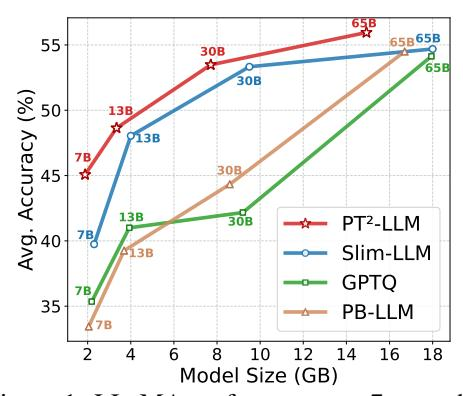

# 1 Introduction

Large Language Models (LLMs) (Touvron et al., 2023a;b; Dubey et al., 2024; Yang et al., 2025; Zhang et al., 2022) have achieved remarkable progress in language understanding, reasoning, and generation. They serve as the foundation for many real-world applications and remain at the forefront of AI research. However, these achievements are largely enabled by the massive scale of model parameters. Modern LLMs often contain tens or even hundreds of billions of parameters (e.g., DeepSeek-R1 (Guo et al., 2025) has 671 billion), leading to substantial memory consumption and intensive computational demands. Running such models demands powerful GPUs, large memory, and high energy, which hinders deployment on resource-limited or latency-sensitive platforms.

such models demands powerful GPUs, large memory, and high energy, which hinders deployment on resource-limited or latency-sensitive platforms.

Figure 1: LLaMA performance on 7 zero-shot Question Answering (QA) datasets. PT2-LLM yields the best accuracy at equal memory cost.

Weight-only quantization (Frantar et al., 2023) reduces weight precision to save memory and accelerate inference. Among various schemes, ternarization (Li et al., 2016) constrains weights to  $\{-1,0,+1\}$ , enabling high compression ratios and efficient computation. Compared to low-bit quantization (*e.g.*, 2–4 bit) (Lin et al., 2024b), it eliminates most floating-point multiplications by using simple additions, reducing both computational and energy costs. Compared to binarization (Rastegari et al., 2016), ternarization better fits the unimodal distribution of LLM weights and offers stronger representational capacity, yielding higher accuracy. Balancing efficiency and expressiveness, ternarization suits resource-limited LLM deployment (Wang et al., 2025; Yin et al., 2025).

\*Equal contribution

&lt;sup>†Corresponding authors: Yulun Zhang, yulun100@gmail.com

Recent studies [\(Lu et al.,](#page-10-3) [2024;](#page-10-3) [Zhang et al.,](#page-11-6) [2020\)](#page-11-6) on ternarization primarily focus on quantizationaware training (QAT), where models are trained under ternary constraints. Such methods are mainly explored on moderate-sized architectures like BERT or DiT, where training remains affordable. While attempts have been made to extend QAT-based ternarization to LLMs (*e.g.,* BitNet b1.58 [\(Ma](#page-10-4) [et al.,](#page-10-4) [2024\)](#page-10-4)), such approaches are highly impractical due to the immense parameter scale and the prohibitive demands on training resources, computational budget, and full access to training data. In contrast, post-training quantization (PTQ) offers a far more practical and efficient alternative: it enables rapid conversion from full-precision models to compact ternary versions without retraining or access to full training data, making it more suitable for real-world LLM deployment scenarios.

However, PTQ-based ternarization remains underexplored, as its direct application often causes severe performance degradation, making models unusable. Through analysis, we identify two main challenges: (i) Unlike QAT, which optimizes ternary parameters through gradient-based updates on large-scale training data, PTQ must efficiently refine them without any training, which poses a core challenge. (ii) As an extreme low-bit quantization scheme, ternarization struggles to represent weights with dispersed or outlier-heavy distributions, making it particularly prone to large quantization error.

In this paper, we propose PT2 -LLM, a post-training ternarization framework tailored for LLMs. To tackle the challenge of training-free ternary parameter optimization, we propose an Asymmetric Ternary Quantizer (ATQ), refined through two stages: Iterative Ternary Fitting (ITF) and Activationaware Grid Alignment (AGA). ITF alternates between optimal ternary grid construction and flexible rounding to minimize quantization error, while AGA leverages calibration data to further align ternary outputs with full-precision ones. To handle dispersed weights and outliers, we propose a plug-and-play Structural Similarity-based Reordering (SSR) strategy, which reorganizes columns based on inter-column structural correlation to ease quantization. Equipped with ATQ and SSR, PT2 -LLM enables accurate and robust post-training ternarization. As shown in Fig. [1,](#page-0-0) it outperforms state-of-the-art (SOTA) 2-bit PTQ methods in zero-shot QA accuracy under the same memory budget.

Our key contributions can be summarized as follows:

- We propose PT2 -LLM, a novel ternarization framework that efficiently compresses pretrained LLMs into a ternary grid without any retraining, addressing the unexplored challenges of post-training ternarization in LLMs.
- We design an Asymmetric Ternary Quantizer for post-training ternarization. It is optimized through two training-free stages: Iterative Ternary Fitting (ITF) and Activation-aware Grid Alignment (AGA). These components enable effective refinement of ternary parameters, reducing quantization error and improving alignment with full-precision outputs.
- We develop a plug-and-play Structural Similarity-based Reordering (SSR) strategy. It reorders weight columns based on structural similarity, which helps reduce quantization difficulty and suppress the influence of outliers.
- Extensive experiments demonstrate the competitive performance of PT2 -LLM compared to SOTA 2-bit PTQ methods, with reduced memory consumption and faster inference.

