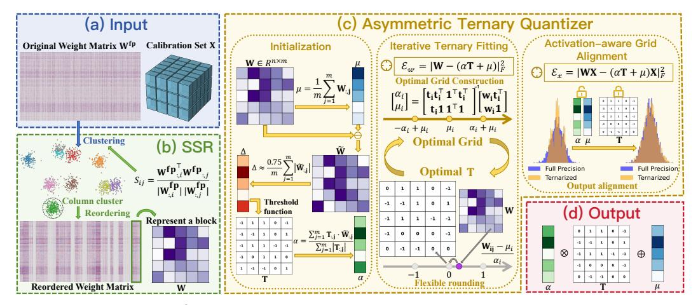

# 2.1 NETWORK TERNARIZATION

Ternarization compresses neural networks by constraining parameters to {−1, 0, +1}, making them memory and computation efficient while preserving strong representational capacity. Ternary weight networks (TWN) [\(Li et al.,](#page-10-0) [2016\)](#page-10-0) introduced scale-aware ternary quantization to minimize the Euclidean distance from full precision, achieving up to 16× compression. Trained ternary quantization (TTQ) [\(Zhu et al.,](#page-11-7) [2016\)](#page-11-7) improves accuracy by jointly learning both ternary weight values and their assignments during training. Further works [\(Wang et al.,](#page-11-8) [2018;](#page-11-8) [Alemdar et al.,](#page-9-3) [2017\)](#page-9-3) extended ternarization to activations, enabling fully ternary networks with greater efficiency. More recently, efforts have aimed to apply ternarization to larger and more complex models. TernaryBERT [\(Zhang et al.,](#page-11-6) [2020\)](#page-11-6) achieved 14.9× BERT compression via loss-aware ternarization and distillation. TerDiT [\(Lu](#page-10-3) [et al.,](#page-10-3) [2024\)](#page-10-3) scaled ternarization to 4.2B diffusion transformers. TernaryLLM [\(Chen et al.,](#page-9-4) [2024\)](#page-9-4) introduced learnable scaling and feature distillation, outperforming prior low-bit LLMs. BitNet b1.58 [\(Ma et al.,](#page-10-4) [2024\)](#page-10-4) proposed a ternary-weight training framework for LLMs, delivering near full-precision accuracy with reduced latency and energy consumption. However, most existing ternarization methods rely on training, limiting their practicality in real-world deployment.

Figure 2: Overview of PT2-LLM. **Structural Similarity-based Reordering (SSR)**: reorders columns based on structural similarity. **Asymmetric Ternary Quantizer**: enhanced by Iterative Ternary Fitting (ITF) and Activation-aware Grid Alignment (AGA) for refined ternary parameter optimization.

### 2.2 QUANTIZATION FOR LARGE LANGUAGE MODELS

Quantization reduces the memory footprint and inference cost of large language models, and is typically categorized into quantization-aware training (QAT) and post-training quantization (PTQ).

**Quantization-Aware Training (QAT).** QAT incorporates quantization during training, enabling LLMs to learn robust low-bit representations through backpropagation. Works such as LLM-QAT (Liu et al., 2024a) and BitDistiller (Du et al., 2024) leverage knowledge distillation to preserve accuracy under low-bit quantization. EfficientQAT (Chen et al., 2025) reduces QAT's overhead via a two-stage training scheme. Recent efforts like Onebit (Xu et al., 2024) and BinaryMoS (Jo et al., 2024) further extend QAT to the 1-bit regime. While QAT can effectively preserve performance under low-bit quantization, its high computational and memory cost remains a major limitation.

Post-Training Quantization (PTQ). Unlike QAT, PTQ directly quantizes pretrained models without retraining, making it more efficient and deployment-friendly for LLMs. Early methods (Dettmers et al., 2022; Yao et al., 2022; Li et al., 2021) improve quantization by introducing grouping labels. Techniques like AWQ (Lin et al., 2024b) and OWQ (Lee et al., 2024) introduced transformations that scale salient weights, aiming to preserve activation expressiveness and overall model capacity. GPTQ (Frantar et al., 2023) leverages Hessian-guided error compensation, with GP-TAQ (Li et al., 2025a) extending it via asymmetric calibration. OmniQuant (Shao et al., 2023) and SmoothQuant (Xiao et al., 2023) address activation outliers through scale redistribution. More recent work (Lin et al., 2024a; Ashkboos et al., 2024; Liu et al., 2024b) adopts rotation-based transformations for improved low-bit quantization. For ultra-low-bit settings, QuIP (Chee et al., 2025) and QuIP# (Tseng et al., 2025) use incoherence processing to boost performance, while Slim-LLM (Huang et al., 2025) employs salience-aware mixed-precision schemes. In the binarization domain, 1-bit methods such as PB-LLM (Shang et al., 2024), BiLLM (Huang et al., 2024), and ARB-LLM (Li et al., 2025b) show competitive results. Sub-1-bit approaches (Dong et al., 2025; Yan et al., 2025; Gu et al., 2025) further advance compression by reducing average bitwidths while retaining strong accuracy. Our method falls under the category of post-training ternary quantization.

