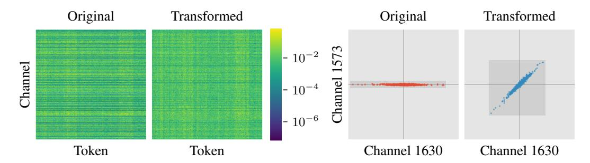

# 1 INTRODUCTION

Large language models (LLMs) have demonstrated remarkable capabilities across a wide range of tasks. However, their massive size and large memory footprint not only incur substantial inference costs but also hinder on-device deployment. To accelerate edge deployments, weight-only posttraining quantization (PTQ) converts model weights to lower-bit-width representations (*e.g*., INT4), reducing the memory footprint during inference and thus increasing throughput in memory-bound autoregressive decoding. To accelerate inference in large-batch LLM serving, activations can also be quantized to enable matrix multiplications in lower bitwidths, further reducing computational costs.

Nevertheless, both activations and weights in LLMs possess many outliers [\(Dettmers et al.,](#page-9-0) [2022;](#page-9-0) [Xiao et al.,](#page-11-0) [2023;](#page-11-0) [Lin et al.,](#page-10-0) [2024b\)](#page-10-0), making it challenging to preserve the original precision under low-bit quantization. Most existing PTQ methods [\(Frantar et al.,](#page-9-1) [2023;](#page-9-1) [Lin et al.,](#page-10-0) [2024b;](#page-10-0) [Wei et al.,](#page-11-1) [2023;](#page-11-1) [Shao et al.,](#page-10-1) [2024;](#page-10-1) [Lee et al.,](#page-10-2) [2024;](#page-10-2) [Ashkboos et al.,](#page-9-2) [2024;](#page-9-2) [Chen et al.,](#page-9-3) [2025;](#page-9-3) [Liu et al.,](#page-10-3) [2025b;](#page-10-3) [Tseng et al.,](#page-11-2) [2024b;](#page-11-2) [Sun et al.,](#page-11-3) [2025\)](#page-11-3) try to mitigate the impact of outliers, yet they either incur large quantization errors due to suboptimal outlier elimination or introduce significant overhead from arithmetic-intensive computation. For example, in weight-only quantization, AWQ [\(Lin et al.,](#page-10-0) [2024b\)](#page-10-0), a widely adopted and fast quantization method, causes a 2.8% accuracy drop of 4-bit quantized Qwen3-4B [\(Yang et al.,](#page-11-4) [2025\)](#page-11-4) on MMLU-Pro [\(Wang et al.,](#page-11-5) [2024\)](#page-11-5). In contrast, QTIP [\(Tseng et al.,](#page-11-2) [2024b\)](#page-11-2), which achieves state-of-the-art quantization accuracy, is about 30% slower than AWQ because of the extra overhead introduced to mitigate outliers.

With the advent of reasoning LLMs [\(Jaech et al.,](#page-10-4) [2024;](#page-10-4) [Guo et al.,](#page-9-4) [2025;](#page-9-4) [Yang et al.,](#page-11-4) [2025\)](#page-11-4), we argue that *both* accuracy and efficiency are critical for practical quantization methods. Reasoning models achieve superior performance by generating a large number of chain-of-thought tokens, presenting unique challenges for quantization. On the one hand, quantization error *accumulates* at each decoding

Figure 1: Effect of optimized channel-wise scaling and rotations. Left: Magnitude of the k proj weight in the first layer of LLaMA-3-8B [\(Grattafiori et al.,](#page-9-5) [2024\)](#page-9-5) before and after the transform. The outlier channels have been eliminated effectively. Right: Scatter of two channels of the weight matrix before and after the transform. In addition to scaling, which concentrates values of the entire channel, rotations draw values from different channels closer at *each token* (clustering around the x = y line).

step, which becomes particularly pronounced in long generation [\(Zhao et al.,](#page-11-6) [2025;](#page-11-6) [Liu et al.,](#page-10-5) [2025a\)](#page-10-5). On the other hand, the substantial computational cost of generating long sequences requires that the quantization process itself introduce negligible overhead. Thus, there is a critical need for a quantization method that achieves high fidelity with minimal extra overhead.

In this paper, we propose Pairwise Rotation Quantization (ParoQuant), a PTQ method that combines high accuracy with minimal computational overhead, making it well-suited to reasoning LLMs. Our design rests on two key observations: (1) rotations effectively suppress outliers, and (2) a sparsely parameterized rotation can be as effective as a full rotation. Building on these insights, we introduce scaled pairwise rotation, a hardware-efficient and optimizable transform composed of *independent Givens rotations* and *channel-wise scaling*. Channel-wise scaling evens out the average magnitude across channels, while the pairwise (*i.e*., Givens) rotations align the values within each channel pair at every token position, narrowing the dynamic range of each quantization group. As illustrated in Figure [1,](#page-1-0) our proposed transform makes the weights more quantization-friendly. To fully exploit the massive parallelism of modern GPUs, we further constrain the rotations to be mutually independent, a system-level design choice that keeps the impact on decoding latency minimal. Thanks to our algorithm-system co-design, under weight-only quantization, ParoQuant achieves an average 2.4% improvement over AWQ on reasoning tasks with less than 10% extra overhead, and matches the accuracy of QTIP while being about 25% faster. ParoQuant is also applicable for weight-activation quantization, and it matches the best existing quantization methods.

