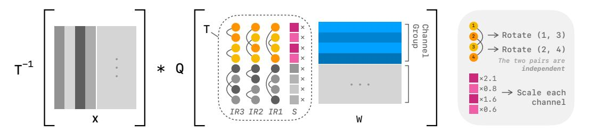

# 2 BACKGROUND AND RELATED WORK

### 2.1 LLM QUANTIZATION

Quantization is the process of converting values from high-precision to low-precision counterparts. The simple Round-to-Nearest (RTN) linear quantization with bit width b can be formulated as:

$$Q(\mathbf{X}) = \operatorname{clamp}\left(\left\lfloor \frac{\mathbf{X}}{s} \right\rfloor + z, 0, 2^b - 1\right), \text{ where } s = \frac{\max(\mathbf{X}) - \min(\mathbf{X})}{2^b - 1}, z = -\left\lfloor \frac{\min(\mathbf{X})}{s} \right\rfloor. \tag{1}$$

In this work, we focus on *weight-only* PTQ, *i.e*., quantizing weights of pre-trained models while keeping the activations in FP16, although our method can be extended to weight-activation quantization (Section [A.3\)](#page-14-0). We follow the best practices proposed by [Dettmers & Zettlemoyer](#page-9-6) [\(2023\)](#page-9-6) and adopt block-wise quantization with a given group size g, *i.e*., calculating a separate s and z in Equation [\(1\)](#page-1-1) for every g consecutive elements along the channel dimension (*i.e*., input dimension), instead of the whole matrix. Blocking helps to confine outliers within each group and increases overall quantization accuracy, particularly in linear quantization where quantization error is relatively large.

One major challenge of quantizing pre-trained LLMs to low bits is the presence of *outlier channels* across layers [\(Dettmers et al.,](#page-9-0) [2022;](#page-9-0) [Xiao et al.,](#page-11-0) [2023;](#page-11-0) [Lin et al.,](#page-10-0) [2024b\)](#page-10-0). They occupy the limited dynamic range of low-bit representations and cause precision loss of non-outlier elements, presenting a major challenge to PTQ. Past works have extensively studied the approaches to address the outlier issue, and the solutions can be broadly grouped into three categories: storing the outliers separately in higher precision (Dettmers et al., 2022; Kim et al., 2024; Lee et al., 2024; Zhao et al., 2024), designing quantization algorithms suitable for non-uniform distributions (Frantar et al., 2023; Chee et al., 2023; Tseng et al., 2024a;b), and transforming weights into quantization-friendly counterparts before quantization (Lin et al., 2024b; Wei et al., 2023; Shao et al., 2024; Ashkboos et al., 2024; Lin et al., 2024a; Chee et al., 2023; Liu et al., 2025b; Tseng et al., 2024a;b; Sun et al., 2025; Malinovskii et al., 2025). Yet, it remains a key challenge to balance quantization accuracy and inference speed, as effective outlier elimination often comes at the cost of significant overhead.

#### 2.2 EQUIVALENT WEIGHT TRANSFORM

Among the three outlier handling techniques discussed earlier, transforming weights before quantization has been widely adopted by most recent PTQ methods and has proven to be very effective. For a linear layer  $\mathbf{Y} = \mathbf{X}\mathbf{W} + \mathbf{b}$ , where input  $\mathbf{X} \in \mathbb{R}^{T \times C_{\text{in}}}$ , weight  $\mathbf{W} \in \mathbb{R}^{C_{\text{in}} \times C_{\text{out}}}$ , and bias  $\mathbf{b} \in \mathbb{R}^{1 \times C_{\text{out}}}$ , we can apply an invertible transform  $\mathbf{T}$  to the weight  $\mathbf{W}$  without affecting the output:

$$\mathbf{Y} = \mathbf{X}\mathbf{W} + \mathbf{b} = (\mathbf{X}\mathbf{T}^{-1})(\mathbf{T}\mathbf{W}) + \mathbf{b}.$$
 (2)

We then quantize TW instead of W. An appropriate T can reduce the outliers in W and lead to higher quantization accuracy. The inverse transform  $T^{-1}$  can either be applied on the fly during inference or be merged into other operators, depending on the characteristics of the transform.

Two main types of transform have been proposed in previous work: *channel-wise scaling*, where **T** is a diagonal matrix (Lin et al., 2024b; Shao et al., 2024; Wei et al., 2023), and *rotation*, where **T** is an orthogonal matrix (Chee et al., 2023; Ashkboos et al., 2024; Liu et al., 2025b; Lin et al., 2024a; Tseng et al., 2024a;b; Sun et al., 2025; Malinovskii et al., 2025). Channel-wise scaling scales each channel separately to even out the magnitude across channels and can usually be merged into preceding operators without incurring extra overhead (Lin et al., 2024b). Rotation enables cross-channel interactions that can concentrate values more effectively than channel-wise scaling (Chee et al., 2023; Liu et al., 2025b). However, rotations cannot be merged into element-wise operators like channel-wise scaling does, so they usually require online computation. This limits the application of rotations in efficient quantization algorithms, as common orthogonal transforms are computationally expensive, and it motivates the design of more efficient yet equally effective alternatives.

### 3 MOTIVATION

**Quantization Error Accumulates in Long Generation.** AWQ (Lin et al., 2024b) is a widely used weight-only quantization method and has become the *de facto* approach for INT4 quantization. It employs channel-wise scaling to minimize quantization error and causes only slight performance degradation on most tasks with limited generated tokens, without introducing any extra overhead from the transform. However, we observe that the degradation becomes more severe as the generation length grows, especially on reasoning tasks with reasoning models, where the generation length often exceeds tens of thousands of tokens. For example, the accuracy of Qwen3-4B (Yang et al., 2025) on MMLU-Pro (Wang et al., 2024) drops sharply **from 71.0 to 68.2** after being quantized to 4 bits with AWQ. This degradation occurs because quantization errors accumulate at each decoding step.

Rotations Are Expressive but Expensive. Rotations outperform channel-wise scaling in eliminating outliers and generally lead to lower quantization error when many outliers are present (Figure 2). However, applying arbitrary rotations requires performing matrix multiplications in FP16, which negates the efficiency gains of quantization. There are two main approaches to address this issue. SpinQuant (Liu et al., 2025b) proposes to merge the rotation matrix into the weight of the preceding linear layer so that no extra computation is needed during inference. However, in a typical decoder block, the output projection is the only linear layer that can be transformed by such mergeable rotations; other linears are preceded by element-wise operators or residual connections that cannot absorb matrix multiplications. The second approach is to restrict the orthogonal transform to a subset that can be computed efficiently on the fly. Several works adopt the Hadamard transform, a special orthogonal transform that can be computed in  $\mathcal{O}(n \log n)$  time for dimension n (Chee et al., 2023; Ashkboos et al., 2024; Liu et al., 2025b; Tseng et al., 2024a;b). Yet the Hadamard transform is fixed or is generated by random vectors, disregarding the unique weight distribution of each linear layer and introducing large variance (Liu et al., 2025b). Moreover, it still adds considerable overhead, making Hadamard-based quantization significantly slower ( $\approx$ 30%) than AWQ during inference.

Figure 2: Loss curves from optimizing transforms to minimize quantization-induced output error ( $\|\mathbf{X}Q(\mathbf{W}) - \mathbf{X}\mathbf{W}\|$ ) for the k\_proj weight matrix in the first layer of LLaMA-3-8B. Rotations can minimize quantization error better than channel-wise scaling, and keeping the 10% most significant pairs is equally expressive as a full rotation. See Section A.2 for more details.

Rotations Have Many Redundant Parameters. An  $n \times n$  orthogonal matrix can be decomposed into the product of at most  $\frac{1}{2}n(n-1)$  Givens rotations (i.e., rotations in the plane spanned by two axes), which translates to rotating all possible pairs of channels sequentially. Intuitively, rotations between an outlier channel and a normal channel would be more effective at reducing outliers than rotations between two normal channels. We validate this intuition with a simple experiment: for a linear layer with many outliers, optimizing only the top 10% channel pairs with largest magnitude difference is almost as effective at reducing quantization-induced output error as optimizing all pairs (Figure 2). This creates an opportunity for designing parameter-efficient and potentially inference-efficient rotations for addressing the outlier issue: by retaining only the rotations between channel pairs that have large magnitude differences, we can maintain the effectiveness of a full  $n \times n$  orthogonal matrix.

#### 4 Method

In this section, we introduce ParoQuant, a weight-only quantization method that applies optimized parameter- and inference-efficient rotations to effectively reduce quantization error. We start with the design of our *scaled pairwise rotation* transform. Then, we introduce the algorithm to optimize the transform and fine-tune the quantized models. Finally, we provide an efficient kernel that enables extremely fast inference. Our focus in this paper is on *linear quantization* as it is more efficient than vector quantization and is better supported by existing inference frameworks (Lin et al., 2024b; Zheng et al., 2024; Kwon et al., 2023), though the same method can be extended to vector quantization.

### 4.1 SCALED PAIRWISE ROTATION

We follow a three-step process to design our scaled pairwise rotation transform. First, we avoid direct matrix multiplications by replacing orthogonal matrices with decomposed *Givens rotations*. Next, we remove dependencies among these rotations to enable parallel execution on GPUs, resulting in *independent rotation*. Finally, because a single independent rotation is not effective enough to fit complex weight distributions, we sequentially apply a *series of independent rotations* combined with *channel-wise scaling* to improve the fitting capability.

#### 4.1.1 GIVENS ROTATION

Based on the observation in Section 3 that most parameters in an orthogonal matrix are redundant, we can select a small set of channel pairs  $\mathcal{P} = \{(i_1, j_1), \dots, (i_m, j_m)\}$  and sequentially rotate each pair in  $\mathcal{P}$  instead of performing full matrix multiplication. Formally, given  $\mathcal{P}$ , a set of rotation angles  $\Theta = \{\theta_1, \dots, \theta_m\}$ , and the weight matrix  $\mathbf{W}$ , the transformed weight is

$$\mathbf{W}^{(m)} = G(i_m, j_m, \theta_m) G(i_{m-1}, j_{m-1}, \theta_{m-1}) \cdots G(i_1, j_1, \theta_1) \mathbf{W},$$
(3)

where  $G(i_k, j_k, \theta_k)$  is a Givens rotation that rotates two rows of the matrix while keeping others intact. This operation can be applied in place with just a few vectorized multiply-and-add instructions:

$$\mathbf{W}^{(k)}[i,:] = \cos \theta_k \cdot \mathbf{W}^{(k-1)}[i,:] - \sin \theta_k \cdot \mathbf{W}^{(k-1)}[j,:], \mathbf{W}^{(k)}[j,:] = \sin \theta_k \cdot \mathbf{W}^{(k-1)}[i,:] + \cos \theta_k \cdot \mathbf{W}^{(k-1)}[j,:].$$
(4)

Figure 3: Overview of scaled pairwise rotation (T). The channel dimension is divided into fixed-size groups (the group size is 4 in the figure). Each group of the weights  $(\mathbf{W})$  is transformed by channel-wise scaling  $(\mathbf{S})$ , followed by a series of independent rotations  $(\mathbf{IR})$ . Each independent rotation consists of pairwise rotations that are mutually independent (i.e., non-overlapping). Quantization (Q) is applied after the transform using a group size equal to the channel group size. The inverse transform  $(T^{-1})$  is applied to the activations  $(\mathbf{X})$ .

The actual computation during inference is applying the inverse of the Givens rotation sequence in Equation (3) to the activations X. The inverse can be conveniently obtained by reversing the sequence and replacing each  $\theta_k$  with  $-\theta_k$ :

$$\mathbf{X}^{(m)} = \mathbf{X} G(i_1, j_1, -\theta_1) G(i_2, j_2, -\theta_2) \cdots G(i_m, j_m, -\theta_m), \tag{5}$$

which can also be computed efficiently, similar to Equation (4).

#### 4.1.2 Independent Rotation

Givens rotations eliminate the need for matrix multiplications, but they remain inefficient due to potential dependencies. Such dependencies arise when a channel rotates with more than one other channel. In these cases, Givens rotations are not commutative, and the order in which they are applied matters. As a result, dependent Givens rotations must be computed sequentially and cannot fully exploit the GPU's massive parallelism, leading to significant latency. To address this issue, we require the pairs within  $\mathcal{P}$  to be mutually *independent*, *i.e.*, each channel may appear in only one pair. Under this constraint, it follows directly from Equation (4) that the computation for each pair is completely independent and does not interfere with any other pair. Consequently, all Givens rotations for  $\mathcal{P}$  are *fully parallelizable*. The same conclusion applies to Equation (5).

In addition to computational efficiency, another benefit of independent rotations is their intrinsic compatibility with block-wise quantization. In block-wise quantization, an outlier channel within a group can only impact the quantization accuracy of other channels within the same group. Naturally, we can exploit the isolation between groups by applying a separate independent rotation for each group. This enables fine-grained pair selections specific to each group and allows a higher degree of parallelism (see Section 4.3).

We formulate independent pairs and independent rotation as follows:

**Definition 1** (Independent Pairs). Consider a set of pairs  $\mathcal{P} = \{(i_1, j_1), \dots, (i_n, j_n)\}$ , and let each pair  $(i_k, j_k)$  be represented as a set  $P_k = \{i_k, j_k\}$ .  $\mathcal{P}$  is a set of *independent pairs* if and only if:

$$\forall P_k, P_l \in \{P_1, \dots, P_n\} \text{ where } k \neq l, \quad P_k \cap P_l = \emptyset.$$
 (6)

**Definition 2** (Independent Rotation). Consider the product of a set of Givens rotations on pairs  $\mathcal{P} = \{(i_1, j_1), \dots, (i_n, j_n)\}$  with the corresponding angles  $\Theta = \{\theta_1, \dots, \theta_n\}$ :

$$R(\mathcal{P},\Theta) = \prod_{k=1}^{n} G(i_k, j_k, \theta_k), \tag{7}$$

we say  $R(\mathcal{P}, \Theta)$  is an *independent rotation* if and only if  $\mathcal{P}$  is a set of independent pairs.

#### 4.1.3 Series of Independent Rotations

With dependencies eliminated, independent rotations can be applied online during inference with very small overhead. However, an independent rotation of dimension n can accommodate only  $\frac{n}{2}$ 

independent pairs, which correspond to  $\frac{n}{2}$  tunable parameters. This is only a fraction  $\frac{1}{n-1}$  of the  $\frac{1}{2}n(n-1)$  parameters in a full orthogonal matrix and thus severely limits its fitting capability. To overcome this limitation, instead of using only one independent rotation, we sequentially apply a small number (e.g., 8) of them to improve the expressiveness of the transform. Multiple rotations can be fused into a single kernel with a one-time memory load with minimal overhead (see Section 4.3).

Algorithm A1 describes how ParoQuant selects pairs for a series of independent rotations. For each rotation, we randomly select available pairs while ensuring the rotation remains independent. To enable more diverse combinations of channel pairs across different independent rotations, we skip pairs that have already been selected in previous rotations. This constraint may result in an insufficient number of pairs for some rotations, but the impact is negligible in practice.

### 4.1.4 COMBINING CHANNEL-WISE SCALING

On top of a series of independent rotations, we apply channel-wise scaling to further reduce quantization error. Because independent rotations act on only a limited number of pairs  $(\mathcal{O}(n) \ vs. \ \mathcal{O}(n^2))$  for a full rotation), the ability of channel-wise scaling to directly even out the magnitudes across the *entire* matrix is crucial for our transform to match the expressiveness of full rotations. It is also more straightforward to suppress *isolated* outliers with channel-wise scaling than with Givens rotations.

After combining independent rotations with channel-wise scaling, the final transform (*i.e.*, scaled pairwise rotation) applied to the weights before quantization is:

$$T_{\mathcal{P},\Theta,\alpha}(\mathbf{W}) = \left(\prod_{t=1}^{K} R(\mathcal{P}_t, \Theta_t)\right) \cdot \operatorname{diag}(\alpha) \cdot \mathbf{W}, \tag{8}$$

where K is the number of rotations,  $\mathcal{P} = \{\mathcal{P}_1, \dots, \mathcal{P}_K\}$  and  $\Theta = \{\Theta_1, \dots, \Theta_K\}$  are the corresponding sets of rotation pairs and angles,  $R(\mathcal{P}_t, \Theta_t)$  is the t-th independent rotation, and  $\alpha$  is the set of per-channel scaling factors. Integrating channel-wise scaling is efficient, as it can be fused into the rotation kernel at minimal cost. We refer the readers to Section 5.3 and Section A.2 for the effectiveness of independent rotations and channel-wise scaling.

### 4.2 LAYER-WISE OPTIMIZATION

To optimize the scaled pairwise rotation in Equation (8), we adopt a layer-wise optimization scheme to minimize the output loss of each layer. Specifically, for a decoder layer D, we minimize

$$\mathcal{L}(Q) = \|Q(D)(\mathbf{X}') - D(\mathbf{X})\|, \tag{9}$$

where Q(D) is the decoder D with every linear layer quantized after applying the scaled pairwise rotation,  $\mathbf{X}$  is the input to D of the original model, and  $\mathbf{X}'$  is the output of the *already quantized* preceding decoder layers. By optimizing with the new output computed from  $\mathbf{X}'$  instead of from  $\mathbf{X}$ , the subsequent layers can compensate for quantization errors introduced by earlier layers, thereby improving end-to-end accuracy.

For each layer, we optimize the quantized model in two stages. In the first stage, we optimize rotations and channel-wise scaling. After this stage, most outliers in the weight matrices are suppressed, and the weights are more quantization-friendly. However, some isolated outliers may still remain, as rotations and scaling cannot eliminate them completely. Therefore, in the second stage, we adopt a QAT-like approach similar to EfficientQAT (Chen et al., 2025) to fine-tune the weights and the linear quantization parameters s and z in Equation (1), thereby further reducing the error introduced by the RTN algorithm. The pseudocode for the optimization algorithm is available in Section A.1.

#### 4.3 CO-DESIGNING EFFICIENT TRANSFORM KERNEL

To enable fast inference, we implement the scaled pairwise rotation transform as a single fused CUDA kernel. Thanks to the transform's independence at both the group and pair levels, the computation is fully parallelized at three levels: (1) *token*: we parallelize across the token dimension of the activation tensor; (2) *channel group*: we assign different CUDA blocks to different groups along the channel dimension; (3) *pair*: each rotation pair is processed by a separate CUDA thread.

This fine-grained parallelism across groups and pairs offers several advantages. First, dividing the channel dimension into groups reduces the memory load required for each thread block. Because the group size (*e.g*., 128) is relatively small, the activation tensor fits into the on-chip shared memory, and the rotation parameters (*i.e*., pair indices and angles) fit into registers. This significantly reduces the latency of subsequent memory access. As a result, multiple independent rotations can then be fused efficiently, since the activation and all parameters are already loaded into low-latency memory. Second, group-wise parallelism increases the occupancy of the GPU's compute units, particularly when the channel dimension is very large. From Figure [4,](#page-6-0) the speedup of our transform (with 8 independent rotations) over the fast Hadamard transform [\(Dao,](#page-9-8) [2024\)](#page-9-8)

Figure 4: Speedup of scaled pairwise rotation over the Hadamard transform on an RTX A6000.

increases with the channel dimension, because the Hadamard transform has inherent dependencies across all channels. Third, pair-level independence within each rotation allows synchronization-free execution across all CUDA threads within a thread block, further improving hardware utilization.

