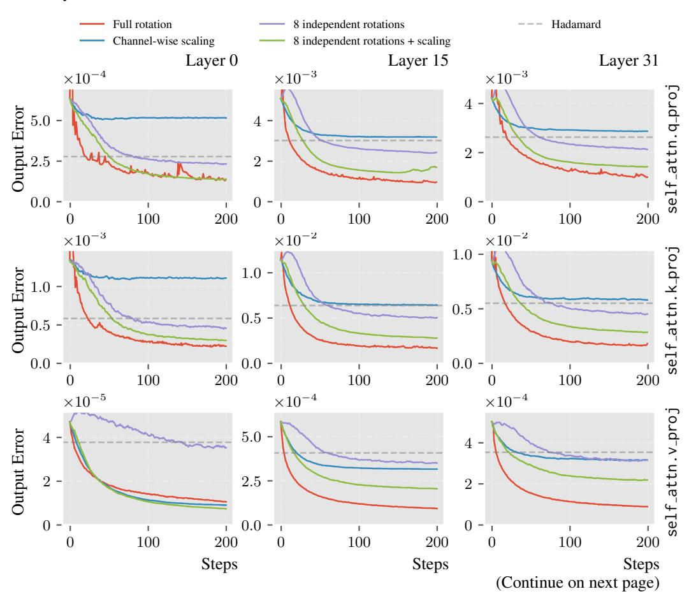
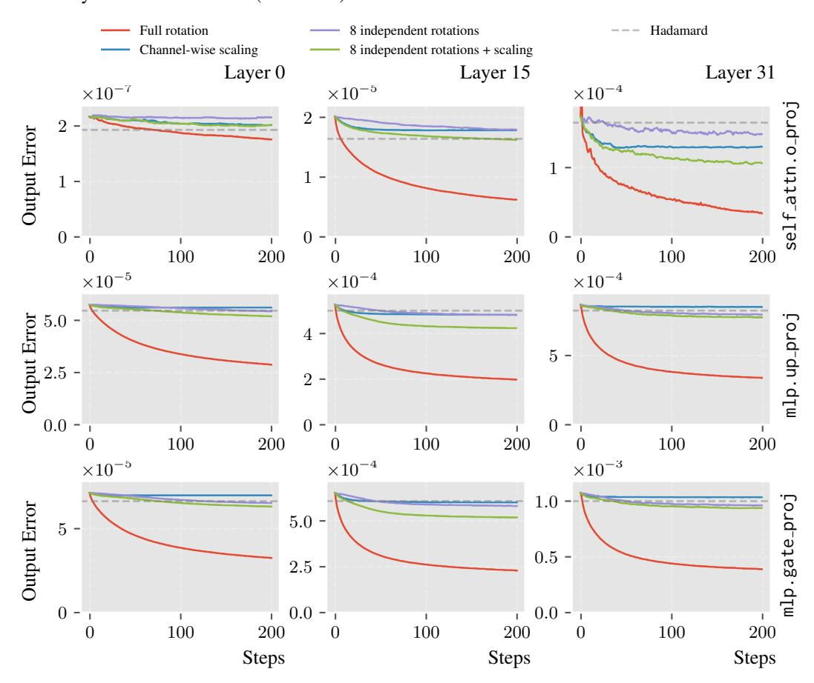

# REFERENCES

- <span id="page-9-2"></span>Saleh Ashkboos, Amirkeivan Mohtashami, Maximilian L. Croci, Bo Li, Pashmina Cameron, Martin Jaggi, Dan Alistarh, Torsten Hoefler, and James Hensman. QuaRot: Outlier-Free 4-Bit Inference in Rotated LLMs. In *Conference on Neural Information Processing Systems (NeurIPS)*, 2024. [1,](#page-0-0) [3](#page-2-1)
- <span id="page-9-7"></span>Jerry Chee, Yaohui Cai, Volodymyr Kuleshov, and Christopher De Sa. QuIP: 2-Bit Quantization of Large Language Models with Guarantees. In *Conference on Neural Information Processing Systems (NeurIPS)*, 2023. [3](#page-2-1)
- <span id="page-9-3"></span>Mengzhao Chen, Wenqi Shao, Peng Xu, Jiahao Wang, Peng Gao, Kaipeng Zhang, and Ping Luo. EfficientQAT: Efficient Quantization-Aware Training for Large Language Models. In *Annual Meeting of the Association for Computational Linguistics (ACL)*, 2025. [1,](#page-0-0) [6,](#page-5-2) [7](#page-6-2)
- <span id="page-9-10"></span>Christopher Clark, Kenton Lee, Ming-Wei Chang, Tom Kwiatkowski, Michael Collins, and Kristina Toutanova. BoolQ: Exploring the Surprising Difficulty of Natural Yes/No Questions. In *Conference of the North American Chapter of the Association for Computational Linguistics (NAACL)*, 2019. [7](#page-6-2)
- <span id="page-9-11"></span>Peter Clark, Isaac Cowhey, Oren Etzioni, Tushar Khot, Ashish Sabharwal, Carissa Schoenick, and Oyvind Tafjord. Think you have Solved Question Answering? Try ARC, the AI2 Reasoning Challenge. *arXiv preprint arXiv:1803.05457*, 2018. [7](#page-6-2)
- <span id="page-9-8"></span>Tri Dao. Fast Hadamard Transform in CUDA, with a PyTorch Interface. [https://github.com/Dao-AILab/](https://github.com/Dao-AILab/fast-hadamard-transform) [fast-hadamard-transform](https://github.com/Dao-AILab/fast-hadamard-transform), 2024. [7](#page-6-2)
- <span id="page-9-6"></span>Tim Dettmers and Luke Zettlemoyer. The Case for 4-bit Precision: K-bit Inference Scaling Laws. In *International Conference on Machine Learning (ICML)*, 2023. [2,](#page-1-2) [7](#page-6-2)
- <span id="page-9-0"></span>Tim Dettmers, Mike Lewis, Younes Belkada, and Luke Zettlemoyer. LLM.int8(): 8-bit Matrix Multiplication for Transformers at Scale. In *Conference on Neural Information Processing Systems (NeurIPS)*, 2022. [1,](#page-0-0) [2,](#page-1-2) [3](#page-2-1)
- <span id="page-9-9"></span>Jesse Dodge, Maarten Sap, Ana Marasovic, William Agnew, Gabriel Ilharco, Dirk Groeneveld, Margaret ´ Mitchell, and Matt Gardner. Documenting Large Webtext Corpora: A Case Study on The Colossal Clean Crawled Corpus. In *Conference on Empirical Methods in Natural Language Processing (EMNLP)*, 2021. [7](#page-6-2)
- <span id="page-9-13"></span>Vage Egiazarian, Roberto L Castro, Denis Kuznedelev, Andrei Panferov, Eldar Kurtic, Shubhra Pandit, Alexandre Marques, Mark Kurtz, Saleh Ashkboos, Torsten Hoefler, et al. Bridging the gap between promise and performance for microscaling fp4 quantization. *arXiv preprint arXiv:2509.23202*, 2025. [16](#page-15-2)
- <span id="page-9-1"></span>Elias Frantar, Saleh Ashkboos, Torsten Hoefler, and Dan Alistarh. GPTQ: Accurate Post-Training Quantization for Generative Pre-trained Transformers. In *International Conference on Learning Representations (ICLR)*, 2023. [1,](#page-0-0) [3,](#page-2-1) [15](#page-14-1)
- <span id="page-9-12"></span>Leo Gao, Stella Biderman, Sid Black, Laurence Golding, Travis Hoppe, Charles Foster, Jason Phang, Horace He, Anish Thite, Noa Nabeshima, et al. The Pile: An 800GB Dataset of Diverse Text for Language Modeling. *arXiv preprint arXiv:2101.00027*, 2020. [7](#page-6-2)
- <span id="page-9-14"></span>Leo Gao, Jonathan Tow, Baber Abbasi, Stella Biderman, Sid Black, Anthony DiPofi, Charles Foster, Laurence Golding, Jeffrey Hsu, Alain Le Noac'h, et al. The Language Model Evaluation Harness, 2024. URL <https://zenodo.org/records/12608602>. [17](#page-16-1)
- <span id="page-9-5"></span>Aaron Grattafiori, Abhimanyu Dubey, Abhinav Jauhri, Abhinav Pandey, Abhishek Kadian, Ahmad Al-Dahle, Aiesha Letman, Akhil Mathur, Alan Schelten, Alex Vaughan, et al. The llama 3 herd of models. *arXiv preprint arXiv:2407.21783*, 2024. [2,](#page-1-2) [7](#page-6-2)
- <span id="page-9-4"></span>Daya Guo, Dejian Yang, Haowei Zhang, Junxiao Song, Ruoyu Zhang, Runxin Xu, Qihao Zhu, Shirong Ma, Peiyi Wang, Xiao Bi, et al. DeepSeek-R1: Incentivizing Reasoning Capability in LLMs via Reinforcement Learning. *arXiv preprint arXiv:2501.12948*, 2025. [1,](#page-0-0) [7](#page-6-2)

- <span id="page-10-16"></span>Nathan Habib, Clementine Fourrier, Hynek Kydl ´ ´ıcek, Thomas Wolf, and Lewis Tunstall. Lighteval: A lightweight ˇ framework for llm evaluation, 2023. URL <https://github.com/huggingface/lighteval>. [17](#page-16-1)
- <span id="page-10-4"></span>Aaron Jaech, Adam Kalai, Adam Lerer, Adam Richardson, Ahmed El-Kishky, Aiden Low, Alec Helyar, Aleksander Madry, Alex Beutel, Alex Carney, et al. OpenAI O1 System Card. *arXiv preprint arXiv:2412.16720*, 2024. [1](#page-0-0)
- <span id="page-10-6"></span>Sehoon Kim, Coleman Hooper, Amir Gholami, Zhen Dong, Xiuyu Li, Sheng Shen, Michael W. Mahoney, and Kurt Keutzer. SqueezeLLM: Dense-and-Sparse Quantization. In *International Conference on Machine Learning (ICML)*, 2024. [3](#page-2-1)
- <span id="page-10-9"></span>Woosuk Kwon, Zhuohan Li, Siyuan Zhuang, Ying Sheng, Lianmin Zheng, Cody Hao Yu, Joseph Gonzalez, Hao Zhang, and Ion Stoica. Efficient Memory Management for Large Language Model Serving with PagedAttention. In *ACM Symposium on Operating Systems Principles (SOSP)*, 2023. [4,](#page-3-3) [17](#page-16-1)
- <span id="page-10-2"></span>Changhun Lee, Jungyu Jin, Taesu Kim, Hyungjun Kim, and Eunhyeok Park. OWQ: Outlier-Aware Weight Quantization for Efficient Fine-Tuning and Inference of Large Language Models. In *AAAI Conference on Artificial Intelligence (AAAI)*, 2024. [1,](#page-0-0) [3](#page-2-1)
- <span id="page-10-15"></span>Quentin Lhoest, Albert Villanova del Moral, Yacine Jernite, Abhishek Thakur, Patrick von Platen, Suraj Patil, Julien Chaumond, Mariama Drame, Julien Plu, Lewis Tunstall, et al. Datasets: A Community Library for Natural Language Processing. In *Conference on Empirical Methods in Natural Language Processing (EMNLP)*, 2021. [16](#page-15-2)
- <span id="page-10-7"></span>Haokun Lin, Haobo Xu, Yichen Wu, Jingzhi Cui, Yingtao Zhang, Linzhan Mou, Linqi Song, Zhenan Sun, and Ying Wei. DuQuant: Distributing Outliers via Dual Transformation Makes Stronger Quantized LLMs. In *Conference on Neural Information Processing Systems (NeurIPS)*, 2024a. [3](#page-2-1)
- <span id="page-10-0"></span>Ji Lin, Jiaming Tang, Haotian Tang, Shang Yang, Wei-Ming Chen, Wei-Chen Wang, Guangxuan Xiao, Xingyu Dang, Chuang Gan, and Song Han. AWQ: Activation-Aware Weight Quantization for On-Device LLM Compression and Acceleration. In *Conference on Machine Learning and Systems (MLSys)*, 2024b. [1,](#page-0-0) [2,](#page-1-2) [3,](#page-2-1) [4,](#page-3-3) [7](#page-6-2)
- <span id="page-10-5"></span>Ruikang Liu, Yuxuan Sun, Manyi Zhang, Haoli Bai, Xianzhi Yu, Tiezheng Yu, Chun Yuan, and Lu Hou. Quantization hurts reasoning? an empirical study on quantized reasoning models. *arXiv preprint arXiv:2504.04823*, 2025a. [2,](#page-1-2) [17](#page-16-1)
- <span id="page-10-3"></span>Zechun Liu, Changsheng Zhao, Igor Fedorov, Bilge Soran, Dhruv Choudhary, Raghuraman Krishnamoorthi, Vikas Chandra, Yuandong Tian, and Tijmen Blankevoort. SpinQuant: LLM Quantization with Learned Rotations. In *International Conference on Learning Representations (ICLR)*, 2025b. [1,](#page-0-0) [3,](#page-2-1) [7](#page-6-2)
- <span id="page-10-13"></span>Ilya Loshchilov and Frank Hutter. Decoupled Weight Decay Regularization. In *International Conference on Learning Representations (ICLR)*, 2019. [7](#page-6-2)
- <span id="page-10-12"></span>MAA. American Invitational Mathematics Examination - AIME, 2025. URL [https://maa.org/](https://maa.org/math-competitions/american-invitational-mathematics-examination-aime) [math-competitions/american-invitational-mathematics-examination-aime](https://maa.org/math-competitions/american-invitational-mathematics-examination-aime). [7](#page-6-2)
- <span id="page-10-8"></span>Vladimir Malinovskii, Andrei Panferov, Ivan Ilin, Han Guo, Peter Richtarik, and Dan Alistarh. Higgs: Pushing ´ the limits of large language model quantization via the linearity theorem. In *Proceedings of the 2025 Conference of the Nations of the Americas Chapter of the Association for Computational Linguistics: Human Language Technologies (Volume 1: Long Papers)*, pp. 10857–10886, 2025. [3](#page-2-1)
- <span id="page-10-10"></span>Stephen Merity, Caiming Xiong, James Bradbury, and Richard Socher. Pointer Sentinel Mixture Models. In *International Conference on Learning Representations (ICLR)*, 2017. [7](#page-6-2)
- <span id="page-10-14"></span>Adam Paszke, Sam Gross, Francisco Massa, Adam Lerer, James Bradbury, Gregory Chanan, Trevor Killeen, Zeming Lin, Natalia Gimelshein, Luca Antiga, et al. PyTorch: An Imperative Style, High-Performance Deep Learning Library. In *Conference on Neural Information Processing Systems (NeurIPS)*, 2019. [16](#page-15-2)
- <span id="page-10-11"></span>David Rein, Betty Li Hou, Asa Cooper Stickland, Jackson Petty, Richard Yuanzhe Pang, Julien Dirani, Julian Michael, and Samuel R. Bowman. GPQA: A Graduate-Level Google-Proof Q&A Benchmark. In *Conference on Language Modeling (COLM)*, 2024. [7](#page-6-2)
- <span id="page-10-1"></span>Wenqi Shao, Mengzhao Chen, Zhaoyang Zhang, Peng Xu, Lirui Zhao, Zhiqian Li, Kaipeng Zhang, Peng Gao, Yu Qiao, and Ping Luo. OmniQuant: Omnidirectionally Calibrated Quantization for Large Language Models. In *International Conference on Learning Representations (ICLR)*, 2024. [1,](#page-0-0) [3,](#page-2-1) [7](#page-6-2)

- <span id="page-11-3"></span>Yuxuan Sun, Ruikang Liu, Haoli Bai, Han Bao, Kang Zhao, Yuening Li, Xianzhi Yu, Lu Hou, Chun Yuan, Xin Jiang, et al. Flatquant: Flatness matters for llm quantization. In *Forty-second International Conference on Machine Learning*, 2025. [1,](#page-0-0) [3,](#page-2-1) [16](#page-15-2)
- <span id="page-11-10"></span>Hugo Touvron, Louis Martin, Kevin Stone, Peter Albert, Amjad Almahairi, Yasmine Babaei, Nikolay Bashlykov, Soumya Batra, Prajjwal Bhargava, Shruti Bhosale, et al. Llama 2: Open Foundation and Fine-Tuned Chat Models. *arXiv preprint arXiv:2307.09288*, 2023. [7](#page-6-2)
- <span id="page-11-8"></span>Albert Tseng, Jerry Chee, Qingyao Sun, Volodymyr Kuleshov, and Christopher De Sa. QuIP#: Even Better LLM Quantization with Hadamard Incoherence and Lattice Codebooks. In *International Conference on Machine Learning (ICML)*, 2024a. [3,](#page-2-1) [7](#page-6-2)
- <span id="page-11-2"></span>Albert Tseng, Qingyao Sun, David Hou, and Christopher M De Sa. QTIP: Quantization with Trellises and Incoherence Processing. In *Conference on Neural Information Processing Systems (NeurIPS)*, 2024b. [1,](#page-0-0) [3,](#page-2-1) [7](#page-6-2)
- <span id="page-11-5"></span>Yubo Wang, Xueguang Ma, Ge Zhang, Yuansheng Ni, Abhranil Chandra, Shiguang Guo, Weiming Ren, Aaran Arulraj, Xuan He, Ziyan Jiang, et al. MMLU-Pro: A More Robust and Challenging Multi-Task Language Understanding Benchmark. In *Conference on Neural Information Processing Systems (NeurIPS)*, 2024. [1,](#page-0-0) [3,](#page-2-1) [7](#page-6-2)
- <span id="page-11-12"></span>Maurice Weber, Dan Fu, Quentin Anthony, Yonatan Oren, Shane Adams, Anton Alexandrov, Xiaozhong Lyu, Huu Nguyen, Xiaozhe Yao, Virginia Adams, et al. RedPajama: an Open Dataset for Training Large Language Models. In *Conference on Neural Information Processing Systems (NeurIPS)*, 2024. [7](#page-6-2)
- <span id="page-11-1"></span>Xiuying Wei, Yunchen Zhang, Yuhang Li, Xiangguo Zhang, Ruihao Gong, Jinyang Guo, and Xianglong Liu. Outlier Suppression+: Accurate Quantization of Large Language Models by Equivalent and Optimal Shifting and Scaling. In *Conference on Empirical Methods in Natural Language Processing (EMNLP)*, 2023. [1,](#page-0-0) [3](#page-2-1)
- <span id="page-11-13"></span>Thomas Wolf, Lysandre Debut, Victor Sanh, Julien Chaumond, Clement Delangue, Anthony Moi, Pierric Cistac, Tim Rault, Remi Louf, Morgan Funtowicz, et al. Transformers: State-of-the-Art Natural Language Processing. In *Conference on Empirical Methods in Natural Language Processing (EMNLP)*, 2020. [8,](#page-7-2) [16](#page-15-2)
- <span id="page-11-0"></span>Guangxuan Xiao, Ji Lin, Mickael Seznec, Hao Wu, Julien Demouth, and Song Han. SmoothQuant: Accurate and Efficient Post-Training Quantization for Large Language Models. In *International Conference on Machine Learning (ICML)*, 2023. [1,](#page-0-0) [2](#page-1-2)
- <span id="page-11-4"></span>An Yang, Anfeng Li, Baosong Yang, Beichen Zhang, Binyuan Hui, Bo Zheng, Bowen Yu, Chang Gao, Chengen Huang, Chenxu Lv, et al. Qwen3 Technical Report. *arXiv preprint arXiv:2505.09388*, 2025. [1,](#page-0-0) [3,](#page-2-1) [7](#page-6-2)
- <span id="page-11-11"></span>Rowan Zellers, Ari Holtzman, Yonatan Bisk, Ali Farhadi, and Yejin Choi. HellaSwag: Can a Machine Really Finish Your Sentence? In *Annual Meeting of the Association for Computational Linguistics (ACL)*, 2019. [7](#page-6-2)
- <span id="page-11-6"></span>Juntao Zhao, Wenhao Lu, Sheng Wang, Lingpeng Kong, and Chuan Wu. QSPEC: Speculative decoding with complementary quantization schemes. In *Proceedings of the 2025 Conference on Empirical Methods in Natural Language Processing*, pp. 4779–4795, 2025. [2](#page-1-2)
- <span id="page-11-7"></span>Yilong Zhao, Chien-Yu Lin, Kan Zhu, Zihao Ye, Lequn Chen, Size Zheng, Luis Ceze, Arvind Krishnamurthy, Tianqi Chen, and Baris Kasikci. Atom: Low-Bit Quantization for Efficient and Accurate LLM Serving. In *Conference on Machine Learning and Systems (MLSys)*, 2024. [3](#page-2-1)
- <span id="page-11-9"></span>Lianmin Zheng, Liangsheng Yin, Zhiqiang Xie, Chuyue Livia Sun, Jeff Huang, Cody Hao Yu, Shiyi Cao, Christos Kozyrakis, Ion Stoica, Joseph E Gonzalez, et al. SGLang: Efficient Execution of Structured Language Model Programs. In *Conference on Neural Information Processing Systems (NeurIPS)*, 2024. [4](#page-3-3)

#### <span id="page-12-2"></span>A.1 CORE ALGORITHMS

### Algorithm A1: Selection of Independent Channel Pairs

```
Input: \mathbf{W} \in \mathbb{R}^{g \times D}: a subgroup of the weight sliced along channel dimension, where q is the
           group size; K: number of independent rotations; \tilde{N}: number of pairs per rotation.
Output: \mathcal{P}_1, \dots, \mathcal{P}_K: lists of selected pairs for each rotation.
\mathcal{P} \leftarrow \{(i,j) \mid 1 \le i < j \le g\}
\mathcal{P}_{\text{shuffled}} \leftarrow \text{Shuffle}(\mathcal{P})
// Matrix to track available pairs across all rotations
Initialize \mathbf{A} \in \mathbb{R}^{g \times g} where \mathbf{A}_{ij} \leftarrow 1, \forall i, j \in \{1, ..., g\}, i \neq j \text{ and } \mathbf{A}_{ii} \leftarrow 0, \forall i \in \{1, ..., g\}
\mathcal{P}_1,\ldots,\mathcal{P}_K \leftarrow []
for r \leftarrow 1 to K do
     \mathbf{A}_{rot} \leftarrow Copy(\mathbf{A})
                                                    // Tracks available channels within this rotation
     foreach pair (i, j) \in \mathcal{P}_{\text{shuffled}} do
           if |\mathcal{P}_r| = N then break
           if A_{rot}[i, j] = 0 then continue
                                                                                // Select the next available pairs
           Append (i, j) to \mathcal{P}_r
           \mathbf{A}_{\text{rot}}[i,:] \leftarrow 0; \mathbf{A}_{\text{rot}}[:,i] \leftarrow 0; \mathbf{A}_{\text{rot}}[j,:] \leftarrow 0; \mathbf{A}_{\text{rot}}[:,j] \leftarrow 0 // Block channels
                                                                                                                       // Block pair
           \mathbf{A}[i,j] \leftarrow 0; \mathbf{A}[j,i] \leftarrow 0
return \mathcal{P}_1,\ldots,\mathcal{P}_K
```

#### <span id="page-12-1"></span>**Algorithm A2:** Layer-Wise Optimization

```
Input: \mathcal{L}: decoder layers of the model; g: group size; K: number of rotations; N: number of
           pairs per rotation; \mathcal{D}: calibration dataset.
Output: \mathcal{L}': decoder layers containing optimized scaling, rotations, and quantizers.
\mathcal{X} \leftarrow \text{tokenize } \mathcal{D}
                                                                          // {\mathcal X} is the original input to a layer
\mathcal{X}' \leftarrow \mathcal{X}
                   // \mathcal{X}' is the input to a layer after quantizing preceding layers
\mathcal{L}' \leftarrow []
foreach layer l \in \mathcal{L} do
     \mathcal{Y} \leftarrow l(\mathcal{X})
                                                                           // Output of original layer as labels
     l' \leftarrow \text{Copy}(l)
     foreach linear \in l' do
           \mathbf{W}_1, \dots, \mathbf{W}_n \leftarrow \text{Partition } linear \text{ with group size } g \text{ at channel dimension}
           \textbf{for } i \leftarrow 1 \textbf{ to } n \textbf{ do}
                 \mathcal{P}_i \leftarrow \text{SelectPairs}(\mathbf{W}_i, K, N)
                                                                                                                      // Algorithm A1
                                                                                 // Angles and channel-wise scaling
                 \theta_i \leftarrow \mathbf{0}_{K \times N}, \ \boldsymbol{\alpha}_i \leftarrow \mathbf{1}_a
                 \mathbf{s}_i, \mathbf{z}_i \leftarrow \text{Initialize quantizer with } \mathbf{W}_i
                                                                                                                      // Equation (1)
              Insert scaling \alpha_i, rotations (\mathcal{P}_i, \boldsymbol{\theta}_i), and quantizer (\mathbf{s}_i, \mathbf{z}_i) into l'
     l'' \leftarrow \text{Optimize all } \boldsymbol{\theta}_i \text{ and } \boldsymbol{\alpha}_i \text{ to minimize } \|\mathcal{Y} - l'(\mathcal{X}')\|
                                                                                                                               // Stage 1
     l''' \leftarrow \text{Optimize all } \mathbf{s}_i, \mathbf{z}_i, \text{ and weights to minimize } \|\mathcal{Y} - l''(\mathcal{X}')\|
                                                                                                                              // Stage 2
     Append l''' to \mathcal{L}'
     \mathcal{X}' \leftarrow l'''(\mathcal{X})
                                                    // Ouantized layers' output as next layer's input
     \mathcal{X} \leftarrow \mathcal{Y}
                                                                             // Pass down original layer's output
return \mathcal{L}'
```

#### <span id="page-12-3"></span><span id="page-12-0"></span>EFFECTIVENESS ANALYSIS

To study the effectiveness of different transforms at minimizing quantization-induced output error  $(\|\mathbf{X}Q(\mathbf{W}) - \mathbf{X}\mathbf{W}\|)$ , we optimize each linear layer individually with each transform applied to the input dimension of its weight W and obtain the loss curves of the optimization process. We compare the effectiveness of five transforms:

- Channel-wise scaling: We optimize per-channel scaling factors  $\alpha$  for the weight W, *i.e.*,  $\hat{W} = \operatorname{diag}(\alpha) \cdot W$ .
- Full rotation: We construct an orthogonal matrix R from an upper triangular matrix U by  $R = \exp(U U^T)$  (exp is the matrix exponential), and optimize the elements of U.
- **Random Hadamard transform**: We sample the average output error after applying a random Hadamard transform generated using one of 100 seeds.
- **Independent rotation**: We select 8 independent rotations for each 128-channel group using Algorithm A1.
- Scaled pairwise rotation (independent rotation + channel-wise scaling): We select 8 independent rotations for each 128-channel group using Algorithm A1.

To optimize the transforms, we use AdamW with a learning rate of 0.001 for the full rotation and 0.01 for other transforms. We use 128 samples from Pile and optimize for 200 steps.

The results for the first, middle, and last layer of LLaMA-3-8B are listed in Figure A1. mlp.down\_proj results are not included because the input dimension is too large for the full rotation. From the results, independent rotations can lower quantization error better than channel-wise scaling in layers that possess many outliers (*e.g.*, q\_proj and k\_proj), and generally outperform random Hadamard transform with much lower overhead. When combined with channel-wise scaling, independent rotations can almost match the effectiveness of a full rotation in layers with many outliers. This proves the superior expressiveness of our proposed scaled pairwise rotation transform.

<span id="page-13-0"></span>Figure A1: Loss curves from optimizing transforms to minimize quantization-induced output error of linear layers in LLaMA-3-8B.





<span id="page-14-1"></span>Figure A1: Loss curves from optimizing transforms to minimize quantization-induced output error of linear layers in LLaMA-3-8B (continued).

### <span id="page-14-0"></span>A.3 EXTENSION TO WEIGHT-ACTIVATION QUANTIZATION

In this section, we extend ParoQuant to 4-bit weight-activation (W4A4) quantization. We did not tune ParoQuant specifically for W4A4, and thus the results may not be optimal; however, we share these preliminary findings to facilitate further research.

Weight-Activation Quantization. Similar to Equation (2), a linear layer  $\mathbf{Y} = \mathbf{X}\mathbf{W} + \mathbf{b}$  is reformulated and quantized as

$$\mathbf{Y}' = Q(\mathbf{X}\mathbf{T}^{-1}) \cdot Q(\mathbf{T}\mathbf{W}) + \mathbf{b}. \tag{10}$$

By quantizing activations after the inverse transform  $T^{-1}$ , the matrix multiplication is performed entirely in low precision.

**Per-Linear Optimization with GPTQ.** We discover that per-decoder optimization often fails to converge under 4-bit activation quantization, so we employ a per-*linear* strategy with error compensation. Specifically, modules within a decoder are optimized sequentially using the quantized outputs of all preceding modules as calibration inputs, enabling downstream layers to adapt to and compensate for accumulated quantization error. In addition, naively optimizing the weights during the fine-tuning stage used in the W4A16 setting is unstable, so we instead adopt GPTQ (Frantar et al., 2023) to recover the precision of the transformed weights  $T(\mathbf{W})$  instead of fine-tuning.

<span id="page-15-2"></span>**Evaluation.** We evaluate ParoQuant under the W4A4 setting using the same evaluation setup described in Section A.7. For INT4 quantization, we compare ParoQuant with two state-of-the-art methods SpinQuant and FlatQuant (Sun et al., 2025). We also apply ParoQuant to the MXFP4 format, which is a hardware-native microscaling format, and we compare it to MR-GPTQ (Egiazarian et al., 2025). All methods employ GPTQ for weight quantization.

| Method    | W2 (↓) | C4 (↓) | Non-reasoning (†) | Reasoning (†) |
|-----------|--------|--------|-------------------|---------------|
| FP16      | 6.24   | 6.97   | 70.8              | 70.7          |
| SPINQUANT | 7.13   | 7.89   | 66.6              | 61.7          |
| FLATQUANT | 6.51   | 7.25   | 69.4              | 63.9          |
| PAROQUANT | 6.62   | 7.36   | 67.7              | 63.6          |

Table A2: INT4 W4A4 quantization results.

| Method    | W2 (↓) | C4 (↓) | Non-reasoning (†) | Reasoning (†) |
|-----------|--------|--------|-------------------|---------------|
| FP16      | 6.24   | 6.97   | 70.8              | 70.7          |
| MR-GPTQ   | 6.99   | 7.71   | 68.4              | 62.5          |
| PAROQUANT | 6.75   | 7.44   | 69.6              | 61.4          |

Table A3: MXFP4 W4A4 quantization results.

For INT4, ParoQuant outperforms SpinQuant by a large margin and is comparable with FlatQuant, both of which are specifically optimized for weight-activation quantization. For MXFP4, ParoQuant also outperforms the state-of-the-art MR-GPTQ, which is designed for microscaling formats. These preliminary results demonstrate the effectiveness of ParoQuant's scaled pairwise rotation and indicate strong potential for further improvements in weight-activation quantization performance.

#### <span id="page-15-0"></span>A.4 IMPLEMENTATION DETAILS

**Quantization and Transform.** We apply block-wise linear quantization with a group size of 128. We apply channel-wise scaling and 8 independent rotations on each 128-channel group of the weights, with each rotation consisting of up to 64 pairs. The independent rotations are applied sequentially after channel-wise scaling.

**Libraries.** Our implementation is built with PyTorch 2.8.0 (Paszke et al., 2019), Transformers 4.55.2 (Wolf et al., 2020), and Datasets 3.6.0 (Lhoest et al., 2021).

**Optimization.** We optimize all ParoQuant-quantized models in Section 5 with a single NVIDIA H200 GPU. We sample a training set of size 2048 evenly from WikiText2, C4, and RedPajama, and use 64 samples from Pile as the validation set to select the best parameters at each epoch. The training set and the validation set are shuffled with a fixed seed of 0. The sequence length of each sample is 2048. We set the batch size as 16, and apply a learning rate of 0.05 for rotation angles and channel-wise scaling,  $10^{-5}$  for weights, and  $10^{-6}$  for scales and zero points. The batch size and the learning rates are halved for the 70B model due to memory constraints. The rotation angles are initialized to 0, the channel-wise scaling factors are initialized to 1, and the scales and zero points are initialized using Equation (1). We use AdamW to optimize the parameters for 10 epochs at each stage (see Algorithm A2 for the two stages) with a cosine learning rate scheduler, which gradually decays the learning rate to 1/20 of the original value. The hyperparameters weight\_decay, betas, and eps of the AdamW optimizer are set to 0.01, (0.9, 0.95), and  $10^{-10}$ , respectively. We use SmoothL1Loss from PyTorch as the loss function.

#### <span id="page-15-1"></span>A.5 DECODING THROUGHPUT

Table A4 shows the decoding throughput of the original FP16 models and 4-bit models quantized with AWQ, QTIP, and ParoQuant. To ensure a fair comparison, we only replace the original linear

<span id="page-16-1"></span>layers in the original models with the implementation provided by the official open-sourced repository of each baseline. For ParoQuant, we adopt the W4A16 GEMM kernels from the AWQ repository together with our transform kernel. All throughput results were obtained with PyTorch 2.6.0 using torch.compile in max-autotune mode and with CUDA Graphs enabled.

<span id="page-16-3"></span>RTX A6000 Bits Q3-1.7 Q3-4 L2-7 L3-8 Q3-8 L2-13 Q3-14 Q3-32 L3-70 FP16 16 170 78 50 45 44 26 25 OOM OOM AWQ 4 320 176 140 120 113 78 70 34 17 QTIP 4 209 117 106 95 91 62 55 28 15 PAROQ 4 278 160 130 112 106 74 65 33 16 RTX 6000 Ada Bits Q3-1.7 Q3-4 L2-7 L3-8 Q3-8 L2-13 Q3-14 Q3-32 L3-70 FP16 16 213 99 63 56 55 33 31 OOM OOM AWQ 4 394 230 176 153 147 100 89 44 21 QTIP 4 270 166 138 125 118 83 80 40 20 PAROQ 4 341 206 163 142 136 94 84 42 21 RTX 4090 Bits Q3-1.7 Q3-4 L2-7 L3-8 Q3-8 L2-13 Q3-14 Q3-32 L3-70 FP16 16 233 109 69 62 61 OOM OOM OOM OOM AWQ 4 433 251 192 167 159 109 98 48 OOM QTIP 4 286 172 149 138 138 91 82 42 OOM PAROQ 4 372 224 177 155 147 102 93 46 OOM

Table A4: Decoding (batch size = 1) throughput (tokens/s).

