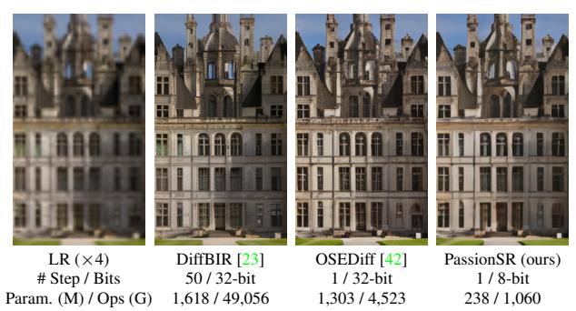

# 1. Introduction

Image super-resolution (SR) is a fundamental and challenging task in computer vision, aiming to reconstruct highresolution (HR) images from low-resolution (LR) inputs by recovering lost structures and details. Over time, various image SR models have been developed to tackle this challenge. Early image SR methods [\[2,](#page-8-0) [4,](#page-8-1) [7,](#page-8-2) [53\]](#page-9-0) focus on simple synthetic degradations, such as bicubic downsampling, to create LR-HR pairs. GAN approaches [\[21,](#page-8-3) [37,](#page-9-1) [49\]](#page-9-2) introduce more complex degradation processes. Although these methods have advanced image quality significantly, when applied to real-world datasets, they encounter some issues, such as training stability and performance drop, showing the limitations of early image SR methods.

Figure 1. Visual comparison (×4) between full-precision (FP) multi-step and one-step diffusion SR models and our 8-bit quantized PassionSR. Compared to FP models, PassionSR achieves about 81.77% params reduction and 4× speedup.

Recently, diffusion-based image SR models have been attracting researchers' attention. Diffusion models exhibit strong performance across various tasks, including image SR (see Fig. [1\)](#page-0-0), due to their excellent generation ability and robust training stability. Diffusion-based SR models [\[23,](#page-8-4) [36,](#page-9-4) [43\]](#page-9-5) leverage their capability to capture complex data distributions, achieving superior perceptual quality.

However, achieving high-quality results with diffusion models comes at the expense of substantial computational demands, latency, and storage requirements. It poses significant challenges for deployment on hardware devices. Several strategies have been developed to improve the efficiency of diffusion models. For instance, fast diffusion samplers [\[31,](#page-9-6) [54\]](#page-9-7) and distillation techniques [\[32\]](#page-9-8) have reduced the number of denoising steps. With the advance of score distillation-based methods [\[40,](#page-9-9) [47\]](#page-9-10), one-step diffusion (OSD) image super-resolution (OSDSR) models have become feasible, such as SinSR [\[38\]](#page-9-11), OSEDiff [\[42\]](#page-9-3), and DFOSD [\[17\]](#page-8-5). Despite reducing denoising steps to one, OS-DSR models still face high computational costs and storage requirements. For example, in OSEDiff [\[42\]](#page-9-3), the parameters and Ops are 1,303M and 4,523G, respectively. The high computational complexity causes a significant burden for mobile devices like smartphones. This problem hinders the widespread use of diffusion models, especially in scenarios with limited storage and computational resources.

\*Corresponding authors: Haotong Qin and Yulun Zhang

| Components | UNet    | VAE       | DAPE    | ClipEncoder | Total     |
|------------|---------|-----------|---------|-------------|-----------|
| Params (M) | 865,785 | 83,614    | 160,335 | 193,055     | 1,302,789 |
| MACs (G)   | 339.241 | 1,781.123 | 126.591 | 14.856      | 2,261.811 |

Table 1. Params and FLOPs statistics in OSEDiff [\[42\]](#page-9-3).

To compress the OSDSR model, quantization stands out as an effective approach. Model quantization [\[6,](#page-8-6) [11,](#page-8-7) [16\]](#page-8-8) is a powerful compression technique that reduces weights and activations from full-precision (FP) to low-bit precision. Thereby, it significantly lowers storing and computational demands by substituting floating-point operations with integer operations. However, performance gap between quantized and FP versions is inevitable. Minimizing this gap is crucial for the successful application of quantization techniques to OSDSR models.

Although current low-bit quantization strategies [\[10,](#page-8-9) [18,](#page-8-10) [20,](#page-8-11) [28\]](#page-9-12) have achieved promising results for multi-step diffusion quantization, significant performance drops still occur when applied to OSDSR models. Additionally, existing strategies are often hard to achieve optimal compression rates. We encounter three primary challenges:

*I. Complex Model Structure.* Unlike many multi-step diffusion models, the OSDSR model includes numerous submodules. *(i)* In the previous multi-step diffusion quantization methods, most attention has been paid to UNet quantization while Variational Autoencoder (VAE) keeps FP. However, in OSDSR models, because UNet inference steps are reduced to one, it is essential to quantize VAE, which accounts for over 80% of the computational load, as shown in Tab. [1.](#page-1-0) *(ii)* We need to design special calibration strategies for branch modules (*e.g.*, DAPE, CLIPEncoder), which brings lots of difficulties for quantization.

*II. Transition from Multi-Step to One-Step.* Most existing quantization techniques are designed for multi-step diffusion models and incorporate special techniques tailored to their multi-step nature. These techniques do not perform as effectively on OSDSR as on multi-step models. Many of them are even infeasible on OSDSR (see Fig. [2\)](#page-1-1). It means we need to design a new calibration strategy tailored for OSDSR, taking better advantage of its features rather than applying the previous methods on OSDSR directly.

*III. Imbalanced Activation Distribution.* Imbalanced activation distribution is a prevalent issue in model quantization. The presence of excessive outliers complicates the determination of optimal quantized parameters in traditional post-training quantization (PTQ) methods. And quantization-aware training (QAT) often encounters convergence challenges due to the quantization function and high demands in training time and memory usage.

Based on the above analyses, we propose a novel *P*osttraining quantization method with *A*daptive *S*cale in one-*S*tep diffus*ION* based image *S*uper-*R*esolution, named *PassionSR*. In this work, we select OSEDiff [\[42\]](#page-9-3) as our quantization backbone due to its excellent performance and high

LSQ [\[8\]](#page-8-13) Q-Diffusion [\[18\]](#page-8-10) EfficientDM [\[9\]](#page-8-14) PassionSR (ours) Figure 2. Visual comparison (×4) of one-step diffusion SR models. We use OSEDiff as a 32-bit full-precision (FP) reference and provide 6-bit quantized version with different methods.

inference speed. *Firstly*, we perform a pruning operation to simplify the model to its two core components, the UNet and VAE, with minimal or even no performance drop. We name the FP model structure after pruning as PassionSR-FP. It is easier for us to design calibration strategies. *Secondly*, we propose a *Learnable Boundary Quantizer* (LBQ) and *Learnable Equivalent Transformation* (LET) to the quantization process. LBQ allows for training-based optimization. While, LET enables control over the distribution of activations without any additional computational expense, which is achieved through an adaptable scale parameter. The training process renders this scale parameter adaptive, which proves more effective than traditional initialization methods. *Thirdly*, we design a calibration strategy, Distributed Quantization Calibration (DQC), that stabilizes the training of quantized parameters and promotes rapid convergence, achieving QAT-level effectiveness with PTQ efficiency.

Comprehensive experiments (*i.e.*, Figs. [1](#page-0-0) and [2\)](#page-1-1) indicate that PassionSR incurs a performance drop of less than 1% at 8-bit precision and maintains relatively high performance even at 6-bit precision. Compared to recent leading diffusion quantization methods, PassionSR demonstrates significant performance advantages across various bit widths in one-step diffusion (OSD) model quantization. PassionSR delivers outstanding visual quality over other quantization methods. When compared with OSEDiff, our PassionSR achieves about 80∼85% parameters compression and operations reduction. Overall, our contributions are as follows:

- We propose a low-bit quantized OSDSR model, PassionSR. To the best of our knowledge, this is the first work to investigate low-bit quantization (*e.g.*, 6-bit and 8-bit) for OSDSR in a PTQ manner.
- We design a UNet-VAE model (*i.e.*, PassionSR-FP) structure that maintains high performance while simplifying the overall model to only UNet and VAE.
- We propose the Learnable Equivalent Transformation (LET) for the quantization of OSD models. Distributed Quantization Calibration (DQC) is designed to stabilize the training and accelerate the convergence.
- Our PassionSR achieves perceptual performance largely comparable to that of a full-precision model at 8-bit and 6-bit precision and obtains better performance and higher scores over other quantization methods.

