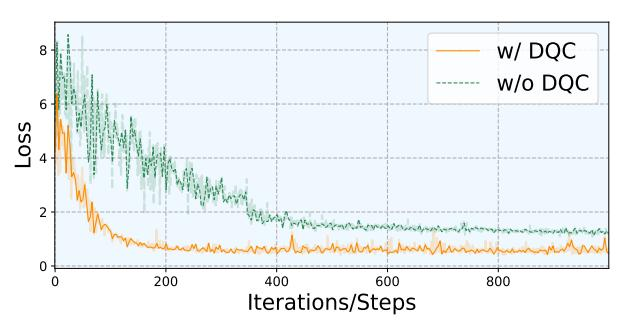

# 3. Methods

### 3.1. Preliminaries

Diffusion Models. Diffusion models [\[27\]](#page-8-17) are generative techniques that gradually introduce noise into data and then learn to invert this process to create new samples. The process starts with a real data distribution pdata(x), where data x0 is gradually transformed into noise over several time steps, t = 1, 2, . . . , T. At each step, the data evolves towards randomness with noise controlled by a time-dependent parameter βt, which increases with each step. After enough steps, the data distribution becomes close to the standard normal distribution, i.e., xt ∼ N (0, I). Then process is reversed to recover the original data x0 from the noisy data xt by training a neural model to predict xt−1 from xt. The network learns the denoising function, parameterized by θ, which predicts the clean data mean µθ(xt, t) and the noise level σ 2 (t). By iterating this process, new samples are generated from random noise, gradually refined step by step. This denoising process allows the model to generate highly realistic samples.

Model Quantization. Model quantization uses both the scale factor and zero point bias to handle the shift in the data distribution. It reduces memory consumption and computation time by mapping model parameters and activations to low-bit integers. Given a floating-point vector x, the quantization operation is as follows:

$$\hat{x} = Q(\mathbf{x}, s, z) = s \cdot \text{Clip}\left(\frac{\mathbf{x} - z}{s}, l, u\right) + z,$$
 (1)

where s is the scaling factor that controls quantization precision, and the zero-point bias z shifts the data before scaling. Clip(·, l, u) bounds the quantized values within the range from the lower bounds l to upper bounds u.

Since quantization involves the non-differentiable rounding operations, the straight-through estimator (STE [\[24\]](#page-8-19)) is commonly used to approximate gradients:

$$\frac{\partial L(x)}{\partial x} \approx \begin{cases} 1 & \text{if } x \in [l, u], \\ 0 & \text{otherwise.} \end{cases}$$
 (2)

Figure 4. Overview of our PassionSR. Step 1: we simplify OSEDiff [42] by removing DAPE and CLIP Encoder, obtaining PassionSR-FP. Step 2: the quantizer we use has two key trainable parts, consisting of the Learnable Boundary Quantizer and Learnable Equivalent Transformation. Step 3: we design a distributed calibration strategy and special loss function to accelerate convergence of calibration.

#### 3.2. UNet-VAE Model Structure

Based on OSEDiff [42], we obtain a full-precision (FP) model PassionSR-FP by simplifying the original design to only UNet and VAE while maintaining comparable performance. The details of the simplified model structure are shown in Step 1 of Fig. 4. Compared to OSEDiff, we replace the DAPE-CLIPEncoder branch with a constant embedding, preprocessed by the ClipEncoder using an empty string. Owing to the similar basic components, we can adopt similar calibration strategy on them.

#### 3.3. Learnable Quantized Parameter Strategy

To minimize performance drop in quantization, we introduce learnable quantized parameters and use a preconstructed small calibration dataset to guide the training, which is both time- and memory-efficient. It is important to note that only the quantized parameters are trained, while the original weight parameters remain unchanged. Step 2 in Fig. 4 visualizes the two key components with trainable parameters of our quantizer, LBQ and LET.

#### 3.3.1 Learnable Boundary Quantizer (LBQ)

To simulate the quantization loss, we apply fake quantization [12] to both activations and weights. The quantization and dequantization processes are defined as Eq. (3). Using

it we define the Learnable Boundary Quantizer

$$\begin{cases} X_{c} = \mathbf{Clip}(X, B_{l}, B_{u}), \alpha = \frac{B_{u} - B_{l}}{2^{N} - 1}, \beta = B_{l}, \\ X_{I} = \left\lfloor \frac{X_{c} - \beta}{\alpha} \right\rfloor, X_{q} = \alpha X_{I} + \beta, \end{cases}$$
(3)

where  $X_q$  is the fake-quantized value used to simulate quantization error. The function  $\mathbf{Clip}(X, B_1, B_u)$  is defined as  $\max(\min(X, B_u), B_1)$ , and  $\lfloor x \rceil$  rounds the input x to the nearest integer. The parameters  $B_1$  and  $B_u$ , representing the lower and upper boundaries, are the only trainable parameters, deciding the function of whole LBQ.

#### 3.3.2 Learnable Equivalent Transformation (LET)

Inspired by SmoothQuant [25] and OmniQuant [29], we introduce channel-wise trainable scale and shift factors to adjust the activation distribution, effectively addressing challenges posed by outliers during quantization.

The fundamental layers to be quantized in diffusion models include the linear layer, convolution layer, and matrix multiplication within the attention layer. We apply equivalent transformations to these layers, balancing the distribution of activations and weights and making the model more suitable for quantization. To maximize its potential to reduce performance drop, finetuning is required to obtain better parameters in LET.

Linear Layer. In a typical linear layer, whose input dimension is  $C_{in}$  and output dimension is  $C_{out}$ , the input matrix  $X \in \mathbb{R}^{N \times C_{\text{in}}}$  is multiplied by the weight matrix  $W \in \mathbb{R}^{C_{\text{in}} \times C_{\text{out}}}$ , along with a bias matrix  $B \in \mathbb{R}^{1 \times C_{\text{out}}}$ , resulting in an output matrix  $Y \in \mathbb{R}^{N \times C_{\text{out}}}$ .

To introduce equivalent transformations in the linear layer, we apply a learnable scale factor  $s \in \mathbb{R}^{1 \times C_{\mathrm{in}}}$  and an offset factor  $\delta \in \mathbb{R}^{1 \times C_{\text{in}}}$  to the input X. To preserve the output Y, corresponding transformations are applied to Wand B, resulting in transformed input X, weight W, and bias B, as shown in Eq. (4):

$$\tilde{W} = s \odot W, \tilde{X} = (X - \delta) \oslash s, \tilde{B} = B + \delta W,$$
 (4)

where  $\odot$ ,  $\oslash$  are element-wise multiplication and division.

After applying the quantizer LBQ to the linear layer, the simulated quantized output  $Y_q$  is expressed as Eq. (5). And Eq. (6) refers to full precision output  $Y_{\rm fp}$ :

$$\begin{cases} Y_{\rm q} = Q_{\rm a}(\tilde{X})Q_{\rm w}(\tilde{W}) + Q_{\rm w}(\tilde{B}), & (5) \\ Y_{\rm fp} = \tilde{X}\tilde{W} + \tilde{B} = XW + B = Y, & (6) \\ \text{where } Q_{\rm a} \text{ and } Q_{\rm w} \text{ are the activation and weight quantizers.} \end{cases}$$

Convolution Layer. Equivalent transformations are applied along the channel dimension. The operations and quantization methods are similar to those in the linear layer by replacing matrix multiplication with convolution.

Attention Operation. In diffusion models, the attention operation is crucial for quantization due to the emergence of outliers following the softmax operation. It has been observed in vision transformers [48]. We apply similar transformations to the matrix multiplication of the Q, K, and Vmatrices in the transformer blocks. For example, the multiplication of the Q and K matrices can be transformed as shown in Eq. (7). After this transformation, the quantizer is applied to the transformed matrices Q and K, yielding the simulated quantized output  $P_q$ :

$$\begin{cases} \tilde{Q} = Q \oslash s, \quad s \odot K = \tilde{K}, \\ P_{q} = \text{Softmax}(Q_{\text{al}}(\tilde{Q})Q_{\text{a2}}(\tilde{K}^{\top})). \end{cases}$$
 (7)

It is worth noting that the scale factor s and offset  $\delta$  used in activation conversion can be merged into the preceding linear, convolution, or normalization layers. s and  $\delta$  used in weight and bias conversion can be incorporated directly into the weights and biases. This integration brings no additional memory or computation costs, making it hardwarefriendly. Hardware experiments by AWQ [22] have confirmed the compatibility of this equivalent transformation when employing quantized models to hardware devices.

### 3.4. Quantization Calibration Design

Obtaining optimal quantized parameters is critical in any quantization task. With trainable parameters in our quantizers, we design a quantization calibration strategy to minimize quantization error with low latency and memory costs. The calibration pipeline is shown in Step 3 of Fig. 4.

Figure 5. Loss comparison between w/ and w/o DQC

#### 3.4.1 Distributed Quantization Calibration (DQC)

Given the properties of the rounding function, the training process in model quantization tends to be unstable. This instability will get worse when calibrating the boundaries in LBQ and the scale factor in LET at the same time. Therefore, we propose a Distributed Quantization Calibration (DQC) strategy that divides the entire calibration process into two stages (i.e., Step 3 of Fig. 4). We reinitialize the LBQ to adapt to the new vector for quantization when the scale factors and offsets in LET are updated in Stage 1. Our DQC strategy significantly accelerates convergence and stabilizes the training process, as shown in Fig. 5.

#### 3.4.2 Loss Design for UNet and VAE

We further use a model-wise quantization calibration strategy, which ensures that each module's quantized output serves as input for the next module. It can avoid the accumulation of quantization errors across different modules.

The design of the loss function is crucial for calibrating quantized parameters. We use different loss functions for the UNet and VAE. We design the loss functions for the VAE encoder and decoder expressed as follows:

$$\begin{cases} \mathcal{L}_{\text{VAE}_{e}} &= \|V_{q_{e}}(X_{\text{fp}}) - V_{\text{fp}_{e}}(X_{\text{fp}})\|_{2}, \\ \mathcal{L}_{\text{VAE}_{d}} &= \|V_{q_{d}}(X_{q}) - V_{\text{fp}_{d}}(X_{\text{fp}})\|_{2}, \end{cases}$$
(8)

where  $V_{\rm q}$  denotes the quantized VAE,  $V_{\rm fp}$  represents the fullprecision VAE, and  $[]_e/[]_d$  indicates the encoder or decoder of the VAE.  $\|\cdot\|_2$  represents the mean square error (MSE) loss.  $X_q$  is the quantized input, the output of the previous quantized modules, while  $X_{\rm fp}$  is the full-precision input, the output of the previous full-precision modules.

For one-step diffusion (OSD) models, the time-step and noise level  $(1-\hat{\alpha})$  are constant. So the transformation function  $I(Z_1, \varepsilon)$  from the predicted noise  $\varepsilon(Z_1)$  and input latent feature  $Z_1$  to the output latent feature  $Z_h$  can be defined as:

$$I(Z_{\rm l},\varepsilon) = Z_{\rm h} = \sqrt{\frac{1}{\hat{\alpha}}} Z_{\rm l} - \sqrt{\frac{1-\hat{\alpha}}{\hat{\alpha}}} \varepsilon(Z_{\rm l}).$$
 (9)

We use MSE in latent feature space, leveraging the transformation function  $I(Z_1, \varepsilon)$  to facilitate smoother gradient descent and faster model convergence. We design the loss function for UNet as follows:

$$\mathcal{L}_{\text{Unet}} = \|I(Z_{\text{lq}}, \varepsilon_{\text{q}}) - I(Z_{\text{l}}, \varepsilon_{\text{fp}})\|_{2}. \tag{10}$$

| Datasets  | Bits   | Methods          | PSNR↑ | SSIM↑  | LPIPS↓ | DISTS↓ | NIQE↓ | MUSIQ↑ | MANIQA↑ | CLIP-IQA↑ |
|-----------|--------|------------------|-------|--------|--------|--------|-------|--------|---------|-----------|
| W32A32    |        | OSEDiff [42]     | 25.27 | 0.7379 | 0.3027 | 0.1808 | 4.355 | 67.43  | 0.4766  | 0.6835    |
|           |        | PassionSR-FP     | 25.39 | 0.7460 | 0.2984 | 0.1813 | 4.453 | 67.05  | 0.4680  | 0.6796    |
|           |        | MaxMin [12]      | 23.16 | 0.6875 | 0.5463 | 0.2879 | 7.932 | 32.92  | 0.1849  | 0.2363    |
|           |        | LSQ [8]          | 15.39 | 0.3375 | 0.9944 | 0.5427 | 10.08 | 50.11  | 0.3533  | 0.3173    |
| W8A8      |        | Q-Diffusion [18] | 24.88 | 0.6967 | 0.4993 | 0.2696 | 8.437 | 44.69  | 0.2352  | 0.5604    |
|           |        | EfficientDM [9]  | 14.77 | 0.4253 | 0.5478 | 0.3462 | 7.526 | 44.75  | 0.2568  | 0.4000    |
| RealSR    |        | PassionSR (ours) | 25.67 | 0.7499 | 0.3140 | 0.1932 | 5.654 | 65.88  | 0.4437  | 0.6912    |
|           |        | MaxMin [12]      | 15.55 | 0.2417 | 0.8018 | 0.4449 | 9.263 | 42.15  | 0.2791  | 0.4174    |
|           |        | LSQ [8]          | 13.73 | 0.1081 | 1.0900 | 0.5450 | 8.430 | 53.61  | 0.3036  | 0.4396    |
|           | W6A6   | Q-Diffusion [18] | 19.75 | 0.4727 | 0.6877 | 0.4024 | 7.381 | 56.46  | 0.4380  | 0.6439    |
|           |        | EfficientDM [9]  | 14.75 | 0.4386 | 0.5233 | 0.3451 | 7.497 | 42.97  | 0.2498  | 0.3740    |
|           |        | PassionSR (ours) | 25.15 | 0.7196 | 0.4199 | 0.2592 | 8.618 | 44.43  | 0.2131  | 0.4612    |
|           |        | OSEDiff [42]     | 25.57 | 0.7885 | 0.3447 | 0.1808 | 4.371 | 37.22  | 0.4794  | 0.7540    |
|           | W32A32 | PassionSR-FP     | 26.70 | 0.7978 | 0.3339 | 0.1765 | 4.336 | 37.03  | 0.4686  | 0.7520    |
|           |        | MaxMin [12]      | 24.97 | 0.7989 | 0.5091 | 0.2921 | 8.215 | 24.05  | 0.1846  | 0.3163    |
|           |        | LSQ [8]          | 14.56 | 0.1795 | 1.1661 | 0.592  | 10.19 | 29.07  | 0.4010  | 0.3970    |
|           | W8A8   | Q-Diffusion [18] | 27.14 | 0.7184 | 0.4765 | 0.2895 | 9.861 | 26.44  | 0.2284  | 0.5608    |
|           |        | EfficientDM [9]  | 15.55 | 0.4183 | 0.6291 | 0.3555 | 6.859 | 28.61  | 0.2468  | 0.4150    |
| DRealSR   |        | PassionSR (ours) | 27.41 | 0.8146 | 0.3422 | 0.1918 | 6.070 | 33.56  | 0.4286  | 0.7554    |
|           |        | MaxMin [12]      | 13.08 | 0.2291 | 0.8131 | 0.5077 | 10.51 | 35.83  | 0.2702  | 0.3864    |
|           |        | LSQ [8]          | 12.95 | 0.0934 | 1.1890 | 0.5833 | 8.591 | 26.39  | 0.2911  | 0.5600    |
|           | W6A6   | Q-Diffusion [18] | 21.75 | 0.6096 | 0.7008 | 0.4039 | 6.854 | 24.39  | 0.4109  | 0.6696    |
|           |        | EfficientDM [9]  | 15.07 | 0.4287 | 0.6127 | 0.357  | 6.690 | 28.37  | 0.2351  | 0.3973    |
|           |        | PassionSR (ours) | 26.62 | 0.7984 | 0.4429 | 0.2571 | 8.484 | 26.26  | 0.1824  | 0.4358    |
|           |        | OSEDiff [42]     | 24.95 | 0.7154 | 0.2325 | 0.1197 | 3.616 | 68.92  | 0.4340  | 0.6842    |
|           | W32A32 | PassionSR-FP     | 25.16 | 0.7221 | 0.2373 | 0.1185 | 3.573 | 69.27  | 0.4402  | 0.6958    |
| DIV2K val |        | MaxMin [12]      | 22.33 | 0.6618 | 0.5639 | 0.2731 | 7.563 | 33.68  | 0.1913  | 0.2818    |
|           |        | LSQ [8]          | 13.90 | 0.2537 | 0.9932 | 0.5515 | 9.578 | 48.11  | 0.3512  | 0.3246    |
|           | W8A8   | Q-Diffusion [18] | 24.20 | 0.6813 | 0.3997 | 0.2400 | 7.955 | 51.95  | 0.2709  | 0.6243    |
|           |        | EfficientDM [9]  | 15.24 | 0.4954 | 0.6041 | 0.3374 | 6.856 | 48.78  | 0.2685  | 0.4235    |
|           |        | PassionSR (ours) | 25.11 | 0.7199 | 0.2496 | 0.1277 | 4.424 | 67.92  | 0.3993  | 0.6939    |
|           |        | MaxMin [12]      | 11.66 | 0.1606 | 0.8509 | 0.4966 | 11.30 | 45.47  | 0.2764  | 0.3523    |
|           |        | LSQ [8]          | 12.21 | 0.0858 | 1.0695 | 0.5424 | 8.564 | 52.74  | 0.2872  | 0.4692    |
|           | W6A6   | Q-Diffusion [18] | 18.92 | 0.4939 | 0.6227 | 0.3718 | 6.162 | 51.50  | 0.3946  | 0.5814    |
|           |        | EfficientDM [9]  | 15.09 | 0.4991 | 0.5953 | 0.3292 | 6.900 | 46.01  | 0.2570  | 0.4007    |
|           |        | PassionSR (ours) | 24.34 | 0.7097 | 0.3440 | 0.2075 | 7.039 | 51.19  | 0.2267  | 0.4802    |

Table 2. Quantitative UNet-VAE quantization experiments results. PassionSR-FP is used as full-precision backbones rather than original OSEDiff. W8A8 denotes 8 bit weight and 8 bits activation quantization. The best results in the same setting are colored with red.

| Method       | Bit    | Params / M (↓ Ratio) | Ops / G (↓ Ratio) |
|--------------|--------|----------------------|-------------------|
| OSEDiff      | W32A32 | 1,303 (↓0%)          | 4,523 (↓0%)       |
| PassionSR-FT | W32A32 | 949 (↓27.13%)        | 4,240 (↓6.25%)    |
| PassionSR-U  | W8A8   | 300 (↓76.96%)        | 3,732 ↓17.50%)    |
|              | W6A6   | 246 (↓81.11%)        | 3,689 (↓18.44%)   |
| PassionSR-UV | W8A8   | 238 (↓81.77%)        | 1,060 (↓76.56%)   |
|              | W6A6   | 178 (↓86.32%)        | 795 (↓82.42%)     |

Table 3. Compression ratio of different quantization settings. PassionSR-U refers to UNet-only quantization while PassionSR-UV refers to UNet-VAE quantization.

