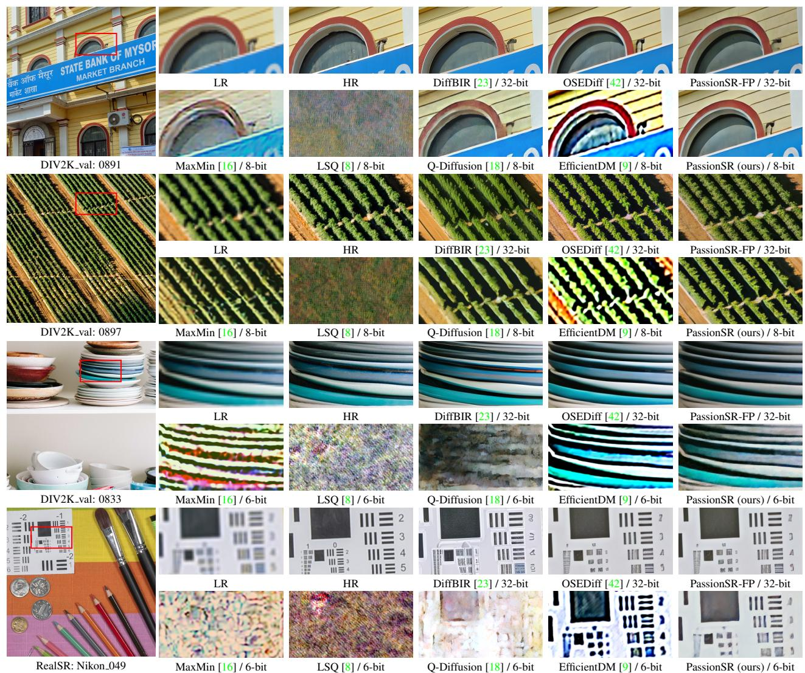
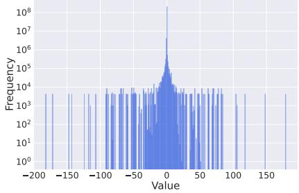

# 4. Experiments

### 4.1. Experiment Setup

Data Construction. We randomly crop 500 LR and HR pairs, each of size 128×128, from DIV2K train [\[1\]](#page-8-22) to construct the calibration dataset. For the test datasets, we select RealSR [\[13\]](#page-8-23), DRealSR [\[41\]](#page-9-21), and DIV2K val [\[1\]](#page-8-22).

Evaluation Metrics. We employ reference-based evaluation metrics, including PSNR, SSIM [\[39\]](#page-9-22), LPIPS [\[51\]](#page-9-23), and DISTS [\[5\]](#page-8-24). We also utilize non-reference metrics, such as NIQE [\[50\]](#page-9-24), MUSIQ [\[14\]](#page-8-25), ManIQA [\[45\]](#page-9-25), and ClipIQA [\[35\]](#page-9-26). We evaluate all methods with full-size images.

Implementation Details. We quantize the weights and activations in the main components (*i.e.*, UNet and VAE) with low bit-widths (*e.g.*, 6 and 8 bits). We denote the quantization configuration w-bit weight quantization and a-bit activation quantization as WwAa. For calibration training, we set the learning rate of PassionSR as 1×10−5 and finetune for 4 epochs. It is worth demonstrating that we use the same initialization method as SmoothQuant [\[25\]](#page-8-20).

Compared Methods. We select representative quantization methods: MaxMin [\[12\]](#page-8-12), LSQ [\[8\]](#page-8-13), Q-Diffusion [\[18\]](#page-8-10), and EfficientDM [\[9\]](#page-8-14). We adopt these methods to quantize our full-precision PassionSR-FP based on their released code.

### 4.2. Main Results

Streamline Experiment. We replace the text embedding branch with a constant empty prompt embedding, preprocessed by the ClipEncoder using an empty string. Table [2](#page-5-0) shows a comparison between the original model OSEDiff and the streamline model PassionSR-FP. The results indicate minimal or even negligible performance drop. Additionally, as shown in Tab. [3,](#page-5-1) the total model parameters are reduced by 27.13%, and operations are reduced by 6.25%.

Figure 6. Visual comparison (×4) with high-resolution image, full-precision model's output and different quantization methods in some challenging cases at W8A8 and W6A6 UNet-VAE quantization. PassionSR gains significant visual advantages over other methods.

| Methods     | Efficiency |          | RealSR |        |        |        |       |        |         |           |
|-------------|------------|----------|--------|--------|--------|--------|-------|--------|---------|-----------|
|             | Time (h)   | GPU (GB) | PSNR↑  | SSIM↑  | LPIPS↓ | DISTS↓ | NIQE↓ | MUSIQ↑ | MANIQA↑ | CLIP-IQA↑ |
| MaxMin      | 0.00       | 0        | 15.55  | 0.2417 | 0.8018 | 0.4449 | 9.263 | 42.15  | 0.2791  | 0.4174    |
| LBQ         | 2.66       | 40       | 23.15  | 0.6621 | 0.5022 | 0.3115 | 7.234 | 47.75  | 0.3071  | 0.4787    |
| LBQ+LET     | 3.87       | 40       | 25.40  | 0.7529 | 0.3798 | 0.2584 | 6.604 | 44.26  | 0.2414  | 0.3224    |
| LBQ+LET+DQC | 1.07       | 28       | 24.41  | 0.7374 | 0.3427 | 0.2419 | 5.449 | 55.08  | 0.3083  | 0.4849    |

Table 4. Ablation study on our proposed components: LBQ, LET, and DQC. Our ablation experiments are in the setting of W6A6 UNet-VAE quantization. We test each ablation method on RealSR and record their calibration time and GPU costs.

Quantitative Results. In the UNet-VAE quantization experiment, Tab. [2](#page-5-0) shows that PassionSR significantly outperforms previous methods at the setting of W8A8 and W6A6. On each dataset, 8-bit PassionSR achieves comparable performance to the full-precision OSEDiff, or even better scores in some cases. Besides PassionSR, other quantization methods have an obvious decrease in quantitative results. For 6-bit quantization, while contrast methods like LSQ and Q-Diffusion exhibit low structural metrics (*e.g.*, PSNR and SSIM), they obtain high scores in non-reference IQA metrics. Our PassionSR achieves the highest reference IQA values and relatively lower non-reference IQA values than others. However, we find an interesting observation where images with substantial quantization noise also obtain relatively high non-reference IQA scores. It can explain why some quantized outputs by other methods have worse visual quality despite higher non-reference IQA scores. We provide more results and analyses in Fig. [6.](#page-6-0)

on of scale factor (b) Distribution of Original Activation (c) Distribution of Sn Figure 7. Distribution of scale factor and activation before and after smooth in the whole model.

**Visual Comparison.** We provide a visual comparison (×4) for UNet-VAE quantization in Fig. 6. Several challenging cases are selected for clearer visual contrast. Compared to previous methods, PassionSR generates clearer results and better textures, with a minimal gap from the full-precision model. Notably, PassionSR even surpasses the full-precision PassionSR-FP in certain cases.

Compression Ratio. To clearly present our compression and acceleration outcomes, we calculate the model's total size (Params / G) and the number of operations (Ops / G). The calculation follows the methods used in previous quantization studies [26]. The results are presented in Tab. 3, showing the compression and acceleration ratios for each setting. In the 8-bit setting, PassionSR-UV achieves an 81.77% compression ratio and a 76.56% acceleration ratio. Furthermore, with a 6-bit setting, we achieve a compression ratio of 86.32% and an acceleration ratio of 82.42%.

#### 4.3. Ablation Study

Learnable Equivalent Transformation (LET). In order to evaluate the effects of LET, we adopt the LBQ-only quantizer without LET to make comparison with LBQ and LET combined quantizer. The experiment results is presented in Tab. 4. Considering that the output images have lots of noise, the reference IQA metrics are more reasonable to measure the visual quality. The introduction of LET improves PSNR by over 2 dB and SSIM by about 0.1, with an additional hour of training, which indicates that LET brings huge performance increase.

**Distributed Quantization Calibration (DQC).** To research into the special calibration strategy DQC, we use collaborative calibration with LBQ and LET combined quantizer compared with DQC. The detailed experiments results are listed in Tab. 4. With slight performance enhancement, the integration of DQC mainly leads to faster converge and lower GPU memory cost, reducing the calibration time by about 2 hours and the GPU memory by over 10 G. It is because that the amount of parameters requiring gradients is smaller when applied DQC and the computational costs reduce during backward propagation. With distributed calibration, the training of scale factor in LET becomes stable, making it easier to find out the best parameters in LET.

#### 4.4. Distribution Visualization

By applying the equivalent transformation to UNet and VAE, we can adjust the values of scale factors to better control the distributions of weights and activations, making them easier to quantize. LET playes an important role in the quantization and we visualize the distribution of relative variables to observe LET's detailed effects in Fig. 7.

**Distribution of Scale Factor.** The dispersed distribution of scale factors in Fig. 7a implies that the scale factors in different channel or tensor take different values to address varying activation distributions. We obtain the best scale factor for different layer with different activation distributions through calibration process. Most of scale factor are larger than 1, which means that LET mainly alleviates the difficulties in activation quantization.

**Distribution of Activation.** Figure 7b shows that the distribution of original activations before LET is truly dispersed. A large amount of outliers have severe impacts on quantization. Under the help of LET, the distribution of activations is more centered and more friendly for quantization as shown in Fig. 7c. Moreover, the number of outliers largely decreases. This change in activation distribution indicates LET's strong ability to manipulate the distribution and great effects on minimizing the quantization errors.

#### 5. Conclusion

In this paper, we propose PassionSR, a novel post-training quantization method for one-step diffusion-based image super-resolution. By simplifying the model architecture to two core components, Variational Autoencoder (VAE) and UNet, we obtain a UNet-VAE structure with little performance loss. Our approach incorporates a Learnable Boundary Quantizer (LBQ) and Learnable Equivalent Transformation (LET) to manipulate activation distributions. And Distributed Quantization Calibration (DQC) strategy enhances training stability and accelerates convergence. Experiments show that PassionSR delivers perceptual performance comparable to full-precision models at 8-bit and 6bit. It gains significant advantages over recent leading diffusion quantization methods. This work paves the way for future one-step diffusion-based SR model quantization and practical deployment of advanced SR model applications.

