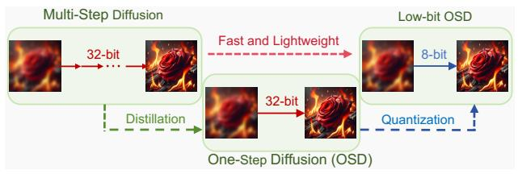

# 2. Related Work

### 2.1. Single Image Super-Resolution

Single image super-resolution (SR) aims to recover highresolution (HR) images from low-resolution (LR) inputs with unknown and complex degradation patterns. Numerous models have been developed to address this challenge. In addition to early SR models [\[3,](#page-8-15) [15,](#page-8-16) [52\]](#page-9-13) and GAN-based approaches [\[21,](#page-8-3) [37,](#page-9-1) [49\]](#page-9-2), stable diffusion (SD) [\[27\]](#page-8-17) has emerged as a powerful technique due to its robust capability in capturing complex data distributions and providing strong generative priors. Related methods, including StableSR [\[36\]](#page-9-4), DiffBIR [\[23\]](#page-8-4), and SeeSR [\[43\]](#page-9-5), enhance the perceptual quality of generated images. However, their multistep processes introduce higher latency, which hinders realtime applications. To address this limitation, one-step diffusion (OSD) models, such as SinSR [\[38\]](#page-9-11) and OSEDiff [\[42\]](#page-9-3), have been developed to reduce inference latency by accelerating the process to a single step.

## 2.2. Model Quantization

Model quantization is a critical technique for accelerating models by reducing computational costs and inference time. Depending on whether the model's weights are retrained, quantization methods are divided into two categories: posttraining quantization (PTQ) and quantization-aware training (QAT). PTQ is highly time-efficient as it only calibrates the quantized parameters rather than finetunes the entire model. ZeroQuant [\[46\]](#page-9-14) calibrates quantized parameters without additional calibration datasets, and BRECQ [\[19\]](#page-8-18) introduces a block-wise reconstruction PTQ method. QAT can achieve higher accuracy but incurs high training costs. As a representative quantization method, LSQ [\[8\]](#page-8-13) improves low-bit quantization with a learnable step size.

### 2.3. Quantization of Diffusion Models

As diffusion models evolve rapidly, researchers have focused on improving their efficiency through quantization. PTQ4DM [\[28\]](#page-9-12) first investigates quantized diffusion models, identifying key challenges to overcome. Further works, including Q-Diffusion [\[18\]](#page-8-10), PTQD [\[10\]](#page-8-9), and QAT methods like Q-DM [\[20\]](#page-8-11), have made significant progress by developing specialized calibration strategies tailored to diffusion models. Notably, TDQ [\[30\]](#page-9-15) utilizes an MLP layer to predict quantized parameters, and APQ-DM [\[33\]](#page-9-16) designs a distribution-aware quantization approach to minimize quantization error. Additionally, QALoRA [\[44\]](#page-9-17), is a notable quantization method for large language models, reducing quantization error by finetuning LoRA layers along with quantized parameters. It is adopted to quantize diffusion models in EfficientDM [\[9\]](#page-8-14). QuEST [\[34\]](#page-9-18) finds that layers like the feedforward layer are sensitive to quantization. QuEST improves performance by selectively retraining these layers. These methods have advanced low-

Figure 3. Diffusion-based image SR acceleration.

bit quantization for multi-step diffusion models. However, there are few works specifically addressing the lowbit quantization of one-step diffusion (OSD) models, which are significantly different from multi-step diffusion models. We follow the strategy in Fig. [3](#page-2-0) to accelerate the diffusionbased SR models, especially the OSD models.

