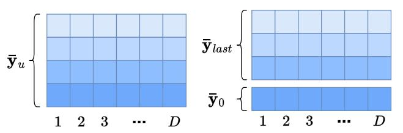

# 4.1 Using the Extended RaBitQ with IVF

Next we apply the extended RaBitO method to the in-memory ANN. Recall that as is discussed in Section 1, the present study targets to compress vectors with a moderate compression rate such that it can avoid storing raw vectors in RAM while still producing good overall recall (e.g., >90%, >95% or >99%). Scalar quantization (SQ) and its variants are the state-of-the-art and also the most popular methods in real-world systems for this need [1, 17, 52, 71]. We note that these methods are usually used together with IVF [17, 52, 71] or graph-based indices [1] for in-memory ANN query. In particular, IVF is a popular method that has been widely deployed in realworld systems for vector search due to its simplicity and effectiveness [17, 52, 71]. It has tiny index size and can be easily combined with various quantization methods due to its sequential memory access pattern in querying. For graph-based indices, we note that due to their random memory access pattern of querying, combining them with SQ entails highly non-trivial efforts in engineering optimization to make the combined method work competitively [1]. Thus, in this paper, we focus on using the extended RaBitQ method together with the IVF index and leave its combination with the graph-based indices as future work.

Specifically, the IVF method partitions the set of data vectors into many clusters (e.g., via KMeans) in the index phase. Then when a query comes, it finds a few nearest centroids of the clusters and considers the vectors in these clusters as candidates of ANN. When IVF is used in combination with SQ, it computes an estimated distance for every candidate based on its quantization code and then returns the vector with the smallest estimated distance as the NN. Note that for reducing the memory consumption, when IVF is used with SQ, it does not store the raw vectors in RAM and thus,

there is no re-ranking based on the raw vectors. When using the same number of bits for quantization, our method can produce better accuracy than SQ and its variants (see experimental results in Section 5.2.1). In addition, its computation can be conducted with exactly the same implementations of SQ (Section 3.3). Thus, it is expected that simply replacing SQ with our method suffices to produce better time-accuracy trade-off (i.e., it improves the accuracy while maintaining the efficiency).

Figure 2: Decomposition of the Quantization Code  $\bar{y}_u$ .

