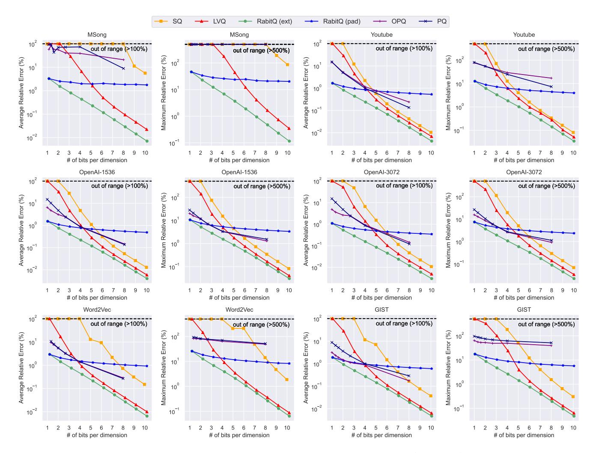
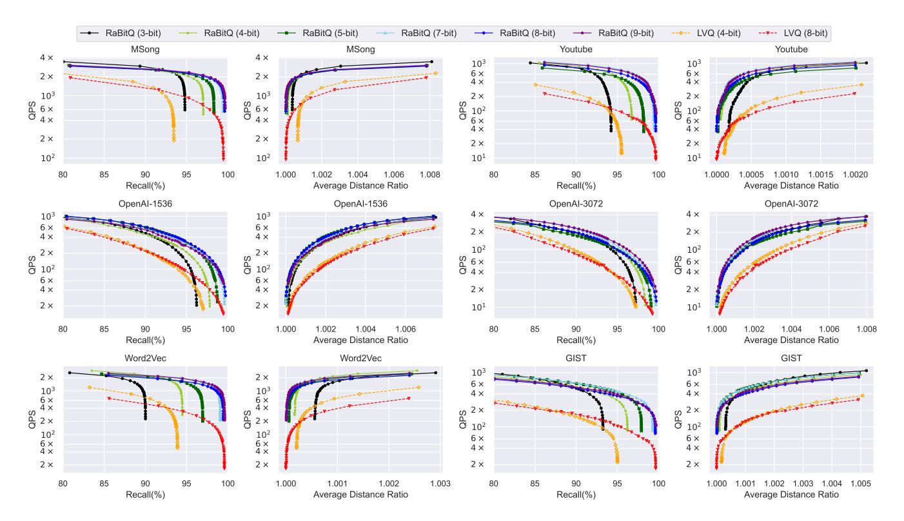
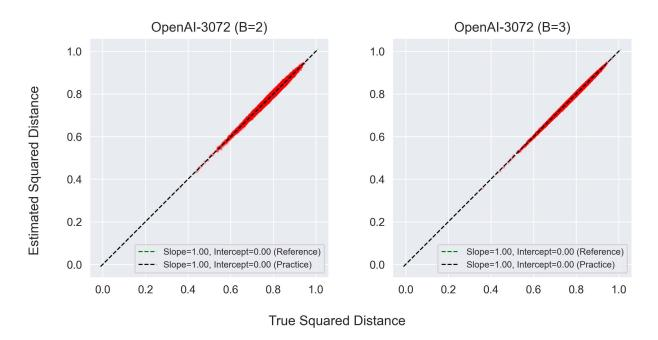

# **Experimental Setup**

Experimental Platform. All experiments are run on a machine with two Intel Xeon Gold 6418H@4.0GHz CPUs (with Sapphire Rapids architecture, 48 cores/96 threads) and 1TB RAM. The C++ source codes are compiled by GCC 11.4.0 with -Ofast -march=native under Ubuntu 22.04 LTS. For all methods, by following most of the existing studies and benchmarks [6, 24], the search performance is evaluated in a single thread and the indexing time is measured using multiple threads. The source code is available at https://github.com/VectorDB-NTU/Extended-RaBitQ.

Datasets. We evaluate the performance of different algorithms with six public real-world datasets with varying dimensionality and data types, whose details are presented in Table 1. These datasets encompass both (1) widely adopted benchmarks for evaluating ANN algorithms [6, 27, 43] (such as Word2Vec, MSong and GIST 9) and (2) embeddings generated by advanced models (including OpenAI- $1536^{10}$ , OpenAI-3072  $^{11}$ , Youtube  $^{12}$ , and MSMARCO  $^{13}$ ). It is worth highlighting that OpenAI-1536 and OpenAI-3072 are produced by the most powerful embedding model text-embedding-3-large of OpenAI published in early 2024 [51]. They are generated for evaluating ANN algorithms by Qdrant [60]. As for the set of query vectors, for the datasets which provide the query set themselves, we adopt their query set for testing. For others, we exclude 1,000 vectors from each dataset and use them as the query vectors.

Algorithms. In the experiments regarding the trade-off between the space and the accuracy of distance estimation (Section 5.2.1), we evaluate the performance of the following methods. (1) RaBitQ (ext) is the extended RaBitQ method proposed in the current study. (2) RaBitQ (pad) is the simple extension of RaBitQ mentioned in the original RaBitQ paper which uses more bits by padding the vectors with zeros [27]. (3) SQ is the classic uniform scalar quantization method. It has been widely deployed in real-world systems [11, 52, 71, 79]. Specifically, SQ first collects

9https://www.cse.cuhk.edu.hk/systems/hash/gqr/datasets.html.

 $^{10} https://hugging face.co/datasets/Qdrant/dbpedia-entities-open ai 3-text-embedding-datasets/properties and the control of the control of the control of the control of the control of the control of the control of the control of the control of the control of the control of the control of the control of the control of the control of the control of the control of the control of the control of the control of the control of the control of the control of the control of the control of the control of the control of the control of the control of the control of the control of the control of the control of the control of the control of the control of the control of the control of the control of the control of the control of the control of the control of the control of the control of the control of the control of the control of the control of the control of the control of the control of the control of the control of the control of the control of the control of the control of the control of the control of the control of the control of the control of the control of the control of the control of the control of the control of the control of the control of the control of the control of the control of the control of the control of the control of the control of the control of the control of the control of the control of the control of the control of the control of the control of the control of the control of the control of the control of the control of the control of the control of the control of the control of the control of the control of the control of the control of the control of the control of the control of the control of the control of the control of the control of the control of the control of the control of the control of the control of the control of the control of the control of the control of the control of the control of the control of the control of the control of the control of the control of the control of the control of the control of the control of the control of the control of the control of the control$  $3-large-1536-1M\\ ^{11}https://huggingface.co/datasets/Qdrant/dbpedia-entities-openai3-text-embedding-comparison of the comparison of the comparison of the comparison of the comparison of the comparison of the comparison of the comparison of the comparison of the comparison of the comparison of the comparison of the comparison of the comparison of the comparison of the comparison of the comparison of the comparison of the comparison of the comparison of the comparison of the comparison of the comparison of the comparison of the comparison of the comparison of the comparison of the comparison of the comparison of the comparison of the comparison of the comparison of the comparison of the comparison of the comparison of the comparison of the comparison of the comparison of the comparison of the comparison of the comparison of the comparison of the comparison of the comparison of the comparison of the comparison of the comparison of the comparison of the comparison of the comparison of the comparison of the comparison of the comparison of the comparison of the comparison of the comparison of the comparison of the comparison of the comparison of the comparison of the comparison of the comparison of the comparison of the comparison of the comparison of the comparison of the comparison of the comparison of the comparison of the comparison of the comparison of the comparison of the comparison of the comparison of the comparison of the comparison of the comparison of the comparison of the comparison of the comparison of the comparison of the comparison of the comparison of the comparison of the comparison of the comparison of the comparison of the comparison of the comparison of the comparison of the comparison of the comparison of the comparison of the comparison of the comparison of the comparison of the comparison of the comparison of the comparison of the comparison of the comparison of the comparison of the comparison of the comparison of the comparison of the comparison of the comparison of the comparison of the$ 

3-large-3072-1M 12https://research.google.com/youtube8m/download.html

13https://huggingface.co/datasets/Cohere/msmarco-v2.1-embed-english-v3

**Table 1: Dataset Statistics** 

| Dataset     | Size        | D     | Query Size | Data Type |
|-------------|-------------|-------|------------|-----------|
| MSong       | 992,272     | 420   | 200        | Audio     |
| Youtube     | 999,000     | 1,024 | 1,000      | Video     |
| OpenAI-1536 | 999,000     | 1,536 | 1,000      | Text      |
| OpenAI-3072 | 999,000     | 3,072 | 1,000      | Text      |
| Word2Vec    | 1,000,000   | 300   | 1,000      | Text      |
| GIST        | 1,000,000   | 960   | 1,000      | Image     |
| MSMARCO     | 113,520,750 | 1,024 | 1,677      | Text      |

the minimum value  $v_I$  and maximum value  $v_r$  among all the coordinates of all the vectors. Then, the method uniformly splits the range of values  $[v_l, v_r]$  into  $2^B - 1$  segments. Each floating point number is then rounded to its nearest boundary of the segments and is represented and stored as a B-bit unsigned integer. (4) LVQ is the latest variant of SQ [1]. Different from SQ which collects the smallest and largest values  $v_l$  and  $v_r$  among all the vectors and performs quantization based on this *global* range of values  $[v_l, v_r]$ , LVQ collects the  $v_l$  and  $v_r$  for every *individual* vector and performs quantization of a vector based on its specific range of values  $[v_l, v_r]$ . (5) PQ and (6) OPQ are popular quantization methods which are usually used with a large compression rate. They are widely deployed in real-world systems [52, 71, 79]. Note that these methods have two settings k = 4 or k = 8 (k is the number of bits allocated for quantizing each sub-vector in these methods; see details in their original papers [29, 37]). Since k = 8 produces consistently better space-accuracy trade-off than k = 4, we report the results of PQ and OPQ with k = 8. It is worth noting that when using the same number of bits per dimension, SQ, RaBitQ (ext) and LVQ have almost the same efficiency in computing inner product and Euclidean distances. However, as has been reported [1, 27], PQ and OPQ have significantly worse efficiency since their computation relies on frequently looking up tables in RAM. Recall that we target to compress vectors such that we do not need to access raw vectors for re-ranking while still producing reasonable recall. Therefore, we focus on evaluating these methods in a moderate compression rate, i.e., the number of bits per dimension ranges from 1 to 10. When a larger compression rate is used, none of methods can stably produce over 90% recall without re-ranking. When a smaller compression rate is used, it would be wasteful since 10 bits per dimension suffice to produce nearly perfect recall. In addition, in this experiment, as a pre-procession for all the methods, we center the datasets with their global centroid 14. In the experiments regarding the ANN query (Section 5.2.2), based on the experimental results in Section 5.2.1, we compare our method with the most competitive baseline LVQ [1]. We combine our method and LVQ with the IVF index as is discussed in Section 4. In this experiment, as a pre-procession for all the methods, we center every cluster in the IVF index with its local centroid. All the methods are optimized with the SIMD instructions till AVX512.

**Performance Metrics.** In the experiments regarding the trade-off between the space and the accuracy of distance estimation (Section 5.2.1), we measure the accuracy with (1) the *average relative* 

error and (2) the maximum relative error on the estimated squared distances. We measure the space with the number of bits per dimension. Specifically, it sums up all the space consumption of a vector and divides it by the dimensionality. Note that for our method, it also covers the space for storing two floating-point numbers for every vector, i.e.,  $\|\mathbf{o}_r - \mathbf{c}\|$  and  $1/(\|\mathbf{y}_u\| \cdot \langle \mathbf{o}, \bar{\mathbf{o}} \rangle)$ . In the experiments regarding the ANN query (Section 5.2.2), we adopt recall and average distance ratio for measuring the accuracy of ANN search. Recall is the percentage of successfully retrieved true nearest neighbors. Average distance ratio is the average of the distance ratios of the retrieved nearest neighbors over the true nearest neighbors. These metrics are widely adopted to measure the accuracy of ANN algorithms [6, 25, 33, 43, 56, 66]. We adopt query per second (QPS), i.e., the number of queries a method can handle in a second, to measure the efficiency. It is widely adopted to measure the efficiency of ANN algorithms [6, 43, 74]. Following [6, 43, 74], the query time is evaluated in a single thread and the search is conducted for each query individually (instead of queries in a batch). All the metrics are measured on every single query and averaged over the whole query set. We also report the time costs of different methods in the index phase.

**Parameter Settings in ANN Query.** In the IVF index, we set the number of clusters to be 4,096 for million-scale datasets by following the suggestions of Faiss [21]. For the MSMARCO dataset, we use 262,144 clusters. For our method, we implement our algorithm with B = 3, 4, 5, 7, 8, 9 and conduct ANN query with the strategy presented in Section 4. For the alignment of data, we pad the vectors with zeros such that their dimensionality is a multiple of 64 (i.e., we pad the dimensionality of MSong to 448 and that of Word2Vec to 320). For LVQ, we apply the settings B = 4 and B = 8 in its original paper [1].

### 5.2 Experimental Results

5.2.1 Space-Accuracy Trade-Off for Distance Estimation. In this experiment, we evaluate different quantization methods by using them for estimating the distances between data vectors and query vectors. For each method, in Figure 3, we vary their number of bits and plot the curves of the average relative error (left panels, lower left is better) and maximum relative error (right panels, lower left is better) to investigate their space-accuracy trade-off. We, in particular, focus on the number of bits from B=1 to B=10 which correspond to a moderate compression rate. Note that B=8 suffices to produce >99% recall (Section 5.2.2).

According to Figure 3, our method (the green curve) stably achieves better accuracy than all the baseline methods on all the tested datasets when using the same number of bits. Specifically, we have the following observations. (1) RabitQ (ext) v.s. SQ and LVQ: We observe that when B > 6, under the same number of bits, the average relative error of LVQ is consistently larger than ours by 1.3x-3.1x (the gap of SQ's error from ours is even larger). When B < 6, the gap is even larger. It is worth noting that when B = 1 or B = 2, LVQ and SQ hardly produce reasonable accuracy and their errors are larger than ours by orders of magnitude. Note that for our method, LVQ and SQ, the computation of distances or inner product can be implemented in almost identical ways (Section 3.3). This result implies that simply replacing SQ and LVQ in existing systems

 $^{14}$ With the centroid c, the centering operation is to replace every data and query vector a with  $\mathbf{a} - \mathbf{c}$ .

Figure 3: Space-Accuracy Trade-Off for Distance Estimation (Log-Scale).

with our method would stably improve the performance. Moreover, when a small *B* is adopted, the improvement would be especially significant. This unique advantage enables our method to compute a fairly accurate distance based on the first bit of the quantization codes and prune many candidates, which improves the efficiency. It will be reflected later in Section 5.2.2. (2) PQ and OPQ: We find that PQ and OPQ have reasonable accuracy in most datasets when the number of bits per dimension is small (e.g., 1 or 2). However, when the number of bits increases, the errors of these methods do not decay as fast as our method, SQ or LVQ. In particular, PQ and OPQ fail to outperform SQ and LVQ usually when the number of bits per dimension is  $\geq 4$ . This result has also been observed in the LVQ paper [1]. Moreover, it has also been reported that the efficiency of PQ and OPQ is significantly worse than SQ and LVQ because for computing distances or inner product, they rely on looking up tables in RAM [1, 3]. When FastScan is applied to accelerate the computation (which requires to set k = 4), the space-accuracy tradeoff would be even worse [4]. These results indicate that PQ and OPQ can hardly be competitive in compressing high-dimensional vectors with moderate compression rates. (3) RaBitQ (pad): We find

that RaBitQ (pad) is competitive when the number of bits per dimension is small (e.g., 1 or 2). However, the error of RaBitQ (pad) also decays slowly. This is because as has been theoretically proved in Lemma B.3 [27], its error decays in a trend of  $O(1/\sqrt{B \cdot D})$ . As a comparison, the errors of our method, SQ and LVQ decay in an exponential trend with respect to B.

5.2.2 Time-Accuracy Trade-Off for ANN Query. In this experiment, we evaluate different quantization methods by using them in combination with the IVF index for ANN queries. In Figure 4, we plot for the methods their curves of "QPS"-"Recall" (left panels, upper right is better) and curves of "QPS"-"Average Distance Ratio" (right panels, upper left is better) by varying the number of clusters to probe to investigate their time-accuracy trade-off. In Table 2, we report the space consumption of different methods for ANN query. We note that using the same B, our method has slightly larger space consumption (e.g., by less than 0.01 GB on million-scale datasets) than the baseline because our method uses FastScan to estimate distances batch by batch. When a batch is not full, we still allocate the memory for a full batch.

Figure 4: Time-Accuracy Trade-Off for the ANN Query (Log-Scale), K = 100. All the methods are combined with the IVF index.

According to Figure 4, we have the following observations. (1) Time-accuracy trade-off: We observe that with the same number of bits (4-bit and 8-bit), our method outperforms LVQ in terms of time-accuracy trade-off. It is worth highlighting that the improvement in efficiency under the same recall is significant since our method can prune many candidates with the estimated distances based on the first bits of the quantization codes. In addition, the estimation can be implemented with FastScan [4] which is highly efficient (Section 4.2). (2) Recall: We find that 4-bit, 5-bit and 7-bit quantization suffices to produce over 90%, 95% and 99% recall on all the tested datasets respectively without re-ranking. (3) Average distance ratio: We observe that the average distance ratio produced by 5-bit quantization of our method is nearly perfect across all the datasets while it cannot achieve perfect recall (i.e., it usually produces 97% recall only). This indicates that the retrieved data vectors have their distances from the query extremely close to those of the true NNs. (4) Results on datasets from OpenAI: We find that the ANN algorithm with our method on these datasets is highly robust, e.g., 3-bit quantization suffices to produce > 95% recall.

5.2.3 Time of Quantizing in the Indexing Phase. In this section, we report the time for quantizing the vectors in the index phase based on different B's. This time includes both (1) the time for multiplying by  $P^{-1}$  the data vectors and (2) the time for computing the quantization codes, i.e., Algorithm 1. Due to the limit of space, we only report the results on the dataset OpenAI-3072 which has the highest dimensionality. It is clear that the quantization time for

other datasets which have lower dimensionality would be smaller. Based on the results in Figure 4 and Table 3, we observe that when setting B=5 and B=7, it suffices to produce >95% and >99% recall respectively, and the quantization can finish in a few minutes. Thus, the time for quantizing data vectors in the index phase is not a bottleneck in practical usage.

Figure 5: Verification Study for Scalability.

5.2.4 Verifying the Scalability. In this section, we study the scalability of our method on the MSMARCO dataset with about 100 millions of 1,024-dimensional data vectors. We report that the quantization of the dataset with B=9 can be finished in around 2 hours, which is not a bottleneck (as a comparison, building the IVF index for the dataset takes more than 1 day). Figure 5 reports the time-accuracy trade-off for ANN queries. It shows that our method still achieves consistently better time-accuracy trade-off compared with LVQ. In particular, with our method, using B=4 suffices to produce

Table 2: Space Consumption for ANN Query (GB).

|             | Raw Vectors | RaBitQ-3 | RaBitQ-4 | RaBitQ-5 | RaBitQ-7 | RaBitQ-8 | RaBitQ-9 | LVQ-4 | LVQ-8  |
|-------------|-------------|----------|----------|----------|----------|----------|----------|-------|--------|
| MSong       | 1.56        | 0.18     | 0.23     | 0.28     | 0.39     | 0.44     | 0.49     | 0.22  | 0.41   |
| Youtube     | 3.82        | 0.40     | 0.52     | 0.64     | 0.87     | 0.99     | 1.11     | 0.51  | 0.98   |
| OpenAI-1537 | 5.72        | 0.59     | 0.77     | 0.95     | 1.31     | 1.48     | 1.66     | 0.75  | 1.47   |
| OpenAI-3072 | 11.44       | 1.19     | 1.54     | 1.90     | 2.62     | 2.97     | 3.33     | 1.49  | 2.92   |
| Word2Vec    | 1.12        | 0.13     | 0.17     | 0.21     | 0.28     | 0.32     | 0.35     | 0.16  | 0.30   |
| GIST        | 3.58        | 0.37     | 0.48     | 0.60     | 0.82     | 0.93     | 1.04     | 0.48  | 0.92   |
| MSMARCO     | 433.47      | 43.41    | 56.94    | 70.48    | 97.54    | 111.07   | 124.61   | 56.86 | 110.99 |

Table 3: Time for quantizing the data vectors in OpenAI-3072 ( $\sim 10^6$  vectors) with 96 threads/48 cores.

| В        | 1    | 2    | 3     | 4     | 5     |
|----------|------|------|-------|-------|-------|
| Time (s) | 43.8 | 47.7 | 52.6  | 58.1  | 64.6  |
| В        | 6    | 7    | 8     | 9     | 10    |
| Time (s) | 76.0 | 98.3 | 143.7 | 233.2 | 418.1 |

>95% recall without re-ranking. In this case, the space consumption of our method is 56.94 GB while the raw dataset takes 433.47 GB.

Figure 6: Verification Study for Unbiasedness.

5.2.5 Verifying the Unbiasedness. In this section, we verify that based on our new codebook with more vectors than those of the original RaBitQ method, the estimator is still unbiased. Due to the limit of space, we only present the results for B=2,3 in two panels of Figure 6 respectively. In each panel, we collect around  $10^7$  pairs of the estimated squared distances and the true squared distances (between the first 10 query vectors and about  $10^6$  data vectors in the OpenAI-3072 dataset) which are normalized with the maximum true squared distances. To verify the unbiasedness, we fit these pairs with linear regression and plot the result with the black dashed line. Note that in all panels, this line has the slope of 1 and the y-axis intercept of 0. This indicates that our method provides unbiased distance estimation.

5.2.6 Measuring the Empirical Formula among  $\epsilon$ , D and B. In this section, we measure the constants in the empirical formula which presents the relationship among the absolute error of estimating inner product between unit vectors, B and D (see Section 3.4). In particular, for a pair of B and D, we randomly sample  $5 \times 10^6$  pairs of unit vectors (i.e., each vector is sampled from standard Gaussian distribution and is normalized then), apply our method to estimate their inner product and collect the error of the estimation. In the left panel of Figure 7, we fix D = 1000 and plot the curve of the 99.9% quantile of the empirical errors with respect to B (the red

Figure 7: Measure the Constants in the Empirical Formula.

curve). In the right panel, on the other hand, we fix B=4 and plot the curve of the 99.9% quantile of the empirical errors with respect to D (the red curve). Note that our empirical formula is in the form of  $\epsilon < c_{\epsilon} \cdot 2^{-B}/\sqrt{D}$  (see Section 3.4). We measure the constant  $c_{\epsilon}$  by tuning  $c_{\epsilon}$  such that the curve of  $\epsilon = c_{\epsilon} \cdot 2^{-B}/\sqrt{D}$  (the green curve) is higher than the curve of the 99.9% quantile of the empirical errors. The result shows that when  $c_{\epsilon} = 5.75$ , the curves match well.

### 6 RELATED WORK

Quantization. A substantial body of literature on the quantization of high-dimensional vectors exists across various fields, including machine learning, computer vision, and data management [1, 8, 22, 29, 30, 37, 38, 46, 54, 68, 68, 77, 81]. We refer readers to comprehensive surveys and textbooks [19, 47, 62, 70, 72, 80]. The existing studies about quantization can be divided into roughly two threads: (1) PQ and its variant [8, 29, 37, 46, 54] and (2) SQ and its variants [1, 22, 77]. We note that although the family of PQ and the family of SQ have highly diversified schemes, they can be presented in a unified framework: (1) in the index phase, they construct a quantization codebook and for each data vector, they find the nearest vector in it as the quantized data vector; and (2) in the query phase, they estimate the distance between a data vector and a query vector based on the quantized data vector. Despite this, we observe that in existing literature [17, 29, 37, 45, 47], PQ and SQ were seldom compared to each other 15. Indeed, PQ and its variants are used mostly in the scenarios with large compression rates [17, 29, 37, 45, 47, 70, 72, 81] while SQ and its variants are used mostly in the scenarios with moderate compression rates [1, 17, 71, 79]. According to our experimental results in Section 5.2.1, we find that with moderate compression rates (e.g., quantizing the vectors with  $\geq 4$  bits per dimension), PQ does not outperform the classical SQ on many datasets. In addition, as has been

 $^{15} \rm The~LVQ~paper~[1]$  compares PQ and SQ and finds that PQ does not have competitive performance with a moderate compression rate.

reported [1], PQ is significantly slower than SQ in distance computation when the same number of bits are used. On the other hand, with relatively large compression rates (e.g., quantizing the vectors with 1 or 2 bits per dimension), SQ can hardly produce reasonable accuracy. This may help explain why PO and SO were usually regarded as two separate lines of studies, i.e., each of them is capable of a certain scenario only. In contrast, in this study, we develop a method which excels in both scenarios. With the compression rates from 3x to 32x, our method stably outperforms all the methods empirically (Section 5.2.1). Moreover, it achieves the asymptotic optimality in theory (Section 3.4). In addition, it is worth noting that PO and its variants are also used with a compression rate which is even larger than 32x. However, in this case, without re-ranking, they can only produce poor recall [17, 29, 37, 45, 47, 70, 72, 81] (e.g., <80%), which deviates from the target of this study, i.e., achieving high recall without storing the raw vectors in RAM for re-ranking. For better comprehensiveness, we include the discussion on the way of using our method with a larger compression rate in Section 7 and leave more detailed study as future work.

ANN Query. ANN query is a key component of high-dimensional vector data management and has been widely supported by realworld systems [31, 49, 52, 71, 79]. Among the existing algorithms [12, 15, 24, 29, 37, 43, 44, 76, 78], the partition-based method IVF and the graph-based method HNSW have been deployed to the widest extent [44, 52, 71, 79]. For more methods, we refer readers to recent tutorials [18, 53, 61], surveys [7, 52, 57, 75] and benchmarks [6, 16, 43, 74]. Besides the ANN query, there have been growing interests in many advanced queries related to ANN [49, 52, 71]. For example, in real-world systems, besides vectors, a data object usually involves several attributes such as labels, numbers and strings. It is often the case that users target to find the data objects which satisfy some constraints on the attributes and have their vector nearest to the user's query vector. These questions are usually referred to as attribute-filtering ANN query [49, 52, 55, 71, 79, 83]. Besides, due to the recent development in information retrieval, there has also been a trend in multi-vector search [40, 52, 63]. In particular, these studies map a document to multiple high-dimensional vectors. During querying, they also map a query document to multiple vectors and search for the most relevant documents via a new similarity metric called MaxSim, which is aggregated from the inner products between query and data vectors [40, 63]. We note that in this paper, we present a method of vector compression and support to estimate inner product and squared Euclidean distances unbiasedly based on the compressed vectors. Our method can be used in these tasks for vector compression and distances/inner-product estimation seamlessly.

**Random Projection.** Random projection is a fundamental technique that has wide applications [10, 14, 15, 26, 27, 33, 66, 67]. The effectiveness of random projection is closely related to the seminal Johnson-Lindenstrauss (JL) Lemma [39]. In particular, JL Lemma states that projecting a vector onto the space of  $O(\epsilon^{-2} \log(1/\delta))$  dimensions suffices to provide an error bound of  $\epsilon$  with the probability of at least  $1-\delta^{-16}$ . A theoretical study proves that JL Lemma is

asymptotically optimal in terms of the trade-off between the number of dimensions and the error bound [42]. For more applications and theoretical conclusions, we refer readers to a comprehensive introduction [23]. Moreover, several studies further investigate on the trade-off between the number of bits for representing a vector and the error bound of inner product/distance estimation [2, 35, 41]. In particular, they prove that compressing a vector into a short code with  $O(\epsilon^{-2}\log(1/\delta))$  bits suffices to guarantee an error bound of  $\epsilon$ . As a comparison, trivially applying JL Lemma and quantizing the real value of each dimension with SQ requires  $O(\log\frac{1}{\epsilon})$  bits per dimension [2]. Furthermore, it is observed in [2], for the first time, that when the required accuracy is high ( $\epsilon$  is small,  $\epsilon^{-2}\log(1/\delta)>D$ ), the aforementioned result can be further improved (see Section 3.1). However, as has been discussed in Section 3.4, the algorithmic proof in this study is hardly practically applicable.

### 7 CONCLUSION

In conclusion, in this study, we propose a novel quantization algorithm which extends the RaBitQ method. It supports to compress high-dimensional vectors with a moderate compression rate such that it produces promising recall without re-ranking. The method has consistent advantages in both empirical accuracy and theoretical guarantees over SQ and its variants. In addition, it supports efficient distance comparisons by first estimating a distance based on the first bits of the quantization codes, which helps prune many candidates from the distance computation based on the full codes. Extensive experiments verify its effectiveness in practice and the alignment between the empirical performance and the theoretical analysis.

We would like to discuss on the following applications and extensions. (1) Like the original RaBitQ, the method can be adapted to support the estimation of inner product and cosine similarity (see [27]). (2) When targeting to compress vectors with a compression rate of >32x (i.e., we use fewer than 1 bit per dimension for quantizing a vector), we could first apply random projection for dimension reduction and apply the original RaBitQ method for binarization. The details are left in Appendix C due to the page limit. (3) Our method may bring benefits to other scenarios of ANN search (e.g., we may put the first bits of the quantization codes in RAM, leave the remaining bits in SSDs and conduct distance comparisons like what we do in Section 4.2). (4) Quantization is also a fundamental component in machine learning systems. The practicality and optimality of RaBitQ implies its potential of optimizing neural network inferencing and training.

