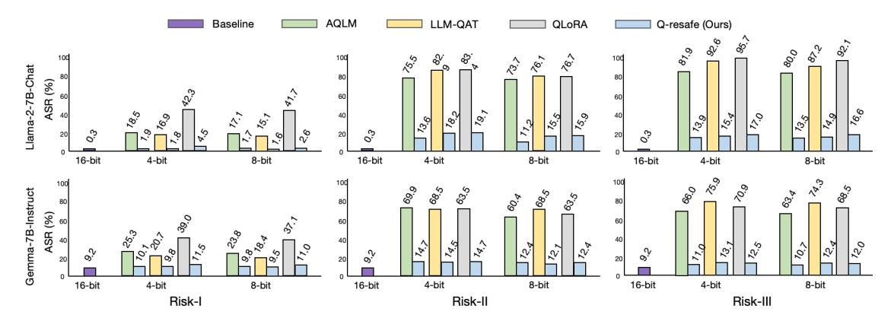

# 2. Related Works

Quantization for Efficient LLMs. Quantization reduces storage and computation costs by converting high-precision representations into lower-precision formats, enabling efficient LLM deployment. Existing methods can be roughly divided into PTQ [\(Yao et al.,](#page-12-1) [2022;](#page-12-1) [Wei et al.,](#page-11-6) [2022;](#page-11-6) [Cheng](#page-9-9) [et al.,](#page-9-9) [2023;](#page-9-9) [Dettmers et al.,](#page-9-10) [2023;](#page-9-10) [Lee et al.,](#page-10-6) [2023;](#page-10-6) [Kim et al.,](#page-10-7) [2023;](#page-10-7) [Li et al.,](#page-10-8) [2024b;](#page-10-8) [Wei et al.,](#page-11-7) [2023;](#page-11-7) [Yuan et al.,](#page-12-2) [2023;](#page-12-2) [Lin et al.,](#page-10-0) [2023;](#page-10-0) [Liu et al.,](#page-10-9) [2023a;](#page-10-9) [Ashkboos et al.,](#page-8-6) [2024;](#page-8-6) [Kim et al.,](#page-10-10) [2024b;](#page-10-10) [Shao et al.,](#page-11-8) [2023;](#page-11-8) [Zhao et al.,](#page-12-3) [2024\)](#page-12-3) and QAT. PTQ applies quantization after training with minimal computational cost, whereas QAT incorporates quantization during training, allowing the model to adapt to lower precision for better performance. To further reduce resource demands [\(Liu et al.,](#page-10-1) [2023b;](#page-10-1) [Du et al.,](#page-9-4) [2024;](#page-9-4) [Ma et al.,](#page-10-11) [2024;](#page-10-11) [Xu et al.,](#page-11-9) [2024a\)](#page-11-9), Parameter-Efficient Fine-Tuning (PEFT) techniques focus on tuning only a subset of parameters to balance efficiency and accuracy [\(Li et al.,](#page-10-12) [2023c;](#page-10-12) [Guo et al.,](#page-9-11) [2023;](#page-9-11) [Xu et al.,](#page-11-10) [2023;](#page-11-10) [Chai et al.,](#page-8-7) [2023;](#page-8-7) [Hayou et al.,](#page-9-12) [2024;](#page-9-12) [Kim et al.,](#page-9-13) [2024a;](#page-9-13) [Dettmers et al.,](#page-9-7) [2024\)](#page-9-7). Although these approaches primarily enhance utility, they also raise concerns about potential safety degradation in quantized LLMs.

Safety Evaluations for Quantized LLMs. Effective safety evaluation are essential to ensure LLM outputs align with human values and ethical guidelines[\(Cha,](#page-8-8) [2023\)](#page-8-8). While safety assessments for full-precision LLMs are well-established, covering dimensions such as attack success rate, refusal mechanisms, and safety risk index. These metrics form the backbone of LLM safety research [\(Deng et al.,](#page-9-14) [2024;](#page-9-14) [Zeng](#page-12-4) [et al.,](#page-12-4) [2024;](#page-12-4) [Xie et al.,](#page-11-11) [2025;](#page-11-11) [Souly et al.,](#page-11-12) [2024;](#page-11-12) [Li et al.,](#page-10-13) [2024a;](#page-10-13) [Chu et al.,](#page-9-15) [2024\)](#page-9-15), providing a systematic approach to measuring resilience against harmful content.

Recently, several studies have pioneered the exploration of safety issues in quantized LLMs, primarily focusing on calibration dataset-free quantization methods. For instance, [Kumar et al.](#page-10-14) [\(2024b\)](#page-10-14); [Hong et al.](#page-9-5) [\(2024\)](#page-9-5) analyze GPTQ and AWQ techniques across multiple LLMs, examining their impact on model safety and utility. [Egashira et al.](#page-9-6) [\(2024\)](#page-9-6) devises a projected gradient descent (PGD)-based attack on AWQ and GPTQ to deliberately exploit quantization and manifest specific malicious behaviors. In addition, [Pan et al.](#page-11-13) [\(2021\)](#page-11-13) revealed security risks in third-party quantized neural networks, where backdoor attacks can remain dormant in full-precision models but activate through quantization.

Restoring Safety for Quantized LLMs. While established alignment techniques like instruction tuning, reinforcement learning from human feedback (RLHF), Direct Preference Optimization (DPO) (Christiano et al., 2017; Ouyang et al., 2022; Bai et al., 2022; Peng et al., 2023; Rafailov et al., 2024) are effective for full-precision LLMs. Research on safety alignment approaches for quantized LLMs remains limited (Badshah & Sajjad, 2024; Xu et al., 2024b; Paglieri et al., 2024). Recent studies (Badshah & Sajjad, 2024; Xu et al., 2024b; Paglieri et al., 2024; Hu et al., 2024) emphasize the need for methods that restore safety without sacrificing efficiency. Addressing this challenge is non-trivial, as quantization alters weight and activation representations, requiring remedial measures that account for interactions between lower-precision parameters and alignment mechanisms. Our work aims to tackle this issue by proposing targeted solutions to maintain safety in quantized LLMs while preserving their computational and memory benefits.

## <span id="page-2-2"></span>3. Assessing Safety Risks of QLLMs

#### <span id="page-2-0"></span>3.1. Setup of Assessment

**Models.** We select two widely-used open-source LLMs, Llama-2-7B-Chat and Gemma-7B-Instruct, as our prequantization baselines. These models are chosen for three key reasons. First, they are open-source, allowing easy application of various quantization methods for subsequent assessment. Second, both models have undergone extensive post-training processes, including instruction tuning and reinforcement learning from human feedback, making them robust in safety-critical tasks. Finally, they exhibit distinct strengths across different task types, offering a valuable comparison of quantization effects on models with varied pre-quantization performance.

Specifically, Llama-2-7B-Chat excels in safety-aligned open-ended conversations, while Gemma-7B-Instruct performs better in structured tasks like reasoning and coding, where precise instruction-following is crucial (Touvron et al., 2023; Team et al., 2024; Almeida et al., 2024). Safety and utility scores for both baselines are provided in Table 2.

Quantization Methods. We evaluate two main categories of quantization methods: PTQ and QAT. For PTQ, we select representative methods, including AWQ and AQLM, while for QAT, we choose LLM-QAT and QLORA. These methods are either foundational or state-of-the-art, as demonstrated by their growing citation counts, AWQ, AQLM, LLM-QAT and QLoRA respectively(Lin et al., 2024b; Egiazarian et al., 2024; Liu et al., 2023b; Dettmers et al., 2024), making them highly representative of their respective categories. Additionally, we test two common bit-widths, INT4 and INT8, which are widely supported by these methods.

Quantization-Assisting Datasets. Quantization methods

*Table 1.* Overview of quantization methods: quantization type and requirement for quantization-assisting datasets.

| Method  | <b>Quantization Type</b> | Assisting Dataset |
|---------|--------------------------|-------------------|
| AWQ     | PTQ w/o. FT              | Х                 |
| AQLM    | PTQ w. FT                | ✓                 |
| LLM-QAT | QAT w. FT                | ✓                 |
| QLoRA   | QAT w. LoRA FT           | ✓                 |

Table 2. Performance of baseline models.

<span id="page-2-1"></span>

| Model             | ASR | MT-bench | AlpacaEval |
|-------------------|-----|----------|------------|
| Llama-2-7B-Chat   | 0.3 | 6.65     | 71.37      |
| Gemma-7B-Instruct | 9.2 | 6.25     | 66.53      |

often rely on calibration datasets (referred to as quantization-assisting datasets hereafter) to guide the weight quantization process. These datasets are pivotal in shaping the performance and safety of quantized LLMs. While they enhance utility through fine-tuning, their content may inadvertently introduce safety risks, necessitating a rigorous evaluation of their design and reliability.

We follow established practices in the literature (Qi et al., 2023) to construct quantization-assisting datasets using AdvBench (Chen et al., 2022) and Ultrachat (Ding et al., 2023). From AdvBench, we randomly select 10 examples to create two datasets: a Direct Harmful dataset (**Risk-III**), which contains harmful instructions and their corresponding harmful responses, and an Indirectly Harmful dataset (**Risk-II**), consisting of non-toxic instructions but paired with responses designed to induce model compliance or unsafe behavior subtly. Additionally, we used a Benign dataset (**Risk-I**), randomly sourced 10 samples from the Ultrachat dataset, which contains purely utility-oriented instruction-response pairs that are not harmful in nature.Details about assisting dataset are provided in Appendix B.

Safety & Utility Metrics. Our safety metrics for quantized LLMs are consistent with the existing practices utilized for full-precision LLM evaluations. Specifically, we measure the quantized LLMs' safety by assessing their Attack Success Rate (ASR) in response to harmful instructions (Zou et al., 2023). And we evaluate the model's utility following the popular MT-bench (Zheng et al., 2024) and AlpacaEval (Li et al., 2023b). The details of the utility measurement can be found in Appendix B.

#### 3.2. Intra-Method Analysis towards Quantization

**Post-quantization without fine-tuning: AWQ.** Since AWQ does not rely on quantization-assisting datasets, we adopt the approach outlined in (Huang et al., 2023) to evaluate its safety risks. We adjust the model's sampling strategy after AWQ quantization by modifying parameters such as temperature  $\tau$ , top-k, and top-p. The results show that the INT4 and INT8 quantized models exhibit higher safety risks

<span id="page-3-0"></span>Table 3. Safety assessment results for four quantization methods on various quantization-assisting datasets: Risk-I (UltraChat), Risk-II and Risk-III(Crafted from AdvBench). Since AWQ does not have a quantization-assisting dataset, we evaluate its ASR under decoding attack [\(Huang et al.,](#page-9-20) [2023\)](#page-9-20). For the other three methods, we directly measure the ASR under Advbench. The baseline are shown in table [2.](#page-2-1)

| Bit  | Model             | Method  | Safety (ASR↓) |         |          | Utility(↑) |            |  |
|------|-------------------|---------|---------------|---------|----------|------------|------------|--|
|      |                   |         | Risk-I        | Risk-II | Risk-III | MT-Bench   | AlpacaEval |  |
|      |                   | AWQ     | 42.4          | 42.4    | 42.4     | 6.51       | 68.37      |  |
|      |                   | AQLM    | 18.5          | 75.5    | 77.4     | 6.40       | 66.42      |  |
|      | Llama-2-7B-Chat   | LLM-QAT | 16.9          | 82.9    | 71.2     | 6.71       | 66.54      |  |
| INT4 |                   | QLoRA   | 42.3          | 83.4    | 85.3     | 6.40       | 63.92      |  |
|      |                   | AWQ     | 17.9          | 17.9    | 17.9     | 6.14       | 65.40      |  |
|      |                   | AQLM    | 25.3          | 69.9    | 55.4     | 6.12       | 61.75      |  |
|      | Gemma-7B-Instruct | LLM-QAT | 20.7          | 68.4    | 52.9     | 6.28       | 62.85      |  |
|      |                   | QLoRA   | 39.4          | 68.6    | 61.3     | 6.15       | 59.13      |  |
|      |                   | AWQ     | 39.1          | 39.1    | 39.1     | 6.58       | 69.42      |  |
|      |                   | AQLM    | 17.1          | 73.3    | 75.3     | 6.56       | 69.20      |  |
|      | Llama-2-7B-Chat   | LLM-QAT | 15.1          | 76.1    | 65.4     | 6.75       | 67.26      |  |
| INT8 |                   | QLoRA   | 41.7          | 76.7    | 83.2     | 6.55       | 69.50      |  |
|      |                   | AWQ     | 17.7          | 17.7    | 17.7     | 6.18       | 65.93      |  |
|      |                   | AQLM    | 23.7          | 60.4    | 53.8     | 6.23       | 63.40      |  |
|      | Gemma-7B-Instruct | LLM-QAT | 18.4          | 63.5    | 50.1     | 6.39       | 64.94      |  |
|      |                   | QLoRA   | 37.1          | 64.0    | 58.9     | 6.27       | 62.50      |  |

compared to the FP16 baseline. As shown in Table [3,](#page-3-0) AWQ quantization leads to a noticeable increase in safety risks, reflected by the higher ASR. For the base models, the ASR values are 0.3% for Llama and 9.2% for Gemma before quantization (see Table [2\)](#page-2-1). After quantization, with a higher temperature setting (τ = 0.95), the ASR for Llama-2-7B-Chat increases from 29.8% to 42.4% (INT4) and 39.1% (INT8), while for Gemma-7B-Instruct, it rises from 9.4% to 17.9% (INT4) and 15.1% (INT8). Despite this, the Gemma models show lower ASR than Llama models, which can be attributed to their stronger pre-quantization safety. In contrast, the utility degradation after AWQ quantization is relatively mild, with reductions ranging from 0.1 to 3.0 points, indicating that utility is largely preserved.

Post-quantization with fine-tuning: AQLM. The AQLM quantization results highlight the significant impact of quantization-assisting datasets on the safety of the quantized LLM. For the Llama-2-7B-Chat model, ASR increases from 18.5% on benign datasets to 73.5% on indirect harmful datasets, and 77.4% on directly harmful datasets. Similarly, for the Gemma-7B-Instruct model, ASR rises from 23.5% on benign datasets to 69.9% on indirect harmful datasets, and 67.3% on directly harmful datasets.

Quantization-aware and full-parameter fine-tuning: LLM-QAT. LLM-QAT results demonstrate that, similar to PTQ, QAT-based quantization suffers from safety degradation. Even with benign datasets, ASR increases to 16.9% for Llama-2-7B-Chat and 20.7% for Gemma-7B-Instruct in

the INT4 models. Safety degradation is more pronounced on higher-risk datasets, with ASR rising to 82.1% and 68.4% for the indirect harmful datasets, and 83.7% and 67.5% for the direct harmful datasets. INT8 models exhibit slightly lower ASR than INT4, owing to the increased bit-width, which enhances model expressiveness and capability preservation. Despite these safety challenges, utility degradation after LLM-QAT is minimal, with a decrease of less than 2% compared to the full-precision model, thanks to the utility-focused quantization strategy.

Quantization-aware and parameter-efficient fine-tuning: QLoRA. Despite LoRA's efficiency, QLoRA shows the most significant safety degradation among all methods, though it excels in utility preservation. Even on benign datasets, QLoRA produces higher ASR than AWQ, with 42.25% for Llama-2-7B-Chat and 39.4% for Gemma-7B-Instruct. For both indirect and direct harmful datasets, QLoRA leads to ASR values as high as 85.3% for Llama-2- 7B-Chat and 68.6% for Gemma-7B-Instruct. These results suggest that QLoRA sacrifices safety to achieve higher utility and quantization efficiency.

#### 3.3. Cross-Method Analysis towards Quantization

Comparing two PTQ methods. The presence of finetuning significantly affects PTQ safety. AWQ, which skips fine-tuning, shows substantial safety degradation, especially for INT4 models (ASR: 42.4%). In contrast, AQLM reduces ASR to 18.5% with benign datasets. However, fine-tuning

alone cannot fully restore safety, and using harmful datasets can increase ASR to 75.5%, emphasizing the critical role of dataset selection.

Comparing two QAT methods. The fine-tuning strategy in QAT methods plays a crucial role in balancing safety and utility. Full-parameter fine-tuning (LLM-QAT) better preserves safety compared to parameter-efficient fine-tuning (QLORA). By adapting a larger set of parameters, LLM-QAT retains more of the pre-quantization model's capabilities, leading to stronger safety performance. In contrast, QLoRA prioritizes utility with fewer parameters, resulting in a safety trade-off. However, both methods experience safety degradation due to the utility-driven nature of QAT objectives.

Comparing PTQ and QAT. QAT methods generally preserve more safety compared to PTQ methods, provided the fine-tuning datasets are benign. This is because QAT adjusts model parameters during quantization, compensating for the information loss from low-bit-width quantization. However, both methods show higher safety risks at lower bit-widths (INT4 vs. INT8), highlighting the challenges of quantizing at lower bit-widths.

Impact of Quantization-Assisting Datasets. Safety risks increase significantly when transitioning from benign to harmful datasets, with INT4 models being the most vulnerable. While QAT methods generally perform better, no method completely mitigates safety risks. Notably, indirect harmful datasets, often based on role-playing scenarios, have a greater impact on safety, as they expose models to unsafe behaviors while enhancing utility.

#### 3.4. Summary of Assessment

In summary, utility-centered quantization methods inherently compromise safety, even as they maintain reasonable utility. INT4 models, in particular, exhibit greater vulnerability to safety risks compared to INT8 models, highlighting the need for stringent safety monitoring at lower bit-widths. Finally, the selection of quantization-assisting datasets plays a pivotal role not only in optimizing utility but also in safeguarding model performance, especially when harmful samples are present in the datasets.

#### 4. Safety-Patching for Quantized LLMs

#### 4.1. Overview

According to the evaluation results in Section 3.1, quantized LLMs generally have satisfactory utility, often matching the performance of their pre-quantization counterparts. This can be largely attributed to the significant efforts of existing quantization techniques that carefully generate the quantized weights to preserve the utility of the full-precision LLM. As such, it is desired to leave most of the quantized

weights intact to avoid adversely impacting the utility. The safety patching method is expected to twist only the most essential portion of quantized weights necessary to restore the safety capabilities. Motivated by this intuition, we propose Q-resafe to re-align the safety capabilities of the quantized LLM with its pre-quantization counterpart by selectively fixing only the safety-critical weights.

Q-resafe achieves this through three key steps: constructing a safety-patching dataset guided by pre-quantization LLMs to transfer safety capabilities, leveraging DPO to align the quantized model's safety with its pre-quantization version, and selectively updating safety-critical weights to restore safety without compromising utility. This efficient and targeted approach ensures robust safety restoration with minimal computational overhead. The following section detail the notations, the safety-patching objective, optimization scheme and complete algorithm.

**Notations.** We adopt the matricization notations utilized in LoRA, where the pre-quantization LLM weights (denoted by  $\pi_{\mathbf{W}}$ ) are formed as a matrix  $\mathbf{W} \in \mathbb{R}^{d_{in} \times d_{out}}$ . We denote the quantized weights by  $\mathbf{Q}^0 \in \mathbb{Q}^{d_{in} \times d_{out}}$  and the corresponding quantized LLM by  $\pi_{\mathbf{Q}^0}$ , the low-rank adaptation matrices of LoRA with rank  $r \ll \{d_{in}, d_{out}\}$  by  $\mathbf{A} \in \mathbb{R}^{d_{in} \times r}$ ,  $\mathbf{B} \in \mathbb{R}^{r \times d_{out}}$ , and the safety-patched weights by  $\mathbf{Q} \in \mathbb{Q}^{d_{in} \times d_{out}}$ , where the conventional LoRA has  $\mathbf{Q} = \mathbf{Q}^0 + \mathbf{A}\mathbf{B}$ . Additionally, we use  $\odot$  to denote the element-wise product and  $\sigma$  to denote the Sigmoid function.

#### 4.2. Deriving Q-resafe

We begin with the conceptual objective function based on the DPO loss, with LoRA and safety-critical weights masking structures imposed as the constraint. We then concretize it step-by-step by describing the specific forms of the safety-patching dataset construction, periodic safetycritical weights identification, and finally presenting the per-iteration updating scheme and the complete algorithm.

Conceptual objective function. Given the quantized LLM  $\pi_{\mathbf{Q}^0}$  and the safety-patching dataset  $\mathcal{D}_{patch}$  with each preference sample being a triplet  $(x,y_w,y_l)\sim\mathcal{D}_{patch}$ , the DPO-based objective for safety patching is as follows,

$$\mathcal{L} = -\mathbb{E}_{\mathcal{D}_{patch}} \log \sigma \left( \beta \log \frac{\pi_{\mathbf{Q}}(y_w|x)}{\pi_{\mathbf{Q}^0}(y_w|x)} - \beta \log \frac{\pi_{\mathbf{Q}}(y_l|x)}{\pi_{\mathbf{Q}^0}(y_l|x)} \right), \tag{1}$$

<span id="page-4-1"></span><span id="page-4-0"></span>s.t., 
$$\mathbf{Q} = \mathbf{Q}^0 + \mathtt{Quant}(\mathbf{M}_Q \odot \mathbf{AB}),$$
 (2)

where  $\mathbf{M}_Q$  is the masking matrix with entries of 1 corresponding to safety-critical weights to be updated and entries of 0 corresponding to other weights that remain intact, Quant compresses the weights into the same low-precision data format as those in the quantized LLM  $\mathbf{Q}^0$ , and  $\beta$  is a hyper-parameter. The constraint in Eq. (2) restricts the safety patching to simultaneously adhere to the

#### Algorithm 1 Safety Patch for Quantized LLM

<span id="page-5-0"></span>**Input:** Quantized LLM  $\pi_{\mathbf{Q}^0}$ ; Pre-quantization LLM  $\pi_{\mathbf{W}}$ ; Calibration dataset  $\mathcal{D}_{calib}$ ; Initial LoRA matrix  $\mathbf{A}$ ,  $\mathbf{B}$ ; Re-evaluation interval K; Safety-critical threshold  $\tau$ ; Total iterations T. Learning rate  $\eta$ .

```
1: for each prompt sequence x \in \mathcal{D}_{calib} do
             y_w \sim \pi_{\mathbf{W}}(\cdot|x)
 3:
             y_l \sim \pi_{\mathbf{Q}^0}(\cdot|x)
             \mathcal{D}_{patch} \leftarrow (x, \ y_w, \ y_l)
 5: end for
 6: for t = 0, 1, \dots, T - 1 do
            if t \% K == 0 then
 7:
 8:
                 \mathbf{M}_Q = \mathbb{1} \left( \mathtt{SafeScore}(\mathbf{Q}^t) \in \mathtt{Top}\text{-}\tau \right)
                 (\mathbf{M}_A, \mathbf{M}_B) = \mathtt{MapMask}(\mathbf{M}_Q)
 9:
10:
             end if
             \mathbf{A}^{t+1} = \mathbf{M}_A \odot (\mathbf{A}^t - \eta \nabla_A \mathcal{L}) + (\mathbf{1} - \mathbf{M}_A) \odot \mathbf{A}^t
11:
            \mathbf{B}^{t+1} = \mathbf{M}_B \odot (\mathbf{B}^t - \eta \nabla_B \mathcal{L}) + (\mathbf{1} - \mathbf{M}_B) \odot \mathbf{B}^t
             \mathbf{Q}^{t+1} = \mathbf{Q}^0 + \mathtt{Quant}(\mathbf{A}^{t+1}\mathbf{B}^{t+1})
13:
```

**Output:** Safety-patched Quantized LLM with weights  $\mathbf{Q}^T$ .

LoRA structure, represented by the low-rank pairs (A, B), while modifying only the safety-critical weights indicated by the masking matrix  $M_Q$ . Moreover, the DPO loss of Eq.(1) is known to inherently regularize  $\pi_Q$  to discourage significant deviation from the reference LLM  $\pi_{Q^0}$ .

As a result, this safety-patching objective will re-align the safety capabilities by editing only the most essential weights while still preserving the utility of the quantized LLM  $\pi_{\mathbf{Q}^0}$ . Next, we concretize the above conceptual objective by detailing the construction of the safety-patching dataset  $\mathcal{D}_{patch}$  and the specific form of the masking matrix  $\mathbf{M}_Q$ .

**Safety-patching dataset construction.** To restore the safety capabilities of quantized LLMs, we construct the safety patching dataset  $\mathcal{D}_{patch}$  to leverage guidance from the prequantization LLM. Specifically, for a prompt x from an auxiliary calibration dataset, potentially lacking reference responses and preference annotations, we feed it into both the pre-quantization LLM and the quantized LLM to generate their respective responses. Then, we label the response from the pre-quantization LLM as the winner (preferred) response  $y_w$  and the response from the quantized LLM as the loser (dispreferred) response  $y_l$ , forming the preference triplet  $(x, y_w, y_l)$ . From a knowledge distillation perspective (Tunstall et al., 2023), this construction can be regarded as enabling the strong safety capabilities of the pre-quantization LLM to gradually transfer to the quantized LLM through iterations of the safety patching algorithm. Eliminating the need for manual preference annotations and significantly reducing costs and complexity.

Furthermore, in Section 3, we empirically study the impact

of different types of calibration datasets, considering three levels of risks, and find that the source of the dataset is not very restrictive. Even when reference responses are available, our method remains advantageous, as the pairs generated by  $\mathbf{W}$  and  $\mathbf{Q}^0$  can present greater challenges than reference responses—leading to more rigorous safety patching and improved alignment. Finally, we remark that if the pre-quantization LLM is unavailable for the safety patching, other well-aligned LLMs can serve as alternatives, e.g., leveraging proprietary LLMs like GPT, Claude, Mistral.

Periodic safety-critical weights identification. We first discuss the feasibility of identifying and updating a small portion of safety-critical weights, then exploit potential tools for identifying these weights, and construct a pair of masking matrices corresponding to the LoRA variables A, B based on the identified weights. Research suggests that an LLM's capabilities are concentrated in a small fraction of its weights (Qi et al., 2023; Yang et al., 2023; Kumar et al., 2024a). This insight enables safety-patching to target only a small portion of safety-critical weights while leaving the majority of other weights untouched, thereby preserving the utility of the quantized LLM.

We identify the safety-critical weights with SNIP score (Lee et al., 2019), for a prompt x and response y, we take the loss as the conditional negative log-likelihood  $\mathcal{L}(x) = -\log p(y|x)$  predicted by the model. For any layer of model  $\mathbf{Q}$  with weight matrix W, the importance score for each weight entry  $W_{ij}$  as

$$I(W_{ij}, x) = |W_{ij} \cdot \nabla_{Q_{ij}} \mathcal{L}(x)|. \tag{3}$$

Given the calibration dataset  $\mathcal{D}_{calib}$ , we take the average value and obtain  $\mathtt{SafeScore}(\mathbf{Q}) = \mathbb{E}_{x \in \mathcal{D}_{calib}} I(Q_{ij}, x)$ . We regard weights with salient scores in the top- $\tau$  percentile as the most safety-critical. Since the subset of safety-critical weights in  $\mathbf{Q}^t$  gradually changes across iterations t throughout the safety-patching algorithm. Therefore, we propose to periodically re-identify the subset based on the most updated  $\mathbf{Q}^t$ . The masking matrix  $\mathbf{M}_Q$  has 1's for the identified weights. Alternatively, we introduce a pair of masking matrices  $(\mathbf{M}_A, \mathbf{M}_B)$  corresponding to  $\mathbf{M}_Q$ .

Updating form and complete algorithm. Equipped with the calibration dataset  $\mathcal{D}_{calib}$  and masking matrices  $(\mathbf{M}_A, \mathbf{M}_B)$ , the objective in Eq.(1) is ready to be optimized by stochastic gradient descent. Taking  $\mathbf{A}$  at iteration t for instance, we take the SGD step with learning rate  $\eta$  as  $\mathbf{A}^t - \eta \nabla_A \mathcal{L}(\mathbf{A}^t, \mathbf{B}^t)$  and restrict the update to safety-critical weights according to the mask matrix  $\mathcal{M}_A$  by  $\mathbf{M}_A \odot (\mathbf{A}^t - \eta \nabla_A \mathcal{L}(\mathbf{A}^t, \mathbf{B}^t))$ , while maintaining other weights intact by  $(\mathbf{1} - \mathbf{M}_A) \odot \mathbf{A}^t$ . Overall, it provides the updated  $\mathbf{A}^{t+1}$  by  $\mathbf{A}^{t+1} = \mathbf{M}_A \odot (\mathbf{A}^t - \eta \nabla_A \mathcal{L}(\mathbf{A}^t, \mathbf{B}^t)) + (\mathbf{1} - \mathbf{M}_A) \odot \mathbf{A}^t$ . The complete algorithm, detailing dataset construction, periodic safety-critical weight identification, and iterative updates, is provided in Algorithm 1.



Figure 1. Safety evaluation of Q-resafe and fine-tuned baseline quantization methods for Llama-2-7B-Chat and Gemma-7B-Instruct.

