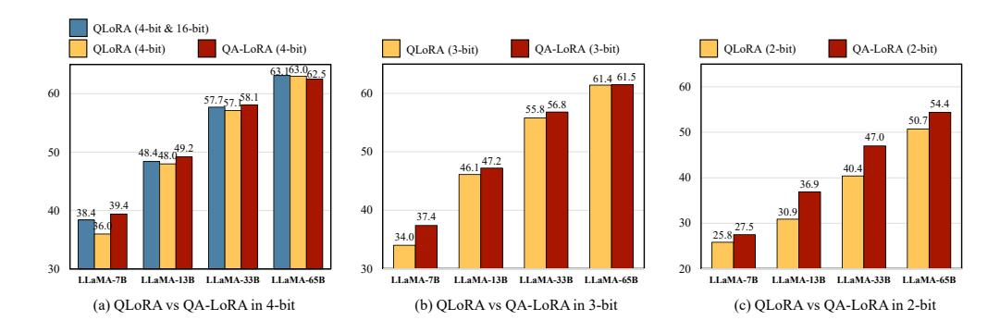
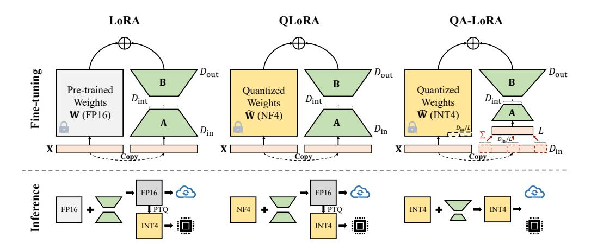
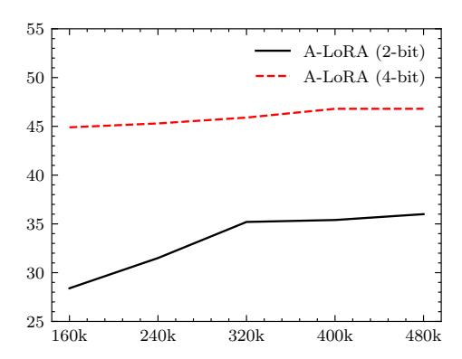

# 1 INTRODUCTION

Recently, large language models (LLMs) [\(Brown et al.,](#page-9-0) [2020;](#page-9-0) [Scao et al.,](#page-11-0) [2022;](#page-11-0) [Zhang et al.,](#page-12-0) [2022;](#page-12-0) [Touvron et al.,](#page-11-1) [2023a;](#page-11-1) [Chowdhery et al.,](#page-9-1) [2022;](#page-9-1) [OpenAI,](#page-11-2) [2023;](#page-11-2) [Zeng et al.,](#page-12-1) [2023\)](#page-12-1) have shown unprecedented performance across a wide range of language understanding tasks [\(Wei et al.,](#page-11-3) [2022a\)](#page-11-3) and served as the foundation of state-of-the-art chat systems [\(Bubeck et al.,](#page-9-2) [2023\)](#page-9-2). The diversity of real-world applications calls for a pipeline in which LLMs can be fine-tuned to fit different scenarios and quantized to be deployed onto edge devices (*e.g.*, mobile phones), and the key issue is to get rid of the heavy computational burden brought by the large number of parameters of LLMs.

There are two lines of research for this purpose. The first one is parameter-efficient fine-tuning (PEFT) [\(Houlsby et al.,](#page-10-0) [2019;](#page-10-0) [Li & Liang,](#page-10-1) [2021;](#page-10-1) [Liu et al.,](#page-10-2) [2021;](#page-10-2) [He et al.,](#page-10-3) [2022;](#page-10-3) [Hu et al.,](#page-10-4) [2021\)](#page-10-4) which introduced a small number of learnable parameters while keeping most pre-trained parameters unchanged. Among them, low-rank adaptation (LoRA) [\(Hu et al.,](#page-10-4) [2021\)](#page-10-4), a popular PEFT algorithm, proposed to fine-tune low-rank matrices to complement the pre-trained weights. Despite the comparable performance to full-parameter fine-tuning, the memory usage of LoRA is still large, especially when the base LLM is large (*e.g.*, LLaMA-65B). The second one studies parameter quantization [\(Yao et al.,](#page-12-2) [2022;](#page-12-2) [Dettmers et al.,](#page-9-3) [2022;](#page-9-3) [Wei et al.,](#page-11-4) [2022b;](#page-11-4) [Frantar et al.,](#page-9-4) [2023;](#page-9-4) [Lin et al.,](#page-10-5) [2023;](#page-10-5) [Xiao et al.,](#page-11-5) [2023;](#page-11-5) [Dettmers et al.,](#page-9-5) [2023b\)](#page-9-5) where the trained weights are quantized into low-bit integers or floating point numbers. Although these methods can alleviate the computational burden, they often report unsatisfying accuracy especially when the quantization bit width is low.

Hence, it is an important topic to integrate PEFT with quantization. A naive solution is to perform post-training quantization (PTQ) after PEFT, but it reports unsatisfying accuracy especially when the quantization bit width is low. Advanced methods exist, but they are either computationally expensive in the fine-tuning stage [\(Liu et al.,](#page-10-6) [2023\)](#page-10-6) or unable to maintain the quantized property after



<span id="page-1-0"></span>Figure 1: The comparison of 5-shot MMLU accuracy (%) with different quantization bit widths based on the LLaMA model family. QLoRA (NF4 & FP16) refers to the original QLoRA models with pre-trained weights in INT4 and adapter weights in FP16, and QLoRA (INT4) refers to performing post-training quantization (into INT4) upon the merged QLoRA models. All models are fine-tuned on the Alpaca dataset. Full results are provided in Table 1.

fine-tuning (Dettmers et al., 2023a). In this paper, we propose a simple yet effective method for quantization-aware low-rank adaptation (QA-LoRA). Our idea is based on the imbalanced degrees of freedom for quantization and adaptation. Specifically, each column of the pre-trained weight matrix is accompanied by only one pair of scaling and zero parameters but many more LoRA parameters. This imbalance not only results in large quantization errors (which harm the LLM's accuracy), but also makes it difficult to integrate the auxiliary weights into the main model. QA-LoRA addresses the issue by introducing group-wise operators which increase the degree of freedom of low-bit quantization (each group is quantized individually) and decrease that of LoRA (each group shares the adaptation parameters). QA-LoRA enjoys two-fold benefits: (i) an efficient fine-tuning stage thanks to the LLM's weights being quantized into low-bit integers; (ii) a lightweight, fine-tuned model without the need for PTQ which often incurs loss of accuracy.

QA-LoRA is easily implemented and applies to a wide range of scenarios. We evaluate QA-LoRA on the LLaMA and LLAMA2 model families (Touvron et al., 2023a;b) and validate it on various language understanding benchmarks. Figure 1 compares the 5-shot accuracy on the MMLU benchmark of QA-LoRA and the direct baseline, QLoRA (Dettmers et al., 2023a) with and without PTQ, when both methods are fine-tuned on the Alpaca dataset. QA-LoRA consistently outperforms QLoRA with PTQ on top of LLMs of different scales (the advantage becomes more significant when the quantization bit width is lower) and is on par with QLoRA without PTQ. Note that during inference, QA-LoRA has exactly the same complexity as QLoRA with PTQ and is much more efficient than QLoRA without PTQ. Hence, QA-LoRA serves as an effective and off-the-shelf method for joint quantization and adaptation of LLMs.

## 2 RELATED WORK

Large language models (LLMs) (Devlin et al., 2019; Brown et al., 2020; Zhao et al., 2023a; Hadi et al., 2023) have emerged as a dominant paradigm in natural language processing which has achieved state-of-the-art performance on various tasks (Zhao et al., 2023b; Zhou et al., 2023) and served as the fundamental of chat systems (OpenAI, 2023). However, their deployment in real-world scenarios is hindered by their high computational and memory requirements during inference (Chang et al., 2023). To tackle this issue, various methods have been proposed, including distillation (Liu et al., 2023), quantization (Yao et al., 2022; Dettmers et al., 2022; Wei et al., 2022b; Frantar et al., 2023; Lin et al., 2023; Xiao et al., 2023), pruning (Frantar & Alistarh, 2023; Ma et al., 2023; Sun et al., 2023), etc. (Weng, 2023). This paper mainly focuses on the quantization of LLMs.

**Fine-tuning LLMs with adapters.** Parameter efficient fine-tuning (PEFT) is an important topic for LLMs. One of the most popular approaches is low-rank adaptation (LoRA) (Hu et al., 2021; Valipour et al., 2022), where the key insight is to decompose the adapter weights into the multiplication of two low-rank (and thus parameter-efficient) matrices. LoRA has claimed comparable performance to full fine-tuning while using much fewer learnable parameters. Meanwhile, there are also other branches of adapters for LLMs such as the series adapter (Houlsby et al., 2019) and parallel adapter (He et al., 2022). Please refer to (Mangrulkar et al., 2022; Hu et al., 2023) for a review of these adapters.

Quantization of LLMs. Quantization is a compression technique that reduces the bit width of the parameters and/or activations of LLMs to improve their efficiency and scalability (Xiao et al., 2023; Dettmers et al., 2022; 2023a). Existing methods mostly focused on preserving or restoring the accuracy of quantized LLMs during the inference stage (Zhu et al., 2023), where the key is to reduce the memory footprint and computational costs without re-training the LLMs. One of the main challenges is to handle the outliers in the parameter distribution (Xiao et al., 2023), which can cause significant errors when quantized. To address this issue, some methods proposed to use either adaptive or dynamic quantization schemes that adjust the quantization range or precision according to the parameters (Xiao et al., 2023; Dettmers et al., 2022). Other methods used sophisticated grouping or clustering techniques to partition the parameters into different groups and applied different quantization strategies for each group (Park et al., 2022; Yao et al., 2022; Wu et al., 2023).

Joint adaptation and quantization. This paper aims to achieve the objectives of both parameter-efficient adaptation and computation-efficient tuning and deployment, which can further improve the efficiency and scalability of LLMs as well as mitigate the negative impact of quantization errors. However, this also poses additional challenges, such as propagating gradients through discrete values and optimizing the quantization parameters. To overcome these challenges, lossy quantization methods proposed to use stochastic rounding (Shen et al., 2020) or learned rounding (Esser et al., 2019) to approximate the gradients and update the parameters, but applying these methods to LLMs is often difficult. Other methods proposed to use switchback layers (Wortsman et al., 2023) or mixed-precision inference (Dettmers et al., 2023a) to alternate between quantized and full/half-precision values, which often result in low inference speed.

To the best of our knowledge, the most related work is QLoRA (Dettmers et al., 2023a) which squeezed the pre-trained weights into NF4 and added LoRA. However, QLoRA added the adaption weights back to pre-trained weights and turned them into FP16 again, and thus the deployed model is still slow. We solve this problem with the proposed QA-LoRA approach.

## 3 THE PROPOSED APPROACH

#### 3.1 BASELINE: LOW-RANK ADAPTATION AND LOW-BIT QUANTIZATION

We follow the notation system used in LoRA (Hu et al., 2021) which assumed pre-trained weights to form a matrix  $\mathbf{W}$  and the features form a vector  $\mathbf{x}$ . The definition is easily applied to a wide range of scenarios and extended into  $\mathbf{x}$  is a set of vectors (e.g., a feature matrix). Let the size of  $\mathbf{W}$  be  $D_{\text{in}} \times D_{\text{out}}$  and  $\mathbf{x}$  has the length of  $D_{\text{in}}$ , and thus the computation is easily written as  $\mathbf{y} = \mathbf{W}^{\top} \mathbf{x}$  where  $\mathbf{y}$  is the output vector with a length of  $D_{\text{out}}$ .

The key idea of LoRA is to introduce a pair of matrices,  $\mathbf{A}$  and  $\mathbf{B}$ , to supplement  $\mathbf{W}$ .  $\mathbf{A}$  and  $\mathbf{B}$  have sizes of  $D_{\mathrm{in}} \times D_{\mathrm{int}}$  and  $D_{\mathrm{int}} \times D_{\mathrm{out}}$ , respectively, so that their multiplication,  $\mathbf{AB}$ , has the same size as  $\mathbf{W}$ . The intermediate dimensionality,  $D_{\mathrm{int}}$ , is often set to be a small value (*i.e.*,  $D_{\mathrm{int}} \ll \min\{D_{\mathrm{in}}, D_{\mathrm{out}}\}$ ), making  $\mathbf{AB}$  a low-rank matrix compared to  $\mathbf{W}$ . During fine-tuning, we compute  $\mathbf{y} = \mathbf{W}^{\top}\mathbf{x} + s \cdot (\mathbf{AB})^{\top}\mathbf{x}$ , where s is the coefficient for weight tuning, and  $\mathbf{W}$  is fixed while  $\mathbf{A}$  and  $\mathbf{B}$  can be adjusted, arriving at the goal of parameter-efficient fine-tuning. After fine-tuning, the computation is reformulated into  $\mathbf{y} = (\mathbf{W} + s \cdot \mathbf{AB})^{\top}\mathbf{x}$ , where  $\mathbf{W}$  is replaced by  $\mathbf{W}' = \mathbf{W} + s \cdot \mathbf{AB}$  for fast inference.

Another effective way to reduce computational costs lies in low-bit quantization. We only consider the quantization of weights throughout this paper. In particular, we apply a simple method named min-max quantization. Mathematically, given the bit width N and a pre-trained weight matrix  $\mathbf{W}$ , we compute the minimum and maximum values across all elements of  $\mathbf{W}$ , denoted as  $\min(\mathbf{W})$  and  $\max(\mathbf{W})$ , respectively. Then,  $\mathbf{W}$  is quantized into  $\tilde{\mathbf{W}}$  by computing

<span id="page-2-0"></span>
$$\tilde{\mathbf{W}} = \alpha \cdot \hat{\mathbf{W}} + \beta \doteq \alpha \cdot \left| \frac{\mathbf{W} - \beta}{\alpha} \right| + \beta, \tag{1}$$

where  $\alpha = (\max(\mathbf{W}) - \min(\mathbf{W}))/(2^N - 1)$  and  $\beta = \min(\mathbf{W})$  are called the scaling and zero factors, respectively;  $\lfloor \cdot \rfloor$  denotes the integer rounding operation. All elements in  $\hat{\mathbf{W}}$  are in the set of  $\{0,1,\ldots,2^N-1\}$  and thus stored as B-bit integers. The computation,  $\mathbf{y} = \mathbf{W}^\top \mathbf{x}$ , is approximated as  $\mathbf{y} = \tilde{\mathbf{W}}^\top \mathbf{x} = \alpha \cdot \left\lfloor \frac{\mathbf{W} - \beta}{\alpha} \right\rfloor^\top \mathbf{x} + \beta \mathbf{x}$ . The quantization brings two-fold benefits, namely, the storage



<span id="page-3-0"></span>Figure 2: An illustration of the goal of QA-LoRA. Compared to prior adaptation methods, LoRA and QLoRA, our approach is computationally efficient in both the fine-tuning and inference stages. More importantly, it does not suffer an accuracy loss because post-training quantization is not required. We display INT4 quantization in the figure, but QA-LoRA is generalized to INT3 and INT2.

of W is reduced (e.g., from FP16 to INT4) and the computation of  $\mathbf{W}^{\top}\mathbf{x}$  becomes faster. The cost is that  $\tilde{\mathbf{W}}$  is an approximation of W, which may harm the accuracy of language understanding.

To reduce the quantization loss between  $\mathbf{W}$  and  $\tilde{\mathbf{W}}$ , an effective strategy is to perform an individual quantization for each column of  $\mathbf{W}$ . Let  $\mathbf{W} = [w_{i,j}]_{D_{\text{in}} \times D_{\text{out}}}$ , where  $i \in \{1, \dots, D_{\text{in}}\}$  and  $j \in \{1, \dots, D_{\text{out}}\}$  are iterative variables. Let  $\alpha_j$  and  $\beta_j$  be the scaling and zero factors computed on the j-th column,  $\mathbf{w}_j$ . Hence, Equation 1 is updated as  $\tilde{\mathbf{W}} = [\tilde{\mathbf{w}}_j]_{D_{\text{out}}} = \left[\alpha_j \cdot \left\lfloor \frac{\mathbf{w}_j - \beta_j}{\alpha_j} \right\rfloor + \beta_j \right]_{D_{\text{out}}}$ , and the computation is rewritten as  $\mathbf{y} = \tilde{\mathbf{W}}^{\top}\mathbf{x} = \left[\alpha_j \cdot \left\lfloor \frac{\mathbf{w}_j - \beta_j}{\alpha_j} \right\rfloor^{\top}\mathbf{x} + \beta_j\mathbf{x}\right]_{D_{\text{out}}}$ . Compared to the original (bolistic) quantization, the computational cost is unchanged while the storage cost of

the original (holistic) quantization, the computational cost is unchanged while the storage cost of the scaling and zero factors increases from 2 to  $2D_{\rm out}$  floating point numbers. This is negligible compared to the reduced cost of storing the full-precision  ${\bf W}$ .

#### 3.2 OBJECTIVE: EFFICIENT ADAPTATION AND DEPLOYMENT

As shown in Figure 2, we aim to achieve two goals. First, during the fine-tuning stage, the pre-trained weights  $\mathbf{W}$  are quantized into low-bit representation so that LLMs can be fine-tuned on as few GPUs as possible. Second, after the fine-tuning stage, the fine-tuned and merged weights  $\mathbf{W}'$  are still in a quantized form so that LLMs can be deployed with computational efficiency.

We note that QLoRA (Dettmers et al., 2023a), a recently proposed variant of LoRA, achieved the first goal. The idea is to quantize  $\mathbf{W}$  from FP16 to NF4 (a highly squeezed type of floating point numbers) during the fine-tuning stage. We learn from QLoRA that joint optimization of quantization and adaptation is tractable because the accuracy loss between  $\mathbf{W}$  and  $\tilde{\mathbf{W}}$  is compensated by the low-rank weights,  $s \cdot \mathbf{AB}$ . After fine-tuning, the side weights  $s \cdot \mathbf{AB}$  must be added back to  $\tilde{\mathbf{W}}$ , making the final weights  $\mathbf{W}'$  in FP16 again. Indeed, one can perform post-training quantization (PTQ) upon  $\mathbf{W}'$ , but this strategy can cause a significant loss in accuracy especially when the bit width is low. Please refer to the experiments for details. Additionally, there is no operator-level optimization for NF4 yet, making it difficult to accelerate the fine-tuning and inference stages. In brief, the only benefit brought by QLoRA is the reduced memory cost for fine-tuning.

## 3.3 SOLUTION: GROUP-WISE QUANTIZATION WITH LOW-RANK ADAPTATION

From the above analysis, the key to achieving the second goal lies in that  $\tilde{\mathbf{W}}$  (*i.e.*, the quantized  $\mathbf{W}$ ) and  $s \cdot \mathbf{AB}$  can be merged without using high-precision numbers (*e.g.*, FP16). We first note that this is impossible in the original setting, *i.e.*,  $\mathbf{W}$  is quantized into  $\tilde{\mathbf{W}}$  in a column-wise manner while both  $\mathbf{A}$  and  $\mathbf{B}$  are unconstrained.

## Algorithm 1 QA-LoRA Pseudocode in the PyTorch-like style

```
# D_in, D_out, D_int: the input, output, and low-rank adaptation dimensions
# L: the quantization group numbers of weights W (D_in // L is the group size)
# s: the coefficient for adaptation; N: the bit width of quantization

QA = nn.AvgPoolld(D_in//L)
lora_A = nn.Parameter(torch.empty((D_int, L)))
lora_B = nn.Parameter(torch.empty((D_out, D_int)))

def qalora_forward(x, W, lora_A, lora_B):
    W_tilde = pre_quantization(W, alpha, beta)
    result = x @ W_tilde
    result += (OA(x)*(D_in//L)) @ lora_A.transpose(0,1) @ lora_B.transpose(0,1) * s
    return result

def pre_quantization(W, alpha, beta):
    W_hat = torch.round(W / alpha) + beta
    return alpha * (W_hat - beta)

def merge_with_quantization(beta, lora_A, lora_B):
    beta_new = beta - s * (lora_B @ lora_A).transpose(0,1) / alpha
    return beta_new
```

We write down the condition using the mathematical language. Since  $\mathbf{W}' = \tilde{\mathbf{W}} + s \cdot \mathbf{AB}$ , we have  $w'_{i,j} = \tilde{w}_{i,j} + s \cdot \sum_k a_{i,k} b_{k,j}$  for all (i,j). Here, for any j, all  $\tilde{w}_{i,j}$  are represented using the same set of scaling and zero factors, *i.e.*, there exist  $\alpha_j$  and  $\beta_j$  so that  $\tilde{w}_{i,j} = \alpha_j \times \hat{w}_{i,j} + \beta_j$ ,  $\hat{w}_{i,j} \in \{0,1,\ldots,2^N-1\}$ . After each  $\tilde{w}_{i,j}$  is added by  $s \cdot \sum_k a_{i,k} b_{k,j}$  (abbreviated as  $c_{i,j}$ ), if we want to keep the property for quantization, we must guarantee that for any j, all possible values of  $c_{i,j}$  form an arithmetic set with the common difference being  $\alpha_j^{-1}$ . This is intractable in continuous and gradient-based optimization unless we ask that  $c_{i,j}$  is a constant, i.e.,  $c_{1,j} = \ldots = c_{i,j} = \ldots, c_{D_{\mathrm{in}},j}$  for any j. This is equivalent to set all row vectors of  $\mathbf{A}$  to be same, i.e.,  $\mathbf{a}_1 \equiv \ldots \equiv \mathbf{a}_i \equiv \ldots \equiv \mathbf{a}_{D_{\mathrm{in}}}$ , where  $\equiv$  denotes element-wise equivalence between two vectors.

The above strategy, while tractable, leads to a significant accuracy drop in practice. In particular, with all rows of  $\bf A$  being the same vector, we have  ${\rm rank}({\bf A})=1$  and thus  ${\rm rank}({\bf AB})=1$ , whereas the rank of  $\bf AB$  is correlated to the ability of fine-tuning  $\tilde{\bf W}$  in new data (Hu et al., 2021; Valipour et al., 2022; Dettmers et al., 2023a). To address this issue, a straightforward idea is to relax the constraints for both quantization and adaptation.

We partition each column of  ${\bf W}$  into L groups where, for ease of implementation, we set L to be a divisor of  $D_{\rm in}$ . Instead of quantizing each column of  ${\bf W}$  entirely, we use an individual pair of scaling and zero factors for quantization, i.e., the l-th group of factors,  $\alpha_{l,j}$  and  $\beta_{l,j}$ , are computed for  $D_{\rm in}/L$  elements in the j-th column. Correspondingly, we only require the row vectors of  ${\bf A}$  within the same group to have the same value. In our implementation, this is achieved by doing summation within each group of the input vector,  ${\bf x}$ . This parameter-free operation reduces the dimension of  ${\bf x}$  from  $D_{\rm in}$  to L, hence we can set  ${\bf A}$  to be a  $L \times D_{\rm int}$  matrix without further constraints.

The proposed approach is named quantization-aware low-rank adaptation (QA-LoRA). Compared to the baselines, LoRA and QLoRA, it is implemented by inserting/modifying a few lines of code, as shown in Algorithm 1. Compared to LoRA, QA-LoRA enjoys advantages in time and memory consumption. Compared to QLoRA, QA-LoRA requires extra storage for  $L \times D_{\rm out}$  pairs of scaling and zero factors but reduces the number of parameters of A from  $D_{\rm in} \times D_{\rm int}$  to  $L \times D_{\rm int}$  – since we often set  $L \ll D_{\rm in}$ , the above change is negligible. The major advantage of QA-LoRA, compared to QLoRA, lies in the inference stage where it is faster and more accurate. We compare the computational costs of LoRA, QLoRA and QA-LoRA in Table 2.

The insight of QA-LoRA: balance. QA-LoRA is very similar to a variant of QLoRA in which NF4 quantization is replaced by  $INT4^2$ ). In this version, the number of parameters of quantization ( $D_{out}$ 

<span id="page-4-0"></span><sup>&</sup>lt;sup>1</sup>The exact conditions are two-fold. For any j, there exists a new zero factor  $\beta'_j$  and a set of integers  $c_{i,j}$  so that  $c_{i,j} = \alpha_j \times \hat{c}_{i,j} + \beta'_j$ . Additionally, the difference between the minimum and maximum of  $\hat{w}_{i,j} + \hat{c}_{i,j}$  is not greater than  $2^B - 1$  so that the summed weights can still be quantized into B-bit integers.

<span id="page-4-2"></span> $<sup>^2</sup>$ We implemented this version of QLoRA, and it reports very similar ( $\pm 0.5\%$ ) accuracy compared to the original QLoRA in the few-shot experiments for MMLU.

pairs of scaling and zero factors) is much smaller than that of adaptation  $(D_{\rm in} \times D_{\rm int} + D_{\rm int} \times D_{\rm out})$  parameters). This results in a significant imbalance between the degrees of freedom of quantization and adaptation. We introduce group-wise operations, increasing the number of parameters of quantization from  $D_{\rm out}$  to  $L \times D_{\rm out}$ , meanwhile decreasing that of adaptation from  $D_{\rm in} \times D_{\rm int} + D_{\rm int} \times D_{\rm out}$  to  $L \times D_{\rm int} + D_{\rm int} \times D_{\rm out}$ . As we shall see in experiments, a moderate L can achieve satisfying accuracy of language understanding meanwhile preserving computational efficiency.

#### 4 EXPERIMENTS

#### 4.1 SETTINGS

**Foundation models.** We establish QA-LoRA upon the LLaMA (Touvron et al., 2023a) and LLaMa2 (Touvron et al., 2023b) families. In particular, we fine-tune the 7B, 13B, 33B, and 65B models of LLaMA and the 7B and 13B models of LLaMA2.

**Evaluation metrics.** Following QLoRA (Dettmers et al., 2023a), we evaluate both the zero-shot and few-shot performance of the LLMs on Massively Multitask Language Understanding (MMLU) benchmark (Hendrycks et al., 2021). It consists of 57 language tasks including humanities, STEM, social science, *etc*. We use the official MMLU evaluation script and prompts<sup>3</sup>. We further assess the zero-shot common sense reasoning ability on tasks covering HellaSwag (Zellers et al., 2019), PIQA (Bisk et al., 2020), WinoGrande (Sakaguchi et al., 2019), ARC (Clark et al., 2018), BoolQ (Clark et al., 2019), and OpenBookQA (Mihaylov et al., 2018). We adopt lm-eval-harness (Gao et al., 2021) to produce the Common Sense QA results.

**Quantization.** We adopt GPTQ (Frantar et al., 2023) in the quantization step, and our approach is open to other PTQ methods such as (Lin et al., 2023; Dettmers et al., 2023b). We use the same settings to quantize the QLoRA fine-tuned models and pre-trained LLaMA models. In the main experiments, we conduct a group-wise asymmetric quantization (with a group size of 32). We set the act-order variable to be false and the true-sequential variable to be true.

**Datasets and training details.** We choose Alpaca (Taori et al., 2023) and FLAN v2 (Longpre et al., 2023) as our fine-tuning datasets. Alpaca contains 52K instruction-following data generated from text-davinci-003 (GPT 3.5) (Wang et al., 2022). FLAN v2 is a collection of 1,836 tasks combining the mixture with CoT, Muffin, T0-SF, and NIV2. To save the tuning cost, we randomly sample a 320K subset from the FLAN v2 collection. Following QLoRA (Dettmers et al., 2023a), we use a paged AdamW optimizer, a maximum gradient norm of 0.3, and a batch size of 16 in the tuning period. We choose the constant learning rate schedule and set the learning rate to be  $2 \times 10^{-5}$  for the 7B and 13B models and  $1 \times 10^{-5}$  for the 33B and 65B models. The number of fine-tuning steps is 10K for Alpaca and 20K for FLAN v2. All experiments are conducted on Tesla V100 GPUs. We use one GPU for the 7B, 13B, and 33B models and two GPUs for the 65B models.

### 4.2 MAIN RESULTS AND EFFICIENCY

Comparison against recent competitors on LLaMA for MMLU. We first apply QA-LoRA to fine-tune the LLaMA models for MMLU. Table 1 summarizes the results with respect to different model sizes, fine-tuning datasets, and bit widths. Besides the base LLaMA models, we also compare QA-LoRA against QLoRA (Dettmers et al., 2023a), the most related work, and PEQA (Kim et al., 2023), a recent quantization method that does not use LoRA. We report both the original QLoRA (the inference stage involves FP16 computation) and the variant after GPTQ (for fair comparison). QA-LoRA consistently outperforms both competitors (QLoRA w/ GPTQ and PEQA) in either 0-shot and 5-shot accuracy. The advantage is more significant when the model size is small (e.g., 7B and 13B) or the bit width is small (e.g., INT3 or even INT2 is used), demonstrating that QA-LoRA is a strong solution in the scenarios that require computational efficiency. In some cases, the INT4 version of QA-LoRA performs even better than the original version of QLoRA meanwhile the inference speed is much faster (see the next paragraph). We further demonstrate some examples of QA-LoRA in Appendix A, where one can see the qualitative comparison and QA-LoRA beyond QLoRA w/ GPTQ. QA-LoRA mainly benefits from the quantization-aware adaptation; otherwise, the post-training quantization will not be compensated, resulting in unstable results.

<span id="page-5-0"></span><sup>3</sup>https://github.com/hendrycks/test

<span id="page-6-0"></span>Table 1: 0-shot and 5-shot accuracy (%) on the Massive Multitask Language Understanding (MMLU) dataset (Hendrycks et al., 2021). Each block is based on the same foundation model specified at the first row. We organize all results using the fine-tuning dataset (Alpaca or Flan-v2) and the bit width of quantization. The bit width of  $^4 + 16$  refers to the original QLoRA where the final version for inference is in FP16.

| Method                          | Dataset            | #Bits         | Hums.        | MMI<br>STEM  | LU (0-sh<br>Social | ot)<br>Other | Avg.                | Hums.        | MMI<br>STEM  | U (5-she<br>Social | ot)<br><b>Other</b> | Avg.                |
|---------------------------------|--------------------|---------------|--------------|--------------|--------------------|--------------|---------------------|--------------|--------------|--------------------|---------------------|---------------------|
| LLaMA-7B                        | _                  | 16            | 32.4         | 26.6         | 31.4               | 37.2         | 32.1                |              | 29.8         | 37.8               | 38.0                | 34.6                |
| QLoRA                           | Alpaca             | 4+16          | 38.1         | 31.1         | 41.6               | 46.9         |                     | 36.1         | 31.9         | 42.0               | 44.5                | 38.4                |
| QLoRA w/ GPTQ                   | Alpaca             | 4             | 35.7         | 30.9         | 38.0               | 44.0         | 37.1                |              | 31.3         | 37.4               | 42.2                | 36.0                |
| PEQA<br>OA LoBA                 | Alpaca             | 4             |              | 31.4         | 40.3               | -<br>44.9    | 38.3                | 34.9         | 28.9         | 37.5               | 40.1                | 34.8<br><b>39.4</b> |
| QA-LoRA<br>QLoRA w/ GPTQ        | Alpaca<br>Alpaca   | 3             |              | 28.9         | 31.8               | 36.8         | 32.2                | 36.6<br>31.6 | 32.4<br>30.1 | 44.8<br>35.6       | 44.9<br>39.8        | 34.0                |
| QA-LoRA                         | Alpaca             | 3             | 36.0         | 34.1         | 42.0               | 42.3         | 38.3                | 35.6         | 30.5         | 41.5               | 42.7                | 37.4                |
| QLoRA w/ GPTQ                   | Alpaca             | 2 2           | 24.1         | 22.1         | 22.5               | 23.7         | 23.2<br><b>26.5</b> |              | 26.2         | 26.4               | 28.4                | 25.8                |
| QA-LoRA<br>OLoRA                | Alpaca<br>FLAN v2  |               | 26.4<br>40.9 | 25.5<br>32.5 | 25.6<br>47.8       | 28.7<br>49.5 |                     | 41.4         | 26.1<br>35.0 | 26.1<br>49.8       | 30.3<br>52.0        | <b>27.5</b> 44.3    |
| QLoRA w/ GPTQ                   |                    | 4             | 39.7         | 32.5         | 46.4               | 48.1         | 41.6                |              | 33.7         | 46.9               | 50.3                | 41.4                |
| OA-LoRA                         | FLAN v2            | 4             | 44.0         | 35.3         | 52.3               | 52.6         | 45.9                | 43.9         | 38.0         | 54.3               | 53.0                | 47.0                |
| QLoRA w/ GPTQ                   | FLAN v2            | 3             | 36.7         | 30.2         | 38.4               | 40.1         |                     | 32.2         | 31.7         | 42.7               | 42.8                | 36.9                |
| QA-LoRA<br>QLoRA w/ GPTQ        | FLAN v2            | 3<br>3<br>2   | 41.4<br>24.1 | 35.1<br>22.5 | 52.0<br>22.3       | 50.2<br>23.8 | 23.3                | 41.3         | 36.0<br>25.3 | 52.8<br>26.2       | 50.2<br>25.3        | <b>44.7</b> 25.0    |
| QA-LoRA                         | FLAN v2            | $\frac{2}{2}$ | 241          | 30.0         | 37.2               | 39.8         | 35.2                | 31.8         | 38.1         | 34.5               | 38.5                | 33.2                |
| LLaMA-13B                       | _                  | 16            | 40.6         | 36.7         | 48.9               | 48.0         | 43.3                | 44.0         | 35.9         | 53.2               | 52.9                | 46.3                |
| QLoRA                           | Alpaca             | 4+16          | 45.2         | 38.3         | 55.0               | 54.6         | 48.1                | 46.0         | 37.3         | 55.8               | 55.1                | 48.4                |
| QLoRA w/ GPTQ                   |                    | 4             | 44.7         | 38.0         | 54.4               | 54.0         | 47.6                | 45.4         | 37.4         | 55.7               | 54.3                | 48.0                |
| PEQA<br>OA LaBA                 | Alpaca             | 4<br>4        | 44.2         | 20.0         | 55.1               | 55.5         | 47.9                |              | 37.7         | 53.6               | 49.0                | 45.0<br><b>49.2</b> |
| <b>QA-LoRA</b><br>QLoRA w/ GPTQ | Alpaca<br>Alpaca   | 3             | 44.3<br>43.5 | 38.0<br>36.2 | 52.3               | 52.6         | 45.9                |              | 38.3<br>36.1 | 54.9<br>53.0       | 55.2<br>52.7        | 46.1                |
| QA-LoRA                         | Alpaca             | 3             | 43.9         | 37.3         | 53.1               | 54.3         | 46.9                | 44.3         | 38.8         | 53.4               | 53.8                | 47.3                |
| QLoRA w/ GPTQ                   | Alpaca             | 2             | 27.7         | 27.6         | 31.8               | 29.7         | 29.0                |              | 27.1         | 33.4               | 34.8                | 30.9                |
| QA-LoRA<br>QLoRA                | Alpaca<br>FLAN v2  | 2             | 35.7<br>48.0 | 33.3<br>39.2 | 40.9<br>58.2       | 42.0<br>56.7 | <b>37.8</b> 50.3    | 35.6<br>49.9 | 30.6<br>40.1 | 39.9<br>60.2       | 41.7<br>57.9        | <b>36.9</b> 51.9    |
| OLoRA w/ GPTO                   |                    | 4             | 47.          | 39.2         | 57.6               | 56.0         | 50.0                |              | 40.9         | 59.7               | 57.6                | 51.7                |
| OA-LoRA                         | FLAN v2            | 4             | 4            | 41.4         | 59.6               | 57.2         | 51.1                | 50.0         |              | 60.5               | 58.4                | 52.4                |
| QLoRA w/ GPTQ                   |                    | 3             | 70.0         | 37.9         | 55.9               | 55.7         | 48.9                | 46.5         | 41.5<br>38.2 | 57.2               | 56.1                | 49.3                |
| QA-LoRA<br>QLoRA w/ GPTQ        | FLAN v2            | 3 2           | 47.4<br>36.2 | 39.4<br>30.3 | 57.7<br>40.8       | 56.0<br>44.1 | <b>49.9</b> 37.8    |              | 40.0<br>32.0 | 60.0<br>43.8       | 57.5<br>44.2        | <b>51.5</b> 38.9    |
| QA-LoRA                         | FLAN v2            | $\frac{2}{2}$ | 40.8         | 36.4         | 39.3               | 50.1         | 43.9                |              | 36.1         | 50.7               | 46.7                | <b>44.1</b>         |
| LLaMA-33B                       | _                  | 16            | 51.0         | 42.7         | 63.3               | 60.4         | 54.1                | 56.2         | 45.9         | 67.1               | 63.9                | 58.2                |
| QLoRA                           | Alpaca             | 4+16          | 52.2         | 44.9         | 64.3               | 61.8         | 55.5                | 55.4         | 46.0         | 66.4               | 63.6                | 57.7                |
| QLoRA w/ GPTQ                   |                    | 4             |              | 44.7         | 63.4               | 61.0         | 54.9                | 53.9         | 46.6         | 66.3               | 62.9                | 57.1                |
| QA-LoRA                         | Alpaca             | 4             |              | 44.9<br>43.3 | 65.0               | 61.8         | 55.4                |              | 46.4         | 67.0               | 64.0                | 58.1                |
| QLoRA w/ GPTQ<br>OA-LoRA        | Alpaca<br>Alpaca   | 3             | 49.5<br>50.6 | 43.3<br>44.6 | 63.1<br>64.0       | 61.0<br>61.2 | 53.8 <b>54.7</b>    |              | 45.0<br>45.8 | 64.1<br>65.2       | 61.4<br>62.6        | 55.8<br><b>56.8</b> |
| QLoRA w/ GPTQ                   | Alpaca             | 2             | 32.0         | 31.6         | 35.8               | 32.8         | 32.9                | 37.5         | 34.9         | 45.3               | 44.9                | 40.4                |
| QA-LoRA                         | Alpaca             | 2             | 38.4         | 38.2         | 50.7               | 49.7         | 43.6                |              | 38.8         | 53.9               | 52.3                | 47.0                |
| QLoRA (CDTO                     | FLAN v2            |               |              | 46.5         | 68.6               | 64.6         | 58.8                |              | 48.6         | 69.8               | 65.2                | 60.0                |
| QLoRA w/ GPTQ<br>OA-LoRA        | FLAN v2<br>FLAN v2 | 4             | 54.9<br>54.2 | 46.4<br>47.0 | 68.2<br>69.7       | 63.6<br>65.5 | 58.0<br><b>58.7</b> |              | 48.6<br>48.8 | 69.2<br>71.0       | 64.9<br>65.5        | 59.8<br><b>60.6</b> |
| QLoRA w/ GPTQ                   | FLAN v2            | 3             | 54.0         | 44.3         | 65.8               | 62.7         | 56.5                | 55.7         | 47.4         | 67.9               | 64.0                | 58.5                |
| QA-LoRA                         | FLAN v2            | 3             | 53.1         | 45.0         | 66.9               | 63.0         | 56.7                | 56.8         | 46.9         | 68.9               | 63.7                | 58.9                |
| QLoRA w/ GPTQ<br>QA-LoRA        | FLAN v2<br>FLAN v2 | 2 2           | 37.9<br>49.4 | 35.0<br>40.4 | 47.6<br>59.8       | 42.9<br>56.5 | 40.6<br><b>51.4</b> | 42.8<br>49.6 | 37.0<br>42.7 | 54.3<br>60.7       | 51.5<br>57.8        | 46.1<br><b>52.4</b> |
| LLaMA-65B                       | _                  | 16            | 56.4         | 45.2         | 68.0               | 64.1         | 58.3                |              | 51.9         | 73.6               | 67.6                | 63.4                |
| QLoRA                           | Alpaca             | 4+16          |              | 49.3         | 70.4               | 66.9         | 60.1                | 60.3         | 52.7         | 72.9               | 67.4                | 63.1                |
| QLoRA w/ GPTQ                   | Alpaca             | 4             | 54.8         | 48.9         | 69.8               | 66.1         |                     | 60.4         | 52.5         | 73.0               | 67.2                | 63.0                |
| OA-LoRA                         | Alpaca             | 4             | 57.1         | 48.2         | 70.7               | 64.9         | 60.0                | 60.8         | 50.5         | 72.5               | 66.7                | 62.5                |
| QLoRA w/ GPTQ<br>OA-LoRA        | Alpaca<br>Alpaca   | 3             | 57.4<br>57.6 | 47.9<br>48.4 | 67.2<br>69.3       | 65.1<br>65.4 | 59.3<br>60.0        | 59.6<br>59.3 | 50.0<br>49.6 | 70.6<br>71.9       | 66.1<br>66.0        | 61.4<br><b>61.5</b> |
| QLoRA w/ GPTQ                   | Alpaca             | 2             | 43.9         | 38.0         | 42.6               | 51.1         | <b>60.0</b> 46.2    | 47.3         | 40.8         | 58.9               | 57.0                | 50.7                |
| QA-LoRA                         | Alpaca             | 2             | 48.6         | 42.5         | 60.7               | 58.6         | 52.2                | 51.3         | 43.4         | 63.4               | 60.7                | 54.4                |
| QLoRA                           | FLAN v2            |               |              | 52.5         | 74.0               | 67.4         | 62.8                |              | 52.9         | 75.0               | 69.6                | 63.9                |
| QLoRA w/ GPTQ                   |                    | 4             | 57.8<br>64.1 | 51.9<br>52.6 | 73.5               | 67.8         | 62.3                | 59.2<br>57.6 | 52.5<br>51.1 | 75.0               | 69.3                | 63.5                |
| QA-LoRA<br>OLoRA w/ GPTO        | FLAN v2<br>FLAN v2 | 4 3           | 50.5         | 52.6<br>50.2 | 74.8<br>71.5       | 69.1<br>66.9 | 61.5                | 57.6<br>59.9 | 51.1<br>51.7 | 73.9<br>73.4       | 67.4<br>67.9        | 62.1<br>63.0        |
| QA-LoRA                         | FLAN v2            | 3             | 57.5         | 49.5         | 72.4               | 66.9         | 61.21               | 61.7         | 51.1         | 73.8               | 68.4                | 63.6                |
| QLoRA w/ GPTQ                   |                    |               | 47.9         | 43.1         | 60.1               | 56.0         |                     | 52.6         | 43.8         | 62.8               | 58.5                | 54.3                |
| QA-LoRA                         | FLAN v2            | 7             | 55.9         | 44.6         | 65.6               | 63.4         | 3/.1                | 55.5         | 46.8         | 67.3               | 63.2                | 58.0                |

**The efficiency of QA-LoRA.** A clear advantage of QA-LoRA lies in its computational efficiency. Table 2 compares QA-LoRA to QLoRA in terms of the learnable parameters and training time

<span id="page-7-0"></span>Table 2: The numbers of learnable parameters and time costs of QLoRA and QA-LoRA during the fine-tuning stage. All results are reported on Alpaca with one Tesla-V100 GPU (the 65B model uses two chips). The number of fine-tuning steps is 10K.

|                  | LLaM        | A-7B                | LLaMA        | <b>A-13B</b>              | LLaM         | A-33B                | LLaMA-65B    |                       |  |
|------------------|-------------|---------------------|--------------|---------------------------|--------------|----------------------|--------------|-----------------------|--|
| Method           | #Params     | $Time_{(h)}$        | #Params      | $\boldsymbol{Time}_{(h)}$ | #Params      | $Time_{(h)}$         | #Params      | $Time_{(h)}$          |  |
| QLoRA<br>QA-LoRA | 160M<br>89M | 40.0<br><b>21.5</b> | 250M<br>140M | 73.1<br><b>29.5</b>       | 488M<br>272M | 148.6<br><b>51.2</b> | 800M<br>447M | 284.5<br><b>100.5</b> |  |

<span id="page-7-1"></span>Table 3: 0-shot commonsense QA accuracy (%) with respect to different quantization bit widths.

| Method          | #Bits | HellaSwag | PIQA | WinoGrande | ARC-e | ARC-c | BoolQ | OBQA | Avg. |
|-----------------|-------|-----------|------|------------|-------|-------|-------|------|------|
| LLaMA-7B        | 16    | 56.3      | 78.2 | 67.1       | 67.3  | 38.2  | 72.9  | 28.4 | 58.3 |
| QLoRA           | 4+16  | 61.8      | 78.1 | 68.4       | 75.8  | 43.6  | 73.7  | 32.8 | 62.0 |
| LLaMA-7B + GPTQ | 4     | 54.5      | 76.5 | 66.9       | 66.1  | 36.9  | 70.9  | 27.4 | 57.0 |
| QLoRA w/ GPTQ   | 4     | 57.4      | 77.6 | 66.2       | 70.9  | 41.8  | 73.5  | 31.2 | 59.8 |
| QA-LoRA         | 4     | 58.6      | 78.0 | 66.9       | 71.2  | 43.9  | 79.9  | 34.0 | 61.8 |
| QLoRA w/ GPTQ   | 3     | 52.2      | 75.2 | 64.1       | 65.8  | 37.2  | 70.4  | 27.2 | 56.0 |
| QA-LoRA         | 3     | 57.6      | 76.2 | 66.5       | 70.2  | 43.1  | 76.3  | 30.6 | 60.1 |
| QLoRA w/ GPTQ   | 2     | 31.9      | 58.2 | 52.4       | 32.3  | 20.7  | 60.6  | 14.6 | 38.7 |
| QA-LoRA         | 2     | 49.8      | 70.2 | 58.5       | 55.4  | 33.9  | 73.7  | 32.8 | 53.7 |

Table 4: 0-shot and 5-shot MMLU accuracy (%) based on the LLaMA2 model family.

<span id="page-7-2"></span>

|            |         |       |       | MMI  | <b>U</b> (0-sh | not)  | MMLU (5-shot)                 |      |        |       |      |  |
|------------|---------|-------|-------|------|----------------|-------|-------------------------------|------|--------|-------|------|--|
|            |         |       | Hums. | STEM | Social         | Other | Avg. Hums.                    | STEM | Social | Other | Avg. |  |
| Method     | Data    | #Bits | (†)   | (†)  | (†)            | (†)   | (↑)     (↑)                   | (    | (†)    | (†)   | (↑)  |  |
| LLaMA2-7B  | _       | 16    | 38.9  | 32.9 | 46.6           | 44.9  | 40.7 43.0                     | 36.4 | 51.4   | 52.2  | 45.5 |  |
| QA-LoRA    | Alpaca  | 4     | 41.1  | 35.4 | 50.2           | 50.1  | 43.9 42.1                     | 34.4 | 49.1   | 50.3  | 43.9 |  |
| QA-LoRA    | FLÁN v2 | 4     | 47.4  | 39.5 | 58.9           | 57.3  | <b>50.5</b> 48.4              | 41.4 | 59.4   | 58.6  | 51.7 |  |
| LLaMA2-13B |         | 16    | 48.1  | 42.7 | 60.5           | 59.5  | 52.3   53.3                   | 44.1 | 63.3   | 61.0  | 55.3 |  |
| QA-LoRA    | Alpaca  | 4     | 48.2  | 41.7 | 60.4           | 58.7  | 51.9 48.0                     | 43.0 | 59.7   | 57.4  | 51.7 |  |
| QA-LoRA    | FLÁN v2 | 4     | 50.7  | 44.1 | 63.8           | 62.0  | <b>54.8</b> <sup>+</sup> 52.9 | 44.8 | 65.9   | 64.0  | 56.6 |  |

during the fine-tuning stage. The significant advantage of QA-LoRA in training time mainly comes from the use of INT4 quantization. Compared to NF4 quantization used by QLoRA, INT4 operators have been optimized by CUDA and are much faster in execution. Additionally, during the inference stage, QA-LoRA is also more than 50% faster than QLoRA because the fine-tuned model (after weight integration) is still in INT4, unlike QLoRA that converts it back to FP16.

Commonsense QA results. We also evaluate QA-LoRA for 0-shot commonsense QA based on LLaMA-7B. Results are summarized in Table 3. Similar to the MMLU results, the 4-bit QA-LoRA is comparable with the mixed-precision QLoRA and outperforms the post-quantized QLoRA by an average of 2.0%. The advantage becomes more significant in low-bit scenarios, e.g., the 2-bit QA-LoRA reports a remarkable accuracy gain of 15.0% over the 2-bit post-quantized QLoRA.

**On LLaMA2 models.** We further validate the effectiveness of our method on LLaMA2 (Touvron et al., 2023b). As shown in Table 4, we fine-tune the 7B and 13B models of LLaMA2 and test them on MMLU. Compared to the original FP16 models, the INT4 models fine-tuned with FLAN v2 are consistently better, while those with Alpaca report slightly lower accuracy. These experiments validate that QA-LoRA is generalized to other pre-trained model families.

#### 4.3 ABLATIVE STUDIES

Impact of the quantization group size. We investigate different settings of L, the hyper-parameter that controls the degrees of freedom for both quantization and low-rank adaptation. Results are reported in Table 5, where group size (i.e.,  $D_{\rm in}/L$  is displayed instead of L). Recall that a larger L (corresponding to a smaller group size) implies a larger degree of freedom, i.e., a smaller quantization loss, and a larger number of adaptation parameters. Meanwhile, it also requires a larger

<span id="page-8-0"></span>

| Table 5: 0-shot and 5-shot MMLU accurac | %) on with res | spect to different grou | up settings. |
|-----------------------------------------|----------------|-------------------------|--------------|
|                                         |                |                         |              |

|             |            | l     | MMI   | <b>U</b> (0-sh | ot)    | MMLU (5-shot) |      |       |      |        |       |      |
|-------------|------------|-------|-------|----------------|--------|---------------|------|-------|------|--------|-------|------|
|             |            |       | Hums. | STEM           | Social | Other         | Avg. | Hums. | STEM | Social | Other | Avg. |
| Base Model  | Group Size | #Bits | ¦ (↑) | (†)            | (†)    | (†)           | (†)  | (†)   | (†)  | (†)    | (†)   | (†)  |
|             | 128        | 4     | 37.3  | 31.8           | 39.3   | 43.7          | 38.0 | 36.5  | 32.1 | 41.7   | 44.0  | 38.4 |
|             | 64         | 4     | 37.5  | 30.6           | 41.3   | 45.4          | 38.6 | 36.5  | 32.6 | 43.4   | 45.0  | 39.1 |
| LLaMA-7B    | 32         | 4     | 38.1  | 31.1           | 41.6   | 46.9          | 39.4 | 36.1  | 31.9 | 42.0   | 44.5  | 38.4 |
| LLawn 1-7 D | 128        | 2     | 24.0  | 26.7           | 24.8   | 25.2          | 25.0 | 25.0  | 29.0 | 27.9   | 26.1  | 26.7 |
|             | 64         | 2     | 25.1  | 26.9           | 24.7   | 27.0          | 25.8 | 25.0  | 27.2 | 25.2   | 27.3  | 26.0 |
|             | 32         | 2     | 26.4  | 25.5           | 25.6   | 28.7          | 26.5 | 27.3  | 26.1 | 26.1   | 30.3  | 27.5 |
|             | 128        | 4     | 43.4  | 39.6           | 55.5   | 53.9          | 47.6 | 46.5  | 38.0 | 55.8   | 54.5  | 48.6 |
|             | 64         | 4     | 43.4  | 39.3           | 55.8   | 53.6          | 47.6 | 47.8  | 39.3 | 55.7   | 54.8  | 49.3 |
| LLaMA-13B   | 32         | 4     | 44.3  | 38.0           | 55.1   | 55.5          | 47.9 | 48.4  | 38.3 | 54.9   | 55.2  | 49.2 |
| LLawiA-13B  | 128        | 2     | 28.5  | 28.4           | 30.6   | 29.8          | 29.2 | 29.2  | 30.6 | 32.8   | 32.4  | 31.0 |
|             | 64         | 2     | 30.7  | 31.5           | 38.1   | 36.0          | 33.7 | 32.3  | 30.3 | 37.0   | 38.3  | 34.3 |
|             | 32         | 2     | 35.7  | 33.3           | 40.9   | 42.0          | 37.8 | 35.6  | 30.6 | 39.9   | 41.7  | 36.9 |

Table 6: 0-shot and 5-shot MMLU accuracy (%) on different fine-tuning datasets.

<span id="page-8-1"></span>

| Base Model | Method        | #Bits | Self-instruct |        | Longform |        | Chip2  |        | Alpaca |        | Flan v2 |        |
|------------|---------------|-------|---------------|--------|----------|--------|--------|--------|--------|--------|---------|--------|
|            | Methou        | #DIIS | 0-shot        | 5-shot | 0-shot   | 5-shot | 0-shot | 5-shot | 0-shot | 5-shot | 0-shot  | 5-shot |
| LLaMA-7B   | QLoRA         | 4+16  | <u> </u>      | 36.4   | . –      | 32.1   | _      | 34.5   | _      | 38.8   | . –     | 44.5   |
|            | QLoRA w/ GPTQ | 4     | i –           | 35.4   | i –      | 29.3   | i –    | 33.6   | -      | 36.0   | i –     | 41.4   |
|            | QA-LoRA       | 4     | 32.5          | 34.4   | 29.3     | 33.6   | 30.4   | 32.2   | 38.3   | 39.4   | 45.9    | 47.0   |
| LLaMA-13B  | QLoRA         | 4+16  | -             | 39.0   | i –      | 43.2   | -      | 41.6   | _      | 48.4   | i –     | 51.9   |
|            |               | 4     | ı –           | 38.4   | ı –      | 42.8   | I —    | 41.3   | _      | 48.0   | I —     | 51.7   |
|            | QA-LoRA       | 4     | 44.4          | 46.1   | ⊥ 39.9   | 43.3   | 42.4   | 45.8   | 47.9   | 49.2   | 51.1    | 52.4   |

number of storage and computation, though negligible as long as  $L\gg 1$ . One can observe that a larger L (e.g., group size is 32) often leads to higher accuracy, and the advantage becomes more significant when the quantization bit width is small, implying that a larger quantization loss needs to be compensated by a larger degree of freedom.

Impact of fine-tuning datasets. We also evaluate QA-LoRA on more datasets such as Self-instruct (Wang et al., 2022), Longform (Köksal et al., 2023), and Chip2 (LAION, 2023). Results are summarized in Table 6. Compared to Alpaca and FLAN v2, these datasets are relatively small, and thus the fine-tuned models report a bit weaker accuracy on MMLU. Note that, with LLaMA-13B as the foundation model, QA-LoRA consistently outperforms QLoRA with mixed precision, meanwhile being much faster in the inference stage.

Impact of the size of fine-tuning datasets. Lastly, we evaluate QA-LoRA on different subsets of FLAN v2. The dataset size varies from 160K, 240K, 320K, 400K, and 480K. LLaMA-7B is used as the foundation model. As shown in Figure 3, low-bit quantization asks for more data, yet 320K is sufficient for both the INT2 and INT4 variants of QA-LoRA.



<span id="page-8-2"></span>Figure 3: 5-shot MMLU accuracy (%) of QA-LoRA when the LLaMA-7B model is fine-tuned on subsets of FLAN v2 with different sizes.

#### 5 CONCLUSION

In this paper, we propose **QA-LoRA** as an efficient method that introduces quantization-awareness into the low-rank adaptation of LLMs. At the core of QA-LoRA lies the group-wise operations for

both quantization and low-rank adaptation, and the key insight comes from balancing the degrees of freedom of both sides. QA-LoRA is easily implemented, generalized across various foundation models and language understanding tasks, and computationally efficient in both fine-tuning and inference stages. Extensive experiments on the LLaMA model families validate the effectiveness of QA-LoRA.

