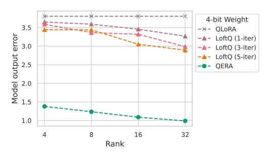
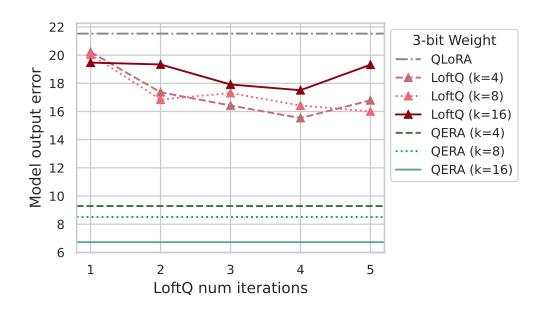
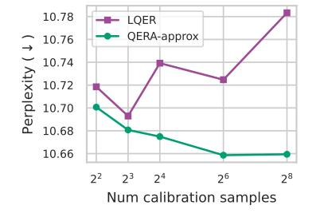
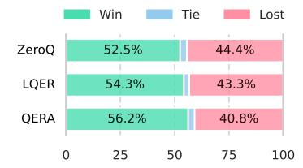

# 2 RELATED WORK

In this section, we review the existing methods that combine weight quantization and low-rank error reconstruction. These methods can be roughly categorized into two groups based on their applications: QPEFT for training and PTQ for inference.

**LoRA and QPEFT** LoRA Hu et al. (2021) is a representative PEFT method that introduces trainable low-rank terms to adapt the model to a specific task. Take a linear layer as an example,

$$y = x(W + A_k B_k) \tag{1}$$

where  $W \in \mathbb{R}^{m \times n}$  is the pretrained weight matrix, row vector  $x \in \mathbb{R}^m$  and  $y \in \mathbb{R}^n$  are the input and output, and  $A_k \in \mathbb{R}^{m \times k}$  and  $B_k \in \mathbb{R}^{k \times n}$  are trainable low-rank matrices ("adapter") with rank  $k \ll \min(m,n)$ . During fine-tuning, the pretrained W is frozen and only the adapter  $A_k$  and  $B_k$  are updated. To make the adapted layer's output match the original one at the start of fine-tuning, LoRA initializes  $A_k$  with Gaussian random values and  $B_k$  with zeros. Once the fine-tuning is completed, the adapter is merged into the pre-trained weights.

QLoRA (Guo et al., 2023) extends LoRA by quantizing the pretrained weights stored in GPU memory to reduce memory footprint.

$$\boldsymbol{W}_q = q(\boldsymbol{W}) \tag{2}$$

One difference between QLoRA and LoRA is that during fine-tuning,  $W_q$  needs to be dequantized before involved into matrix multiplications:

$$\widetilde{\boldsymbol{W}} = \operatorname{dq}(\boldsymbol{W}_q), \ \boldsymbol{y} = \boldsymbol{x}(\widetilde{\boldsymbol{W}} + \boldsymbol{A}_k \boldsymbol{B}_k)$$
 (3)

where  $dq(\cdot)$  is the dequantization function. QLoRA introduces weight quantization error  $(W-\widetilde{W})$ , shifting the starting point of fine-tuning. To address this problem, LoftQ (Li et al., 2023) initializes the adapter using the SVD-based low-rank approximation of  $(W-\widetilde{W})$  to reduce the weight approximation error:

$$\underset{\boldsymbol{A}_{k},\boldsymbol{B}_{k}}{\operatorname{arg\,min}} ||\boldsymbol{W} - \widetilde{\boldsymbol{W}} - \boldsymbol{A}_{k}\boldsymbol{B}_{k}||_{F} \tag{4}$$

Specifically, LoftQ uses a heuristic-based algorithm to iteratively update the quantized weights and the adapter (Algorithm 1 in the Appendix). Their experiments show that a larger number of iterations leads to a smaller weight error.

LQ-LoRA (Guo et al., 2023) also adopts LoftQ's iterative method but keeps track of a scaled variant of the objective,  $\arg\min_{A_k,B_k}||D_{\text{row}}(W-\widetilde{W}-A_kB_k)D_{\text{col}}||_F$ , where  $D_{\text{row}}$  and  $D_{\text{col}}$  are heuristic homogenous row/column matrices from activation statistics. LQ-LoRA exits the iteration when the scaled objective function stops decreasing due to the lack of a theoretical justification for LoftQ.

**Quantization Error Reconstruction for PTQ** Similar to the forward pass of fine-tuning in QLoRA, there are also PTQ methods that quantize the pretrained weights to low-precision formats and recover the model performance with additional low-rank terms. With a small enough rank k, the additional computation introduced is negligible. Note that unlike QPEFT which can utilize fine-tuning to correct the quantization error, PTQ methods aim to recover the model performance as much as possible without any training.

ZeroQuant-V2 (Yao et al., 2023) is the earliest weight-only quantization method introducing low-rank quantization error reconstruction to the PTQ problem. They apply SVD to the weight quantization error  $(W-\widetilde{W})$  to calculate  $A_k$  and  $B_k$  (equivalent to LoftQ with one iteration). Combining low-rank terms and fine-grained quantization, ZeroQuant-V2 recovers the performance of 4-bit LLMs to a level comparable to 8-bit.

Recent quantization works have shown that activation statistics play a crucial role in weight-only LLM quantization (Liu et al., 2023b; Lin et al., 2024). QLLM (Liu et al., 2023a) trains the low-rank terms using gradient descent with a loss function that minimizes the output error of the attention layer. LQER (Zhang et al., 2024a) applies an activation-induced heuristic scale matrix S to the quantization error before calculating SVD,  $U\Sigma V^T = \text{SVD}(S(W-\widetilde{W}))$ , and assigns  $A_k := S^{-1}U_{:,:k}, \ B_k := \Sigma_{:k::k}V_{:k:}^T$  (Refer to Algorithm 2 in the Appendix). LQER achieves significant improvement over ZeroQuant-V2 and observes that in some layers singular values are shaped toward a more desirable distribution where singular values decay faster. Note that ZeroQuant-V2 can also be considered as a special case where S in LQER is an identity matrix. To our knowledge, CALDERA (Saha et al., 2024) is the concurrent work close to ours. CALDERA focuses on a different problem setup to find optimal  $\widetilde{W}$ ,  $A_k$ ,  $B_k$  all in low-precision formats that minimizes output error, with a lemma agreeing with our exact solution. We elaborate the connection and difference between CALDERA and QERA in Appendix A.3.

In summary, to solve the quantization error reconstruction (QER) problem, most of existing methods target the minimization of the weight approximation error. Several recent works such as LQ-LoRA, QLLM, and LQER introduce activation-induced heuristics to the calculation of adapters/low-rank terms, but a justification for the optimization objective and the corresponding analytical framework are still missing.

#### 3 Our Analytical Framework

In this section, we formulate the optimization objective of quantization error reconstruction and derive the analytical solution to the low-rank term  $C_k := A_k B_k$ .

#### 3.1 PROBLEM STATEMENT

Given a pretrained linear layer y = xW with input vector  $x \in \mathbb{R}^m$ , output vector  $y \in \mathbb{R}^n$ , and weight matrix  $W \in \mathbb{R}^{m \times n}$ , our aim is to approximate it with a high-rank low-precision  $\widetilde{W}$  and a low-rank high-precision term  $C_k \in \mathbb{R}^{m \times n}$  with rank  $k \ll \min(m, n)$ .

$$\widetilde{y} = x(\widetilde{W} + C_k) \tag{5}$$

This raises the question of the actual optimization target: Should we minimize the weight reconstruction error  $||W - \widetilde{W}||_F$  or the output reconstruction error  $||y - \widetilde{y}||_2$ ? We separate these two problems and introduce them formally below.

**Problem 1** (Minimization of weight error). For a pretrained linear layer y = xW and its approximated form  $\widetilde{y} = x(\widetilde{W} + C_k)$ , reconstructing the quantization error by minimizing weight approximation error has the following objective:

$$\underset{\boldsymbol{C}_k}{\arg\min} ||\boldsymbol{W} - \widetilde{\boldsymbol{W}} - \boldsymbol{C}_k||_F \tag{6}$$

where  $\|\cdot\|_F$  denotes the Frobenius norm.

**Solution to Problem 1.** From the Eckart-Young-Mirsky theorem (Eckart & Young, 1936), the optimal solution to Problem 1 with respect to rank k is the truncated SVD of the weight error matrix:

$$C_k = U_{:::k} \Sigma_{:k::k} V_{:k}^T . \tag{7}$$

where  $U, \Sigma$ , and  $V^T$  form the SVD of the weight quantization error,  $U\Sigma V^T = \text{SVD}(W - \widetilde{W})$ .

As noted in Section 2, most existing works (Li et al., 2023; Yao et al., 2023; Guo et al., 2023) in QPEFT and PTQ adopt this solution. However, we know that minimizing the weight approximation error is not equivalent to minimizing the layer output error. Furthermore, does minimizing the weight approximation error for each layer in a network effectively reduce the final model output error? We will show that the answer is negative in Section 4.2.

**Problem 2** (Minimization of layer output error). For a pretrained linear layer y = xW and its approximated form  $\widetilde{y} = x(\widetilde{W} + C_k)$ , approximating the layer by minimizing the error between y and  $\widetilde{y}$  is to minimize the following expectation.

$$\underset{\boldsymbol{C}_{k}}{\arg\min} \, \mathbb{E}_{\boldsymbol{y} \sim \mathbb{Y}} \{ ||\widetilde{\boldsymbol{y}} - \boldsymbol{y}||_{2}^{2} \}$$
 (8)

where  $||\cdot||_2$  denotes  $l_2$  norm, and  $\mathbb{Y} \subseteq \mathbb{R}^n$  is output space of the layer. We expand Equation (8) by substituting  $\widetilde{y}$  and y:

$$\underset{\boldsymbol{C}_k}{\arg\min} \, \mathbb{E}_{\boldsymbol{x} \sim \mathbb{X}} \{ ||\boldsymbol{x}(\widetilde{\boldsymbol{W}} + \boldsymbol{C}_k) - \boldsymbol{x} \boldsymbol{W}||_2^2 \}$$
 (9)

where  $\mathbb{X} \subseteq \mathbb{R}^m$  is the input space. In practice, the expectation can be approximated as a sample mean on a calibration dataset like a subset of the pretraining data set.

Problem 2 motivates some recent works (Liu et al., 2023a; Guo et al., 2023; Zhang et al., 2024a) to involve activation-induced heuristics in the optimization of  $C_k$  but without a theoretical foundation. In the following two sections, we will derive the analytical solution to Problem 2. More precisely, we present two solutions: one exact solution in Section 3.2 and an approximated solution based on a suitable statistical assumption in Section 3.3.

#### 3.2 OERA-EXACT: ANALYTICAL SOLUTION

QERA-exact is our exact solution to Problem 2. QERA-exact is computationally expensive as it calculates the autocorrelation matrix of the input space X. However, as we will show in Section 4, QERA-exact recovers significant model performance in extremely low-precision quantization.

**Theorem 1** (QERA-exact solution). The solution to Problem 2 is

$$C_k = \left(R_{\mathbb{X}\mathbb{X}}^{\frac{1}{2}}\right)^{-1} U_{:,:k} \Sigma_{:k,:k} V_{:k,:}^T$$

$$\tag{10}$$

where  $R_{\mathbb{XX}}$  is the autocorrelation matrix respect to the input space  $\mathbb{X}$ ,

$$\boldsymbol{R}_{\mathbb{X}\mathbb{X}} = \mathbb{E}_{\boldsymbol{x} \sim \mathbb{X}} \left\{ \boldsymbol{x}^T \boldsymbol{x} \right\} \tag{11}$$

 $R_{\mathbb{XX}}^{\frac{1}{2}}$  represents the unique symmetric positive semi-definite matrix square root of  $R_{\mathbb{XX}}$ , and  $U_{:,:k}$ ,  $\Sigma_{:k,:k}$ , and  $V_{:k,:}$  form the truncated SVD of the following scaled weight error matrix,

$$U\Sigma V^{T} = SVD(\mathbf{R}_{XX}^{\frac{1}{2}}(\mathbf{W} - \widetilde{\mathbf{W}}))$$
 (12)

**Remark 1.**  $\mathbf{R}_{\mathbb{X}\mathbb{X}}^{\frac{1}{2}}$  is positive semi-definite. In the event that it has a zero eigenvalue, it would be normal to add a small diagonal perturbation to recover invertibility. In practice, we ran extensive experiments and find that  $\mathbf{R}_{\mathbb{X}\mathbb{X}}^{\frac{1}{2}}$  is invertible for all the pretrained models and datasets we present in Section 4.

#### **Proof of Theorem 1**

*Proof.* Define  $P := \widetilde{W} + C_k - W$ , and  $p_i := P_{i,:}$  is the *i*-th row of P. Then we substitute  $(\widetilde{W} + C_k - W)$  in the expanded objective Equation (9) of Problem 2 with P:

$$\mathbb{E}_{\boldsymbol{y} \sim \mathbb{Y}} \{ || \widetilde{\boldsymbol{y}} - \boldsymbol{y} ||_{2}^{2} \} = \mathbb{E}_{\boldsymbol{x} \sim \mathbb{X}} \{ || \boldsymbol{x} \boldsymbol{P} ||_{2}^{2} \}$$

$$= \mathbb{E}_{\boldsymbol{x} \sim \mathbb{X}} \{ || \sum_{i=1}^{m} x_{i} \boldsymbol{p}_{i} ||_{2}^{2} \}$$

$$= \mathbb{E}_{\boldsymbol{x} \sim \mathbb{X}} \left\{ \sum_{i=1}^{m} \sum_{j=1}^{m} x_{i} x_{j} \boldsymbol{p}_{i} \boldsymbol{p}_{j}^{T} \right\}$$
(13)

We rewrite the last line of Equation (13) as:

$$\mathbb{E}_{\boldsymbol{y} \sim \mathbb{Y}}\{||\widetilde{\boldsymbol{y}} - \boldsymbol{y}||_{2}^{2}\} = \mathbb{E}_{\boldsymbol{x} \sim \mathbb{X}}\left\{\boldsymbol{e} \cdot \left((\boldsymbol{x}^{T} \boldsymbol{x}) \odot (\boldsymbol{P} \boldsymbol{P}^{T})\right) \cdot \boldsymbol{e}^{T}\right\}$$
(14)

where  $e = \begin{bmatrix} 1 & 1 & \dots & 1 \end{bmatrix}$  is a row vector of m ones, and  $\odot$  denotes the element-wise product.

Using the property of the element-wise product (Styan, 1973), the RHS of the above can be simplified.

$$\mathbb{E}_{\boldsymbol{y} \sim \mathbb{Y}} \{ || \widetilde{\boldsymbol{y}} - \boldsymbol{y} ||_{2}^{2} \} = \mathbb{E}_{\boldsymbol{x} \sim \mathbb{X}} \{ \operatorname{Tr} \left( (\boldsymbol{x}^{T} \boldsymbol{x}) (\boldsymbol{P} \boldsymbol{P}^{T})^{T} \right) \}$$

$$= \operatorname{Tr} \left( \mathbb{E}_{\boldsymbol{x} \sim \mathbb{X}} \left\{ \boldsymbol{x}^{T} \boldsymbol{x} \right\} \boldsymbol{P} \boldsymbol{P}^{T} \right)$$

$$= \operatorname{Tr} \left( \boldsymbol{R}_{\mathbb{X} \mathbb{X}} \boldsymbol{P} \boldsymbol{P}^{T} \right)$$
(15)

where  $\operatorname{Tr}(\cdot)$  denotes trace and  $\mathbf{R}_{\mathbb{X}\mathbb{X}} = \mathbb{E}_{\boldsymbol{x} \sim \mathbb{X}} \left\{ \boldsymbol{x}^T \boldsymbol{x} \right\}$  is the autocorrelation matrix with respect to the input space  $\mathbb{X}$ .

Since  $R_{\mathbb{X}\mathbb{X}}$  is a symmetric positive semi-definite matrix, it always has precisely one matrix square root, denoted as  $R_{\mathbb{X}\mathbb{X}}^{\frac{1}{2}}$ , that is also symmetric and positive semi-definite (Horn & Johnson, 2012). We reorganize Equation (15) as the following since both  $R_{\mathbb{X}\mathbb{X}}$  and  $(PP^T)$  are symmetric and positive semi-definite:

$$\mathbb{E}_{\boldsymbol{y} \sim \mathbb{Y}} \{ || \widetilde{\boldsymbol{y}} - \boldsymbol{y} ||_{2}^{2} \} = \operatorname{Tr} \left( \boldsymbol{R}_{\mathbb{X}\mathbb{X}}^{\frac{1}{2}} \boldsymbol{P} \boldsymbol{P}^{T} \boldsymbol{R}_{\mathbb{X}\mathbb{X}}^{\frac{1}{2}} \right)$$

$$= \operatorname{Tr} \left( \boldsymbol{R}_{\mathbb{X}\mathbb{X}}^{\frac{1}{2}} \boldsymbol{P} \boldsymbol{P}^{T} (\boldsymbol{R}_{\mathbb{X}\mathbb{X}}^{\frac{1}{2}})^{T} \right)$$

$$= || \boldsymbol{R}_{\mathbb{X}\mathbb{X}}^{\frac{1}{2}} \boldsymbol{P} ||_{F}^{2}$$
(16)

Now the objective of Problem 2 (Equation (8)) is equivalent to:

$$\underset{\boldsymbol{C}_{k}}{\operatorname{arg\,min}} \, \mathbb{E}_{\boldsymbol{y} \sim \mathbb{Y}} \{ ||\widetilde{\boldsymbol{y}} - \boldsymbol{y}||_{2}^{2} \} = \underset{\boldsymbol{C}_{k}}{\operatorname{arg\,min}} \, ||\boldsymbol{R}_{\mathbb{XX}}^{\frac{1}{2}} \boldsymbol{P}||_{F}^{2}$$

$$= \underset{\boldsymbol{C}_{k}}{\operatorname{arg\,min}} \, ||\boldsymbol{R}_{\mathbb{XX}}^{\frac{1}{2}} (\widetilde{\boldsymbol{W}} + \boldsymbol{C}_{k} - \boldsymbol{W})||_{F}^{2}$$
(17)

If we assign  $Q:=R_{\mathbb{XX}}^{\frac{1}{2}}(W-\widetilde{W})$  and  $Q_k:=R_{\mathbb{XX}}^{\frac{1}{2}}C_k$ , the objective becomes:  $\underset{Q_k}{\arg\min}||Q_k-Q||_F^2 \tag{18}$ 

Note that multiplication by the invertible matrix  $R_{\mathbb{X}\mathbb{X}}^{\frac{1}{2}}$  (Remark 1) does not change the rank of the matrix  $C_k$ . According to the Eckart-Young-Mirsky theorem (Eckart & Young, 1936), the optimal rank k approximation to  $Q_k$  is the truncated SVD of Q:

$$Q_k = U_{:::k} \Sigma_{:k::k} V_{\cdot k}^T. \tag{19}$$

where  $\bm{U} \bm{\Sigma} \bm{V}^T = \mathrm{SVD}(\bm{Q}) = \mathrm{SVD}\left( \bm{R}_{\mathbb{X}\mathbb{X}}^{\frac{1}{2}}(\bm{W} - \widetilde{\bm{W}}) \right)$ . Thus the optimal rank-k solution to  $\bm{C}_k$  is:

$$C_k = \left(R_{\mathbb{X}\mathbb{X}}^{\frac{1}{2}}\right)^{-1} Q_k = \left(R_{\mathbb{X}\mathbb{X}}^{\frac{1}{2}}\right)^{-1} U_{:,:k} \Sigma_{:k,:k} V_{:k,:}^T$$
(20)

In practice, we assign  $A_k := \left(R_{\mathbb{XX}}^{\frac{1}{2}}\right)^{-1} U_{:,:k}$  and  $B_k := \Sigma_{:k,:k} V_{:k,:}^T$ . Note that QERA adds no constraints to the quantization (and dequantization) function  $q(\cdot)$  (and  $dq(\cdot)$ ), *i.e.*, the low-precision  $\widetilde{W}$  can be obtained by any quantization method.

#### 3.3 QERA-APPROX: AN ANALYTICAL SOLUTION WITH THE UNCORRELATED ASSUMPTION

QERA-approx is our analytical solution to Problem 2 based on the assumption that different embedding dimensions are uncorrelated. This solution is more computationally efficient than the exact solution, and the assumption is testable on real-world datasets. The complete proof of QERA-approx is in Appendix A.2.

**Assumption 1.** For a pretrained linear layer y = xW, the expectation of the product of different embedding dimensions is zero:

$$\mathbb{E}_{\boldsymbol{x} \sim \mathbb{X}} \{ x_i x_j \} = 0, \quad \forall i \neq j$$
 (21)

where  $x_i$  and  $x_j$  are the i-th and j-th elements of the input vector x.

We test this assumption on LLMs in Section 5.

**Theorem 2** (QERA-approx solution). The solution to Problem 2 based on Assumption 1 is:

$$C_k = S^{-1}U_{:::k}\Sigma_{:k::k}V_{:k}^T.$$

$$(22)$$

where S is a diagonal matrix built from activation statistics.

$$S = \operatorname{diag}(\sqrt{\mathbb{E}_{\boldsymbol{x} \sim \mathbb{X}}\{x_1^2\}}, \sqrt{\mathbb{E}_{\boldsymbol{x} \sim \mathbb{X}}\{x_2^2\}}, \dots, \sqrt{\mathbb{E}_{\boldsymbol{x} \sim \mathbb{X}}\{x_m^2\}})$$
 (23)

and  $U, \Sigma, V^T$  form the SVD of the following scaled weight error matrix,

$$U\Sigma V^{T} = SVD(S(W - \widetilde{W}))$$
(24)

**Remark 2.** For the diagonal matrix S in Theorem 2 to be invertible, we need  $\mathbb{E}_{x \sim \mathbb{X}}\{x_i^2\} \neq 0$  for all dimension i. In practice, this is almost always true for pretrained layers because no dimension in the input embeddings is always zero.

For implementation, we assign  $A_k := S^{-1}U_{:,:k}$  and  $B_k := \Sigma_{:k,:k}V_{:k,:}$  to form the low-rank terms to save the memory and computation cost. Interestingly, QERA-approx solution is similar to the activation-induced heuristics in LQER (Zhang et al., 2024a), which calibrates the average absolute value on the embedding dimension (Refer to Algorithm 2 in the Appendix). In Section 4.3, we will show that our solution is more effective in practice and resolves the discrepancy between the recovered model performance and the number of calibration samples in LQER.

#### 4 EXPERIMENTS

In this section, we first introduce the experiment setup in Section 4.1. Then we present the results of our experiments on QPEFT and PTQ in Section 4.2 and Section 4.3 respectively.

- (a) Model output error vs. rank
- (b) Model output error vs. LoftQ iterations

Figure 1: The model output error of RoBERTa-base before fine-tuning. We feed 128 samples from RoBERTa's pretraining dataset and profile the output logits error between the adapted and the FP32 model. We sweep the rank k and the iteration number of LoftQ on 4-bit and 3-bit models. In LoftQ, neither more iterations nor a higher rank guarantees lower model output error, though the weight approximation error of every layer decreases. In contrast, QERA-approx consistently has the lowest model output error across all settings, and the error monotonically decreases as the rank increases.

#### 4.1 EXPERIMENT SETUP

We perform QPEFT and PTQ experiments separately, and compare with their respective SoTA methods. The experiments take around 6400 GPU hours in total. The hardware platform, separate GPU hours, software dependencies, and random seed settings can be found in Appendix A.4.

For QPEFT experiments, we use Theorem 2, noted as QERA-approx, to initialize low-rank terms, and compare with full-finetuning, LoRA (Hu et al., 2021), QLoRA (Dettmers et al., 2024), and LoftQ (Li et al., 2023). Specifically, we adopt 5-iteration LoftQ, which is the officially recommended setup. We include both encoder-only model experiments (fine-tuning RoBERTa-base (Liu, 2019) on GLUE (Ye et al., 2019)) and decoder-only LLM experiments (fine-tuning LLaMA-2 (Touvron et al., 2023) and LLaMA-3.1 (Dubey et al., 2024) on continuous pretraining task SlimPajama (Soboleva et al., 2023) and supervised fine-tuning task GSM8K (Cobbe et al., 2021)). For each method/baseline, we sweep the learning rate and record the best result. The final results are averaged over three random seeds. The learning rate ranges and batch sizes are listed in Appendix A.4.1.

For PTQ experiments, we use both Theorem 1, noted as QERA-exact, and Theorem 2 (QERA-approx) to calculate the low-rank error reconstruction terms and report results separately. We compare with BF16, quantized model without error reconstruction terms (*w*-only), ZeroQuant-V2 (Yao et al., 2023), and LQER (Zhang et al., 2024a) at different precision setups. We also include HQQ (Badri & Shaji, 2023), a leading 4-bit method that does not use quantization error reconstruction. We quantize LLMs of various sizes and model family, including TinyLlama (Zhang et al., 2024b), Gemma-2 (Team et al., 2024), Phi-3.5 (Abdin et al., 2024) and LLaMA-2/-3.1 (Touvron et al., 2023; Dubey et al., 2024). We use lm-evaluation-harness to report results on Wikitext2 (Merity et al., 2016), ARC (challenge) (Clark et al., 2018), BoolQ (Clark et al., 2019), CommonSenseQA (Talmor et al., 2019), Winogrande (Sakaguchi et al., 2019), MMLU (Hendrycks et al., 2021), and BigBench-Hard (Suzgun et al., 2022). We also evaluate instruction-tuned model, Vicuna-v1.5 (Zheng et al., 2023), with AlpacaEval 2.0 (Dubois et al., 2024), which is an automatic evaluation tool for instruction-following tasks. Detailed setup is in Appendix A.4.2.

#### 4.2 IMPROVED OPEFT

We first identify a pitfall in the commonly-used iterative Algorithm 1, that is, minimizing the weight approximation error for each layer does not necessarily minimize the model output error. Then we show that our QERA initialization enables a clear reduction in the model output error at the start of fine-tuning, leading to better fine-tuned accuracy/perplexity and faster convergence.

**Reduced layer weight error**  $\neq$  **reduced model output error** We apply 4-bit and 3-bit QLoRA, LoftQ, and QERA-approx to RoBERTa-base and inspect the *model output error* on RoBERTa's pretraining dataset before fine-tuning at rank k=4,8,16,32. For LoftQ, we also sweep the number of iterations from 1 to 5. In Figure 1, we observe that

 For LoftQ, given a specific rank, increasing the optimization iterations does not guarantee a reduced model output error. Though all the layers' weight approximation errors monoton-

Table 1: Fine-tuning results of RoBERTa-base on GLUE. QERA-approx outperforms LoftQ across all bit widths, and the improvement is more obvious with aggressive quantization. QERA achieves  $\Delta_{\rm acc}$  = 4.12% higher than LoftQ at 3-bit and 6.05% at 2-bit.

| Rank | W-bits | Method                                 | MNLI Acc                    | QNLI Acc                    | RTE Acc                     | SST Acc                            | MRPC Acc                    | CoLA Matt                  | QQP Acc                     | STSB P/S Corr                                 | Avg.                           |
|------|--------|----------------------------------------|--------------------------------|--------------------------------|--------------------------------|---------------------------------------|--------------------------------|-------------------------------|--------------------------------|--------------------------------------------------|--------------------------------|
| -    | 16     | Full FT                                | 87.61                          | 92.95                          | 73.16                          | 94.88                                 | 92.15                          | 60.41                         | 91.61                          | 90.44/90.25                                      | 85.38                          |
| 8    | 16     | LoRA                                   | 87.85                          | 92.84                          | 69.55                          | 94.46                                 | 89.99                          | 57.52                         | 89.83                          | 89.92/89.83                                      | 84.00                          |
| 8    | 4.25   | QLoRA LoftQ (5-iter) QERA-approx | 87.21 87.27 <b>87.28</b> | 92.32 <b>92.48</b> 92.45 | 63.90 67.13 <b>70.40</b> | 94.08 <b>94.38</b> <b>94.38</b> | 88.24 88.24 <b>88.97</b> | <b>56.08</b> 54.59 55.99      | <b>90.55</b> 90.51 90.39 | 89.59/89.56 88.75/88.79 <b>89.83/89.72</b> | 82.75 82.92 <b>83.71</b> |
| 8    | 3.25   | QLoRA LoftQ (5-iter) QERA-approx | 84.87 85.24 <b>85.58</b> | 89.58 89.65 <b>90.74</b> | 53.67 58.24 <b>58.48</b> | 91.02 92.05 <b>92.59</b>        | 73.94 75.82 <b>82.19</b> | 3.12 11.00 <b>32.98</b> | 89.31 88.93 <b>89.41</b> | 84.80/84.38 85.55/85.27 <b>87.43/87.08</b> | 71.29 73.31 <b>77.43</b> |
| 64   | 2.50   | QLoRA LoftQ (5-iter) QERA-exact  | 77.87 80.15 <b>84.64</b> | 85.26 87.65 <b>90.05</b> | 54.15 52.95 <b>58.48</b> | 90.02 90.94 <b>92.32</b>        | 71.00 74.35 <b>84.72</b> | 0 3.43 <b>26.43</b>     | 87.93 89.17 <b>89.69</b> | 74.72/75.31 82.76/82.90 <b>86.48/86.40</b> | 67.62 70.18 <b>76.23</b> |

Table 2: Fine-tuning results of LLaMA-2-7B and LLaMA-3.1-8B on SlimPajama and GSM8K. A trend similar to RoBERTa experiments are observed, *i.e.*, QERA outperforms QLoRA and LoftQ and the improvement is more obvious on aggressive quantization.

| W-bits   | Method                                 | LLaMA-                                                           | -2-7B                                                      | LLaMA-3.1-8B                                                 |                                                           |  |  |
|----------|----------------------------------------|------------------------------------------------------------------|------------------------------------------------------------|--------------------------------------------------------------|-----------------------------------------------------------|--|--|
| *** 0110 | 111041100                              | SlimPajama ( $\Delta_{ppl}$ )                                    | GSM8K ( $\Delta_{acc}$ )                                   | SlimPajama ( $\Delta_{ppl}$ )                                | GSM8K ( $\Delta_{acc}$ )                                  |  |  |
| 16       | LoRA                                   | 6.17                                                             | 39.40                                                      | 8.07                                                         | 55.72                                                     |  |  |
| 4.25     | QLoRA LoftQ (5-iter) QERA-approx | 6.44 (+0.27) 6.39 (+0.22) <b>6.33 (+0.16</b> )             | 30.71 (-8.69) 28.58 (-10.82) <b>32.26 (-7.14)</b>    | 8.70 (+0.63) 8.73 (+0.66) <b>8.68</b> (+ <b>0.61</b> ) | 54.81 (-0.91) 54.23 (-1.49) <b>55.24 (-0.48</b> )   |  |  |
| 2.25     | QLoRA LoftQ (5-iter) QERA-approx | 53.95 (+47.78) 12.30 (+6.13) <b>10.56</b> (+ <b>4.39</b> ) | 12.79 (-18.31) 18.37 (-12.73) <b>18.78 (-12.32</b> ) | 71.90 (+63.83) 27.16 (+19.09) <b>20.07 (+12.00</b> )   | 5.08 (-50.64) 13.72 (-42.00) <b>19.41 (-36.31</b> ) |  |  |

ically decrease with the number of iterations (as illustrated in Figure 6 in Appendix), the model output error does not monotonically decrease. For example, in Figure 1a, the model output error of LoftQ (5-iter) is larger than LoftQ (3-iter) at rank k=8.

- For LoftQ, given a specific number of iterations, increasing the rank does not guarantee a reduced model output error. For example, in Figure 1b, the output error of LoftQ (rank k = 16) is larger than LoftQ (rank k = 4) and k = 8 at 2, 3, 4, and 5 iterations.
- The model output error of our QERA-approx is always smaller than LoftQ and QLoRA, across all precision and rank settings. Moreover, the output error of QERA-approx monotonically decreases as the rank increases.

This empirical evidence suggests a strong correlation between the reduction of layer output error and the decrease in model output error in QER problem. Conversely, minimizing weight approximation error using LoftQ does not have a comparable impact on overall model performance.

Better optimization quality Table 1 and Table 2 summarize the fine-tuning experiments of RoBERTa-base on GLUE, and LLaMA-2-7B/-3.1-8B fine-tuned on SlimPajama and GSM8K, respectively. QERA outperforms both LoftQ and QLoRA. In GLUE experiments, at 4-bit, QERA enables an average accuracy gain of 0.96% and 0.79% higher than QLoRA and LoftQ respectively, close to BF16 LoRA; At 3-bit and 2-bit, QERA achieves a 4.12% and 6.05% higher average accuracy than LoftQ respectively. Similar trends are observed on LLM fine-tuning experiments, *i.e.*, QERA outperforms QLoRA and LoftQ, and the advantage of QERA over LoftQ is more obvious with more aggressive quantization.

Faster Convergence QERA initialization also speeds up

Figure 2: Faster convergence of QERA-approx on STSB.

the training convergence. For LLM fine-tuning, this is expected as QERA initialization is closer to the full-precision model. Interestingly, in encoder-only experiments on GLUE where the model

Table 3: Perplexity ( $\downarrow$ ) of LLMs on WikiText2. w-only denotes the quantized model without low-rank error reconstruction. QERA-approx outperforms LQER on almost all setups and QERA-exact achieves the lowest perplexity. The advantage of QERA is pronounced at 3-bit.

| W-bits | Method                                          | Rank | TinyLlama                                        | Gemma-2                                          | Phi-3.5                                          | LLaN                                             | MA-2                                          | LLaMA-3.1                                        |                                               |
|--------|-------------------------------------------------|------|--------------------------------------------------|--------------------------------------------------|--------------------------------------------------|--------------------------------------------------|-----------------------------------------------|--------------------------------------------------|-----------------------------------------------|
| 010    | 111001100                                       |      | 1.1B                                             | 2B                                               | 3.8B                                             | 7B                                               | 13B                                           | 8B                                               | 80B                                           |
| -      | BF16                                            | -    | 13.98                                            | 13.08                                            | 11.50                                            | 8.71                                             | 7.68                                          | 7.55                                             | 3.06                                          |
| 4.25   | HQQ                                             | -    | 15.02                                            | 14.29                                            | 14.63                                            | 9.59                                             | 8.27                                          | 8.72                                             | 3.97                                          |
| 4.25   | w-only ZeroQuant-V2 LQER QERA-approx QERA-exact | 32   | 19.40 18.03 16.23 <b>15.66</b> 16.16 | 16.23 15.71 14.55 14.60 14.12        | 14.16 14.09 12.88 12.81 12.30        | 9.45 9.42 9.22 9.17 <b>9.12</b>      | 8.06 8.07 7.96 7.95 <b>7.93</b>   | 8.78 8.83 8.45 8.45 <b>8.33</b>      | 4.55 4.48 4.10 4.10 3.82          |
| 3.25   | w-only ZeroQuant-V2 LQER QERA-approx QERA-exact | - 64 | 32.82 27.80 20.60 20.43 <b>19.51</b> | 41.13 33.56 21.99 21.93 <b>19.97</b> | 47.78 42.64 18.27 <b>17.99</b> 20.37 | 13.32 13.00 14.00 10.99 <b>10.67</b> | 10.24 10.03 9.09 9.04 <b>8.97</b> | 18.96 19.29 11.86 11.73 <b>11.39</b> | 16.46 10.12 7.05 6.99 <b>6.68</b> |

classifier head is randomly initialized, we also observe that QERA converges faster, especially on small subsets such as STSB and MRPC where only a few thousand samples are available (in comparison MNLI has 393k samples and QQP has 364k samples). For example, in Figure 2, the Spearman correlation coefficient of QERA on STSB increases and converges faster than LoftQ and QLoRA, as the green line plateaus first.

#### 4.3 IMPROVED PTO

In this part, we first demonstrate that LQER, which depends on heuristics derived from activation values, does not guarantee improved performance with a larger calibration dataset. However, QERA exhibits the opposite trend. Through extensive experiments, we show that QERA consistently outperforms ZeroQuant-V2 and LQER, and QERA-exact exhibits better model performance than QERA-approx at the cost of more computation in the quantization process. These results verified the effectiveness of our analytical solution.

Model performance vs. calibration set size As mentioned at the end of Section 3.3, the scale matrix in LQER (Zhang et al., 2024a) is similar to the one in QERA-approx, but is based on hand-crafted heuristics. As a result, we observe that the model performance of LQER varies randomly as the number of calibration samples increases (the purple curve in Figure 3). On the contrary, more calibration samples consistently lead to better model performance for QERA until convergence.

**Improved perplexity and downsteam task accuracy** We apply QERA-approx and QERA-exact to a range of models and evaluate on both pretraining task and downstream tasks in Table 3 and Table 4 respectively. We also

Figure 3: QERA resolves the discrepancy between the recovered model performance and the number of calibration samples in LQER.

compare to HQQ, a SoTA method that does not use quantization error reconstruction. On most models, QERA-approx outperforms ZeroQuant-V2 and LQER, while QERA-exact achieves the best performance. At 4-bit, QERA-exact is nearly lossless. At 3-bit, QERA-exact's improvement over QERA-approx (Table 3) is clear, indicating the superiority of QERA-exact for aggressive quantization.

**Higher win rate on AlpacaEval 2.0** To better understand the impact on instruction-tuned models, we present the results of Vicuna-7b-v1.5 on AlpacaEval 2.0. In Figure 4, we evaluate the QER-based methods against the *w*-only quantization counterpart. QERA outperforms ZeroQuant-V2 and LQER by a higher win rate, indicating a better response quality.

&lt;sup>1The average accuracy of TinyLlama-1.1B excludes BoolQ, CommonsenseQA, and MMLU since TinyLlama-1.1B has random guess accuracy on these tasks.

Table 4: Average accuracy (†) of LLMs on six downstream tasks. QERA-exact outperforms other quantization-error reconstruction-based methods across almost all models. We also compare to HQQ (Badri & Shaji, 2023), a SoTA PTQ method that does not adopt quantization-error reconstruction or activation heuristics. QERA-exact achieves an average accuracy on par with HQQ.

| W-bits | Method                                          | Rank | TinyLlama 1                           | Gemma-2                                          | Phi-3.5                                          | LLaMA-2                                          |                                                  | LLaMA-3.1                                        |                                                  |
|--------|-------------------------------------------------|------|--------------------------------------------------|--------------------------------------------------|--------------------------------------------------|--------------------------------------------------|--------------------------------------------------|--------------------------------------------------|--------------------------------------------------|
| 0165   | 1,1041100                                       |      | 1.1B                                             | 2B                                               | 3.8B                                             | 7B                                               | 13B                                              | 8B                                               | 80B                                              |
| -      | BF16                                            | -    | 40.59                                            | 53.96                                            | 66.91                                            | 49.61                                            | 55.74                                            | 63.88                                            | 72.05                                            |
| 4.25   | HQQ                                             | -    | 40.35                                            | 52.54                                            | 59.17                                            | 48.26                                            | 54.53                                            | 62.59                                            | 71.31                                            |
| 4.25   | w-only ZeroQuant-V2 LQER QERA-approx QERA-exact | 32   | 36.56 37.26 <b>40.45</b> 40.02 40.36 | 48.33 48.24 49.77 49.29 <b>51.73</b> | 64.52 64.44 64.46 64.53 <b>65.08</b> | 47.62 47.43 48.47 48.52 <b>48.91</b> | 55.12 55.15 55.40 55.20 <b>55.42</b> | 61.53 61.70 61.75 61.68 <b>62.05</b> | 68.46 68.45 70.94 70.80 <b>71.42</b> |

## 5 DISCUSSION

In this section, we revisit the arguments, design choices, and observations made in the previous sections, including a test of Assumption 1, and the choice of the calibration set for PEFT. We offer an extended discussion of the numeric stability and scalability in Appendix A.7, and LoRA rank and model choices of PEFT experiments in Appendix A.9.

**Test of Assumption 1** To test Assumption 1, we profile the autocorrelation matrix  $R_{\mathbb{X}\mathbb{X}}$  of the linear layer inputs in LLaMA-2-7B and LLaMA-3-8B. Note that  $\mathbb{R}_{\mathbb{X}\mathbb{X},i,j} = \mathbb{E}_{x \sim \mathbb{X}}\{x_i x_j\}$ , which assumes to be zero for  $i \neq j$  in Assumption 1. Figure 5 shows the normalized  $\mathbb{R}_{\mathbb{X}\mathbb{X}}$  magnitude,  $\frac{\mathrm{abs}(\mathbb{R}_{\mathbb{X}\mathbb{X}})}{||\mathbb{R}_{\mathbb{X}\mathbb{X}}||_F}$ , of four representative layers in LLaMA-3-8B where darker elements denote values closer to zero.

Figure 4: AlpacaEval 2.0 evaluation results. We compare quantized models to the counterpart without quantization-error reconstruction. A higher win rate (↑) indicates better instruction-following performance.

There are several layers with some input dimensions strongly correlated with others, such as the inputs to the third attention layer in Figure 5a, but for most layers, our assumption holds, especially the MLP layers, such as Figures 5b to 5d. More  $\mathbb{R}_{XX}$  plots are in Appendix A.11.

Figure 5: Normalized  $abs(\mathbf{R}_{\mathbb{X}\mathbb{X}})$  of the layer inputs in LLaMA-3-8B. Dark elements denotes value close to zero. There are a few layers with input dimensions strongly correlated with others, such as the third attention layer in (a), but for most layers, our assumption of zero-expectation holds.

Choice of calibration set for QPEFT One problem is to determine the calibration set for QERA before fine-tuning. In 2-bit RoBERTa-base fine-tuning experiment on SST2 (Appendix A.6), we find that calibrating on the pretraining dataset, WikiText2, helps the loss to decrease. However, the loss of the model calibrated on the fine-tuning dataset does not follow the same trend. We hypothesize that the massive padding tokens in preprocessed SST2 samples cause this discrepancy, especially considering that the sequence length of the raw SST2 dataset changes fiercely.

#### 6 Conclusion

In this paper, we formulate the problem of quantization error reconstruction and propose QERA as an analytical solution. Applying QERA to related works for efficient fine-tuning or inference, we show that QERA resolves the discrepancy in existing methods, and outperforms SoTA methods in both fine-tuning and quantization tasks by a clear margin.

