# A.6 CHOICE OF CALIBRATION SET

We compare the QERA-adapted models calibrated on the pretraining dataset and the downstream dataset. Specifically, we fine-tune two QERA-adapted 2-bit RoBERTa-base models. One is calibrated on its pretraining dataset, WikiText2, and the other on SST2. Figure [7](#page-17-2) shows the loss curves of the two models across three learning rates. None loss curves of the models calibrated on SST2 decreases, but the ones calibrated on WikiText2 successfully decrease and converge. We hypothesize that this is due to the massive padding tokens in preprocessed SST2 considering that the raw sample lengths change fiercely. However, WikiText2 samples were preprocessed in the masked language modeling style, which means that only a few special tokens are added to the grouped texts.

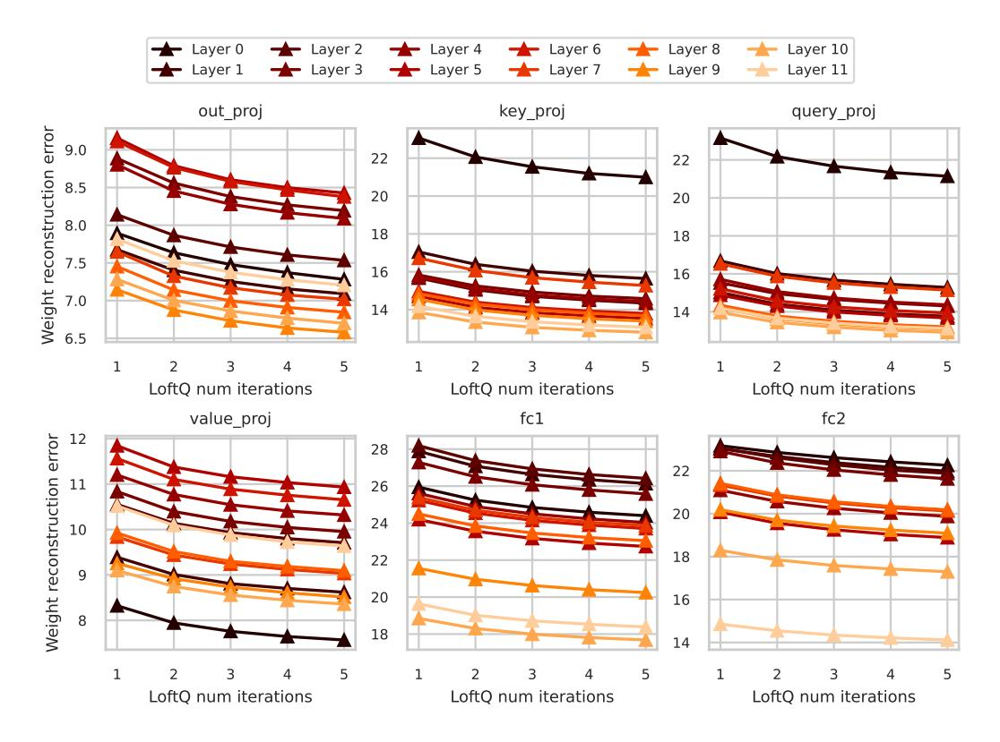

Figure 6: Weight approximation error of 3-bit rank-16 LoftQ with different numbers of iterations on RoBERTa-base. We observe that the weight reconstruction error of all the layers decreases as the number of iterations increases, but as shown in Figure [1b,](#page-6-2) the model output error (k=16) increases from the 4-th to 5-th iteration.

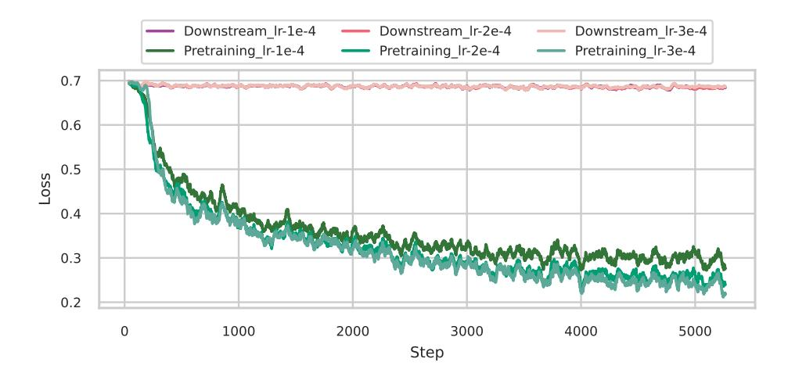

Figure 7: The fine-tuning loss curves of QERA-adapted 2-bit RoBERTa-base on SST2. The loss fails to decrease if the calibration is performed on the downstream task SST2 due to the massive padding tokens in preprocessed SST2 samples. In pretraining dataset, there are only a few special tokens like padding tokens and mask tokens.

- (a) Estimated error ratio of the square root of  $\mathbb{R}_{\mathbb{X}\mathbb{X}}$
- (b) QERA quantization time

Figure 8: Scalability of QERA. (a) plots the estimated error ratio of the matrix square root calculation of  $\mathbb{R}_{\mathbb{X}\mathbb{X}}$  of some layers where the error increases as the model goes larger. (b) compares the quantization time of QERA-approx and QERA-exact if all layers are quantized sequentially. The matrix square root is time-consuming since it is executed on CPUs. One key optimization for accelerating the quantization process of QERA-exact will be the GPU-accelerated matrix square root.

#### A.7 SCALABILITY AND NUMERICAL STABILITY OF QERA

One may notice the diminishing model performance improvement of QERA-exact over QERA-approx as the model size increases. The main reason is that larger LLMs are more resistant to quantization (Chee et al., 2024). Another reason can be the error ratio of the matrix square root calculation of the autocorrelation matrix increases with model hidden size (Figure 8a).

We find that the data type used in the calibration is important for the numeric stability of QERA-exact due to the calculation of the matrix square root and SVD. To improve the stability of the calculation in QERA-exact, a good practice we find is to perform the outer product of  $R_{\mathbb{X}\mathbb{X}}$  in FP32, accumulated outer product in FP64, and calculate the matrix square root in FP64 using the blocked Schur algorithm (Deadman et al., 2012). Figure 8b illustrates the quantization time of QERA-approx and QERA-exact on the platform described in Appendix A.4 where the linear layers are quantized sequentially. QERA-exact is slow due to the calculation of matrix square roots on CPUs. GPU-accelerated matrix square root will be the key optimization to reduce the quantization time. Note that in QERA, the quantization of individual layers is independent, allowing more parallelization and acceleration of the quantization process.

#### A.8 CHOICE OF SOLUTIONS FOR QPEFT AND PTQ

QPEFT and PTQ are two different application scenarios of QERA. We recommend QERA-approx for QPEFT and QERA-exact for PTQ. PTQ aims to recover the model performance as much as possible without re-training. For PTQ, it is desirable to recover more model performance even if it takes longer to compute low-rank terms. Note that the low-rank terms are pre-computed once offline. At inference time, QERA-exact introduces no overhead to the hardware since LQER, QERA-approx, and QERA-exact all takes the same form of  $y = x(\widetilde{W} + A_k B_k)$ .

However, for QPEFT experiments, it is unreasonable to pay a long time for initializing the low-rank terms for the limited improvement in output approximation error (i.e., QERA-exact/CALDERA), because 1) fine-tuning can recover the error, and 2) instead of spending much time on initialization, increasing training steps or increasing the rank number brings more gain in the fine-tuned accuracy. We run controlled experiments to support this claim. In Table 7 and Table 8, we run QPEFT experiments of RoBERTA-base on MRPC and LLaMA-2-7B on SlimPajama respectively. Compared to QERA-exact (Caldera's Lemma 4.2), QERA-approx achieves better accuracy/perplexity while taking  $\frac{2}{3}\sim\frac{1}{2}$  of the time.

Table 7: Runtime comparison of QERA-exact and QERA-approx on MRPC. It is recommended using QERA-approx for QPEFT instead of QERA-exact.

| Method      | Rank | Epochs | Init. time | Training time | Total time (↓) | Acc. (†) |
|-------------|------|--------|------------|---------------|----------------|----------|
| QERA-exact  | 8    | 4      | 1.6min     | 2.2min        | 3.8min         | 88.97    |
| QERA-approx | 12   | 4      | 21s        | 2.2min        | 2.6min         | 89.95    |
| QERA-approx | 8    | 5      | 21s        | 2.7min        | 3.1min         | 89.97    |

Table 8: Runtime comparison of QERA-exact and QERA-approx on SlimPajama. It is recommended using QERA-approx for QPEFT instead of QERA-exact.

| Method      | Rank | Epochs | Init. time | Training time | Total time (↓) | PPL. (↓) |
|-------------|------|--------|------------|---------------|----------------|----------|
| QERA-exact  | 16   | 2      | 4.9h       | 1.9h          | 6.8h           | 6.31     |
| QERA-approx | 64   | 2      | 29.6min    | 2.1h          | 2.6h           | 6.18     |
| QERA-approx | 16   | 4      | 28.2min    | 4.0h          | 4.5h           | 6.21     |

### A.9 CHOICES OF LORA RANKS, MODELS, AND PRECISIONS FOR QPEFT

Rank = 8 for GLUE experiments We notice LoftQ paper uses a large rank of 16 and 32 for fine-tuning on GLUE, which is larger than the commonly-used rank value of LoRA (4 or 8 in LoRA paper (Hu et al., 2021)). If we consider LoRA as the upper limit of QLoRA-like QPEFT methods (including LoftQ and QERA), to effectively compare these QPEFT methods, one easy way is to set the rank as the minimum value required by LoRA and check which QPEFT method achieves an accuracy closest to LoRA. This is why we choose rank = 8 for GLUE experiments (For 2-bit GLUE experiments we use a large rank 64 since the quantization is very aggressive). If we use rank = 32, LoRA and all the QPEFT methods may be over-parameterized and it will be hard to make a fair comparison in terms of fine-tuned accuracy. To support this claim, we sweep the rank of LoRA-adapted RoBERTA-base on SST2 and MRPC and show a large rank k like 16 in LoftQ has over-parallelization problem in Table 9 and Table 10.

**RoBERTa** *vs.* **DeBERTa** When investigating the related work, we find that both RoBERTa and DeBERTaV3 (He et al., 2021) are used in QPEFT experiments (Guo et al., 2023; Li et al., 2023; Meng et al., 2024; Guo et al., 2023; Zhang et al., 2023). The reason why we chose RoBERTa is that the RoBERTa checkpoint on HuggingFace2 is complete and compatible with both HuggingFace's official examples of sequence classification3 and masked language modeling4. Specifically, the RoBERTa checkpoint contains both the base model and the masked language modeling head but the DeBERTaV3's checkpoint5 only contains the base model. As we know, the base model is enough for fine-tuning on downstream tasks. However, to calibrate on the pretraining dataset, we need the language modeling head to verify if our implementation of data preprocessing and calibration matches how the model was originally pretrained. Note that the quality of the statistic values in QERA like  $\mathbb{R}_{XX}$  depends on the quality of the calibration set. Thus, without the language modeling head in the checkpoint, we cannot perform the QERA's calibration for DeBERTaV3 properly, ensure the correctness of statistics in QERA, and explore the effect of the choice of calibration sets.

#### A.10 DETAILED PTQ RESULTS

Here we offer the detailed evaluation results for each downstream task in Tables 11 to 17.

#### A.11 TEST OF ASSUMPTION 1

We provide more plots of normalized  $\mathbb{R}_{XX}$  magnitude,  $\frac{\mathrm{abs}(\mathbb{R}_{XX})}{||\mathbb{R}_{XX}||_F}$ , across LLaMA-3.1-8B, LLaMA-2-7B, Mistral-7B-v0.3, and TinyLlama-1.1B in Figures 9 to 24, where dark pixels are elements close

&lt;sup>2RoBERTa-base checkpoint: link

&lt;sup>3HuggingFace example of sequence classification: link

&lt;sup>4HuggingFace example of masked language modeling: link

&lt;sup>5DeBERTaV3's checkpoint: link

Table 9: Over-parameterization problem. We sweep the rank k of LoRA on SST2 and reported fine-tuned accuracy. The highest accuracy at rank k = 12 indicates over-parameterization happens for k ≥ 12.

| Method | Rank k | Learning rates                | Best Acc. |
|--------|--------|-------------------------------|-----------|
|        | 4      | 1e-4/2e-4/3e-4/4e-4/5e-4/6e-4 | 94.38     |
|        | 8      | 1e-4/2e-4/3e-4/4e-4/5e-4/6e-4 | 94.46     |
| LoRA   | 12     | 1e-4/2e-4/3e-4/4e-4/5e-4/6e-4 | 94.73     |
|        | 16     | 1e-4/2e-4/3e-4/4e-4/5e-4/6e-4 | 94.50     |
|        | 20     | 1e-4/2e-4/3e-4/4e-4/5e-4/6e-4 | 94.50     |

Table 10: Over-parameterization problem. We sweep the rank k of LoRA on MRPC and reported fine-tuned accuracy. The highest accuracy at rank k = 12 indicates over-parameterization happens for k ≥ 12.

| Method | Rank k | Learning rates                | Best Acc. |
|--------|--------|-------------------------------|-----------|
|        | 4      | 1e-4/2e-4/3e-4/4e-4/5e-4/6e-4 | 87.99     |
|        | 8      | 1e-4/2e-4/3e-4/4e-4/5e-4/6e-4 | 88.97     |
| LoRA   | 12     | 1e-4/2e-4/3e-4/4e-4/5e-4/6e-4 | 89.95     |
|        | 16     | 1e-4/2e-4/3e-4/4e-4/5e-4/6e-4 | 89.46     |
|        | 20     | 1e-4/2e-4/3e-4/4e-4/5e-4/6e-4 | 89.71     |

to zeros. There are strongly correlated embedding channels in some k proj and o proj layers. The assumption fits better in MLP layers (gate proj, up proj, and down proj), and holds for over 60% of the layers in LLMs.

Figure 9: Normalized abs(RXX) of inputs of k proj layers in LLaMA-3-8B. Note that the q proj and v proj share the same inputs. Layers are sampled and only the first 96 dimensions are plotted for clarity.

Table 11: Post-training quantization evaluation of TinyLlama-1.1B.

| rank | Method                                            | w-bits | ARC (challenge)                  | BoolQ                            | CommonSenseQA                    | BBH                              | MMLU                             | WikiText2                        | Winogrande                       |
|------|---------------------------------------------------|--------|----------------------------------|----------------------------------|----------------------------------|----------------------------------|----------------------------------|----------------------------------|----------------------------------|
|      |                                                   |        | Acc_norm                         | Acc                              | Acc                              | Acc_norm                         | Acc                              | Word ppl                         | Acc                              |
| -    | BF16                                              | 16     | 32.51                            | 55.93                            | 20.07                            | 29.68                            | 25.35                            | 13.98                            | 59.59                            |
| -    | HQQ w-only                                     |        | 32.00 28.67                   | 58.13 58.23                   | 20.15 19.49                   | 29.70 28.99                   | 25.75 23.81                   | 15.02 19.40                   | 59.35 52.01                   |
| 32   | ZeroQuant-V2 LQER QERA-approx QERA-exact | 4.25   | 29.69 32.00 31.83 32.00 | 57.86 52.42 52.08 51.31 | 19.41 18.59 17.20 19.33 | 29.53 29.60 29.51 29.42 | 24.85 25.31 25.22 25.19 | 18.03 16.23 15.66 16.16 | 52.57 59.75 58.72 59.67 |

Table 12: Post-training quantization evaluation of Gemma-2-2B.

| rank | Method                                                             | W-bits | ARC (challenge)                                    | BoolQ                                              | CommonSenseQA                                      | BBH                                                | MMLU                                               | WikiText2                                          | Winogrande                                         |
|------|--------------------------------------------------------------------|--------|----------------------------------------------------|----------------------------------------------------|----------------------------------------------------|----------------------------------------------------|----------------------------------------------------|----------------------------------------------------|----------------------------------------------------|
|      |                                                                    |        | Acc_norm                                           | Acc                                                | Acc                                                | Acc_norm                                           | Acc                                                | Word ppl                                           | Acc                                                |
| -    | BF16                                                               | 16     | 49.91                                              | 72.60                                              | 50.29                                              | 32.67                                              | 49.44                                              | 13.08                                              | 68.82                                              |
| 32   | HQQ w-only ZeroQuant-V2 LQER QERA-approx QERA-exact | 4.25   | 48.81 44.62 44.45 46.08 45.31 46.84 | 71.77 69.91 69.94 68.84 68.99 72.32 | 48.40 34.07 34.07 37.59 36.20 42.75 | 32.32 31.96 31.50 32.60 32.04 33.36 | 46.52 42.90 43.27 45.78 45.80 47.29 | 14.29 16.23 15.71 14.55 14.60 14.12 | 67.40 66.54 66.22 67.72 67.40 67.80 |

Table 13: Post-training quantization evaluation of Phi3-3.5-mini.

| rank | Method                                            | W-bits | ARC (challenge) BoolQ CommonSenseQA BBH | BBH                              | MMLU                             | WikiText2                        | Winogrande                       |                                  |                                  |
|------|---------------------------------------------------|--------|-----------------------------------------|----------------------------------|----------------------------------|----------------------------------|----------------------------------|----------------------------------|----------------------------------|
|      | cuiou                                             |        | Acc_norm                                | Acc                              | Acc                              | Acc_norm                         | Acc                              | Word ppl                         | Acc                              |
| -    | BF16                                              | 16     | 59.39                                   | 84.65                            | 71.91                            | 48.19                            | 64.58                            | 11.50                            | 72.77                            |
| -    | HQQ w-only                                     |        | 57.00 59.73                          | 74.34 82.72                   | 60.20 68.22                   | 38.22 44.45                   | 56.00 61.54                   | 14.63 14.16                   | 69.61 70.48                   |
| 32   | ZeroQuant-V2 LQER QERA-approx QERA-exact | 4.25   | 59.64 59.39 59.45 58.70        | 82.94 84.01 84.82 83.73 | 68.06 70.76 70.84 69.45 | 44.58 45.67 45.67 45.37 | 62.00 62.21 62.26 62.01 | 14.09 12.88 12.81 13.00 | 69.77 70.74 70.17 71.19 |

Table 14: Post-training quantization evaluation of LLaMA-2-7B.

| rank | Method                                | W-bits | ARC (challenge)                  | BoolQ                            | CommonSenseQA                    | BBH                              | MMLU                             | WikiText2                    | Winogrande                       |
|------|---------------------------------------|--------|----------------------------------|----------------------------------|----------------------------------|----------------------------------|----------------------------------|------------------------------|----------------------------------|
|      |                                       |        | Acc_norm                         | Acc                              | Acc                              | Acc_norm                         | Acc                              | Word ppl                     | Acc                              |
| -    | BF16                                  | 16     | 46.25                            | 77.83                            | 33.09                            | 30.74                            | 40.64                            | 8.71                         | 69.14                            |
| -    | HQQ w-only ZeroQuant-V2 LOER | 4.25   | 44.03 45.22 45.82 44.28 | 75.87 75.87 75.90 76.15 | 29.40 25.47 24.82 29.81 | 30.50 30.71 29.99 30.72 | 40.14 40.03 39.84 40.66 | 9.59 9.45 9.42 9.22 | 69.61 68.43 68.19 69.22 |
| 32   | QERA-approx QERA-exact             |        | 44.28 44.80                   | 75.96 76.39                   | 30.96 31.61                   | 30.72 30.57                   | 40.59 40.86                   | 9.17 9.12                 | 68.59 69.22                   |

Table 15: Post-training quantization evaluation of LLaMA-2-13B.

| rank | Method                                                             | W-bits | ARC (challenge)                                    | BoolQ                                              | CommonSenseQA                                      | BBH                                                | MMLU WikiTe                                        | WikiText2                                    | Winogrande                                         |
|------|--------------------------------------------------------------------|--------|----------------------------------------------------|----------------------------------------------------|----------------------------------------------------|----------------------------------------------------|----------------------------------------------------|----------------------------------------------|----------------------------------------------------|
|      |                                                                    | 010    | Acc_norm                                           | Acc                                                | Acc                                                | Acc_norm                                           | Acc                                                | Word ppl                                     | Acc                                                |
| -    | BF16                                                               | 16     | 49.49                                              | 80.58                                              | 47.34                                              | 32.65                                              | 52.18                                              | 7.68                                         | 72.22                                              |
| 32   | HQQ w-only ZeroQuant-V2 LQER QERA-approx OERA-exact | 4.25   | 49.06 50.43 50.00 51.02 51.11 50.77 | 78.69 80.58 81.04 81.25 80.83 81.10 | 45.05 44.06 44.47 44.47 44.06 44.55 | 32.41 33.45 33.50 32.41 32.48 32.91 | 50.85 50.21 50.31 51.24 51.07 51.23 | 8.27 8.06 8.07 7.96 7.95 7.93 | 71.11 71.98 71.59 71.98 71.67 71.98 |

Table 16: Post-training quantization evaluation of LLaMA-3.1-8B.

| rank | Method                    | W-bits  | ARC (challenge) | BoolQ          | CommonSenseQA  | BBH            | MMLU Acc    | WikiText2    | Winogrande     |
|------|---------------------------|---------|-----------------|----------------|----------------|----------------|----------------|--------------|----------------|
|      |                           | *** 010 | Acc_norm        | Acc            | Acc            | Acc_norm       |                | Word ppl     | Acc            |
| -    | BF16                      | 16      | 53.50           | 82.05          | 71.42          | 39.07          | 63.27          | 7.55         | 73.95          |
| -    | HQQ w-only             |         | 52.73 50.68  | 81.19 81.31 | 69.86 67.24 | 35.60 37.34 | 62.14 59.03 | 8.72 8.78 | 74.03 73.56 |
|      | ZeroQuant-V2 LOER      | 4.25    | 51.11 50.34  | 81.25 80.98 | 66.99 67.49 | 38.43 38.05 | 58.94 60.23 | 8.83 8.45 | 73.48 73.40 |
| 32   | QERA-approx QERA-exact |         | 50.77 51.28  | 81.04 80.18 | 66.75 68.83 | 37.94 37.48 | 60.09 60.60 | 8.45 8.33 | 73.48 73.95 |

Table 17: Post-training quantization evaluation of LLaMA-3.1-70B.

| rank | Method       | W-bits  | ARC (challenge) | BoolQ | CommonSenseQA | BBH      | MMLU  | WikiText2 | Winogrande |
|------|--------------|---------|-----------------|-------|---------------|----------|-------|-----------|------------|
|      | cuiou        | *** 010 | Acc_norm        | Acc   | Acc           | Acc_norm | Acc   | Word ppl  | Acc        |
| -    | BF16         | 16      | 65.10           | 85.38 | 78.46         | 48.53    | 75.28 | 3.06      | 79.56      |
| -    | HQQ          |         | 63.99           | 85.02 | 77.48         | 48.19    | 75.20 | 3.97      | 77.98      |
| -    | w-only       |         | 60.58           | 83.82 | 73.63         | 41.28    | 73.06 | 4.55      | 78.37      |
| 32   | ZeroQuant-V2 | 4.25    | 59.90           | 83.61 | 73.55         | 42.75    | 73.15 | 4.48      | 77.74      |
|      | LQER         |         | 62.97           | 83.88 | 76.25         | 48.67    | 74.26 | 4.10      | 79.64      |
|      | QERA-approx  |         | 62.12           | 83.79 | 76.74         | 48.53    | 73.98 | 4.10      | 79.64      |

Figure 10: Normalized  $abs(\mathbb{R}_{XX})$  of inputs of o-proj layers in LLaMA-3-8B. Layers are sampled and only the first 96 dimensions are plotted for clarity.

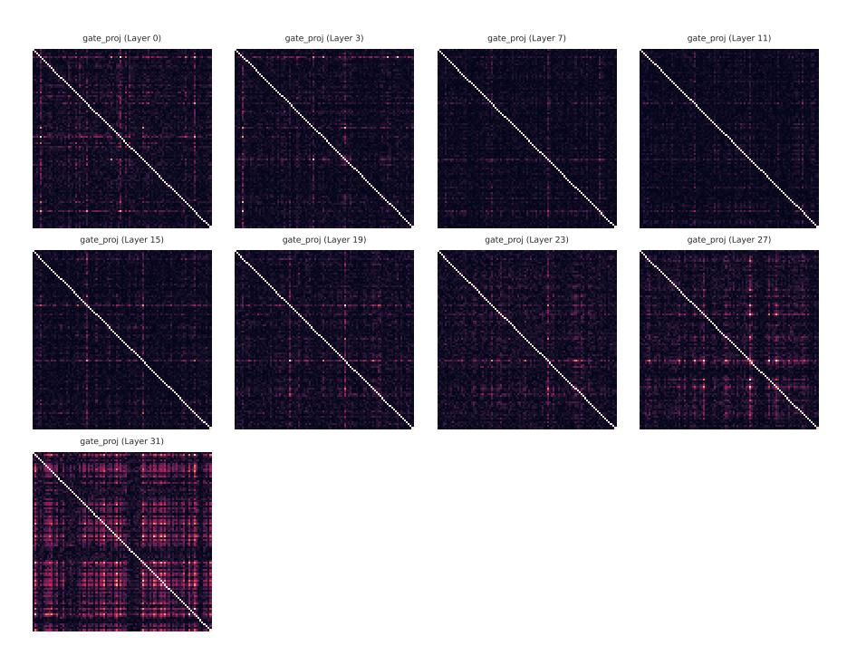

Figure 11: Normalized abs(RXX) of inputs of gate proj layers in LLaMA-3-8B. Note that the up proj shares the same inputs. Layers are sampled and only the first 96 dimensions are plotted for clarity.

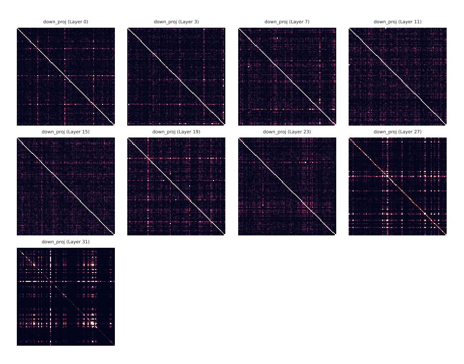

Figure 12: Normalized abs(RXX) of inputs of down proj layers in LLaMA-3-8B. Layers are sampled and only the first 96 dimensions are plotted for clarity.

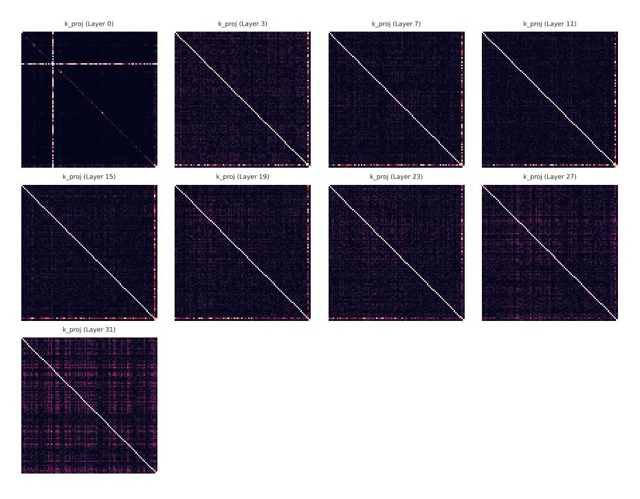

Figure 13: Normalized abs(RXX) of inputs of k proj layers in LLaMA-2-7B. Note that the q proj and v proj share the same inputs. Layers are sampled and only the first 96 dimensions are plotted for clarity.

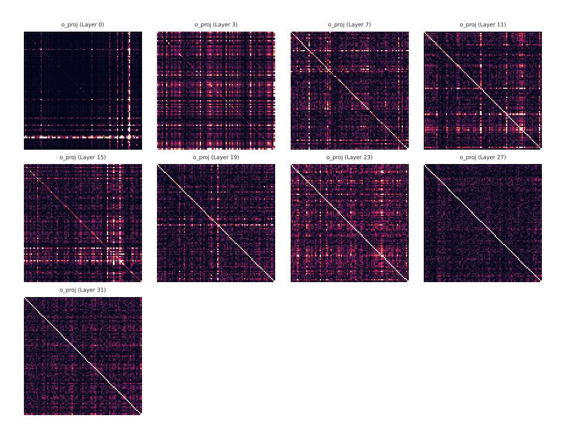

Figure 14: Normalized abs(RXX) of inputs of o proj layers in LLaMA-2-7B. Layers are sampled and only the first 96 dimensions are plotted for clarity.

Figure 15: Normalized abs(RXX) of inputs of gate proj layers in LLaMA-2-7B. Note that the up proj shares the same inputs. Layers are sampled and only the first 96 dimensions are plotted for clarity.

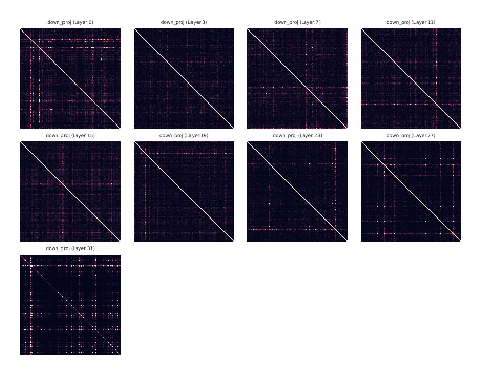

Figure 16: Normalized abs(RXX) of inputs of down proj layers in LLaMA-2-7B. Layers are sampled and only the first 96 dimensions are plotted for clarity.

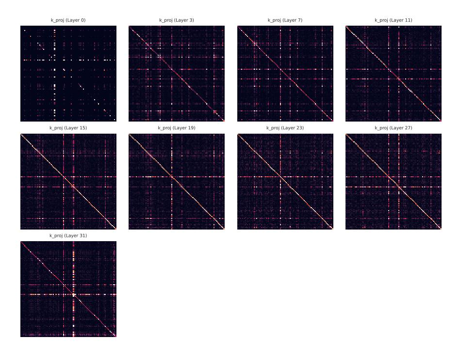

Figure 17: Normalized abs(RXX) of inputs of k proj layers in Mistral-7B-v0.3. Note that the q proj and v proj share the same inputs. Layers are sampled and only the first 96 dimensions are plotted for clarity.

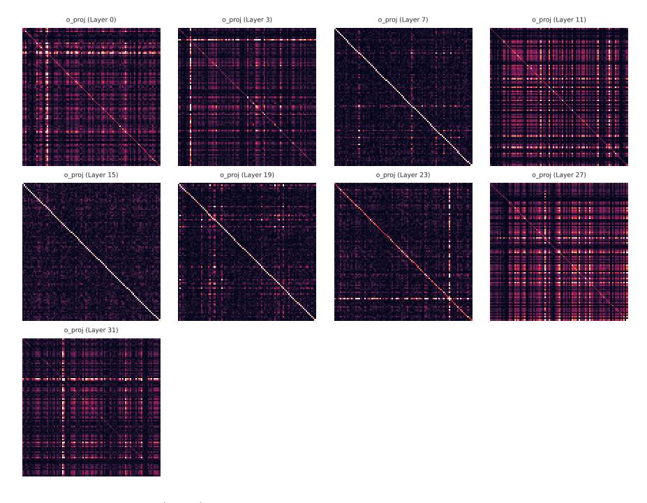

Figure 18: Normalized abs(RXX) of inputs of o proj layers in Mistral-7B-v0.3. Layers are sampled and only the first 96 dimensions are plotted for clarity.

Figure 19: Normalized abs(RXX) of inputs of gate proj layers in Mistral-7B-v0.3. Note that the up proj shares the same inputs. Layers are sampled and only the first 96 dimensions are plotted for clarity.

Figure 20: Normalized abs(RXX) of inputs of down proj layers in Mistral-7B-v0.3. Layers are sampled and only the first 96 dimensions are plotted for clarity.

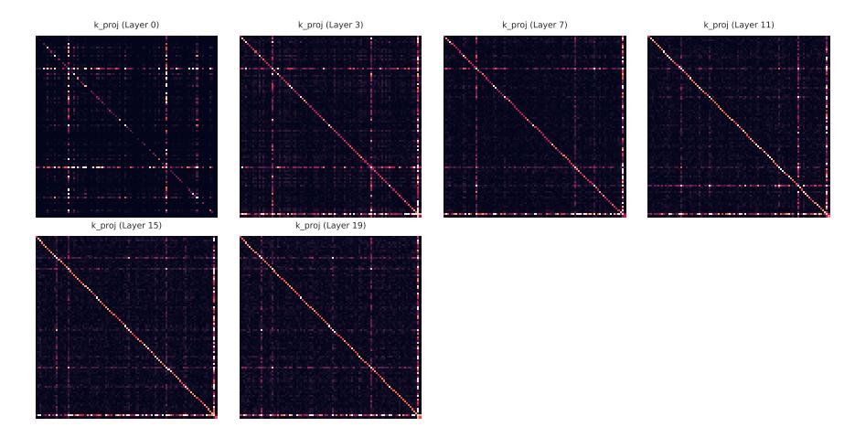

Figure 21: Normalized abs(RXX) of inputs of k proj layers in TinyLlama-1.1B. Note that the q proj and v proj share the same inputs. Layers are sampled and only the first 96 dimensions are plotted for clarity.

Figure 22: Normalized abs(RXX) of inputs of o proj layers in TinyLlama-1.1B. Layers are sampled and only the first 96 dimensions are plotted for clarity.

Figure 23: Normalized abs(RXX) of inputs of gate proj layers in TinyLlama-1.1B. Note that the up proj shares the same inputs. Layers are sampled and only the first 96 dimensions are plotted for clarity.

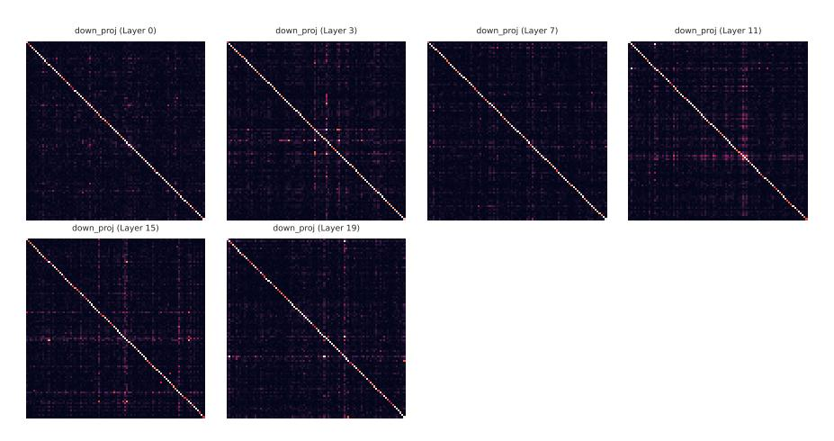

Figure 24: Normalized abs(RXX) of inputs of down proj layers in TinyLlama-1.1B. Layers are sampled and only the first 96 dimensions are plotted for clarity.