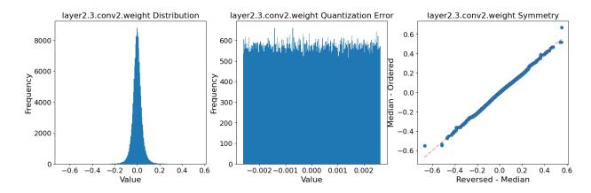

# 2.1.3. VISION TRANSFORMERS

Recent studies have increasingly utilized vision transformers for domain generalization [\(Sultana et al.,](#page-12-6) [2022\)](#page-12-6). Some approaches enhance vision transformers by integrating knowledge distillation [\(Hinton et al.,](#page-10-13) [2015\)](#page-10-13) and leveraging text modality from CLIP [\(Radford et al.,](#page-11-6) [2021\)](#page-11-6) to learn more domain-invariant features [\(Moayeri et al.,](#page-11-7) [2023;](#page-11-7) [Chen et al.,](#page-9-10) [2024;](#page-9-10) [Huang et al.,](#page-10-14) [2023;](#page-10-14) [Liu et al.,](#page-11-8) [2024;](#page-11-8) [Yu et al.,](#page-12-7) [2024;](#page-12-7) [Shu et al.,](#page-11-9) [2023;](#page-11-9) [Addepalli et al.,](#page-9-11) [2024\)](#page-9-11).

### 2.1.4. ENSEMBLING

Ensembling of deep networks [\(Lakshminarayanan et al.,](#page-10-15) [2017;](#page-10-15) [Hansen & Salamon,](#page-10-16) [1990;](#page-10-16) [Krogh & Vedelsby,](#page-10-17) [1995\)](#page-10-17) is a foundational strategy and has consistently proven to be robust in the past. Many works have been proposed to train multiple diverse models and combine them to obtain better in-domain accuracy and robustness to domain shifts [\(Arpit](#page-9-6) [et al.,](#page-9-6) [2022;](#page-9-6) [Thopalli et al.,](#page-12-8) [2021;](#page-12-8) [Mesbah et al.,](#page-11-10) [2022;](#page-11-10) [Li et al.,](#page-11-11) [2022;](#page-11-11) [Lee et al.,](#page-10-18) [2022;](#page-10-18) [Pagliardini et al.,](#page-11-12) [2023\)](#page-11-12). However, ensembles require multiple models to be stored

and a separate forward pass for each model, which increases the computational cost and memory footprint, especially if the models are large.

#### 2.1.5. WEIGHT AVERAGING

Combining or averaging weights from different training stages or models has emerged as a robust approach to improve OOD generalization (Wortsman et al., 2022b; Matena & Raffel, 2022; Wortsman et al., 2022a; Gupta et al., 2020; Choshen et al., 2022; Wortsman et al., 2021; Maddox et al., 2019; Benton et al., 2021; Cha et al., 2021; Jain et al., 2023; Ramé et al., 2023). Techniques like SWAD (Cha et al., 2021) leverage weight averaging to identify flat minima, reducing overfitting and enhancing generalization under distribution shifts. Similarly, DiWA (Rame et al., 2022b) combines weights from independently trained models to improve robustness through increased diversity.

Arpit et al. (2022) integrates ensembling with weight averaging, yielding superior performance compared to either method alone, albeit with significant memory and computational costs. To address these challenges, we demonstrate that quantization can improve generalization while reducing resource demands.

Although flatter minima are not universally indicative of better domain generalization (Andriushchenko et al., 2023), they remain a valuable tool for improving robustness in many scenarios. Moreover, recent findings (Mueller et al., 2023) highlight that selective application of SAM (Foret et al., 2021), such as restricting it to normalization layers, can further refine its effectiveness. The consistent empirical success of SAM underscores its reliability as a method for enhancing domain generalization, despite the nuanced relationship between flatness and performance across different settings.

#### 2.2. Model Quantization

Model quantization is used in deep learning to reduce the memory footprint and computational requirements of deep network. In a conventional neural network, the model parameters and activations are usually stored as high-precision floating-point numbers, typically 32-bit or 64-bit. The process of model quantization entails transforming these parameters into lower bit-width representations, such as 8-bit integers or binary values. Existing techniques fall into two main categories. Post-Training Quantization (PTQ) quantizes a pre-trained network using a small calibration dataset and is thus relatively simple to implement (Nagel et al., 2020; Li et al., 2021; Frantar et al., 2022; Zhao et al., 2019; Cai et al., 2020; Nagel et al., 2019; Shao et al., 2024; Lin et al., 2024; Chee et al., 2023; Li\* et al., 2025; Ramachandran et al., 2024; Shang et al., 2024; Zhang & Shrivastava, 2025). Quantization-Aware Training (QAT) retrains the

network during the quantization process and thus better preserves the model's full-precision accuracy. Yang et al. (2023); Esser et al. (2020); Zhou et al. (2017); Bhalgat et al. (2020); Yamamoto (2021); Yao et al. (2020); Shin et al. (2023). In the next section, we provide some background on quantization and on the method we will use in our approach. Our goal in this work is not to introduce a new quantization strategy but rather to demonstrate the impact of quantization on generalization.

#### 3. Domain Generalization by Quantization

We build our method on the simple ERM approach to show-case the effects of quantization on the training process and on the generalization to unseen data from a different domain. Despite the simplicity of this approach, we will show in Section 4.1 that it yields a significant accuracy boost on the test data from the unseen target domain. Furthermore, it stabilizes the behavior of the model on OOD data during training, making it similar to that on the in-domain data. In the remainder of this section, we focus on providing some insights on how quantization enhances DG.

#### 3.1. Quantization

Let w be a single model weight to be quantized, s the quantizer step size, and  $Q_N$  and  $Q_P$  the number of negative and positive quantization levels, respectively. We define the quantization process that computes  $\bar{w}$ , a quantized and integer scaled representation of the weights, as

$$\bar{w} = \lfloor clip(w/s, -Q_N, Q_P) \rceil, \tag{1}$$

where the function  $clip(k, r_1, r_2)$  is defined as

$$clip(k, r_1, r_2) = \begin{cases} \lfloor k \rceil & \text{if } r_1 < k < r_2 \\ r_1 & \text{if } k \le r_1 \\ r_2 & \text{if } k \ge r_2 \end{cases}$$
 (2)

Here,  $\lfloor k \rceil$  represents rounding k to nearest integer. If we quantize a weight to b bits, for unsigned data  $Q_N=0$  and  $Q_P=2^b-1$ , and for signed data  $Q_N=2^{b-1}$  and  $Q_P=2^{b-1}-1$ .

Note that the quantization process described in Eq. 1 yields a scaled value. A quantized representation of the data at the same scale as w can then be obtained as

$$w_q = \bar{w} \times s. \tag{3}$$

This transformation results in a discretized weight space that inherently introduces noise. We demonstrate generalization ability of QT-DoG with different quantization methods in section 4.1.3.

Figure 2. Distribution of Quantization Noise and Weights. We plot the weights(left), quantization noise(middle) and symmetry(right) of random layer in ResNet-50 model. We found KL-divergence to be **0.0009** between quantization noise and uniform distribution with same minimum and maximum value.

#### 3.2. Quantization as uniform noise

Quantization can be modeled as additive noise under certain assumptions (Gray & Neuhoff, 1998). The noise or error introduced by the quantizer is bounded within  $\left[-\frac{s}{2}, \frac{s}{2}\right]$  where s represents the quantization step size, as described in the previous section. When s is small relative to the dynamic range of the weight distribution, the quantization noise can be well approximated by a uniform distribution (Boncelet, 2009).

This observation is empirically validated in Figure 2, where we analyze the weight distribution of a randomly selected layer and apply 7-bit quantization. We then compute the Kullback-Leibler divergence (Kullback & Leibler, 1951) between the resulting quantization noise and a uniform distribution with the same minimum and maximum values, finding it to be very low. We extend this analysis in Appendix J across multiple layers, we observe that neural network weights generally tend to exhibit smooth and symmetric distributions, reinforcing the conclusion that quantization noise/error generally follows a uniform distribution. Prior works (Zhang et al., 2024; Murray & Edwards, 1992) show that adding noise to network weights can improve generalization, and similarly, quantization-aware training with structured uniform noise also enhances generalization.

#### 3.3. Quantization Leads to Flat Minima

In the literature (Rame et al., 2022b; Arpit et al., 2022; Krueger et al., 2021; Cha et al., 2021; Rame et al., 2022b; Foret et al., 2021), it has been established that a model's generalization ability can be increased by finding a flatter minimum during training. This is the principle we exploit in our work, but from the perspective of quantization, and provide an analytical view into how it contributes to achieving flatter minima. In practice, ERM can have several solutions with similar training loss values but different generalization ability. Even when the training and test data are drawn from the same distribution, the standard optimizers, such as SGD and Adam (Kingma & Ba, 2015), often lead to sub-optimal generalization by finding sharp and narrow minima (Keskar et al., 2017; Dziugaite & Roy, 2017; Garipov et al., 2018; Izmailov et al., 2018; Jiang et al., 2020; Foret et al., 2021).

This has been shown to be prevented by introducing noise in the model weights during training (An, 1996; Murray & Edwards, 1992; Goodfellow et al., 2016; Hochreiter & Schmidhuber, 1994). Here, we argue that quantization inherently induces such noise and thus helps to find flatter minima. Here, we argue that quantization inherently induces noise, which aids in finding flatter minima. To support this, we use a second-order Taylor series expansion to analyze how quantization-induced perturbations affect the curvature of the loss landscape, leading to flatter minima.

Let  $\hat{y_i} = f(x, w)$  represent the predicted output of the network f, which is parameterized by the weights w. A quantized network can then be represented as

$$f(\boldsymbol{x}, \boldsymbol{w}_q) = f(\boldsymbol{x}, \boldsymbol{w} + \Delta) = \hat{y_i}^q,$$

where  $w_q$  denotes the quantized weights and  $\hat{y_i}^q$  the corresponding prediction. The quantized weights can thus be thought of as introducing perturbations  $(\Delta)$  to the full-precision weights, akin to noise affecting the weights.

Such noise induced by the weight quantization can also be seen as a form of regularization, akin to more traditional methods. For small perturbations, (An, 1996; Murray & Edwards, 1992; Goodfellow et al., 2016) show that this type of regularization encourages the parameters to navigate towards regions of the parameter space where small perturbations of the weights have minimal impact on the output, i.e., flatter minima.

When noise is introduced via quantization, second-order Taylor series approximation of the loss function for the perturbed weights  $w + \Delta$  can be expressed as

$$\mathcal{L}(\boldsymbol{w} + \Delta) \approx \mathcal{L}(\boldsymbol{w}) + \nabla \mathcal{L}(\boldsymbol{w})^{\top} \Delta + \frac{1}{2} \Delta^{\top} \mathcal{H} \Delta,$$
 (4)

where  $\mathcal{L}(\boldsymbol{w})$  is the loss at the original weights  $\boldsymbol{w}$ ,  $\nabla L(\boldsymbol{w})$  is the gradient of the loss at  $\boldsymbol{w}$ , and  $\mathcal{H} = \nabla^2 L(\boldsymbol{w})$  is the Hessian matrix, which contains second-order partial derivatives of the loss function with respect to the weights, representing the curvature of the loss surface.

Eq. 4 shows how the quantization noise  $\Delta$  interacts with the curvature  $\mathcal{H}$  of the loss function. In regions with large curvature (sharp minima), the Hessian  $\mathcal{H}$  has large eigenvalues, and even small perturbations  $\Delta$  result in large increases in the loss (Dinh et al., 2017). In contrast, in flat regions (small eigenvalues of  $\mathcal{H}$ ), the loss remains nearly unchanged for small perturbations. Quantization noise acts as an implicit regularizer by introducing perturbations  $\Delta$  that disrupt the model's weight updates. In sharper minima, where the Hessian  $\mathcal{H}$  eigenvalues are large, small noise significantly increases the loss, causing the model to "escape" these regions and search for flatter, more stable minima. In flatter regions, where the Hessian  $\mathcal{H}$  eigenvalues are small, the noise has less impact, helping the model settle into these

Figure 3. Local Flatness Comparison: We plot the average training (left) and testing (right) local flatness  $\mathcal{F}\gamma(w)$  (Eq. 5) for ERM (Gulrajani & Lopez-Paz, 2021), SAM (Foret et al., 2021), SWA (Izmailov et al., 2018) and SWAD (Cha et al., 2021) by varying the radius  $\gamma$  on different domains of PACS. We evaluate the training flatness  $\mathcal{F}\gamma^S(w)$  on the seen domains (left) and the test flatness  $\mathcal{F}_\gamma^T(w)$  on the unseen domains (right).

regions with lower loss. This encourages convergence to solutions that are less sensitive to small changes in the input or model parameters, which is beneficial for out-of-distribution (OOD) generalization.

In the case of quantization-aware training, the induced noise  $\Delta$  is influenced by the quantization bin width or the quantizer step size s, and thus ranges between  $-\frac{s}{2}$  and  $+\frac{s}{2}$ . This s is directly dependent on the quantization levels or the bit-width chosen for weight quantization. As the number of bits per weight decreases, the amount of induced noise increases. Hence, the impact of the additional noise can be weighed by choosing an optimal bit-width. As will be shown in Section 4, certain bit-widths thus yield better and flatter minima that enhance generalization. However, if we induce too much noise(very low bit-precision), it introduces over-regularization. This excessive noise can overly restrict the search space, preventing the model from reaching a good solution. Instead, the optimization process may focus on minimizing the loss in a way that avoids sharp regions, but sacrifices the ability to find true minimum of the loss function. This is also evident in Table 10 in the appendix.

Moreover, Rissanen (1978); Hochreiter & Schmidhuber (1997) show that a flatter minimum corresponds to a low complexity network and requires fewer bits of information per weight. More importantly, Hochreiter & Schmidhuber (1997) demonstrates the importance of the bit-precision of the network weights and adds a regularization term in the loss function that seeks to lower the weight bit-precision to lead to flatter minima. Here, by using quantization, we are explicitly reducing bit-precision of the network weights, thus achieving the same goal.

