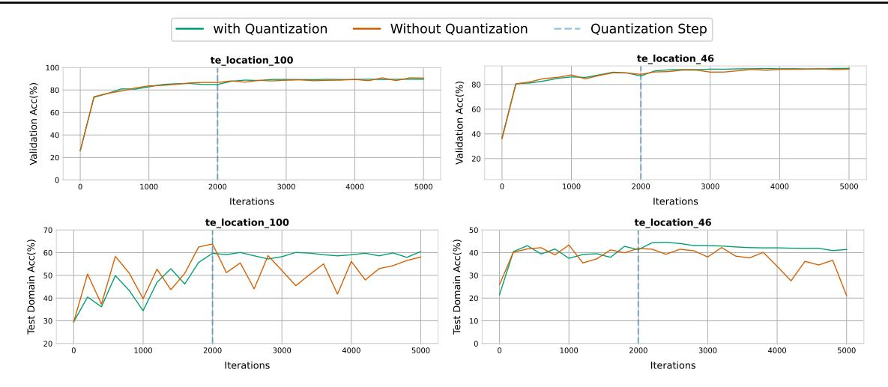
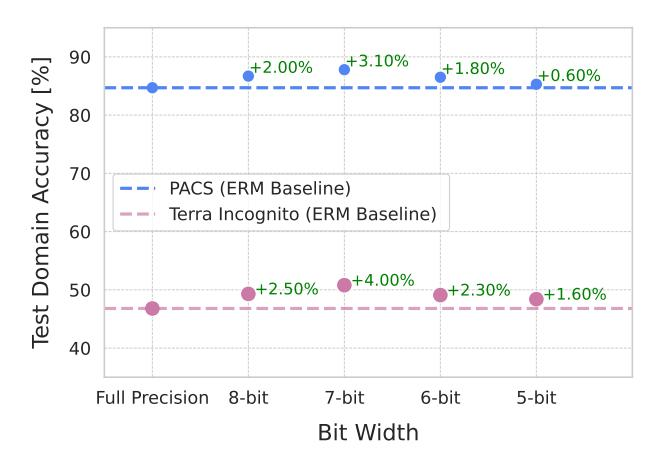
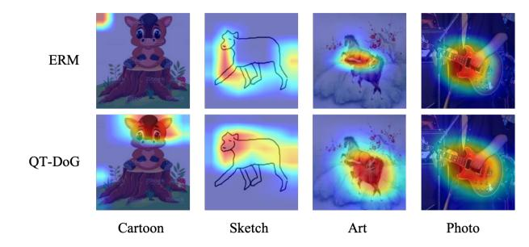

# 3.4. Empirical Analysis of Quantization-aware Training and Flatness

In this section, we demonstrate that a flatter minimum is reached when incorporating quantization in the ERM process. Similar to (Dinh et al., 2017; Cha et al., 2021), we interpret flat minima as "a large connected region in weight space where the error remains approximately constant," as defined by (Hochreiter & Schmidhuber, 1997). Our loss flatness analysis shows that QT-DoG can find a flatter minimum in comparison to not only ERM but also SAM (Foret et al., 2021) and SWA (Izmailov et al., 2018).

Following the approach in Cha et al. (2021), we quantify local flatness  $\mathcal{F}_{\gamma}(\boldsymbol{w})$  by measuring the expected change in loss values between a model with parameters  $\boldsymbol{w}$  and a perturbed model with parameters  $|\boldsymbol{w}'| = |\boldsymbol{w}| + \gamma$ , where  $\boldsymbol{w}'$  lies on a sphere of radius  $\gamma$  centered at  $\boldsymbol{w}$ . This is expressed as

$$\mathcal{F}_{\gamma}(\boldsymbol{w}) = \mathbb{E}_{\|\boldsymbol{w}'\|}[\mathcal{E}(\boldsymbol{w}') - \mathcal{E}(\boldsymbol{w})], \tag{5}$$

where  $\mathcal{E}(w)$  denotes the accumulated loss over the samples of potentially multiple domains.

For our analysis, we will evaluate flatness in both the source domains and the target domain, and thus  $\mathcal{E}(w)$  is evaluated using either source samples or target ones accordingly.

As in Cha et al. (2021), we approximate  $\mathcal{F}_{\gamma}(w)$  by Monte-Carlo sampling with 100 samples. In Figure 3, we compare the  $\mathcal{F}_{\gamma}(w)$  of QT-DoG to that of ERM (Gulrajani & Lopez-Paz, 2021), SAM (Foret et al., 2021), SWA (Izmailov et al., 2018) and SWAD (Cha et al., 2021) for different radii  $\gamma$ . QT-DoG not only finds a flatter minimum than ERM, SAM and SWA but also yields a comparable flatness to SWAD's despite being 75% smaller in model size.

#### 3.5. Stable Training Process

Here, we demonstrate the robustness of out-of-domain performance to model selection using the in-domain validation set. Specifically, we seek to show that accuracy on the indomain validation data is a good measure to pick the best model for out-of-domain distribution. Therefore, we assume that during training, the model selection criterion based on

Figure 4. Model Quantization improves out-of-domain performance as well as training stability. The plots were computed using the TerraInc dataset with domain L100 (left) and L46 (right) as test domain, and the other domains as training/validation data. The top two plots illustrate in-domain validation accuracy, while the bottom two represent out-of-domain test accuracy. The network used for these plots was a ResNet-50. For our quantized models, shown in blue in each plot, we quantized the model after 2000 steps. Note that the model accuracy is not only better with quantization but also much more stable for out of distribution data after the quantization step.

this validation data can select the best model for the OOD data even if the model starts to overfit. In other words, it is expected that the out-of-domain evaluation at each point of the training phase should improve or rather stay stable if the model is close to overfitting to the in-domain data. For these experiments, we use the TerraIncognita dataset (Beery et al., 2018) and consider the same number of iterations as for the DomainBed protocol (Gulrajani & Lopez-Paz, 2021).

As can be seen in Figure 4, vanilla ERM (without quantization) quickly overfits to the in-domain validation/training dataset. That is, the OOD performance is highly unstable during the whole training process. By contrast, our quantized model is much more stable. Specifically, we quantize our model at 2000 steps, and it can be seen that the model performance on out-of-domain distribution is also unstable before that. Once the model weights are quantized, we see a regularization effect and the performance becomes much more stable on the OOD data. We provide training plots encompassing different domains as target settings for the sake of completeness. This inclusion serves to illustrate that quantization genuinely enhances stability in the training process. On the left, "te\_location\_100" is considered as target domain while "te\_location\_46" is used as the target domain for the plot on the right. These experiments evidence that model selection based on the in-domain validation set is much more reliable when introducing quantization into training.

#### 3.6. Ensembles of Quantization

For our ensemble creation, we train multiple models independently from initialization, using random seeds to ensure diversity and, incorporate quantization into the training process to obtain smaller quantized models. We refer to this as the Ensemble of Quantization (EoQ). As Breiman (1996), we use the bagging method to combine the multiple predictions. Therefore, the class predicted by EoQ for an input x is given by

is given by  $\hat{y} = \arg\max_k \operatorname{Softmax} \left( \frac{1}{E} \sum_{i=1}^{E} f(\mathbf{x}; \boldsymbol{w}_q^i) \right) \tag{6}$  where E is the total number of models in the ensemble,  $\boldsymbol{w}_q^i$  denotes the parameters of the  $i^{th}$  quantized model, and the subscript k denotes the  $k^{th}$  element of the vector argument. Finally, we use the in-domain validation set performance to pick the best model state (weights)  $\boldsymbol{w}_q^i$  of the  $i^{th}$  quantized model used in the ensemble.

#### 4. Experiments

We evaluate our approach on diverse datasets from Domainbed and WILDS (Koh et al., 2021) Benchmark. All implementation, datasets, metric details and various ablation studies are provided in the Appendix.

#### 4.1. Results

In this section, we demonstrate the superior performance of our proposed approach by comparing it to recent state-of-the-art DG methods. We also present some visual evidence for the better performance of our quantization approach. Furthermore, we show how quantization not only enhances model generalization but also yields better performance on in-domain data.

#### 4.1.1. COMPARISON WITH DG METHODS

Table 1 reports out-of-domain performances on five DG benchmarks and compares our proposed approaches to prior

Table 1. Comparison with domain generalization methods. Performance benchmarking on 5 datasets of the DomainBed benchmark. Highest accuracy is shown in bold, while second best is underlined. † do not report confidence interval and ensembles do not have confidence interval because an ensemble uses all the models to make a prediction. Our proposed method is colored in Gray. Average accuracies and standard errors are reported from three trials. For all the reported results, we use the same training-domain validation protocol as [\(Gulrajani & Lopez-Paz,](#page-10-10) [2021\)](#page-10-10). Models indicate the number of models trained, and Size represents the relative network size.

| Algorithm     | Models                                              | Size  | PACS       | VLCS       | Office                | TerraInc   | DomainNet  | Avg. |  |
|---------------|-----------------------------------------------------|-------|------------|------------|-----------------------|------------|------------|------|--|
|               | ResNet-50 (25M Parameters, Pre-trained on ImageNet) |       |            |            |                       |            |            |      |  |
| ERM           | 1                                                   | 1x    | 84.7 ± 0.5 | 77.4 ± 0.3 | 67.5 ± 0.5            | 46.2 ± 0.4 | 41.2 ± 0.2 | 63.8 |  |
| IRM           | 1                                                   | 1x    | 84.4 ± 1.1 | 78.1 ± 0.0 | 66.6 ± 1.0            | 47.9 ± 0.7 | 35.7 ± 1.9 | 62.5 |  |
| Group DRO     | 1                                                   | 1x    | 84.1 ± 0.4 | 77.2 ± 0.6 | 66.9 ± 0.3            | 47.0 ± 0.3 | 33.7 ± 0.2 | 61.8 |  |
| Mixup         | 1                                                   | 1x    | 84.3 ± 0.5 | 77.7 ± 0.4 | 69.0 ± 0.1            | 48.9 ± 0.8 | 39.6 ± 0.1 | 63.9 |  |
| MLDG          | 1                                                   | 1x    | 84.8 ± 0.6 | 77.1 ± 0.4 | 68.2 ± 0.1            | 46.1 ± 0.8 | 41.8 ± 0.4 | 63.6 |  |
| CORAL         | 1                                                   | 1x    | 86.0 ± 0.2 | 77.7 ± 0.5 | 68.6 ± 0.4            | 46.4 ± 0.8 | 41.8 ± 0.2 | 64.1 |  |
| MMD           | 1                                                   | 1x    | 85.0 ± 0.2 | 76.7 ± 0.9 | 67.7 ± 0.1            | 49.3 ± 1.4 | 39.4 ± 0.8 | 63.6 |  |
| Fish          | 1                                                   | 1x    | 85.5 ± 0.3 | 77.8 ± 0.3 | 68.6 ± 0.4            | 45.1 ± 1.3 | 42.7 ± 0.2 | 63.9 |  |
| Fishr         | 1                                                   | 1x    | 85.5 ± 0.4 | 77.8 ± 0.1 | 67.8 ± 0.1            | 47.4 ± 1.6 | 41.7 ± 0.0 | 65.7 |  |
| SWAD          | 1                                                   | 1x    | 88.1 ± 0.4 |            | 79.1 ± 0.4 70.6 ± 0.3 | 50.0 ± 0.4 | 46.5 ± 0.2 | 66.9 |  |
| MIRO          | 1                                                   | 1x    | 85.4 ± 0.4 | 79.0 ± 0.0 | 70.5 ± 0.4            | 50.4 ± 1.1 | 44.3 ± 0.2 | 65.9 |  |
| CCFP          | 1                                                   | 1x    | 86.6 ±0.2  | 78.9 ±0.3  | 68.9 ±0.1             | 48.6 ±0.4  | 41.2 ± 0.0 | 64.8 |  |
| ARM†          | 1                                                   | 1x    | 85.1       | 77.6       | 64.8                  | 45.5       | 35.5       | 61.7 |  |
| VREx†         | 1                                                   | 1x    | 84.9       | 78.3       | 66.4                  | 46.4       | 33.6       | 61.9 |  |
| RSC†          | 1                                                   | 1x    | 85.2       | 77.1       | 65.5                  | 46.6       | 38.9       | 62.7 |  |
| Mixstyle†     | 1                                                   | 1x    | 85.2       | 77.9       | 60.4                  | 44.0       | 34.0       | 60.3 |  |
| SagNet†       | 1                                                   | 1x    | 86.3       | 77.8       | 68.1                  | 48.6       | 40.3       | 64.2 |  |
| QT-DoG (ours) | 1                                                   | 0.22x | 87.8± 0.3  | 78.4± 0.4  | 68.9± 0.6             | 50.8± 0.2  | 45.1±0.9   | 66.2 |  |
| ERM Ens. †    | 6                                                   | 6x    | 87.6       | 78.5       | 70.8                  | 49.2       | 47.7       | 66.8 |  |
| DiWA†         | 60                                                  | 1x    | 89.0       | 78.6       | 72.8                  | 51.9       | 47.7       | 68.0 |  |
| EoA†          | 6                                                   | 6x    | 88.6       | 79.1       | 72.5                  | 52.3       | 47.4       | 68.0 |  |
| DART          | 4-6                                                 | 4x-6x | 78.5 ± 0.7 | 87.3 ± 0.5 | 70.1 ± 0.2            | 48.7 ± 0.8 | 45.8 ± 0.0 | 66.1 |  |
| EoQ (ours)†   | 5                                                   | 1.1x  | 89.3       | 79.5       | 72.3                  | 53.2       | 47.9       | 68.4 |  |

works. These results demonstrate the superiority of EoQ across five DomainBed datasets, with an average improvement of 0.4% over the state-of-the-art EoA while reducing the memory footprint by approximately 75%. Compared to DiWA, we significantly reduce the computational burden and memory requirements for training, achieving a 12-fold reduction, as DiWA requires training 60 models for diverse averaging. EoQ achieves the most significant gain (7% improvement) on TerraIncognita [\(Beery et al.,](#page-9-22) [2018\)](#page-9-22), with nonetheless substantial gains of 3-5% w.r.t. ERM on PACS [\(Li et al.,](#page-10-27) [2017\)](#page-10-27) and DomainNet [\(Peng et al.,](#page-11-25) [2019\)](#page-11-25).

The results also demonstrate that simply introducing quantization into the ERM-based approach [\(Gulrajani & Lopez-](#page-10-10)[Paz,](#page-10-10) [2021\)](#page-10-10) surpasses or yields comparable accuracy to many existing works, although the size and computational budget of our quantization-based approach is significantly lower than that of the other methods. For our results in Table [1](#page-6-0) and Figure [1,](#page-0-0) we employed 7-bit quantization on the network. Therefore, as shown in Figure [1,](#page-0-0) the model size is drastically reduced, becoming more than 4 times smaller than the other methods. Being smaller in memory footprint, our quantization-based approach can utilize ensembling without increasing the memory storage and computational resources.

Table 2. Combination with other methods. Results of PACS and Terra Incognita datasets incorporating QT-DoG with CORAL and MixStyle. C represents the compression factor of the model.

| Algorithm         | PACS       | TerraInc   | C    |
|-------------------|------------|------------|------|
| CORAL             | 85.5 ± 0.6 | 47.1 ± 0.2 | -    |
| CORAL + QT-DoG    | 86.9 ± 0.2 | 50.6 ± 0.3 | 4.6x |
| MixStyle          | 85.2 ± 0.3 | 44.0 ± 0.4 | -    |
| MixStyle + QT-DoG | 86.8 ± 0.3 | 47.7 ± 0.2 | 4.6x |

Moreover, quantization not only reduces the memory footprint but also the latency of the model. For example, running a ResNet-50 model on an AMD EPYC 7302 processor yields a latency of 34.28ms for full-precision and 21.02ms for our INT8 quantized model.

#### 4.1.2. COMBINATIONS WITH OTHER METHODS

Since QT-DoG requires no modifications to training procedures or model architectures, it is universally applicable and can seamlessly integrate with other DG methods. As shown in Table [2,](#page-6-1) we integrate QT-DoG with CORAL [\(Sun et al.,](#page-12-3) [2016\)](#page-12-3) and MixStyle [\(Zhou et al.,](#page-12-19) [2021\)](#page-12-19). Both CORAL and MixStyle demonstrate improved performance when com-

Table 3. Comparison between ERM and QT-DoG on the Amazon and Camelyon datasets. We report the in-domain and out-of-domain accuracy with respective metrics as shown. C represents the compression factor of the model.

| Dataset  | Method | In-dist    | Out-dist   | C    | Metric              |
|----------|--------|------------|------------|------|---------------------|
| Amazon   | ERM    | 71.9 ± 0.1 | 53.8 ± 0.8 | -    | 10th percentile acc |
| Amazon   | QT-DoG | 79.2 ± 0.5 | 55.9 ± 0.6 | 4.6x | 10th percentile acc |
| Camelyon | ERM    | 93.2 ± 5.2 | 70.3 ± 6.4 | -    | Average acc         |
| Camelyon | QT-DoG | 96.4 ± 2.1 | 78.4 ± 2.2 | 4.6x | Average acc         |

Table 4. Model quantization with different quantization algorithms. We report the average target domain accuracy and the average source domain accuracy across all domains in PACS.

| Algorithm | Type | In-domain  | Out-domain |
|-----------|------|------------|------------|
| No quant  | -    | 96.6 ± 0.2 | 84.7 ± 0.5 |
| OBC       | PTQ  | 96.8 ± 0.2 | 83.7 ± 0.4 |
| INQ       | QAT  | 97.1 ± 0.2 | 87.4 ± 0.3 |
| LSQ       | QAT  | 97.3 ± 0.2 | 87.8 ± 0.3 |

bined with QT-DoG, reinforcing our findings that QAT aids in identifying flat minima, thereby enhancing DG.

#### 4.1.3. DIFFERENT QUANTIZATION METHODS

In this section, we perform an ablation study by replacing LSQ [\(Esser et al.,](#page-9-18) [2020\)](#page-9-18) with other quantization algorithms. We use INQ [\(Zhou et al.,](#page-12-15) [2017\)](#page-12-15) as another quantizationaware training method but also perform quantization using OBC [\(Frantar et al.,](#page-9-15) [2022\)](#page-9-15), that uses a more popular posttraining quantization (PTQ) approach to quantize a network. We perform this ablation study on the PACS dataset, and the results are shown in Table [4.](#page-7-1) All the experiments are performed with 7-bit quantization. We observe that, while the QAT approaches tend to enhance generalization, the PTQ approach fails to do so. This is due to the fact that there is no training involved after the quantization step in PTQ. That is, with PTQ, we do not train the network with quantization noise to find a flatter minimum.

#### 4.1.4. RESULTS ON WILDS DATASET

We performed experiments with 7 bit quantization on two datasets from the WILDS benchmark [\(Koh et al.,](#page-10-11) [2021\)](#page-10-11). We utilized the same experimental settings as outlined in the WILDS benchmark repository and incorporated quantization into the training process. The results presented in Table [3](#page-7-2) confirm our findings on Domainbed benchmark. We used the same BERT model [\(Sanh et al.,](#page-11-26) [2019\)](#page-11-26) as in WILDS [\(Koh et al.,](#page-10-11) [2021\)](#page-10-11). These results highlight that QT-DoG generalizes well across both architectural variations and input modalities, including text.

#### 4.1.5. GENERALITY WITH VISION TRANSFORMER

In Table [5,](#page-7-3) we present the results of quantizing a vision transformer (ERM-ViT, DeiT-small) [\(Sultana et al.,](#page-12-6) [2022\)](#page-12-6) for domain generalization. We compare the performance of the

Table 5. Quantization of a Vision Transformer Comparison of performance on PACS and TerraInc datasets with and without QT-DoG quantization of ERM\_ViT [\(Sultana et al.,](#page-12-6) [2022\)](#page-12-6) with DeiT-Small backbone.

| Algorithm        | PACS       | TerraInc   | Compression |
|------------------|------------|------------|-------------|
| ERM_ViT          | 84.3 ± 0.2 | 43.2 ± 0.2 | -           |
| ERM-SD_ViT       | 86.3 ± 0.2 | 44.3 ± 0.2 | -           |
| ERM_ViT + QT-DoG | 86.2 ± 0.3 | 45.6 ± 0.4 | 4.6x        |

Figure 5. Bit precision analysis for efficient quantization. We show results on out-of-domain test accuracy with two different datasets, i.e., PACS and TerraIncognita. For each bit precision, we report the increase in the test domain accuracy averaged across all domains. The 7-bit quantized model exhibits the maximum increase for both datasets. We quantize the model at 2000 steps.

baseline ERM-ViT to its quantized counterpart on the PACS and Terra Incognita datasets, demonstrating QT-DoG's effectiveness across different architectures. The results clearly show that QT-DoG also improves the performance of vision transformers.

#### 4.1.6. BIT PRECISION ANALYSIS

Here, we empirically analyze the effect of different bitprecisions for quantization on the generalization of the model. We perform experiments with four different bit levels and present an analysis in Figure [5](#page-7-4) on the PACS [\(Li](#page-10-27) [et al.,](#page-10-27) [2017\)](#page-10-27) and TerraIncognita [\(Beery et al.,](#page-9-22) [2018\)](#page-9-22) datasets. We report the test domain accuracy averaged across all domains. For both datasets, 7-bit precision was found to be the

Table 6. Performance comparison with CLIP-based methods. We report accuracy on DomainNet, TerraIncognita, and Office datasets, as well as the average performance (AVG). QT-DoG achieves competitive accuracy while offering substantial compression.

| Algorithm | Backbone | DomainNet  | TerraInc   | Office     | Avg. | C    |
|-----------|----------|------------|------------|------------|------|------|
| ERM       | CLIP     | 59.9 ± 0.1 | 60.9 ± 0.2 | 83.0 ± 0.1 | 67.9 | -    |
| CLIPood   | CLIP     | 63.5 ± 0.1 | 60.5 ± 0.4 | 87.0 ± 0.1 | 70.3 | -    |
| QT-DoG    | CLIP     | 63.1 ± 0.2 | 61.9 ± 0.3 | 86.7 ± 0.2 | 70.6 | 4.6x |

Figure 6. GradCAM visualization for ERM [\(Gulrajani &](#page-10-10) [Lopez-Paz,](#page-10-10) [2021\)](#page-10-10) and QT-DoG. We show results on the PACS dataset [\(Li et al.,](#page-10-27) [2017\)](#page-10-27) and consider a different domain as test domain in each run, indicated by the different columns.

optimal bit precision to have the best out-of-domain generalization while maintaining in-domain accuracy. Nonetheless, 8 bits and 6 bits also show improvements, albeit smaller than with 7-bit quantization. These results evidence that, even with a 6 times smaller model, quantization still yields better out-of-domain performance without sacrificing the in-domain accuracy.

#### 4.1.7. GENERALITY WITH CLIP-BASED METHODS

We compare QT-DoG with existing CLIP-based domain generalization methods using the ViT-B/16 backbone to maintain consistency in architecture. As shown in the table below, QT-DoG achieves higher average accuracy than both ERM [\(Gulrajani & Lopez-Paz,](#page-10-10) [2021\)](#page-10-10) and CLIPood [\(Shu](#page-11-9) [et al.,](#page-11-9) [2023\)](#page-11-9) across the DomainNet, TerraIncognita, and Office datasets. It provides a 0.3 percent improvement over the best baseline, CLIPood. Importantly, this performance gain comes with a 4.6 times reduction in model size, showing that QT-DoG improves both generalization and efficiency.

#### 4.2. Visualizations

In Figure [6,](#page-8-0) we present some of the examples[1](#page-8-1) from the PACS dataset and show GradCAM [\(Gildenblat & contrib](#page-10-28)[utors,](#page-10-28) [2021\)](#page-10-28) results in the target domain. We perform four different experiments by considering a different target domain for each run, while utilizing the other domains for training. We use the output from the last convolutional layer

of the models with and without quantization. These visualizations evidence that quantization focuses on better regions than ERM, and with a much larger receptive field. In certain cases, ERM does not even focus on the correct image region. It is quite evident that quantization pushes the model to learn more generalized patterns, leading to a model that is less sensitive to the specific details of the training set.

