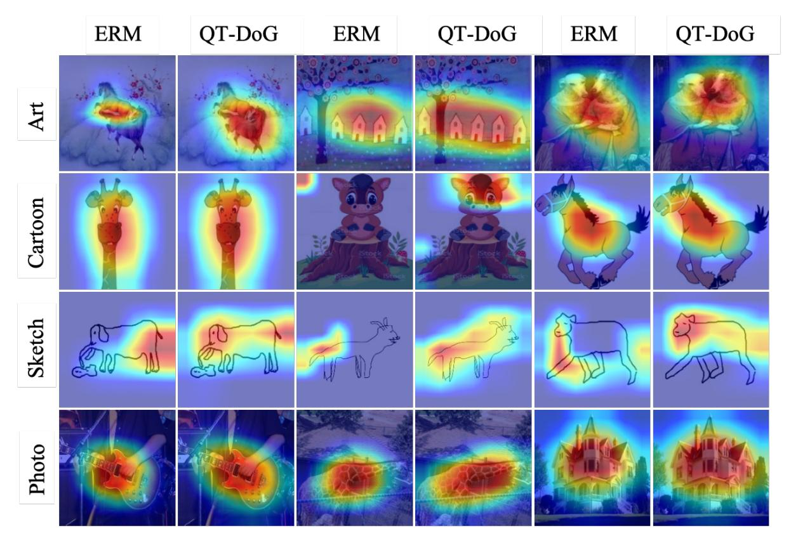

# K. Visualization

#### More GradCAM Results

In Figure [9,](#page-20-0) [10,](#page-21-0) [11,](#page-22-0) [12,](#page-23-0) we present some of the examples from the Terra dataset and show GradCAM [\(Gildenblat &](#page-10-28) [contributors,](#page-10-28) [2021\)](#page-10-28) results on the target domain. We use the output from the last convolutional layer of the models with and without quantization for GradCAM. Similar to our experiments on PACS dataset, we perform four different experiments by considering a different target domain for each run, while utilizing the other domains for training. Both models are trained with the similar settings as [\(Gulrajani & Lopez-Paz,](#page-10-10) [2021\)](#page-10-10). For quantization method, we quantized the model after 2000 iteration and employ 7 bit-precision as it provides the best out-of-domain performance. Moreover, we present some more examples for PACS dataset in Figure [7.](#page-17-1)

These visualizations further proves that quantization pushes the model to be less sensitive to the specific details of the training set.

Figure 7. GradCAM visualization for ERM [\(Gulrajani & Lopez-Paz,](#page-10-10) [2021\)](#page-10-10) and QT-DoG. We show results on the PACS dataset [\(Li](#page-10-27) [et al.,](#page-10-27) [2017\)](#page-10-27) and consider a different domain as test domain in each run, indicated by the different rows in the figure.

