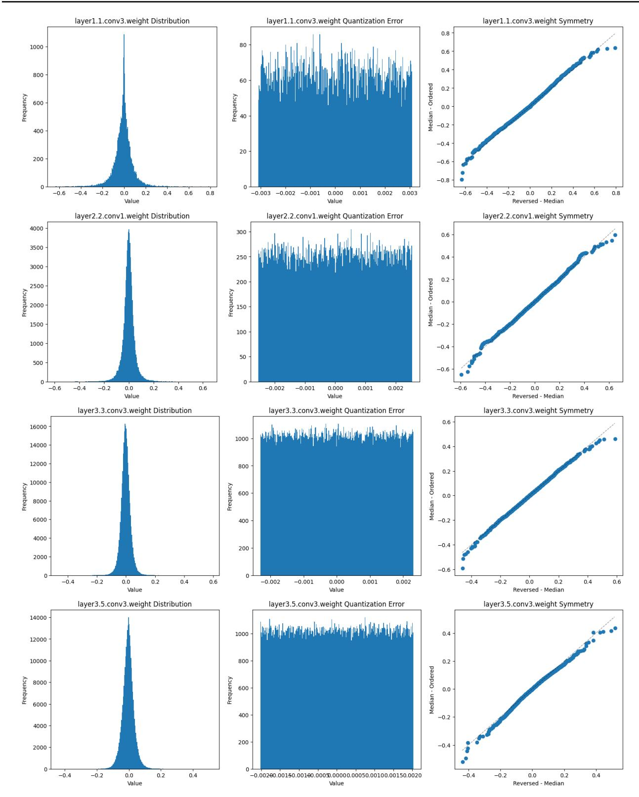
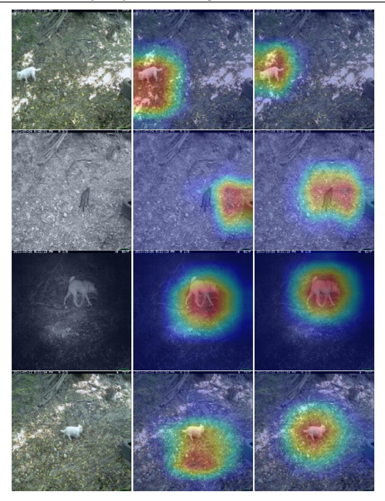
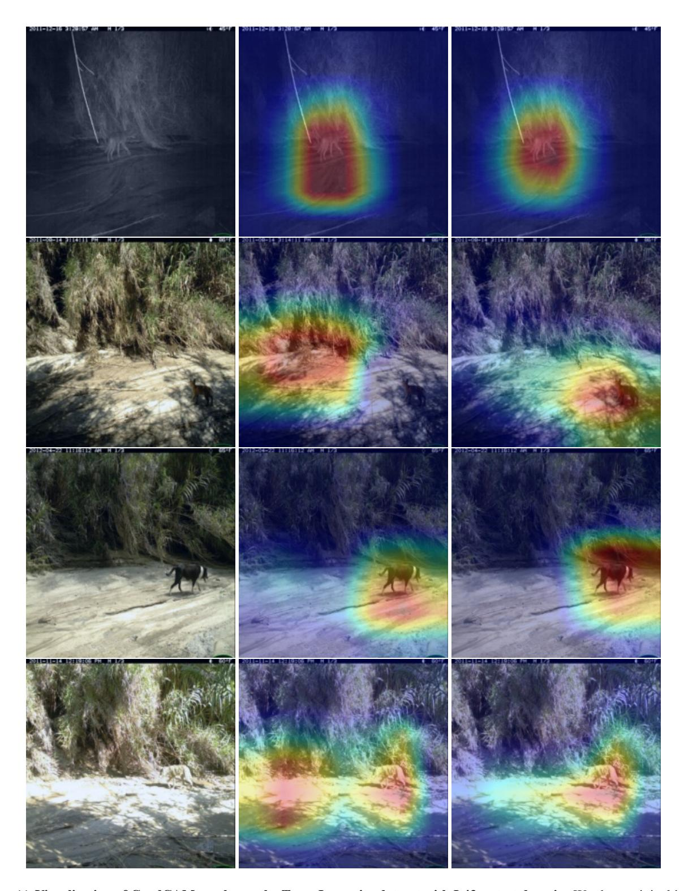

# M. Reproducibility

To guarantee reproducibility, we will provide the source code publicly along with the details of the environments and dependencies. We will also provide instructions to reproduce the main results of Table 1 in the main paper. Furthermore, we will also share instructions and code to plot the loss surfaces and GradCAM results.

Every experiment in our work was executed on a single NVIDIA A100, Python 3.8.16, PyTorch 1.10.0, Torchvision 0.11.0, and CUDA 12.1.

Figure 8. Distribution of Quantization Noise and Weights. We plot the weights(left), quantization noise(middle) and symmetry(right) of various layers in ResNet-50 model. We found KL-divergence to be [Top {0.0061, 0.004, 00069, 0.00054} Bottom] between quantization noise and uniform distribution with same minimum and maximum value.

Figure 9. Visualization of GradCAM results on the Terra Incognito dataset with L38 as test domain. We show original image, GradCAM with ERM [\(Gulrajani & Lopez-Paz,](#page-10-10) [2021\)](#page-10-10) and GradCAM with QT-DoG [Left to Right].

Figure 10. Visualization of GradCAM results on the Terra Incognito dataset with L46 as test domain. We show original image, GradCAM with ERM [\(Gulrajani & Lopez-Paz,](#page-10-10) [2021\)](#page-10-10) and GradCAM with QT-DoG [Left to Right].

Figure 11. Visualization of GradCAM results on the Terra Incognito dataset with L43 as test domain. We show original image, GradCAM with ERM [\(Gulrajani & Lopez-Paz,](#page-10-10) [2021\)](#page-10-10) and GradCAM with QT-DoG [Left to Right].

Figure 12. Visualization of GradCAM results on the Terra Incognito dataset with L100 as test domain. We show original image, GradCAM with ERM [\(Gulrajani & Lopez-Paz,](#page-10-10) [2021\)](#page-10-10) and GradCAM with QT-DoG [Left to Right].