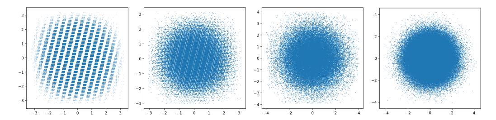

# 3 QTIP

Quantizing with TCQ requires storing both the codebook  $(2^L \times V)$  and trellis structure  $(2^L \times 2^{kV})$  during inference. These components are too large for fast inference when  $L \gtrsim 12$ , which is necessary for high quality. Furthermore, for a generic trellis, recovering the state (and so the decoded value) at step tth requires a graph walk using the first kt bits: this prevents parallel decoding. QTIP solves these problems with a novel combination of incoherence processing, a hardware-efficient "bitshift trellis," and fast compute-based random Gaussian codes. Incoherence processing makes W approximatelly i.i.d Gaussian, which reduces quantization to Gaussian source coding. The bitshift trellis removes needing to store the trellis structure during decoding and also enables parallel decoding. Finally, the fast compute-based random Gaussian codes remove the need to store the full codebook, completing the equation for fast inference. On the quality side, the fast random Gaussian codes enable the simple bitshift trellis to match complicated trellises and achieve state-of-the-art quantization quality.

The main focus of QTIP is on *what to quantize with* (i.e. TCQ) and not *how to quantize* (e.g. adaptive rounding or descent methods). The general construction of QTIP can be used as a drop-in replacement for VQ in any rounding framework. In the following sections, we first describe the "bitshift" trellis (Section 3.1). Then, we describe a series of fast compute-based codes for i.i.d Gaussian sources, aligning with different types of hardware (Sections 3.1.1 and 3.1.2). Finally, we give an approximation for the tail-biting trellis problem, which lets us more efficiently load weights in hardware (Section 3.2).

#### <span id="page-3-0"></span>3.1 "Bitshift" Trellis and Codebook Design

The bitshift trellis was introduced by Mao and Gray [22] as part of the "random permutation trellis coder" (RPTC). In the bitshift trellis, node i has an edge to node j if  $\exists c \in \mathbb{Z}, 0 \leq c < 2^{kV}$ , s.t.  $j = (i2^{kV} \mod 2^L) + c$ . Essentially, the top L - kV bits of j equal the bottom L - kV bits of i. This means that the first group of V weights depends only on the bits at positions  $\{1, 2, \ldots, L\}$ , the second only on bit positions  $\{kV + 1, kV + 2, \ldots, kV + L\}$ , and in general the tth on bit positions  $\{(t-1)kV + 1, \ldots, (t-1)kV + L\}$ . During inference, obtaining the next compressed group of V weights in a sequence only requires bitshifting by kV bits, which is supported on virtually all hardware. Furthermore, since each group of V weights only depends on a contiguous window of V bits in V0, decoding can be parallelized. Figure 2 shows a simple V1 bit, and storing the quantized length V2 bits indeed only requires 6 bits (plus the initial state).

Quantizing an i.i.d. source with the bitshift trellis is nontrivial because neighboring groups of weights sharing many bits can potentially lead to strong correlations (Figure 3 LL). The RPTC permutes


<span id="page-4-2"></span>Figure 2: A bitshift trellis code with L=2, k=1, V=1. Nodes 0, 1, 2, and 3 have code values 0.5, 0.1, 0.8, and 0.3, respectively. Each node can only transition to the  $2^{kV}=2$  nodes that share their top L-kV=1 bit with its bottom L-kV=1 bit. In this example,  $\hat{S}$  can be stored as 0010110.  $\hat{S}$  is also *tail-biting*, so the last L-kV=1 bits can be dropped to give  $\hat{S}=001011$ .

<span id="page-4-0"></span>Table 1: QTIP's compute-based codes (1MAD, 3INST, HYB) achieve similar distortion rates as a pure-lookup random Gaussian trellis code (RPTC) when quantizing an i.i.d Gaussian source to 2 bits. All TCQ methods (L=16) outperform SQ and VQ and are significantly closer to the infinite-length distortion rate  $D_R$ , which lower bounds the distortion a k-bit quantizer can attain.

|        | SQ        | VQ        |       | 1D TCQ |       | 2D    | TCQ   |          |
|--------|-----------|-----------|-------|--------|-------|-------|-------|----------|
| QUANT. | LLOYD-MAX | QuIP# E8P | 1MAD  | 3INST  | RPTC  | HYB   | RPTC  | $D_R$    |
| DIM.   | 1         | 8         | 256   | 256    | 256   | 256   | 256   | $\infty$ |
| MSE.   | 0.118     | 0.089     | 0.069 | 0.069  | 0.068 | 0.071 | 0.069 | 0.063    |

the codebook to decorrelate neighboring weight groups (Figure 3 RR) [22]. However, this requires storing the codebook or storing and applying the permutation, both of which are prohibitively expensive during decoding. Instead, QTIP introduces a series of compute-based codes to produce a psuedorandom code, which has the same decorrelating effect and admits fast inference. To match approximately i.i.d. Gaussian RHT-transformed matrices, these codes produce psuedorandom approximate Gaussians in as few as 2 instructions per weight (see Table 1 and Figure 3). To the best of our knowledge, these code constructions alone are novel and we are the first to propose a lookup-free Gaussian trellis code.

### <span id="page-4-1"></span>3.1.1 Lookup-Free Computed Codes

Here, we present two pure-computed lookup-free codes that produce a pseudorandom approximately Gaussian number from a L bit word, enabling fast decoding on cache-limited hardware. These codes avoid strong correlations and can be implemented in  $\leq 4$  hardware instructions per weight on NVIDIA GPUs. We present two codes here to illustrate that multiple such codes are possible: in practice a lookup-free code can be designed to use the instructions available on whatever hardware we want to run on.

Algorithm 1 (1MAD) first runs a linear congruential generator (LCG) to produce a pseudorandom 32-bit word [31]. This requires 2 instructions (MAD and &). It then sums the 32-bit word as four 8-bit unsigned integers; this sum is approximately Gaussian distributed. This requires 1 instruction (vabsdiff4). Finally, this sum must be scaled and shifted (another MAD). Although there are only  $2^{10}$  representable values even when L>10, this does not empirically affect quantization quality. 1MAD requires choosing a and b to avoid strong correlations; we set a=34038481 and b=76625530 (Figure 3 LC).

Algorithm 2 (3INST) also first runs an LCG to produce a random 32-bit word X. Then, it XORs the bottom 16 bits of X with the mantissa bits, bottom two exponent bits, and sign bit of a magic FP16 number m to produce an FP16 number  $m_1$ . It then repeats this with the top 16 bits of X to produce  $m_2$  and returns  $m_1 + m_2$ . This entire process can be implemented in 3 ALU instructions with a MAD for the LCG, a lop3 to mask and XOR with a packed duplicated m, and then summing  $m_1$  and  $m_2$ .

<sup>&</sup>lt;sup>1</sup>As there is currently no instruction on NVIDIA GPUs that sums the top and bottom half of a 32-bit word as two FP16s, this requires an extra data movement instruction to "split" the 32-bit word into two 16-bit registers.



<span id="page-5-2"></span>Figure 3: Set of representable neighboring values in a bitshift trellis with L = 16, k = 2, V = 1 for (far left) a code with strong correlations, (left center) algorithm [1](#page-5-3) ("1MAD"), (right center) algorithm [2](#page-6-0) ("3INST"), and (far right) a random Gaussian code. Note that while 1MAD has minor correlations, both 1MAD and 3INST are close to a random Gaussian, resulting in good quantization quality.

```
Algorithm 1 Computed Gaussian Code "1MAD"
```

```
input L-bit 0 left-padded integer x, uint32 a, b.
  x ← (ax + b) mod 2
                     32 {run LCG to get uniform random x}
 {sum x as four 8-bit unsigned integers, this is approximately Gaussian}
  x ← (x & 255) + ((x >> 8) & 255) + ((x >> 16) & 255) + ((x >> 24) & 255)
  x ← (x − 510)/147.8
output Pseudorandom approximate Gaussian x.
```

m<sup>1</sup> + m<sup>2</sup> is approximately distributed by the sum of two mirrored exponential distributions, which is close to Gaussian. Like with Algorithm [1,](#page-5-3) a, b, and m must be chosen to avoid correlations; we used a = 89226354, b = 64248484, m = 0.922 (Figure [3](#page-5-2) right).

### <span id="page-5-0"></span>3.1.2 Hybrid Lookup-Computed Codes

Here, we describe a hybrid computed-lookup code that computes a pseudorandom (or hashed) index into a 2D vector codebook (V = 2). This code is tailored for modern GPUs, which have enough cache for a small in-memory LUT—one benefit of using such a LUT over a purely computed codebook is that a LUT can be fine-tuned after quantization. Algorithm [3](#page-6-1) first performs the hash X ← X<sup>2</sup> + X to mix the lower order and upper order bits of X [\[17\]](#page-12-11). Then, it takes bits (14 − Q + 1) − 14 (0 indexed) as an index into a 2 <sup>Q</sup> × 2 LUT to get two 16-bit floats. (The reason why we chose a 2D codebook here is that shared memory on NVIDIA GPUs is accessed in 32-bit-word elements, and each such word can contain two 16-bit floats.) Finally, it XORs bit 15 of X to flip the sign of the second entry of the codebook vector. Algorithm [3](#page-6-1) can be implemented with MAD, bitshift, mask, and lop3, giving an amortized 2 instructions per weight. This effectively assigns a L bit word to one of 2 <sup>Q</sup>+1 2D vectors, each of which can be fine-tuned to improve quality. Algorithm [3](#page-6-1) can also be implemented to XOR bit 31 alongside bit 15 (this is free in the lop3) to give an effectively 2 <sup>Q</sup>+2-sized codebook, which can improve quantization quality. We only realized this after running all the experiments, so the numbers in this paper use the "one sign flip" version of Algorithm [3.](#page-6-1) In QTIP, we initialize the LUT using K-means on an empirical 2D i.i.d. Gaussian distribution.

