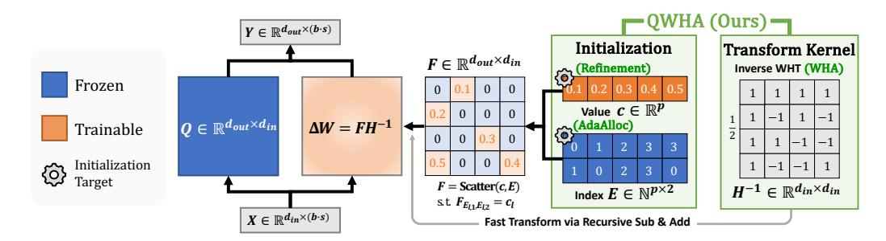
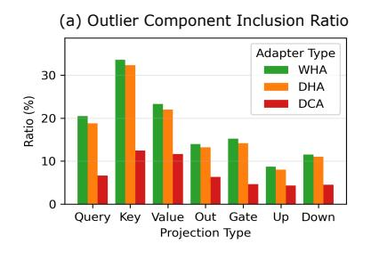
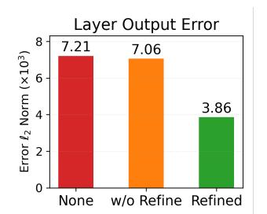

# 1 INTRODUCTION

Fine-tuning enables large language models (LLMs) to generalize beyond their pre-training, allowing adaptation to various domains [\(Wei et al., 2022;](#page-13-0) [Liu et al., 2023;](#page-12-0) [Qin et al., 2024;](#page-13-1) [DeepSeek-AI et al.,](#page-11-0) [2025\)](#page-11-0). While full fine-tuning yields superior accuracy, it often incurs significant overhead due to the extensive computations required to update all the trainable model parameters [\(Loshchilov & Hutter,](#page-13-2) [2017;](#page-13-2) [Zhu et al., 2025\)](#page-13-3). Parameter-efficient fine-tuning (PEFT) addresses this issue by optimizing only a small subset of the parameters while leaving most of them frozen [\(Li & Liang, 2021;](#page-12-1) [Liu](#page-12-2) [et al., 2022;](#page-12-2) [Hu et al., 2022;](#page-12-3) [Liu et al., 2024;](#page-12-4) [Kopiczko et al., 2024\)](#page-12-5). Beyond reducing training overhead, recent studies have shown that combining PEFT with model compression techniques can enhance inference efficiency at the same time [\(Dettmers et al., 2023\)](#page-11-1). Among these techniques, quantization, which lowers the bit precision of model parameters, has gained particular attention due to its robustness against accuracy degradation under high compression ratios [\(Frantar et al.,](#page-11-2) [2023;](#page-11-2) [Lin et al., 2024;](#page-12-6) [Dettmers et al., 2024;](#page-11-3) [Kim et al., 2024b;](#page-12-7) [Shao et al., 2024;](#page-13-4) [Ashkboos et al.,](#page-10-0) [2024;](#page-10-0) [Zhang et al., 2024;](#page-13-5) [Liu et al., 2025\)](#page-13-6). Consequently, quantization-aware PEFT (QA-PEFT) has been widely explored as a promising approach for efficient adaptation and inference in LLMs.

Prior works on QA-PEFT typically relied on low-rank adaptation (LoRA) [\(Li et al., 2024;](#page-12-8) [Guo et al.,](#page-12-9) [2024;](#page-12-9) [Kim et al., 2024a;](#page-12-10) [Liao et al., 2024;](#page-12-11) [Deng et al., 2025\)](#page-11-4). In contrast, for standard PEFT, several alternatives to LoRA have recently been proposed to address the representational limitations of lowrank structures. In particular, Fourier-related transform (FT)-based adapters have emerged as strong alternatives. They train a sparse set of coefficients to represent weight updates in the transform domain, offering superior representational capacity [\(Gao et al., 2024b;](#page-12-12) [Du et al., 2025;](#page-11-5) [Shen et al.,](#page-13-7)

<span id="page-1-0"></span>

Figure 1: Overview of Quantization-aware Walsh-Hadamard Adaptation (**QWHA**). The weight update from QWHA is formulated as  $\Delta W = FH^{-1}$ , where H is a predefined Walsh-Hadamard transform (WHT) matrix and F is a trainable sparse coefficient matrix consisting of values c and their indices E. The multiplication  $FH^{-1}$  indicates the expansion of learned coefficients (*i.e.*, c), over the transform basis (*i.e.*, columns of  $H^{-1}$ ). Note that, the coefficients c are the only trainable parameters, and H remains constant. Our key contributions are in the adoption of WHT into the adapter (**WHA**) and their initialization, particularly E (**AdaAlloc**) and c (**Refinement**).

<span id="page-1-1"></span>Table 1: Comparison of adapter types and parameter selection strategies. Adapter types include low-rank adapters (LoRA), recent FT-based adapters (DCA and DHA), and our proposed adapter (WHA). Strategies to determine parameter location E in F include magnitude-based selection, random uniform selection, training via reparameterization, and our proposed method (AdaAlloc).

|                              |          | Adapto   | er Type  |          | Parameter Selection Strategy |          |           |          |  |
|------------------------------|----------|----------|----------|----------|------------------------------|----------|-----------|----------|--|
| Ability Factors              | LoRA     | DCA      | DHA      | WHA      | Magnitude                    | Random   | Trainable | AdaAlloc |  |
| Fine-tuning                  | <b>+</b> | 1        | <b>↑</b> | <b>↑</b> | <b>↓</b>                     | <b>↑</b> | <b>↑</b>  | <b>↑</b> |  |
| Quantization Error Reduction | <b>+</b> | <b>↓</b> | <b>↓</b> | <b>↑</b> | <b>↑</b>                     | <b>↓</b> | <b>↓</b>  | <b>↑</b> |  |

2025). However, our observations show that directly applying FT-based adapters to quantized models often yields worse performance than LoRA-based methods specifically designed for QA-PEFT. This highlights the importance of explicit consideration for quantization effects when fine-tuning quantized models. LoRA-based methods adopt quantization-aware initialization strategies that compensate for the errors between full- and low-precision weights using low-rank approximation with the adapters prior to fine-tuning. However, applying such initialization in FT-based adapters is nontrivial, as identifying the optimal sparse set of parameters and their values to approximate a given matrix is an NP-hard problem (Natarajan, 1995). Moreover, the choice of transform type becomes an additional design consideration. This raises a research question: how to effectively exploit FT-based adapters in QA-PEFT. To the best of our knowledge, neither FT-based adapters nor their initialization techniques have been explored in the context of QA-PEFT.

In this paper, we present QWHA, a novel QA-PEFT method that introduces a FT-based adapter together with a quantization-aware initialization scheme, as illustrated in Figure 1 and Table 1. We adopt WHT in our adapter design (WHA), inspired by its high-fidelity reconstruction ability in the spectral domain, to effectively compensate for quantization errors (Hedayat, 1978). In addition, the WHT kernel consists solely of  $\pm 1$  elements, enabling efficient computations using only additions and subtractions, thereby eliminating matrix multiplications (Dao-AILab, 2024). We further reduce computation by applying a single transform in the adapter, unlike conventional FT-based adapters that apply two transforms. For quantization-aware adapter initialization, we develop a tractable solution that first selects parameter locations E and then assigns their values c. We introduce a channel-wise parameter allocation scheme that guarantees a lower bound on the number of parameters per channel to facilitate fine-tuning while allocating more parameters to channels with larger quantization errors, and then select the highest-magnitude coefficients within each channel to effectively reduce quantization error (AdaAlloc). Finally, we refine the selected parameter values, thereby enabling substantial reduction of quantization error (**Refinement**). We theoretically analyze the superior representation capacity of our proposed adapter and empirically validate the benefits of our adapter design and initialization method across diverse datasets and models.

### 2 BACKGROUND

### <span id="page-2-2"></span>2.1 LLM QUANTIZATION

LLM quantization is a key technique for improving inference efficiency by reducing the memory bottleneck caused by model weights through lowering their bit precision (Frantar et al., 2023), typically expressed by the following equation:

$$\tilde{\mathbf{W}}_{Q} = \operatorname{clamp}\left(\operatorname{round}\left(\frac{\mathbf{W}_{0}}{s}\right) - z, 0, 2^{n} - 1\right) \quad \mathbf{W}_{Q} = (\tilde{\mathbf{W}}_{Q} + z) \times s$$
 (1)

Here,  $W_0$  denotes the pre-trained weight matrix, while  $\tilde{W}_Q$  and  $W_Q$  represent the quantized integer weights and the corresponding dequantized weights, respectively. s and z are quantization scales and integer zero-points. Clamping is applied to the rounded and shifted value within the range 0 to  $2^n - 1$ , where n is the bit-width.

LLMs generally contain outliers, a small fraction of weights that are exceptionally large compared to the main distribution, and LLM quantization is highly sensitive to these outliers (Dettmers et al., 2024; Kim et al., 2024b; Tseng et al., 2024; An et al., 2025). These outliers induce corresponding outliers in the quantization error. Most quantization errors  $\Delta W_Q = W_0 - W_Q$  are bounded within a small range  $(e.g., [-\frac{s}{2}, \frac{s}{2}))$ , since most weights within the clamping range are mapped to the nearest quantization level. In contrast, for outliers, the quantization error is defined as the difference between the original large weight and the clamping boundary values, resulting in extremely large errors that lead to significant accuracy degradation. Thus, reducing outlier-induced error is critical, and recent post-training quantization techniques for LLMs focus on mitigating these errors to preserve model accuracy (Dettmers et al., 2024; Kim et al., 2024b; Shao et al., 2024; Tseng et al., 2024; Zhang et al., 2024). Details on the distribution of quantization errors are presented in Appendix A.

### 2.2 QUANTIZATION-AWARE PEFT

A typical quantization-aware PEFT (QA-PEFT) adopts LoRA (Hu et al., 2022), which injects a pair of low-rank matrices into linear layers to approximate the weight updates  $\Delta W$  as follows:

<span id="page-2-1"></span>
$$Y = (W_O + \Delta W)X \quad s.t. \quad \Delta W = BA \tag{2}$$

Here,  $A \in \mathbb{R}^{r \times d_{\text{in}}}$  and  $B \in \mathbb{R}^{d_{\text{out}} \times r}$  are low-rank adapters, fine-tuned instead of frozen quantized weight  $W_Q \in \mathbb{R}^{d_{\text{out}} \times d_{\text{in}}}$ , where  $X \in \mathbb{R}^{d_{\text{in}} \times (b \times s)}$  is the activation matrix with batch size b and sequence length s. Since there is no prior information about the weight updates before fine-tuning, LoRA typically initializes A as a random matrix and B as a zero matrix. In QA-PEFT, however, initializing the adapters to minimize quantization error prior to fine-tuning plays a crucial role in accuracy. Early approaches addressed this by reconstructing quantization errors via singular value decomposition (SVD) to initialize low-rank adapters (Li et al., 2024; Guo et al., 2024). More recent works, such as RA-LoRA (Kim et al., 2024a) and CLoQ (Deng et al., 2025), adopt advanced decomposition strategies and improved calibration to further mitigate this limitation. However, existing QA-PEFT methods remain restricted to LoRA, and no prior studies have explored the use of other advanced adapters for QA-PEFT, which will be discussed in the next section.

### 2.3 FOURIER TRANSFORM-BASED ADAPTERS

Sparse adapters have recently emerged as a strong alternative to various low-rank adapters (Bhardwaj et al., 2024; Gao et al., 2024b; Shen et al., 2025; Du et al., 2025). SHiRA (Bhardwaj et al., 2024) proposes directly updating a sparse subset of the weight matrix, enabling multi-adapter fusion. More recent methods adopt Fourier-related Transforms (FT) to represent the weight update  $\Delta \boldsymbol{W}$  in the spectral domain by applying transforms along both the rows and columns of the matrix as follows:

<span id="page-2-0"></span>
$$F = H'\Delta WH \implies \Delta W = H'^{-1}FH^{-1}$$
 (3)

Here,  $H \in \mathbb{R}^{d_{\text{in}} \times d_{\text{in}}}$  and  $H' \in \mathbb{R}^{d_{\text{out}} \times d_{\text{out}}}$  are the orthonormal transform kernels. Prior works on these FT-based adapters have primarily focused on identifying suitable transform kernels. FourierFT (Gao et al., 2024b) employs the discrete Fourier transform (DFT), while LoCA (Du et al., 2025) replaces the DFT with the discrete cosine transform (DCT) to avoid discarding imaginary

components. SSH (Shen et al., 2025) instead leverages the discrete Hartley transform (DHT) for the same purpose. As these kernels are composed of sinusoidal functions, F corresponds to the coefficients of the frequency components, which collectively represent  $\Delta W$ . We denote DCT and DHT-based adapters as DCA and DHA throughout the paper.

Since the transform kernels are fixed matrices, F is the only learnable parameter during fine-tuning. To reduce the number of trainable parameters, F is treated as a sparse matrix. Specifically,  $F = \operatorname{Scatter}(\boldsymbol{c}, \boldsymbol{E})$  is constructed from a value vector  $\boldsymbol{c} \in \mathbb{R}^p$  and an index list  $\boldsymbol{E} \in \mathbb{N}^{p \times 2}$ , where Scatter assigns  $\boldsymbol{F}_{(E_l,1,E_l,2)} = c_l$  for  $0 \le l \le p-1$ , with all other entries fixed to zero throughout training and inference. At the initialization stage, since there is no information on  $\Delta \boldsymbol{W}$ , previous works generally select the locations  $\boldsymbol{E}$  randomly and the values of the spectral coefficients  $\boldsymbol{c}$  are initialized to zero (Gao et al., 2024b; Du et al., 2025). SSH (Shen et al., 2025) proposes an advanced parameter selection strategy under the assumption that the frequency patterns of pre-trained and fine-tuned weights are similar. It first transforms the pre-trained weights and selects half of the positions with the largest spectral coefficients, while the remaining half are chosen randomly.

Overall, previous works demonstrate that FT-based adapters achieve superior accuracy improvements in full-precision fine-tuning compared to low-rank adapters. However, their advantages over low-rank adapters have only been empirically demonstrated, without theoretical justification. In addition, transforms within FT-based adapters incur heavy computational overhead ( $\boldsymbol{H}$  and  $\boldsymbol{H}'$  in Equation 3). Moreover, their application to QA-PEFT, particularly with initialization strategies that reconstruct quantization error, has not yet been explored.

#### 3 METHODOLOGY

In this section, we present our proposed method, **QWHA** (**Q**uantization-Aware **W**alsh-**H**adamard **A**daptation). First, we present the formulation of our proposed WHT-based adapter. Next, we analyze the key component that enables FT-based adapters to achieve greater representational capacity than low-rank adapters, and demonstrate why WHA, in particular, excels at mitigating quantization error during adapter initialization. Finally, we introduce a parameter initialization strategy that reduces quantization error and enhances fine-tuning capability. Note that the experiments in this section use the 4-bit quantized LLaMA-3.2-3B model, with the total number of trainable parameters  $P(r) = \sum_{l \in \text{layers}} (d_{l,\text{in}} + d_{l,\text{out}}) \times r$  fixed by setting r = 64 across all adapters.

### <span id="page-3-1"></span>3.1 QA-PEFT ADAPTER DESIGN

WHT-based Adapter (WHA) We design our proposed adapter by constructing the weight update as the transformation of a sparse matrix F through an orthogonal transform  $H^{-1}$ . Specifically, we adopt the WHT (Hedayat, 1978; Kunz, 1979), a particular instance of the FT whose kernel consists only of  $\pm 1$  entries, for the transform H (details on WHT and other FT kernels are provided in Appendix B.1). Accordingly, our adapter is formulated as follows:

<span id="page-3-0"></span>
$$Y = (W_Q + \Delta W)X$$
 s.t.  $\Delta W = FH^{-1}$ . (4)

The advantages of our adapter design are discussed in the following paragraphs.

**Full-Rank Adapter.** FT-based adapters exhibit greater representational capability than LoRA variants because they offer higher rank capacity given the same number of parameters. The representational power of low-rank adapters is strictly bounded by their inner dimension r (Equation 2). In contrast, since the transform kernels in FT-based adapters are orthogonal and therefore full-rank, the rank of the adapter depends solely on the sparse matrix F (Equation 3 and 4). Given that nonzero parameters are selected uniformly at random, if both rows and columns receive more than two parameters on average, then F achieves full rank  $r_{\text{max}} = \min(d_{\text{in}}, d_{\text{out}})$  with high probability (Coja-Oghlan et al., 2020). Since our adapter initialization in Section 3.2 assigns at least a few elements to each channel and selects parameters independently per channel, the full-rank conditions are satisfied. Details of this condition are provided in Appendix B.2. Figure 2(a) presents the empirical analysis of the rank of adapter weights, normalized by the maximum achievable rank  $r_{\text{max}}$  and averaged across layers. While LoRA achieves less than 6.3% of the normalized rank, FT-based adapters are nearly full-rank. Hence, our proposed WHA exhibits high representational capacity.

<span id="page-4-0"></span>


Figure 2: (a) Comparison of rank in weight updates between low-rank and FT-based adapters across linear layers. (b) Cumulative distribution of  $\ell_2$  norm of singular values and transform coefficients with Pareto hill index  $\eta$  for the quantization error  $\Delta W_Q$  in the 14<sup>th</sup>-layer Value projection. The vertical blue line indicates a point where the adapters have the same number of parameters.

<span id="page-4-1"></span>


Figure 3: (a) Average coverage of outlier components within the selected parameters. (b)  $\ell_2$  norm of the layer output error after initialization on the 14<sup>th</sup>-layer Key projection. The vertical blue lines indicate points where the adapters have the same number of parameters.

**Single transform.** Conventional FT-based adapters apply transforms to both the input and output dimensions of the sparse matrix F as denoted in Equation 3. However, we find no clear advantage of this approach over a single transform in the context of quantization. Since quantization errors are defined group-wise within each output channel, the channels can be treated as independent, and multiple transforms do not improve the representational capacity (*i.e.*, rank) of the adapter. Therefore, to avoid unnecessary operations, we design WHA to perform a single transform as described in Equation 4.

**Benefits of WHT over other transforms.** As discussed in Section 2.1, quantization errors exhibit heavy-tailed outliers. For QA-PEFT, where mitigating such errors is crucial, the adapter must capture the outlier structure with a small number of parameters, as in the case of sparse adapters using the sparse matrix F. We strategically adopt the WHT for our adapter design to effectively capture such outliers (Hedayat, 1978; Kunz, 1979). The WHT kernel consists only of ±1 entries, and its basis functions are square-wave patterns with sharp transitions. In contrast, prior FT-based adapters adopt DCT or DHT, whose sinusoidal bases exhibit smooth transitions. This structural difference makes the WHT better aligned with abrupt changes such as outlier values. Therefore, WHT inherently provides a more compact coefficient representation of quantization errors compared to DCT or DHT. We empirically demonstrate this by analyzing the cumulative energy in adapter parameters (Figure 2(b)), defined as the  $\ell_2$  norm of coefficients from the transform of  $\Delta W_Q$  in FT-based adapters, and the  $\ell_2$  norm of singular values of  $\Delta W_Q$  in low-rank adapters. Both coefficients and singular values follow a Pareto-like distribution (see Appendix B.3), which can be characterized by the Pareto hill index  $\eta$ , where a smaller  $\eta$  indicates a sharper distribution (Arnold, 1983). Since the total cumulative energy equals  $\|\Delta W_Q\|_F^2$ , the fastest convergence curve of WHT, with the smallest  $\eta$ , demonstrates that it concentrates the largest portion of energy within a small number of coefficients, enabling accurate reconstruction with a limited number of parameters. As a result, WHA effectively compensates for quantization errors, particularly large-magnitude ones from salient weight channels, as shown empirically in Figure 3. For a fair comparison, we use the same parameter ini-

### <span id="page-5-2"></span>Algorithm 1 QWHA Initialization Algorithm

```
 \begin{array}{lll} \textbf{Require:} & \text{Weight quantization error } \Delta \boldsymbol{W}_Q \in \mathbb{R}^{d_{\text{out}} \times d_{\text{in}}}, \text{Activation } \boldsymbol{X} \in \mathbb{R}^{d_{\text{in}} \times (b \cdot s)}, \text{ WHT matrix } \boldsymbol{H} \\ \textbf{Require:} & \text{Budget } p, \text{ Accumulated budget } \tilde{p}, \text{ channel-wise budget } (p_0, \dots, p_{d_{\text{out}}-1}) \in \mathbb{N}^{d_{\text{out}}} \\ \textbf{Require:} & \text{Parameter value vector } \boldsymbol{c} \in \mathbb{R}^p, \text{ index list } \boldsymbol{E} \in \mathbb{N}^{p \times 2} \\ & \text{Initialize } \tilde{p}, \boldsymbol{c}, \boldsymbol{E} \leftarrow \boldsymbol{0} \\ & \text{Set } \boldsymbol{R} \leftarrow \boldsymbol{U} \boldsymbol{\Sigma}^{1/2} \leftarrow \boldsymbol{U} \boldsymbol{\Sigma} \boldsymbol{U}^\top := \text{SVD}(\boldsymbol{X} \boldsymbol{X}^\top) \\ & \text{Set } (p_0, \dots, p_{d_{\text{out}}-1}) \leftarrow \text{AdaAlloc}(p, \Delta \boldsymbol{W}_Q), \boldsymbol{B} \leftarrow \boldsymbol{H}^{-1} \boldsymbol{R} \\ & \text{Set } \boldsymbol{v} \leftarrow (\Delta \boldsymbol{W}_Q)_{i,:} \boldsymbol{R} \\ & \text{Set } \boldsymbol{v} \leftarrow (\Delta \boldsymbol{W}_Q)_{i,:} \boldsymbol{R} \\ & \text{Set } \boldsymbol{E}_{\tilde{p}, \dots, \tilde{p} + p_i - 1} \leftarrow \text{TopK}_{p_i}^{\text{Index}}(\boldsymbol{v} \boldsymbol{B}^{-1}) \\ & \text{Set } \boldsymbol{c}_{\tilde{p}, \dots, \tilde{p} + p_i - 1} \leftarrow \boldsymbol{v} \boldsymbol{B}'^\top (\boldsymbol{B}' \boldsymbol{B}'^\top)^{-1} \\ & \text{Accumulate } \tilde{p} \leftarrow \tilde{p} + p_i \\ & \textbf{end for} \\ & \text{Update } \boldsymbol{F} \in \mathbb{R}^{d_{\text{out}} \times d_{\text{in}}} \leftarrow \boldsymbol{c}, \boldsymbol{E} \\ \end{array} \right.
```

tialization method described in Section 3.2. We define outlier coverage as the ratio of the  $\ell_1$  sum of coefficients captured by the selected parameter locations to that of all coefficients corresponding to the top 10% magnitude outliers of  $\Delta W_Q$ .

### <span id="page-5-0"></span>3.2 QUANTIZATION-AWARE ADAPTER INITIALIZATION

**Objective Function.** Our goal in initializing WHA is to minimize the layer output error  $(\Delta W_Q X)$  caused by weight quantization, using a coefficient matrix F with p non-zero elements. Formally, the objective is given by:

<span id="page-5-4"></span>
$$\underset{\boldsymbol{c},\boldsymbol{E}}{\arg\min} \|\Delta \boldsymbol{W}_{Q}\boldsymbol{X} - \boldsymbol{F}\boldsymbol{H}^{-1}\boldsymbol{X}\|_{F}^{2} \tag{5}$$

where  $\|\cdot\|_F$  denotes Frobenius norm. Following the reduction procedure used in Frantar et al. (2023) and Deng et al. (2025), this reduces to:

<span id="page-5-1"></span>
$$\underset{\boldsymbol{c},\boldsymbol{E}}{\operatorname{arg\,min}} \|\Delta \boldsymbol{W}_{Q}\boldsymbol{R} - \boldsymbol{F}\boldsymbol{H}^{-1}\boldsymbol{R}\|_{F}^{2} \tag{6}$$

Here,  $R = U\Sigma^{1/2}$  is the invertible square root of the Hessian matrix attained by SVD as  $XX^{\top} = U\Sigma U^{\top}$ . A detailed derivation on this reduction is provided in Appendix C.1. As we aim to find a sparse F(c, E) that minimizes Equation 6, it constitutes an NP-hard sparse approximation problem (SAP) (Natarajan, 1995). To make this problem more tractable, we decompose it into two subproblems: first, parameter selection to determine the locations of the nonzero elements to fine-tune (E); and second, value refinement to optimize the values of the selected positions (c).

Parameter Selection with AdaAlloc. Given a number of parameter (budget) p for a layer, a naive selection method to reduce quantization error is to choose the p largest-magnitude elements from the dense solution  $\Delta W_Q H$  of Equation 6. However, since large-magnitude coefficients are often clustered in a few channels containing outliers, parameters become overly concentrated in a small number of channels. As a result, magnitude-based selection yields a low-rank F, degrading fine-tuning capability. Conventional methods prevent this rank reduction by incorporating random selection. For example, LoCA initializes parameter locations randomly and then optimizes these locations during fine-tuning. Thus, from the perspective of initialization, LoCA is equivalent to random selection at this stage. Additionally, SSH allocates half of the parameters randomly, while it selects the other half based on magnitude. However, these randomness-based approaches result in high layer output error because they fail to capture the parameters critical for reducing the error. To construct a sparse F that is high-rank and minimizes initialization error, we first allocate the parameter budget adaptively across output channels in proportion to their activation error magnitudes:

<span id="page-5-3"></span>
$$p_i \leftarrow \left[ p \cdot \frac{\|(\Delta \mathbf{W}_Q X)_{i,:}\|_F^t}{\sum_{j=1}^{d_{\text{out}}} \|(\Delta \mathbf{W}_Q X)_{j,:}\|_F^t} \right], \tag{7}$$

<span id="page-6-0"></span>

Figure 4: Rank of adapter weights for each parameter selection methods.

Table 2: Layer output error ( $\ell_2$  norm, scaled by  $1 \times 10^3$ ) after initialization. 'None' denotes the error before initialization.

| Method  | None  | Random | SSH   | Magnitude | AdaAlloc |
|---------|-------|--------|-------|-----------|----------|
| Query   | 13.84 | 10.55  | 6.99  | 5.95      | 5.11     |
| Key     | 0.54  | 0.43   | 0.30  | 0.25      | 0.27     |
| Value   | 28.08 | 22.98  | 17.38 | 15.10     | 14.92    |
| Out     | 4.66  | 3.70   | 2.70  | 2.24      | 2.01     |
| Gate    | 1.88  | 1.57   | 1.25  | 1.04      | 1.13     |
| Up      | 25.76 | 23.05  | 19.85 | 16.52     | 17.97    |
| Down    | 21.36 | 19.21  | 16.96 | 14.00     | 15.25    |
| Average | 7.21  | 5.96   | 4.57  | 3.82      | 3.86     |

where t is a temperature hyperparameter controlling allocation sharpness. Because the parameter budget must be an integer, we apply the floor operation, which may leave fewer than  $d_{\text{out}}$  parameters unassigned. These remainders are distributed to the output channels with the smallest allocations to ensure  $\sum_{i=1}^{d_{\text{out}}} p_i = p$ . Since all output channels receive parameter budgets proportional to their errors, F maintains full rank, while allocating more parameters to important channels with higher quantization error. Next, within the budget of each output channel, we select parameters based on magnitude to effectively reduce the error. We compare the rank and layer output error of previous selection methods and AdaAlloc, as shown in Figure 4 and Table 2. For a fair comparison, all selection methods use the same value assignment method discussed in the next paragraph. AdaAlloc is the only parameter selection method that simultaneously achieves a nearly full-rank F and maintains low layer output error. Examples of the selected parameters are provided in Appendix C.2.

**Value Refinement.** To assign each parameter a value that effectively reduces layer output error, we solve the channel-wise SAP derived from Equation 6 for each  $i^{th}$  output channel with a given parameter budget  $p_i$ :

$$\min_{\boldsymbol{x}} \|\boldsymbol{v} - \boldsymbol{x}\boldsymbol{B}\|_{2}^{2}, \quad \text{where} \quad \boldsymbol{v} = (\Delta \boldsymbol{W}_{Q})_{i,:}\boldsymbol{R}, \quad \boldsymbol{B} = \boldsymbol{H}^{-1}\boldsymbol{R}. \tag{8}$$

Here, x is the  $i^{th}$  row of F, constrained to have  $p_i$  non-zero elements. We first select the  $p_i$  largest-magnitude entries from the channel-wise dense solution  $x_0 = vB^{-1} = (\Delta W_Q H)_{i,:}$ . Next, rather than directly reusing the values from a dense solution, we refine them to minimize layer output error. Specifically, we re-project v onto the rows of B corresponding to the selected indices, denoted as  $B' \in \mathbb{R}^{p_i \times d_{in}}$ , which serve as the most relevant basis vectors:

$$\boldsymbol{x}^* = \boldsymbol{v} \boldsymbol{B}'^{\top} (\boldsymbol{B}' \boldsymbol{B}'^{\top})^{-1}. \tag{9}$$

This allows the selected basis vectors to account for the impact of unselected vectors, yielding a more accurate approximation. Without this step, interactions among basis vectors are ignored, leading to suboptimal error reduction. Note that the refinement is applicable regardless of the parameter selection strategy. Figure 5 shows that refinement is crucial for reducing layer output error, presenting the layer output error after initialization with parameters selected by AdaAlloc. Further details on the error analysis are provided in Appendix C.3. Finally,  $\boldsymbol{E}$  and  $\boldsymbol{c}$  for channel i are initialized to the selected indices and their refined values  $\boldsymbol{x}^*$ . Algorithm 1 summarizes the initialization process, with details provided in Appendix C.4.

<span id="page-6-1"></span>

Figure 5: Effect of refinement on average layer output error.

### <span id="page-6-2"></span>4 EXPERIMENTS

We evaluate the effectiveness of QWHA in terms of model accuracy and training efficiency. We first compare QWHA with state-of-the-art QA-PEFT baseline and sparse high-rank adapters including FT-based adapters. Then, we provide a detailed analysis of the impact of using WHA and AdaAlloc. Finally, we demonstrate the efficiency of QWHA regarding WHA.

<span id="page-7-1"></span>Table 3: Accuracy (%) evaluation results on CSQA and GSM8k benchmarks. 'QA Init.' denotes the existence of quantization-aware initialization.

| Bits  | Method        | Adapter | QA    | Coefficient | LLaMA | A-3.1-8B | LLaM/ | A-3.2-3B | Mistral | -7B-v0.3 |
|-------|---------------|---------|-------|-------------|-------|----------|-------|----------|---------|----------|
| Ditts | Wichiod       | Type    | Init. | Selection   | CSQA  | GSM8k    | CSQA  | GSM8k    | CSQA    | GSM8k    |
| 16    | Pre-trained   | -       | -     | -           | 70.78 | 6.22     | 64.99 | 3.18     | 70.49   | 13.72    |
| 10    | Fine-tuned    | -       | -     | -           | 71.84 | 59.74    | 66.43 | 44.80    | 71.87   | 54.51    |
|       | $GPTQ_{MagR}$ | -       | -     | -           | 69.11 | 2.58     | 64.43 | 3.34     | 69.54   | 10.39    |
|       | CLoQ          | LoRA    | 1     | -           | 69.58 | 53.83    | 65.48 | 39.27    | 71.32   | 52.01    |
| 4     | SHiRA         | Sparse  | X     | Random      | 71.07 | 54.36    | 63.10 | 40.71    | 70.88   | 51.02    |
|       | LoCA          | DCA     | X     | LoCA        | 71.45 | 54.36    | 65.59 | 40.33    | 71.55   | 47.99    |
|       | SSH           | DHA     | X     | SSH         | 70.75 | 53.98    | 65.83 | 39.80    | 71.57   | 47.99    |
|       | QWHA          | WHA     | 1     | AdaAlloc    | 71.50 | 56.10    | 66.11 | 41.47    | 71.70   | 53.68    |
|       | $GPTQ_{MagR}$ | -       | -     | -           | 67.76 | 2.65     | 61.49 | 2.43     | 67.57   | 1.29     |
|       | CLoQ          | LoRA    | 1     | -           | 68.71 | 53.75    | 64.35 | 39.20    | 69.91   | 46.25    |
| 3     | SHiRA         | Sparse  | X     | Random      | 69.68 | 45.49    | 62.90 | 35.33    | 69.36   | 46.70    |
|       | LoCA          | DCA     | X     | LoCA        | 70.21 | 53.15    | 63.30 | 36.69    | 69.64   | 46.10    |
|       | SSH           | DHA     | X     | SSH         | 69.86 | 50.34    | 63.57 | 38.13    | 69.65   | 47.15    |
|       | QWHA          | WHA     | ✓     | AdaAlloc    | 70.50 | 55.34    | 64.80 | 39.58    | 70.22   | 47.84    |
|       | $GPTQ_{MagR}$ | -       | -     | -           | 41.00 | 0.45     | 42.90 | 0.08     | 45.91   | 0.00     |
|       | CLoQ          | LoRA    | 1     | -           | 56.49 | 33.89    | 54.89 | 26.53    | 61.80   | 33.36    |
| 2     | SHiRA         | Sparse  | X     | Random      | 51.84 | 27.74    | 52.91 | 22.59    | 59.08   | 33.57    |
|       | LoCA          | DCA     | X     | LoCA        | 56.71 | 33.97    | 53.87 | 23.88    | 62.03   | 33.89    |
|       | SSH           | DHA     | X     | SSH         | 56.06 | 30.55    | 54.01 | 25.77    | 62.31   | 32.06    |
|       | QWHA          | WHA     | 1     | AdaAlloc    | 60.98 | 37.83    | 57.03 | 29.11    | 63.84   | 35.33    |

**Models and Datasets.** We evaluate QWHA on the Mistral-7B-v0.3 (Mistral AI, 2024) and LLaMA (Grattafiori et al., 2024) model families, including LLaMA-3.1-8B and LLaMA-3.2-3B. We evaluate the models on both general question-answering tasks for the models fine-tuned on instruction-following datasets and arithmetic reasoning tasks for the models fine-tuned on mathematical reasoning benchmarks. For instruction fine-tuning, we use the Stanford-Alpaca dataset (Taori et al., 2023)<sup>1</sup> with 52k samples. We evaluate on zero-shot commonsense question answering (CSQA)(Gao et al., 2024a), covering seven multiple-choice benchmarks(Clark et al., 2018; 2019; Zellers et al., 2019; Talmor et al., 2019; Bisk et al., 2020; Sakaguchi et al., 2021). For arithmetic reasoning, we fine-tune on the GSM8k (Cobbe et al., 2021) dataset and evaluate with zero-shot chain-of-thought reasoning questions on its test set, following Cobbe et al. (2021).

**Baselines.** We include full fine-tuned model (Fine-tuned) and quantized model, which use GPTQ (Frantar et al., 2023) with MagR (Zhang et al., 2024) (GPT $Q_{\rm MagR}$ ) as baselines. We note that our method is also compatible with any other quantization schemes. We also include CLoQ, a recent QA-PEFT method that shares our goal of layer output error reduction during initialization for low-rank adapters. Other LoRA-based methods (Kim et al., 2024a; Liao et al., 2024) involving layer-wise calibration or layer-wise parameter allocation are orthogonal to our approach and can be integrated in future work. We evaluate sparse adapters, including SSH and LoCA (FT-based) and SHiRA (non FT-based). We note that LoCA further fine-tunes the randomly selected parameter indices via reparameterization with a cost of additional training overhead. We also build advanced hybrid baselines that integrate transforms or parameter selection strategies from prior works into our schemes by applying DCA and DHA with our AdaAlloc, or applying various parameter selection strategies to our WHA.

Implementation Details. Following prior work, adapters are applied to linear layers with a parameter budget of P(r=64), and quantization is performed with a group size of 64. Note that we apply a scaling factor  $\alpha \simeq 1$  to all adapters, while the equations in the preceding sections omitted it by  $\alpha=1$  for simplicity. We set the AdaAlloc temperature to t=1, which suffices to meet the full-rank condition. Further description on the training hyperparameter including scaling factor  $\alpha$  and temperature t are provided in Appendix D.1. We use WikiText-2 (Merity et al., 2016) as a

<span id="page-7-0"></span>https://huggingface.co/datasets/yahma/alpaca-cleaned

<span id="page-8-1"></span>Table 4: Accuracy (%) evaluation results on CSQA and GSM8k benchmarks with variants of adapter types and parameter selection strategies in LLaMA-3.2-3B. 'QA Init.' denotes the existence of quantization-aware initialization, and 'Refine.' denotes the value refinement during initialization.

| Adapter | QA       | Coefficient | Refine.      | 4-    | -bit  | 3-    | -bit  | 2-bit |       |  |
|---------|----------|-------------|--------------|-------|-------|-------|-------|-------|-------|--|
| Type    | Init.    | Selection   | remie.       | CSQA  | GSM8k | CSQA  | GSM8k | CSQA  | GSM8k |  |
| WHA     | Х        | Random      | Х            | 66.00 | 40.94 | 63.53 | 37.60 | 54.03 | 24.41 |  |
| WHA     | /        | Random      | ✓            | 65.91 | 40.71 | 63.91 | 37.30 | 54.48 | 24.48 |  |
| WHA     | /        | Magnitude   | ✓            | 66.07 | 41.01 | 64.52 | 36.69 | 56.49 | 28.12 |  |
| WHA     | /        | LoCA        | ✓            | 65.75 | 40.94 | 63.73 | 36.92 | 53.93 | 21.15 |  |
| WHA     | /        | SSH         | ✓            | 65.96 | 40.78 | 62.92 | 36.92 | 54.20 | 27.14 |  |
| WHA     | 1        | AdaAlloc    | <b>✓</b>     | 66.11 | 41.47 | 64.80 | 39.58 | 57.03 | 29.11 |  |
| DCA     | <b>√</b> | AdaAlloc    | <b>✓</b>     | 65.54 | 39.72 | 64.77 | 37.30 | 55.95 | 27.29 |  |
| DHA     | 1        | AdaAlloc    | ✓            | 65.92 | 40.84 | 64.35 | 38.89 | 56.05 | 27.52 |  |
| Sparse  | <b>✓</b> | AdaAlloc    | $\checkmark$ | 65.60 | 40.94 | 63.43 | 37.53 | 55.97 | 26.54 |  |

<span id="page-8-0"></span>

Figure 6: Accuracy of CLoQ and QWHA.

Table 5: Training time (hours) on Alpaca dataset.

| Batch<br>Size | CLoQ | SHiRA | QWHA | SSH  | LoCA |
|---------------|------|-------|------|------|------|
| 1             | 12.5 | 15.5  | 18.2 | 63.3 | 92.3 |
| 2             | 7.1  | 8.2   | 9.7  | 45.8 | 53.4 |
| 4             | 5.0  | 5.5   | 6.0  | 26.1 | 30.1 |
| 8             | 4.1  | 4.3   | 4.6  | 13.3 | 16.5 |
| 16            | 3.6  | 3.7   | 3.9  | 8.3  | 9.8  |

calibration dataset for adapter initialization, following Deng et al. (2025), to ensure generality. All experiments are conducted on NVIDIA A100 80GB GPUs.

#### 4.1 FINE-TUNED MODEL ACCURACY

Main evaluation. Table 3 shows that QWHA outperforms both low-rank adapters with quantization-aware initialization and conventional sparse adapters. In particular, the effectiveness of QWHA is evident in the 2-bit setting, where it achieves scores at least 2-3% higher than the baselines. Without quantization-aware initialization, sparse adapters, including FT-based adapters, perform worse than low-rank adapters in several cases. This underscores the need for quantization-aware initialization, especially in sub-4-bit settings where fine-tuning alone cannot fully restore performance. We note that task-specific results of the CSQA benchmark are presented in Appendix D.2.

Effect of WHA and AdaAlloc. We further examine the effectiveness of WHA and AdaAlloc, with QWHA consistently outperforming both low-rank adapters and advanced variants of sparse adapters. Figure 6 for 4-bit quantized LLaMA-3.2-3B shows that increasing the number of parameters in CLoQ cannot close the accuracy gap with QWHA, as QWHA with P(r>32) already surpasses CLoQ's maximum achievable score. This highlights the advantage of WHA, which provides superior representational capacity than low-rank adapters. Table 4 further demonstrates that WHA and AdaAlloc achieve the best results in each respective category of adapter type and parameter selection method. We note that LoCA's post-hoc location selection undermines the effectiveness of quantization-aware initialization based on the initially chosen parameters, unlike in PEFT. Ablations on the temperature t in Equation 7 and quantization group size are provided in Appendix D.3 and D.4, respectively.

