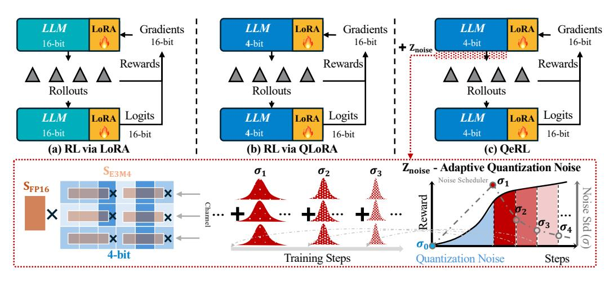
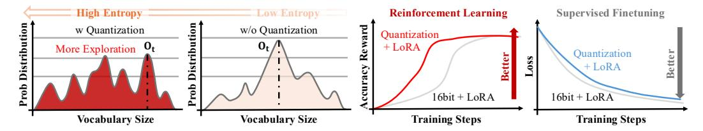
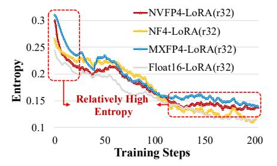
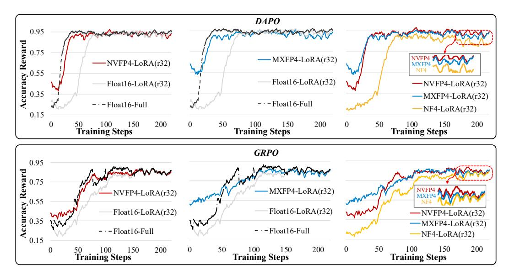
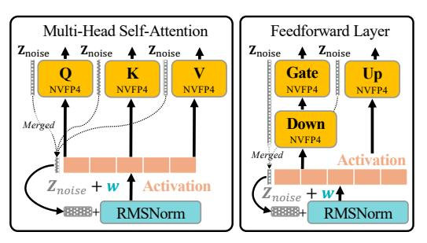
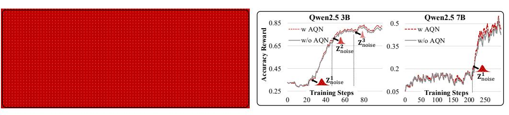
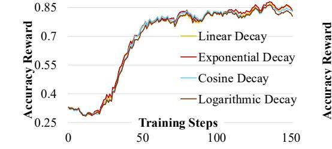
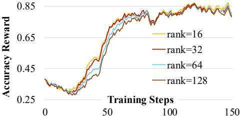
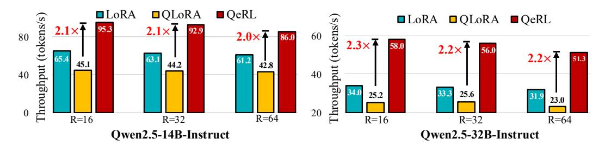

# 1 INTRODUCTION

The ability to perform multi-step reasoning is critical for large language models (LLMs) to handle complex tasks, from theoretical problem solving to practical decision making [\(Sui et al.,](#page-13-0) [2025;](#page-13-0) [Xu et al.,](#page-13-1) [2025;](#page-13-1) [Chu et al.,](#page-9-0) [2025;](#page-9-0) [Yang et al.,](#page-13-2) [2021\)](#page-13-2). Supervised fine-tuning (SFT) is a common method to improve reasoning by training models to replicate explicit reasoning steps [\(Huang et al.,](#page-11-0) [2024d;](#page-11-0) [Min et al.,](#page-12-0) [2024\)](#page-12-0). However, this approach risks promoting imitation rather than encouraging genuine reasoning. In contrast, reinforcement learning (RL) uses verifiable reward signals to support adaptive learning, allowing models to explore diverse reasoning traces and identify more robust solutions [\(Lambert et al.,](#page-11-1) [2024;](#page-11-1) [DeepSeek-AI,](#page-10-0) [2025;](#page-10-0) [Chen et al.,](#page-9-1) [2025a\)](#page-9-1).

Figure 2: The illustration of QeRL. (a) **RL via LoRA**: reducing trainable parameters, but does not alleviate the rollout bottleneck. (b) **RL via QLoRA**: NF4 quantization with LoRA, but NF4 is slower than LoRA. (c) **QeRL**: NVFP4 quantization with LoRA, reducing memory and enabling faster RL while matching full-parameter finetuning performance with adaptive quantization noise. AQN dynamically adjusts quantization noise with an exponential scheduler, enhancing exploration.

RL is effective for LLMs' reasoning but highly resource-intensive. RL requires substantial GPU memory, as multiple models, such as policy and reference models in GRPO (Shao et al., 2024), must run concurrently. The large size of reasoning-focused LLMs (DeepSeek-AI, 2025) further exacerbates memory demands. Training is also slowed by multistage processes, including rollouts, reward computation, logit evaluation, and gradient updates. Rollouts are particularly costly, involving repeated sampling and processing of long sequences for complex tasks (Yu et al., 2025). Additionally, RL's inherent sample inefficiency (Hassani et al., 2024) further increases costs.

Improving RL efficiency in LLMs presents significant challenges. One approach, exemplified by Tina (Wang et al., 2025), leverages parameter-efficient fine-tuning methods like Low-Rank Adaptation (LoRA) (Hu et al., 2022) to reduce trainable parameters. However, similar to LoRA in SFT (Chen et al., 2024b), these methods fail to address the core issue of slow rollout speeds. Another strategy, demonstrated by FlashRL (Liu et al., 2025a), uses quantized rollout models to reduce computational costs. However, precision mismatches between the rollout model and logits model (e.g., 8-bit vs. 16-bit) require importance sampling to correct discrepancies, necessitating both 8-bit and 16-bit models to run simultaneously, which increases memory usage. To overcome these limitations, we focus on lower-bit quantization while avoiding duplicate models in memory. Additionally, using QLoRA (Dettmers et al., 2023a) in RL slows rollouts by 1.5–2×, further reducing efficiency. This slowdown occurs because QLoRA relies on NormalFloat 4-bit (NF4) precision, which requires unpacking and mapping to floating-point values via a lookup table before matrix multiplication.

To address the limitations of NF4 in QLoRA, a natural solution is to adopt higher-performance quantization. However, standard quantization methods introduce static and deterministic noise, which is non-beneficial to the later-stage RL training. To avoid this drawback, our analysis surprisingly reveals that quantization noise, with precise control, can benefit RL by increasing policy entropy (Fig.3). This added entropy enhances exploration by introducing uncertainty, similar to the effect of parameter noise in RL (Plappert et al., 2017; Pang & Jiang, 2021), and helps models discover better strategies (Cui et al., 2025). Our experiments show that a well-designed noise strategy allows quantized LLMs to exploit this effect, reducing memory overhead while gaining better reward curves. This finding contrasts with results from SFT of LLMs (Dettmers et al., 2023a; Guo et al., 2023), demonstrating that controllable quantization noise in RL enhances exploration and enables quantized frameworks to surpass 16-bit LoRA in both efficiency and performance.

We propose QeRL, a quantization-based RL framework designed to train LLMs on reasoning tasks. As shown in Fig.2, QeRL uses NVFP4 quantization for LLM weights and integrates a Marlin-based (Frantar et al., 2024) approach in both rollout and prefilling stages. This design accelerates rollout and prefilling without sacrificing accuracy, with gradient backpropagation enabled through LoRA layers. To address static quantization noise, we introduce adaptive quantization noise (AQN),

Figure 3: Advancement of Quantization in RL Exploration. Quantization noise brings higher initialized entropy, which encourages exploration in RL training, accelerating the increase of reward.

which injects channel-wise random noise during training and adjusts exploration noise dynamically using an exponential schedule. Additionally, we implement a noise-sharing strategy that merges the noise vector into the layer normalization layer, enabling zero-parameter overhead for noise injection. Compared to vanilla LoRA, QeRL achieves faster rollout and better reward growth. For example, as shown in Fig.1, QeRL outperforms QLoRA and vanilla LoRA in rollout and prefilling speeds on the Qwen2.5-7B-Instruct model, achieving a GSM8K score of 90.8—surpassing both 16-bit LoRA and QLoRA while matching full fine-tuning accuracy on MATH 500. QeRL outperforms vanilla LoRA and QLoRA in both training speed and reward performance. Notably, it achieves approximately a  $1.8 \times$  speedup in end-to-end training, compared to QLoRA. Additionally, QeRL demonstrates the capability to train a 32B model with GRPO on a single H100 80GB GPU.

#### 2 Preliminary

**Model Quantization** Integer quantization requires mapping float-point weights distributed within the interval  $[\mathbf{W}_{\min}, \mathbf{W}_{\max}]$  to an integer range of  $2^N$ , where N is the target bit-width. Given a tensor  $\mathbf{W} \in \mathbb{R}^{d \times k}$ , this process is defined as:

$$\tilde{\mathbf{W}} = \text{Round}(\frac{\mathbf{W}}{s_{\mathbf{w}}}), s_{\mathbf{w}} = \frac{\mathbf{W}_{\text{max}} - \mathbf{W}_{\text{min}}}{q_{max}}$$
(1)

where  $\tilde{\mathbf{W}}$  represents the quantized weight matrix,  $s_{\mathbf{W}}$  is the scaling factor, and  $q_{max}$  defines the compressed range. For integer quantization,  $q_{max} = 2^N - 1$ . In contrast, for the floating-point quantization, such as FP4 format,  $q_{max} = 6$ , achieved using a 1-bit mantissa and a 2-bit exponent (E2M1). 4-bit NormalFloat (NF4) is a new data type (Dettmers et al., 2023a), designed for normally distributed weights. Recently, the latest Blackwell GPU architecture (NVIDIA, 2024) introduces hardware support for the advanced FP4 format, MXFP4 (Project, 2023) and NVFP4 (NVIDIA, 2024). MXFP4 adopts a shared FP8 (E8M0) scaling factor across parameter blocks of 32 elements, while NVFP4 employs an FP8 (E4M3) scaling factor with smaller parameter blocks of 16 elements, enabling finer-grained scaling adjustments compared to MXFP4. Both formats are seamlessly integrated into NVIDIA's Hopper (NVIDIA, 2023) and Blackwell (NVIDIA, 2024) GPUs.

**Low-rank Adaptation** LoRA (Hu et al., 2022) is motivated by the observation that weight updates in large pre-trained models often lie in a low-dimensional subspace. Instead of directly fine-tuning all parameters, LoRA introduces a low-rank decomposition to model these updates efficiently:

$$\mathbf{W} + \Delta \mathbf{W} = \mathbf{W} + \mathbf{B}\mathbf{A} \tag{2}$$

where  $\mathbf{B} \in \mathbb{R}^{d \times r}$  and  $\mathbf{A} \in \mathbb{R}^{r \times k}$ , with the rank  $r \ll \min(d,k)$ . In this setup, the original weight matrix W is kept frozen, and only the low-rank matrices  $\mathbf{A}$  and  $\mathbf{B}$  are optimized during training. This formulation drastically reduces the number of trainable parameters and lowers both memory and computational cost, while retaining the expressivity required for domain adaptation. Within self-attention modules, LoRA is generally applied to the attention and feed-forward projection matrices  $(\mathbf{W}_q, \mathbf{W}_k, \mathbf{W}_v, \mathbf{W}_o, \mathbf{W}_{gate}, \mathbf{W}_{up}, \mathbf{W}_{down})$ , as these layers are the most critical in LLMs. Other related works are discussed in Appendix  $\mathbf{D}$ .

#### 3 Method

Our experiments reveal that quantized LLMs can significantly enhance exploration in RL. Applying parameter-efficient fine-tuning (PEFT) to quantized models not only reduces training resource consumption but also outperforms vanilla LoRA in reward growth and evaluation scores (Fig.2). This

challenges the conventional view in SFT that quantization degrades training effectiveness[\(Dettmers](#page-10-2) [et al.,](#page-10-2) [2023a;](#page-10-2) [Guo et al.,](#page-10-3) [2023\)](#page-10-3). Notably, we observe that quantization error functions similarly to random noise in networks [\(Plappert et al.,](#page-12-2) [2017;](#page-12-2) [Eberhard et al.,](#page-10-5) [2023;](#page-10-5) [Osband et al.,](#page-12-7) [2016\)](#page-12-7), promoting broader exploration of potential actions or tokens in RL by increasing entropy (Fig[.3\)](#page-2-0).

### 3.1 TRAINING FRAMEWORK OF QERL

QeRL is based on the mainstream policy optimization algorithms of LLMs, such as GRPO [\(Shao](#page-12-1) [et al.,](#page-12-1) [2024\)](#page-12-1) and DAPO [\(Yu et al.,](#page-13-3) [2025\)](#page-13-3).

Group Relative Policy Optimization [\(Shao et al.,](#page-12-1) [2024\)](#page-12-1) is designed based on the Generalized Advantage Estimation (GAE) [\(Schulman et al.,](#page-12-8) [2015\)](#page-12-8), eliminating the need for a separately trained reward model, as required in Proximal Policy Optimization (PPO) [\(Engstrom et al.,](#page-10-6) [2019;](#page-10-6) [Schulman](#page-12-9) [et al.,](#page-12-9) [2017\)](#page-12-9). Instead, for a given input query q, multiple samples are generated, resulting in a set of candidate outputs {o1, o2, ..., oG}. These candidates are evaluated using a rule-based reward, and the average reward is used for updates. The optimization objective is defined as follows:

$$\mathcal{J}(\theta) = \mathbb{E}_{q,\{o_i\}} \left[ \frac{1}{G} \sum_{i=1}^{G} \frac{1}{|o_i|} \sum_{t=1}^{|o_i|} (\min(\frac{\pi_{\theta}(o_{i,t}|q)}{\pi_{\theta_{old}}(o_{i,t}|q)} A_{i,t}, \operatorname{clip}(\frac{\pi_{\theta}(o_{i,t}|q)}{\pi_{\theta_{old}}(o_{i,t}|q)}, 1 - \alpha, 1 + \alpha) A_{i,t}) -\beta \mathbb{D}_{KL}(\pi_{\theta}||\pi_{ref})) \right]$$
(3)

where πθ and πref denote the policy model and reference model, respectively, and the clipping range (1 − α, 1 + α) stabilized the gradient steps of the policy model. KL penalty is used in GRPO to avoid the unexpected large change in updating [\(Schulman et al.,](#page-12-9) [2017\)](#page-12-9). Ai,i is the antagonist of i th completion, shared across all tokens in ot, defined as:

$$A_i = \frac{r_i - \text{mean}(\{r_1, r_2, ..., r_G\})}{\text{std}(\{r_1, r_2, ..., r_G\})}$$
(4)

Dynamic Sampling Policy Optimization [\(Yu et al.,](#page-13-3) [2025\)](#page-13-3) suggests higher clipping upper-bond can help avoid entropy collapse. Another improvement in DAPO is to utilize the loss of token-level policy gradients. In DAPO, the KL penalty from Eq[.3](#page-3-0) is removed to eliminate the upper limit on exploration in RL, thereby encouraging more optional tokens in the rollout process.

#### 3.2 QUANTIZATION ENCOURAGES EXPLORATION

To understand how quantization enhances RL, we analyze its effect on the model's sampling behavior. Our central finding is that the noise introduced by quantization serves as an implicit exploration mechanism, similar to explicit noise injection techniques in the parameter and action space [\(Plappert](#page-12-2) [et al.,](#page-12-2) [2017;](#page-12-2) [Eberhard et al.,](#page-10-5) [2023;](#page-10-5) [Fortunato et al.,](#page-10-7) [2018;](#page-10-7) [Liu et al.,](#page-12-10) [2025b\)](#page-12-10).

Quantization Improves Sampling Entropy We study 3 different quantization formats of FP4 (NVPF4, MXFP4, and NF4) on GSM8K [\(Cobbe et al.,](#page-9-4) [2021\)](#page-9-4).

Our empirical study on Qwen2.5-7B-Instruct [\(Team,](#page-13-5) [2024\)](#page-13-5) reveals an intriguing finding: when applying PEFTbased RL, models quantized to 4-bit precision consistently outperform their 16-bit counterparts. This advantage is evident across two key metrics: significantly faster reward convergence during training and higher adjusted evaluation scores. As shown in Fig[.4,](#page-4-0) the reward curves of the models exhibit a steeper upward trend compared to 16-bit models, with convergence patterns closely resembling those of full-parameter fine-tuning in both DAPO and GRPO. Also, NVFP4 and MXFP4 both show better reward growth than NF4.

Figure 5: Comparison of RL entropy.

This unexpected performance improvement prompted us to investigate the underlying mechanism. We discover that quantization inherently increases the sampling entropy, H(π(|q)) = − P ot∈V π(ot|q) log π(ot|q), where V is the vocabulary) of the policy during deployment (shown in Fig[.5\)](#page-3-1). During the forward pass, a quantized model introduces small but systematic errors, which

Figure 4: Training reward performance. The upper figures illustrate the training rewards under DAPO, while the lower one is GRPO. Although MXFP4 achieves higher scores in the early stages of training, NVFP4 ultimately converges to better final rewards. LoRA rank is set to 32.

can be modeled as static network noise (Fan et al., 2020). This noise propagates across the network layers, perturbing the final logits before the softmax function is applied. Consequently, the output probability distribution over the vocabulary, denoted as  $\pi_{\theta}(|q)$ , becomes "flatter," with less pronounced peaks. This increase in sampling entropy plays a crucial role in reinforcement learning by encouraging exploration (Cheng et al., 2025; Eysenbach & Levine, 2021). It mitigates the model's overconfidence in a single "optimal" token and instead assigns more meaningful probabilities to a wider range of plausible next actions (Fig.3). The entropy of other model is provided in Appendix H.

**Quantization Noise** Functionally, this effect resembles exploration in parameters (Eberhard et al., 2023; Plappert et al., 2017), which deliberately injects noise into parameters to drive exploration:

$$(\tilde{\theta} + \theta_{lora}) - (\theta + \theta_{lora}) = Q(\theta) - \theta = \Delta\epsilon$$
(5)

where  $Q(\theta)$  denotes the de-quantized weight, and  $\Delta\epsilon$  is the quantization noise. Such exploratory noise emerges naturally as a computationally "free" byproduct of compressing model representations. This contrasts starkly with SFT, where noise is often detrimental because the objective is to faithfully imitate the true data distribution rather than to discover novel high-reward outputs.

A key limitation of quantization errors is their deterministic nature, which fails to align with the dynamic exploration-exploitation trade-off required in RL. Unlike stochastic noise in traditional RL (Plappert et al., 2017; Osband et al., 2016), which is randomly sampled and independently applied at different training stages, quantization noise remains static throughout the process, lacking the adaptability needed to enhance exploration at critical phases.

#### 3.3 Adaptive Quantization Noise in Parameter Space

To transform static quantization noise into a dynamic exploration mechanism, we introduce an *Adaptive Quantization Noise* (AQN) technique. The core idea is to introduce a small set of structured modulation vectors that slightly perturb the otherwise static quantization noise. In our approach, we utilize an advanced quantization format, NVFP4.

**NVFP4 Quantization** NVFP4 represents weights using a dual-scaling mechanism: a coarse, pertensor global scaling factor in FP32,  $S_{\text{FP32}}$ , and a fine-grained tensor of block-wise FP8 (E4M3) scalers,  $\mathbf{S}_{\text{E4M3}}$ . The dequantization of a 4-bit  $\tilde{\mathbf{W}}$  to the high-precision  $\hat{\mathbf{W}}$  follows:

$$\hat{\mathbf{W}} = \text{Dequant}(\tilde{\mathbf{W}}) = S_{\text{FP32}} \cdot (S_{\text{E4M3}} \odot \tilde{\mathbf{W}})$$
(6)

where  $\odot$  denotes block-wise scalar multiplication, broadcasting each scaler in  $S_{\text{E4M3}}$  to its corresponding block of 4-bit weights in  $\tilde{\mathbf{W}}$ . The quantization noise of each weight matrix,  $\Delta \epsilon = \hat{\mathbf{W}} - \mathbf{W}$ , is the difference between this reconstructed tensor and the original full-precision tensor  $\mathbf{W}$ .

Adaptive Quantization Noise We introduce a noise vector to the static quantized weight. Specifically, for each quantized linear layer, we sample a stochastic noise vector,  $\mathbf{Z}_{\text{noisy}} \in \mathbb{R}^{1 \times d}$ , where d is the input dimension of the layer. This vector is not fixed but is resampled for each forward pass. We define it as:  $\mathbf{Z}_{\text{noisy}} = \boldsymbol{\epsilon}, \boldsymbol{\epsilon} \sim \mathcal{N}(0, \sigma^2 I)$ , where  $\sigma$  is a hyperparameter in different training stage governing the noise scale, and  $\boldsymbol{\epsilon}$  is a random vector whose elements are drawn independently from a standard Gaussian distribution (Plappert et al., 2017). Then the additive noise is defined as:

$$\Delta \epsilon' = \mathbf{Z}_{\text{noisy}} + \Delta \epsilon = \mathbf{Z}_{\text{noisy}} + (\hat{\mathbf{W}} - \mathbf{W})$$
 (7)

where  $\Delta \epsilon'$  is equivalent to the dynamic noise of each weight matrix. In our setting, we freeze the main branch weight and update the low-rank matrix during RL. The **W** and  $\hat{\mathbf{W}}$  are consistent values. In the early stages, we leverage the inherent quantization noise to enhance the model's exploration capabilities. As training progresses,  $\sigma$  gradually reduces following an exponential decay scheduler:

$$\sigma(k) = \sigma_{\text{start}} \cdot \left(\frac{\sigma_{\text{end}}}{\sigma_{\text{start}}}\right)^{\frac{k-1}{K-1}}$$
(8)

where  $\sigma_{\text{start}}$  and  $\sigma_{\text{end}}$  represent the initial and final noise levels, k is the current stage, and K is the total interval, which are evenly divided in the training steps (more scheduler comparison in Sec.4.2). For instance, our experiments in GSM8K with a total of around 600 training steps, noise is injected at 10 evenly spaced intervals, initialized with quantization noise, then from  $\sigma_{\text{start}}$  to  $\sigma_{\text{end}}$ . This approach aims to balance exploration and exploitation (Fox et al., 2015).

Noise Merging While introducing a noise vector enables dynamic control over quantization noise, explicitly creating a separate vector for each quantized layer is not feasible. First, it imposes a burden on parameter efficiency, increasing memory overhead. Moreover, high-precision noise cannot be directly added to quantized weights, as this would break the compatibility of our inference kernel designed for NVFP4 × BF16 operations. We propose a simple solution that integrates this noise vector directly into the layer normalization parameters of LLM architectures.

Figure 6: Deployment scheme of adaptive quantization noise in LLMs.  $\mathbf{Z}_{noise}$  is integrated in *LayerNorm* (e.g., RMSNorm) of each block in LLMs.

$$\mathbf{X}\left(\mathbf{Z}_{\text{noisy}} + \hat{\mathbf{W}}\right) = \mathbf{X} \cdot \mathbf{Z}_{\text{noisy}} + \mathbf{X} \cdot \hat{\mathbf{W}}$$
(9)

By exploiting this equivalency in Eq.9, we subsume the role of  $\mathbf{Z}_{noisy}$  into the learnable weight parameter of the LayerNorm operation (e.g. RMSNorm (Zhang & Sennrich, 2019)) that typically follows the scaling after normalization.

$$RMSNorm_{noise}(\mathbf{x}) = \mathbf{w}_{noise} \odot \frac{\mathbf{x}}{\sqrt{\frac{1}{N} \sum_{i=1}^{N} x_i^2 + \delta}}, \mathbf{w}_{noise} = \mathbf{Z}_{noise} + \mathbf{w}$$
(10)

where w represents the scaling factor of RMSNorm. In this configuration, channel-wise additive noise  $\mathbf{Z}_{\text{noisy}}$  transfers to row-wise multiplicative noise  $\frac{\mathbf{Z}_{\text{noise}}}{\mathbf{w}} + I$  of weight (proof provided in Appendix G). Multiplicative noise has been shown to be effective in RL (Pang & Jiang, 2021; Zhang et al., 2025a). Due to the higher sensitivity of RL to multiplicative noise, we initialize the noise level with  $\sigma_{\text{start}} = 1\text{e-}2$  to ensure stability.

This approach extends adaptive quantization noise to the layer parameters  $W_q$ ,  $W_k$ ,  $W_v$ ,  $W_{\text{gate}}$ , and  $W_{\text{up}}$  within each block, as these layers directly interact with normalized activations. To align with LLM architectures (Team, 2024; Grattafiori et al., 2024),  $W_q$ ,  $W_k$ , and  $W_v$  share the same RMSNorm, while  $W_{\text{gate}}$  and  $W_{\text{up}}$  share another (as shown in Fig.6).

(a) Performance of Qwen2.5-3B-Instruct.

| (b) | ) Performance | of Qwen | 2.5-7B-Instruct. |
|-----|---------------|---------|------------------|
|-----|---------------|---------|------------------|

| Model      | <b>W</b> # | Training | GSM8K             | Model      | <b>W</b> # | Training | GSM8K             |
|------------|------------|----------|-------------------|------------|------------|----------|-------------------|
|            | BF16       |          | 61.2              |            | BF16       | -        | 76.3              |
|            | _ NF4      |          | $57.5_{-3.7}$     |            | NF4        |          | $70.5_{-5.8}$     |
|            | MXFP4      | -        | $59.8_{-1.4}$     |            | MXFP4      | -        | $71.3_{-5.0}$     |
|            | NVFP4      | -        | $59.4_{-1.8}$     |            | NVFP4      | -        | $73.4_{-2.9}$     |
| Qwen2.5-3B | BF16       | Full     | $84.4_{+23.2}$    | Qwen2.5-7B | BF16       | Full     | $91.2_{+14.9}$    |
| -Instruct  | BF16       | LoRA     | $76.1_{\pm 14.9}$ | -Instruct  | BF16       | LoRA     | $88.1_{\pm 11.8}$ |
|            | - NF4      | Lora -   | $76.1_{+14.9}$    |            | NF4        | Lora -   | $85.0_{+8.7}$     |
|            | MXFP4      | LoRA     | $73.4_{\pm 12.2}$ |            | MXFP4      | LoRA     | $86.4_{\pm 10.1}$ |
|            | NVFP4      | LoRA     | $83.3_{+22.2}$    |            | NVFP4      | LoRA     | $88.5_{\pm 12.2}$ |
|            |            | +AQN     | $83.7_{+22.6}$    |            |            | +AQN     | $90.8_{+13.5}$    |

Table 1: Qwen2.5 Performance on GSM8K. GRPO algorithm is used to train 3B and 7B models on GSM8K dataset, while "Full" denotes the full-parameter training and "W#" represents the bit-width and data format of weight. + and - are compared with original bfloat-16 (BF16) models.

Figure 7: Training reward of 7/14B models.

Figure 8: Ablation of AQN on 3/7B model.

#### 4 EXPERIMENT

### 4.1 EXPERIMENT SETTINGS

RL Training We conducted training experiments using DAPO (Yu et al., 2025) and GRPO (Shao et al., 2024) on two prominent mathematical reasoning datasets: GSM8K (Cobbe et al., 2021) and BigMath (Albalak et al., 2025). GSM8K comprises 7,500 samples with a generation number of 8, while BigMath includes 122,000 samples with a generation number of 16. Both datasets feature problems of medium to high difficulty, spanning levels 3 to 5. For GSM8K, we trained 3B and 7B models, whereas for BigMath, we trained 7B, 14B, and 32B models. Specifically, the 7B and 14B models were trained on problems ranging from levels 3 to 5, while the 32B model was exclusively trained on the more challenging level 4–5 problems. Training checkpoints were evaluated between 500 and 1000 steps. To account for the sensitivity of  $Z_{noise}$  perturbation, we set its range from 5e-2 to 5e-4 for dynamic noise estimation. In the main experiments, the LoRA rank is fixed at 32. The speedup tests are performed on a single H100 GPU, while the final evaluated model is trained using 8 H100 GPUs to ensure experimental efficiency on such large-scale data. Detailed hyperparameters and deployment of QeRL are provided in Appendix E and Appendix F.

**Backbone Models** We conduct experiments on Qwen2.5 (Team, 2024) series, using basic without any mathematic data fine-tuning. For weight-only quantization, we applied AWQ (Lin et al., 2024) to MXFP4 and NVFP4 formats. The calibration dataset included 256 sequences, each 2048 tokens long, sampled from OpenThoughts-114k (Guha et al., 2025). Weight-only formats also support inference acceleration on NVIDIA-H100 GPUs with the Marlin kernel (Frantar et al., 2024). For NF4 quantization, we used the default configuration (Dettmers et al., 2023a).

**Evaluation Benchmarks and Metrics** We focus on several widely used mathematical reasoning benchmarks, including GSM8K (Cobbe et al., 2021), MATH500 (Lightman et al., 2023), AIME 2024/2025 (Li et al., 2024), and AMC 23 (Li et al., 2024), for evaluation. During inference, we use a temperature of 0.6, completion length of 4096, and top-p sampling with p=0.95. Each data set is evaluated multiple times, and we report primarily the average accuracy of one sample (Pass@1).

| Model      | <b>W</b> # | Training | MATH 500      | AIME 24          | AIME 25          | AMC 23            | <b>Average</b> ↑ |
|------------|------------|----------|---------------|------------------|------------------|-------------------|------------------|
|            | BF16       | -        | 74.8          | 9.2              | 6.6              | 25.0              | 28.9             |
|            | NVFP4      | -        | $73.7_{-1.3}$ | $8.3_{-0.9}$     | $3.3_{-3.3}$     | $17.5_{-7.5}$     | $25.7_{-3.2}$    |
| 7B         | BF16       | Full     | $77.4_{+2.6}$ | $16.7_{+7.5}$    | $10.0_{+3.4}$    | $45.0_{+20.0}$    | $37.3_{+8.4}$    |
| / <b>D</b> | BF16       | LoRA     | $77.0_{+2.2}$ | $13.3_{\pm 4.1}$ | $10.0_{\pm 3.4}$ | $42.5_{\pm 17.5}$ | $35.7_{+6.8}$    |
|            | NVFP4      | LoRA     | $76.8_{+2.0}$ | $13.7_{+4.5}$    | $10.0_{+3.4}$    | $47.5_{+22.5}$    | $37.0_{+8.1}$    |
|            |            | +AQN     | $77.4_{+2.6}$ | $15.5_{+6.3}$    | $10.0_{+3.4}$    | $42.5_{+17.5}$    | $36.4_{+7.5}$    |
|            | BF16       | -        | 78.6          | 11.3             | 9.2              | 45.0              | 36.0             |
|            | NVFP4      | -        | $76.4_{-2.2}$ | $11.2_{-0.1}$    | $8.3_{-0.9}$     | $40.0_{-5.0}$     | $34.0_{-2.0}$    |
| 14B        | BF16       | Full     | 83.2+4.6      | $20.0_{+8.7}$    | $15.1_{+5.9}$    | $55.0_{+10.0}$    | $43.3_{+7.3}$    |
| 14D        | BF16       | LoRA     | $81.0_{+2.4}$ | $14.0_{+3.7}$    | $13.3_{+4.1}$    | $52.5_{+7.5}$     | $40.2_{+4.2}$    |
|            | NVFP4      | LoRA     | $79.4_{+0.8}$ | $16.7_{+5.4}$    | $13.3_{+4.1}$    | $52.5_{+7.5}$     | $40.5_{+4.5}$    |
|            |            | +AQN     | $80.2_{+1.6}$ | $17.5_{+6.2}$    | $12.6_{+3.4}$    | $57.5_{+12.5}$    | $42.0_{+6.0}$    |
|            | BF16       | -        | 81.4          | 14.0             | 10.8             | 52.5              | 39.7             |
|            | NVFP4      | -        | $80.6_{-0.8}$ | $11.3_{-2.7}$    | $10.0_{-0.8}$    | $45.0_{-7.5}$     | $36.7_{-3.0}$    |
| 22D        | BF16       | Full     | $84.0_{+2.6}$ | $20.0_{+6.0}$    | $23.3_{+12.5}$   | $57.5_{+5.0}$     | $46.2_{+6.5}$    |
| 32B        | BF16       | LoRA     | $83.6_{+2.2}$ | $16.7_{+3.7}$    | $13.3_{+2.5}$    | $55.0_{\pm 2.5}$  | $42.2_{+2.3}$    |
|            | NVFP4      | LoRA     | $81.6_{+0.2}$ | $16.7_{+3.7}$    | $15.0_{+4.2}$    | $52.5_{+0.0}$     | $41.4_{+1.7}$    |
|            |            | +AQN     | $83.3_{+1.9}$ | $16.7_{+3.7}$    | $19.2_{+8.4}$    | $63.3_{+10.8}$    | $45.6_{+5.9}$    |

Table 2: Performance across four benchmarks. DAPO algorithm is used to train Qwen2.5-7/14/32B-Instruction models on BigMath dataset, while "Full" denotes the full-parameter training.

Figure 9: Comparison of noise schedulers.

Figure 10: Ablation of LoRA rank.

#### 4.2 EXPERIMENT RESULTS

Reasoning Performance As shown in Tab.1, we report the GSM8k training results of the 3B and 7B models using GRPO. While quantized models exhibit performance degradation compared to BF16, applying PEFT with RL to the 3B model demonstrates that NVFP4 combined with AQN achieves a performance of 83.7 from 59.4, surpassing the 76.1 achieved by 16-bit PEFT training and falling only 0.7 points below full-parameter training. Similarly, for the 7B model, our method outperforms 16-bit LoRA by 1.7 points. Furthermore, compared to QLoRA, our approach improves average accuracy by 7.6 and 5.8 points for the 3B and 7B models, respectively. Tab.2 presents the results on the BigMath dataset for the 7B, 14B, and 32B models trained with DAPO. Across all datasets, QeRL consistently matches or exceeds the performance of 16-bit models trained with LoRA. Notably, QeRL trains only about 1% of the parameters required for full-parameter training while using just 40%–50% of the GPU memory of vanilla LoRA. For the 7B model, QeRL improves the average score from 25.7 (quantized) to 36.4, compared to 35.7 with vanilla LoRA. Similar trends are observed in the 14B and 32B models, where QeRL consistently outperforms vanilla LoRA across benchmarks, further supporting the conclusion that quantization enhances RL. Remarkably, on the AMC 23 dataset, the 14B model with QeRL achieves 57.5, exceeding 55.0 of full-parameter training.

**Reward Visualization** In Sec.3.2, we compare the accuracy rewards of quantized LoRA, vanilla LoRA, and full-parameter training under GRPO and DAPO. Fig.7 presents the accuracy reward curves for the 7B and 14B models on the challenging BigMath dataset. Notably, QeRL achieves a rapid reward increase within 200 steps, while vanilla LoRA requires over 500 steps (Appendix H) to show improvement. This finding highlights that the inherent noise introduced by quantized LLMs enhances exploration in RL, enabling faster reward growth and higher reward targets.

| Model                | Method                       | W#                          | Model Size                    | Training Speedup (Batch Size) |                              |                         |  |
|----------------------|------------------------------|-----------------------------|-------------------------------|-------------------------------|------------------------------|-------------------------|--|
| TVIOUCI              | Michiga Will                 |                             | Widdel Size                   | 2                             | 4                            | 8                       |  |
| Qwen2.5-7B-Instruct  | LoRA QLoRA <b>QeRL</b> | BF16 NF4 <b>NVFP4</b> | 15.2 GB 5.7 GB 5.9 GB   | ×0.8↓ × <b>1.5</b> ↑       | - ×0.8↓ × <b>1.4</b> ↑ | ×0.7↓ × <b>1.2</b> ↑ |  |
| Qwen2.5-14B-Instruct | LoRA QLoRA <b>QeRL</b> | BF16 NF4 <b>NVFP4</b> | 29.6 GB 10.2 GB 10.6 GB | ×0.9 ↓ × <b>1.4</b> ↑      | ×0.7↓ × <b>1.2</b> ↑      | ×0.7↓ × <b>1.2</b> ↑ |  |

Table 3: Memory Saving and Speedup of 7B and 14B models. We report the end-to-end speedup in the GRPO process of each training step. Each input has a length of 256 tokens, and each max completion length is 2048. More results of other models are shown in Appendix J.

Figure 11: Rollout throughput of 14/32B model. The setting is aligned with Tab. 7 (batch is 1).

**Noise Decay Schedule** Fig.9 compares the performance of different noise decay functions for the 3B model: linear, exponential, cosine, and logarithmic decay. While their performance differences are negligible in the early training stages, exponential decay achieves more stable improvements later by reducing noise to lower levels. The corresponding decay curves are provided in Appendix H.

**Ablation of AQN** Using default quantized noise throughout the training limits the exploration in RL. To address this, we propose the AQN. As shown in Fig.8, when we start with the default quantized noise and periodically inject additional noise in later stages, the reward curve grows more steadily. Notably, when the reward approaches convergence, AQN effectively expands the model's exploration space, enabling further improvements in reward.

**Ablation of LoRA Rank** Fig.10 compares the reward curves of the 3B model during QeRL with different LoRA ranks. Specifically, ranks of 16, 32, 64, and 128 exhibit similar trends and reward growth rates, with rank 16 converging slightly faster, making it a more economical choice.

#### 4.3 MEMORY SAVING AND SPEEDUP

Tab.3 compares the quantized model sizes and end-to-end RL training speedup of these PEFT methods, with all experiments conducted on a single NVIDIA H100-80GB GPU (NVIDIA, 2023). For 7B and 14B models, both QLoRA (NF4) and QeRL (NVFP4, supported by the Marlin kernel (Frantar et al., 2024)) significantly reduce memory usage, shrinking the model sizes to 25%–30% of their 16-bit counterparts. Due to the limitations of NF4 generation speed (Egashira et al., 2024), QLoRA slows to  $0.7 \times -0.8 \times$  across different batch sizes. In contrast, QeRL achieves  $1.2 \times -1.5 \times$  training speedups over vanilla LoRA, benefiting from the generation speed of long reasoning sequences. This efficiency is particularly evident in RL, where the computational demands of long-horizon rollouts emphasize QeRL's advantage. Notably, our speedup measurements are based on the average speed during the first 30 steps, where the output token length is relatively short. In later stages of training, as the model generates longer outputs, the speed advantage of QeRL becomes even more pronounced. Its dual benefits in memory efficiency and training speed make QeRL highly effective for end-to-end RL workflows, especially in scenarios requiring extensive rollouts. Fig.11 shows rollout performance across various LoRA ranks, with QeRL achieving over  $2\times$  speedups on 14B and 32B models. More efficiency comparisons for other models and settings are in Appendix J.

